{0}------------------------------------------------

{1}------------------------------------------------

LIMITED KEEPSAKE EDITION

# THE ART OF FOCUS

{2}------------------------------------------------

{3}------------------------------------------------

LIMITED KEEPSAKE EDITION

# THE ART OF FOCUS

{4}------------------------------------------------

{5}------------------------------------------------

LIMITED KEEPSAKE EDITION

# THE ART OF FOCUS

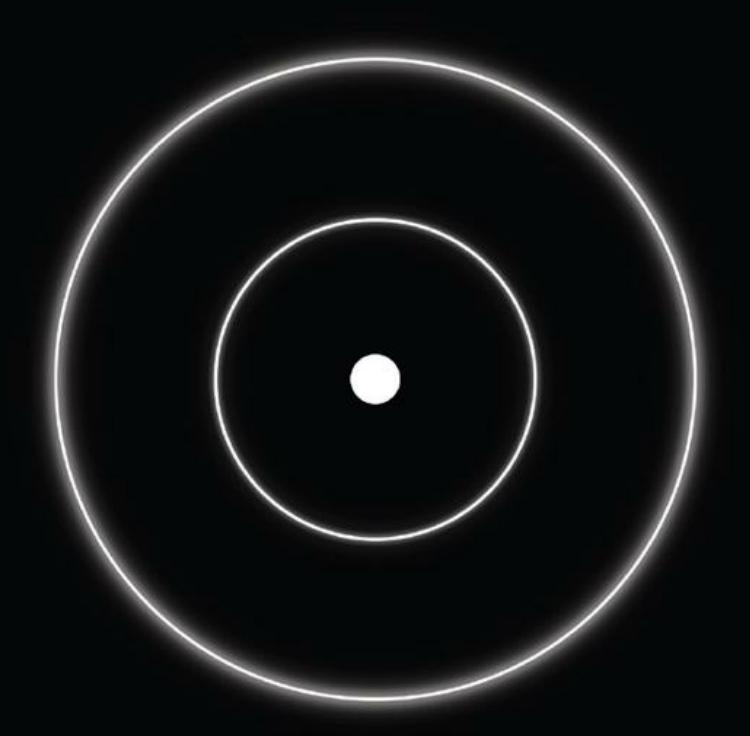

{6}------------------------------------------------

### THE ART OF FOCUS

A Practical Philosophy To Find Meaning, Reinvent Yourself & Create Your Ideal Future

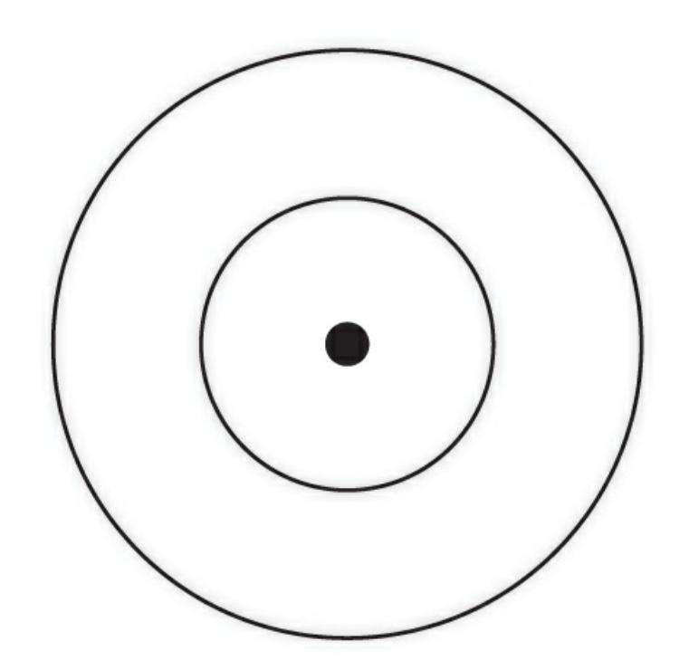

{7}------------------------------------------------

## THE ART OF FOCUS

A Practical Philosophy To Find Meaning, Reinvent Yourself & Create Your Ideal Future

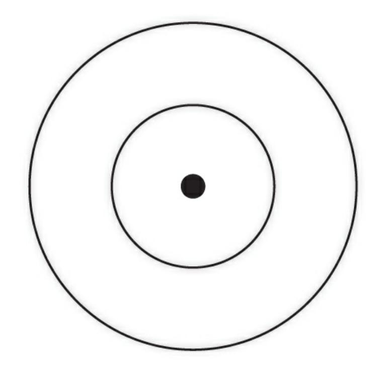

### **DAN KOE**

Copyright © 2023 Dan Koe. All rights reserved.

No part of this book may be used or reproduced in any manner whatsoever without written

{8}------------------------------------------------

permission of the publisher.

**ISBN** 

978-1-936961-14-6

Published by KOE Press

www.koepress.com

Printed in the United States of America

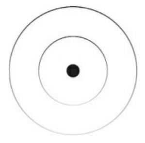

### **DEDICATION**

To the students, readers, and critics that allowed these ideas to come into existence. Thank you for the praise, attention, and feedback that has allowed my words to spread and change lives for the better.

### TABLE OF CONTENTS

**Foreword** 

**Introduction** 

### **I FIND MEANING**

**The Principles** 

The 3 Pillars

The Universe

### **II REINVENT YOURSELF**

The Self

The Game

The Lens

The Formula

{9}------------------------------------------------

### **III CREATE YOUR IDEAL FUTURE**

The Shift

The New Rich

The Skill Stack

The Project

The Vessel

**Resources & Inspiration** 

About the Author

The Meaning Behind the Symbol

Turn Yourself Into A Business

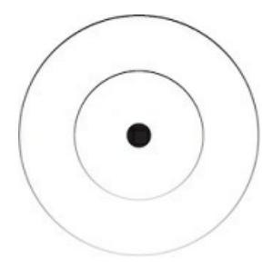

### **FOREWORD**

I met Dan Koe in between chapters of my life.

Everything seemed to be on the right track. Graduating from a top engineering university, landing a software engineering job with decent pay, benefits, and time flexibility, and finally being able to start my adult life.

But all the while, something inside me kept wondering when my life would actually begin.

I always imagined my life would "begin" after I finished college and started my career. But something still felt wrong. I still felt unfulfilled. My emptiness led to an identity crisis, a deep depression, and a search for meaning.

One day, I had the idea of creating internet content based on the psychology, neuroscience, and personal development knowledge I had been gaining over the past 2 years. My mission was to synthesize science-based, self-improvement guides to help people overcome similar problems I've faced.

That decision led me to Dan.

{10}------------------------------------------------

Dan was the first person to reach out to me on social media. We were in a networking group chat, and that group chat eventually dissolved as many do, but Dan and I kept in touch. Many people have come and gone from my professional network, but Dan is one of the few I talk to almost every day.

I'm proud to call him a mentor, a business partner, and a close friend.

I didn't agree with some of Dan's perspectives when I first met him. I came from an engineering background and had been self-educating in cognitive science for a few years. Dan was, in a way, the opposite of me, with perspectives rooted in philosophy and spirituality. I believed the science I had studied was more reliable than the seemingly woo-woo nonsense Dan was interested in.

I can't recall a specific disagreement we had, but I do remember at first thinking Dan was just another spirituality bro like the many I had encountered in passing at electronic music concerts. I knew he was exceptionally intelligent and he was skilled at eloquently explaining his perspectives, but a part of me harbored a quiet sense of superiority due to my scientific approach to productivity, fulfillment, and self-actualization.

Over time, as I listened to Dan and dipped my toes in the waters of the

"other side," I began to see that what I had learned was not an opposite or necessarily superior perspective, but instead, it was merely a different one.

Dan and I had similar goals for both ourselves and our audiences we simply had different ways of going about achieving those goals.

The major catalyst of this perspective shift came during a conversation we were having along with our mutual friend, Justin C. Scott (who was also deep into philosophy and spirituality). I asked the question that bothered me most: *How else could a recommendation be made to another person if it was not proven to be replicable by rigorous studies in the traditional scientific sense?* 

The discussion that followed helped me realize that I wasn't a blind fanatic of Science™; I was, instead, an enthusiast of the scientific method, a never-ending trial and error, something Dan and I agreed on. Since that

discussion, I've invested time into studying what I thought was the "other side" so that I could become more well-rounded for myself, those close to me, and my online audience.

Thanks to Dan's friendship, support, and guidance, I've been able to grow a business that has finally provided a feeling of fulfillment in my life. If I had the book you hold in your hands back then, I would've seen that it was possible years earlier.

This book is a synthesis of years of Dan's learnings, experiences, and reflections. The first time I read the draft of the book, I was dumbfounded by the simultaneous depth and simplicity of its teachings. I'm not ashamed to admit I needed to read it a second time in its entirety before I felt like I grasped it enough to write this foreword.

Here's one of my favorite quotes from this book:

{11}------------------------------------------------

"Once you understand the game, you begin completing a series of quests – that form a storyline – to gain experience. As you gain experience, new opportunities become available to you. You unlock dungeons. You can join a guild. You can travel to new locations to complete different quests. In the real world, we often aren't aware of what these opportunities can be, so we choose to remain stagnant, comfortable, and ignorant."

This gamification approach speaks to me. As a former video game addict (and current Dungeons & Dragons Dungeon Master), I've enjoyed finding ways to think of my life more like some sort of a game — not to be won, which is impossible, but instead to be explored, enjoyed, and experienced as much as possible in the life we have now.

The book begins by painting a bleak picture of the average person, a picture of the person I was in the chapter of my life before I had the idea of becoming a creator, sharing my ideas, and starting a business. Though it may feel like criticism, this is a necessary wake-up call so that we might be better prepared for the lessons that come next.

Of course, the journey can be difficult. I've found myself battling sleepless nights, food and drink binges, and moments of seemingly hopeless despair.

But I've found that, almost always, those challenges arise not because of the nature of the "game," but instead, a lack of clarity about our next move.

Many of us feel trapped. We aren't happy, we aren't fulfilled, and we aren't progressing, just like I was a few years ago. This book gives you insights that can take years (or decades) to fully integrate through trial, error, and frustration.

You may need to read this book multiple times for its lessons to sink in. But that's okay. The greatest books always have something new to offer you each time you return to them. As you read, apply, and reflect, you'll find your perspective changing. You'll begin to find a path that will lead to freedom, happiness, and fulfillment for yourself and those you care about.

My friendship with Dan changed my life. The book you're about to read will change yours.

Joev Justice

Co-Founder of Kortex & Performance Consultant

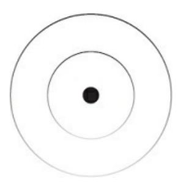

### **INTRODUCTION**

We are at a pivotal moment in human evolution. Attention spans are shrinking. Bodies are

{12}------------------------------------------------

getting softer. Minds are growing weaker. Some pockets are being drained while others are being filled a bit more than usual. Technological advancements are threatening the mindless, comfortable, and mechanical lives of the masses. It's becoming difficult to tell if I'm the crazy one or if everyone else is.

Wake up. Hit snooze 4 times. Stare at your phone. Roll out of bed. Make coffee. Sit in traffic. Eight hours of unfulfilling work. Sit in traffic . . .

again. Argue with your "significant" other. Walk the pet. Watch TV. Pass out. Repeat.

Get offended. Blame everyone but yourself. Tie your self-worth to radical ideologies. Accept everything at face value and question nothing. Expect free handouts for simply existing, no effort. Do what the authorities tell you. Go to school, get a job, retire at the ripe age of whatever it may be, no guarantees, with just the right amount of currency to survive until death.

Go through a painful experience. Find the light. Identify with it. Demonize anyone who questions that identity. Avoid the thought of any meaning, love, and consistent presence you had the potential of achieving in your life because that would require you to change.

What a life. A life I have lived multiple times, each one being shorter than the next. Many people say they enjoy this lifestyle, that they are fine living out the same day like an experimental TV drama. It seems like a peaceful existence, but one that I could never live. The thought of something more would eat me alive.

If the lifestyle illustrated above made you want to jump off a building, good. You picked up the right book. This is for those that hate the thought of ending up like everyone else. This book is for those that feel an internal sense of despair at the thought of an unlived life. This book is for those that know there is something more, but aren't sure what, when, where, why, or how. This book is for those that will not surrender the little sovereignty they have left to the default path that too many people accept and follow without question.

Who's to blame for this default path? You. We are not going to start this off by acting as if you can't make a conscious personal choice to change who you are, what you do, and how you do it. I do not believe that modern life is the result of bad intentions from government officials, corrupt politicians, mega-rich founders, and the outdated school system. You know, the people whose products fill your house, mind, and allow you to opt out of life's minor inconveniences, but only for a bit.

Instead, I believe we are right where we're supposed to be at this point in civilization. The turning point that separates the lions from the sheep. But this does not mean that the people, organizations, and institutions above do not have a bit too much influence over our daily actions. What's worse is how they can condition a population to think in black and white, when the magic happens in the gray, the unknown.

When it comes to the default path, I am here to give you a new perspective, a positive one. I am not proposing that you need to get rid of all electronics, quit all of your "bad" habits, or move out to the woods to live like a monk.

{13}------------------------------------------------

Instead, I am here to bring clarity in a time of external chaos, distraction, and opportunity overwhelm. I am here to help you join the rich. The New

Rich. The rich that don't care to be rich, and that's why they're rich in more domains than money.

My biggest fear with writing this book is that I will make it all about me, and less about you. So, for the sake of establishing perspective, I will talk about myself, but not for long.

My name is Dan Koe. I started this journey when I was twelve years old. I was gifted with the specific programming that led to me questioning how the world worked. Questioning how I could game the system. Questioning how I could get miles ahead of everyone else with minimal, focused effort.

Questioning why everyone lived out their lives unfulfilled, unhappy, overweight, and with an underwhelming amount of energy. Like their life force had been sucked out of them before they had a chance to pursue their gifts like I have mine.

I wanted autonomy above all. I was hyperobservant of my environment and how it impacted those residing in it. Friends. Family. Acquaintances.

Colleagues. Grocery store shoppers. Corporate professionals. All of them put off this sense of unease. A subtle projection of their deep internal state of unhappiness. They seemed to let momentary inconveniences turn into lifelong problems.

Telling my story is important because it shows that it is just like every other story: it has its ups, downs, lefts, and rights. The point wasn't to eradicate or amplify any emotional direction by force. The point was to become aware of experience as feedback and focus those resources toward the good life.

When I was forced to go to church and accept a belief system as law, that was strike 1. Strike 2 was when my peers told me what not to do, but when I questioned their logic, they danced in circles, regurgitating the same statements their parents and teachers had filled their minds with. Religion was the catalyst to my questioning but went on to fuel my pursuit of truth in the immaterial, material, and everything that lies between.

At the same time, my parents had picked up a new fitness routine, one of those DVD sets where you work out in front of your TV, and bought the

required equipment. I would sneak this equipment into my room at night with high hopes of creating the physique of a golden-era bodybuilder.

At some point along this journey, probably due to my obsession with fitness self-education, I became aware that the education system wasn't going to save me; that institutionalized education was a necessary evil that we should evolve away from.

I realized my curiosity and intuition were going to be the source of my potential success. I could not rely on a preset path to make an income doing something I enjoy. Nor could I rely on it to

{14}------------------------------------------------

teach me how to live a fulfilling, healthy, or worry-free life. The state of the modern world was the only evidence I needed to see this truth.

It started with being a silent observer. My parents would get home late, tired, ready to bicker at each other while watching the same show over and over until their marriage came to an end. This is not a dig at my parents. I am grateful that they stuck together for as long as they did to provide my siblings and me with an incredible childhood filled with adventurous vacations and their desire for us to succeed. I admire the people they have become despite their relationship struggles that I will never understand because I didn't, and never will, have access to their state of mind. The point is this: everyone seemed bitter. I understood that the average individual has their struggles, but they never seemed to try to solve the problems that were a detriment to more than their own well-being. Go to school, get a job, let whatever happens in that multi-decade time period happen, and retire in a way where you have no meaningful work to balance the eternal rest you craved for so long. That was the depressing song that played on repeat in the minds of the masses.

Taking matters into my own hands was the process that stemmed from my rebellion. I wanted quick results. If I could learn everything myself, what was stopping me from doing it in a fraction of the time it took compared to taking the conventional path? This is when the power of the digital world made itself apparent to me.

My eyes were glued to my computer screen for weeks, months, and years on end. I'd take breaks, of course, but all I could think about was all of the knowledge I lacked. Especially after feeling cheated by the conventional resources that were supposed to secure my future.

I spent my days absorbing all the information my focus could handle on fitness, finance, attraction, and perspectives of meaning, happiness, and fulfillment. Consciously experimenting with the best teacher I could find –

my own mind, body, spirit, and business.

Through countless bouts of trial and error, a decade of compounding returns on focus, and eliminating the possibility of failure from my mind, I have built something I am proud of: a life of meaning, money, and mastery.

At the age of twenty-six, I fill my days with activities I enjoy, I have created a sizeable income pursuing my life's work, and I have attained a degree of freedom that other millionaires of the world would die for. Some of them have said this to my face.

This did not come in an instant, of course. It took a decade of failures, minor successes, feeling hopeless and lost, with a nagging voice in the back of my mind whispering, "It's possible . . . you don't have to end up like the rest." This self-taught path brought me to success much faster than the traditional route would have, without the money cap.

On many occasions, I have met individuals who are quick to fill in the blanks of my story with theirs. When I mention my lifestyle and associated income, they are quick to favor coping over curiosity. Closing their minds off to the thought of their potential. I'm relieved to inform you that what I've achieved is not the product of an inheritance, nepotism, a wealthy family, random luck,

{15}------------------------------------------------

or a benefactor.

I'm an average guy that came from a middle-class, single-income family.

There is nothing special about what I have accomplished. I am not living in a different reality from the rest of the population. Even if I grew up on the other side of the world, I would still have access to the information, human experience, and mental ability to maneuver my way to this position. It may

have taken more time, yes, but that isn't a valid excuse. There doesn't seem to be a more worthwhile endeavor to dedicate your life to than to see what you are capable of.

The journey you are about to embark on is not for the faint-hearted. It is not an external journey, but an internal one. Not a material journey, but immaterial. Not a physical journey, but spiritual. If all I had was a socially accepted definition of a beautiful person of the opposite sex, an abundance of American currency, a nice machine on wheels, and an aesthetic form of my physical body, my life would be all looks and no depth. It would mean nothing. It would serve nothing. It would continue existing as nothing of true value.

I am writing this book as a map with faint lines. A map to getting paid for doing what you love, traveling the world, and doing whatever you want. A map to mental peace, meaningful pursuits, and fulfilling relationships. A map to becoming a self-sustaining, self-reliant, and sovereign individual.

Dualistically free. I want to give you the tools to a better life, let you crash and burn, and watch you create the light at the end of your own tunnel.

I cannot make this change for you. I cannot promise you a better life. I cannot make you do these things. I can only give you the lessons I've learned through living unconventionally. It is your job to take these lessons, experience them for yourself, and make your own decisions. Do not by any means outsource your thinking, decision-making, or potential success to these teachings. I will be one of the first to tell you to quadruple your expectations for how long you think it will take. It will take your entire life, because that's the point of it. This is a tool, a guide, an art and should be treated as such.

### A WORLD OF DISTRACTIONS

Do you want your time, attention, and life-changing experiences stolen from you? Are you okay with sitting by, being a slave to modern distractions that have been laid out like breadcrumbs, leading to a life of

drained pockets, zapped neurochemistry, abysmal energy levels, and the gradual destruction of anything meaningful in your life? Are you okay with continuing the never-ending search for "safe," "secure," and "pleasurable"

experiences that leave you with the opposite feelings?

This is the life of the modern human. Walking down an undefined path with mouths open, minds

{16}------------------------------------------------

off, and shopping carts – physical and digital – filled with doses that should be considered poison. All while playing a character operating on inconducive and unfiltered information, playing the role they've been molded to play.

As a collective, we are suppressing our choice to improve so we can continue being spoon-fed pleasurable, numbing, and artificial experiences.

Some may think that there is a puppet master hiding behind the state of the modern world, conspiring to create hell on Earth. In reality, it is the individual's inability to understand their nature and use it to adapt to the rapid advancements of our time.

The modern world – more so Western society – is designed not by man, but by years of evolution to keep you in chains. A slave to the system. A drooling bag of bones that craves instant gratification, free handouts, and constant stimulation. This is what our psyche craves, and never has it been so available. Mental mastery must become a top priority so that you can adapt to the times.

Our choices are not our own, and our choices create who we are. The familiarity we have adopted into our lives digs us deeper into the hole of mediocrity. Those that dare challenge this narrative carry the heaviest burden. If you choose to embark on this path, you will be criticized, mocked, and cut off.

Your beliefs will be challenged. Your transformation will be painful.

However, this is the only worthwhile path. I am being dramatic here, and there is a reason behind that. Exaggeration is useful to get the essence of the situation across, because that indeed can be more dangerous than my bold

assumptions. I am going to make mediocrity so repulsive that you have no choice but to use your gift of creation.

Everywhere you turn, there are distractions that lead you further away from who you are and who you want to become. Processed food is dangled in front of your face like you are a lab rat. People with misaligned goals flood you with invitations to test how important your own are.

Our souls are being sucked out of us from fluorescent-lit cubicles. We have no sense of meaning and little drive to pursue our life's work. We stick to short-term goals just to free up enough space for us to return to the activities that are killing us, not in an absolutely physical manner, but a holistic one. Mind, body, spirit, and business under the lens of your life's work.

My intention is not to paint these things as bad. Bad is relative, and oftentimes these modern "poisons" are useful, necessary, and fun, but not as an eternal day-to-day lifestyle. The ability to moderate is cultivated with experience, but moderation is difficult without awareness, education, and forward progress.

Illnesses are being diagnosed within the fifteen-minute time frame you are given to describe your symptoms. Pills are handed out like candy because people don't have the patience to implement simple lifestyle changes.

{17}------------------------------------------------

"Trusted" information is paid for, marketed, and perfectly designed to grab your attention, polarize you, and keep you in a state of negativity, even if it is not their intention.

Mainstream advice encourages you to do everything but improve your life.

And if they encourage you to do so, it is in the form of attaching to and defending their ideology. Few people are questioning said information or looking where the money *isn't* flowing. Everybody has access to the internet and the ability to spread their negative opinion like wildfire.

We tap into our innate negativity bias, fry our dopamine receptors, and tie ourselves to our lightboxes, straying further from what is. Those that have

the ability to think for themselves quickly realize that they are being manipulated.

When people hear the word "work," they cower in fear, hoping that the weekend will extend a few days so they can cuddle up on the couch until further notice. When people hear the word "rest," they grab an unhealthy snack, pour some fermented grape juice, and fall into a vegetative state, hoping that they never have to come out.

The concept of one's "life's work" has been lost by all but those who learn to focus. Everyone has been made to believe that their life is out of their control, that there is a set path to follow that will result in eventual happiness.

They think that if they stick it out long enough, they will reach what everyone is searching for: freedom. Even then, the general perception of freedom is to avoid all work, immerse themselves in "rest," and live out their days as if they were fulfilled by creating nothing by their own desire.

This is backwards. You cannot understand freedom if you do not conquer what made you a slave.

I do not believe people are miserable. Maybe at times, like everyone else, but I do believe that the majority of people are on a perpetual spectrum of dissatisfaction with their lives. There is a deep, inner voice calling out that is suppressed by a veil of responsibilities, excuses, and perceived uncertainty.

Due to this, the masses remain unaware of their potential, and I am aware that I cannot save them all. They have not taken that first step into the unknown, and who knows if they ever will. The difference between you and them is this book. If you do not have the awareness of the possibility of a better life, it is impossible for such a future to actualize.

I am not saying this to destroy all hope you had for a better life. The system may be rigged against you, but that's the thing. With the advancements in technology, medicine, and decentralization, anybody can build wealth,

leverage, and an overwhelming sense of satisfaction in life. All they need to do is learn how to focus in this beautiful black hole of distractions.

### WHY FOCUS?

{18}------------------------------------------------

Humans can process 10–50 bits of information per second with their conscious attention. The what, how, and why behind that information we choose to process will determine our quality of life. That is, what we hold in our attention, how we interpret that information, and why we gave it our attention in the first place is of utmost importance. Focus is attention with intention.

Your mind is a set of complex systems, like a supercomputer. Even though I do not believe this is a metaphor that can explain the full complexity of consciousness, it helps illustrate a point. Like how a computer can slow down when you have too many tasks, tabs, apps, or other programs running, so can your mind. When your attention is split, or your focus is fragmented, suffering increases in potentiality.

When our mind is not engaged with being or doing, we allow random thoughts to register in our awareness. "Random" in this case does not mean half good thoughts and half bad thoughts. For every one good thought, there are a hundred bad ones. When you think of good health, there is one outcome: good health. But when a random negative thought about your heavy heartbeat sneaks in, chaos ensues.

One thought about your heart can lead to thoughts about heart disease, incorporating a time-consuming exercise routine, and all the food choices you make that splinter into 10 more negative thoughts about the side effects of each. Controlling the information that you hold in your focus is the key to overcoming the anxiety, boredom, stress, and overwhelm that plague today's society.

While the conscious mind can focus on a limited set of thoughts and actions, the unconscious mind can manage eleven million bits of

information per second. This includes our habits, reactions, breathing, chewing, walking, and everything else that we don't have to "pay" attention to, because we've practiced those skills.

While much of our unconscious is a result of our mental programming and centuries of evolution, our conscious mind still plays a large role in forming what information our unconscious mind can manage. The depth, wholeness, and state of your focus will determine the entirety of your life. The enjoyment, the suffering, the progress, and the success.

After a decade of trying to form good habits, instill energizing routines, become a social savant, make money outside of a conventional job, calm the thoughts in my head, and anything else that would result in a higher quality of life – I realized there was something missing.

There was a flaw in the modern methods that people were using to improve their lives. Forming good habits is powerful, but what is the resistance behind forming good habits? Putting yourself in social situations to bust out of your nervous shell is solid advice, but what would make that process seamless? Making money in a creative, leverageable fashion sounds like a dream even when many have done it, but what is the catalyst?

You see, I love to question things. I hope you grow to love it as well. I wanted to build from the ground up. I wanted to find the source of it all. I wanted to go to the beginning of the beginning. To my own surprise, I found what I was looking for. I am here to share this fusion of ideas with you.

{19}------------------------------------------------

My goal is to equip you with the tools necessary to change your life. Not in a cliché motivational way, but in a way where you have a sense of certainty and control over your future while being satisfied and whole in the present.

There is more to focus than you think.

It is not something that is only utilized when it's time to work. Your focus is the only thing you have control over. It influences your thoughts, emotions, actions, and the positive or negative direction of them all. If you do not focus on one thing that brings awareness to the next, you may not create the

chain reaction that allows for certain thoughts, emotions, and actions. Your long-term and short-term options are created by when, where, on what, how, and why you focus your attention.

Focus influences the quality, impact, and virality of your work. Focus is the start of all things good. Habits, routines, goals, health, relationships, finances, mood, and sense of purpose. All the things that you know hold power but can't seem to reap the benefits from.

You are not a unique case. I was in a similar position. My clients, customers, and peers were in a similar place. Focus is the solution to it all.

This is not an overnight process, but it is worth the lifetime of benefits you will receive.

We are attacking the root cause of your problems through focus. The rest will fall into place, because you would only be able to change them if you first brought your attention to them. And without prior attention, like the investment you are giving this book, you may not have realized a crevice of reality where your attention could go.

I am not going to give you advice like "make your bed every morning,"

because one, I have never made my bed a day in my life beyond when I was forced to as a child or had guests over at my place. Two, it has merit, but misses the point. Making your bed every morning is powerful because of the fact that conscious attention orders the mind. An ordered mind is a happy one and starting your day on that note can build momentum into the rest.

Focus is what separates action from distraction. Focus is what separates meaning from meaningless. Focus is what separates working toward your goals from stressing about not being invited to your second-cousin's birthday party. Focus is the habit of habits.

You cannot build good habits in all areas of your life without understanding what caused the bad habits in the first place. Focus has a compounding effect. At any given minute, second, millisecond, or moment – your focus is

channeled. To what degree is dependent on your mental energy and experience.

### WHAT TO EXPECT

I have written this book to be as cyclical as life is. You can read it 1, 2, 3, or 4 times and make a

{20}------------------------------------------------

discovery you hadn't before. Some teachings in later chapters aren't comprehensible without the early chapters, and vice versa.

This is my holistic philosophy for better living. I do not intend for it to be presented as dogma. For that reason, I cannot stress critical thought enough.

This book does not read in any specific order. You can open a page, pick a line, and extract a lesson from it, even if it takes a decade to experience that lesson in your daily life. A lot of the information will be the same but presented from various perspectives to aid in understanding.

Each section will provide a different lesson, yet that lesson will connect to other sections. I would encourage you to be conscious of this and note them down when the avalanche of insight strikes.

My first and main teaching is to question everything I write, but to do so with an open mind. You have full permission to take my ideas, make them better, and use them to fuel your creations. But do not take the ideas without the intention to experience them.

I encourage you to put my ideas to the test. Research all sides of the topic available. Try to prove me wrong, but do not rely on conceptual knowledge.

You must implement my ideas through action, filter them through direct experience, and seek to understand.

There will be ideas and topics that I do not go over in depth. This is intentional. I am leaving out details like my personal methods that are subject to change in the next decade. These methods, systems, and strategies can be found in the free content on my website, in my courses, and in other internet content.

Aside from my methods being with the times, the other reason I refuse to include them is that my joy in life came from creating these methods. As you will find, testing new techniques, forging your own path, and "figuring it out" are deeply spiritual experiences. And there's psychological data that displays its effect on the brain. Without getting too technical, it feels incredible to build your own thing.

This book contains big ideas, not technical details, as those are of much less importance. I want you to approach these ideas with the intent of action.

Everyone has a mind that bounces between different states, and the ideas will lead to various results dependent on individual practice and interpretation.

For the rest of this book, I ask that you set aside your desire to react, judge, and close your mind in an instant if something does not align with your worldview. Seek to observe and understand regardless of their applicability to your ever-changing niche of a situation. They may not apply to you now, but you may realize their importance later in life.

There are enough incredible books out there on spirituality, emotional management, creating a better life, productivity, creativity, and lifestyle design. So, do not suppress your curiosity to

{21}------------------------------------------------

explore more teachings.

I'm here to lay out the pieces of the Universal puzzle. It's up to you to piece them together in your own endeavors. I am not going to prove anything to you, as that is impossible, and proof is in second order to experience. Only you can allow the ideas into your mind and choose to react to them in a way that inflicts self-harm. "Self-help" is just that: you interpret my ideas according to your perspective and implement them into your own story.

This book contains a lot of "whats" and "whys," but only a few "hows."

While I understand your desire for a quick-fix step-by-step action plan, you must realize that nobody can give you the perfect one. If they can, you can be replaced, or you will find that the methods fall apart with time, and you will still have to create your own. Simple as that.

Instead, you must become aware of the "what," internalize the "why," and start with what you know. Through trial and error – the essence of science, life, and progress – you create your own "how." If you would like, you can then pass that "how" down to others, potentially in exchange for money in a world that is desperate for holistic solutions.

You may have purchased this book to learn, but learning is a personal matter. It implies a back and forth of success and failure. I beg of you, please do not seek to outsource your ability to learn to the words in this text. That is but another embodiment of the quick-fix mindset. Aim for mastery, not misery.

To begin, we will paint a philosophical description of life itself. And since the external reflects the internal, we will use that knowledge to navigate and reprogram the self to flow in alignment with life.

Next, we will understand and structure the mind in a manner that is conducive to maximum enjoyment. From this place of understanding, you will be able to navigate tasks, problems, and situations from a higher perspective. One that allows you to make better choices. That's all that practical life is, a series of choices that compound into either a fulfilling or miserable life.

Lastly, I will give you the tools to become irreplaceable in the third millennium. That is, to leverage the character you have created by pursuing your purpose, discovering your life's work, and passing down your lessons as the trifecta of The Good Life.

{22}------------------------------------------------

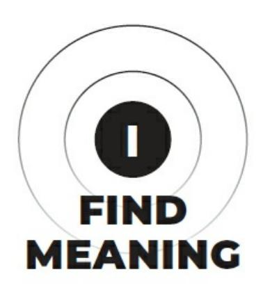

{23}------------------------------------------------

{24}------------------------------------------------

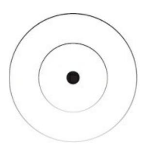

### THE PRINCIPLES

Beginners find value in methods because they offer certainty. Step-by-step action plans to achieve a specific end result sound promising, but if it were as easy as following a blog article of actionable steps, everyone would be happy, wealthy, and wise.

Masters, on the other hand, rarely need methods given to them. They prioritize high-level understanding, experiment with various techniques, and craft a strategy that allows them to navigate large and small situations with grace.

Before we dive into the meat of this book, I want to give a rapid-fire explanation of the principles that will act as a foundation for the lessons you are about to receive. As you progress through the teachings, read with intention. Make an effort to connect the principles to the theory and accompanying practices.

These are the tenets of the system that this book presents to create a good life. Note that this is a system, and it may not plug into your life like the design of an electrical outlet. Question what I say, question your own answer, and dance in the middle without labeling one interpretation as absolute.

### THE SUPREME LAW

Entropy is the supreme law of the universe, which illustrates that systems tend toward disorder, chaos, and destruction on all planes of existence unless energy is put into the system.

Like how the roads get beaten down, need replacement, and may need to expand to fit a growing population. If the system does not evolve with the world, chaos ensues until a new system emerges.

### **SYSTEMS THINKING**

Systems thinking has many definitions. In this book, we will define it as efficient thought processes. When you understand the goal, process, and variables of any situation, your mind can perceive that situation in a manner that is conducive toward your desired outcome.

While roads get beaten down and need replacement over time, so does the mental system that you use to make sense of that road. If you walk to the local grocery store every other day, your mind forms grooves to preserve energy because you don't need to think about where you are walking. But if you were to move across the country, the system would be destroyed, and you may get anxious until you find a new path to solidify your routine.

{25}------------------------------------------------

### PSYCHIC ENTROPY

In our daily practical lives, the main problem is that of mental disorder. Not the kind that can be diagnosed and offered a prescription, but a state of chaos that we often fall into. Stress, overwhelm, and anxiety culminate to the point of feeling lost with no light at the end of the tunnel. To this point we can thank a lack of engagement with the present moment that allows random thoughts to penetrate our awareness.

Clarity is your savior, and we must prioritize programming, maintaining, and evolving the systems our mind runs on.

### **CONTENT IN CONSCIOUSNESS**

Everything is information, or form, that arises in consciousness. Everything is in and out of formation, as the Buddhist principle of impermanence would hint at. From our genetic code to the language we speak to the light frequencies we perceive to any "thing" we can label, the structure of the information that fills our consciousness impacts how we move in the world.

Consciousness is like water that takes the form of content in the structure of a cup. Routines, rituals, business systems, relationship tactics, sports, other self-help advice, and spiritual teachings allow individuals to prevent their mind's decline into chaos for the temporary amount of time that they hold that form within consciousness.

It is impossible to bind water in a paper envelope. And in a situation like this, you will either lose the enjoyable clarity you had as time progresses, or you will waste precious energy refilling the paper envelope. Instead, it makes sense to maintain clarity by remaining conscious, intentional, and mindful of the information we expose to our mind.

### **ZOOMING OUT**

To zoom out, like a camera, is to broaden your perspective to interpret a situation for what it is. Your perspective determines how you perceive, like focusing a camera's lens, both the cup and the water. That is, to not get trapped in the potentially negative details of a situation that prevents progress.

There may not be 1 cup, but 10. And there may only be 1 cup with an infinite number of cups inside of it. The further you zoom out, the more you

can expand consciousness, or the water, to flow with life, rather than being bound by the limitations of a small cup.

### **SELF-EXPERIMENTATION**

Self-experimentation is not only the way to solve your problems for good, but to make novel discoveries. Experimentation leads to true experience, and true experience is how you differentiate yourself in the marketplace.

A doctor can diagnose and prescribe a solution to your problem that he thinks will work. But that

{26}------------------------------------------------

solution is often artificial, doesn't attack the root cause, and creates new problems. If it can be prescribed, its results are temporary.

### INTELLIGENT IMITATION

As children, we learned through imitation. We imitate everything around us for the sake of survival. Some end up with more problems, some end up with less, but we all end up in a place that can be improved.

The way you begin to move in a life direction is to make a conscious change in the people, environments, and information that you are exposed to. By immersing yourself in the stimuli that is conducive to your ideal future, you pick up subtle hints that compound into useful knowledge. But, of course, this knowledge must evolve into understanding through conscious action.

### RADICAL OPEN-MINDEDNESS

When you entered this world, you knew nothing. You explored reality with an open-mind and our child-like wonder reflected that. For most people,

others projected their dogmatic worldview on them while further exploration was discouraged.

Nobody wants to cut themselves off from great discoveries, insights, and truths, but that's what social conditioning does. We accept and attach to the limits projected on us.

Life is counterintuitive in nature. Some of the deepest truths are hidden under what seems to be silly on the surface. Open-mindedness is how you explore the depths, while most people exist on the surface.

### **OBSERVE & QUESTION**

Observation is perception without an immediate or reactionary interpretation. When you observe and question, you begin to understand a situation from a big-picture perspective. Only from that vantage point can you make a decision that benefits your future in a way that is the least harmful to others.

No idea is too sacred to question, and the more sacred it seems, the more it should be questioned. Question the things that people make you think you are crazy for questioning. That is the beginning of many inspiring origin stories.

### JUDGMENT VS DISCERNMENT

Don't judge things that you have not experienced. This should be obvious, but we live in a world of armchair philosophers, scientists, and businesspeople.

You will never have access to another person's state of mind. You don't understand their situation and you will never have the full picture. Don't judge but observe and discern so you can correct your own behavior accordingly.

{27}------------------------------------------------

### **EXPECTATION VS REALITY**

The space between expectation and reality is tension, pain, and suffering.

We often interpret a situation as difficult when it isn't supposed to be any other way. It is what it is, and once you experience this profound truth, life becomes sustainably more enjoyable.

Your expectations of what things should be is not the reality that is in formation. A similar distinction would be that of concept compared to experience, or the map compared to the territory.

The concepts of God, Brahman, Infinity, or The Universe are not those things. A concept is used to label an *experience*, yet people latch onto concepts and act like they understand to survive the identity they've formed. Being comes before knowing, and permanent knowing is an inaccurate representation of the impermanence of being.

### RADICAL ACCEPTANCE

Things aren't supposed to be anything other than what they are, and once you accept this, expectation aligns with reality. Focus is no longer split but engaged with the present moment.

Whether you are climbing Mount Everest, arguing with your partner, or losing money in your business, there is nothing you can think that will change the situation. Instead, you must align and act.

### KNOWLEDGE VS UNDERSTANDING

One can know a lot but understand very little. Knowledge is constructed upward, while understanding is discovered inward. Both are useful, but to think that knowledge will make you happy, healthy, and wise is a fool's endeavor.

Knowledge must be acquired, but in order to understand, it must be brushed up against reality to see if it holds its weight. One can philosophize, fabricate, and hold hard-set beliefs by sitting behind a screen. But can they run a business? Nurture a relationship? Or apply their knowledge to the times they live in?

### **REALITY EXPLORATION**

It is obvious that the only way to make novel discoveries, creations, and innovations is to embrace the unknown, preferably with curiosity as your driver toward a meaningful goal.

If you want to live a life that has not been lived, you cannot follow the default path that is laid in front of you at birth. The sooner you realize this, the sooner you can wrestle with the fear of doing what you want and win.

### HOLISTIC SYNTHESIS

At this point in time, niche compartments of reality have been explored, studied, and

{28}------------------------------------------------

documented. The school system is structured to train people into these compartments like chemistry, neuroscience, and literature.

Reality is not compartmentalized. Everything is connected, and there are infinite connections to be made. The world needs more polymaths, autodidacts, and modern Renaissance men to further the unity of human consciousness.

### CREATIVITY VS PRODUCTIVITY

Humans are not robots. The creative ability of our minds is what separates us from other beings, so we must prioritize that edge. Too many people get

bogged down with the pursuit of status to be more productive than their peers.

Instead, we want to leverage the efficiency of our minds, systemize mechanical tasks to take up the least amount of time in our day, and make time for creative pursuits.

The greatest artists, thinkers, and scientists did not impact the world by performing the same repetitive, manual, and replaceable tasks day after day.

They prioritized rest, sought to expand their minds, and prioritized creativity to solve big problems.

### **STORYTELLING**

Stories house the components that form the foundation of human behavior.

Like a good book, life unfolds in chapters and phases. There is a problem, call to adventure, curiosity, exploration of the unknown, struggle, insight, transformation, solution, climax, and more that happen more than once over the course of a lifetime.

The problem is that most people are either distracted or stuck in a phase because they lack the ability to see the big picture. Nobody wants to get lost in the unknown and everybody wants to sustain the climax. This is a recipe for disaster.

### **FAILURE & STRUGGLE**

Success cannot exist without failure; it just wouldn't make sense. Without failure, you would have nothing of your own worth working toward. You can observe the achievements of others and desire for the same, but the pursuit of another's goals signals a lack of regard for the importance of one's own.

Failure and struggle are necessary experiences from which you can toss an anchor and pull yourself toward a better future. This way you don't end up living someone else's life, one that you are near guaranteed to dislike.

### ITERATION & PERSISTENCE

Value requires development over time. A profitable product is not built in a week, nor is a strong

{29}------------------------------------------------

body. Even though you may only see someone's happy ending of their story, that does not mean they weren't committed for years prior.

It is wise to try new things, and I would recommend adopting that habit, but you need a project to develop. Without a tangible vessel for your knowledge, skill acquisition, and discoveries, you may end up with years of energy spent with nothing to show for it.

### **POLARITY**

Reality is not black and white. A coin is not heads or tails. A human is not happy or sad. Those are but temporary dualities that the mind attempts to make permanent with labels, concepts, and ideologies.

Instead, view 2 sides of the same coin as just that. They have their opposites but are bound by relationship. Success is a higher state on the spectrum of failure and vice versa.

Form would not make sense without space. When you flip the design of a tapestry, you see the ugly mess that lies underneath.

### **HUNTING FOR HOLISM**

Reality is perspective, and your perspective is but one of infinite. Often our point of view determines the positive or negative interpretation of a situation, as when someone else can come in with an equally valid perspective but the opposite interpretation.

If you are a truth seeker, your job is to hunt for kernels of truth in every perspective, even those that aren't human. This forces you to reject all ideology, dogma, or belief system that even the masters may hold as absolute truth.

This is the only path to sustainable peace, enjoyment, and wisdom.

### EGO DEVELOPMENT

You don't get rid of the ego; you develop it to the point of being at one with reality. It is often for us to assume that we want to "kill the ego," or "kill desire," when that is simply part of what it desires.

Instead, we want to transcend and include. That is to use the ego to navigate the relative world we live in while grounded in the absolute.

### LEVEL OF MIND

Every problem you encounter in life demands an increase in your level of mind. Your level of mind is synonymous with the openness of your perspective. You must shed your attachment to expectations, concepts, and beliefs that prevent you from perceiving any situation for what it is.

When you can perceive a situation for what it is, you can acquire the skill necessary to match the challenge that a problem presents. This is done with self-education, self-experimentation, and

{30}------------------------------------------------

persistence to see that the problem is solved not by the prescription of another, but by your own understanding.

### CONCEPTUAL SURVIVAL

In this modern world, specifically for those reading this book, I can assume that your life is exponentially more comfortable than that of your ancestors, and it will only continue to move in that direction.

The human psyche is interesting in that we survive and reproduce on a conceptual level. We impregnate minds with ideas, those ideas create concepts, we may identify with those concepts, and our behavior shifts in alignment with those.

The self is the concept of concepts, and the majority of our actions are taken to survive the self.

### MASTERY OVER MISERY

A sushi chef spends years perfecting the preparation of rice. A tennis player obsesses over the angle of their serve. Mastery sets you apart in a world that can't see beyond the surface.

To the masters, repetition of the boring fundamentals is not boring. They have developed intrinsic philosophies and reasoning behind their actions.

They look forward to it every day, because they understand that nothing good comes from the quick fix.

### TACTICAL STRESS

Tactical stress is the conscious decision to break out of your familiar routine, put yourself in a do-or-die situation, and realize that the only thing stopping you from reaching the next level is fear.

If you have the skill to match the challenge, and are honest with yourself, all you need is to rip the bandage off. Not only will you make a leap in

progress, but peace, thanks to the level of mind the stress requires to mitigate.

In business, close the client even if you don't know with certainty that you can deliver results. In life, book the flight across the country even if you don't think you can afford it. Make the decision that requires you to finally execute reaching your next stage of evolution.

### SELFISHNESS AS A PRIORITY

Strip all judgments from your mind surrounding selfishness, as I'm assuming those were programmed into your head by the selfish desires of others. Self-education, self-reliance, self-experimentation, self-control, self-reflection, self-awareness, self-employment, and self-management. Those traits are to be prioritized.

If you *need* something from another, it is near impossible to act with authenticity. You will

{31}------------------------------------------------

unconsciously manipulate your language to get what you want from them with little regard to their life situation. And if you have not developed the value you have to offer, a "noble" pursuit of selflessness is only stunting both your growth and others.

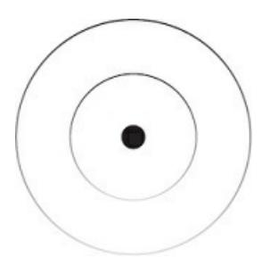

### THE 3 PILLARS

Let's imagine you are surrounded by the people you admire most. People that are successful by your standards. The ones that have impacted your life to the core. This is different for everyone, but I'm assuming this room would be filled with entrepreneurs, teachers, public figures, philosophers, intellectuals, and others that create, share, and shape culture with their ideas.

There is enough time to ask them one question, "If you could attribute your success to one thing, what would it be?"

A hobby of mine is to study the patterns of successful people. And thanks to social media, I've confirmed one pattern. Every successful person – by any standard, even if that version of success means rejecting the world and living a life of peace in the woods – knows that *focus* is the catalyst to the good life.

Through self-reflection, I've come to the same conclusion. Focus determined my success in all dimensions of life. Because focus is dimension-agnostic. It fueled my spiritual practice, business, relationships, health, writing, learning, and philosophical endeavors.

The ability to focus your attention on a meaningful goal, holding that in the back of your mind as a distraction repellent, knowing exactly how to

achieve it through prior experience, and refocusing on the choice in front of you is a superpower.

But we all know it's not that simple. Because if it were, you would be able to walk out of your front door and see a utopia. I'm not sure if we will ever create a collective utopia, but a personal one is a different story.

Focus is a muscle, and success is reserved for those that train it. Training, in this sense, is done at every passing moment. You are focusing your attention right now, and will continue to throughout your day, week, month, year, decade, and so on.

"Training" is synonymous with conditioning or programming. Conditioning is the engine that shapes our behaviors, thoughts, and emotions through focus. The key with all of these is conscious repetition. What we are repeatedly exposed to shapes who we are. For better or worse.

{32}------------------------------------------------

With the hope of sounding the least self-aggrandizing as I can, focus was the driving force of my success. By the age of twenty-five, I had built a one-person business that made more money than I could handle. So much so that I felt the urge to decrease my income, sell my fancy condo, return the expensive watches, but keep the fast car because why not, I'll let go of it when that time comes. I had as much free time as I desired (but would usually fill it with study because I enjoyed it so much). I was arguably more stable – in mind, body, spirit, and finances – than the world around me. If I started over from zero, my creative ability would allow me to build it back up in record time, in almost any situation.

In short, I had created multidimensional freedom through the compounding nature of focus.

If you are sold on this whole focus thing, good. That is the first step. But this isn't a promise that you can simply focus on becoming healthy, happy, and wise with hopes that your imagined reality will manifest.

Focus is the first pillar in a mental feedback loop that is woven into reality itself.

### I: FOCUS

Imagine having a spreadsheet that displayed how much attention you've invested in any given area of your life. Mind, body, spirit, and business that impact your relationship with the world and those around you. The spreadsheet would be a direct indicator of your quality of life.

Focus is a lost art in a distracted world. Not to mention, it is vastly misunderstood. It is not something limited to when you need to focus, like for a productive work session. It is active at any given moment. You are either focused on something or you aren't, and if you aren't, that is but a lower magnitude of focus until you reach the absolute.

Focus has a frame; we call this perspective or worldview. Perspective is malleable. You can transfer your consciousness to other beings, like your pet cat or dog, in search for understanding of their behavior. Through that perspective, we can interpret and form conclusions in the world through our sensory perceptions and past experiences.

I can narrow the focus of my finger and point at something microscopic. I can open the focus of my body and embrace the harmony of nature. I can filter certain smells through my nose and sounds through my ears. And when it comes to a nice dinner, I can pick apart a grainy texture from a salty liquid from a hint of rosemary. This is reality. An ever-flowing quality of experience.

Each of these external sensations triggers a series of thoughts, emotions, and memories. When I shift my focus inward, I can explore these entities. I can let thoughts trigger thoughts within a belief system. I can follow an emotion to a past experience. Then, I can picture that experience in vivid detail and, if I enjoyed that experience, I can add a brush stroke to the painting of the future I wish to create. From there, I can shift my focus outward once again, learn how to create that future through study, and narrow my attention on the work that will actualize said reality.

The entire journey we just took in the inner and outer world is fueled by attention. At any moment, a rogue thought from a painful past, future task that induces stress, or environmental

{33}------------------------------------------------

stimuli could snap your attention into an unconscious state.

Attention is the currency that runs the world. It is the foundation of existence. If it doesn't occupy your attention, it doesn't exist. And when you notice novelty, or something that may aid in your survival, your attention is drawn to it.

If our ancestors passed by a familiar bare bush every day, there is no reason to see it as important. But if that bush grew berries, someone would notice it on their next passing, by dopamine signaling its importance, and they would register that bush as a potential tool for later survival.

In a modern sense, businesses can only exchange money if attention comes first. Religions are only as powerful as the amount of people that give said beliefs attention. Corporate pyramids have more people with less power at the bottom, and less people with more power at the top. The top holds more power because attention-demanding tasks are delegated to those beneath them.

The captivating message of these societal entities reach our attention early in life, because they can be a tool for survival. But if we allow them to dominate our minds and control our focus, we may miss out on the depth that life has to offer.

The attention needed to make a decision can only be done after you give attention to a thought about that action. The thought of going to the bathroom pops in your head and you shift your attention toward walking to the bathroom. The thought can only occur when you have given attention to a prior experience, labeled that snapshot in time, and stored it for later use to aid in your survival. We take mental note of dangerous, important, and useful information from our environment.

As we execute certain attention patterns, like going to the bathroom, it becomes more efficient with time. These attention systems allow us to use

our limited conscious attention to learn more information, store more information, and create systems that conserve mental energy to repeat the process.

Focus compounds. And it is a great metric to know if you are on a meaningful path in life. True progress requires an ever-evolving shift in focus. If you are repeating the same monotonous tasks in life, it is safe to assume that life seems to lack fulfillment.

When you start, your survival needs will consume your attention until you solve the right problems in that domain. As you solve your money problems, you gain a bit more freedom. Your focus may shift to self-development, spirituality, or creating a more meaningful career. In business, your focus will shift priority during every stage. Beginner, intermediate, and advanced.

At the lowest levels of business, you're focused on learning, making mistakes, and cultivating the value you have to offer. At the highest levels, you get to choose the levers you want to focus on. Like writing for ninety minutes each morning. And if you don't like writing, you can outsource it and choose a more enjoyable way to focus your attention.

In modern slavery, where you can get trapped in one stage of the pyramid, challenges cease to

{34}------------------------------------------------

exist. Your life's work will require an ever-increasing level of challenge. The challenge will require a certain set of skills. As the complexity of your skill set increases, the perceived level of challenge stays within a narrow margin of difficulty.

Your hierarchy of goals, from the top down, ideal future to present action, will frame your focus in an indistractable manner. When you create and maintain this fickle mental clarity, you begin to flow with the cyclical nature of the Universe. This is what keeps life meaningful, interesting, and fulfilling.

### II: ENERGY

There is a phrase, "energy flows where attention goes," that has a mountain of depth behind it (as do most simple platitudes). Focus is not only a muscle that can be trained, but a currency that can be spent, and everyone is out to steal this most valuable resource rather than earn it.

In this third millennium, mental energy is the most valuable resource. For this book, we will define mental energy as a term that encapsulates the effects of attention, intention, and will that are amplified with consciousness. When you focus your mental energy, attention plays a huge role, but the intention may be misaligned, and the will nonexistent. Focus is the vessel for mental energy.

You can focus on a positive potential future through visualization and feel an increase in positive energy in your body. Think of the last enjoyable vacation you went on – does that spark any positive emotions for you?

What if you imagine yourself going back to that location in the future? The food you would eat. The people you would be around. The warm nights under the stars with a crackling fire casting a warm glow on the side of your face. Get specific. Can you feel the emotions associated with that experience?

This doesn't only apply to positive aspects of life, but negative. And due to the raw power of negative energy, this is where most people mentally reside. An inescapable cycle of past emotions being experienced in the present. Unable to focus that energy toward a positive outcome.

Specific goals demand a specific amount of mental energy to actualize. You can become aware of how this works with distractions in your life. They hold your attention, eliminate intention, and drain your will. But when you focus on something meaningful, it holds your attention through the clarity that comes from intention and generates will.

My point here is this: thoughts, emotions, goals, environments, art, tasks, conversations, experiences, and the rest trigger an energy that you can feel.

That is notable. Not in a pseudoscientific sense, but in a sense that can be directly experienced.

Let me introduce you to the supreme law of the Universe: entropy. Some call it "nature's tax," but in short, it is the measure of disorder in a system.

{35}------------------------------------------------

It is the driving force in evolution. The law of entropy finds that everything falls into chaos, or that nothing lasts forever. But there's always a chance to start all over again or a way for that system to evolve into something completely different.

No matter how much mental energy I use to keep my books in order on the shelf, entropy will take its grasp. Dust will accumulate, humidity will warp the spines, the changing seasons dry out pages. I can clean it, dust it, keep the temperature controlled, but after a while, entropy will take over.

Even further, and layering systems on top of systems, compare your home bookshelf to a public library. Entropy impacts individual books, but what about the system to organize those books?

At home, if you don't have a system in place to focus your mental energy, books will end up on the counter, at a friend's house, and on the coffee table. The books will become disorganized unless you attempt to maintain order.

In a library, there is more mental energy put toward managing the organization system. Employees filter, organize, and place books on the shelf so people can find them according to the group of expectations, or system, they hold in their mind. The organization keeps chaos at bay for both the organization and the individual. It allows for the efficient use of mental energy.

This is on the microscale. On the macroscale, these layers of systems will still come to an end. The employees will evolve to new positions or find new jobs altogether. People will grow old, books will fall apart, and efficient digital systems will take their place to extend the lifespan of order.

This does not reflect in just a library, but almost everything. Society itself is a system with uncountable physical, mental, and financial systems in place.

Culture, business, and personal lives all run on a layered set of systems that are fueled from the bottom up by focused mental energy. This is the fabric

of civilization. If everyone stopped what they were doing for a day, week, or even month, who knows what the world would look like.

No matter how efficient a system is, it will always fall to the law of entropy because the Universe is balanced with this push-pull tension of chaos and order, method and madness, entropy and negentropy. This does not mean that all is lost. It means that focus must shift with time to maintain a proper flow of mental energy in your life. Standing still is not an option, and if you don't choose where to place your focus, it will be chosen for you.

To understand this evolutionary process of survival, we must understand systems. A system is a group of components that work together to achieve a common goal.

Language is a system that helps humanity communicate, but it also plays a role in almost every other goal that can be achieved. Roads are a system for efficient transportation. These roads have evolved and become more efficient as problems revealed themselves.

{36}------------------------------------------------

Belief systems, like religious ideology, give people certainty going into an uncertain future. These teachings have been translated with the evolution of language to retain their impact. As systems degrade, problems pop up and our natural behavior is to solve these problems for the sake of survival. Not physical survival, but conceptual, to survive the systems that run civilization.

The mind is a complex set of systems that allows us to interact with reality.

Meaning, most of what we do, even if it's not for survival, is goal oriented.

Some of these goals are conscious, some aren't, and they all direct our focus and consume mental energy.

Now, there is a Universal pattern to notice here. Human behavior is influenced by a desirable goal, system to achieve that goal, and a problem that once made conscious pushes people to act. The degree of clarity that this process provides will influence how people perceive the goal. That is, whether it is worth pursuing or not.

We can consider this entire process a "hierarchy of goals." The desirable end goal is a given, but a system and accompanying problems house goals within themselves. When one spots a problem, a goal to solve that problem is implied. To reach that goal, clarity must bridge the gap with a series of goals, descending in order of execution, to order the mind and encourage action.

In a world where so few people set, and even fewer achieve, their own goals, one can piece together an argument that a new version of slavery has emerged after the Industrial Revolution. Not physical, but mental.

If you don't know what you want, you will be told what you want, and you will believe it. If you don't create a purpose, you will be assigned one. If you don't create a career, you will be assigned one. If you don't create a hierarchy of goals to invest your mental energy in, you will be assigned one, like climbing a corporate, religious, or status ladder just to realize you've wasted 80% of your life.

This is not a conspiracy theory, but the product of evolution that mental enslavement starts at birth. The interplay of culture, society, and survival place multiple hierarchies of goals in front of us. Go to school, get good grades, praise the god you subscribe to, watch the news to stay informed, and retire when you have enough to scrape by with the little time you have left. Question nothing and invest your mental energy in the "certain" system laid in front of you.

These are not bad, and are necessary stepping stones in many cases, but the point stands. It's no wonder so many people seem miserable. You don't need special glasses to see that. You can tap a few buttons on your phone and deduce what goals people are pursuing, the systems their minds are running on, and the superficial problems they take too seriously that result in misery.

Collective mental energy is what creates modern power. From the bottom up, key pillars of the external world's structure are fueled by unconscious attention, intention, and will.

When we pull from our experiences to know what we don't want, gain clarity on what we want,

{37}------------------------------------------------

and construct a personal hierarchy of goals to frame our focus, the potential for life enjoyment increases dramatically.

But if we don't want to be victims of mental entropy, we must create, improve, and allow for the evolution of systems to aid in our personal development. With experience, we can make these systems more efficient with time. The end goal: full control over where we focus our mental energy thanks to our ability to achieve personal goals, create efficient systems, and solve better problems.

### III: EXPERIENCE

Most people would agree that they want to maximize the enjoyment in their lives, but their actions do not reflect that. Happiness as a metric has been distorted, and pleasure isn't sustainable, so "enjoyment" is the word of choice here.

To sustain maximum enjoyment, you need ample experience. What is experience? It is what's right in front of you. Not a projection into the future. Not a reminisce on the past.

Everything outside of the present moment is not direct experience, but an experience of the experience, which can spiral into overthinking, overwhelm, and overanalysis. This can be useful in moderation with a tool like self-reflection, and should be a practice in your life, but you may miss out on the only thing that's real. Especially if you get sucked into the superficial pursuits of the materialist paradigm.

It's impossible to know with absolute certainty what the future holds. Yet, that's what the societal machine promises. The results are almost always unnecessary pain, suffering, and lack of passion for life itself. Why?

Because we project further away from the present, get lost in the details, and fabricate problems that have nothing to do with our next step. This is

the negative scenario of overimagination. Don't label any of this as "bad"

just yet.

It's possible to know what the past held and, through our self-reflective consciousness directed by an internal shift in focus, we can make quick and decisive choices toward a better future. This process becomes more accurate with time because we all have a starting point.

The start will be slow because you may be solving the wrong problem. But if you continue solving your own problems, or correcting your past mistakes, a positive future is inevitable. You will have to face problems that, when fixed, will threaten your conceptual understanding of who you are. Hold the intention in your mind to be open to change throughout this book.

The path of the problem solver, or value creator, is how you escape the world of replaceability. Fall in love with the challenge that problems present, from superficial to metaphysical, and your ideal future will create itself. This is the infinite game.

{38}------------------------------------------------

Direct experience is the only thing you can make sound conclusions on when it comes to *your* life. Intentional, conscious decision-making is how you notice the effect of your actions. If you made a mistake, did you notice that mistake? If you did, have you corrected your behavior? If correcting your behavior is difficult, what's the problem standing in the way of reaching the initial problem that sparked this introspection? That is how you slowly bring more enjoyment into your life. Through relentless and nonreactionary questioning, you are forced to face the reality of a situation.

I am not here to debate a topic as nuanced as which fad diet is better for the average individual. But if you identify with a diet ideology, follow that diet regardless of its destructive effect on your individual body, and continue to preach it as "the best," you are a slave to an ideal, rather than using direct experience as a self-corrective compass.

This applies to all domains of life, and I would encourage you to question the routines, regimens, and prescriptive advice you follow that may not be

conducive to the future you truly want. This could be a career path, business model, or even something as simple as your morning routine that you copied from a billionaire.

What is interesting with the first example is that a vegan who reads this will argue that the meat eater is the one destroying their body, while the meat eater will argue the opposite. My point here is to challenge your beliefs no matter what they are. Understand that we are all unique. Structured advice is useful for initial clarity and action but becomes unsustainable if you reject experience for the status that comes with a label like "vegan."

We don't differ too much in genetic code but our minds, worldview, biases, interests, goals, upbringing, geographical location, and all of the moment-to-moment inputs we've experienced is my point. There is no one-size-fits-all ideology. Direct experience as a priority is how you create optimal experiences for yourself, not others. Evolution is restricted by the unconscious individuals that don't take responsibility for their lives.

Every truth is a half-truth in the relative world, and every relative perspective points a finger toward the absolute. When you collect consciousness to broaden your perspective, or increase your level of mind, the profound reveals itself like a puzzle. One finite pixel in the image will show, and you will label that as fact, until you realize that one pixel was only a figment of an infinite masterpiece.

The essence of experience, life, and science is trial and error. You cannot take ideas, opinions, or advice as law without the filter of direct experience.

Even if that advice is my own. When reading this book, hold all of what I say in the realm of possibility until filtered through direct experience.

You need to make mistakes through action: identify problems, solve them, and make your process more efficient by creating a system that you can follow, spot novel problems, fix them as they arise, and evolve when the system inevitably loses its power to get results. Systems allow us to invest our mental energy in a more efficient manner through problem-solving on the path toward our goals.

{39}------------------------------------------------

If these goals, systems, and problems along the way are not conscious, you can imagine the consequences. Humans are creatures of habit. Without a conscious goal, we will pursue one that makes survival seem easy and comfortable, leading to expectations that don't align with reality. Without a conscious system, we will adopt the habits, beliefs, and opinions of those around us and utilize them to reinforce our unconscious path in life.

Without making the problems that arise conscious, we will adopt a victim mentality, reject our ability to change who we are, and have our attention manhandled by others' goals.

Without questioning our path in life, the "safe and secure" route that is marketed to us at birth and beyond will become the default option. Beliefs are conditioned into our habit-loving brains. Beliefs influence our thoughts.

How we interpret those thoughts influences our state of mind. Our state of mind influences our actions. Our actions compound into our future self. Our future self may not be one of our own creation, and that is the source of the concept of evil.

We will circle back to experience later. We have a lot of work to do in the meantime. Until then, know that direct experience is king. Start identifying your problems that make life less enjoyable. Seek to understand how you can fix those problems. When you do, learn how to fix them, and fall in love with this process. Success in life, business, relationships, and health is about solving a never-ending string of problems that gets better – and more rewarding – with time.

### THE HUMAN CONDITION

Human life is smack in the middle, evolutionarily speaking, of animal and spirit. The mind is both the difference and the bridge. Your day-to-day actions are either pushing you forward or backward. We have the choice to transcend our survival needs from a place of unrealized potential.

You have 2 options in this life: create something bigger than yourself and let it impact the world, or regress into your animalistic nature of reaction,

viciousness, and lack of reason. Every situation presents 2 difficult options.

Both will result in criticism and pain, but the outcomes are vastly different.

Struggle is a guarantee, but the direction in which it leads is yours and yours alone.

Animals are driven to survive with the information in their genetic code.

We are as well, but we have the added drive to survive the information in our consciousness. That is, we attempt to replicate our concept of self.

Animals do not have such a complex sense of self that goes on to build cities, manipulate the masses, and create art the influences generations.

With this awareness, the future of civilization depends on the selves we create and replicate over

{40}------------------------------------------------

the centuries. By pursuing something greater than yourself, the future is bright.

There seems to be 2 polar ends of focus that result in an above-average experience. (1) Radical narrow focus on the task in front of you. Doing. (2) Radical open focus that grasps at nothing. Being. While both can be goal oriented, neither are focused outside of the present moment. The Greeks made the distinction between "telic" and "atelic" activities. That is, activities that have a goal and activities that don't.

Peak experience occurs when these 2 ends of the spectrum collapse into one. You may have experienced this before when you become obsessed with a certain skill, task, or goal to the point where you detach from the outcome and focus on the process.

Mihaly Csikszentmihalyi, a best-selling author and evolutionary psychologist, often talks about "autotelic" activities. This term derives from the Greek words "auto," meaning self, and "telos," meaning goal. Autotelic activities are self-contained. They are done without expectation of a desired outcome. The reward is in the contradictory nature of the activity that combines both absolute being and absolute doing. This is what we are here to dissect, discuss, and replicate in your life. The key to maximum enjoyment is to be where you want to be while doing what you want to do.

This spectrum can be found in your direct experience when you seek to see beyond the surface that you've grown accustomed to. But the experience throughout the range of narrow and open focus is not always one that feels good.

You can experience this range from an unconscious or conscious state of mind. Unconscious, meaning not by your free will. An automatic reaction as your attention is occupied by tasks, thoughts, and emotions that don't pass through an awareness filter. Conscious, meaning you are aware of where your attention is in the given moment. In the conscious state of mind, thoughts and emotions are perceived as feedback, not your master.

*Unconscious narrow focus* leads to feelings like stress, anxiety, and annoyance. Like when a rogue thought about a stressful future pops into your head. Your focus narrows and you experience the stress that you would feel in that future experience. You are projecting into the future and pulling that experience into the now.

*Unconscious open focus* leads to feeling lost, overwhelmed, and uncertain.

If you project into a future that you don't have clarity to reach, the task of consistent execution seems daunting. Your mind begins to open toward a state of chaos, and your attention bounces between past, present, and future without an intention to piece together a solution.

Conscious narrow focus leads to degrees of a flow state, deep work, and efficiency. We've all experienced this when we have clarity on facing the challenge that a task presents, one that you have the skill to complete.

Conscious open focus leads to creativity, relaxation, and a sense of peace. A state where you do not attach to any of the potential thoughts, ideas, emotions, or limits that can pass through your awareness. Think about the last time you were in nature, worry free, and felt at one with the

{41}------------------------------------------------

environment. That is what we are getting at here.

This focus matrix allows us to become aware of our present experience, indicate the state of our focus, and shift toward a better position to bring more enjoyment to our life. There is a balance that we must strike between

doing and being, work and rest, progress and peace, and any other variation of inward-focused and outward focused cognition.

The middle way is that of the spiritual warrior. An individual who does not push away any polar end of the human experience but embraces it all.

When the individual receives the call to greatness at the inception of a clear goal, they take it, knowing well that it will be the source of their suffering.

Suffering that brings fulfillment. And when they have achieved what they have set out to do, they may push further, but it will inevitably lead to a lesson that teaches balance. The period of intense progress will demand contrast with a period of restful peace. If they do not listen, the suffering will only increase.

The middle way is often mistaken for a boring moderation that eliminates the highs and lows that make life worth living. Instead, it is the opposite.

The spiritual warrior is one that pushes the limits of both the material and immaterial. They develop their character as much as they stack their achievements. Not the absolute peace of a monk in a secluded monastery, and not the absolute progress of a businessman on a yacht.

The purpose of this middle path is to expose your mind, body, and spirit to the full range of the human experience. As you move through life, you acquire the resources to create your own sense of freedom, because you are able to filter that which you don't want, so you can create what you want.

Humans have a multitude of characteristics that distinguish them from other beings. It is important that we understand these so we can leverage them in our own lives. That is what "successful" people, by any standard, have done. They lean into their human edge.

Depth of focus is the trait that umbrellas our other distinctive traits. With this depth of focus, we identify problems and create solutions. From a high level, that is the key to your success.

We, as humans, focus our mind to alter the direction of evolution. This is an incredible realization. With the creative ability of our mind, we can zoom out beyond the cosmos, gain perspective, and dive back in to make tiny

compounding choices that send a ripple of impact throughout humanity, circling back beyond the cosmic scale.

The problem here is that most people are in a shallow, selfish, and pleasure-seeking state. They fail to see the big picture, and instead focus on the next thing that will hide them from the

{42}------------------------------------------------

struggle that is baked into life itself.

Struggle, as with every other thing we've labeled as negative, is a part of the full range of the human experience. When we shift our focus inward, and without rapid judgment, we can explore this range and see it for what it is.

This "range" of the human experience reflects throughout all of life. By understanding the Universe from the top down, you will be able to navigate your personal life from a heightened level of mind. That is where we will start.

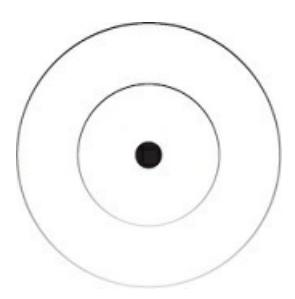

### THE UNIVERSE

When we harness the creative ability of our minds to view life from above, we can discover, collect, and harness profound insights that bring us peace and progress below. The Universe is the most conscious and ultimate perspective you can adopt. Humans come somewhere lower on the consciousness scale, and your ideal or "highest" self can be seen as a stepping-stone perspective toward the Universe. Further down the ladder come animals, plants, and intangible intelligence that you can integrate into your perspective to make it less reactive to low-consciousness problems.

True philosophy has one question that contains all others: "How do you live the best life?" I assure you that this question cannot be answered by climbing the power ladder placed in front of you as a child. This question is answered by holding the perspective of the Universe in our mind, observing the essence of its movements (which often can't be put into words), and applying those discoveries to our lives in a practical manner.

Before we go any further, I want to make a distinction between the Universe and the universe. One with a capital "U" and the other without.

The Universe lies far beyond the senses. It is the universe of universes.

Beyond our universe and beyond the cosmos, but still a part of our daily lives.

Some have called this invisible power "God." Others prefer to label it as The Infinite, Source, The Absolute, The All, or Intelligence. In Aztec philosophy, it is called "Teotl" or in Hinduism "Brahman," which is noted as the highest universal principle. The ultimate reality.

I have my own beliefs and I am sure you have yours. I use the term "God"

at times, but I understand how many reactions that can spark in people to ask for scientific proof

{43}------------------------------------------------

of a literal man floating in the sky, locking them further into a dangerous intellectual prison that widens the gap between concept and experience. "God," as far as we're concerned, is the identity of reality. My goal is to leave cultural labels out of this description, as the highest truth cannot be put into words. It must be experienced on a personal level.

When I tell you to think of a "bird," a specific image will pop into your mind. That image will slightly differ from the image that every other person on this planet will have in their own mind. One person may think of a blue jay, while the other a cardinal, but even then those images have faint lines without further context. While the interpretation is different between us all, the underlying truth of what a bird is remains the same, and it is often indescribable when you pierce through the layers of concepts we use to make sense of that part of reality.

For the sake of coherence and understanding, I will use the term Universe, as it will help us describe its nature with examples that can be noticed in our everyday lives. I am not using this word as a noun, but a verb. This is not a religious doctrine, but I do not want this to turn into a shallow self-help book that leaves out the underlying essence that the industry was built on, often stripping away the "fluff" to help readers acquire an immediate yet impermanent result.

You see, from a state of open focus, we can understand that the path to the good life cannot be deciphered from one mere human perspective or belief system. You must observe and note patterns from one perspective to another, even if it isn't a human perspective. A constant state of narrow

focus is the result of common self-help doctrine. All too focused on the pragmatic aspects of life to the point of inescapable stress.

It is not hard to see the intelligence, consciousness, and nature of the Universe at large. Just because it cannot speak your language or solve your mentally fabricated problems – like the "love of your life" breaking up with you – does not mean it is not intelligent. The narrow, collectively accepted notion of intelligence as "smarts" is not what I am talking about here.

This Universal, or infinite, intelligence reveals itself through division and unity, creation and destruction, birth and death, growth and decay, order and chaos. An impeccable and self-corrective balance. This is beyond physical, as we are not animals, and animals cannot conceptualize this power as humans have for centuries. With the emergence of self-reflective consciousness, we have access to spirit. Spirit is the intangible connection between minds.

Our mind can have an internal battle with itself. Two friends can argue with each other. States can have a political battle during elections. Countries can go to war with one another or with themselves. Notice that these are battles between ideas. Like red versus blue politics. Even a physical battle between humans, at its root, is a part of a larger spiritual war.

There are cycles, patterns, and rhythms that we can notice to ease the uncertainty of our lives. By understanding these patterns, we can align our behavior with them to reap the benefits that nature provides.

### **EVERYTHING IS CONNECTED**

{44}------------------------------------------------

Let's run through a mediocre dissection of the Universe from what we can comprehend.

The galaxy contains the solar system, the solar system contains 9 debatable planets, those planets contain Earth. Earth contains the oceans, continents, countries, states, counties, cities, neighborhoods, streets, buildings, and

rooms, each having a purpose, beds, humans, organs, all the way down to what we call an atom, and the atom going deeper than I care to illustrate here.

All of these individual things being a unit of mind. A figment of consciousness, many of which we aren't in direct physical contact with.

Each figment of consciousness is layered and given new meaning.

When you focus on a car, it is a car. When you focus on the tire, it is a tire.

When you focus on a bolt holding the rim in place, it is a bolt holding the rim in place. Both a whole and a part. A whole in itself and a part of something larger. Humans, by this realization, are a whole, but also a part of something bigger than themselves like a life purpose, a community, or the Universe itself. When we become disconnected from any of the above, we notice a drastic dip in the quality of life.

We will define these whole parts as "units of mind." A unit of mind is anything that can be given attention on any plane of existence. As the Universe evolves, these units evolve with it. This is a principle that reflects across all units of mind. One notable characteristic of these units is that after a period of conflict, a creative solution emerges, which is a unit in and of itself that transcends and includes that which came before it. Like an ape to human through the conflict of natural selection, gaining clarity in your personal life after a period of feeling lost, or how an author creates a beautiful work of fiction after ending a toxic relationship. Novel units of mind have emerged throughout evolutionary history to create the relative world we live in.

Everything is connected because that is the only way these units would make sense to the human mind. We are pattern-recognition machines that acquire knowledge through analogy, comparison, and metaphor. A hand would not have meaning if it was not connected to an arm. A solar system would not make sense to the human mind if it was not contained nor did contain. And if one did not understand what the solar system was, we would need to educate that person on a series of things. They must first understand Earth, its continents, and layout. Then they would have to imagine or see

pictures of other planets suspended in what we call "space." In a practical sense, you do not understand your potential because you have not sought to learn by your own desire. Only then can you be exposed to the puzzle pieces that form your potential.

The connection of these units is not only vertical, but horizontal (or any other direction or measurement we can label). A hand that holds a cup, without the cup being designed as it is, wouldn't make sense without a hand to hold it. I would encourage you to think about the infinite connections that can be made in any directional fashion. Like how a hand connects to a keyboard that connects to the president of the United States. Attempt to fill in the gap with your creative

{45}------------------------------------------------

ability.

A hand connects to a cup, a cup to a cupboard, and a cupboard to a kitchen, with most households having a kitchen, continuing to connect up and down until an immaterial fabric of thought and consciousness that blanket everything we can possibly know, because that is why we can know.

There is one notable pattern with this infinite web of connected dots: division and reunion. From the top down, the Universe is a whole that is divided into infinite creative parts. This is the engine that runs the relative world.

Imagine the ocean or a large body of water. The heat from the sun evaporates that water, dividing into many microscopic droplets. Those droplets rise and reunify as clouds. These clouds grow in size and unify as larger clouds. Soon, droplets unify in the clouds until they are heavy enough to rain back down to Earth. Rain creates puddles, streams, and even plays a role in plant life, which is but another infinite story. Eventually, the rain makes its way back to the ocean with time, and the process is repeated.

This is not a localized phenomenon of division and unity. It is infinite. The ideas in your mind divide and reunite; we call this creativity. Throughout human history, races have divided and are now reunifying. On the Universal scale, your opinions do not matter about this, nor do mine. In a few centuries, all of our skin may be the same slight shade of what humans

perceive as brown, and race as a concept will collapse into one. Note that these processes can vary in time. Entropy, division, unity, creation, destruction, or the rest can happen in an instant or over the course of generations.

I would encourage you to notice this pattern wherever you can, even when making your breakfast, writing a book, or using the bathroom. Notice the parts, wholes, and how they dance together across the physical globe and ripple through the collective consciousness. Even if this thought experiment does not make you \$1 million tomorrow, it allows you to appreciate the depth of life when most perceive it as mundane (as they chase the next surface-level, shiny object).

You are a part of something bigger, and that can only be seen through spirit.

By doing this, it reveals that the concepts, beliefs, and ideals we hold so dear are not static. When we identify with these mentally constructed entities and regard them as unchanging, you are in for a world of emotional trouble that prevents personal progress.

One of the most beneficial habits you can adopt is playing with mental Legos. Sit with an idea, thought, or problem and follow the connections that present themselves. Stay vigilant of distractions. This is how you practice creativity, mindfulness, and deep thinking without any external tools or guides.

The big problem on the cultural, social, and personal level is identification with ideology. Humans group ideas into what is supposed to be indivisible unity of ideas. We leave no room for division and reunion. Your sense of self is but a group of ideas that many see as unchanging. If

{46}------------------------------------------------

you are unwilling to let ideas flow as the Universe does, you will be unconsciously bound to a suboptimal state of being.

Ideologies like certain religions, business models, or diets can be considered collective egos or a collective self. And as we will learn, a collective self will work to survive through mental energy. On the personal level, our concept of self will do the same.

### ONE SONG

Uni-verse. One song. That is what you are smack in the middle of. Like you are on a rowboat in the middle of the ocean with a storm brewing overhead, and the boat can sink below the surface at any time unless you bucket the water out.

At the top of a wave, hope rises as the sight of land becomes clearer. At the bottom, despair sets in as the 10-foot-tall waves obstruct your vision. As the storm disperses and the sun shines through, we feel at ease, but little do we remember that a storm is not a singular occurrence.

This fantastical song cycles through summer, winter, spring, and fall. High highs and low lows that illustrate the full range of the human experience.

We tend to yearn for summer during winter and reminisce on cozy winter nights during summer. To escape the cold, we cover our ears so we don't have to hear the lesson that would propel us into a season of growth, prosperity, and enjoyment.

Music is beautiful. To reach harmony, multiple vibrations are designed with care. The pluck of a guitar string creates a high note, the repetitive bang of a drum creates a beat, and the bass adds a little punch. Maybe throw in a few piano keys here or there.

While this song is infinite in nature, it is multifaceted. It is not one sound played at a time, although it very well could be, but not for long. This reflects in your daily life. If you can't focus, tasks, breaks, and that pesky thought about that argument last night could drive you to the brink of insanity.

Harmony. The Universe is in perfect harmony. You can fight with it or flow with it, and the ego loves to fight with it. The question is: what song is actually playing? And what song are you trying to listen to?

On a practical level, this introduces the topic of understanding, clarity, and perception. You wouldn't take one lyric from a song, play it on its own (or

on repeat in your head), and expect it to make sense. Similarly, you wouldn't take a sentence from someone else's mouth, plug it into your story, and expect it to have the same meaning.

Yet this is what humans do. We see what we want to see, ignore what allows it to exist, and let negative thoughts flood our mind about how the crazy person is not the one in the mirror.

The mind craves order, and if the information you are feeding your mind lacks a cohesive structure, you will become a victim of entropy. What's funny is that all information is interpreted

{47}------------------------------------------------

through our worldview and perception. Meaning, all information that you process (through any sense, not just sight) is usually a part of a story that you tell yourself. That piece of information, most of the time, will not make sense in alignment with your conscious, subconscious, or unconscious goals in life. You must extract, test, and think about how the information can be utilized without judgment.

If you are in a low point in life, seek to see the big picture. Understand that the lows are not permanent, they are not unique to you, and they are followed by a season of progress, if you listen to the lesson that life is trying to teach you.

### **CYCLICAL STORIES**

Life unfolds in chapters, phases, and cycles. The Universe is one song, but it's also one story, and one game. They all have the same structure. There is an introduction, rising action, internal conflict, a main battle, falling action, and resolution.

While one lyric of a song may not make sense on its own, it is still a unit that can fit into another song. Everything is connected. The same holds true for stories. Letters are wholes and parts of words. Then sentences, paragraphs, sections, and chapters in a potential series of books.

Every sentence has a purpose. Every chapter has a purpose. Every book has a purpose. All of these contain accompanying problems standing in the way of clarity. This is how the mind makes sense of the world. If you are lost, it may be that you turned the page into a chapter where the purpose has not been made clear yet.

Layers of stories allow us to construct meaning in our lives. A story has a purpose that the teachings of each chapter lead to. Some chapters are exciting, others boring. The main character is at the top of the world in one chapter, but at the bottom of the ocean in another. And if we fail to open our focus to realize that the highs can't exist without the lows, our mind struggles to maintain order and entropy grasps at our sanity.

One of the biggest problems in our time is trying to plug the paragraphs of others' stories into our book. It can make sense, but only if you try to see beyond the literal interpretation of words. Advice, education, and conversation must be interpreted from a shared purpose for it to retain its maximum value. If this shared purpose is not found, the words won't register and arguments, problems, and emotions begin to take over. Order does not only apply to an individual mind but collective as well.

We invented language by turning images into symbols, symbols into words, words into paragraphs, and so on. All understanding is metaphorical, and you can find deep lessons by seeking to understand the situation at hand, no matter how much your ego doesn't want you to.

The structure of stories reflects on all planes of existence that impact human behavior from the top down. There is a solar and lunar eclipse. We've noted patterns in the stars to represent astrological symbols that shift with the calendar (I'm a Libra, by the way).

In our world, there are 4 seasons. Winter, spring, summer, and fall. While these seasons cannot speak words, they are symbolic of so much more. It does not take much mental effort to

{48}------------------------------------------------

understand the feelings, purpose, and behavior that each season contains.

In culture, there are holidays like Halloween. We join in spirit to celebrate an idea and our actions follow the purpose or goal that the holiday presents.

I've seen some questionable costumes. Children interpret this holiday as having the purpose of acquiring the most candy possible. Others interpret it with the purpose of letting loose and attracting a mate. Every collective cycle, story, or phase can be interpreted by one in a different way than another, depending where they are at personally.

In society, there are political seasons that get people a bit too emotional.

There is a tax season that raises the stress of every individual, no matter their income. These strong, unconscious emotions influence your behavior.

And if that behavior is bad, it goes on to reproduce in minds across the globe. If behavior changes on a large enough scale, it can influence the health of society, culture, and even the cosmos at large. Your actions have impact.

These global cycles have the potential to control your emotions like a puppet when unconscious. But this is not the worst outcome. Having a little team spirit for your political party has its consequences, but not as many as relinquishing your role as the main character in your personal life.

I could go on and on about how robotic we are as species. We have much less "self-control" than we think. The unconscious mind is powerful. It's like a sponge. With every repetition, like flowing water forming the Grand Canyon, our behavior becomes more automatic.

You have a sleep cycle, an ingestion cycle, a work cycle, an excretion cycle, and sex cycle, even if you don't have a partner. It's important to note that these are only a portion of the habits we have in our personal life.

These personal cycles can vary per the individual, like how bodybuilders go through bulking and cutting "seasons." This ripples through the other cycles in their lives.

Even more, there are business cycles. You'll have high months and low months. Seasons of progress and regress. Your business can gain a bit too much "fat" in its exponential growth. And if you don't cut down, it will

cause more unconscious problems. Those problems will demand your focus, drain your energy, and give you the experience that may be ignored.

The cycles of the Universe can be brutal; they don't care about your feelings. As you will learn, I am of the mind that everyone is an entrepreneur, as it is in our nature. A steady paycheck is a useful stepping stone but harsh slave master.

The Universal patterns of storytelling are how we construct meaning, language, and communication. Now, this is not limited to stories alone, nor is language limited to the written or

{49}------------------------------------------------

spoken word. Language is the signifier of cognitive activity. Nature, sculptures, dance, paintings, games, personal style, and every other aspect of existence that we can perceive with infinite combinations of the human senses can be interpreted by the mind.

A sculpture mimics the highs and lows of a story in its grooves, texture, and form. This is a beautiful insight but goes beyond the physical world. We have the ability to sculpt our mind, reinvent ourselves, and craft both a physical and intellectual structure that forms a mode of intangible communication with the external world.

You have the ability to interpret meaning from a combination of your senses. Sculptures are stories frozen in time. Stories are sculptures melted down and molded into an entirely new song. We can walk into a cathedral and hear music in our ears even when music isn't playing. We can taste a 5-star meal and imagine ourselves in an elegant location. This is the gift of consciousness and creation.

Language and meaning, at their core, are a combination of units of mind, which are the smallest building blocks of ideas. Ideas are a novel emergence that offer a direction in which to pave the road of expanded thought, because thought is a program that is limited by the operating system, or language, it operates on. We can only think as far as we know, and narrow focus prevents us from knowing more. From this insight, we can write a personal, societal, global, or cosmic story that is worth telling.

The point is to observe the patterns that are all around you and see how they reflect in your personal life. If you are stuck in a rut, that is but an impermanent state that will resolve with time and effort. Above all, your ability to zoom out to a conscious, open-focused state will allow you to see these seasons for what they are: a necessary low that will lead into an inevitable and impermanent high.

### AT ONE NOT WAR

Struggle is a universal principle. It is silly to think that it isn't supposed to be a part of your life. But that is what we do. We expect life to be a certain way, when it isn't supposed to be anything other than what it's being.

In this cyclical story of life, there will be conflict. It's the most interesting part of the story, in fact. That's why we love stories. A problem is introduced that piques our curiosity, becomes more problematic until the climax, and when resolved we feel relieved after the roller coaster of emotions.

From the highest perspective, resolved conflict leads to creative emergence.

Stars explode every 10 seconds and create new atomic nuclei. A war between nations creates revolutionary advancements in technology. A fight with your significant other, when resolved, creates a new appreciation for their perspective. Turmoil in your own mind, when accepted, creates profound lessons that make the next round more tolerable.

But we tend to focus on the technical, and often ideological, details of conflict rather than the big picture. We resist conflict by narrowing our minds on the conflict itself, rather than letting it flow

{50}------------------------------------------------

as an interesting, and often necessary, part of existence.

We can begin to see conflict, struggle, or battles as problems within a system. If they are not solved, entropy ensues. When we zoom out, seek to understand the system, and let go of the outcome, we create room for

progress. Progress feels good. Incredible, in fact, but in the opposite sense of instant gratification.

This brings up one of the most important topics of our time. Instead of seeing problems as they are, we see them as we think they should be, and that "should be" is easy. So, we seek external sources of motivation to kick us into action. Or we fight with the problem, not physically, but mentally.

We perform mental gymnastics to do anything but face reality.

The Universe acts regardless of how it feels. It doesn't need the concept of motivation. It makes mistakes, self-reflects, and iterates on a solution.

Feelings, push comes to shove, mean nothing when it comes to action. Still, we let them run our lives.

You can write, and you can write well, regardless of how you feel. You can do the dishes, walk the dog, apply for the job, start the business, leave the toxic relationship, and make holistic progress even if you don't feel like doing it. Feelings are feedback, and we should treat them as such.

We live in a delusion that we want to make progress without it being hard.

People will go insane over the thought of hot weather but can go into a sauna without complaint. The difference is expectation and intention. That is, a conscious goal with clarity on how to overcome the problems standing in the way.

When you're out in the cold, your automatic reaction is to shiver. To fight.

It makes sense. The cold is uncomfortable. So, we focus on the negative thoughts that flood our mind. These stem from the grooves formed by our experience with previous cold exposure. The body is warning us that extreme cold is dangerous, but this is not the case in most modern situations. We have luxuries available to us after centuries of evolutionary problem-solving.

While our body may fight, our mind doesn't have to. If you were to be with it, flow with it, and realize that discomfort is a part of the human experience, you would find that your thoughts are the culprit of your suffering.

Compulsive thought is the battle of battles. Your resistance to conflict stems from thoughts of comfort that distract you from what is. The way to true comfort is to let go and rejoice in the harmony that is all around you.

{51}------------------------------------------------

Of course, there will be seasons where problems seem nonexistent. We get comfortable when life is going well, and we remember these times as reference points that our mind seeks to move back to. Out of nowhere, you may feel lost. You may fall back into bad habits. Entropy will take hold when you let your guard down, and a host of new problems threaten the mental comfort that we love to call home.

Be wary when things are going too well. If you succumb to these comfortable states of mind, you aren't making progress. You are getting rest for the next round of heat. Rest is good, but the modern notion of rest is distorted. Even a season of mediocrity is a necessary learning experience that allows your vision for personal success to take form.

The nature of experience is refinement through struggle. If you are inexperienced, problems will be as problematic as the attention you give them. Awareness is the first step, universal perspective is the second, and if it is real, accepting the battle for what it is comes last. Radical acceptance of present-moment reality is the start of the solution to most, if not all, of your perceived problems.

We aren't trying to be at war with it, we are trying to be at one with it. Sit with the problem. Contemplate it. Fight with it until you realize the futility in fighting with fabrication. Then, let go. When you least expect it, the creative breakthrough will come, and the season of intensity will be at your doorstep. It's not a battle, but a dance.

{52}------------------------------------------------

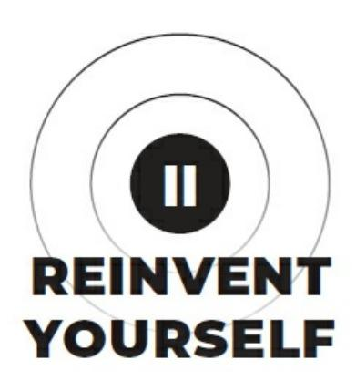

{53}------------------------------------------------

{54}------------------------------------------------

### THE SELF

The human superpower is choice. We no longer need to outsource our choices to biological, sociological, or psychological drives. Instead, we can aim for the future, acquire specific knowledge, and create a sense of self that leaves a dent on the world.

By the time a child is 9 months old, they start developing a kinesthetic image of who they are. Parents cover their eyes, so the child follows, and when they shout "peekaboo!" we let our hands drop away and reveal ourselves to the world.

As we age, we learn nursery rhymes that teach us certain aspects of our body, especially the face, because we cannot see it directly. To label and remember the idea of our face, we point and remember the labels "eyes, ears, mouth, and nose."

From this foundational understanding of the human body, the self can begin interacting with others. And when they do, our sensory perceptions store information in a way that aids in our survival.

With time, our cognitive capacity increases, and our knowledge compounds. We no longer need to think about who we are and how it impacts our lives.

Once we feel like we have a solid grasp on this thing called "life," physical survival becomes less of a threat, and this is where humans begin to differentiate themselves in a drastic manner.

The next phase of survival transcends the physical plane. Modern survival is about mindset. We adopt goals, identify with them, and our behavior changes to achieve, or survive, those goals. This is where things can skew toward good or evil. If you don't define your own goals, standards, and expectations for success, you may end up a slave to someone else's. When we step back and observe the masses, we can see this unfold in a negative manner. From religion to business to sports to jobs, we become a part of a whole of someone else's creation, unconsciously identify with it, and act to survive that identity.

This alone points toward an answer to sustainable enjoyment in our lives, because this alone is responsible for the majority of our suffering. When we unconsciously act to survive an identity that is often greater than ourselves, the pain can be unbearable.

If we are conscious of the impact of our identity, replace the faulty pieces, and use survival to our advantage in the pursuit of our goals, we can flip our perception of struggle from suffering to fulfillment.

{55}------------------------------------------------

### SELF AND OTHER

Most of the answers to your burning questions about your existence can be encapsulated under 2 meta questions. Who am I? (intrinsic). What is my purpose? (extrinsic).

When we use the words "I" or "me," we are referring to a mental construct.

Other people can tell you who you are, but they will never have access to your state of mind. Your friends hold an idea of who you are in their heads, but this is missing billions of bits of information you've processed with your conscious mind throughout your life that form your experience. This

idea is formed by their interactions with you, which I'm assuming is a fraction of the time you spend with yourself.

Let's do a thought experiment to understand the concept of self. I want you to picture yourself as a newborn. As you age, you begin to focus your attention on certain things in the world. When you focus on any aspect of reality, a "string" is formed.

This string is metaphorical. It represents that experience as a snapshot in time. And when these experiences are repeated, the strings become stronger.

We often call this "conditioning" or "programming." Now, depending on the perceived importance of that which held your attention, a certain type of string is attached between the self and other. This is a personal distinction that aids in your survival.

When you first learn about a cloud, you relate it to who you are and what it means to your life. The same goes for your parents, food, bed, grass, and every unit of mind you become aware of. This is including the moment-tomoment perceptions of the situation. How did you feel? Was it positive or negative? Do you want to experience it again? Do you want to fill your experience with more of that thing? Through gradual exposure to the world, we layer experiences on top of each other, forming an invisible web of expectations that allow us to understand the world.

Some strings are made of a fickle yarn, others are layered, braided, and strengthened to the point of what would seem like steel wire that is an inch in diameter. The yarn strings are easy to cut, but the steel strings . . . not so much.

The yarn strings don't conduct or transfer much energy, but the steel strings can result in a high voltage electric shock, and you won't even see it coming. The stronger the attachment, the stronger the emotional reaction when that illusory identification is threatened. These strings are not only formed from material perception, but immaterial. Beliefs, biases, ideology, ideas, and language that allow you to make sense of the world around you.

This is how the notion of "self" is created. When I say self, I am talking about who you *think* you are, not who you really are. A mental construct built on a groundless foundation.

Neurotransmitters like dopamine signal that something outside of you is important. Dopamine levels increase in the brain when something new registers in your awareness. When you are

{56}------------------------------------------------

young, everything is important.

Everything is new. Like a puppy in fresh grass, children explore a world of wonder until it becomes normal to them. As adults, our web of expectations is so developed that life seems to lose its zest. And when something doesn't fit into that narrow worldview, we lash out with negative emotion until we can make sense of it, rather than opening our mind to the wonder of the unknown.

Throughout your personal evolution, your attention roams free and soaks in everything it can to get on the same page as everyone else. A string is formed for a cloud. Another is formed when you perceive the distinction between a light and dark cloud, and yet another when the dark cloud lets out drops of water called "rain." This is rather harmless, but it is only the beginning.

If we remember the division and reunion of a body of water, like the ocean to clouds to rain to puddles to ocean, we can start to understand that a cloud is not static. Since this principle of impermanence is universal, nothing is static, not even you, your state of mind, or who you think you are. The harm is done when we resist life through the power of thought.

No longer do we live in a time where this signal of importance would indicate a common bush that has newly grown edible berries. Our world is different. Our cultural and social survival needs have evolved, but our psyches are stuck with the wiring of our ancestors. Humans do not primarily survive on a physical level, but on a conceptual level.

As we age, and if we retain a low capacity for critical thought, certain beliefs can form strings so strong that when cut, the emotional response is on par with physical death. When the illusory self identifies with something

like a religious ideology, and all of its inner workings, it becomes a part of who you are. Who you *think* you are, that is.

What's the problem with this? The hundreds of thousands – if not billions –

of strings that form the self over time do just that. They form the self. They are your identity. They influence your thoughts, emotions, and actions. The concept of self is a puppet master to those that do not realize this.

The same principle applies to any value system, affiliation, or any other teaching that is often taken as law or touted as the *best* option. When the identity is threatened, we act to survive the mental construct, because the feeling of threat is real, but often misinterpreted.

Have you not seen this across the news, in your personal life, or on social media? Whether it be political, religious, academic, or scientific, we tend to burst out with extreme, uncontrollable emotion to defend the strings that we have formed to birth, refine, and survive the self.

Know that these strings can attach the self to any unit of mind that you assign importance to. Anything. Like when I was young and would get angry when my brother crossed more than a centimeter through my door. It was the boundary of *my* room, wasn't it? Why should he be allowed in if I don't want him to be?

{57}------------------------------------------------

Are you a coffee drinker? If I brought to your awareness that you have a mild addiction and could use a break, how would you react? For many people, they would come back with an immediate answer. No critical thought. No self-awareness. No honesty. A compulsive, fabricated lie to end the conversation as fast as possible. How else are you going to survive the coffee drinker in you?

Some may ask, why would I get defensive about being a coffee drinker? It may not be the coffee itself, but the benefits of feeling as if you belong to the coffee-drinking tribe. Again, something larger than yourself. A part within a whole. The clothes you wear, the places you hang out, and the potential partners you can find that share a love for coffee are on the line.

Or it can be that you use coffee to enhance your productivity at work. If

your coffee usage is questioned, your productivity is threatened, and your livelihood comes into the survival equation.

These examples showcase our emotional on-and-off nature. Something as simple as my brother stepping into my room would have me trying to survive the idea of My Room, as I assigned that importance to it and everything in it.

Treat negative feelings as a test of awareness. When you feel a disturbance in your inner peace, follow that feeling along the string until you reach the source, which may be much, much deeper than you could ever imagine.

### **SURVIVAL SYSTEMS**

Humans survive on a conceptual level. We are not animals, but we have transcended and included aspects of their existence. While we both work to survive the information in our genes, humans work to survive nongenetic information in our consciousness like language, social and cultural constructs, and most notably those which compose our sense of self.

Animals survive their physical form; humans survive their conceptual form.

Forms in consciousness change like rain to the ocean, but the mind attempts to make the impermanent permanent due to the evolutionary nature of our psyche. Your "self" is your psychic body, and conceptual forms look out for psychic threats like a narrative, contradiction, or idea within its worldview.

When our identity is threatened, we have a physical stress response on par with that of a mouse, moments before death, with 2 poison-dipped fangs penetrating its side. On top of that, you wouldn't see a giraffe getting offended because you challenged its beliefs. This is a human phenomena.

Physical survival is still a threat, of course, but we don't live in a world where we must worry about a wild animal latching onto our throat, even in prison much of the time. Through evolution, we have drastically reduced the mental energy required to sustain our physical survival.

{58}------------------------------------------------

The notable pattern here is that humans pursue goals of survival and status.

And once status is acquired, we work to survive the identity we've attached to that status. If this is unconscious, it works against us. We become a slave to our own mind.

When your significant other breaks up with you, or even worse, passes away, it feels as if a part of you has died. You feel the accompanying physical sensations that make you feel as if you are dying. When we form relationships, we share the ideas that are important to us. Those ideas shape the perspective of the other person in the relationship and go on to mold their identity. This is how humans replicate their psychic body.

Another example would be that of Ben Gunn, a boy who was thrown in prison after beating his friend to death. Ben accidently let his deepest secret spill, had his conceptual life flash before his eyes, and couldn't seem to control himself as the emotions rose with the piece of furniture in his hands used as a murder weapon.

Beyond that and thirty years into Ben's sentence, he had made a name for himself in prison. He became the "jailhouse lawyer" and helped his fellow inmates fight the system. Even after he fell in love with a visiting teacher that attempted to coax him out to a cottage oasis in the England hills, he didn't want to leave. On his release on August 23, 2012, he found himself curled into a ball rocking back and forth for 2 weeks. According to his online blog, he still doesn't feel the same. Ben had experienced a swift conceptual death.

Once we identify with a purpose, which is limited by our experience, we collect information to survive the identity associated with that purpose. The information we notice in day-to-day life is limited by our identity. Our identity houses our perspective, our perspective influences how we perceive situations, and our perception influences if we act in a conducive manner toward the right goals. Your field of awareness will register what it perceives as important for its survival.

Everyone has direct experience of this phenomenon. Like when you see a specific car for the first time, and then you see it everywhere. Or when you notice a brand of clothing you like – because it aligns with your unconscious goal of fitting in with others as a survival mechanism – and then you see it everywhere.

Naturally, we will shift our behavior in alignment with this identity. We will act in a specific way, within a specific perspective, and reinforce a specific identity until it becomes effortless. Our identity shapes our habits, and our habits reinforce our self-image. Habits are the grooves in your mind that preserve mental energy when it comes time to act.

In other words, we develop unconscious survival systems that dictate our actions, large and small. Our actions determine who we are, and if we spend the majority of our lives unaware of the identities, perspectives, and accompanying goals we are working to survive, we may end up as a person we hate when we finally decide to wake up.

The mental energy we invest in the system that survives our identity will influence our experience. This alone explains the gap between the miserable and the fulfilled. The miserable allow their focus to be manhandled by their environment. The fulfilled understand the external world through observation and control their focus within it.

{59}------------------------------------------------

To make this more practical, the reason we attempt to survive an identity is because of the goals that form that identity. The more mental energy you invest in a meaningful goal, the more important it becomes to you. When you are consciously investing in that goal, the feeling of pure progress is incredible. You know that you are moving forward toward your goal. You have feedback.

Most people think they "find" their passion when in reality, they create it by investing mental energy into a goal. Only then can they cultivate an intrinsic reasoning that pulls them to achieve that goal. If you wait until you feel passionate enough to act, you will never discover what is truly meaningful to you.

If you stop making progress, you begin to feel less satisfied with life, and if it drags on too long, the pain can be unbearable. Why? Because you subconsciously know that you are wasting the mental currency you've invested in a goal by not achieving it. If you don't have the feedback of progress to remind you that you are on the right path, you begin to feel lost.

This is only half of the story. Survival is not only about preserving who we are through defensive strategies, but offensive. We don't only try to survive our sense of self but reproduce it. Conceptual reproduction is the drive to spread the ideas, beliefs, and biases that make you, you.

There is a reason we feel the pull to create. An author's drive to write a book is not only for the joy of creation, but to impregnate the minds of others with their ideas so they can live on long beyond their physical death.

When we engage in conversation with a friend, we can often find a shared perspective in which to exchange ideas to strengthen each other's worldview. As humans we give, notice, and accept the ideas that will aid in the achievement of our goals, for better or worse.

Of course, this can flip on its head very fast. If our beliefs are threatened, emotions flood our mind, and we feel the urge to lash out in a verbal storm of parroted ideas to survive whatever beliefs we subscribe to. This becomes apparent during political seasons, mass media hysteria, and even religious parents that seek to reproduce their selves in a rebellious child that questions their beliefs.

If we seek to understand our nature, we can start playing the real game that boils down to one question: how do we make survival the most meaningful?

### HARMONIC OSCILLATION

You feel bad because your future self is watching your every move, and they don't like what they see. By the time we are near adulthood, our mind

is like an overweight sculpture waiting to be chiseled down, revealing the god-like physique that has developed underneath.

Chiseling requires small, skilled, and accurate taps to maintain the foundation of the material. If you strike too hard, you may send a crack through the core. If you strike too soft, you will get discouraged at your inability to change.

{60}------------------------------------------------

Now that we have a big picture understanding of our concept of self, we can work to change it. Meaning that we must deconstruct the mind, see all its parts, and remove what isn't supposed to be there. This way we can act from a place of authenticity while developing a character that is conducive to our ideal future and present enjoyment.

In classical and quantum mechanics, a harmonic oscillator is one of the most important concepts to understand regarding the behavior of certain systems. While the science can be difficult to understand, the point is simple.

When you apply external force to a particle, it is displaced from equilibrium. Like if you were to flick a doorstopper as a kid to hear the funny noise it made. When we would flick the metal stopper, it would shake back and forth, depending on the force we applied, until coming to a stop back in the position it was.

A better example would be a string attached to 2 objects, forming a relationship between them. If that string was plucked, or one of the objects moved in a quick manner, the string would bounce up and down like a wave until coming back to a calm state.

Under another lens, we can think of the mental construct of self as a house, but not a home. When you build a house, you start with a sturdy foundation, add the structure, and paint over it in a way that appeals to the eye.

Thanks to entropy, the house tends toward disorder. You need layers of systems to maintain the structure with invested mental energy to match. The paint will chip unless you hire a painter. Rooms will get dirty unless

everyone cleans them. The dishes won't be washed unless someone does it physically or uses technology to save mental energy.

Not only that, but if you want to change the structure of the house, you must be precise and knowledgeable. It is common sense to not demolish the house as a whole, because that is on par with death of the house itself and everything inside it. You also wouldn't remove a foundational piece of the house as your starting point.

Instead, you start your reconstruction with what you know. You learn, experiment, and improve your understanding of the house as you iterate on a long-term plan.

When we translate this to our mind, and change the identity that no longer serves us, when you try to remove a part of your house, you are applying an external force. If that part of your house is foundational, the emotional response will match.

When most people seek to change and take the painful actions necessary, they often fail to see those low points as necessary. We fight with the emotions that wash over us and allow them to influence our actions.

On the Universal scale, our thoughts, emotions, and actions oscillate between the creation of heaven or hell, but few people recognize that responsibility. Your actions will only serve a collective heaven after you experience the personal hell that comes with identity change. From

{61}------------------------------------------------

that chaotic rock bottom, it is your responsibility to bring order to your life.

The dualistic nature of reality is tricky because we often isolate 2 extremes of a pair with the distinctive thoughts in our head. Black would not make sense without white, nor up without down, love without hate, happy without sad, matter without space, something without nothing, or finity without infinity.

When we neglect the complementary existence of these entities and see them as standalone, our mind gets stuck as the Universe pushes toward evolutionary progress. Our imaginary sense of self stays the same while

reality continues to change with each passing moment. And when our expectations fail to align with the actuality of a situation, emotional lash out is often the result.

### THE PULL INWARD

Everyone has felt the pull. The call to greatness. The silent yearning for more, but not in a materialistic sense. Can you feel it? Or is your focus limited by the intellectual structure you call home?

The pull inward demands outward problem-solving, from superficial to metaphysical, while maintaining as holistic of a perspective as you are able.

The path of mastery is obvious, but our conditioning prevents us from seeing it.

You are being attracted to your highest version, and the depth of your core can sense it. The external call to evolve requires you to chisel inward beneath the mental constructs that have been layered through your conditioning. Your internal state must become one with the ever-changing external state.

You identify problems in your life and solve them. That's it. That's how you live with purpose, unless you get distracted. But most people want to solve the problems of the world before they solve their own. This is a recipe for disaster. How can you help the world if you haven't helped yourself? If you have not developed the identity that you reproduce in every interaction, you are contributing to a collective hell on Earth unless you make the conscious decision to evolve.

Start with what's right in front of you. You know, the superficial things that you sweep under the rug because you have the desire for bigger, better, and selfless pursuits to veil what is staring at you in the mirror. Don't ignore your personal problems that are begging to be solved. You wouldn't build a temple on a foundation of chipped wood and bent screws.

Are you overweight? Do you hate your job? Are you tired all the time? Did you just go through a breakup? Are you trapped in a cloud of negative emotions? You must sit with these problems, observe them from a state of open focus, and become aware of how they impact your life. Then, you must gather the knowledge, skills, and resources that allow you to dive in with clarity in your day-to-day life.

It takes time to realize how one problem spreads into all areas of your life.

{62}------------------------------------------------

Like how a lack of money can prevent optimal health, moving to a beneficial environment, and silently destroy your relationships. Or how a lack of health leads to low physical energy, which impacts your quality of work, how you look, your self-esteem, and your ability for clear thinking.

You must hunt for a reason, a "why," for solving that problem. One that makes sense to you. One that makes action seamless. One that you find in conversations, books, and not distracting yourself with mindless entertainment. With the intrinsic energy from that "why," you create a goal to overcome that problem. This is your purpose until the next reveals itself.

Once you begin to invest mental energy into that goal, momentum begins to take over, because nobody likes the feeling of a wasted investment.

Intention is a magnet toward a desired future that is enhanced with reason.

As you trek toward your goals, continue hunting for "whys" to reinforce your positive behavior. The initial reason you started will lose weight with time and entropy. Collect the pieces of a philosophy that uphold your pursuit to a better life.

If you need clarity, adopt the mindset of the silent observer. Pay close attention to the actions of those around you. Comparing yourself to others, which is often demonized, can be a useful tool for understanding what you don't want. From there, you can flip that on its head to gain clarity on what you want. When you are at the grocery store, observe what others are putting in their baskets. Observe how they look. Transfer consciousness into them and craft a story for how they live, feel, and act without reason. This is not judgmental or unethical if you are doing it for the sole reason of correcting your own behavior.

If someone has a mind, body, or lifestyle you desire, use that as fuel to educate, execute, and iterate as you learn more about yourself. If somebody has a mind, body, or lifestyle you despise, use that as fuel to push in the opposite direction.

You need a plan. A strategy. A clear set of goals that form a system that, when backed by focused effort, will create a meaningful future. There isn't any other way. Because if you don't have a plan, society does, and it's been planning your life for decades. When you discover your lesser or greater purpose in life, you must bridge the gap between you and it by creating order in the mind. A plan is structured information that you can bring your attention to when mental chaos ensues.

Realize that you do not have one purpose. To chisel down to your core and discover who you really are, you must solve the problems that are staring you straight in the face. Once you bust through that karma, greater purposes will begin to reveal themself to you if you stay on the path.

The paradox here is that to dive inward you must solve superficial problems outward. Once those problems are solved, you are both closer to the authenticity of your core while increasing the value you can provide to the external world.

As an example, let's look at a teenager that just went through a breakup. At first, they are overwhelmed with emotion. They feel lost. Little progress is made. A chapter of their life is

{63}------------------------------------------------

coming to an end. As the emotions fade to a manageable level, they seek to invest their newly found mental energy in a new goal, because they don't need to maintain the relationship anymore.

For the pursuit of status, they become aware of how training and exercise can help increase their perceived value to meet a more desirable partner.

They came across this reasoning because the intention to improve beyond their low point in life allowed them to register information that will aid in resolving their conscious pain. They did not distract themselves from their problem.

With the thought of a new purpose, they invest mental energy in education.

As they are exposed to more information, they gain clarity on how to actualize that goal. As they make progress, they learn a valuable lesson that reinforces their pursuit. That they are in control of their fate. They may go through their own mental battles, but the thought of wasting their energy investment outweighs the thought of returning to baseline. If their journey pans out as many others do, their superficial "why" would transform into a sense of mastery behind their pursuits. They would continue with their health journey simply because they fell in love with the process. That alone will attract a more developed partner, and by that point, they won't feel as if they *need* that partner to be happy.

This situation does not apply to everyone but illustrates a strong pattern in the start of an individual's self-development journey. I would encourage you to note similar patterns in your life. You now have the awareness; the rest is on you.

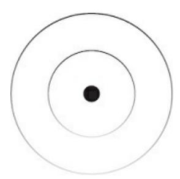

### THE GAME

On November 23, 2004, a software development company, Blizzard Entertainment, released one of the most popular games of the 21st century.

Little did they know they created a microcosm of life that would impact the world far beyond the limits of its predecessors.

The game was a massive multiplayer online role-playing game – or MMORPG – called World of Warcraft. Think of it like real life. But if that life took place in a time when dragons, castles, and spell-casting elves or shapeshifting bear-like creatures were a thing.

Let's imagine you were a player in this game. When you first boot up, you are prompted with a series of choices. First, you choose your race, which isn't a possibility in the physical world, but

{64}------------------------------------------------

let's use our imagination here.

Do you want to be a human? What about an orc, troll, or gnome? You would be correct in assuming these aren't the conventional interpretations of "race," often assumed from skin tone. Instead, the races of this game were tied to a culture that was constructed by the software company itself.

That way, players could become even more immersed in the virtual world.

This is no different from cultural programming in reality.

Next, you choose your class, preferably one that you would enjoy playing as. You have free reign to become a warrior, mage, or something more utilitarian, like a paladin. Keep in mind that your choice here will determine

the opportunities available to you in the future. One quick decision could lead to a game you don't care to play anymore.

After changing your hair, stature, and other cosmetic details (all impacting your enjoyment of the game), you are launched into a specific starting zone.

In this zone, you run through a tutorial that teaches you the fundamentals, rules, and mechanics of the game. You practice slaying monsters, level up a few times, and begin your journey as the main character of the world.

Once you understand the game, you begin completing a series of quests –

that form a storyline – to gain experience. As you gain experience, new opportunities become available to you. You unlock dungeons. You can join a guild. You can travel to new locations to complete different quests. In the real world, we often aren't aware of what these opportunities can be, so we choose to remain stagnant, comfortable, and ignorant.

Dungeons contain bosses and bosses contain valuable loot. Higher-level dungeons require more skill, experience, and time playing the game. If you want valuable items, you need to develop your character to take on the challenge necessary to receive those items. It's not instant, but the most difficult challenges present the most profound lessons.

Guilds are like a community. They support each other, craft strategies to win, and help you level up faster than playing alone. But you can't just join any guild. Every guild has specific needs dependent on their collective goal.

If you aren't a good fit, you can't join. Guilds often join together or fight against each other like political parties or people that subscribe to a specific diet. When people join together to form a collective self, their shared purpose can be actualized much faster. But the potential destruction they are capable of is not to be taken lightly.

For each of these, you will serve a specific purpose depending on your prior choices. The path you take influences how you will play the game in the future. How you are able to play the game

{65}------------------------------------------------

determines your enjoyment of playing the game.

Be mindful, because if you want to have fun in the future, your present actions must reflect that. In this game, the big important decisions compound into a personal heaven or hell. In a game like this, you are almost forced to be conscious of your choices. In reality, social conditioning leads to mindless action that when gone unchecked can take years of stagnation to undo the damage. Wake up now.

The last notable pattern in this virtual world is the currency system. There is a public auction where you can buy and sell resources, power-ups, and upgrades. Each of these hold a different value that is determined by the players' goals within the game.

The profession you specialize in, the abilities you upgrade, and the skills you stack will determine how much gold you can acquire. If you specialize in blacksmithing, the items you craft may be more valuable than what someone else can create. But will you enjoy that path? Or are you doing it for the money? And if you are doing it for the money, will you remain a slave to it? Or do you have a plan to use it as leverage toward your ideal future?

The skills you acquire will determine the challenges you take on. Those challenges expand your awareness of profitable opportunities. Profitable, in this sense, goes far beyond a dollar amount.

My generation is notorious for transferring their obsession for video games into the real world. A majority of my colleagues learned how to level up their character, stack gold, and have the discipline to log on every day and repeat the same boring actions that lead to exponential results. It's no wonder they have multimillion-dollar businesses doing what they enjoy.

Whether you've played these games or not, there is a lot we can learn from them. That is what I am here to help you understand.

### THE COLLECTIVE HARD DRIVE

Life is a game and the select few that are aware of its existence are the ones that can play to win, maximize their enjoyment, and sleep well, knowing that they are in control of their future.

The game of life makes sense from a macro perspective. But it is all too common for people to narrow their minds on the micro games of life. The new car that you want so badly. The person that cut you off in traffic.

Maybe even the argument you had with your significant other. The situation has passed, and you haven't won the meaningless game. Your mind keeps dragging your focus back to it, as if it can still be won.

If you can mold your mind to see a situation for what it is, a game, by creating a beneficial end goal, constructing a path to get there, and deciphering the most advantageous actions you can take, even mundane situations can become enjoyable.

As humans, we have a perpetual thirst to learn more, primarily for survival.

{66}------------------------------------------------

All our actions are influenced by the need, not want, to go on. It's in our blood. Everyone has the opportunity to master, transcend, and include their survival. This takes development over time but is a worthwhile pursuit for those that want less stress, more creativity, and the ability to choose the games they want to play.

We learn and learn from our parents, teachers, and friends, who learned from their parents, teachers, and friends, who were influenced by their life path, culture, and society. Schools, governments, and religious institutions rank the highest in authority and are often the first sources of information you are exposed to when seeking an answer to solve your problems. To be good in school, society, and religion, you must wash your mind with the teachings of school, society, and religion. A social fabric that relies solely on itself to make sense. Groundless, but necessary. A tool, not a master.

This vicious learning process began at the inception of human consciousness and continued for eons until this very moment. Layer after layer, we overloaded our minds, and our minds efficiently stored that

information – so we have the mental energy to learn more – to aid in our survival.

The problem is a lack of questioning. When we are young, we don't know any better. Who is going to question what they are told when they don't even know what a question is?

Throughout this evolutionary process, human nature began to reflect in larger entities, like society. Similar to how we stored information in our minds to free up more mental energy to learn, we built solutions for worldly problems. Layer after layer.

Plowing fields took a lot of work, so we used our creative ability to solve that problem with a tractor. Trade was unfair, so we created currency.

Communication was limited, so we created social media. The pattern here is that problems are never solved forever. Your problems don't go away, you just get better at solving them. Some view this as daunting, while others view it as their way out of suffering.

To create, the idea must come first. To innovate, the creation must come first. The tractor would be an impossibility without the plow, and you can't fix a problem that doesn't exist (because the creation that creates the problem doesn't exist).

To keep a long story short, modern society emerged and the collective psyche was conditioned to reflect that. Those that teach us when we are young already have a game that they want us to play. Retirement is how you win, schooling and high-status jobs are how you play, and our decisions occur without conscious choice. Our fate is decided unless you are made aware of a better path and choose to create, play, and win your own game.

This is less about an evil overlord planning to enslave humanity and more about humans wanting to survive in the most efficient way possible. The collective unconscious got you into this mess. The conscious individual can get you out.

The game is programmed onto the collective psyche. You can't change it, but you can

{67}------------------------------------------------

understand it. Once you do, you can deconstruct it, recreate it, and maneuver yourself to the top in a fulfilling manner.

### THE NON-PLAYER CHARACTER

Every *thing* is a mental construct, a unit of mind, and only some are aware that their accepted web of expectations controls their lives. Those that aren't aware of its existence have a hidden agreement that these floating buildings are reality.

You can opt out of playing the game, whether it be social, personal, or anything in between. That is to say, you don't have to take control of your life. But you can't escape survival. Even when you stand still, you are forced to move. By doing nothing, you become a modern slave. Not in the physical sense, but mental. Attention, not labor.

The mind craves order. Our attention will always gravitate toward a hierarchy of goals, that form a game, to ease the sense of uncertainty that is baked into life itself. If you don't focus your mind on what you want, it will be focused on what others want for you.

The masses flock to secure career paths and belief systems. An illusion of certainty to avoid struggle. They are convinced that this path is the one of the least risk, when it is the opposite.

In a video game, a non-player character, or NPC, is any character that is not controlled by a player. They are programmed to do what they are told.

NPCs can be vendors, teachers, dungeon bosses, and even public figures.

They help guide players through their own story by providing a structure for the game to operate. A video game wouldn't be that fun if it was you alone without anybody to interact with.

In the real world, NPCs can be considered modern slaves. They are human like the rest of us, but they never questioned their conditioning. Their mind

soaked up cultural and social constructs like a sponge. When you interact with these individuals, they will spew information to survive the identity they have adopted. This is how they guide your attention toward the "safe"

path.

Understand that polarity still applies here. Across all domains of life exists a spectrum of personal consciousness and unconsciousness. We are all NPCs at times and main characters at others. The goal is to reduce our time spent in the former with time and reflection.

In Western culture, by the time the average individual turns eighteen, their life is already mapped out for them. Their beliefs are static. Their career path is static. Their sense of self is static. Immovable.

Unless an individual can question everything – and I mean everything –

{68}------------------------------------------------

they will embark on the path of the NPC. Little chance at personal evolution, which has vast ramifications.

In the 3rd millennium, where the status quo is cracking at the seams, every individual has a chance to become the highest version of themself. When most people have a sense of self that is the product of the external world, you have the chance to peel back the layers. You can build a self that is a conscious, personal creation that works less, earns more, and enjoys life.

### **RULES OF THE GAME**

Games present the big goal of winning, accompanied by a descending series of goals – each presenting their own level of challenge – to bring clarity to your decision-making as you play. That way, we don't get overwhelmed by the demands of winning the game.

If your ideal future – or life's work, vision, or purpose – seem out of reach, this can cause you to hesitate when acting toward a better future. Because it is uncertain, which invokes anxiety. A plan creates clarity, and clarity creates action.

In a game, the default grand plan has been strategized with data and made static. All players can learn to play. But your life is unique. Nobody can create a plan for you. If they can, you relinquish the most important trait you can choose to develop, which is the creative ability of your mind.

Instead, it is wise to learn the game, deconstruct its parts, break a few things, and create a better one that doesn't get you in too much trouble.

In society, the end goal is retirement. To win, you are supposed to be a good student, memorize every fact without nonacademic question, and work your way up the status ladder until you can get some of your time back.

In a video game, the end goal is reaching the highest level (and, in many games, there is no highest level, the progression is endless). You will have to slay monsters, improve your skill set, and log on in a consistent fashion to complete time-bound quests.

In a board game like chess, the end goal is defeating your opponent. To do that, you must outwit them with every move. Big-picture strategy is king; don't get trapped in the technical details.

In everyday situations, like your spouse shopping for home decorations, she wins by finding the perfectly affordable match for the goal she holds in her mind. You may find this incredibly boring. You may even start an argument with her. But if you were to order your mind by creating your own game –

like finding the stupidest-looking decoration – then you also have a chance at winning regardless of someone else's decisions. The enjoyable time with your spouse is, of course, an added bonus.

Aside from a hierarchy of goals to guide your attention, games have 3

important qualities to help reduce the potential for distraction even further: frame, rules, and

{69}------------------------------------------------

mechanics.

The frame is the playing field. It is a constructed reality that allows your mind to focus on what is occurring within that reality. The frame is mental and begs understanding. If you don't understand what game you are playing, you will get bored, anxious, or overwhelmed.

In the real world, the frame is your perspective. We will dig into this later, but your perspective allows for accurate perception of the problems within a situation. If you are shopping with your spouse, your perspective — which holds and influences your beliefs, thoughts, and emotions around the situation — will dictate how enjoyable the situation is for you.

Within that frame there are rules. Rules are conditions, limits, or distinctions that the game makers enforce to narrow your attention on the task at hand. When your attention becomes one with the task, you increase the potential of tapping into an addictively enjoyable state of mind, where distractions do not phase you. In this state, you are making pure progress toward a conscious goal.

From a Universal perspective, rules are synonymous with limits on infinity.

Or content in consciousness. This is how we operate as a collective and bring ordered information to the mind of the individual. If you were the only being in this world, you would have no use for things like language, money, or games. You would sit back in pure experience as the infinite song unfolds before you.

Anything that can be put into words is a self-imposed limit that prevents us from understanding what can't be put into words. This isn't bad, because we need to be on the same page as everyone else, but it is a useful distinction to avoid getting trapped on the surface. Limits provide structure for our mind and ground our attention in reality, but there is a depth to this life that most people never realize. Conditioning creates conditions for your happiness. Use them but see through them.

In a game, these limits and conditions are called rules. But these rules aren't introduced all at once. It is a progression. From novice to intermediate to advanced. As you increase your skill, and the rules become second nature, more are introduced that increase the complexity of the game. That way you don't get overwhelmed.

Lastly, there are the mechanics of the game. These are a sequence of actions that you practice to increase your skill level. This requires you to learn, fail,

and improve to gain experience. Learning the rules through theory will only get you so far. You must implement what you learn by practicing the mechanics of any game in front of you. You get better at something by doing it. Social skills, writing, design, making money, getting a job, creating your life's work, cooking, and any other skill or trait that your character can adopt. You suck at it because you will do everything but that.

This is a harsh truth that nobody wants to hear (and everybody will search for endless theory to avoid).

{70}------------------------------------------------

If you can break the compulsive pattern of mechanical thoughts, emotions, and actions, you create space to expand your mind, set conscious goals, create clarity, and refocus your attention toward conducive action.

### **HOW TO PLAY**

When you have absolute clarity on how to win and a sprinkle of challenge that matches your skill level, the world goes quiet, and you become at one with the river that is reality. Formless, boundless, limitless. Top athletes describe their performances as spiritual. They've developed themselves to a point where their skill becomes art. Intuitive. Natural. Creative. They've transcended the need to think about what they are doing. They just do.

Pure progress is a blissful experience. Some call it the flow state. When you are at one with what's right in front of you, leaning into the flow of nature, problems lose their weight and nothing else matters. All is well.

If you start playing a game, especially without reading the rule book, will the experience be enjoyable? Probably not. And even if you knew the rules, it wouldn't become enjoyable until you grasp the mechanics of the game.

If you were a level one character, an absolute beginner, and somehow managed to battle a level one hundred, a seasoned expert, would it be fun?

First, you'd lose immediately. Two, it would only have the possibility of being fun if you mold your mind to create a new game. Like if you were to

attempt to lose as fast as possible, which may be fun, but won't get you anywhere in the world.

If you had played chess a few times with your friends, would you even consider entering a competition? Or playing against a Grand Master? What about the mind game of emotional turmoil? Have you practiced the skill of mindfulness to mend your mental fractures and trek onward toward your goals? What about an argument with your spouse? Nobody wants to label this situation as a "game," but that's what it is. Do you have the education, techniques, and experience to find a common perspective, work through your problems, and heal the relationship?

If your skill doesn't match the challenge that the game presents, you're in for a bad time. If your skill is high and the challenge low, you will get bored. If your skill is low and the challenge is high, you will get anxious.

When the challenge is just above your skill level, but you have absolute confidence in your ability to execute, you tap into what is arguably the most enjoyable point in the human experience (that is accessible without drugs, herbs, or other external compounds, of course).

The boredom stems from self-centeredness. Your focus breaks, a new desire pops into your head, and related thoughts start to fill your attention. If you are bored at work, you will start thinking of more productive things you could be doing.

{71}------------------------------------------------

The anxiety stems from self-consciousness. Your focus turns toward your concept of self, and again, related thoughts start penetrating your field of awareness.

"Wow, I'm not as good as I thought."

"I really need to work on my backswing."

"That girl is way out of my league."

Notice the use of "I" and "my" that implies a comparison. This comparison leads to entropy: the mind tending toward disorder unless you focus your

mind on the frame, system, or game that forms the structure of the situation.

Ordered information must be processed by the conscious mind for energy to flow.

This pattern gives us incredible insight. By understanding the delicate balance of challenge and skill, we can turn a mundane and stressful situation into one of meaning and mastery.

As a teenager, I despised sports. Anytime my friends or family would invite me to watch, I would have a little chuckle in my head. Sports? Why would I waste my time watching other people compete? Why wouldn't you just go and compete yourself?

When I did watch a sports match, my mind would turn to immediate boredom. I didn't understand the depth and skill that went into playing the sport at such a high level, so my focus was not engaged with the players on the screen. I did not have a predictive game in my head that I was playing like everyone else. My attention gravitated toward the thought of doing something worth my time.

As another example, if your spouse likes shopping for vintage items and antiques, assuming that you don't, you won't have an enjoyable time shopping with them. Your spouse is in flow checking prices, details of the item, and asking questions about its origin.

Your potential for boredom is high unless you create a frame to engage your attention with specific information that the situation presents. If you don't have the time to study the art of antique hunting, you can create a game that you are skilled enough to play. Like finding the smallest, oldest, or most interesting item.

As a practice, we need to understand the distinction between content and structure. Most people flood their consciousness with the content of a game without a big-picture understanding of the structure. This allows other ideas from your perspective to fill in the blanks in a chaotic manner. In a metaphorical sense, pure content is like water flowing from a faucet.

Structure is a solid cup to hold the water. In between is like trying to bind

water in a paper envelope which, as you can imagine, will only lead to frustration.

The game is the structure that is reinforced with rules, mechanics, and other nuances that create a

{72}------------------------------------------------

mental house that we can navigate with ease. If you don't zoom out to observe, learn, and understand the structure, you will drown in the technical details of each situation.

The traffic system is the structure of the transportation game. I wouldn't recommend treating it as a competitive match, of course. But there is a starting point, an end goal of arriving at your destination, and laws that you must abide by to arrive there safely that order the content of your consciousness.

If you were to hop into your parents' car as a fifteen year old to "take it for a spin," the challenge would outweigh your skill in a manner that doesn't engage your attention. Your mind would be flooded with thoughts of a stressful future, where you are punished for your immature actions.

As you are driving, you wouldn't know where to stop, how to stop, how to maintain speed, how to maneuver the car in a roundabout, what to do if you arrive at the same time as another at a 4-way stop, and so on. Most of those reading this book can drive like they walk. It is a skill they have developed over time with a set societal system so that everyone can operate in a mutually beneficial manner. We often don't stop to think how many micro decisions we make while driving. The system is so efficient that it requires little mental energy to get to your destination.

This concept is best understood through practice. Take a moment and think about the game-like structure of culture, society, corporate jobs, and other aspects of reality that were conditioned into your mind as a child.

In future chapters, I'll walk you through the process of creating your own games. Like building a creative income source, actualizing your ideal future, and handling negative or mundane situations through the art of focus. Note that I may not explicitly label these as "games." I would encourage you to make that connection for yourself.

If you remember anything, remember this. You need a challenging end goal that you want to achieve, clarity on how to get there, and a simplified first step to reduce the friction of getting started.

The push-pull nature of increasing your skill to match the challenge of a situation makes sense. But there are developmental stages in any game you choose to play. Beginner, intermediate, advanced, and more, depending on the game.

This is the path of mastery. As you push toward your ideal future, you will be forced to upskill to match the challenge that any hierarchy of goals presents. Be wary of those that put a clear path in front of you. In a world where the masses flock toward the promise of a certain future, a wise decision is to embrace the uncertain nature of life itself and create your own certainty through focus.

{73}------------------------------------------------

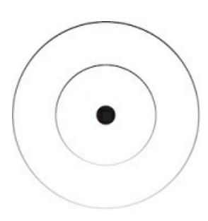

### THE LENS

Everyone is playing their own game, both macro and micro. Everyone is at different levels of the games. Everyone has their own unique skills, traits, and specialties. Everyone is a part of their own faction, guild, and group of confidants.

Everyone has taken a unique path to where they are now and will have a unique path to where they are going. Your ability to mold your mind to understand the goals that others are pursuing from their individual skill level will make you less reactionary (it will also make you more money).

This practice alone is responsible for much of the peace in my life.

Everyone may seem wrong, but when you take their conscious or unconscious goals into account, they are right.

You can't control the details of every situation, but you can control the vantage point from where you interpret those details. Then, you can filter the insignificant noise that does not serve you. All that's left is a signal of importance that pushes you toward action.

Like a film set. A scene is composed of the camera angle, focal length, lighting, props, quality of equipment, actors, and script that determines how the scene manifests. If you are an actor, it is easy to get absorbed in the details of the scene. You may forget that you were even filming a movie. If

you are the director, you understand that everything that goes into the scene serves a purpose for creating that reality.

Every aspect of that situation is crafted in a way that makes the scene interesting to the person watching the film. One that both the director and viewer can get immersed in. So much so that they forget about their worries. In the real world, we do not see ourselves as the director of our own film, and we especially don't see others as the director of their own.

So, we compartmentalize reality and see what we want to see. We love what serves our fabricated identity and hate what we don't understand. When someone makes an upsetting remark, you snapshot that individual, thought, or emotion as "bad" in your mind based on your conditioned and relative perception of what "bad" is. In fact, that upsetting remark could have been the catalyst to you taking control of your life. It may have held truth that you didn't want to face. You must realize that your inability to see this never-ending movie for what it is makes you reactionary. And that is usually not in your best interest.

{74}------------------------------------------------

The tragedy of human nature is that we consider a situational snapshot as an explanation for the entirety of a person's being, ourselves included. In reality, one situation that you perceived as negative, meaning it is only negative to you, comprises such a small percentage of someone's life that it wouldn't be worth writing out here, because the moment has passed. We see less than a 0.001% of someone's life and yet we think we understand the complexity of their mind, being, and self.

Humans make sense of the world by telling themselves a story. Even if we see it as someone else's story, we interpret it as a part of our own, as that is the only way we can make sense of it. Since we will never have access to another person's state of mind, we take what we see and make sense of it based on our past experiences, future goals of varying consciousness, and our interpretation of the situational game we are playing. This is a recipe for suffering.

### ARSENAL OF LENSES

You are a perspective vessel in a subjective reality. You have the ability to shift that perspective beyond a narrow identity to view situations from a higher, more holistic perspective that encapsulates the background, foreground, and detail of the situation.

Your concept of self, at this moment in time, is forged by the ideologies, dogma, and forms of the outer world that you identify with as static. This limits the potential experience available to you. Nobody can escape this, and the moment you think you can is the moment you become trapped in the pursuit of spiritual materialism. Thinking of yourself as higher, more noble, or less egoic is still a status game that the ego loves to play.

For understanding, let's think of perspective as a DSLR camera, one of those big fancy ones that photographers use. The body of the camera has its limits due to how it's programmed. You can attach different lenses to the camera to capture a situation in a way that influences how the image is perceived based on your intention with the shot.

As you trek through life, you capture photographs and develop them through your level of mind, accompanying emotional state, and degree of focus. This is how you interpret any situation you are in, and that interpretation is confined by the structure you operate within.

Let's think of the field of view, frame, or perspective of the lens as your field of awareness. When you hone in and fixate your focus on one thing, the background blurs. This also impacts how you interpret a situation.

So, if your camera is positioned on top of the world, but your lens allows you to focus on a skyscraper, the entirety of the world will look like a big blob of blues and greens while the skyscraper is crisp and clear. This is an illustrative description of how you "zoom out" to gather truths, patterns, and creative resources and "zoom in" to apply them in your practical life.

We can consider what is "clear" to be conscious and what is "blurred" to be subconscious or unconscious. This can work for or against you. If you hold the perspective of your future self in your mind and focus tightly on a task that will create your vision, distractions won't register in your field of awareness. This is what we want. Clear and unbroken focus on what is important to us. At least until a new importance is discovered as the last one inevitably fades.

{75}------------------------------------------------

But if you limit your perspective to your concept of self and focus on a problem, like a negative emotion within that perspective, your field of awareness does not have the possibility of seeing the situation for what it is.

This is the default state for most people. They spot and interpret problems from a narrow perspective and often the least conducive one to a better future.

To prepare ourselves to make better decisions in alignment with our goals, we must collect consciousness so we can mold our mind in a way that reduces the friction to act.

You collect consciousness by studying multiple perspectives with the goal of holistic understanding. If you are an atheist, and have not experienced a Christians perspective, how are you going to align yourself with the highest truth? Both perspectives that are heavily influenced by culture and experience hold half-truths, and when you experience both, you inch your way toward deeper understanding.

Rather than becoming attached to a specific way of doing things, see it for what it is, a perspective in a subjective reality. When you study different perspectives, you are collecting lenses for your camera. You expand your mind beyond one limiting worldview. Spirituality, atheism, Christianity, veganism, fruitarianism, freelancing, and small business ownership are all lenses for modeling meaning, nutrition, and business from an angle that highlights specific tactics that help individuals with specific goals. The perspectival background of principles can be useful to anybody, but the foreground of tactics requires a self that fits into the puzzle. Your brain is a pattern-recognition machine, and when you study with a mind open beyond

the surface, you allow truth to blur in the middle and develop a self that is less reactive to the external world.

If you start a business to solve your money problems, start training to improve your health, or study social dynamics to help with your dating success, study the big picture. Understand the overarching principles, without getting attached to individualized tactics, and let experience reveal your own way.

With time, and as you collect an arsenal of lenses, you become conscious of patterns that are packaged up in an enticing way with a specific label slapped on them. These patterns often represent the fundamentals, principles, and levers that contribute to progress on the Universal scale.

### MAKING BETTER DECISIONS

You, at this very moment in time, are a manifestation of your past mental, physical, financial, and spiritual choices. Who you want to become is a manifestation of the choices you make at this moment, and the next, until it all comes to an end. Not in the sense of physical death, but until your ideas stop rippling through the Universe that houses the selves created by said ideas.

The importance of decisive accuracy cannot be stressed enough. But most people can't get themselves to act on anything without immediate benefit.

{76}------------------------------------------------

Their mind is narrow, but not open to the future.

The average individual will not register potential opportunities because their field of awareness does not register it as important. They do not have a meaningful hierarchy of goals to position their perspective as a lens to view daily situations from. They may spot one, like a business opportunity with shallow promises, because it would tickle their fancy for status, but their mind quickly distracts itself back to a state of cyclical, immediate, and destructive pleasure.

Life is a mind game, and if you don't have the skill, you won't be able to continue playing. Your quality of life is dependent on the quality of games you choose to play, because those demand a specific quality of mind to play them. Beware that this path is a beautifully painful one. A certain level of mind breeds a certain level of loneliness. With every level of mind there are less people occupying that state. But when you find them, the connection you have is one that lasts a lifetime.

The mind game houses infinite mind games. Each game has a string of goals. Each goal presents an increasingly difficult challenge that demands an increase in mental skill. All skills are of the mind, and mental mastery is how you fight back in a world that wants to steal your attention, manipulate your thoughts, and make you feel helpless.

The problem is this: people get trapped in a specific mind game, fail to understand the situation, and don't practice the skill that will take them to the next level. A gradual increase in awareness through silent observation, contemplation, and questioning leads to deep understanding. If we want to see your problems for what they are, you must learn the art of zooming out.

Unless you are a mechanic or have a passion for it, you don't need to know the technical details of a car to understand its implications on your life and the world. Instead, you understand a car's role in the world, learn through study and experience, and practice the skill of driving with an accepted system that orders individual and collective minds.

The same does not hold true for driving through life. Your mind is the engine, and the more you deconstruct, study, and experiment with certain aspects of it, you can drive with speed through the mental roads that compose reality itself. You must develop a passion for the mind itself if you want to get to the root of existence.

Understanding is infinite. It is how you raise your consciousness in an upward fashion. Most teachers, gurus, or masters help you in a downward fashion through tools like meditation. Which is necessary to increase the

space between your thoughts by quieting your mind. Both are necessary but the former is often neglected.

Similar to a human's depth of focus, understanding is another unique and inherent aspect of our being. Knowing is not understanding. Knowing implies a label, limit, or distinction that the mind creates. Understanding is different. It is how you explore the interconnectedness of life through observation.

I can understand a game from the top down by questioning not only its source but its impact on

{77}------------------------------------------------

the world. If you don't zoom out to see the entirety of its implications, you won't be able to see if you are climbing the right mountain.

To help illustrate this difference in human consciousness, we can observe apes. Our furry predecessors do not plan or ask questions to the degree that we do. A human, with time and practice, can throw a football and hit a bullseye from fifty yards out. As can we create a vision for the future and actualize that reality through conscious practice. An ape, on the other hand, can fling feces, but it usually ends up straight on the ground in front of them. I'm assuming that you don't want to be feces flung at the ground, which stresses the importance of going beyond yourself through your creative ability, not regressing into your animalistic nature.

Human understanding, which has a direct correlation with quality of life, comes down to asking quality questions. Apes don't do this. They can learn sign language and communicate in a half-baked manner, but to my knowledge they don't attempt to create new knowledge through questioning. They don't realize that other beings can know things they don't.

As a thought experiment, let's look at a common ingredient like honey.

Simply asking, "Where was this honey made?" can lead me down a rabbit hole of discovery. I can follow that line of questioning to the bees that made it, the pollinated flowers, the beekeepers involved and their ethical treatment of their bees, where the honey was distributed across the globe,

what meals the honey is used for, the health benefits of raw and unfiltered honey, the health detriments of processed honey, when bees emerged on the evolutionary timeline, what their purpose is in more than just ecological function, and how any of that information can help in the achievement of my goals. Everything you see has an iceberg of understanding beneath the surface. Observe and question.

You can try to apply this same practice to any negative thought, emotion, or situation that you do not enjoy. Question it. Follow it to its source. Observe how all the moving components in the system impact your life both right now and onward into your ideal future.

Understanding your problems means to perceive them from the highest level of mind available to you. From that expanded perspective, you can begin to experiment, iterate, and create a long-term personal solution. For now, attempt to adopt the perspective of your ideal self. Perceive situations through their lens and embody their values through action. Who do you want to become, what actions does that identity perform daily, and how can you integrate that into your current lifestyle regardless of how long you spend on those activities?

Problems are only problems if you interpret them that way. If you don't feel like getting out of bed, zoom out and realize how measly your problem is from a higher perspective.

With time, you can seek to zoom out further and embody the perspective of the Universe. What behavior is your problem influencing and how does it impact the world as would a jar of honey? Can you make sense of and find relief in the fact that your situation matches the ebb and flow of the Universe? Are you a slave to the fabricated expectations of reality? Or can you zoom out and see life for what it is? The actions you take, or lack thereof, have a widespread impact on your

{78}------------------------------------------------

future that can't be seen through the lens of your problem. Problems that prevent positive choices can only be solved by the emergence of a new perception that stems from a higher level of mind.

When mental battles are at your doorstep, don't fight with it, flow with it.

Pause, zoom out, observe, and when you gain clarity through the intangible resources you've acquired, dive back in and execute with focused effort.

### 125 BILLION BITS

The conscious mind can process fifty bits of information per second. If you live until the ripe age of eighty years old, you can process around 125

billion bits of information in your lifetime. This information is processed through focus, which expends mental energy and results in a varying quality of experience.

A large chunk of that information will be processed by necessities like grooming, cooking, and running errands. The rest will be processed by work, rest, play, and the distractions that pull you away from giving your full attention to meaningful living.

Imagine your life potential as the 125 billion bits of information you can process. If your focus isn't strategic and you become a victim of modern mental enslavement, your potential is already decided. Your attention will be manhandled, your sense of self will be an unconscious monstrosity, and you will end up an average clone without your knowing. Nobody wants to wake up wondering where the time – or information – went.

The unconscious mind can process eleven million bits of information per second. This is incredible and shines a light on the fact that most of what we think, say, and do is not an absolutely conscious decision.

As we improve our mental skill that is built by our physical, spiritual, and financial development, life becomes more enjoyable with time and practice.

Learning how to walk is a skill. It's as difficult, if not more difficult, than learning how to build a cash-cow software business. But once that skill is acquired, you can expend a fraction of the mental energy and stack complimentary skills through focus until you create a powerful character.

As we learn and become more comfortable with any aspect of reality, that information is stored and used by the unconscious mind. Do you have to think about walking, or do you just walk? Do you know how you are doing it, or do you just do it? I'm not asking for a scientific breakdown of knowledge, proof, and labels that came into existence after our ability to walk. I'm assuming you don't hold every muscle fiber and biomechanical formula in your mind while strolling down the street. In fact, walking is close to nothing compared to the unconscious Universal processes unfolding all around you.

The default state of consciousness is chaos. You have experienced this before. Unless your mind is engaged with a thought, task, or stimulus, it will wander off in a negative direction, anxiety, or

{79}------------------------------------------------

boredom. When we allow randomness into our lives, negativity increases in potential.

When you set the goal of achieving "good financial health," as a mediocre example, the thought ends there. And if we don't maintain our focus on that outcome with a plan, perspective, and distraction mitigation, negative thoughts flood our mind that influence our ability to act.

The thought of making a lot of money is great, but since you have not achieved it, that is the only positive outcome unless reinforced with evolving reasoning as to why you want to achieve it. On the flip side, your mind can wander to the bills you need to pay, the school loans you forgot about, a potential tax audit, paying your friend back, the rising gas prices, the cost of energizing food, and each of those can splinter your focus infinitely with the negative thoughts associated with each.

Nobody can make up their minds on the best mental, physical, or financial plan because it has become increasingly difficult to order our minds on a meaningful hierarchy of goals. The modern information landscape will throw you into a chaotic loop of overwhelm if you lack the ability to focus.

The only option is to forge your own path. You must set a conscious goal, create clarity through self-education and experimentation, and abide by the principle of progressive overload: to increase the challenge, practice until

your skill is up to par, and repeat the process as life lessons compound into a personal philosophy that can be shared to advance the collective mind.

The average individual yearns to break free of what used to bring order to their mind, like working a job, because the challenge has stopped increasing. They've been doing the same old thing for too long. Their mind races toward anxiety at the thought of future work, and while we are there, we think of something better we could be doing.

We look forward to the weekend and, come midday on a Sunday, we find ourselves with "nothing to do," gravitate toward boredom and seek to fill our time with whatever entity, often negative, that pops into our heads. As the day goes on and worldly responsibilities close in, the anxiety starts to creep in.

The solution to this endless negative oscillation is education, clarity, and action. This book, up until now, has been for education and awareness. For clarity, we need a firm understanding that we can only have full control over one thing: our focus. The order we create in consciousness.

Through focus, we can control what goes into our mind, how we interpret that information, and what we produce with it. If we want to create and maintain an enjoyable order in our lives, we need a progression of engaging external stimulation to dedicate our focus to.

We clearly want to fill the 125 billion bits of our finite focus, or potential, with the information that will make life most enjoyable. But it takes time to dig yourself out of the programmed hole you find yourself in around fifteen years old; most realize this even later.

When you combine necessities like grooming, cooking, and errands with fifteen years of

{80}------------------------------------------------

unconscious buildup, our potential decreases even further.

You no longer have a full 125 billion bits to fulfill, but don't let this split your focus into a state of anxiety. While this is an urgent matter for those that know they are meant for more, you cannot change where you are; you can only change the perspective you hold that will lead to beneficial action.

Reflect on your past. Has there ever been a point where you learn something new, become obsessed with it, and feel like you are on top of the world? A new diet can bring you physical energy, but we tend to neglect that most of that sudden boost is the result of clarity.

When we follow a routine without waver, stick to a new meal plan, or discover a new passion, we feel good. This presents a potential trap. Many people attribute the good feeling to the ideology, method, or tactic that brought it into their life. Those that realize the source of enjoyment is clarity will be able to experiment with methods in an open state of mind.

From there, they can create their own method so that when the other inevitably fails them, they aren't boxed into a state of mental turmoil.

The quality of your human experience is most influenced by the structure of the information you process. When you create a meaningful hierarchy of goals, acquire the skill necessary to achieve those goals, and act from the perspective of your highest self, life becomes enjoyable. This is in your control but is not immediate.

When the external is aligned with the internal, and focus is tight, the unconscious powerhouse of a mind sends resources to fuel your present-moment actions. Being and doing collapse into one. I'm convinced that most people have experienced this wonderful state of consciousness but have no clue how to replicate or sustain it. A beautiful harmony of progress being made without a worry in the world.

As we push back against entropy, our focus must evolve as we do. We must structure the game we wish to play, learn how to play, win, and create the next one. Because if you continue playing the same game, it will either become boring, or you will be caught up in one that you may not care to play. And if you choose to play a game that you are not skilled enough for, you will either get anxious, or you will find an excuse to quit altogether.

Infinite games are that of the mind. The path of mastery in your endeavors.

One can begin physical training, but if they don't evolve beyond the superficial pursuit of looks, the game will collapse and life will lose meaning. Enjoyment is found in the small improvements made in all

domains of life. And improvements are infinite if you continue to expand who you are.

### THE PATH OF MASTERY

The closed-minded quick-fix attitude toward life is the greatest trap of our times, and it runs much deeper than the average person believes. Which is ironic, because the reason they think

{81}------------------------------------------------

they aren't a victim of closed-mindedness is closed-mindedness in itself.

Closed-mindedness encapsulates a host of other problems like distraction, reactivity, surface-level living, falling for get-rich-quick schemes, lack of commitment in business and relationships, and the inability to discover and pursue one's purpose.

The biggest culprit of this problem is your inability to increase your level of mind beyond your programmed perspective. You become a victim to the web of expectations, concepts, and beliefs that circulate from situation to situation.

Your perspective houses your beliefs, thoughts, and experiences that you hold unconsciously as absolute truth in a subjective reality. When these become static, they are limits on what you perceive as possible in life itself or individual situations. Unless you can expand your mind beyond them, you are doomed to a life of the limits you imposed on yourself through unconscious acceptance.

{82}------------------------------------------------

You can observe this in your everyday life to become aware of your own mindless actions. When political elections roll around, each party will defend their stance as the best, because that's what they were told, and they failed to question. The same happens with entrepreneurs and ideologues defending their business model or belief system as the best.

Missing the point, essence, or message of any situation is the next culprit.

People read the bible from a literal – as opposed to metaphorical – point of

view and end up identifying as atheists. People also interpret God as a literal man in the sky instead of a symbol for an experience or phenomenon.

This misinterpretation applies to everything, not just spiritual belief systems. People close their minds at the literal interpretation of words so they can win the unconscious status game they are playing. They don't care to follow the words to the essence of reality that words are meant to guide awareness to. I don't blame them, of course, but there is an entire world of meaning that lies beyond literal interpretations that change from culture to culture and generation to generation.

People will hear the words from someone's mouth, which illustrates a microscopic fraction of who they truly are, then go on to plug those words into the story playing in their head. When this piece doesn't fit in their puzzle, they get offended, reactive, and negative because they lack understanding. This isn't a fulfilling way to live.

The difference between the quick-fix path and the path of mastery is that of climaxes. The pleasure seeker falls into a pit of endless climaxes that creates the largest-scale addiction known to modern man. The master leans into the Universal story, embraces struggle, and basks in the climax to come (but does not attempt to maintain that high).

You can observe the pleasure seeker's nature in media and advertising. In a beer advertisement, you see somebody at work for what seems to be 5

minutes before the scene cuts to them slouched on the couch, beer in hand, drinking the night away to escape the stress of tomorrow's workday. The path of mastery is a cyclical process of increasing our skill as we take on more difficult challenges, so we don't default to a state of anxiety or boredom. This process is most difficult at the start but becomes easier and more pleasurable with time.

When you start your journey of education, skill acquisition, and goal achievement, you will encounter a series of plateaus. At the start, these will be short and rewarding. You will see quick progress. As you endure, the plateaus get longer and longer. You are met with 2 options: quit and pursue a new climax or learn to fall in love with the process.

To fall in love with the process, you must refocus your mind on the depth and detail of the present moment. Like how a writer senses the smell of fresh coffee on a gloomy morning before typing the first letter of an unknown written journey. Or how a chef finds appreciation in the flow of water across their hands as they prepare a fine cut of regenerative grass-fed steak. The

{83}------------------------------------------------

path of mastery is a goalless journey that is directed by self-generated goals. A paradox that teaches you that goals help with order and direction, but that ritual, presence, and clarity bring ultimate satisfaction. It takes certain complexity of mind forged through struggle to expend mental energy beyond the surface-level challenges of a chosen endeavor.

A notable aspect of this process is the perception threshold. Any challenge, lifelong or local, is not perceived as difficult at the start. Maybe the act of starting is, and that is a challenge in itself, but actually starting any activity is usually the easiest part. As we continue on, the perceived difficulty increases, and thoughts begin to flood our head. Where most people quit is where greatness is born.

When we reach the point of immense difficulty, our mind gravitates toward expectations of how things should be, not what they are. If you persist through the mental discomfort, you will be forced to expand your mind to see reality for what it is. You cannot solve a problem from the same level of mind that created it. At this point, life offers a lesson to your problems, and you break through the perception threshold.

A perception, or how you interpret a situation, is a unit of mind. There are infinite ways to perceive a difficult situation. After each struggle, a new perspective emerges that allows you to perceive that situation in a more conducive manner. With time, and as you expose yourself to more experience, your perspective integrates aspects of the human experience and menial problems lose their impact on your well-being. When you stick out the difficulty of a situation and break through the resistance, you see a leap in mental skill that can take on higher challenges.

Some know this as the "runners high," where one overcomes a mental battle, their mind quiets, and even when it is an extremely difficult

situation, one can stick it out without complaint. This is normal to someone who enjoys running. The activity in itself is enjoyable because of the self-discovered philosophy that has shaped their worldview with time. This is a pattern found in the pursuit of any long-term or short-term goal. This lesson is best learned through experience, and now that you have the awareness of this phenomenon, I would encourage you to persist through the next challenge that makes you want to quit any meaningful pursuit.

Thanks to our default state of chaos and our inability to assume a difficult path between where we are and where we want to be, we procrastinate on our dreams and resort to a state of mental discomfort, which we often perceive as comfortable, because that's all we know.

Let's use starting a business as an example. After all, it's the next evolution for those that inevitably hit a challenge ceiling while working for someone else (and that ceiling comes quick). If I told you to work for free for fifty people and expect nothing in return, you would think I'm crazy. Or maybe you would try it for a bit, realize its difficulty, and come to the same conclusion of my delusional mental state. Then, due to a reinforced closed mind, you will go on searching for new tactics that promise faster results just to repeat the process while standing still for years on years.

If you can't see yourself doing something every day, why are you doing it?

{84}------------------------------------------------

If you say you want to do this work for 5 to 10 years, why does it matter if you don't get paid for the first 6 months? When you expand your time horizon and question what you want, you'll realize what the quick-fix behavior is really worth: close to zero.

This applies to every aspect of life, not just business. You didn't need a quick fix for learning to walk, speak, and brew your favorite coffee. You adopted them as a part of your everyday behavior after a grueling difficulty in acquiring the skill. The only difference between your goals then and now are the illusory mental barriers that prevent you from facing reality.

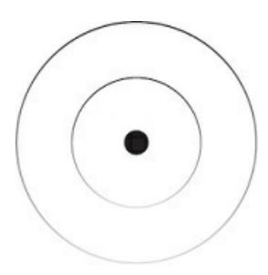

### THE FORMULA

You can do nothing with your life, nobody is going to stop you, but you won't escape survival.

By doing nothing, the default outcome of your life will be mindlessness, chaos, and destruction. This is no exaggeration. You have the choice to go beyond yourself through spirit or regress into the animalistic senses you transcended and were meant to include, not become a slave to. Human behavior boils down to problem-solving in alignment with a goal, whether it be conscious or unconscious, meaningful or meaningless, or the decision between creation and destruction.

When you aren't able to pay your bills, that's a problem. Most people will adopt a survival goal of getting a job that can fix their money problems.

When they get that job, they may remain unconscious as to how they fit into the machine that the company is. They lack a big-picture understanding of the company's impact. Some people may go on to work as a simple secretary for the military industrial complex, yet they are associated with the bombing of civilians halfway around the world.

If one were to become truly conscious of the impact of that company, they would be forced to create a new goal to solve a more meaningful problem that starts with their personal life. They wouldn't be able to do this in an

instant, of course, but they would see the potential of positive universal impact if they began to set goals and contemplate their vision.

Since their money problems have been temporarily solved thanks to the job, the stress that accompanies survival lowers to a manageable level. From that higher state of mind, they can set a goal to build a creative income source that serves a higher purpose.

The unfortunate reality is that most people will not become aware of how their actions ripple

{85}------------------------------------------------

across the globe. Not only in their line of work, but in every single goal they pursue that influences every single one of their actions. But the few that do, hopefully with the help of this book, are the future leaders that have first dibs at the good life.

Don't fall into the trap of conscious nobility. Like someone who just learned about the concept of spirituality and uses it as a moral high ground.

If you are deep in an unconscious way of life, it is impossible to switch exclusively to nondestructive actions. Everyone has a shadow, and the most successful individuals use what could be unethical skills as an ethical way to integrate their dark tendencies. And those that don't often manipulate others without knowing it.

You will have to manipulate, cheat, and contribute to evil. Nobody wants to admit that, and that's what chains them to it. Evil exists and is a necessary balance that allows good to exist. We all make mistakes, and it is foolish to think that those mistakes shouldn't be a part of your life. A majority of the population hides behind an unconscious moral high ground that contributes to more evil than the conscious individual that attempts to integrate, transmute, and harness their dark energy.

When you encounter a problem, you have a choice. For most, this choice is automatic and made in a way that best serves the unconscious manipulation of others that was conditioned into their psyche. Personal responsibility is understanding that you have the power to choose regardless of how you feel, and you must take it. Your future does not have to be the outcome of your past.

We need to create conscious goals for the problems in our lives. These goals act as a decision filter for making the best decision in that situation. When you inevitably make a mistake, and a new problem reveals itself, that too must be filtered and corrected with time.

A game is a system that requires individual choice. If we create, maintain, and invest mental energy into the games that will actualize our ideal future, we meet meaning and fulfillment.

### **ANTI-VISION**

If I start to visualize my father's eventual death, I get teary-eyed. A ball of energy radiates in my chest. Emotional energy. A powerful build-up of tension ready to be directed and released toward a goal. There isn't a specific story, aside from the thousands of experiences I hold with my parents, that accompanies this. Anyone can dig into the experiences of their past, generate a potent energy source within them, and focus that energy though action toward an intrinsic hierarchy of goals. This is the secret of the disciplined and successful. Self-discipline is when the desire to become the highest version of yourself outweighs the desire for cheap pleasures.

When I am stuck, I'll go on a walk. On that walk, I allow thoughts to trigger thoughts, which I will attempt to deconstruct into their smaller parts. When a thought catches my attention more than the next, I will sit with it, question it, and imagine the extreme situations that could arise from that thought, both negative and positive.

When a thought of my father pops into my head I ask, "Have I called him enough? He's getting older, Dan, you know that. Have you spent enough time with him? Would he be proud of what

{86}------------------------------------------------

you've accomplished? Or does this all even matter? What about Mom? Would she appreciate a spontaneous trip to her favorite spot? Do I have the time for that? Why is this all about time? Is my work taking away or adding to what I can give back to the parents that spent eighteen years of their lives raising me? I should call them."

From that paragraph, I gain a mixture of anger, sadness, ambition, and love circulating from my belly to chest to head. It feels terribly good, and boy am I ready to take on any challenge that gets in the way of the best future I can create for myself, loved ones, and those that come in contact with me.

You've experienced this same phenomenon. Think back to the last enjoyable vacation you went on. How did the sun feel on your skin? Did the trees, beaches, or mountains leave you in awe? And the place you stayed the night, did it give you inspiration for your future home?

When you were a child, what was something that you absolutely hated?

That thing you felt forced to do. That thing you never want to do again. Pull the feelings associated with that experience into the now.

If you want to get ahead of the majority of the population, here's a good exercise. Keep a notebook or journal handy. You'll be encouraged to use it throughout the rest of this book.

First, become brutally aware of 2 things: (1) What you don't want. (2) Where you will end up if you keep doing what you've been doing. Observe the masses and see where mindless action leads. It's not pretty.

When I reflect on my past, this alone brought clarity to my future. Like collecting the puzzle pieces that I didn't see when the situation first passed.

I love my parents, and they taught me incredible lessons, but nobody is perfect. Throughout my childhood, schooling, and religious indoctrination, I made mental note of the future I did *not* want to live.

It's easier to know what you don't want – from experience – than it is to know what you want – from imagination. But realize that imagination holds a lot of power. You need experience to fuel imagination. And when the 2

are combined, you create a frame that is impossible to distract your focus.

Create an anti-vision for your future. Write out every single thing you don't want, why you don't want it, and how you are going to avoid it. Throughout this process, you won't get immediate answers. Being conscious of your

mistakes will serve as your light in the dark. It may take weeks, months, or years to get answers to your burning internal questions. This is natural.

How do we understand what we don't want? Through a series of questions.

{87}------------------------------------------------

I cannot create or answer these for you. Let these serve as a starting point.

A spark to the fire. A thought that triggers further reflection. What does an unfulfilling day look like to you? What kind of person would you avoid as a significant other? How do you not want to look, feel, and act? How much money is too little to sustain your lifestyle? Why is it too little? What won't you be able to do with that money? What environment would you hate living in? Why?

Get meticulous here. Spend some time with your thoughts. If questions keep coming up, don't stop. And when you feel thoroughly uncomfortable, transmute that negative energy toward the opposite. Flip to a new page, refer back to the questions above, and write out what you think you want in your future. From your anti-vision, create a vision in which you can dance between the 2 to make better decisions daily.

The highest-paid individuals are the visionaries, strategists, and creative problem solvers of the world. Your vision is greater than yourself. It gives you a soft direction to focus the goals and actions that stem from it. Your vision should be big, not limited by belief, and emotionally compelling when you marinate your mind in the growing detail.

Your vision is your gift. Not a fancy machines on wheels, vacations, or the amount of money made from that vision. When you are walking down a busy street, it will show in your strut. When you are alone with yourself, you will feel at ease. When you are in the market for a potential partner, they will sense your dedication.

A clear vision is an eternal source of energy when consistently refined through self-reflection and conscious decision-making. Through the art of focus, you can tap into this intrinsic motivation at any time. Come back to your writing at least once a month to revise and remove limits on your potential that you had not seen before.

### **PURPOSE PATH PRIORITY**

The foundation of human behavior is purpose-oriented problem solving, and if you don't find a purpose with meaningful problems to solve, you will be assigned a purpose with mindless problems to solve. If you do not choose meaning, you will be assigned the opposite, because life demands movement even if you want to stand still and let it pass you by.

Purpose is elusive. New-age teachers seem to do a great job at telling people to live with purpose but fail to explain it in a coherent fashion. A purpose is a meaningful goal. From that goal stems a problem that you must focus your attention on solving through education, action, and whatever allows you to move toward the goal.

Your purpose is the most pressing problem in your life at this very moment.

The one that you have been putting off addressing. The one that you have not contemplated to realize the havoc it wreaks on your potential by preventing you from acting on a deeper purpose. Your *life*'s purpose is the big problem you want to solve in the world, but most people don't have the personal, professional, or social development to pursue that. Purpose evolves from superficial to metaphysical and you cannot skip steps. If you attempt to skip steps, you may see

{88}------------------------------------------------

progress, but you will be out of touch with reality until you are forced to snap back and solve the low-level problems preventing you from pushing further.

To open up room for curiosity, creativity, and consciousness, you must master your survival. That is, you must create a hierarchy of goals, solve the problems along the path, and prioritize where you focus your finite mental energy. Realize that mastery is a process. We never escape survival, but we create systems that are efficient enough to maintain a baseline level of stress while staying vigilant of becoming overly robotic.

Before you go off to solve big problems in the world, you must solve the big problems in your life. How else are you going to act with authenticity?

If you haven't met your basic needs, like having enough money to live stress free in that domain, you will always need something from someone

else. And yes, unless you plan to live off the grid and fend for yourself, money is a basic need in the current world. It is close to impossible to act with authenticity when your actions are influenced by need of something outside of yourself.

With time, you will realize that selfishness and selflessness are 2 polar ends.

They cannot be separated like oil and water. They are constantly mixing according to the situation at hand. People have been conditioned to think that selflessness in and of itself is the highest good. In reality, conscious selfishness will always come full circle into selflessness. From the highest perspective of the Universe, you and other are not separate. You are One.

And through self-actualization, you benefit the world more than the person that gives, gives, gives out of the unconscious selfishness disguised as absolute selflessness.

If you haven't developed yourself in any capacity, your current purpose, and the ones following, will increase in meaning as you solve your own problems. Start with what's right in front of you. Are you overweight and sluggish? Do you hate your job? Are you dealing with relationship issues?

Is your mind a storm of negative thoughts and emotions? You must confront what's causing the most pain in your life, dance with that pain, and create a plan to solve the problem. When you solve that problem, not only will you build momentum into the next, but your other problems will become easier to solve. This is not a linear process. Your problems are a tight-knit web that bind you to your current situation. Problems don't exist on their own.

Life is hierarchical, and there are 2 types of hierarchies. The first is a dominator hierarchy. This is what gives the term a bad reputation.

Dominator hierarchies reflect in nature. The alpha ape is at the top of the pyramid. He has his pick of women, food, and other resources.

The wisdom of nature reflects in mental constructs like society, most prevalent in corporate jobs. There are fewer people with more power at the top, and fewer people with more power at the

{89}------------------------------------------------

bottom. You can try to climb the ranks with your conditioned beliefs of "hard work" and doing what you're told, but the probability of reaching the top is miniscule. You must

develop and earn with the creative ability of your mind. That is how you create your own hierarchy, or game, within the system itself.

The common trait of dominator hierarchies is that they are not natural. They are characterized by a pathological unit of that hierarchy attempting to dominate the rest. Like a cancer cell attempting to replicate within the body.

These hierarchies eventually self-destruct unless the pathological unit is healed or reintegrated into the natural hierarchy.

The second type of hierarchy is a natural or actualization hierarchy. Best illustrated through creative emergence that transcends and includes its parts after a period of struggle, conflict, or pain. Like matter to plants to animals to humans. Or an atom to molecule to cell to organism. Or word to sentence to paragraph to book.

Natural hierarchies continue to push toward evolution through emergence and inclusion. If the parts within the emergent whole are forgotten or destroyed, the whole ceases to exist. We can think of this under the lens of the fundamental hierarchy: physical to biological to mental to spiritual. If we do not care for the ecology or environment that we evolved from, we are literally committing suicide, as it is impossible for humans to exist without the inclusion of biology beyond the vessel that we call our body. By harming the biological or physical, we are harming ourselves. And by not seeking to connect with the spiritual, something greater than ourselves, we are preventing our personal to collective evolution.

Life is a process of self-reflection and problem-solving in a way that makes survival meaningful by increasing your level of mind to solve better problems. So, we must use our purpose to create an actualization hierarchy from the top down. We must pursue a purpose while integrating the aspects of our past – both positive and negative – that create the character we use to navigate the subjective world. And if we don't, or we attempt destroy that part of our past, the ramifications can be deadly.

The path of mastery that will help you achieve your purpose is a series of goals that create clarity, frame your attention, and repel distractions. If your

purpose is to improve your body, create a big overarching goal that you can tack on to your vision for the future. Get detailed, specific, and reasonable as to how it will impact your life in more areas than health. How will that one lifestyle puzzle piece ripple throughout your life, your family's lives, and the lives of your community, customers, and anyone that comes into contact with you?

With the notebook you pulled out earlier, break this big goal, or purpose, into a clear path to gain clarity on your priority actions. The more detailed you are, the better. Spend time writing out yearly, monthly, weekly, and daily goals that will actualize the accompanying purpose. Don't get caught in the technicalities of goal setting. Be specific, be actionable, be vain if you want to. Your purpose will evolve as all things do, and when it does, set aside time to repeat this clarity

{90}------------------------------------------------

generation process.

Now that you've set a big, deconstructed goal for one domain of your life, we want to set a few more to help bring clarity to your vision for the future.

Health, wealth, relationships, and happiness are the 4 domains that allow you to master your survival. Create a big goal for each to bring added brush strokes to the painting of your future. You don't have to act on these immediately, because that may overwhelm you, but they are useful for broadening your perspective. From that perspective, you can challenge yourself on the mental plane to open your mind in each situation to view problems from the lens of your higher self. As you begin to go about your days, hold your purpose and written path in your mind. When a choice must be made, put effort into making the one that aligns with your vision. By investing mental energy in your goals, you will begin to forge the system that will carry you to success.

If this sounds too time consuming or difficult, I would ask you to question the distraction attempting to penetrate your mind at this moment. Nothing is more important than your potential. Not your phone, not the TV, not anything that is begging to stimulate your brain's reward system right now.

The purpose, path, and priority framework is Universally applicable to your life, human behavior, and social dynamics like business, dating, and

communication. In any situation, you either set or remind yourself of a meaningful goal to broaden your own or find a shared perspective with others. From that perspective, you can solve problems for profit, love, communication, and other forms of conscious personal and mutual benefit.

We will discuss the application of this framework in business in later chapters.

When a goal is made conscious, an intention is set, and you are able to perceive that situation from the lens of that goal. Like how a healthy individual is able to say "no" to a tempting dessert, because the survival of their identity depends on that situation. The potential death of who they are is more important than a 10-second indulgence in a treat.

When you pour mental energy into a meaningful goal, you feel obligated to achieve it; otherwise, it is a wasted investment. In terms of finding passion for your work, that comes after a specific amount of energy is invested into your work. Progress is a better metric to focus on, as that is how anyone can create enjoyment in the pursuit of a better life.

If your purpose is to write a book, you will perceive life situations through that lens. You will interpret what you read, see, or hear in a way that allows you to notice information that will aid in the survival or creation of the book.

You can read any book, regardless of topic, through the lens of your current purpose and receive insight that will aid you on the path. You will not be interpreting the information as literal, because paragraphs, sentences, and choice of words will be noticed over the educational material of the book itself. If your goal is to learn the material from the book, then you will survive that

{91}------------------------------------------------

goal by reading through that lens.

In 2 years from now, you can return to that book, and it will hold an entirely different meaning because your goals have changed. Perceiving situations through the lens of a meaningful goal makes life meaningful. You can attach different purpose-based perspectives to unveil the details of life that would have normally gone unnoticed.

With time, our goal is to acquire as much perspective as we can, broadening ours to that of the Universe to realize that All is One. When accomplished, the technical details of your life that cause you stress would wash away and lose their impact. Instead, you would see them through an enlightened lens.

The rippled design of a summer leaf will bring a smile to your face. For now, adopt the perspective of your ideal self. Set big goals for every domain of your life, allow experience to culminate into potent vision, and perceive daily situations through the lens of the meaningful goals that form the foundation of your perspective.

We will discuss the process of clarity in future chapters, but this simplifies the process fairly well: If you're lost, the answer is education. If you're educated, the answer is execution. If you're executing, the answer is consistency. Even if it doesn't seem like it, there's always a next step forward.

Your priority actions to actualize your goals are ones that get results. The

"lead domino," if you will. The levers that pull you toward your desired outcome regardless of the amount of time they take to perform. If you have financial problems but can't start a business due to having too many responsibilities, then don't start a business. Face reality and experiment with a budgeting technique, increasing your professional development through skill acquisition, and potentially searching for a new job. Once the lead domino is knocked over and momentum is built, you can begin working on your dream of starting a business.

This is how your life system is created, maintained, and improved. Systems have a desired outcome, a process that results in that outcome, and inputs that meet the demands of the process. As your purpose evolves, the layer of systems that allow you to evolve become more complex. Meaning your character becomes more complex. You acquire the skill necessary to take on higher challenges.

If you lack clarity along the path, realize that obstacles don't prevent clarity.

Creating a lesser goal that matches your current skill level can absolve all doubt in your ability to act toward your future. When you feel

overwhelmed, lost, or anxious, it is usually because you are projecting too far into the future. You don't have the education, skill, or conscious challenge to bridge the gap between you and it.

When faced with any decision, use your plan as a filter and adapt it as necessary. Perceive every situation in a way that allows you to act in alignment with your purpose. And if you can't make a choice, the answer is no, which often means doing nothing to let the fabricated problem blow

{92}------------------------------------------------

### THE EDGE OF THE KNOWN

Even if you choose to do nothing with your life, you will be forced to move.

You will adopt the goals of others through evolutionary imitation, play status games to achieve them, and get trapped in a level of the social hierarchy that leads to surface-level living.

Psychological time poses one of the greatest threats to the human experience, because humans are the only ones that can experience it.

Psychological time is illustrated by our desire to live in the past or future in a way that does not help us but harms us. Animals seem to live in the eternal present moment. They may learn from the past for the sake of their survival, but you would not see a dog stressing at night because they have to go on a walk the next day. You will only see them stress when the source of that stress is a part of the present.

We've discussed how we do not want to regress into our animalistic nature and instead pursue something beyond our self, but that does not mean we can't learn from animals and integrate their useful parts. You can observe a dog, child, or other being that doesn't have years of mental programming under their belt and pull some profound insights from their actions. Like how a puppy is fascinated by fresh grass while we glance over it because we already think we know what it is.

As humans, we reminisce on a familiar past, something we have experienced before, and allow thoughts of that point in time to flood our mind. Those thoughts pull your past experience into the present. You feel what it was like to be in that time. As you can visualize a positive potential future that leads to a great feeling, you can do the same from a negative past. As you repeat these thoughts, emotions, and experiences, this pattern is conditioned into your mind and becomes automatic. Mental habits are dangerous when executed without intention, purpose, or conscious thought.

By reminiscing on a negative past without transmutation of those feelings toward a potential future, you remain as your past self. We live out the same negative experiences over and over again. We literally don't change. We feel the same, do the same, and are the same day after day as our body ages with the physical world.

The same thing happens when projecting into the predictable future based on your past experiences. Again, you feel that experience in the present.

You think you know what has happened and what will happen and that locks your mind in a world of its own creation. Your destiny is decided.

Most people wake up in the morning, project into a stressful future, and by doing so they wake up as the past version of themselves. There is a habit of thinking about the same old stressful task at work, saying "hello" to the coworker you despise, and coming home to a spouse that is going to start an argument. Rather than setting a new conscious goal to change the day's outcome, we

{93}------------------------------------------------

psych ourselves into having yet another bad day.

The only way to break the surface-level living cycle and change who you are is to become an explorer of the unknown. You must think new thoughts, set new goals, learn new skills, have new ideas, and execute on those ideas to build yourself out of the hole you were born and raised in. Your psyche demands novelty for progress, but most people get theirs from the endless sources of instant cheap pleasures. Exploring the unknown is how you live in accordance with nature.

Most people are a walking contradiction, but not in the way that makes one interesting. They pursue the safe, certain, and secure route in life on autopilot. Big aspirations but low risk tolerance. What they don't realize is that the default path presents the greatest risk of them all: staying the same just like everyone else.

There is an extreme method for sparking change, but it is only for a select few. I call it "tactical stress." The conscious decision to put yourself in a do-or-die situation, knowing that you have the skill to make it work, and will accept nothing less than success.

Pull an all-nighter. Sign up for a marathon. Book a flight across the globe.

Move to a location that demands 3 times more than what you can afford, so you are forced to make your business work. Ask the client for double your normal rates. Do the thing that other people will think you are crazy for doing, because that's how you make leaps of meaningful progress. This is how you create a glitch in the matrix and have reality deliver you a slew of novel insight.

That is one option, and I do not recommend doing it often. It is a good way to shock you out of the life you've grown too comfortable living. Beyond that, we want to aim for slow, consistent progress that increases our surface area for exponential growth.

I want you to picture a map in a video game. When you start playing, the only thing you can see on the map is the location you are currently in. As you follow the questline, new locations show on the map, but most of them remain dark. The places you've traveled are the known, and the areas you cannot see are the unknown. By following the storyline you are told, and by never pursuing your curiosity, you imprison yourself to a life of ever-decreasing meaning. There are areas to explore outside of the default storyline you have been assigned. The good life is for those that take the first, second, and third step beyond what they know.

Now, let's think of the unknown as a big dark room. Your vision, albeit unclear at first, will bring a dim light to the room that gets brighter as you

gain experience. You are in one corner of the room and you can see your purpose, a candlelight off in the distance. Your hierarchy of goals, or plan, is a line of candles that increase in brightness from your purpose to you.

The closeness of the candle signifies the level of challenge you have the skill to take on because you can see the surrounding area better than the others. If the candle is bright and close, you will not get anxious, but if you stay there for too long, you will get bored. Fulfillment is found at the

{94}------------------------------------------------

edge of the known. If we want to sustain fulfilling progress in our lives, we must make tiny compounding improvements toward our vision.

Bodybuilding is a microcosm of life that serves as a perfect example. When taking the first step to sign up for a gym, most people want to lift as much weight as possible. But trained individuals understand it doesn't work that way. The smallest plates are the most conducive to progress. While the occasional leap in progress can be made, it is wise to add the smallest amount of difficulty to sustain growth over time. When you master a weight, you increase by the smallest increment to not only keep things interesting but prevent you from declining into a chaotic spiral of boredom and pleasure seeking.

As you dig deeper into the unknown, people will look at you differently.

They will say, "You've changed," and your only response should be, "Yes, the tiny improvements are starting to add up."

### THE ICEBERG OF OPPORTUNITY

Awareness begets awareness and ideas beget ideas. If you want to become aware of the potential for your future, you won't find it in a mindless lifestyle. Most people lack passion, drive, and general interest in life because they haven't been exposed to the idea that would change it all for them. They aren't aware that a better life exists.

We discussed how the map in a video game reveals locations based on the ones you've visited. This metaphor helps illustrate the unknown but lacks the true depth of what's going on here.

Let's play a mind game. Imagine an iceberg. A small tip above water holding one-hundred times its depth underneath. Imagine infinite icebergs, side-by-side, across the X-axis spanning across the Earth. Now imagine infinite icebergs covering the surface of Earth. Down into the core. Up into the sky. Expanding lightyears across the universe in all directions known to man. And this is only the tip of the iceberg that these icebergs reside in. The process repeats. This is the fabric of reality. Infinite, unknown, and connected units of mind calling to be explored.

Most people live a surface-level existence. A tree is a tree and its purpose in serving the interconnected ecosystem remains unconscious. Your job is a job and even if you hate it, the thought of a creative income is too uncertain to entertain, and the job you were so excited to start loses its spark in less than a week. They said what they said and if it doesn't fit into your concrete view of reality, you have a mental battle with yourself to justify why you are right and they are absolutely wrong. This isn't a way to live.

Curiosity is the spark that creates potential. The process of turning "what if?" into "aha!" The shift that turns expectations into questions. Curiosity is the trait that reveals itself when you tap into your authentic self, which is nonexistent when dwelling in a state of unconscious conceptual survival.

Without this spark of curiosity, possibility and potential do not exist. A new reality cannot be created. It should be considered a crime to deny your potential. In some cases, it is. When you deny your curiosity through numbing activities, it becomes second nature. You start to believe

{95}------------------------------------------------

that you

"aren't a curious person." There is no such thing as an "uncurious" person.

Everyone has a spark that can be lit. But you must tend it, fuel it, and let the fire grow in your belly.

Dopamine is the miracle chemical behind motivation. Both extrinsic and intrinsic. We are searching for the intrinsic, the good and sustainable kind.

Extrinsic motivation isn't bad. It is a useful tool, not a master. The feeling of potentially making progress is what allows dopamine levels to increase.

It feels good. It makes you want more. It creates a cascade effect that, if you ride it out, can result in a massive experience boost.

Through the pursuit of curiosity, you fuel your mind with a potent source of energy. A fuel that you have test driven before but had no idea as to how it got in there. I am here to make you aware of this and give you the focal areas to manipulate these chemicals at will.

Curiosity is the start. Creating the motivation necessary to bring the energy of the future to you right now. This motivation will turn into drive, the sustainable resource, as we dive deeper into the iceberg of our choosing. Of course, you can't pursue everything. You don't want to live your life in the potential future. That would just be mental masturbation. Instead, we want to act in the present. Planting and cultivating seeds of awareness that will birth our ideal future.

Everything is an iceberg of opportunity. The honey that we dissected in a previous chapter. Your favorite article of clothing. The phone you hold in your hand. The craft coffee, beer, or wine you love. The identity that your friends, family, or spouse have forged. The can of diet soda, its branding, the intention behind its design, how many people drink it, the manufacturing process, the stores that sell it in more than just a can, how it compares to other soda brands, the marketing campaigns that reproduce in minds across the globe, how many fluid ounces are in the can with a certain amount being water . . . don't get me started on water. The point is that the interconnectedness of the relative world creates depth and detail that can be used to expand your consciousness through a curious mind.

There are 4 paths you can take to pursue your curiosity further. First, you can *appreciate* it for what it is. Walk with a mind of gratitude for the facets of the world we live in, be open-minded and awestruck by the depth of the forms that compose your present-moment experience, and let others pursue things without your negative projections, assumptions, and judgments.

Second, you can seek to *understand* it. When you feel the pull to go deeper, don't suppress it. Learning and understanding will always aid in the infinite, interconnected fabric of reality. You can seek to understand many situations, experiences, and units of mind, but your time is limited.

Third, you can *master* it. Mastery and understanding go hand in hand.

When it comes to your life's work, you must seek to understand multiple areas of life, but only a

{96}------------------------------------------------

few will stick with you enough to include them on your path. If you become curious about technology, appreciate it, understand it deeply, and fall in love with its depth, and attempt to master it as a modality for your survival.

Fourth, you can *monetize* it. Anything is monetizable nowadays. Honey, the cup you are holding, the emotions you encounter and how you overcome them, the clothes you are wearing, anything. On the path of mastery, monetization becomes a necessary aspect to sustain your love for what you do. In fact, monetization and business strategies are a part of the depth your craft has to offer. If you truly love what you do, you will truly love the utility that skills like marketing, sales, and self-promotion provide in your ability to pursue it for life.

Dive into the unknown by pursuing your vision-aligned hierarchy of goals.

Educate yourself to gain clarity, execute on the smallest priority task, and keep an open mind to discover new potentials for your life. Seek to appreciate every facet of reality you encounter. If you feel the pull to go deeper, seek to understand. When passion is born in your pursuit, attempt to master the craft. From there, know that business is the modern vessel for living with purpose. It only makes sense to monetize what you master with the vast resources available to you in this developed point in civilization.

{97}------------------------------------------------

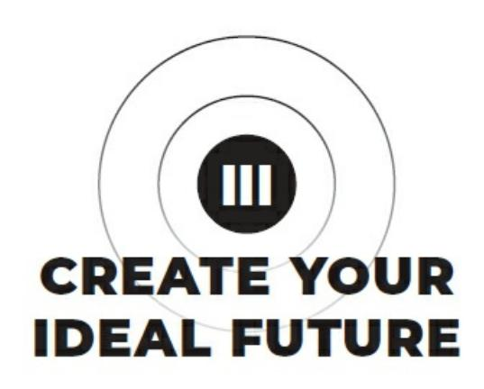

{98}------------------------------------------------

{99}------------------------------------------------

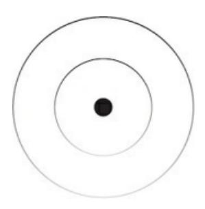

### THE SHIFT

The beautiful thing about the internet is that you don't need money, tools, a degree, or a physical location to provide value anymore. You can learn, teach, build, and sell with the technology everyone has in their hands. Some countries don't have the same technology, but they will soon enough as Earth's technological baseline continues to rise.

We are living through what seems to be a second Golden Age. The formal education system is being challenged by independent educators, journalists, experts, and artists that sought to remove the cap from their salary and physical reach. The banking system is being challenged by decentralized currency programmers. The government is being challenged by remote work and the desire for multi-nation citizenship to pay less taxes.

The technological advancements that provide us with these new freedoms come at a cost. There is an overwhelming number of options for a better life, so much so that any given person is unaware of 95% of them, and the other 5% still cause anxiety toward the future. Older generations are set in their ways and don't understand the options that the younger generations have. Parents would rather their kids go to school and lock in a secure \$50,000 salary when the kids could just as easily make \$100,000 or more in less time online. The school system has been the symbol of security for a little over a century, but its time may soon come to an end. Thanks, entropy.

Humans are lazy (I mean "efficient," apologies). We have created solutions to make our lives easier for the entirety of our evolutionary timeline. At the time of this writing, the problem on most people's minds is the phasing out of labor jobs and low-skill work due to artificial intelligence and automation.

Fast food and grocery store workers are being threatened by automated kiosks and robots that don't cost the company an hourly wage – no matter how small. Semi-truck drivers are being threatened by self-driving trucks that can be controlled from a remote location anywhere in the world. Even writers, artists, and programmers are being threatened by artificial intelligence tools that can spit out words, masterpieces, and code at the click of a button.

In times like these, it makes sense why everyone is losing their minds. Their survival is at stake in more ways than physical, they don't have the time to learn about their potential options, and they are comfortable to the point where even a few minutes out of their mundane routine is perceived as

"hard."

{100}------------------------------------------------

In a world ruled by money, it may not make you happy, but there is a baseline you must reach to sustain a fulfilling lifestyle. Money is the lifeblood of society, and if you want to participate in any aspect of it, money is now one of the most important basic needs in the world. You can play the status game of "not needing to make a lot of money to be happy,"

but unless you reject the world to live off in the woods, you are fooling yourself. Low-skill labor jobs are being phased out at an exponential rate, and I can't help thinking that this is exactly what the world needs.

One man's labor cannot scale, but the creative ability of his mind can. You have the opportunity to solve your own problems, help others solve their own, and impact the world at scale while generating a creative income with the power of the internet. Education, entertainment, and inspiration now form the pillars of an emerging digital society. Purpose, profits, and peace are no longer mutually exclusive.

### **EMERGING EDUCATION**

When I was a child, I felt alone. I was a rebel. I questioned almost everything that I was told to do, whether it was having to go to church, after-school sports, or college. I am grateful for my programming, because it allowed me to get a leg up on my peers who listened and obeyed without question.

Formal education has its place, but people are losing trust in its ability to secure their future. And I would argue that they never had trust in its ability to secure a fulfilling future. People inherently know that enjoyment in their life is their choice, but nobody wants to face that reality, so they outsource their future to schools and jobs.

It's all too common for someone to spend 4–12 years and tens of thousands of dollars just to be placed in low-paying jobs that require a fraction of what they were taught in school. That is the ideal case. Most of the time, students need to self-educate on the side to secure an income outside of what they went to school for. The degree, at that point, serves as proof that you can do something that you hate for years, so they happily hire you.

The education system has its benefits, as all things do, but for those that want fulfilling work and an open schedule, a glorified piece of paper called a "degree" isn't going to get you there. In my eyes, the college experience is worthwhile. Depending on the individual's personality, they can form a powerful network, land a great job, and build a future worth helping others achieve. That's the problem in itself: the college experience is dependent on their personality. Their sense of self. The concept that the individual attaches to that is forged by years of social conditioning. Colleges create educational material that holds a high authority on the internet. Students form their worldview from this information because it allowed them to do well in college. Students grow up and create families with the same worldview. Families create selves that go to college without question and continue to fuel the outdated machine. The main reason people go to college is because they haven't questioned who they are, what they want, and developed themselves to the point of self-reliance.

We are all here to maximize our human experience. That's it. That's all we are looking for. Some attempt to find happiness in the short term, some in the long term, but we are all on the same

{101}------------------------------------------------

path. We don't want to suffer, and education should reflect that. When we bust through our selfish karma, we then open up room for selflessness, and we can impact the world from a more enlightened perspective. This higher perspective cannot be reached by conforming to the formal education system.

In my opinion, kids don't need to be taught an idealized version of health and gender studies. Nor do they need to memorize concepts in algebra and physics that don't transfer over to living a life of enjoyment and impact through a nuanced lens. People can find enjoyment in the interests that college can introduce them to, but one does not need to follow the same path as everyone else to find those interests.

The first lesson of any teaching should be to encourage the questioning of any teaching. The second should be to lean into the curiosity that will allow you to fail the fastest. From there, we can include topics on persuasion, mental models, research skills, critical thinking, and entrepreneurship as vessels for applying any skill the individual may learn.

This will never happen, since the education system is interwoven into the social fabric of corporate jobs and government agencies. The government influences the general curriculum, and the curriculum influences the job opportunities that students have available to them. From the outside looking in, this is a cyclical yet groundless system that reduces novel emergence, innovation, and personal development.

At worst, the school system conditions convergent thinking, conformity over authenticity, memorization over process, failure as something to avoid, authorities as unquestionable, long work over efficiency, and intelligence dictated by book smarts. At best, this pricey status symbol will give you the experience you need to make better decisions as you enter your prime years.

You will make mistakes, party a bit too much, and meet lifelong friends that you wouldn't find in your hometown.

After 5 years and twenty-thousand dollars down the drain with 2 more years to complete my degree, I was fed up. There was a lot on the line, and the thought of getting a job was the bane of my existence. I knew I could acquire the skills to avoid that reality. In my final year, I took a class on basic computer programming. This was the first class I was interested in. So much so that I spent 3–4 hours a day studying outside of class with online courses and tutorials. This is when the reality of formal education slapped me in the face. Within 2 weeks, I had learned the entirety of the college course curriculum through self-study on the internet. I stopped going to class but still aced the tests.

Computer programming was an in-demand skill, and my intense bouts of obsessive study opened a world of possibilities. I could freelance and avoid getting a job. I could build my own app and attempt to get paying users. Or if all things went wrong, I could get a high-paying job. The tech industry didn't care about a degree at the time, and more gigs were moving in this direction.

That was in 2018, and the world has continued to shift toward individuality, decentralization, and accessible information. You can learn any skill, cultivate your value, and distribute that value to the people that care about what you have to say.

{102}------------------------------------------------

### SPECIFIC KNOWLEDGE

For the first eighteen years of our lives, depending on where you live, society is designed to strip our child-like curiosity from us. This is a blessing and a curse. A blessing for those that realize it, a curse for those that don't. Again, I want to make clear that this is not some kind of conspiracy theory. It is human nature manifested over centuries that has created an efficient system for reducing collective entropy. It has its perks, of course, but has ruined more lives than it has exposed to their potential.

Curiosity is the path to doing the things you want to do. Curiosity is what makes you, you, and that is a necessity heading into the future of automated

work. If you learn the same thing as everyone else to be trained into the select few jobs that are left, you can be replaced by almost anyone. The solution is specific knowledge.

Specific knowledge is difficult to find where general knowledge is taught. It takes a vision, hierarchy of goals, and dedicated time for curiosity-based self-education in alignment with those goals. If you are learning the same thing as everyone else, you will fight for the same replaceable opportunities as everyone else. The difference between formal education and self-education is being able to choose the material you learn according to your self-generated goals.

The online education industry has hit exponential growth since the year 2020, and I don't see it slowing down any time soon. Jobs are being threatened left and right, and it only makes sense that people search for a new path. Formal institutions have joined this battle, of course, by using their capitalistic leverage to flood the online learning space. But they only have a fraction of the manpower that individual creators have to teach based on real-world experience.

The incredible aspect of this education revolution is that the information is accessible to anyone in the world. You no longer need to move across the country to attend a prestigious school for the sake of developing a professional network.

In a watered-down description of an overly optimal situation, you can purchase a course, acquire a skill, and send a direct message to a high-status individual online to work for them. Or you can use that skill to build your own business with close-to-zero startup costs. Of course, this takes time.

But the focused individual can acquire an irreplaceable skill stack in a fraction of the time as those that came before them.

I like to think of specific knowledge as zip files for the mind. Independent educators teach through a specific perspective that can be shared by the students. That alone creates a more diverse and effective learning experience. With the student's goals, level of mind, and current skills taken

into account, specific information can be injected into their brain in a way that blooms their understanding of the topic.

I'm convinced that the future of schooling will be done online, with creators as teachers, and

{103}------------------------------------------------

each student can join the "school" that aligns the most with their interests, values, and preferred method of learning. One school system wouldn't dominate twelve-plus years of their life. Students would evolve beyond one after a few months or years, go on to the next, and eventually be able to start their own – if the other schools have the underlying principle of critical thinking and personal experience.

If creator- and community-based schools followed patterns of the Universe, their teachings would evolve as they do. This would desaturate the education market below it, allowing new educators to come in and teach beginners from a fresh lens.

The teacher learns more than the student, and if students eventually become the teachers, we create a holistic and self-correcting education system through the unlimited nature of the internet. Students would pursue their goals, seek relevant specific knowledge, and forge a unique path in reality that can be passed down to future generations through their own public school. This is already happening in the new economy. Who knows what heights we could reach if the awareness were spread, and individuals were encouraged to create in alignment with their interests? People would stop creating to make money but would start making money to create.

These "zip files of specific knowledge" are not to be taken lightly. Humans raise their level of consciousness through understanding. Over the eons of our existence, we have been creating new knowledge that allows individuals to understand complex topics faster.

If language paves the road that thought can operate on, and newly created knowledge through experience is being distributed without regulation, the future of work is being forged right before our eyes. This may have been the intention with interpretations of religious texts, but people read from a literal lens. If there were a simple preface that encouraged people to read

from a metaphorical lens, much of today's arguments, anger, and closed-mindedness would be resolved.

All it takes is one big idea that registers well with an individual to cause an avalanche in the mind called insight. Insight leads to an exponential leap in consciousness. This begs the need for individuals educating themselves from a perspective that reaps maximum understanding.

This also begs the need for individuals educating other individuals to help reveal their blind spots. Another major downside of formal institutions is the static curriculum. It changes with the times, yes, but not as fast as a passionate individual can learn something new and post a message for hundreds of thousands of eyes to see.

Universities that churn tens of thousands of students through the same curriculum, with government influence sewn into the social fabric, in big classrooms, with underpaid professors that don't have much say over what they teach is not conducive to a future of conscious leaders.

If business professors understood the changing business landscape, they would have a business. Some teach out of passion, which is incredible, but why not reach more people and not have your teachings regulated by an outdated system? If any professor was a true master of their craft, they would be teaching curious individuals online, because that's where modern business takes place. Their income would reflect the results they are able to get for their students.

{104}------------------------------------------------

Creating a course, or other form of educational material like internet content or writing a book, is the opposite. The smart creators understand that a course is the next logical step for their business after they get results.

It is a way of increasing their income without more time invested while providing massive value to the world.

Yes, there are scammers and cheats, but that usually isn't a problem for those that have basic critical-thinking skills. And if you do fall prey to one of these bad actors, you now have the experience to make better decisions when choosing who to learn from. Like how many come to the realization

that they were to a degree "scammed" by the formal education system. I'm not worried about this. It may have been common 5–10 years ago, but as with any developing industry, it either corrects itself or dies off, and I don't see it dying off any time soon.

The difference between a professor and creator is results. The creators solve their own problems, document the solutions, and package it up with a dash of personal experience to provide a life-changing learning experience without breaking the bank for the recipient.

In other words, they aren't teaching outdated material. They are on the cutting edge of global opportunity. Yes, the new educators are making a lot of money, but that money reflects the value they provide at scale.

### **CAREER CREATION**

Knowledge not found in schools is the source of money not found in employment; and the internet has democratized wealth generation for those that take responsibility for their education, skill acquisition, and self-promotion.

At this point in time, the year 2023, there is a statistic that 85% of jobs that will exist in 2030 have not been invented yet. The keyword here is

"invented." Another statistic is that 60% of labor jobs will be automated within the next decade. Technological advancements are allowing for the rapid evolution of the workspace. Jobs that were the beacon of career security are disappearing overnight, and jobs that nobody could fathom emerge with the highest earning potential. The problem is that the skills required to perform these jobs can only be learned from the passionate individuals that explored that new crevice of reality and distributed the information on the internet.

The future demands that we earn with our mind, not our time. The only way to earn with your mind is to break out of the narrow-focused state of survival. You must expand, organize, and focus your mind in an iterative

nature as you solve local, social, global, and potentially cosmic problems and beyond, in that order.

I am fascinated by the emergence of the creator economy. A "creator" is someone who becomes

{105}------------------------------------------------

a fountainhead of value through personal development, shares that value in public, and makes a creative income doing so. Mostly on social media, but the philosophy of a creator is not limited to the online space.

Similar to how our ancestors each had their unique strengths and served their communities, creators lean into their curiosity and share their knowledge. Since we live in a comfortable world and have nearly eliminated our need to perform manual labor, what's left is knowledge and consciousness work. Through knowledge we shape the language, and therefore expansion of conscious thought, for the next generations. When we increase our level of mind through personal problem-solving, we create a ripple effect for decades to come.

It makes sense that information is the most valuable resource in our times.

And it makes even more sense why lack of focus is the biggest problem of our time. The Industrial Age solved big problems in labor. The Information Age solved big problems in knowledge. And the Imagination Age will solve big problems in consciousness. You have the chance to be a part of this phase in human evolution.

People forget that they have the world's most powerful supercomputer between their ears. You must prioritize your mind. Mental mastery is how you fight back in a world that wants to steal your attention, manipulate your thoughts, and make you feel helpless. When you align your search for knowledge with your vision, goals, and present purpose, the potential for distraction decreases dramatically. You will spot future opportunities and self-correct your learning endeavors.

The result of personal development is a career that you create, not one that society gives you. The creator economy is a newly emerged digital society.

The goods exchanged in this economy have depth, passion, and a personal

philosophy behind them. I know someone that sells barefoot shoes to fix postural health. I know someone that sells handmade wooden kitchenware to avoid the dangers of plastic. I know someone that sells stylish blue light glasses to help with eye strain and sleep. I know someone that sells fresh herbs, milk, and meat without the cruelty of factory farming. This seemingly self-sufficient online community I've found myself in provides everything I could need for a good life. And when I provide a product, my community will support me as well.

Creative people get paid for doing what they enjoy doing. Armchair creatives often get stuck playing status games of who can create the best

"art" that the market rejects. True creatives know that given enough time, they can turn passion into profit while maintaining their authenticity.

We are smack in the middle of both the Digital Dark Ages and the Digital Renaissance. With an open mind, access to the internet, and a high-value skill stack, you can escape the former and join the latter.

### UNDERSTANDING THE INTERNET

{106}------------------------------------------------

I have realized a common theme in my life (and the lives of many others).

Obsession. As a kid, I was obsessed with finding a better way of living. I don't know what sparked this. All I know is that I was a silent observer.

Everywhere I went, I paid close attention to people's actions. Not in a judgmental way, but in a discerning way.

How did that person get to that point in life? Why did they look that way?

Was it because they were going through their closest fast-food drive through for breakfast each morning? Extra this, extra that, or was it because they could only view the world from their conditioned lens? Many things didn't sit well with me.

One of them was the conventional career path. Go to school. Think you know what you want to do at eighteen years old. Possibly get a good job the first time around. Possibly enjoy life while having zero control over 70% of

your day. Finally have the freedom to do whatever you want with your time at sixty-five years old. Sign me up!

Nope. Didn't like that. A "secure" future didn't sound so secure when I pierced through the veil. So, I spent my time in the gym, learning from people I aspired to be like on social media, learning whatever skill could help me with new opportunities, and failing at 7+ business models. To many, this sounds like a hellish existence. To me, it was the only thing I could find true satisfaction in. Two sides of the same coin with a difference in perception.

I found solace in the creator economy early. Individuals that took advantage of the social media boom had my dedicated attention. They gave me a foundational understanding of the things that mattered. With a consistent self-education habit with matching execution, I took control of my mental, physical, and financial health. Through direct experience, I was able to solve my own problems, systemize the solution, and use my mental energy on creative endeavors that spread passion to others.

The future of work will not be work. It will be play. The human psyche is wired for survival. Entrepreneurship is modern-day survival. But most people have a twisted view of entrepreneurship. It's not about starting the next billion-dollar company. It's about leveraging your stack of skills, unique story, and finite focus to create a life of meaning. Everyone is an entrepreneur. Some just get paid for the value they cultivate outside of the conditioned path.

We don't have as much control over human evolution as we think, but we do have control over the novelty we seek, gather, create, and trade. The path is already laid out and it is unfolding rapidly before our eyes. Those that hop on the train will thrive and others will experience neurobiological decay.

Meaningless dopamine sources have people in chains, while meaningful dopamine is reserved to those that hunt and evolve. That is, pursuing your curiosity in alignment with self-generated goals, making novel discoveries

{107}------------------------------------------------

in the unknown, and being able to maintain an impactful lifestyle in a world that is shifting from corporation to individual.

The goal is to tap into your creative genius, create solutions to true problems, condense valuable information, and raise the well-being of the collective through your efforts.

The internet is the hunting ground, so let's begin to dissect it for big-picture understanding. There are billions of people that have access to the internet, while only a fraction don't or choose not to. If you want to reach almost anybody, there are 2 things you need to understand.

The back end of the internet is code. Unless you plan on becoming a programmer, we don't need to get technical here. Code is the series of commands, functions, and systems that delivers interactive information to your screen.

The front end of the internet is media. Every single person should have a foundational understanding of media because it is a microcosm of life itself.

Media is composed of writing, speaking, and visuals that distribute a valuable message. In essence, media is an extension of the personal and collective mind. We put out our ideas, beliefs, and opinions that form a digital society, cultures, and world.

The "valuable message" you distribute is subjective. What we perceive as valuable fluctuates on a daily, monthly, and yearly basis. At night, you may find value in watching a good movie. During the day, you may find value in learning a new skill.

The principles of a valuable message are less subjective. The goal with media is to leverage human psychology to capture attention, hold attention, and deliver value on that attention through problems, stories or games, and solutions. Media is but another song frozen in time, floating around in intangible code. Impactful media mimics the ebb and flow of the Universe itself.

The internet is a public resumé, school, job board, note-taking system, and podium if you perceive it as such. There are brands, creators, students, consumers, and those that are transitioning from one phase to another, from distracted to focused or vice versa.

Brands and creators host media that educates, entertains, and inspires their audience. If they don't have a product, their self-promotion doesn't go to waste. Employers are online, and they are very active in hiring those that distribute the most value. In other words, even if you aren't sold on becoming a "creator," you won't escape digital survival. You either create and distribute value or drastically limit the opportunities available to you.

Those that have realized the mindful power of the internet would be considered students. They learn from brands and creators until their time inevitably comes to join them. Then, there are consumers. For the sake of distinction, "consumers" will be defined as those without a vision that are consuming surface-level information that is not conducive to their nonexistent ideal future. Everyone is a consumer, yes, but as the dualistic nature of life goes, one must also become a creator so that extreme consumerism doesn't overtake their potential.

{108}------------------------------------------------

We will discuss this in depth in the coming sections, but understand this: observation, awareness, and correcting your focus through self-reflection is the greatest teacher for understanding human nature. By understanding how you interact with the world both physical and digital, you understand others, and can apply that knowledge to increase the impact of anything you create.

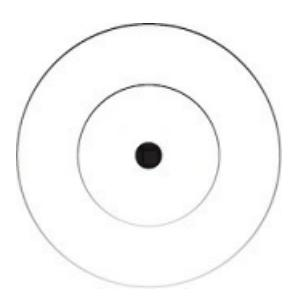

### THE NEW RICH

Happiness is a skill. It is not given but created. As with all skills, it must be practiced, refined, and adopted as a part of your life. When isolated, happiness loses its meaning, as it cannot exist without an unhappy reference point of prior experience.

This is the problem with new-age positivity. You can think positive thoughts all day long. But people fail to realize that every positive thought holds a negative seed. This is why almost every great success comes after great failure. If you want to be happier, you need to expose yourself to more negative experiences that allow you to create the positive ones. You can think your way to a positive future, but the image of that future is forged through an equal and often more painful past. Without a negative experience as an anchor, you have nothing meaningful to move toward.

There are 2 states of mind to become aware of: stillness and movement.

Being and doing. Peace and progress. When your focus is occupied by the background of your ideal future and the foreground of your priority actions, these 2 states of mind collapse into the present moment. Everyone wants money, muscles, and a desirable partner. The act of achieving those goals feels incredible at the start. If you don't have a philosophical sense of mastery behind your material pursuits, you are in for a rude awakening.

Even if your actions don't change, the "why" behind them can. A bodybuilder that got started after a tough breakup can find meaning in the microcosm of life that weight training is if they allow their mind to see beyond their identification with their seemingly material pursuits. Most people would be considered superficial for owning a nice car, but a mechanic that loves dissecting every bolt, part, and speck of paint? Cars are where they find maximum enjoyment. You can enjoy flashy things. Most people just acquire them for the mindless pursuit of status.

Many that do acquire their material desires change on the outside, but not the inside. Society is filled with people who turn a physical sixty years old with the mind of a twelve-year-old going through an emotional puberty.

The main Buddhist teaching is that of impermanence. That is, nothing can be isolated and held static by the mind. This includes ideas, feelings, emotions, people, locations, and everything else

{109}------------------------------------------------

that we label and expect to stay the same forever.

The identification with ideology, dogma, and other static mental constructs are the source of our suffering. When they are threatened, so is our happiness. However, realize that this still holds true for your purpose. The goals you pursue are the axis of your suffering. Choose them wisely, as fulfillment would not hold meaning without painful experiences as a reference point.

Thinking is not bad and often necessary when critical. But when gone unchecked, compulsive thoughts can create a personal reality of inescapable turmoil. When one is still, their mind wants to move. When one is moving, their mind wants to be still.

Without deliberate practice, the mind will latch onto the past or future in an attempt to make the impermanent permanent. This is the cause of unhappiness but is not to be demonized, as that is against the point. When you feel unhappy, observe that feeling. Lean into it. Let it point "a finger at the moon" and present the lesson that life is trying to teach you. From that low, lean into the coming high.

The new rich are those that can refine their lifestyle to sustain a schedule filled with stillness, movement, and a lack of mindless chatter in the skull.

The activities that create this blissful state of mind are personal. You must observe, hypothesize, experiment, fail, learn, and repeat this never-ending process even once you have reached conscious success. Because even that isn't permanent.

### YOUR LIFE'S WORK

Work.

Does that spark any stressful thoughts about tomorrow? If so, that's a problem. Work consumes a vast amount of the finite mental energy you have in this lifetime. If the majority of your days are filled with something you hate, how do you think your life will turn out?

In a world where most people see overwork as a badge of honor and rest as an inconvenience, it's no wonder so many people are unfulfilled and bitter.

Nobody said they wanted to work forty-plus hours a week, numb their mind with mindless entertainment, and put off their dreams just to wake up one day wondering where the time went. Yet that's what everyone does.

Why? Because they didn't ask "why" earlier. They let it happen because that's always how it was supposed to happen, at least to their knowledge.

Work is a necessary part of life and would lose meaning without dedicated rest. But people don't see the relationship between the 2 and oscillate between the unconscious extremes of both. It's either stressful work they hate, or a delusional idea of an endless summer sipping margaritas on the beach.

I have lived the life of early retirement in a tropical setting, and I can tell you with confidence

{110}------------------------------------------------

that it normalizes. Eventually, your mind will seek movement through challenge, and that desire will become so strong that

even the most pleasurable vacation will lead to anxiety and boredom thanks to psychic entropy.

Everyone has the desire to be free. This is a sign in the direction that you should move. All that freedom is, when pertaining to the mind, is the dissolution of barriers that comes from adopting a higher perspective. When you adopt a higher perspective, you can start to see things for what they are.

You don't want absolute freedom, you want autonomy. The difference is that freedom implies a lack of structure, where autonomy is your ability to choose within a structure. Hopefully one that is composed of a strong vision, evolving purpose, and meaningful problems worth solving.

When the average individual thinks about work, their mind floods with the string of tasks waiting for them when they clock in. When they think of rest, they see it as an inconvenience that prevents them from reaching the same status as their peers. No matter where they turn, the modern individual meets 4 cushy walls that look like a fun house but is actually an insane asylum.

Now, don't let my doomsday perspective make you lose hope. At the same time, don't let the importance of taking control of your life go unnoticed.

Getting a job is only bad when made permanent. Everything evolves. Low-to high-paying jobs should be viewed as a series of stepping stones to aid in the discovery of your life's work. It is unwise to think that you already have the skill to make millions of dollars doing what you love when you haven't even become aware of what you love.

For now, depending on your age and responsibility, choosing a job that presents a matching level of challenge will make you happier than going all in on the uncertain path. When that job stops presenting ample challenge, don't get complacent. Acquire new skills and pursue the purpose that reveals itself through struggle.

The notion of having a "life's work" may seem like an impossibility. If you're drowning in tasks, responsibilities, and escapism through

momentary pleasure, I don't blame you. And you're not alone. Keep your mind open a bit longer for me.

Everyone has the ability to do work that brings meaning to their lives.

Some find it early, others within a few decades, and the rest don't find it at all. The key is to find the one thing that makes all the sacrifices worth it after extended periods of experimentation.

That's the kicker: it will demand sacrifice. Pursuing your life's work won't be all dandelions and roses. After sufficient learning, failure, and persistence, you will feel compelled to decline any and every external request to build out a meaningful project. This is when you lock yourself in your room, harness your obsession, and build something meaningful with the mental skill you've

{111}------------------------------------------------

developed. Then, you will need to create a balance that doesn't turn you into a workaholic that misses out on the finer things in life.

Your life's work is an inherent part of your vision for the future. It is how you spread the impact of the value you develop over time to others and, with the power of the internet, it has never been so feasible. Feasible, but not to be mistaken for easy.

Your life's work is how you spread love, passion, and consciousness in a way that ripples beyond locality. For one individual, this may be their obsession with beer, no matter how many people label it as a destructive substance. They explored that crevice of reality, turned matter into meaning, and served it with a smile on their face to the customers of their brewery.

For another, it could be video game development, philosophy, or basket weaving. Nothing is off limits, but there are many limits in the way. Your job is to explore the unknown, dig beyond the surface, and let curiosity pull you up, down, left, and right until you find the center.

When you find the center, plant your seed, and let the roots spread to strengthen that passion. You will need more skills than one to make that passion a sustainable aspect of your life.

I regret to inform you that I don't have a rapid solution for this problem you are meant to solve. This process isn't immediate, and that's what makes it worth it. You will feel lost, you will lose hope, but when you stumble across the experience that shows you it's possible, there's no going back.

As with many things in this book, this is a seed of awareness. If you were not made aware of potential problems in your life and the possibility of solving them, would you even think to work toward that reality? When was the last time you even thought of your life's work?

Through the pursuit of curiosity and self-experimentation, you will unveil what you were put on this Earth to do. Take small risks until you feel the pull to go all in. You may realize that the pull was a lesser purpose that needed to be fulfilled. This is fine. Let that chapter end.

### LIFESTYLE DESIGN

I've always had some form of aversion toward Western work culture.

Eighty-hour work weeks are encouraged. High-pressure environments.

Little time for rest and recovery. Everyone complains about going to work, when they can go home, and what they are going home to. An endless cycle.

It never felt "right" to me, and from past experiences, I know that is a feeling that one should always question. Why would I want to waste my entire day knowing that within 2–3 hours my focus would fade and work quality would suffer?

Four-hour workdays, singular focus, and meaningful work are becoming the norm in small pockets of the internet, and for good reason. Ancient Romans and Greeks, Steve Jobs, Charles Darwin, and an ever-growing list of visionaries, strategists, and innovators attribute their success

{112}------------------------------------------------

to surprisingly low work times accompanied by an abundance of restful activities like long walks.

When we see someone with a respectable body of creative work, we would expect them to work long hours, obsessing into the night about the details of their next piece. Instead, we see the opposite. Like Darwin arriving in his study by 8 after his morning walk and breakfast. He would work for an hour and a half, take a break to read the mail and write letters, then return to more serious work, where he conducted his experiments. By noon Darwin would stop his workday and head out on a long walk. After reading and answering a few more letters, he would take a nap, take another walk, and return to his study for another work block. Four to five hours of work paired with active rest seems to be the sweet spot for most impactful creatives.

Writers from multiple domains like Hemingway, Tarantino, and Ogilvy would spend the majority of their days lounging by the pool, talking to beautiful women, and doing everything aside from what they deemed work.

They gave room for the creative emergence of ideas that fueled the impact of their work. If they can change culture and business with their methods, why can't corporate workaholics do the same?

Rest is important in the age of automation because it demands creativity from those that don't want to live a mechanical and predetermined life. Rest is the driving force behind your mind's creative ability. Humans aren't robots, yet most of our lives are spent in an unconscious repetition of tasks that are graded by time spent rather than results.

As technology advances, so does efficiency, and those that choose to be workaholics should do so by their own conscious choice. Some people are happier when they work more on the things they enjoy. But for most people, a balance of meaningful work and ample rest can help prevent life from losing its spark. Much of the time, the 2 complement each other to the point of enhancing the effects of both.

The pride of overwork is for those climbing a status ladder. A balanced, fulfilling lifestyle is for those that do what they want. When forging your own path, productivity is difficult to measure. Instead, we can measure the amount of engagement with our work and the mental energy required to

produce valuable creations. You measure this through self-reflection and how difficult a challenge was according to your level of skill.

Balance does not mean stuck in the middle. Balance is the dance between extremes. Extreme focus and extreme rest. Full engagement with being or doing. Locked into reality itself.

The paradox of productivity is the less you work, the higher quality your work is. Imagine training in the gym for 8 hours trying to be as

"productive" as possible. In one day, you would run out of exercises, tax your nervous system into poverty, and may even opt to go on a 5-mile run because your boss expects you to perform and you want to survive the job title you've been given.

{113}------------------------------------------------

Now, would you be able to come back and give it your all the next day?

How about 5 days in a row? Would you be able to tough it out until you can use your paid vacation time to recover and do it all over again?

Your body would be decimated. As would your focus. Instead, we train for forty-five to ninety minutes at a time. We push ourselves at the expense of physical – or mental – energy. We create a routine and schedule it into our days so we can prioritize rest, recovery, and general quality of life.

This is a phenomenon that must be directly experienced. I have personally gone through many cycles of losing trust in long workdays. When an important task was scheduled outside of work and I forced myself to take rest, the quality of my work the next morning saw a notable increase in quality. When I made it into a habit, my quality of life met the same increase.

While corporate culture is handing you a pretty paycheck to incentivize sustained intensity by exploiting your survival, you must push back.

Intensity is powerful, but not sustainable. It's not rocket science.

Sustainability, consistency, and creativity must be prioritized before we even mention the word "productivity."

In this modern world, it is possible to create a daily routine filled with the activities that bring you the most enjoyment. The keyword here is "create."

It will take a few iterations of experimentation, identifying problems, testing new solutions, and systemizing them to best utilize your mental energy.

To understand this lifestyle design process, let's start small and practical.

This is a process I run through when life gets a bit too messy. Like when you're constantly thinking back to a time when "life was better." Or when your routines succumb to entropy, fall apart, and all these little tasks pop up that suck up the little time you have in a day.

Pull out a journal and take note of how you feel. Write down exactly what you are doing on a daily basis. Every little detail. Take 10 minutes and get specific on what you do, why you do it, and how you feel in the morning, afternoon, and night. This is important for identifying unconscious parasites (time and energy suckers).

From your brain dump, prioritize, remove, and restructure. The reason you aren't making progress is because you feel pressed for time, don't have the energy to get results, or you stopped doing the things that got results.

Prioritize the things that will get results. Remove the things that snuck their way into your day. Restructure specific tasks and obligations to free up more time. Get the chaotic structure of your mind on paper and reorganize it.

{114}------------------------------------------------

Next, create a weeklong system. You are in this chaotic state because of psychic entropy, disorder of the mind. The organization of your life tends toward disorder if you don't perform mental housekeeping. You will pick up unconscious habits that may wreak havoc without you noticing.

Habits are difficult to break, but you can make the process easier with conscious clarity practice. Write out every single thing you are going to do for the next week. Keep this simple and don't overthink. Just jot it down.

This is how you reduce the friction of making better decisions.

Plan out your morning routine, focused work routine, other tasks and meetings, and your nightly routine. You will have to experiment as you go.

If the routine doesn't flow, go back to your notebook and refine the system.

With this mental housekeeping process, you gain as much control as you can over your day. You will unveil aspects that prevent you from filling your routine with enjoyable activities. Treat these as problems in your system that will be solved through focused education, experimentation, and effort.

### FILL EMPTY USE

To ensure maximum mental output, creativity, and life enjoyment, there are 3 things to consider: how you fill your mind, how you empty your mind, and how you use your mind.

It is up to you to create a daily system with time and practice. If your energy is highest in the morning, schedule your work around that. The same goes for night owls. Gain awareness of when your natural energy is highest and use that time for narrow-focused output. Remember that we are attempting to create our ideal lifestyle. This isn't a one-and-done type deal.

This is a lifelong series of experiments that may never reach perfection but will always reach a higher level of enjoyment.

We set the scene in the afternoon, not the morning, why? First, personal preference. Second, because this approach is holistic. Deep work hacks that only mention the time, usually morning, to be productive will always fail.

Productivity and creativity are not one-time things, they are states of mind on the spectrum of focus.

It is not a matter of deep work. It is a matter of the balance and degree that you engage in deep play, deep rest, and deep work. Living fully is a lost art in a world that overvalues the surface.

For value creators, those that intend to put good out into the world, you must adopt the habit of conscious study and education. Without expanding

your worldview, mind, and knowledge through exposing yourself to novel perspectives in the

{115}------------------------------------------------

unknown, how do you plan to create?

Creativity, in most practical aspects, is about pulling from multiple sources and mashing them together. To be creative from one source, you must deconstruct a topic, learn about its parts through study, and piece together your own creation from those parts like mental Legos.

Idea generation is a pillar for the creative worker. You cannot create if the idea does not come first. Novel ideas emerge from conflict of the multiple ideas you hold in your mind from study. As you begin to fill your mind, it would be wise to have a place, physical or digital, to note down ideas. You will struggle to comprehend, make sense of, and piece together ideas from different sources. This is a good sign. When the time is right, the perfect idea will spring into your field of awareness.

When aligned with your vision, you can consume information with the intention to understand and apply. This can begin to act as a vessel for raising your consciousness. Don't study to learn the material. Instead, study through the lens of the vision, goal, or problem that is most prevalent in your life. This is how you read a book 3 times in different phases of your life and gain entirely new insights each time around.

You start to gain clarity on your life's work through exposure to the novel information that sparks excitement in you. This excitement signals that you've found a new potential for your life in the unknown. If you don't know where to start, reread the book that changed the way you move in the world; it will do it again. From there, pick a topic or idea that you did not entirely understand from the book. Research recommendations for information on that topic. Then, repeat the process until you have 5–10

sources that begin to form your life philosophy.

You *fill* your mind through self-education in alignment with the purpose you are trying to fulfill or the burning problem you are trying to solve. You cannot create if you don't consume. My recommended way to retain the information you are consuming is to initiate intellectual conversation with

anyone and everyone. Talk about your discoveries, let your passion show, and identify your knowledge gaps so you know what to study next.

In psychology, there is a concept called the Default Mode Network (DMN).

From Alex Soojung-Kim Pang, the author of *Rest*, the DMN is "a series of interconnected sections that activate as soon as people stop concentrating on external tasks and shift from outward-focused to inward-focused cognition." This is how you *empty* your mind.

When the DMN is "activated" through restful, meditative, or open-focused activities, the brain isn't any less active than it would be when engaged in something like focused work, or something that demands narrow focus and concentrated attention. This is incredible. Your brain is as active, if not more, when you are at rest than when you are at work.

This can be associated with presence, surrender, and divine inspiration that many masters harp

{116}------------------------------------------------

on in their teachings. When your focus is open, your subconscious mind is still working hard and munching on solving the problems in the way of your goals.

Many computer programmers understand this well. They will often work on a project, encounter a bug, struggle to fix it, give up, and go about their day.

At the most unexpected time, the solution will pop into their head and the excited programmer will rush to open their code base and test it out.

"Shower thoughts" are the method by which the balanced worker shakes the world.

From personal experience, my greatest insights come after a period of struggle. My attention is engaged with the natural battle raging in my head to the point of seeing its pointlessness. At this realization, I drop everything but the pillars of my life. I start from scratch. I drop everything and see what sticks without conscious effort. Like magic, the idea I needed comes to me within a few days, and births a season of intensity to actualize that part of my vision.

When you are hyper-focused on a problem in your life, the best way to solve it is counterintuitive. Letting go and engaging with life itself gives

room for the subconscious to work its magic and deliver the "aha!" moment to the conscious mind. Rather than writing to get the best reaction out of your reader, just write. Rather than golfing to get your first hole-in-one, just golf. Rather than speedrunning your favorite hike, just hike. Competition has its place, but when you are stuck on a problem, the best thing you can do is let reality win.

Do not confuse restful activities for the modern notion of self-care. While they have their place, true rest does not include emotional binge eating, bubble baths with wine, and late-night movies to escape the thoughts of work the next morning.

Instead, restful activities are those shift your attention away from work. Go on a long walk. Bathe in nature. Train in the gym. Brain dump your ideas, plans, and compulsive thoughts onto a blank page to clear your mind before bed. Experiment with different activities at all times of the day until you find the ones that are most conducive to your vision.

Fill your mind in the afternoons with books, learning, and conversation.

Empty your mind with walks, training, and contemplation. Use your mind in the morning with creation, output, and focus.

Now that we understand the importance of filling our mind with creative firepower and emptying our mind to allow space for creative emergence, we must use that to fuel our focused work.

### THE 4-HOUR WORKDAY

Four hours of focused work is better than 8 hours of distracted work.

I don't have an exact date, but as I was building my first freelance business, the idea of a 4-hour

{117}------------------------------------------------

workday registered in my awareness. There were talks of 4-hour workweeks by people like Tim Ferris, but a 4-hour workday sounded realistic enough to make work for my level of mind at the time.

The challenge pushed me toward long-term action rather than anxiety. I

knew I had the resources, mental capacity, and desire to make that lifestyle real, even if it took a decade.

This seemingly crazy idea stuck in my mind for years to come and throughout my plethora of business failures. Subconsciously, I was making decisions to limit how much I worked to 4 hours each day. I was loosely identified as someone who would work less yet achieve more than others, so my actions naturally followed to survive that identity I was building.

This alone changed the direction of my life. Why? First, I perceived anything more than 4 hours of work as a problem. I had conditioned myself to view anything more than 4 hours of work as abnormal. Few people do this. Most people label this lifestyle as "impossible" and then it becomes so.

If I had never registered anything more than 4 hours of work as a problem, my mind would not register opportunities to create a solution for those problems. A meaningful goal acts as a filter for the information you are exposed to daily.

This forced my mind to work on a creative solution for these specific problems to eliminate, systemize, or automate low-leverage work. At a job, that means organizing your highest-priority work, identifying distractions, and being honest with yourself about how much work you actually have to do. Many people can reduce how much they work at their job, then spend that new free time on actualizing their life's work. In business, that means outsourcing, productizing, or building more leverage. So that's what I did.

For most people, this idealistic 4-hour workday cannot be accomplished immediately. It can, however, become a potent aspect of your vision so that you can begin to register opportunity in your awareness. The tips we discuss can help reduce the time you spend on work at your job, help you build out a side project in record time, or help you bring order to the uncertain nature of your entrepreneurial endeavors.

As humans, we have a natural desire for more. We are driven to survive at all costs. Evolution reflects this. With our unique minds, we build systems to aid in the survival of physical and mental forms. This may sound

repetitive, and it is, because it's important. Entropy never sleeps and we must constantly work to protect the order we create in our lives.

Systems layer on top of each other to make our mind more efficient. We get better at 'investing' our mental energy. If we don't maintain these systems, they fall apart. Now, what does entropy have to do with focused work and productivity? If you don't systemize your path to success, with time and focused effort, you won't achieve it. And if you don't maintain order in the productivity system you create, you allow room for procrastination. Your productivity system is one out of

{118}------------------------------------------------

many that will be messy at the start. Even if you copy it from your favorite productivity teacher. Your lifestyle and work have many nuances that can only be accounted for in your direct experience. Through experimentation, failure, and problem-solving, your routine will become more enjoyable and efficient the longer you stick to the path.

Productivity is about getting from point A to point B as fast as possible.

Productivity is not about seeing who can work the longest so you can brag to your friends, family, and coworkers. Like your home bookshelf, if you don't have a system for your work, you will get overwhelmed with the tasks that continue to scatter in front of you.

When you are overwhelmed, if you don't have a system, routine, or plan to focus your mind, the intensity of that overwhelm will increase. Now that when entropy has its grasp on your productivity, it may lead to a week-long downward spiral of emotions and laziness. Nobody wants that.

If you were to loosely identify with a positive version of success and the projects that will take you there, you will have the desire to refine a path to aid in the survival of those concepts. If you create a vision for your future that holds meaning, you will subconsciously work to survive that vision. If you create an identity that makes the automatic decision to build your future for 4 hours every day, you will work to survive that identity. Even if you can only spend thirty minutes on that vision at this point in your life.

Why? Because if you don't survive the things that make you, you, then you experience the concept of death. The thought of death fills us with fear because it is the embodiment of the absolute unknown. If we don't live at our edge, a chaotic state of mind is the default.

We can either transmute that fear toward beneficial outcomes or become slaves to it. So, let's take a meta-approach to productivity. I am not going to give you exact steps. A prescriptive "how" is not as powerful as you think, even when that's what your mind craves. Instead, I will give you a few helpful starting points so you can begin to create your own "how" with time, experimentation, and iteration.

First, why 4 hours? Conceptual systems need mental energy to thrive. From personal experience, scientific studies, and anecdotes from the world's most respected creatives, 3–5 hours is the sweet spot for mental energy expenditure. Focus is a muscle that fatigues with time. At the start, you will notice the difficulty of pure unbroken focus for even thirty minutes. As you train your focus through conscious repetition, you will be able to do more quality work in 4 hours than the average individual can in a week.

Second, 4 hours creates the frame of a game that you can play to win. If you play the character of someone that only works 4 hours, and you've internalized that trait, then you will feel the pressure to complete your work within that time. Even better, when you chunk that work session up into smaller time blocks, you create a powerful environment to narrow your focus into a productive state of good stress.

I would encourage you to train your focus on your current work. Start by setting a timer for fifteen minutes of pure focus on a high-priority task, no distractions. After a few days, increase

{119}------------------------------------------------

that time to thirty minutes, then forty-five, then an hour. Like building a muscle. You won't be able to focus for a metaphorical 495-pound bench press on your first try.

Most people don't have 4 hours to work on their own thing. So don't feel like you have to work this long if you have other responsibilities right now.

Don't let the expectations I set in this book prevent you from facing the

reality of your situation. Do what you can, start small, and work your way up the challenge ladder in all areas of life. Anybody can set aside thirty to sixty minutes every morning to build out their dreams. Sure, it may take a week to get used to waking up earlier, and you may need to sacrifice nightly bad habits that you don't want to break to get to bed on time, but the fact remains that anybody can do it.

If you can spend 8 hours building someone else's dreams, you can spend 1

hour building your own. Every individual that wants more out of life needs a dedicated vision building session. Your vision isn't going to build itself.

You must carve out time no matter how small at the start. During this dedicated vision-building session, the choice of tasks you perform are crucial.

First, identify where you are in relation to your goals. Do you have the clarity to execute on the tasks that will bring meaningful results? Or do you need to use that time for self-education and study? Remember that you are creating a playable game here. Nobody starts out as an expert. They graduate from novice to intermediate to advanced, with a balance of education and practice to match that progression.

Every morning, be sure that you are performing tasks that move levers.

Lever-moving tasks are the actions that generate results. If you aren't getting results, that is feedback to change what you are doing. Without positive feedback, there is a growing potential for rogue thoughts, emotions, and external stimuli to grab at your attention.

Distractions are the catalyst of entropy in your productivity system. The more distractions you give the chance to penetrate your awareness, the more likely you will be to go into a downward spiral of procrastination.

The most effective advice I can give is to condition your internal and external environment to be distraction-free. Set your alarm an hour earlier to wake up before the distractions. Stick to a routine that makes work sessions seamless and efficient with practice. Hold the idea of your holistic, ideal lifestyle in your mind as you go about your creative endeavors. None

of this is immediate, but with a vision-aligned intent to build, you will surprise yourself on even a 6-month timescale. Focused work is how you change your life in record time.

{120}------------------------------------------------

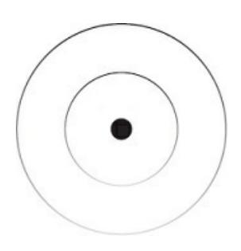

### THE SKILL STACK

The state of work is changing. Specialists are out, but so are generalists. We live in a time of specialized generalism. You must pursue your curiosity, become obsessed with one crevice of reality, stack skills to solve burning problems within that domain, and let the base of your skill tree spread its roots into other connected domains.

Learning one skill isn't enough, especially if that skill is compartmentalized, predictable, and lacks the need for creativity. If you can be trained into it, so can everyone else, and so can a robot. The difference between a human and a robot is consciousness. Consciousness is the clay of reality in which we create through order, routine, and minimizing states of chaos.

The Renaissance Era came after the famine, pandemics, and ignorance of the Dark Ages. It was a cultural, political, and economic rebirth that housed many of the thinkers, artists, and scientists we know today. One could say it was the creative emergence that went on to transcend and include the lessons from a period of struggle.

During these times, there was what we know as a "Renaissance man," a person who had a range of skills across multiple domains like art, science, literature, music, and politics. Their critical thinking and creativity only helped with the application of their knowledge.

In this Digital Renaissance of the 3rd millennium, we can notice similar patterns. Technological advancements have made it possible to learn new skills that were previously reserved for specialists, usually the ones that have the cash to afford specialized education.

As an example, anyone with a few hours to spare can watch a tutorial on web design, purchase website software for less than a nice dinner, and build a what-looks-to-be professionally designed site. Or you can just talk to an artificial intelligence engine and have it build one for you. That way, you can focus your education on creating, selling, and iterating on a product or service that actually gets you paid.

There are no limits, aside from pleasurable distractions, to what you can learn and apply as one person. Individuals can learn design, marketing, writing, and video to run a multimillion-dollar business selling a solution to the problem they've solved in their lives. I purchased a pair of blue light glasses yesterday from an individual that did just this. They struggled with eye strain and sleep, studied potential solutions, experimented with them, and created a stylish pair of glasses that solves the problem. Since this was a personal endeavor, and since they built a readership online, they have very little competition with the big brands selling the same product with little soul behind it.

{121}------------------------------------------------

For that to be a possibility for you, you not only need value to offer, which comes from your personal development and skill acquisition. But you need to pair that specialty with a general understanding of the modern skills that allow you to put your payment-worthy value in front of a fraction of the billions of people you can reach on the internet. Now that you have awareness of this, try to notice it when you are exploring the digital world.

View brands, content, and products from the lens of a researcher, not a consumer, and you will pick up lessons that can aid in the actualization of your goals.

In my teens and early twenties, I had a general obsession for learning and building. I have always had a potentially monetizable side project to work on to shine a light on the skills I needed to acquire through self-education.

In the course of 10 years, I obsessed over fitness, nutrition, search engine optimization, web design and development, graphic design, digital art, social media, content writing, marketing and sales, copywriting, neuroscience, philosophy, spirituality, self-development, and a few more, but I'll spare you my self-aggrandizing list of polymathic study.

What were the results after a decade? The one thing that people tell you is impossible: doing what I love for a living. And even if they don't verbally say it's impossible, they imply it through their attempts to impregnate your mind with their limiting worldview.

So, let's take a big-picture approach to modern skill acquisition. I will not give you exact steps, as this isn't a course or classroom. But I will give you the principles. From those, you must start, encounter a real-world problem, and self-educate in a manner that teaches you the subjective technical details of any domain through experience. You may not understand the teachings below for months or years depending on your current experience level. Lessons you pick up along the way will compound into one big

"aha!" moment. From there, you can make your dreams real.

I'm assuming you want to acquire skills so that you can create an independent income source. Even if you only want to learn skills for the sake of advancing your career, you are doing it because your psyche craves challenge. Eventually that challenge will cease to exist in a corporate hierarchy. It would make sense to cut to the chase and go straight into building your own thing. To do that, you will be exchanging value with other humans for value in the form of time, money, leverage, information, and expertise.

Every single skill you learn should be approached from the perspective of human nature and psychology. That's all modern skills are, a modality for capturing attention, holding attention, and delivering value on attention.

Business is about transferring consciousness into your customer and framing focus toward a shared desired outcome for mutual benefit.

So, we need 3 things. A valuable message, a medium for distribution, and a results-oriented skill for delivering a transformation. Then, we can eliminate competition through individuality and compound results with our increasing ability to solve creative problems.

{122}------------------------------------------------

### THE MESSAGE

A valuable message is a way to communicate with others that is relatable, understandable, or actionable. If it isn't perceived as valuable, it won't capture attention. If it doesn't capture attention, how are they going to see the true value you provide? This is the first limiting belief that many must dissolve: you have to learn how to capture attention if you want anything (including money) from someone else. Attention-capture techniques are neutral until put into evil hands.

Value is determined by perception. And as we've learned, perception is influenced by an individual's worldview. A young person may see the value in riches, while an old person may see the value in peace. To understand this, learn *marketing* and *sales*. These skills pull from psychological principles and apply them to the transactional nature of business. Marketing and sales give you a practical approach to learning about the human psyche in the real world.

Now, some may have certain beliefs and ideas that come to mind at the talk of these potentially unethical skills. Used car salesmen and experiences with pushy scammers stick out to you more than how 100% of the population unconsciously manipulates one another with the same methods.

The world's most successful people are those that use unethical skills in an ethical manner. Everyone has a dark side, and if you don't integrate that dark side through skills like marketing and sales, you will go on to manipulate others in a way that contributes to collective regress. Rid yourself of your illusory beliefs and channel the skills you acquire toward your ideal future.

Marketing is how you craft a message that is attention-grabbing, relevant, and valuable for a specific person or identity. Identity houses their goal-centric perspective, houses the perception of their problems. Sales is a process for making people aware of their problems, showing them how that problem is impacting their lives, and presenting a solution to achieve their goals.

The best way to understand these evergreen skills is through a transformation. That's what people want. Humans have a desire for more, and to accomplish that, they must evolve. On the Universal scale, a story is a transformation. Music is an audible story. A sculpture is frozen music.

Humans find meaning in transformations, and if you want to gather people that find value in what you have to offer, base the message you put out around an implied "before and after" with a clear path in between.

All good stories start with a problem that opens a curiosity loop to capture attention. Once they've hooked the reader, they agitate the problem, relate with them through personal experience, and provide a potential solution that proves it can help them achieve the transformation they desire. You can notice this pattern by observing any form of media with a conscious mind.

Look for implied problems, pains, solutions, and benefits that form a soft story structure. Look beyond the literal.

{123}------------------------------------------------

Now, we don't want people to see your valuable message and not change their behavior in a positive manner. If your message does not influence another's actions, it falls short of impact. But don't think that you must push them toward action. Your ideas can help form their worldview in a way that influences their positive decision-making over weeks, months, and years. This is where gamification comes into play, as games are just guided stories. You don't push your worldview, you illustrate it with a well-articulated message and let people make their own decisions.

When we dissect the concept of a game, we uncover the structure of a valuable message. Every player is at their own experience level. They each have their unique strengths, weaknesses, likes, and dislikes. And they

oscillate between unawareness and awareness of the problems and solutions available to them for their current situation.

There are other aspects of games, like incentives to progress, but the point is that people want to win the game. If you can position your value in a way that helps them do that, they will help you win the game you are playing in return.

Now, understand that there is more than one player at any given level of the game. A majority of them are in the beginner stage, less in the intermediate, and few in the advanced. A natural hierarchy.

Not only that, but you must consider the hierarchy of goals that you are guiding people through. Your message will need to be carefully crafted depending on where people can view it. If more people can find your message, like on social media, it will start broad and at a beginner level.

Then, it is your job to guide those that want to be guided toward the intermediate and advanced levels.

Your job is to understand a specific group of people, study their problems, reflect on your experience from solving your own, and create a solution in the form of a product to help them reach the next stage. As you create and execute on the purpose, path, and priority framework from earlier, you will have the perfect marketing strategy laid out for you. The purpose is the specific result you are marketing toward people. Your path is the solution for getting there (which took trial, error, and experience to create). The priority is the burning problem your potential customer must solve in their life. When you build, market, and sell to yourself, you create a niche of one that others struggle to compete with.

With a shared goal, clarity on how to reach it, and guided action, you create a frame that both you and your potential customer can operate within. You have already experienced the lows and highs; now you must guide others through them.

The valuable message you craft should educate, entertain, and inspire others to solve their problems and actualize their potential. But you need a way to

get this message in front of people.

{124}------------------------------------------------

### THE MEDIUM

In life, discipline equals freedom. In business, distribution equals freedom.

Distribution is the process of sending and receiving value, free or paid.

In the digital age, distribution is no longer limited to a physical location with limited customers and high overhead. Nor is it limited to where you can ship a physical product. Both of those still work, of course, but they strip the power away from the individual.

Today, individuals can publish anything for the world to see, build an audience small or large, and monetize their skills, beginner or advanced.

But this is only possible if you zoom out to observe, study, and understand the great online game.

The back end of the internet is code, and the front end is media. Coding is a great high-value skill to learn, especially when paired with marketing know-how, but we will be focusing on the creative aspect of business.

Distribution comes from the combination of media and code. Technical know-how, paired with the ability to articulate your value, is how anyone can earn an independent income.

Social media is the most accessible form of distribution of a message at zero cost. Beyond that, there are website builders, blog and membership platforms, and organizational tools that can be used as digital real estate for a message that holds more depth. I often think about how this technology would have been used by our favorite ancients, masters, artists, and thinkers. They would have been ecstatic about the creative potential it offers. There are thousands of public figures and thought leaders we love today, and that only makes me sad for the voices of the past that were stifled because they lacked distribution.

The mediums for distributing your message are writing and speaking.

Writing is the vehicle for articulated thought and communication. It is the medium for putting your message in front of those that can adopt the perspective it presents and operate within that shared reality. Marketing and sales allow you to craft a valuable message. Writing and speaking allow you to distribute that message. Study them all and you won't need to worry about money, replacement, or your career.

From that writing, or without it, you can speak in public or on video to bring a new dimension to your message. Speaking brings a new dimension to writing, but I will spare you the technical details. Start with writing, as it will only enhance your ability to speak in the future. With the right message and a tactical strategy for the platform you are using, attracting readers, customers, or like-minded individuals isn't too far out of reach.

If you don't have the ability to get your message, in any form, in front of a specific group of people, how are you going to make an income for yourself?

No matter the size of your business, and whether or not you want to frame the value you have to

{125}------------------------------------------------

offer as a business, you need people and a product.

Your message and chosen medium – multiplied by the power of the internet

– bridge the gap between people and product.

This alone is what led to the destruction of my past businesses. I was too focused on perfecting my product but didn't prioritize getting that product in front of people that cared about the product. Even further, I didn't realize that I could attract and nurture a community of people to the point of becoming customers through my writing.

"Business" holds a lot of negative connotations that manifest as limiting beliefs for most people. Business is just getting paid for your contribution to the future, hopefully a better one, by whatever means you have available to you. The internet is available to almost everyone.

These principles reflect on more planes than business. When trying to find an ideal partner, or just trying to make friends, you need people and a

product. If you, the product, are valuable but not putting yourself in front of people, you won't make any "sales." If you aren't valuable, but are putting yourself in front of people, it's the same story.

In social situations, your value is communicated as a message through the medium of speaking. You must capture, hold, and deliver on the attention you receive from them. If the message is not framed under a shared perspective that houses a hierarchy of goals, it will be difficult for the conversation to lead to mutual benefit. If your selves don't have commonalities to gain interest in, the conversation will die out.

The same is true for business but writing reigns supreme as the medium to articulate your message at the start. From that increasing level of articulation, your thoughts will become less jumbled, and the power of your speaking will increase with it.

If you can think, write, and speak to solve a problem for a specific individual, you become powerful. Use that power as you wish, but I would encourage you to use it for the good of humanity. That seems to be the only logical reasoning for earning an ethical independent income.

### RESULTS-ORIENTED SKILLS

In this ever-evolving world, value exchange will never go out of style. If you can write, speak, market, and sell, you can adapt to the current landscape by learning results-oriented skills.

Results-oriented skills are how you apply your message and medium of choice. They are the vessel for distributing your value. The message and medium are evergreen, while results-oriented skills change with the landscape. You must keep your finger on the pulse of advancements in your interests so that you don't fade out as time progresses.

Before the Industrial Revolution, we used our hands to create tools, products, and services to exchange with others within our community. The

{126}------------------------------------------------

ones that understood their nature – human nature – were the ones that could turn dirt into gold. After the Industrial Revolution, technology saw an exponential leap in production capacity. We spotted problems, created solutions, and distributed those solutions to the specific groups of people that needed them. If they had perceived value to exchange in return, like money, even better.

As time went on, distribution systems became more efficient. Companies, individuals, and businesses of all sizes began advertising their message on billboards, in direct mail, and vehicle graphics. Some opted for general marketing in television commercials, while others aspired to be on the front page of magazines.

In the Digital Revolution, things have drastically changed and less than 1%

of the internet population has caught on. Instead of physical letters, we send emails and instant messages. Instead of large meetings, we have video calls.

Instead of serving our physical communities, we attract and serve those that we can serve best through a compelling message.

As with every unit of mind, the digital plane of business transcends and includes its predecessors. We still utilize past business principles, but they have been made more effective with the creative emergence of the internet.

You no longer have to jump through hoops and ladders with a mountain of cash as leverage. Deep thinkers can write a book without a publisher.

Musicians can spin tracks without a record label. Fitness specialists can market their coaching packages without being one of a few hundred people that have made the cover of *Sports Illustrated*.

Instead, you stack skills, build digital leverage, and adopt the mindset of radical self-reliance. Business principles (marketing, sales, writing, and speaking) should be mandatory education for every individual, because in the future of work, they will determine your success.

These results-oriented skills are subject to change, but email marketing, graphic design, videography, photography, editing, animation, automation,

and social media are but a few results-oriented skills that allow us to apply our message to the current landscape with our medium of choice.

These not only apply to your own business or life's work, but to others. All brands, creators, and students have problems that they want solved in their personal and professional lives. When you stack results-oriented skills with the evergreen skills, you can practice on your own business and create a product or service for another.

If you invest the time it would take to get a degree in building an email list of 50,000 likeminded readers, that's twice the capacity of what a professional football stadium can hold. Now, if you craft a persuasive message, write a few emails, and promote a product that you've created

{127}------------------------------------------------

as a solution to your own problems, I would not be surprised if you made the average United States salary in a month, minimum.

Of course, this does not prevent you from generating a creative income from the start. You don't need a massive readership, but I would encourage you to prioritize building one that can sustain your lifestyle without time-consuming labor. You will need to start small and manual. Get your name, message, and products in front of as many eyes as possible. I can give you tactics all day long, or you can learn the lessons through experience. Trial and error will teach you the same lesson as the masters because that is how they learned it.

If you have value to offer, you can use your knowledge to craft a persuasive message and send it directly to anybody on the internet, even celebrities. I wouldn't recommend targeting celebrities, because there has to be an equal exchange of perceived value for them to even consider responding to you.

But it may be worthwhile targeting someone whose business presents a challenging problem that matches your skill.

"Luck" is a percentage that increases with the amount of people that know your value. Your value reflects the level of challenge you can take on. The level of challenge determines your profitability. Start small, help the few

people that you can, and with a far time horizon you can impact more people than you thought was possible.

### CREATIVE PROBLEM-SOLVING

One percent of fifty years is 6 months, and most people can't commit to the uncertain path for more than 2 weeks. All of this takes time, a lot of time, and anyone that says otherwise isn't looking out for your best interest. Only you can do that.

As you are pushing the boundaries of the known, finding fulfillment in the challenging problems that present themselves, and shining the light of awareness in the unknown, you increase the volume of your domain of mastery.

Here's a thought experiment. There are 4 small circles that form the outline of a square, each of them in 4 corners. These circles represent health, wealth, relationships, and happiness; the 4 eternal markets. These are where all burning, and profitable, problems exist.

As you develop yourself within these domains, the circles increase in diameter until they begin to overlap like a Venn diagram. Each of these circles can be considered a field of awareness. You are knowledgeable of each domain and able to piece together a creative solution to common problems. Let's set those aside for a minute and create a new set of circles.

This time, they represent the evergreen skills: writing, speaking, marketing, and sales. The same thing happens. As you cultivate these skills, awareness overlaps and you can solve problems at the intersections while specialists are focused on one small circle.

{128}------------------------------------------------

Next, apply the same thing to results-oriented skills. As you learn 1, 2, 3, 4

applicable skills, because improvement never ends since entropy never sleeps, you begin to compound your creative problem-solving abilities.

The last piece of this puzzle is personal interests. Most people never have the thought of making a living doing what they love because they are missing awareness of the eternal markets, evergreen skills, and results-oriented skills that allow them to navigate the business landscape.

Now, any of the above can be considered personal interests of yours.

Curiosity is powerful, and I would be disappointed if those skills did not excite you for a potential future. But we can create one last square of growing circles that represent your personal interests.

In my case, I gravitated toward spirituality, philosophy, metaphysics, and human potential. When I connect this last piece to the other 3 sets of squares we've created, it forms 4 walls in the shape of a cube. We can place a problem in the middle of that cube, navigate the outer edges for creative firepower, and piece together a unique solution that may one day be worth millions of dollars.

Money, of course, is a byproduct of your life's work. Money matters, especially in this day and age, but there is a way to find meaning in this fabricated resource. Your personal interests can be anything. Do not outsource your curiosity to me. The interests you choose will begin to form a philosophy behind your work as you trek on the path of mastery.

Nothing happens, then everything happens. When the outer edges of your multidimensional fields of awareness touch, it's like the missing piece of an infinite puzzle. At first, you can't tell what the image is, but once the right piece clicks into place, you solidify a leap in understanding. Too many people quit before this phenomenon occurs. They believe that understanding is linear when it's exponential. One day you have zero dollars, clients, or confidence and the next you have an abundance of them all.

When the image of the puzzle is clear, you can observe the story of others, identify their missing piece, and help them fill the gap. All of this sounds great, I'm sure, but let's make it even more practical.

You need a real-world project to act as a vessel for your exploration of the unknown. A project helps narrow your focus on one achievable goal, brings clarity to your actions, and encourages true learning through struggle.

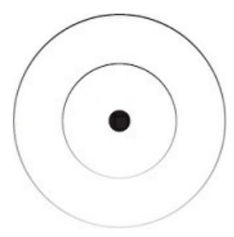

{129}------------------------------------------------

### THE PROJECT

One pattern I've noticed in my life is that I've always carved out time to build something of my own. Things like schoolwork, client work, and even projects assigned to me on a job were necessary, but they didn't bring me the fulfillment I was looking for. Having a perpetual stream of evolving personal projects to work on first thing brought novelty to my days. The discoveries, insight, and progress that I made across multiple domains was the source of my zest for life.

To find the fulfillment that assigned projects can't provide, you must go inward, because someone can't give you what is meant to be a conscious personal creation. You need to know what you want because if you don't, someone will tell you what you want, and you will believe it.

From that meaningful goal, we can perceive our problems from a higher perspective. This is where most people go wrong. They want the problem to go away in an instant. So, they fail to gain clarity on the path to achievement, become overwhelmed, and get stuck in a negative thought loop.

Instead, we want to approach our hierarchy of goals like we would a grade school science project. The essence of the scientific method is to form a hypothesis, identify a problem, research how to solve it, document your discoveries, refine your system, and publish the solution.

The solutions that you create for any area of your life can be used in 2

useful ways. The first is to free up mental energy in your life so you can build something deeper. The second is to pass along your solutions to those that want to be helped. Either to raise the collective consciousness, make an income, or both.

Through structured self-experimentation, your dreams become inevitable, and you create more serendipity in your life. Now, we don't have to stop at one-off projects. A project is a unit of mind, and we can layer them for even more impact.

You are the infinite project. You are your life's work. You improve yourself by pursuing a hierarchy of goals, each of those goals being a project in and of itself that can be used, shared, or monetized.

If you are the project, and each subsequent project presents a certain level of challenge that can be met with lifelong learning, your life is structured for maximum and sustained enjoyment. You will be forced to step into the unknown, where your nervous system signals that you are experiencing a meaningful event. When your life becomes a process rather than an outcome, the perception of your daily life reflects that, and your suffering decreases. Each level of challenge that you surpass allows you to educate those under you that are facing the same. Projects only live on as long as their impact is spread.

Note that this introduces a similar phenomenon as designing our ideal lifestyle. When our string of projects and who we want to become align, our attention narrows on the survival of each project, and the power of the unconscious mind sends resources to help.

{130}------------------------------------------------

As we complete, publish, and iterate on our projects, we increase the complexity of the self. At each level of mind, your perspective expands to match, and you can relate to reality in a less-selfish manner.

From this higher perspective, our goals evolve, and the host of problems that accompany them become more meaningful to solve. Once you've mastered your survival to the point where it consumes a marginal amount of

mental energy, you can focus your attention on the creative impact of your mind.

### HOW TO LEARN

The source of learning is struggle, not memorization. Learning is the process of turning knowledge into understanding, and the lowest points of your life are those where a stackable lesson presents itself, but only if you apply it in reality.

Knowledge compounds, and without quality ideas, struggle, and time, you will fail to reach new levels of understanding. Again, this process is not immediate, and for most, genuine knowledge creation is an impossibility until they wake up. The problem is the attitude that schools approach learning with. At a young age, the act of obedience without question is tattooed into our psyche. It makes sense why there has been a silent education revolution on the internet.

The neurotransmitter that most influences our behavior is dopamine.

Dopamine plays an important role in our learning process, and when we seek to understand it, we can leverage it. From here on, we are assuming that you have an intention. Intention is the invisible bridge between goal and action. With a mind that is open to our desired future, we expand our field of awareness to notice things that will aid in the survival of that future.

What are you aiming toward? Hold that at the top of your mind so you can recognize and apply lessons directly to that goal.

Novelty, pattern recognition, and the dopamine involved with both are the next step in our learning endeavors. The easiest way to notice this is to reread your favorite book. Or reflect on your experience with this book.

When you revisit information from a new level of mind, you notice resources that didn't originally catch your attention through novelty.

If your goal, conscious or unconscious, is to buy a new car, certain aspects of this book will stick out to you more than others. Your mind is a magnet

for novel ideas. By design, you collect knowledge that will aid in buying that new car. If your intention is to misinterpret everything I write so that you have an excuse to stay the same, that can be dangerous.

For someone that has a different goal, like getting out of the state of emotional turmoil they are in, they will interpret this book from a completely different perspective. The same is true for

{131}------------------------------------------------

someone that wants to make more money, get fit, or just entertain themselves out of boredom.

Pattern recognition comes into play with this as well. Once you set your mind on that new car, or better mental health, you will notice that specific car, or happy individuals, as you are out and about in the world. Or how when you learn a new word, you start hearing it more often.

By having a simple intention to act, your signal-to-noise ratio improves through dopamine. We can see why those that choose the unconscious modality of living look so miserable. It's because their attention is being manhandled by the goals that have been projected on them.

Next, I want to introduce a few universal laws. The Law of Use and the Law of Inspired Action. These play together in unison and synthesize well with novelty and pattern recognition.

The Law of Use is simple. If you don't use it, you lose it. Meaning, if you do not apply the information you process with your conscious mind, especially if on an inconsistent basis, then it has less of a chance of becoming a habitual thought process.

The Law of Inspired Action adds firepower to the information we intend to apply toward our goals. The novelty and patterns we noticed are more than likely to inspire us to act, but that inspiration has a short fuse.

So, it makes absolute sense to have some form of idea-capture system for your projects. Like the notebook you took out to strategize your lifestyle or a dedicated app in your phone. You won't be able to execute on any and all ideas right away. The next best thing is to write it down so you don't waste that potential. And no, you won't remember it without writing it down.

To round out our ability to learn, the Protegé Effect is our final piece. In short, it's "learning by teaching." When you teach what you know, and struggle to articulate certain concepts, you reveal gaps in your knowledge.

Those knowledge gaps are filled through intentional education, novelty, and pattern recognition. Not only will you spot information that aids in the pursuit of your goals, but also for the missing pieces you've identified in the pursuit of helping others reach theirs. Teaching what you know, regardless of how much of an imposter you think you are, is how you supercharge your understanding of ideas.

Humans learn best when they pursue a goal, encounter a problem, remain conscious of that problem, notice information that can solve that problem, rapidly act on that information, and go on to teach what they learn to others.

Whether this was an intentional design by a higher power or not, we can see how self-development, paired with a sense of mastery, is the path to a life of meaning, money, and impact.

### BECOME A BUILDER

Overabundance of information is like pouring a gallon of murky water down a small drain. We love to horde theory, orthodoxy, and conceptual understanding of things without direct experience. Because that means we would have to do something we perceive as uncomfortable,

{132}------------------------------------------------

when we've been conditioned into perceived comfort. Life doesn't work that way, and nobody wants to be "that" guy. You know, the one that gives a book's worth of advice without understanding your goals and not having done it themselves.

What you'll find in most domains is that true experts rarely need guidance.

They used science, theory, and advice to get to the intermediate stage, but they learned that intuition and direct experience trump all once you get into the advanced stage. The reason that people don't realize this is that they are too attached to the identity they built along the way. The helpful concepts

they gathered with time gain a shred of sentience and become their puppet master.

You balance practice and theory by becoming a builder. That is, always having a project to build in alignment with the theory you are learning about.

When I was learning design, I started by watching endless tutorials on how to use a specific software instead of any of the other options available. This only led to getting stuck in tutorial hell. Learning the principles of design would have been the traditional route, but even that may leave you with an endless thirst for information collection without application.

When it came time to put my skills to the test in the real world, I knew nothing. I was forced to supplement what I was building with specific tutorials if I wanted to see any meaningful progress. I had wasted weeks of time "learning" just to end up at ground zero.

Once I realized how much I retained from learning in accordance with a real-world project, I switched to this method exclusively. If I wanted to learn how to build a website, I wouldn't start learning first. I would outline a project, pull inspiration from a project that I admire, and seek specific knowledge from beginner to advanced in a way that allowed me to apply the information immediately. That way, I was forced to encounter struggle from the very start. I prime my brain to receive an immediate lesson through my specific research. Once I find the solution to the problem, I get a "quick win" and start to build momentum into the rest of the project.

Most people learn and learn just to start over when it comes time to build, because they realize that everything they've learned has no direct use in the project they began. They don't have a goal-specific lens to interpret their learnings from.

Success is a game of intelligent imitation, and that's exactly what this process allows us to do. If you want to truly learn, theory must brush up against reality. Start, then learn.

### **SELF-EXPERIMENTATION**

The only way to solve your own problems for good is through self-experimentation.

People forget that their minds are infinitely unique. Yes, our genetic code is rather similar, but the billions of bits of information you've processed in your lifetime are radically different from others. Every bit was processed in a microscopic crevice of reality, at a different time, and with prior bits processed that influence how the next situation will be perceived.

{133}------------------------------------------------

Most people can't leverage this fact because they aren't conscious of the often-prolonged cause and effect of their choices. Instead, they mimic the latest haircut because it may help attract a tasteful mate. Or they chase after what's hot, flashy, or new because everyone else is.

In business, relationships, career development, and anywhere else you need to stand out, the minor distinctions are what give you an advantage. Solving problems in your own way is how you stand out in a world of copycats.

Self-experimentation is the opposite of blind trust in a theory, guru, or belief system. It is the only way to discover what truly works for you and your infinitely unique needs. For any given problem, there are dozens of options available to you to solve it. Internalize this, because people are naturally indecisive. They have difficulty opening their focus beyond their problems to find a solution that when they do, they get overwhelmed to the point of doing nothing.

If you have relationship problems, you can go on a retreat to contemplate, hire a therapist, or try to work it out directly with your partner. No single option is the best until you piece together a solution that works, but even that can't be preached as law to others with a similar problem. Most of the time, you won't choose just one of the techniques, but a combination of parts from trying them all. That is how you create a novel solution to your own problems that advances progress within that industry.

If you have money problems, you can try creating a budget, starting a side business, or improving your skillset to get a higher-paying job. As you explore different options, you may find that all of them help. Rather than seeing your money problems as something that can be solved in one go, you realize that the solution is in changing minor facets of your lifestyle.

If you have health issues, you can try fad diets like veganism, carnivore, or keto just to learn that the big-picture principles of nutrition are all the same.

From that enlightened state, you can create the perfectly unique diet plan that you can adhere to for life (while most regain their weight immediately after stopping the diet).

If you have self-esteem issues, you can start running, bicycling, or lifting weights. The danger is in getting trapped in one ideology rather than pulling truth from all.

With self-experimentation, you are aiming to create a sustainable system that is conducive to your vision for the future. As your system becomes more efficient with time and mental energy, that problem ceases to bother you, and you can invest your focus in problems that require a higher degree of creativity.

To understand this process of systemization, let's look at a bodybuilder.

Their goal is to build and retain the most muscle mass possible. To do so, they go through "bulking" and "cutting" cycles. When they bulk, they slightly overconsume calories to put the body in a muscle-building environment. They will inevitably gain some unwanted body fat. We can think of this as the self-experimentation process. During the bulk, they reach a threshold. They gain enough body fat to the point of not liking how they look, feeling slow and sluggish, and having trouble eating the right amount of food.

{134}------------------------------------------------

When they cut, they slightly underconsume calories to put the body in a fat loss environment, hopefully one that retains the muscle they've built underneath. They may lose some muscle, but they should achieve a new

"peak" physique by the time the cut is over. We can think of this as systemization.

When you pursue a new goal and a problem presents itself, you try multiple options to find a solution. You may not find the exact solution immediately, but you will pick up a lot of useful information. At some point, you bite off more than you can chew. You start to feel overwhelmed because of the mental fat you've gained. Many are familiar with the cyclical period in their lives where they feel lost or anxious.

Soon enough, you will need to cut back and rid your life of the things that aren't working to solve your problems. Try everything, see what sticks, and give yourself permission to drop the things that don't. We want muscle, not fat, and that muscle is there to stay without much additional effort.

This pattern reflects across all domains. When I was pushing for business growth and hitting new monthly highs in revenue, I would work longer hours, try new tactics, create new products, and move as many levers as I could. I put my business in an environment conducive to growth through my season of intensity.

I knew there would come a time when I had to cut back to 4-hour workdays and my ideal lifestyle. When I did, the business muscle that was built in my endeavors revealed a new monthly baseline revenue.

This is how you solve all the problems in your life. Identify a problem, experiment with different solutions, and drop everything that isn't sustainable. If you can't see yourself doing it every single month, week, or day, it doesn't belong as a habitual part of your life.

### PROJECT TO PRODUCT

Everyone is an entrepreneur; some just choose to get paid for the problems they solve in their personal life. Problems are best solved with a personal project and self-experimentation. You become an entrepreneur when you

take your projects public. And remember, you are the ultimate project. The exchange of goods is the foundation of human connection regardless of generation, gender, race, or type of good being exchanged.

In modern times, money is an important resource for the proper function of our everyday lives. It is the lifeblood of society, and it is your job to earn and spend in areas that you want to bring to life. As problems continue to be solved, the emergence and development of a more advanced digital currency is unfolding before our eyes. Money is a valuable resource for everyone who does not have it, and those that want it only need the skills to exchange for it. Unless you want to disconnect from any social interaction and attempt to survive in the woods, you need money. No amount of self-righteous preaching about how money is "evil" is going to change that. If you want to participate in the incredible advancements of our times, you will have to contribute to

{135}------------------------------------------------

humanity through business and value exchange.

All profitable products start as a project whether the intention to sell is there or not. If you want to generate a creative income, you will need to sell a valuable product. And what's a better starting point than a personal project that solves a burning problem that all living beings encounter?

Now, I want to make it clear that I am using "product" as a blanket term for

"what you sell." This can be a physical or digital product or service. It makes sense to start off as a freelancer, consultant, or tutor with the systems you've developed. Once you have distribution and leverage under your own name, you can turn that proven system into a product that sells while you sleep.

Most people wait to start a business until they have the perfect plan that holds no meaning to them. Others have an unconscious relationship with money that leads them to believe that "selling" is bad. Yet, they go on to work for a massive corporation that exploits their employees to sell a product. Or they don't realize that they are selling their ideas, beliefs, and worldview during every single interaction. If you don't sell your own product, you will be forced to sell someone else's.

Success is counterintuitive, and if you want out of the societal dominator hierarchies, you will have to create a product. There isn't any other way.

This method of turning your personal projects into a product is one method of many but is an incredible starting point for those that want to discover, pursue, and evolve their life's work without venture capital or investing their life savings.

Not to mention, people get wrapped up in worrying about saturation, competition, and product market fit. This method bypasses all of them by leveraging the most unique thing on this planet: you.

After a plethora of freelancing and e-commerce business failures, wasting tens of thousands of dollars on sample products, paid advertisements, and business courses with an ever-growing student debt, I saw my first success in web design. I'll spare you the details of the journey. The notable aspect was that I started out of curiosity. I had always wanted to do something creative, and my field of awareness at the time allowed me to register and research web design.

I built projects for my previous business attempts, like freelance photography, and offered to build projects for my family and friends. Of course, if I could go back, I would change the way I did things, but that's why I'm writing this book. To pass on my lessons.

The logical transition for those web design projects was to become a freelance web designer, so that's what I did, and I solved the problems that presented themselves until I made a sustainable full-time income. First, I had no idea how to land clients, so I studied and experimented with multiple techniques I could find on the internet. Second, I realized that a single skill wasn't enough to get the results that would allow me to charge higher prices, so I started learning marketing, sales, and writing. Third, I knew that I couldn't increase my income beyond a certain

{136}------------------------------------------------

point with manual client acquisition, so I started building distribution by posting content in public to attract a following. By solving those 3 problems over the course of a year, I gained more specific knowledge (and made more money) than my 4 years at college would ever allow me to.

If I had known at the time, I could have gone straight into consulting or tutoring. Specific people prefer to do things themselves; others prefer to have it done for them. I prefer to teach, so my business endeavors evolved to reflect that. I gained experience by solving my own problems and eventually went on to teach what I'd learned in my freelance web design business.

Notice how I didn't close my mind off to something less limited than a singular skill like web design. Many new entrepreneurs identify with a skill or interest rather than the problem they are solving. A skill is a tool that solves a problem that births passion. Be open to improving your skill stack or accept that the path is going to be more difficult than it needs to be.

As I acquired new skills and reflected on the problems in my business, marketing consulting was my next purpose. I despised doing manual work for local business owners, targeted individuals who were more like me, and used my skill stack to create a service that would benefit their professional lives.

This is when I began to understand the raw power of the internet. I started my creator journey, began attracting an audience with my interests and expertise, and had clients coming to me. I had escaped the feast-or-famine cycle that a majority of freelancers get trapped in.

Soon enough, I had the distribution necessary to decrease the amount of client work I took on. I was solving the problem of productivity in my life and decided to create my own planner.

Through self-experimentation, I purchased 3 different planners, obsessed over the latest productivity advice, and tested them all in my daily routine.

Some things worked well, some didn't. The things that did, I added to the planner design.

I had no idea what stood ahead in the unknown domain of print manufacturing, but I figured it out one step at a time. Weeks later, I had the first sample planner in my hand. The feeling of building your own thing is incredible. I hope you experience it one day.

After 3 years of evolution, I had built multiple digital products, trashed them, created new ones, trashed them again, and before I knew it, I had a multimillion follower distribution network and a hyper-profitable product stack that would sustain creative endeavors like writing this book.

The first lesson of this brief story is that there is always a better problem to solve. Most people solve a grueling problem in their life, settle for the solution that was created, and remain isolated in that bubble of grueling effort. More is better, but only when backed by a sense of mastery. The second lesson is that my products started as projects in my life. I wanted to improve my productivity, so I experimented with different solutions, created my own, and distributed it with my marketing, sales, writing, and speaking skills.

The path to the good life is simple: actively pursue your ideal lifestyle, create solutions to

{137}------------------------------------------------

problems along the way, and get paid for sharing that solution with others.

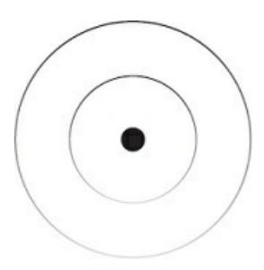

### THE VESSEL

In an ideal world, everyone would be able to sustain their desired lifestyle doing what they enjoy. But we do not live in that world yet, and human nature favors the distribution of power through evolving hierarchies.

You can rest assured that a majority of the population has not been exposed to this information, and information is the primary resource of modern success. If you wish to do so, you can leverage this opportunity into a fulfilling life before it becomes the only way of life. That is, everyone leaning into their entrepreneurial nature to both earn a living and contribute to the world, from local to Universal.

Human nature reflects that many will choose to stay at the bottom of any given power hierarchy just because they were conditioned to. But we know that destiny can be influenced through our daily choices.

With the desire to change, anyone reading this book can leverage modern technology to not only create an independent income source, but have an abundance of money, time, and control of attention to focus on the other important aspects of life.

Everyone should have an understanding of business principles for a few reasons. One, so that they are not limited in the amount of money they make. Two, so that they can experience the microcosm of life that business

is. As with all pursuits that seem shallow on the surface, there is a depth of wisdom waiting to be discovered. It is a deeply spiritual endeavor.

Money is the barrier to improvement in many areas of life. The cliché advice that "money doesn't buy happiness" is a half-truth that influences people to neglect the modern resource that they go on to become a slave to.

Cashflow is often the first problem that should be prioritized, because a lack of it places a limit on how far any other area of life can be developed.

Long, exhausting hours spent on work that does not align with your values does not need to be a permanent sentence. It can act as a stepping stone to acquire skills, build a community, and earn enough to meet your basic needs. Entrepreneurship is the only logical option for long-term thinkers.

{138}------------------------------------------------

Yes, even to those that love the structure that a job provides.

Entrepreneurship does not eliminate structure but allows you to take a lifestyle-first approach to creating your own.

People climb corporate ladders because their psyche craves challenge. But you can only climb so high. The challenge will cease to exist, and unless you find another source, preferably intrinsic, it would be wise to cut to the chase and start building your own thing. Entrepreneurship is a process-focused endeavor with an infinite bucket of challenges that you can pick and choose.

In a long-winded attempt to prime your mind to receive this lesson, the internet now demands that you display your value in public. Employers are hiring based on social media portfolios. Freelancers are working with large corporations across the globe. Entrepreneurs are leveraging the close-to-infinite reach of the internet to distribute their creations.

Education is the first step on your journey and there are 3 modalities for distributing the value you have to offer in the form of a product or service.

This is how you package up your skills, interests, and expertise to join in on the emergence of the new economy.

To form a foundation, we will be discussing all of this under the lens of creative, knowledge, and online work. We will not be discussing the

information you can learn and be trained into by the school system. We want scale, autonomy, and fulfillment from the systems we are creating through self-development.

If you'd like to build a massive company, that's a worthy endeavor. But, unless you have business leverage in the form of a network or capital, you shouldn't be thinking about taking a huge jump into the depths of the business unknown. All that we talk about can be done as one person. Once you have leverage, you can start a company from a place of low risk and high reputation.

First, there is "done for you" work. This includes the realm of freelancing, consulting, and specialized services, where you are doing the manual labor for another business, brand, or individual. With the proper strategy, you can generate a sizeable income. But, if you are a one-man operation, you have a ceiling on how much you can earn.

Second, there is "done with you" work. This is a similar service-style offer that includes consulting, coaching, and tutoring. This is where we begin to earn with the creative ability of our mind, not manual labor. You can reach new heights as one person, but there is but a slightly higher cap than "done for you" work.

Third is "do it yourself," where digital and physical products come into play. These include courses, subscriptions, software, tools, guides, books, templates, and programs that distribute, teach, and get results for your customers with minimal work on your end. The goal is to be able to earn an income while you sleep. That is the new luxury for the individual of the 3rd millennium.

{139}------------------------------------------------

You are to experiment with each one according to your experience level, pivot into the next, and structure your work in alignment with your ideal lifestyle. Understand that entrepreneurship places everything within your control. Everything. You can change any aspect of your lifestyle, product offerings, or the work you choose to do if you perceive it from an evolving level of mind.

"Done for you," "done with you," and "do it yourself" style offers can increase in value and profitability with a developed system that gets results, a strong reputation behind the person selling it, and the previous results you've gotten past clients and customers.

### THE ONE-PERSON BUSINESS

How to start a billion-dollar company: Don't. Instead, start as one person. If you can't turn your interests into income, you don't have the skill to start a business that requires 10 times the resources.

Most people have dreams of being the CEO of a successful business but haven't managed to be the CEO of their own life. And when they do manage to run a large business, their finances flourish, but their relationships, health, and happiness are nowhere to be found.

With 5 years of focused effort, I was able to leverage my self- development into \$10,000, \$100,000, \$150,000, \$800,000, and \$3,500,000 in business revenue year after year with the infinite reach of the internet. These are rounded numbers. Five years may seem like a long time but remember that 4-year-degrees don't even guarantee job placement for the disappointing average US salary. As one person, this is more than enough to sustain any lifestyle you'd like, no matter the damage inflation creates by the time you read this book.

I'm not a fan of get-rich-quick schemes, but success is counterintuitive, and the quickest fix is the longest path. Think about it: if you solve a burning problem in your life, one that every single person has, and your income is a direct reflection of the quality of problems you solve, why not start there? It is the most profitable and meaningful route by all measures and calculations. There is no use trying to land on Mars when we can't even live on this Earth. By solving your own problems and helping others solve their own, you raise the collective consciousness to the point of everyone solving problems they are passionate about.

You, as an individual, have the ability to attract an audience to your work and put a valuable product or service in front of them. This product or service should complement your skill set ranging from consulting, freelancing, and information in various forms like a course or book, physical tools or crafts, creative systems, and the rest.

There is a reason you have the interests, skills, and experience that you do.

It would be silly to think that others' lives wouldn't benefit from them. You aren't special, and that's the point: there are people just like you that can benefit from your conscious development.

A modern business can be broken down into 3 core components: brand, content, and product. Your brand is your story. Your content is a map. Your product is a game. Even business reflects Universal patterns.

{140}------------------------------------------------

To attract people to your business, your brand will be the first touchpoint. It must clearly illustrate a desirable goal that others want to achieve –

specifically a goal that you are working toward or have achieved. The skills and interests you acquire are what make the story toward this goal unique.

Realize that you do not need results to start. People find value in those documenting their journey to achieve a goal that they have. Not only that, but you can create a profitable product right now. You can research a product that you use, create your own, and put a price tag on it. knowing that you are sticking your hand into a stream that is already flowing.

Most people have the same big goals in life. They want more money, sex, happiness, and energy. They want a higher-quality experience. But there are infinite ways to achieve these goals, and you have taken a unique path of education and action to achieve them. I would encourage you to forge and distribute a meaningful philosophy behind the surface-level pursuits that people want.

Content, in the form of media, is how you attract people to your brand Content can be anything that registers in the awareness of people in real life, or in our case the internet. Emails, articles, videos, writing, designs, and the rest distributed to a crevice of digital reality by free or paid means.

When crafting the message you wish to distribute with content, you must take into account the level of mind of your potential audience. Some people are at the beginning of their story with a plethora of surface-level problems to solve, so create for them. Some people are one step behind you and need that final piece to the puzzle, so create for them.

Most of your audience will be beginner level. This isn't by your design, but because most of the world doesn't believe they have the capacity to improve themselves. Encourage them the most but be sure not to neglect the others that need a more advanced message.

Most people are mindless consumers of the media that crosses their eyes.

But the silent observers, they reverse engineer, dissect, and research why that message is so impactful. From the lesson they receive, they can develop the message they are putting out.

By attracting an audience to your brand, creating a message that shines awareness on the problems they face and the solutions to solve them, you set yourself up to generate a creative income with the product you create.

Using what we learned about "done for you," "done with you," and "do it yourself" products and services in the last section, let's walk through a business path that allows your life's work to bloom. The only startup cost is a commitment to the path.

The easiest way to generate an income is to help people increase their own.

This may seem shallow, but remember, money is the main resource holding individuals back from personal evolution. By prioritizing your education around the evergreen skills – marketing, sales, writing, and speaking – you set yourself up for your first hunt in the wild, wild internet.

{141}------------------------------------------------

This path follows the "learn a skill, teach the skill, sell the skill"

progression. You can either stick with the evergreen skills or learn a results-oriented skill that is specific to the state of the internet as you are reading this.

You start by learning the skills with methods previously discussed, teach the skills as the message you use to attract an audience, and lastly, you sell the skill to those that understand your newly developed expertise. If this doesn't make sense, it's because you haven't built a project that requires the evergreen skills.

That is the first option to generating a creative income. From my experience in consulting, teaching, and working with nearly 10 thousand brands, this is the fastest path to cash, no gimmicks.

The second option is an evolution of the first. I would recommend that you start building your independent income source immediately, but some people want to learn the ropes before they press play. That's understandable.

You will need a complete skill stack to progress into this second stage. All evergreen skills and a few results-oriented skills that you learn as you build are necessary for this to work.

This style of one-person business is where you quite literally pursue your goals in public (brand), solve your problems as you are pursuing those goals (content), and create a system to help others do the same (product).

You are not limited to profitable skills. Instead, you can use those skills to make your interests profitable. The interests that you became obsessed with on your path to a big, meaningful goal. Don't be surprised if your life's work becomes more and more clear.

This path does not require mastery in every skill associated with the skill stack previously discussed. Instead, mastery is developed when you start building, identify problems, and supplement your building with specific self-education.

You can create, test, and iterate a freelancing, coaching, or consulting offer at a low price point. You do not have the experience required to develop and market an expensive service, so start small as you would anything else worth improving.

The reason we are starting with a service, not a product, is because generating an income from a low-priced product would be near impossible from the start without ample money invested in paid distribution, like advertisements.

With a problem-oriented service and sales know-how, you can generate a full-time income with 2–4 clients a month, rather than one hundred to five hundred product sales. As we will learn in the next section, all you need to do is get the service in front of eyeballs and your name in people's mouths.

As you work with others, generate results, and attract an audience, you are well on your way to removing the cap on your income. In most cases, if you do not grow stagnant, you can outearn

{142}------------------------------------------------

most of the "best jobs" you will find after twelve years of formal education. Considering everything goes right, which it won't, you can expect belief-shattering results within 6–12 months of focus.

With leverage built and an audience unable to invest in a high-cost service, you can use your previous results to create a product from that service.

When you put it in front of the audience you've been nurturing for months to years, it will sell.

You can choose to stay as one person, or you can use the leverage you've built to start a "real" business. Although, I don't see why you'd want to unless you develop a love for building and monetizing impactful projects.

### YOU ARE THE NICHE

You have \$100,000 trapped in your head. Starting a business is how you begin to order that information to display its perceived value.

The most profitable niche is you. Your unique skills, interests, and experience overlap in a way that allow you to solve profitable problems for people you enjoy working with. The authentic don't have to compete with anyone but themselves.

In every business course, video, or article I consume, the most apparent advice is to "niche down." It makes sense, but pushes people toward working with people they hate, with a skill they feel locked into, and don't have any room to pivot without exhausting the money they use to survive.

Which would sell more? A journal? Or a journal with structured prompts and bonus accountability sheet for those that struggle with habit formation?

This illustrates the importance of not only having a niche but creating a system for that niche to improve results. And, you can imagine that the price point, design, and marketing strategy can be tailored to that niche, making it easier to find and sell to those people.

The problem is that most people start a full or side business for the sake of money and money alone. It's understandable, but we can incorporate meaning and fulfillment into your pursuit of money without any setbacks.

Keep in mind that I am proposing that you start as a one-person business, monetize your self-development, and once you are generating a creative income for yourself, you can choose to start a company and fuel it with the leverage you've built.

The mistake of many is to niche down on solving a problem within a market. This is great, but a problem is difficult to identify without a goal.

Instead, niche down on a desirable goal that someone else wants to achieve, create a system for them to get there, and introduce new challenges as you help them improve their skill set.

{143}------------------------------------------------

This is how you order the minds of your customers, by gamifying your product or service. In a world where results mean more than credentials, you must do everything in your power to make your product easy to use, effective, and transformative. Results are determined by behavior change. If your customers don't use your information to better move within the world, you did not do your job.

If we are meant to provide value to a specific person, or identity, because it will register best in their current level of mind, why not use the value we've cultivated through our self-development and distribute it from a more

holistic perspective, to help them navigate the unknown faster than we previously could? This is how you most effectively raise the collective consciousness.

Picture a graph that represents your path in life. The highs, lows, achievements, and problems. This represents your story, which makes for a relatable, trustworthy, and authentic brand. For each low, there is a black dot that represents a problem. For each high, there is a white dot that represents an achievement.

At the beginning of the graph lies your commitment to change your life, and at the end lies your ideal future. For every achievement on this path, you have the skill necessary to look back and help someone solve the previous problem with the skill you've acquired.

If 5 people were standing at the bottom of a mountain and asked to draw a path to get to the top, they would all draw different routes. They will struggle to get to the first peak, but once they do, they can look down and create a more efficient path for someone else to reach that peak faster.

Understand that you do not have to wait until you reach your ideal future to help someone that is a few steps behind you. In fact, this is the optimal position to help someone. A professional tennis player will have difficulty teaching an absolute beginner if they have not already created, tested, and refined a system that would get them results.

You are the most profitable niche because what is more specific than this?

Set a goal, acquire the specific skills that will help you face that challenge, spot and systemize problem-solving, and use that project-turned-product to help a specific person solve that problem.

As much as we like to think we are the center of the universe, there are many others like us. They have a similar ideal future, goals along the way, and interests that can help attract them to your solution.

An objection I get often relating to this claim of "you are the most profitable niche" is that people won't be interested in your product or

service if you attract them to your audience with a different interest.

People can become interested in new things, just like you became interested in them. And if their main desire is an ideal future that is similar to yours, you can illustrate why a specific interest is

{144}------------------------------------------------

important for reaching that vision.

Most people have a similar vision for their future. The main struggle they face is finding the skills, interests, and lens in which to view their problems that align with who they are. So, they resort to the most promising career path that has been suggested to best fit their personality.

If financial freedom is an aspect of my ideal future, there are infinite paths to get there. You can choose one of the hundreds of different business models to increase cash flow, study spirituality to mitigate the stressful demands of business, and artificial intelligence for automating your business processes.

This is one example of many but illustrates how you can attract people to your vision, introduce them to a set of skills and interests that will aid in their journey, and offer a product that helps them get there faster.

### REPRODUCTION THROUGH SPIRIT

The unfocused love to project the mediocre ideas that cloud their mind on everyone around them, because it's in our nature. We have the drive to reproduce, but not only on the physical plane of existence.

Survival and reproduction are consistent across all human beings. Like conceptual survival of ideology, concepts, and projects, we can leverage conceptual reproduction to bring more meaning to our lives. In other words, it feels good to spread ideas that bring positive change to the lives of people that invest in your message, products, and services.

The positive behavior change you spark in others will encourage them to spread those ideas further. You will impact them, they will impact their circle, and that circle will impact their own circles until it sweeps throughout the globe and expands its focus far beyond where you thought possible.

Think about the people that have had the greatest impact on your life. Is it because they performed manual work for you? Because they shook your hand and gave you a pat on the back? Or was it their ideas? The ones that lived in your head and influenced your behavior toward positive outcomes?

That is the importance of meaningful ideas that prioritize big-picture understanding. The technical details don't matter because the real-world techniques associated with them are individual. What works for them may not work for you, but the all-encompassing idea remains the same.

Understand that ideas beget execution. You cannot have a better idea if its predecessor has not already been actualized. If our ancestors did not have the idea of a field plow and made it real through their ability to create, the idea of a tractor would be difficult to fabricate.

In your life, if you do not have the idea to improve your health, business, or relationships, it will be difficult to reach the next stage of development in each. The problem is with those that lack the clarity to act with focus. We all know those people with the latest and greatest idea that will

{145}------------------------------------------------

shake the world, but when you ask them about it years later, they have no idea what you are talking about.

If you have followed the path I've laid out for you – that is to solve your own survival-based problems in the domains of health, wealth, and relationships – you will near the limits that material can take you.

Your body, and the manual labor associated with it to improve relevant skills, has its limits. Yet nobody has reached the absolute limits of knowledge, consciousness, and intellectual capacity. Creativity is infinite, productivity is finite.

You can experience heightened states of creativity along this path but realize that these are states. They are temporary. They are not your baseline operating state. When you master your survival, you unlock a stage of creativity that can carry your personal and professional life to new heights.

Unfortunately, most people stop at this critical turning point in their development.

This will take time, but I want to prepare you for what's to come. When you reach this turning point, you must prioritize intellectual development. That is how you maintain a sense of mastery behind your hard work.

The cost of ideas is mental development, and the spread of ideas is mental reproduction. The combination of both creates mental mastery. That is, having a constant flow of mental energy that impacts the quality of experience you seek to sustain.

Reading, watching, and listening to information that challenges your current ideas, beliefs, and philosophies must become a cornerstone habit in your day, because you may grow attached to those ideas and your self will cease to make progress. The challenge that this information presents will require a match in mental skill. This is how you develop your mind toward infinity.

Before the internet, you would interact with at least one-thousand people in your lifetime. In each of those interactions, each person is attempting to survive the ideas they hold in their mind through communication. Each of those one-thousand people will know one thousand more in their lifetime.

Your ideas will pass on even if the impact is insignificant or negative. With this logic, you are 2 network layers away from impacting 1 billion people with your ideas for good or evil.

With the emergence of the internet, this is amplified. Information spreads between hundreds of thousands of people in the blink of an eye and spreads throughout the digital collective consciousness. Through self-development, you can accept the responsibility to spread ideas that are conducive to critical thinking, peace, and progress.

Creation and growth are Universal laws that balance out the story of death and decay. They encompass the process of self-preservation and self-replication. A panther will defend itself until its demise, but even then will attempt to replicate itself in the form of offspring. Animals only have the desire to reproduce the information in their genes while humans have the desire to reproduce the information in their minds. Remember that these desires, or desires in general, are

{146}------------------------------------------------

not bad. But if you desire to change something that you can't, it becomes the source of your suffering. Creation is the process of changing what you can, which becomes the source of meaning.

The success of a life form is its ability to take energy from its environment and channel it toward a purposeful creation. For this to occur, you must develop an autonomous sense of self that generates its own rules. Those that only seek to reproduce the information in their genetic code or socially conditioned mind have little conscious input in the creation of their lives.

The fate of humanity is not guaranteed. The evolution of the collective is only as powerful as the individuals that comprise it. It is for that reason that our evolution depends on the individuals you and I create through the reproduction of information born from conscious personal progress.

If any given self is too comfortable and mindless, they will avoid the personal challenges that influence the fate of humanity. The information you pass on to your children, their children, and the other 1 billion-plus people you interact with ripples throughout the Universe.

We're not adapted for absolute certainty. The utopian lifestyle that most people dream of is not sustainable. And they only dream of it because they crave a break from their certain lifestyle. If society had its way and people tanned on a tropical beach all day, someone would eventually spark chaos just to create some interest in their once again certain life. The Universe demands that lows counterbalance the highs.

For this reason, it is important to choose the chaos you allow into your life.

To pursue something big, meaty, and terrifying that pushes you out of the

known. At the edge of the known, with one foot in the unknown, is where we are the most alive. Not absolute order nor absolute chaos, but a middle path where you are engaged with the conversations, education, work, rest, training, and other challenging situations on the path to your meaningful goals.

Pursuing big, lofty goals with a clear plan of your creation is how you discover new potentials for your life. Those new potentials outweigh the pleasure you can reap from any instant source. Why? Because you can feel your nervous system signal that the discovery of new potential is worth your attention.

When you are at your edge, you are at one with reality. This is where the flow of information is maximized. This is where you discover new insights, ideas, and perceptions that can be laid as bricks for others to walk on.

The mind and body have the drive to move forward. That is, to know and discover who we are, where we are going, and why we are going that way.

So we aim for the future, but if we launch too far into the unknown, the information we perceive is too chaotic. And if we don't launch far enough, we are never exposed to the potent information we can replicate.

{147}------------------------------------------------

Be careful, because once you actualize a goal, it becomes known, and therefore loses the meaning it once held. From this we realize that happiness is not found at the top of the mountain, but in getting better at climbing to new peaks of a mountain that is infinitely tall.

A primary source of suffering is knowing that you are meant for more. That you have something to discover, build, and give but have not started on your path. Many become victims of the roadblocks in the way of their self-defined goals, so they fill that time with destructive actions or the certain pursuit of someone else's goals.

The way out is to slingshot in the opposite direction. You don't need permission to orient yourself with authentic living. To lean into uncertainty, confront your fear, become stronger, and realize that there is no limit except

the ones that you accept. Be brutally honest with yourself about where you can be in 10 years if you take responsibility for how you move in the world.

Sit with the source of your suffering, the thought that you're not everything you could be, and the fact that you know it. Allow it to dig into your soul and set it on fire. Zoom out beyond your existence, paint a future you want to create, and focus your attention on authentic action. With a fire in the belly, invest energy into that future. So much so that a lack of action would feel like a waste of a million dollars. As you press on, remind yourself that the game never ends.

### **VALUE CREATION**

I'd like to believe that the unconscious, evolution-aligned intent behind modern technology, specifically the new society forming in social media, was to allow us to gain access to information we wouldn't normally have.

Thus increasing our potential in life.

Information leads to awareness of opportunity. Awareness of opportunity leads to valuable ideas. Valuable ideas lead to positive behavior change, not only in yourself, but in others. Positive behavior change ripples from the individual to community to society and beyond. One can argue that the spread of valuable information is one of the greatest goods you can do.

Now, manipulation of information can lead to death, destruction, and getting trapped in your own head. But we are here to focus on the positive implications of the information age we live in, thus breathing more life into it.

I want you to understand one thing: Everything is information, or in formation. Everything is form that arises in consciousness that is the eternal present moment. Our genetic code is information. Light is information that our eyes perceive in a way that aligns with our survival. The past, present, and future states of our lives are the result of information conditioned into our mind over time.

Information is how humans form beliefs that shape our thoughts and go on to influence behavior. Information is what culminates as tension, or resistance, that when released leads to discovery, innovation, and creative breakthrough that ripples throughout the Universe when put to use.

{148}------------------------------------------------

Everyone has the same big goal they are trying to achieve. That is to increase the quality of their human experience as much as possible. Our thoughts, emotions, and actions – which are all types of information –

dictate our experience, which is information in the form of feedback.

You see, the human mind needs ordered information to keep itself, well...

ordered. Like sports, religious doctrine, or morning routines. Once we have the information to play a game well through learning, and then play the game well that results in experience, that experience will be of higher quality than if we were fed chaotic information.

There is *content* and there is *consciousness*. The structure of the content is what determines happiness and fulfillment. That content can represent order or chaos. The latter resulting in poor quality of experience.

This is interesting to note. When people make a big change in their life, like cleaning up their diet, they usually attribute the uptick in their quality of life to the diet itself. It plays a role, yes, but I would argue that sticking to a regimented diet results in an enhanced experience because of the order it brings to your mind. When you eliminate the possibility of distraction, which would be junk food in this instance, the frame of your focus is difficult to penetrate.

While most use information as a way to distract themselves from the problems in their life (through argument, mainstream news, and flavor-of-the-day drama), others realize this trap and let curiosity guide them in the opposite direction.

There is a way to use information for good. That way is to control the content of your consciousness, guide the content of others' consciousness, and increase the quality of life that all parties experience.

This is a journey of both self-actualization and self-monetization, which eventually results in self-transcendence. Increasing your quality of life and passing down what you've learned to do the same for others.

The future belongs to those who occupy the most mental real estate with their ideas. Manipulators know this and will stop at nothing to act as collective crabs in a bucket. That is, minds of low development will try to bring the world down to its level. Minds of high development will try to bring the world up. We are in the middle of a spiritual war of ideas.

Creative work is the vessel for impacting the minds of others, but don't be mistaken, this is a spiritual battle. When you peel back the veil of labels, limits, and distinctions, everything we do is to transfer our quality of experience from one to another until we reach the collective experience of the Universe.

The emergence of the digital plane of reality has perpetuated this issue, and I hope you feel a sense of obligation to raise the collective consciousness through the spread of quality information through your medium of choice.

{149}------------------------------------------------

From a high level, every entrepreneur, monk, and subjectively successful individual understands the importance of tending to the information that lives in their head rent free. When you read a book, the best ideas are adopted into your worldview. When you consume social media content, the same thing happens. Over time we cultivate a perspective and identity that influences and reinforces itself through our choices.

Whether they be positive or negative, the ideas that occupy collective mental real estate will influence the progress we make as a species. The future belongs to those that can capture and hold attention with valuable information for the most amount of time possible. This is not limited to people physically looking at you, listening to what you say, or consuming a product or service they've purchased from you. Like an impactful quote, people can hold information in their mind and give it attention when they need to make a life decision.

To create is to meet the base desire of your psyche, and the experiences that manifest through focused creation are ones of feeling lost, overwhelmed, focused, and fulfilled, often in that order.

Creation is the process of hunting for an abundance of raw material, experimentation, making a giant mess, connecting the dots, and attempting to package up your findings in a way that is perceived as valuable for whom it was created.

To become a value creator is not a business model, but a way of life. It is the simple yet often overcomplicated act of leaning into your nature of survival, reproduction, and exchange of goods between your community on the mental plane of existence.

Value creators are obsessive reality explorers. They don't create to make money; they make money to create. They research their obsessions and distill their learnings with articulate writing or speaking that is persuasively distributed to the public. They get paid for aggregated knowledge and experience in their products, even if those products aren't information products. Lastly, they prioritize education of their attracted community to the point of positive behavior change.

Value creators dedicate themselves to their interests found in exploring the unknown, not an interest that was projected on them, because that would eliminate the unique combination of interests learned, which would decrease profitability beyond money.

Why does this matter? Because we need passionate individuals to become experts in their respective domains of mastery. Who else is going to do it?

Will the government (that is intimately tied to the school system) nurture a curriculum as technology phases out an entire segment of work? Not a chance.

At the time of me writing this, the "value" space in the new economy is sadly small. Everyone is focused on flashy gimmicks and cheap entertainment to hold a mindless audience. Few care about the depth behind the looks. The looks are important, don't get me wrong, but they are

groundless without an attached intrinsic philosophy that gives meaning to what can quickly become a meaningless existence.

{150}------------------------------------------------

We need individuals that can attract and educate the people that resonate with them, because school curriculums won't be able to keep up with the niche advancements of value creators, as they are the first to find, develop, and create opportunities on the free market.

The future of value will be created by holistic synthesizers. The school system educates in compartments, when reality is not compartmentalized.

Each department like science, humanities, mathematics, and art each have their own biases in which they isolate and interpret information with a lack of regard for the whole.

In this day and age, the problem isn't a lack of technical expertise, it's a lack of wisdom. Wisdom is nuanced and requires development over time.

When you zoom out to adopt the perspective of the Universe, you gain the understanding needed to piece together a creative solution that can hone in on a technical problem.

If you accept this path, you will be criticized. You will contradict yourself because life requires change. You will feel lost quite often. Don't forget that it isn't supposed to be any other way. If you haven't yet created sustainability in your life, the only other way to achieve it is by someone else's creation.

To reiterate the entirety of this path, there are a few things to keep in mind.

First, seek to understand and experience the patterns of the Universe; they can teach you more than any words, form, or interpretation. Notice how it ebbs and flows. Across all planes of reality, there is creation, destruction, give, take, birth, and death with an invisible glue holding it all together that we call spirit.

Second, and as you experience the full range of the human experience, align your decisions with the perspective of your ideal self. This is done through creating an actualization hierarchy of goals, moving forward, moving back, learning, and solving problems that reflect on a Universal level. You are the

Universe, but there are many limitations you have accepted that prevent you from realizing who you are. You burst through these limitations by making progress and doing the inner work necessary to avoid getting lost in the game.

Third, and from an elevated state of consciousness, harness the creative ability of your mind to build holistic projects that contribute to humanity, even if on a small scale. Hunt for ideas and build with your own 2 hands.

Make the immaterial material. Turn dirt into gold. Become a massive value creator in a world that is desperate for depth.

At the root of it all, leave your dent in the world through the art of focus.

{151}------------------------------------------------

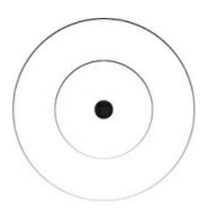

### **RESOURCES & INSPIRATION**

### LEO GURA-ACTUALIZED.ORG

Leo has been a pillar in deconstructing and reshaping my worldview. He creates long, thoughtful, and in-depth content on everything from metaphysics to spirituality to psychology and everything required to self-actualize. I highly recommend diving into his YouTube videos for the next 2–3 years.

### MIHALY CSIKSZENTMIHALYI

Every single book from Mihaly expanded my perspective on what it takes to live an enjoyable life. He is the pioneer of the "flow" philosophy. If you want a starting point for reversing "psychic entropy," read his book *Flow*.

### DAVID DEIDA

Deida has been foundational in allowing me to notice spiritual patterns in more than just emotional intelligence. His main focus is masculinity, which

has helped me, but watching him bring Universal teachings to that domain has opened room for me to do the same in business.

### **ECKHART TOLLE**

The Power of Now and A New Earth by Tolle were my first introduction to non-ideological spirituality. They helped me transcend atheism and eased my way into a recontextualization of God. As someone who was indoctrinated into Mormonism as a child, this was a difficult internal journey.

### KEN WILBER

Ken's integral model pieced many things together in my mind. Before finding his books *A Brief History of Everything* and *Kosmic Consciousness*, I had an unsolidified understanding of what reality is. I now have a mental model by which I can make sense of the nonsensical.

### NAVAL RAVIKANT

Naval's succinct writing and speaking helped me to see wealth and happiness from a big-picture perspective. His style is one that I continue to emulate. Not to be like him, but to bring depth,

{152}------------------------------------------------

meaning, and intention to every sentence I write.

### **ALAN WATTS**

Whenever I am at a low point in life, I will fall asleep to Alan Watts'

lectures at night. Like magic, my worries decrease in intensity the next day.

Watts is able to illustrate the mystical perspective of reality like no other.

### ANTHONY DE MELLO

In his book *Awareness*, De Mello helped me understand what true spirituality is. At first, I used spirituality as a crutch. I wore it as a badge of honor. If I could recommend one book to read for the rest of your life, with the goal of being happy, this would be it.

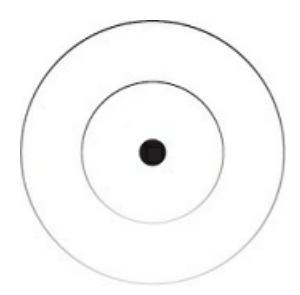

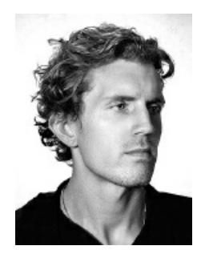

### **ABOUT THE AUTHOR**

Dan Koe's journey began at a young age. He was raised in a religious household. As he was forced to attend church, many teachings didn't sit right with him. This was the start of his questioning, but not limited to religion. The questioning extended into his family life, observations of society, and why people seemed so miserable, both on the surface and in their souls.

He continued to ask these questions: Why does everyone regurgitate the same dodgy answer when I ask a valid question about their beliefs? Why is everyone unhealthy, overweight, and angry when the actions to prevent that are obvious? Why does everyone choose to work a deadend job, then go on to complain about it in their free time? Just like anyone else, they have the ability to learn about new skills and opportunities, right? Why do couples argue, resent each other, and allow that to infect the minds of their children

{153}------------------------------------------------

who go on to do the same? Why do so few people achieve greatness? What is the primary dysfunction holding them back from changing their identity, beliefs, and actions? Why does everyone follow the same path of going to school, getting a job, and retiring with just enough money to survive? Can't they see that they are being trained into the same life as everyone else?

At an early age, Dan became obsessed with self-education. The first topic was fitness. He saw that if he lived in his body, it only made sense to make it his full-time job to learn about it. Dan found solace and community in the online fitness space. He learned from those posting internet content.

As you can tell, Dan took it on as his responsibility to determine his own future. He did go to a 4-year university, but that didn't work out too well.

After switching his area of study multiple times, he wasted tens of thousands of dollars after 4 years. Not to mention he still had 2 years left to complete his degree. It was at this point that he took an introduction to web development class. The tech industry was promising at this point in time.

Dan could either get a high-paying job with (or without) a degree, build his own software business, or freelance for those that needed that service.

These options sparked enough excitement for Dan to resort to online courses. He spent hours outside of class learning web development and building projects. In the span of 2 weeks, he had learned the entire college course curriculum. He was able to ace the class without showing up for it.

Now, Dan was disillusioned with the conventional education system. He proceeded to drop out of university and make a promise to himself. He would either forge his own path or die trying. Getting a traditional 9–5 job became the bane of his existence and fueled his vision.

Over the next few years, Dan attempted to build a sustainable income source with fitness coaching, photography, digital art, search engine optimization, multiple e-commerce stores (that his father helped him invest thousands of dollars in, but he lost that money), social media marketing, web design, and a handful of other side hustles that sounded promising.

Dan had been working part-time at fast food chains, commercial gyms, and a local print shop during this period. Toward the end, he began to lose his wits due to not making any meaningful money from his pursuits. Did he go against his values, accept his fate, and become a cog in the machine? Or does he push through and potentially become homeless? He was living with 7 other guys in an old house at this time. Rent was low, so he was okay, but the pressure was growing. After consulting with confidants, he decided to apply to a web design job with the skills he had acquired through previous self-education. He got the first job he applied to.

What Dan thought to be the end of his life was just the beginning. The job revealed his business blind spots. He studied what they did differently and was able to discern why the business was successful. With a newfound fire in the belly, he pushed all of his projects on the job to the end of the week.

{154}------------------------------------------------

Every morning, he would show up and work on acquiring customers for his own web design agency. Nothing happened, then everything happened, and Dan began to see his investment of failures pay off. He grew his business to 6 figures as one person in less than twelve months.

Since that time, Dan quit his job and expanded his business. He distilled the lessons he learned in business, self-development, and the spirituality necessary to navigate hardship via internet content. As he grew a following, he made new discoveries. The internet had evolved in a way that would shake the old economy as we know it. Dan saw the potential of education as a means to positive human behavior change. He built an education business around his story, grew to millions of followers, and still felt as if he was misunderstood.

The modern business landscape is shallow and manipulative. The future belongs to purpose-driven individuals that raise the collective consciousness. Social media is the collective consciousness being documented in real time. Business is no longer a vessel for only money, but purpose and impact. Dan's one-person business philosophy is holistic. It has gone on to change the perspectives of those that want to build their ideal future doing what they love. What used to be an old marketing tactic is now

a possibility for many. Doing what you love is no longer a pipedream, and Dan has proven that with his students' results.

These discoveries led to Dan writing his first book, *The Art of Focus*, to tackle the connections between self-development, modern entrepreneurship, metaphysics, mechanics, and psychology. Dan continues to push into the unknown so he can shape the future of work, rest, and play.

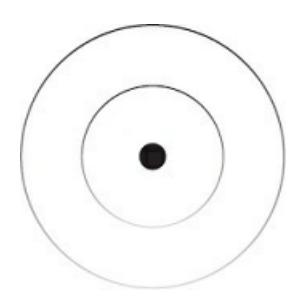

### THE MEANING BEHIND THE

### **SYMBOL**

The symbol, named *The Foci*, is composed of 3 concentric circles. One large, one small, and one in between. Like a bullseye or target.

The Foci is representative of focus. Not the shallow interpretation that is only associated with deep work, but the foundation of life itself as illustrated in the book.

There are 3 potential meanings for this symbol, but they are all synonymous in most cases.

### 1) PURPOSE, PATH & PRIORITY

The first interpretation is the most practical. It is the Universal principle to order the mind of

{155}------------------------------------------------

yourself and others. To set your mind on something beyond yourself; create clarity with a path, plan, or strategy; and prioritize the problem that must be solved.

This can be used for visualizing your future, making an important decision, or crafting a product that will transform the lives of others.

Use the symbol to remember this framework when you feel lost, overwhelmed, or in a chaotic state of mind.

### 2) YOU, THE KNOWN & THE UNKNOWN

The second interpretation is to encourage you to push beyond your limits.

To educate yourself, use what you know, and push into the unknown; the land of infinite potential.

The symbol can help you avoid getting trapped in the known. If you stay there for too long, you don't need to wonder why life is boring, monotonous, and lacks purpose.

### 3) YOUR PERSPECTIVE, THE PERSPECTIVE

### OF YOUR IDEAL SELF & THE PERSPECTIVE

### OF THE UNIVERSE

The main difference between those perceived as successful and those perceived as failures are their life direction. The outcome of their lives, where they are now, is the product of the uncountable decisions they made at any given moment.

When you zoom out to view situations from a more holistic perspective, good decisions become seamless.

Use the symbol as a reminder to view situations from the perspective of both the Universe and your ideal self.

### TURN YOURSELF INTO A

### **BUSINESS**

Start, grow, and monetize a one-person business

{156}------------------------------------------------

using the knowledge in your head (while working

less than 4 hours a day)

Modern education is failing to provide curious individuals with a career path that makes long-term sense.

The only logical answer is to build your own thing, but:

•

You don't know how to merge what you love talking about with a profitable product or service.

•

You don't understand the ins and outs of building a readership, packaging the knowledge in your head, and selling it via the infinite scale of the internet.

•

You feel like most business models are sleazy and lack purpose.

If you fall into one of those categories, it's time to revamp your education.

Digital Economics is a modern school that teaches the principles and pillars of purpose-driven businesses.

•

**Brand** – so you can attract followers to your vision for the future.

•

**Content** – so you can build leverage by writing about your interests.

•

**Product** – so you can solve your own problems and sell the solution.

•

**Promotion** – so people actually know you exist, so you can get paid.

For templates, proven systems, and a revolutionary curriculum for the future of work, go to: <a href="https://digitaleconomics.school">https://digitaleconomics.school</a> to enroll.

{157}------------------------------------------------

### **Document Outline**

- Foreword
- Introduction
- I FIND MEANING
- The Principles
- The 3 Pillars
- The Universe
- II REINVENT YOURSELF
- The Self
- The Game
- The Lens
- The Formula
- III CREATE YOUR IDEAL FUTURE
- The Shift
- The New Rich
- The Skill Stack
- The Project
- The Vessel
- Resources & Inspiration
- About the Author
- The Meaning Behind the Symbol
- Turn Yourself Into A Business