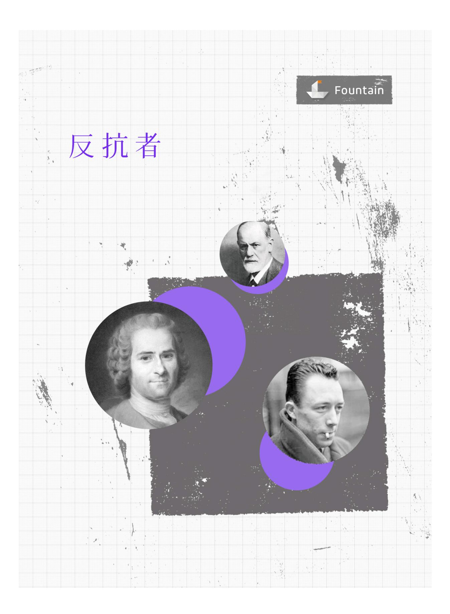

{0}------------------------------------------------

# 你不可错 24 部 西方思想

大师巨著

{1}------------------------------------------------

{2}------------------------------------------------

{3}------------------------------------------------

# 版权信息

■ 书名:反抗者

■ 作者: 【法】阿尔贝·加缪

• ISBN: 9787532761845

■ 译者:吕永真

■ 产品经理:邵明鉴

■ 责任编辑:冯涛

■ 关注我们的微博:<u>@上海译文</u>

■ 关注我们的微信: stphbooks

{4}------------------------------------------------

# 目录

- <u>引言</u>
- 反抗者
- 形而上的反抗
- <u>历史上的反抗</u>
- <u>反抗与艺术</u><u>南方思想</u>

{5}------------------------------------------------

我公开地把心灵献给严酷痛苦的大地,往往在神圣的夜晚许诺要忠贞地爱它,至死不渝,承受其命定的沉重负担,一无所惧,决不蔑视它的任何一个谜。这样一种致死的 纽带把我和它联结在一起。

——荷尔德林 (《恩培多克勒之死》)

{6}------------------------------------------------

## 引言

存在着情欲的罪恶与逻辑的罪恶。刑法典可根据犯罪的预谋容易地将它们加以区分。我们处于预谋与完美的罪恶的时代。我们的罪犯不再是那些手无寸铁的孩童,他们以爱为理由替自己辩解。相反,他们是成年人,其托词是无可辩驳的:哲学可以为一切效劳,甚至可以使杀人犯变成法官。

在《呼啸山庄》中,希思克利夫为了占有卡蒂而屠杀整个大地,但他并未想到说这种屠杀是合理的或者拿制度为其辩护。他完成了这次屠杀,其全部信仰就在此终结。他这样做可能是出于爱的力量,还有性格。爱的力量是罕见的,这种杀人是异常的,于是带有破坏的色彩。然而,自从人们信仰一种学说,自从罪恶受理性控制,它便如同理智本身一样繁衍增多,有了三段论一样无可争辩的性质。它如同呼喊一样是孤独的,同科学一样是普遍的。它昨天受到审讯,今天却制定法律。

我们在此不对它发泄义愤。这部论著的意图是再次接受当前的现实,即逻辑罪恶。确切地研究这种现实的根由:这一努力是为了理解我们的时代。人们也许认为,这个时代在五十年内使六千万人流离失所,受到奴役或遭屠杀,首先应该对它进行评估,然后要弄清罪恶的缘由。在人类的幼稚时代,有些暴君为了其赫赫声威而把城市夷为平地,奴隶被绑在征服者的战车上,在欢庆的城市中游街示众,敌人当着聚集的民众扔给野兽。那时,面对这些单纯的罪行,良心是坚定的,评价是明确的。然而,高张自由大旗的奴隶集中营,以对人类的爱作为理由进行的屠杀,或者对超人的追求,在某种意义上使人无法对之作出评价。罪恶以清白无辜乔装打扮,颠倒是非很适合我们时代

{7}------------------------------------------------

的性质,此时,清白无辜却不得不为自己辩护。本书的雄心就是接受 这奇怪的现象,对之进行剖析。

现在的问题是要弄清,清白无辜从其发生作用的时刻起,是否也未阻止去杀人。我们只有在属于我们的时刻,在围绕着我们的人们中间起作用。我们只要不晓得我们有无权利去杀死我们面前的另一个人或者同意他被杀死,便一无所知。由于当今的一切行动都指向杀人,直接的或间接的,在晓得我们是否应该以及为什么应该制造死亡之前,我们是不能有所行动的。

重要的不是追溯事物的根源,而是应该晓得在世界上该如何行动,既然世界的现状就是如此。在否定的时代,思忖自杀问题是有用的。在意识形态的时代,必须清理杀人的问题。如果杀人有其道理,则我们的时代与我们自己必将遭受其后果。若杀人无道理可言,我们便处于疯狂之中,没有别的出路,只有重新找到一种后果或者改变方向。无论如何我们要在本世纪的血雨腥风与喧嚣声中清楚地回答向我们提出的问题,因为我们与此问题息息相关。三十年前,人们在决定杀人之前否定了许多东西,直至以自杀来否定自己。上帝在弄虚作假,大家都与他一道欺骗,我自己也是如此,我于是正在死去:自杀是那时的问题所在。意识形态在今天只否定其他人,惟有他们是作假的人。每个黎明,乔装打扮的杀人者溜入一个小屋:杀人便成为现在的问题。

这两个论断密切相关,它们与我们也密切相关,以致我们无法再选择我们的问题,它们在相继选择我们,让我们同意被选择吧。本论著即打算对杀人与反抗进行一番思考,围绕着自杀与荒诞的概念开始这番思考。

不过这番思考暂时只能为我们提供一个概念,即有关荒诞的概念。对于杀人的问题,这个概念带给我们的也只是矛盾。当人们首先 打算从荒诞提取出一条行动规则时,荒诞的感情使杀人至少成为无所 

{8}------------------------------------------------

谓的,因之是可能的。如果人们什么都不相信,如果没有任何东西是有意义的,如果我们不能肯定任何价值,那么一切都是可以的,没有任何东西是重要的。既无所谓赞成,也无所谓反对,杀人者既不错,也不对。人们为焚尸炉拨火,犹如献身于照料麻风病人一样。恶意与美德不过是偶然的或任意而为之。

人们于是决定不再行动,这至少无异于同意他人的杀人之举,仅仅为人的不完善而哀伤。人们还会想出以悲惨的音乐爱好代替行动。这样,人的生命只不过是一笔赌金。人们最后终于打算采取行动,但不是免费的。在这种情况下,由于没有更高的价值指引行动,人们在朝着眼前利益的方向前进。没有任何东西是真实的或虚伪的,是善良的或邪恶的,行动规则就是自己要表现得最有功效,也就是最有力。世界于是不再区分正义与非正义,而是分为老爷与奴隶。这样不论人们转向哪个方面,杀人在否定与虚无主义的理论核心中都占有特殊位置。

因而我们如果要采取荒诞的态度,便应该准备杀人,这样,逻辑 便压倒顾虑,而我们认为这种顾虑是虚假的。当然,需要有一些准 备,但比人们认为的要少,如果从经验对之进行判断的话。此外,让 人去杀人始终是可能的,这看起来是很普通的事。如果逻辑能从中得 到好处的话,一切皆以逻辑的名义予以解决。

然而,由于有种态度使逻辑发现,杀人时而是可能的,时而是不可能的,它从这种态度不能得到好处。因为荒诞的分析在至少使杀人行为成为无所谓之后,最终会谴责杀人行为,这成为它最重要的后果。荒诞推理最近的结论就是放弃自杀,维持在人类的询问与世界的沉默二者之间这种绝望的对立状态[1]。自杀即意味着这种对立的结束。而荒诞推理认为,只有否定它自己的前提才能同意自杀。它认为,这样一个结论便是借口或摆脱。不过很清楚,这一推论同时承认生命是惟一必不可少的财富,因为它允许这种对立,而没有它,荒诞的赌博便没有了支柱。若想说生命是荒诞的,意识需要是活生生的,

{9}------------------------------------------------

若不对舒适的爱好做出重大让步,如何为自己保持这样一种推论所独享的利益呢?这种好处一旦得到人们承认,便成为一切人的好处。人们若拒绝附和自杀,则同样不赞成杀人。一个深信荒诞思想的人无疑承认命定的杀人,他不会接受推理的杀人。杀人与自杀是一回事,对二者必须一起接受或摈弃。

同样,绝对虚无主义同意自杀是合理的,更加容易支持逻辑性杀 人。如果我们的时代心安理得地认为杀人自有其道理在,这是由于对 生命的冷漠,这正是虚无主义的标志。无疑,以往有一些时代,人们 对生活的热情如此强烈,从而制造了罪恶的过度行为。但这些过度行 为犹如极端享乐造成的伤害。它们不是由贫乏逻辑创立的这种单调的 秩序,在这种逻辑的眼中,所有的人都是相等的。我们的时代沉浸于 自杀的价值中,这种逻辑把自杀的价值推向其极端的后果,即合理的 杀人。它同时在集体自杀中达到顶点。最明显的表现就是1945年希特 勒的下场。自杀对那些疯子来说算不了什么,他们准备在一些洞穴中 多人一起死亡。最主要的是不能单独一人自杀,一定要拖上一群人与 他一道去死。从这种意义上来说,一个人孤单地自杀依然保留了一种 价值,因为显而易见,他不承认自己有权支配他人的生命。证据就是 他从未为了支配他人而运用可怕的力量以及他的死亡决定所赋予他的 自由。一切孤零零一人的自杀若非出于愤恨,在某些方面便是慷慨大 度与蔑视世界的。但人们要以某个东西的名义蔑视。如果世界对自杀 者冷漠,是因为自杀者对于那些对他说来并不是或者可能不是无足轻 重的事物有种看法。人们认为要毁灭一切,把一切与他一道带走,但 从这种死亡中却有种价值复活,这种价值也许值得人们为之生活。绝 对否定因而并非由于自杀而枯竭,它只能由于绝对的毁灭而枯竭,即 既毁灭自己又毁灭他人。人们只有在走向这个令人愉快的极限时才能 感受到这绝对否定。自杀与杀人在此处是同一个范畴的两个方面,可 谓智慧的苦果,与其在有生之年备受煎熬,不如在天崩地裂中作黑色 的升华。

{10}------------------------------------------------

同样,若拒绝承认自杀的理由,也不可能认为杀人有理。人们不能是半虚无主义者。荒诞推理不能同时既保全说话人的性命,又同意让其他人牺牲。当人们认识到绝对否定是不可能的,而且只有在以某种方式活下去时才认识到此,这时不能被否定的第一件事情就是他人的生命。这样,让我们相信杀人是无所谓的那个概念便失去了根据,我们遂又回到曾竭力想脱离的不合理的生存状况。实际上,这种推论让我们同时相信可以杀人与不可以杀人,让我们陷入矛盾,没有任何东西去阻止杀人或使之合理化。我们这些威胁他人的人或受到威胁的人被拖入一个狂热的虚无主义时代,然而又是孤独的,大家手里拿着武器,悲愤填膺。

当人们打算处于荒诞中而忽视其真正性质时,这一基本矛盾必然 会与其他许多矛盾同时显示出来。荒诞的真正性质是所经历过的通 道,一个出发点,笛卡儿怀疑论的等价物。荒诞本身就是矛盾。

荒诞的骨子里就是矛盾,因为它想维持生命而排除一切价值判断,然而活着本身就是一种价值判断。呼吸,这就是判断。说生活是

{11}------------------------------------------------

起来。人们怀着如此深切的关怀之情而抚摩的伤口最后使人感到愉快。

我们中间不乏伟大的荒诞冒险家。他们的伟大之处,即在于他们拒绝了荒诞所持的扬扬得意神态,而仅仅保留了其要求。他们是为了最多的人而破坏,而非为了最少的人。尼采说:"那些想要推翻现状而非创造自己的人是我的敌人。"他也在推翻现状,但意在创造。他颂扬正直,抨击大腹便便追求享乐的人。荒诞推理为了躲避得意之神态,于是采取了放弃的态度。它拒绝分散,成为赤贫状态,决意沉默,采取奇特的苦行态度。兰波[2]歌唱"在小巷泥泞中鸣叫的美丽的罪恶",跑到哈勒尔,在那里过没有家庭的生活。他为之抱怨。在他看来,生活不过是"众人演出的一场闹剧"。但在弥留之际,他对妹妹大声说道:"我要进入地下,而你却在阳光下行走。"

被认为是生活规则的荒诞因而是矛盾的。它没有向我们提供可对杀人的合理性起决定作用的价值,这有什么令人惊奇的呢?而且,不可能把一种态度建立在一种特殊的感情之上。荒诞的感情是其他感情中的一种。它将其色彩赋予两次战争之间如此多的思想与行动,这仅仅证明了它的力量与合理。但一种感情的强烈程度并不能使之成为普遍的。整整一个时代的错误,就在于根据一种绝望的感情而提出了或自以为提出了普遍的行动规矩,这种感情的运动就是超越自己。巨大的痛苦与巨大的幸福一样,可以成为推理的开始,它们是说情者。但在这种推理的整个过程中不会再找到与保持它们。倘若考虑到荒诞的感觉,对人们在自己或他人身上发现的恶作出诊断,倘若这是合理的,那么,在这种感觉与它所包含的虚无主义中所看到的,仅仅是在存在与系统的怀疑方面的一个出发点,一种感受到的批评,是相等物。此后必须粉碎镜子的固定的游戏,进入荒诞超越自己的不可抗拒的运动之中。

镜子已打碎,再无任何东西可以帮助我们回答这个世纪的问题。 荒诞如同有条理的怀疑一样,扫除了一切,使我们陷入困境。然而, 

{12}------------------------------------------------

如同怀疑一样,它可以指引新的探索。推理于是以同样的方式继续下去。我大喊我什么都不相信,一切都是荒诞的,但我不能怀疑我的呼喊,至少应该相信我的抗议。我这样便在荒诞经验之内得到了最早的惟一明显事实,即反抗。我不懂任何科学,急于杀人或同意人们杀人,所能运用的仅仅是这个明显的事实,由于我身陷痛苦而更加相信它。反抗诞生于无理性的场景与不公正的难以理解的生活状况。但它盲目的冲动要求在混乱中间建立秩序,在一切消逝的事物的核心有统一性。反抗在呼喊、要求,希望丑闻中止,至今不间断地写在海上的一切固定下来。它的忧虑在于改变。然而改变即行动,而行动在明天就是杀人,但它并不知道杀人是否合理。恰恰是反抗引起了那些人们要求它使杀人合法的行动。因而反抗必须从自身找到理由,因为它不能从其他任何东西获得它们。反抗必须自我审视,以便学会驾驭自己的行动。

两个世纪的反抗,不论是形而上的还是历史的,大可值得我们思索。一个历史学家可能企求详细地揭示这期间相继涌现的学说与行动,他至少可以从中寻求发展的脉络。以后的章节,仅仅提出几个历史标志及一种解读的构想。这并非是惟一可能的构想,而且它远远不能说明一切。但它部分地说明了方向,而且几乎全面地说明了我们时代的过度行为。本书展示的惊人的历史是欧洲的骄傲的历史。

不管怎样,惟有对反抗的态度、意图与取得的战果进行调研,我们才能得知反抗的理由。反抗的事业中,也许含有荒诞未能向我们提供的行动规则,它指出了杀人的权利或义务,创造的希望。人是惟一拒绝像现在这样生活的生物。问题是要弄清,这种拒绝是否只会把他引向毁灭其他人与他自己,一切反抗是否应当以替普遍的杀人进行辩解而结束。或者相反,它虽然不企求不可能的清白无辜,是否能够发现合理罪恶的原则。

{13}------------------------------------------------

# 反抗者

何谓反抗者?一个说"不"的人。然而,他虽然拒绝,却并不放弃:他也是从一开始行动就说"是"的人。一个奴隶,一生都在接受命令,往往觉得新的命令是无法接受的。这个"不"的含义是什么呢?

它可以意味着"这类事情持续得太久了","到此为止还可以,再超过就不行了","你走得太远了",也许还意味着"有个界限是不可逾越的"。总之,这个"不"肯定了一条界限的存在。从反抗者的某种感情中也可以发现这一界限的想法,这种感情就是他要将其权利扩展于这个界限之外,但越过此界限即有另外一种权利约束他。因而,反抗行动同时也就是对视之为不可容忍的侵犯予以斩钉截铁的拒绝,朦胧地相信他有一种正当的权利。更确切地说,反抗者这时怀有他享有"……权利"的印象。从某种程度上说,反抗者若未怀有自己是理直气壮的这种感情,便不会有反抗。正由于此,反抗的奴隶同时既说"不"又说"是"。他在肯定上述界限的同时,也肯定他所怀疑的一切,并想使之保持在这个界限之内。他固执地表示自己身上有某种东西"值得……",要求人们予以关注。他以某种方式表明自己受到的压迫不能超过他认可的程度,以这种权利来对抗压迫他的命令。

人厌恶对自己的侵犯。同时,在一切反抗中,他都完全坚持自己身上的某种意愿,因而必然坚信一种价值判断,在危难时仍坚定不移。直到此时,他保持缄默,陷入绝望之中,虽对不公正的境况仍加以接受。缄默,会令人认为他不进行判断,一无所有,而且在某种情况下他的确一无所求。绝望同荒诞一样,一般说来,对一切皆进行判断,并渴求之。而在具体情况下,却毫无判断,一无所求。沉默便清楚地表明这一点。然而,他一旦开口讲话,即使是说"不",便表明他在判断与渴求。反抗者,从该词词源的意义上来说,就是一百八十度

{14}------------------------------------------------

的大转变。他在主人的鞭笞下昂然行进,进行反抗,以自己所赞成的一切对抗自己不赞同的一切。并非一切价值观念都会引起反抗,但是一切反抗行动都不言而喻地以一种价值观念为依据。是否至少会涉及一种价值观呢?

从反抗行动中产生了意识的觉醒,不论它是何其朦胧。他突然意 识到人身上有某种东西应该是属于自己的,哪怕这种情况为时短暂。 这种自主性直到此时尚未为他所真正感觉到。在进行反抗之前,奴隶 忍受了一切压榨。他那时甚至对主人的命令往往俯首帖耳,完全驯 从,尽管这些命令比如今招致他拒绝的命令更应激起反抗。他对之逆 来顺受,也许内心并不愿接受,但他更关心的是眼前的利益,而尚未 意识到他的权利,于是保持缄默。当他失去耐心而变得焦躁时,便开 始对以往所接受的一切采取行动。这种冲动其实以往经常出现。奴隶 在拒绝主人令人屈辱的命令时,同时便否定了他自己的奴隶地位。反 抗行动使他比单纯的拒绝走得更远,甚至超出了为其对手确定的界 限,如今要求以平等的身份对待自己。这种难以遏制的最初的抗争逐 渐使人与抗争融为一体,使其一言一行均表现出抗争。他想让人们尊 重他身上的这个部分,并将其置于其余一切之上,钟爱它胜过一切, 甚至生命。这个部分对他说来成为至高无上的财富。奴隶以前处于委 曲求全的境地,现在一下子要求获得"一切",否则便"什么也不是"。 他的觉悟随着反抗而苏醒。

人们看到,这种觉悟既想得到尚且相当模糊的一切,又想到了"什么也不是",这表示有可能为此"一切"而牺牲自己。反抗者想成为一切,完全拥有他突然意识到的这笔财富,希望人们承认他身上的这笔财富并向它致敬,否则他便一无所有,也就是说,最终被支配他的力量剥夺一切。他如果被夺去他称之为自由的神圣事物,便会接受死亡这最终的结局。宁肯站着死去,而不跪着偷生。

根据某些卓越的作者的见解,价值"往往代表着从事实走向权利, 从所渴望的事物走向合乎要求的事物(一般说来通过普遍渴望的事 

{15}------------------------------------------------

物)"。我们看到,以反抗争取权利是显然的。同样发生着"必须如此" 走向"我要求如此"。不仅如此,还出现了一种概念,即为了今后共同 的利益而超越个人。非"一切"即"一无所有",这表明,反抗尽管产生 于人具有极其严格的个人特性,却与流行的见解相反,令人对个人这 一概念产生疑问。倘若个人在反抗中接受了死亡,并且终于为此死 去,这表明他是为了超出个人命运的利益而牺牲的。他宁肯死亡也不 愿否定他所捍卫的权利。之所以如此,是因为他将这种权利置于他自 己之上。他于是以价值的名义而行动,这种价值观念尽管依然模糊, 他至少感觉到它对他与所有的人是共同的。人们看到,一切反抗行动。 所包含的这种观念使其超越了个人,它使个人摆脱了孤独状态,为其 行动提供了合理性。存在于一切行动之先的这一价值观念驳斥了历史 上的哲学,这些哲学认为价值观念是在行动的最后才获得的。注意到 这一点是重要的。对反抗的分析至少令人怀疑存在有人的天性,而希 腊人即这样认为。它与当代思想的见解也是相反的。既然自己身上无 任何永恒的东西可以保持,为何要挺身反抗?奴隶起而反抗是为了同 时代所有的人,因为他认为,这种命令否定了他身上的某种东西,而 这种东西不仅属于他自己,也是所有的人共同享有的,甚至包括侮辱 与压迫他的人在内。

有两个事实可以支持这一判断。人们首先会注意到,反抗行动从本质上讲不是自私的行为。无疑,它含有某些自私的考虑。但人们反抗的既是压迫,也是谎言。此外,尽管反抗者有这些顾虑,但他怀着最强烈的情绪,豁出了一切,未保留任何东西。他为自己争取的是尊重,但也认为整个人类都理应如此。

其次应注意到,反抗并不仅仅产生于被压迫者身上,当人们看到他人成为压迫的受害者时,也会进行反抗。因而在这种情况下,他将别人看成是自己。应该明确指出,这并非一种心理上的认同,并非在想像中感到自己受到了侵犯。相反,有可能发生这样的情况,我们自己受到侮辱时并未反抗,而看到他人受到同样的侮辱却难以容忍。俄

{16}------------------------------------------------

罗斯恐怖主义者在苦役犯监牢看到同伴受到鞭笞时,为进行抗议而自杀。这足以说明上述见解。问题也不在于有着共同的利害关系。当我们看到自己视为对手的人们遭受不公平时,也会产生反抗的情绪。这仅仅是由于有共同的命运。个人所捍卫的价值因而不仅属于他个人。这种价值是由所有的人所形成的。人在反抗时由于想到他人而超越了自己。从此观点看来,人的互助性是天生的。只不过在当前的情况下,这种互助性是在镣铐中产生的。

只要将由一切反抗所推断出的这种价值与怨恨之类完全否定的概 念进行比较,即可明确其肯定的方面。塞勒便曾对怨恨的概念下过定 义。的确,反抗并不仅仅是要求讨还某种东西的行为。怨恨被塞勒确 切地定义为自我毒害,在与世隔绝的状态中长期委靡不振。相反,反 抗激励生命,帮助他摆脱现状,使静止的死水波涛滚滚。塞勒本人着 重强调怨恨的消极方面,他注意到怨恨在女子的心理中占有很大位 置。她们沉溺于渴望与占有。相反,论及反抗的起源时,有条原则便 是活动过多与精力饱满。塞勒不无道理地说,妒羡极大地激起怨恨。 人们妒羡自己所没有的东西,而反抗者则保卫已拥有之物。他不仅仅 索要他不拥有或被剥夺的财富,而且他的目标是让人承认他拥有的东 西。几乎在所有情况下,他认为这种东西比他所可能妒羡的东西更重 要。反抗并不是现实主义的。依然按照塞勒的看法,怨恨在一个有力 的或软弱的人物身上变成勃勃野心或尖酸刻薄。不过对这两种情况说 来,人们都愿意成为与现在不同的另一个人。怨恨总是在自怨自责。 相反,反抗者在最初的行动中,拒绝人们触及他的现状。他为其人格 的完整性而斗争。他首先所追求的不是征服,而是要人接受。

最后,怨恨似乎乐于看到它仇恨的对象遭受痛苦。尼采与塞勒看到这种感情的一个绝妙例证,特杜利安在其著作的一个段落中告诉读者,天上幸福的人们最大的快乐是观看罗马帝国的皇帝们在地狱中煎熬的景象。诚实的人观看有人被处死时也会产生这种快乐。相反,反

{17}------------------------------------------------

抗原则上仅限于拒绝屈辱,而并不要求屈辱他人。只要其人格得到尊重,它甚至愿意尝受痛苦。

人们因而不理解塞勒何以将反抗精神与怨恨绝对地等量齐观。他 对人道主义(他视之为人类的爱之非基督教形式)中的怨恨的批评也 许适用于人类的理想主义的某些形式,或者恐怖的技术。这种批评若 指向人对现状的反抗则是错误的。这种反抗使个人为捍卫一切人的共 同尊严挺身而出。塞勒想指出,人道主义中含有憎恨世界的因素。人 们一般地热爱人类,并不一定要热爱特殊的人群。在某种情况下,这 是正确的。当人们想到,他认为人道主义是由宾萨姆[3]与卢梭代表 时,便会更好地理解塞勒的见解。然而,人们之间彼此的爱并非完全 来之干利益的算计或对人类本性的信任,再说,这种本性只是理论上 的说法。面对功利主义者与爱弥尔的家庭教师,有种逻辑由陀思妥耶 夫斯基在伊凡·卡拉玛佐夫身上加以体现,可适用于反抗行动与形而上 的反抗。塞勒通晓这一点,从而将其概括为下面的论断:"世上的爱并 不太多,只能将其施加于人而不会施于他物。"即使这种说法是真实 的,它所表露出的绝望也不应该受到蔑视。事实上,他低估了卡拉玛 佐夫的反抗震撼人心的性质。相反,伊凡的悲剧产生于他虽有太多的 爱,却没有爱的对象。由于这种爱无处发泄而上帝又被否定,人们于 是决定以慷慨大度的同伙的名义把爱重新倾注于人类。

总之,我们至此所论述的反抗行动中,人们并非由于心灵贫乏而选择一种抽象的理想,也不是出于无谓的要求。人们渴望自己身上不能归之为思想的那些东西得到重视,这是只对生命有用的那一部分。难道这就是说任何反抗都没有怨恨的因素吗?并非如此。在仇恨的年代,我们看到相当多的这种情况。然而,我们应当从最广泛的角度来理解这个概念,否则会曲解它。就此而言,反抗在各方面都超越了怨恨。希思克利夫在《呼啸山庄》中提出,他看重爱甚于上帝,只要能与钟情的女子结合在一起,即使下地狱也无妨。这不仅是他受屈辱的青春在呼喊,也是整个一生惨痛遭际的流露。同样的情绪使艾卡特说

{18}------------------------------------------------

出令人惊愕的离经叛道的言辞:他宁愿同耶稣一道进入地狱,而不愿生活在没有耶稣的天国。这就是爱的流露。与塞勒相反,人们不能过分强调反抗行动中的肯定因素,这一因素使它与怨恨区别开来。反抗不创造任何东西,表面上看来是否定之物,其实它表现了人身上始终应该捍卫的东西,因而十足地成为肯定之物。

然而,这种反抗以及它传达的价值难道不是相对的吗?随着时代与文化的变迁,人们进行反抗的理由的确在改变。显然,印度的贱民,印加帝国的武士,中非的原始人或最初的基督教徒,他们进行反抗的动机并不是相同的。人们甚至以极大的可能性断言,反抗的概念对于这些确定的情况是没有意义的。然而,一个希腊奴隶,一个农奴,一个意大利文艺复兴时期的骑兵队长,一个摄政时期[4]的巴黎绅士,一个二十世纪初的俄罗斯知识分子以及一个当代工人,即使他们反抗的原因各不相同,但毫无疑问,其反抗皆具有正当性。换句话说,反抗的问题只在西方思想的范围内获得了确切的含义。倘若我们同塞勒一样注意到,在极其不平等的社会(印度的种姓制度),或相反在绝对平等的社会(某些原始社会),反抗思想都是难以表现出来的,我们的看法更加明确。社会中,惟有理论上的平等掩盖了事实上极大的不平等,才有可能出现反抗精神。因而反抗问题只在我们西方社会的范围中有意义。于是可以断言,这个问题是与个人主义的发展有关的,如果我们不会由于前面的见解而反对这个结论的话。

从塞勒的论述中所能得出的结论就是:在我们的社会中,从政治自由的理论方面来说,人们对人的概念的意识在增强,而从这种自由的实际状况来看,却远远不能令人满意。事实上的自由并未随着人们自由意识的增长而成比例地增加。由此可得出下面的结论:反抗是意识到自己的权利并已觉醒的人们的行动。但我们决不能说反抗仅仅涉及个人的权利。相反,从上面已经指出的互助性来看,反抗表现出人类在其生存活动中对自身的意识越来越广阔。事实上,印加帝国的平民或印度的贱民并未提出反抗的问题,因为在他们提出此问题之前,

{19}------------------------------------------------

它已按照传统得到解决,答案是神圣不可触及的。在由神统治的世界 中,之所以不存在反抗问题,是因为人们从未想到要提出这个问题, 它已经一了百了地得到一切答案。形而上学为神话所替代,再无任何 诘问,有的只是永恒的答案与诠释,它们可能是形而上学的。然而, 在人们进入由神统治的领域之前与从中出来之后,便出现了诘问与反 抗,这样他们便会欣欣然地进入与出来。反抗者只存在于进入神的领 域或从中走出之后。他致力于要求一种尊重人的体制,一切答案都应 该是符合人性的,也就是说要合乎理性地表述出来。从这时起,一切 诘问,一切言论,无不成为反抗,而在神的领域,一切言论皆是感恩 行为。可以这样说,人的思想只有两个可能的世界,神的世界(用基 督教的语言说就是圣宠的世界[5]) 与反抗的世界。此世界的消失即彼 世界的出现。尽管另一世界出现时,其形式令人困惑。说到此,我们 又涉及"一切"或"一无所有"。反抗问题的现实性仅仅由于某些社会今 天想要远离神的领域。我们如今生活在非神圣化的时代。当然,人不 能归结为反抗。但今天的历史以及其种种争论迫使我们不得不说,反 抗是人的生存的基本方面之一。这就是我们历史的现实。我们除非逃 避现实.否则便应该从反抗中找到我们的价值。当人们远离神及其绝 对价值后,可以找到行为准则吗?这正是反抗要提出的问题。

我们已经可以确定在反抗的范围内所产生的朦胧的价值。现在我们应该思考,在当代的反抗思想与行动的各种表现形式中是否可以重新找到这种价值。若可以找到的话,则应该弄清其内容。但在继续探讨之前,应该注意到这种价值的基础是反抗本身。人类的互助性建立在反抗行动的基础之上,而反抗行动反过来又从这种互动关系中找到自己的根据。我们因而有理由说,任何反抗若意欲否定或摧毁这种互助性,则再不能称为反抗,实际上它此时已与同意杀人行为无异。同样在神的领域之外,这种互助性只有在反抗的层面方可获得生命。反抗思想的真正意义即在于此。人为了生存一定要反抗,但这种反抗不应越过自身所发现的一个界限,这就是人们聚集在一起才开始生存。

{20}------------------------------------------------

反抗的思想因而不能摆脱记忆:它永远处于紧张之中。当我们考虑它的行为与业绩时,应该思忖它是否忠于最初的崇高原则或者相反,它是否由于倦怠或冲动而忘记了崇高原则,沉迷于专制或奴役。

这就是用反抗思想对世界的荒诞性与表面的荒芜开始进行深入思索而取得的最初进展。在荒谬的经历中,痛苦是个人的。一进入反抗行动,痛苦则成为集体的,成为众人的遭遇。一种具有奇特性思想最初的进展因而就是承认所有的人都有这种奇特性,而人类现实从整体上说由于远离这种思想与世界而受苦,使单独一人痛苦的疾病成为集体感染的瘟疫。我们每天所遭受的苦难中,反抗所起的作用犹如"我思"在思想范畴中所起的作用一样。它是第一个明显的事实,然而这个事实使人摆脱了孤独状态。它使所有的人都接受了第一种价值。我反抗,故我们存在。

{21}------------------------------------------------

# 形而上的反抗

形而上的反抗是人挺身而起反对其生存状态与全部创造。它之所以是形而上的,是因为它否认人与创造的目的。奴隶反抗其生活状况内部的条件,而形而上的反抗反对的则是作为人的存在状态。造反的奴隶肯定了他心中有某种东西不能接受其主人对待他的方式,而形而上的反抗则宣称创世本身便令它失望。对两者而言,问题并不仅仅是简单的纯粹的否定。在这两种情况中,我们发现一种价值判断,反抗者就以它为根据,拒绝认可自身的生存状态。

应该注意到,起而反抗其主人的奴隶并未想到否定主人作为生命物的存在。他否定的是主人的身份。他否认主人有权否定他这个奴隶的要求。奴隶主对其要求不放在眼里,置之不理,从而被奴隶否定。如果人们不尊重为大家所承认的共同价值,人与人彼此之间便是不可理解的。造反的人要求这种价值被明确地承认,因为他怀疑或晓得,若没有原则,世界会充斥混乱与犯罪。由他进行的反抗行动是在要求光明与团结。说来难以理解,最普通的造反行动竟然表现出渴求秩序。

这一论述也完全适合于形而上的反抗者。他在支离破碎的世界上揭竿而起,要求世界的一致性。他以自己身上的正义原则去反对非正义原则,他看到世界上的不公正比比皆是。他最初所要求的不过是解决这一矛盾,若有能力,则让正义主宰世界。若非如此,倘若他被逼得走投无路,就干脆让非正义弥漫世界。在此期间,他便揭露矛盾。形而上的反抗是以死对抗不完善的现实,以恶对抗混乱的景况。它其实所追求的是幸福圆满,以此对抗生与死之痛苦。倘若普遍化的死刑成为世人的生存状况,那从某种意义上说,反抗与它是同时产生的。反抗者在拒绝其必死的状况的同时,也拒绝承认使他生活在这种状况

{22}------------------------------------------------

的力量。形而上的反抗者并非如人们所认为的那样,是无神论者,但 他必然是出言亵渎宗教的人。不过他首先是以秩序的名义来亵渎宗 教,揭露上帝是死亡之父,认为他干了至高无上的丑行。

为阐明这一点,再回到反抗的奴隶。他在其抗议中,确立了他所 反抗的主人的存在。然而同时,他表明他在其附属地位中得到了主人 的权力,并肯定了他自己的权力,这权力就是对至今主宰着他的优越 地位提出怀疑。就此而言,主人与奴隶的确处于同样的状态:主人暂 时的权势与奴隶的顺从都是相对的。两种力量交相肯定对方,直到彼 此发生对抗并毁灭对方,那时其中的一种力量将暂时消失。

同样,形而上的反抗者如果起而反对他同时肯定了其存在的那种权力,他也仅仅是在他反对这种权力的那个时刻确认了其存在。他于是将这个高高在上的人物拖入与平民相同的受屈辱的境地,其空幻的权力与我们空幻的状况是一回事。形而上的反抗者将他置于我们的拒绝力量之下,让他在不屈从的人的面前低下头来,迫使他融入对我们而言是荒诞的存在,最后让他摆脱永恒的幽居状况而投入历史之中。他远离永恒的稳定,只有当人们一致同意时才能找到这种稳定。反抗这样便肯定了,一切高高在上的存在至少是矛盾的。

形而上的反抗的历史因而不能与无神论的历史混为一谈。从某种角度来看,它与当代宗教感情的历史是一回事。反抗者藐视,甚至否定。至少他起初没有取消上帝,而只是以平等的地位与他对话。但这并非一种彬彬有礼的谈话,而是受战胜对方的愿望所驱动的一场争论。奴隶开始时是要求公正,最后却想得到权势。现在该轮到他们来统治。反抗生存状态的造反行动成为一次反对上天的漫长的远征,目的是使国王成为囚徒。起初把他废黜,然后处以死刑。人类的造反最后以形而上的革命结束。它从表现自己发展为行动,从花花公子变为革命者。上帝的王位被推翻后,造反者会认识到,他以前依靠上帝所徒然追寻的公正、秩序、团结,现在他用自己的手把它们创造了出来,从而证明废黜上帝是正确的。这时开始进行绝望的努力,以便建

{23}------------------------------------------------

立人的帝国,必要时以罪恶为代价。实现这一点必然造成可怕的后果,而我们仅仅认识到其中的一些。但这些后果丝毫不是来自于反抗本身,或至少应该说,只有当反抗忘记了其初衷,对"是"与"不"之间艰苦的选择感到厌倦,最后陷于否定一切或屈从一切,惟有这时才会造成这些后果。形而上的反抗在最初的行动中,向我们显示出与奴隶起义相同的正面内容。我们的任务就是研究反抗的内容在其追求的事业中变成了何物,阐明反抗在忠于或不忠于其初衷时造成了何种结局。

# 该隐[6]的儿女们

严格意义上的形而上的反抗只是在十八世纪末才以严密的方式出现在思想史上。人类进入现代时首先听到的是城墙坍塌的轰鸣声。从那时起,其后果连续不断地展示出来。可以毫不夸张地说,这些后果塑造了我们时代的历史。这是否说形而上的反抗在此之前便无意义呢?我们时代的反抗范例久已有之,因为我们时代爱说自己是具有普罗米修斯的反抗精神的。然而果真如此吗?

最初的神系告诉我们,普罗米修斯被用铁链锁在地球尽头的石柱上,由于他不乞求宽恕而成为永远的受难者。埃斯库罗斯塑造了这个英雄的崇高形象,描绘他具有睿智与远见("我预见到我遭遇的一切不幸"),让他呼喊出对一切神明的仇恨,陷身于"命定的绝望的海洋",在雷鸣电闪中煎熬:"啊!你们看看我遭受了何等的不公平!"

因而不能说古人不知道形而上的反抗。他们远在撒旦之前就已经 树立起一个痛苦而崇高的反叛者形象,为我们创造了关于反抗精神的 最了不起的神话。古希腊人有无穷无尽的天才。他们虽然创作了许多 顺从与谦恭的神话,但也为自己塑造了一个反叛的典范。普罗米修斯 的某些特点依然活在我们当今的反抗之中,例如,与死亡斗争("我使 

{24}------------------------------------------------

人类摆脱了死亡的纠缠") ,救世主降临说("我在他们身上培育了盲目的希望") ,博爱("我由于太爱人类而成为宙斯的敌人")。这是无可辩驳的。

人们不能忘记,《带来火种的普罗米修斯》,即埃斯库罗斯三联 剧的最后一部,宣布反叛者被宽恕而统治世界。古希腊人并未毒化任 何东西。他们虽然极其勇敢大胆,但一直忠于他们奉为圭臬的准则。 他们起而反抗的并不是造物主,而是宙斯,他不过是众神中的一位, 其生命也是有限的。普罗米修斯自己是个半神。他的反抗只是出于一 些特殊的恩怨与对善的争议,而非善恶之间普遍的斗争。

这是因为,古代人即使相信命运,但首先相信的是他们生存于其 间的自然。反抗自然界无异于反抗自己。此乃徒劳无益之举。那时惟 一考虑严密的反抗就是自杀。希腊人的命运自身是种盲目的力量,人 们受到它的支配,犹如遭遇自然力量一样。对希腊人说来,过分行动。 的顶点就是用棍子击打海洋,纯属野蛮人的疯狂行为。古希腊人无疑 也描绘过分之举,既然存在着这种行为。他们赋予它一定的地位,但 加以限制。阿喀琉斯在帕特洛克罗斯[7]死后向仇敌的挑战,即一些悲 剧英雄对命运的诅咒,都未完全否定神祇。俄狄浦斯知道他并非无 辜。他身不由己地成了罪人,从而受命运支配。他口出怨言,但未发 出不可弥补的詈骂之声。安提戈涅[8]即使进行反抗,也是以传统的名 义,为了让兄弟们在坟墓中安息,使那时的礼仪得到遵守。在某种意 义上说,她的反抗是种反动。希腊人的思索,这种有两张面孔的思 想,宛如凄怆欲绝的乐曲,让人几乎永远听到俄狄浦斯永恒的话语。 他双目失明,处境悲惨,认识到一切皆是天意。"是"与"不"获得平 衡。柏拉图预先塑造了一个尼采哲学的典型卡利克莱斯,他呼喊:"让 一个有优良天性的人出现吧……他逃走了,践踏了我们的准则,我们 的巫术,我们的咒语以及那些无一例外违反自然的法律。我们的奴隶 揭竿而起,显示出自己是主人。"即使此时,柏拉图依然说出了自然一 词,尽管他拒绝法律。

{25}------------------------------------------------

形而上的反抗提出一种关于造物的简单化的见解,是希腊人所不可能有的。对古希腊人来说,一方面没有神,另一方面没有人,有的只是从人走向神的台阶。与犯罪相对的清白无辜的思想,一切历史可归结为善与恶斗争的见解,他们不知其为何物。在他们的大地上,错误远远多于罪恶,而惟一的根本罪恶就是过度的行为。相反,我们的世界中不再有错误,惟有罪恶,而第一桩罪恶就是适度。人们这样来解释我们在希腊神话中体味到的残暴与宽容的奇特结合。希腊人从来没有制造思想,与他们相比,我们落入一个壁垒森严的阵营。反抗被认为仅仅是反对某个人。神是造物主,对一切负责,这一概念赋予人的抗议以意义。因而可以说,反抗的历史在西方世界与基督教的历史是不可分的。必须等到古代思想的最后时刻方可看到,反抗开始在过渡期的思想家那里找到其语言,无人比伊壁鸠鲁与卢克莱修即讲得更深刻。

伊壁鸠鲁深深的忧愁发出一种新的声音。这种忧愁无疑来自于对死亡的焦虑,这在希腊人的思想中并非陌生之物。然而,这种忧愁的哀婉情调给人以启示。"人们可以有把握地与各种东西对抗,然而对于死亡,我们统统都像一座被摧毁的城堡中的居民一样束手无策。"卢克莱修进一步说:"这个广袤世界上的物质最后皆归于死亡和毁灭。"为何不及时行乐?伊壁鸠鲁说:"我们等待复等待,白白消耗了生命,将来都会痛苦地死去。"因而必须享乐。然而是何等奇特的享乐呀!这就是堵塞城堡的墙壁,生活在宁静的黑暗中,有面包和水则足矣。既然死亡威胁着我们,便必须指出死亡算不了什么。伊壁鸠鲁如同埃彼克森与马克·奥莱勒一样,将死亡置之度外。"死亡对我们何足道哉,因为已溶解之物不复有感觉,毫无感觉之物对我们已无所谓。"这就是虚无吗?不是,因为世界上的一切均为物质,死亡只不过意味着回归为元素。生物,就是石头。伊壁鸠鲁所提到的奇特的享乐所指的主要是没有痛苦,这是石头的幸福。为了摆脱命运,伊壁鸠鲁扼杀了感觉,首先扼杀了感觉的第一声呼喊,即希望。人们会发现,我们伟大的古

{26}------------------------------------------------

典作家也采取这种令人惊叹的态度。希腊哲学家对神祇的说法不过是这种意思。人的一切不幸皆来自希望。因为希望使人脱离城堡的宁静,让他们期待拯救。这种不理智的行动造成的后果仅仅是打开已经细心包扎好的伤口。伊壁鸠鲁不否定神祇的原因即在于此。他把神祇远远排斥开,从而只能把灵魂重新禁锢起来。幸福而不死的生命没有任何烦恼,也不为任何人制造烦恼。卢克莱修更进一步:"无可争辩,神明们就其天性来说,就是在极度的平静中享受着长生不死,完全摆脱了我们的烦恼。"让我们忘记神明,永远不去想他们,"你们白天的思绪与夜间的梦境便不会使你们心灵纷乱"。

我们以后会重新读到反抗的这个永恒的主题,不过有很大的差异。一个既无奖赏又无惩罚的神,一个耳聋的神是反抗者们惟一的宗教方面的想像。维尼[10] 咒骂神明缄默,而伊壁鸠鲁则认为,既然人皆有一死,其沉默比神的话语能更好地为此命运做好准备。这位奇特的思想家殚精竭虑地在人的四周建立围墙,修筑城堡,无情地窒息人类对希望的难以抑制的呼唤。伊壁鸠鲁就是在完成这一战略撤退之后,犹如人类中间的一尊天神,高唱凯歌,充分显示了他反抗的防御性。"啊,命运,我挫败了你的诡计,我堵死了你可以袭击我的一切道路。我们既不会被你、也不会被任何恶势力征服。但不可避免的动身的钟声响起时,我们会蔑视那些徒然抓住生命不放的人,唱出这首美妙的歌曲:啊!我们的一生过得多么有价值啊!"

卢克莱修是他的时代大大推进这个逻辑的惟一的人,使之进入现代的要求中。从根本上说,他对伊壁鸠鲁的观点并未增添任何东西。他自己同样拒绝任何超越感觉的理论原则。原子是生物的最后归宿,生物回归为最初的元素,成为一种看不见也听不到任何东西的不朽之物,一种不朽的死亡。卢克莱修如同伊壁鸠鲁一样认为,这是惟一可能的幸福。然而,他必须承认,原子并非是自己聚集在一起的,而要服从一种更高的规律,最后仍要听从于他所否定的命运。他承认有种偶然的运动,原子因此而彼此相遇并结合在一起。我们应注意到,他

{27}------------------------------------------------

这样便已经提出现代的那个重大问题,即人们想免于受命运主宰,但 最后又为偶然性所控制。因而现代的智者竭力重新赋予人一种命运, 但这次是历史的命运。卢克莱修并不是这样。他憎恨命运与死亡,满 足于陶醉的大地,原子在这里由于偶然而产生出生命,生命又偶然地 化为原子。但他的词语显示出一种新的感觉。盲目的城堡变成了有壁 垒的营地。"世界的城墙",这是卢克莱修词语中的一个关键用语。当 然,这个营地中最大的事情是使希望保持沉默。伊壁鸠鲁有条不紊的 舍弃变为令人战栗的禁欲,它有时受到咒骂。对卢克莱修来说,虔诚 无疑是"能够以一种无任何东西会扰乱的精神观看一切"。然而这种精 神却为人所遭受的不公正而战抖。在愤怒逼迫下,关于罪恶、无辜、 犯罪与惩罚的新概念,在有关万物本性的那部伟大的诗篇中传播。人 们在其中谈到"宗教的第一次罪恶",即无辜的伊斐革尼娅[11]被送上祭 台,谈到神明的下述特点,他们常从罪犯身旁走过,却对无辜者施以 冤枉的惩罚,夺去他们的生命。卢克莱修之所以嘲讽对另一个世界惩 罚的恐惧,完全不像伊壁鸠鲁一样是出于自卫性的反抗行为,而是出 于进攻性的判断:既然我们从现在便看到善未受到奖赏,那么为何要 惩罚恶呢?

伊壁鸠鲁自己在卢克莱修的史诗中成为杰出的反叛者,而其实他并不是。"在所有人的眼中,人类在大地上过着卑贱的生活,为宗教的铁蹄所践踏,宗教高踞上天显示其面孔,以其可怖的容貌威胁必死的世人。但一个希腊人,一个男子汉,第一个敢于抬起眼睛与其抗争,起而反对它……这样一来,宗教终于被推翻,被踩到脚下,而我们呢,胜利使我们腾飞到九霄。"从这段文字可以感觉到这番新的亵渎神明的言论与古代的咒骂之间的不同。希腊的英雄希望变成天神,但与此同时天神已经存在。因而这是一种高升。而卢克莱修笔下的人恰恰相反,在进行一场革命。他否定那些卑鄙而有罪的神明,自己取而代之。他走出壁垒森严的营地,开始以人类苦难的名义向天神发起最初的进攻。在古代世界中,杀人是无法解释与难以补偿的。而在卢克莱

{28}------------------------------------------------

修看来,人的杀人行为不过是对神的杀人行为的回答。卢克莱修的诗篇结束时,是一幅瘟疫的控诉者的尸体横陈神殿的可怖景象,这并非是偶然的。在伊壁鸠鲁及卢克莱修的同时代人的头脑中开始慢慢形成个人化的神的概念,没有这个概念,就无法理解这种新的语言。反抗正是对这种个人化的神而发出的。从这个天神一开始统治,就有反抗发生,坚定不移地说出"不"字。从该隐开始,第一次反抗便与第一次罪行相伴发生。反抗的历史如同我们今天所经历的那样,其实是该隐的子孙们的历史,而非普罗米修斯的信徒们的历史。从这个意义上说,正是《旧约》中的上帝激发起反抗的意志。反过来说,当人们像帕斯卡尔[12]一样,完成了精神上反抗的生涯之后,便应当皈依亚伯拉罕、伊萨克与雅可布[13]的上帝。最怀疑的灵魂便最向往让森教派。

从这种观点看来,《新约》可以看做是意欲事先回答世界上的一切该隐,使上帝的形象变得温和,在上帝与人之间产生了一个说情人。基督来到世上要解决两个主要问题:恶与死亡。这也正是反抗面对的问题。基督的解决之道首先是自己承担起它们的责任。这个人中之神也坚忍不拔地吃苦受难。恶与死亡都再不能归罪于他,因为他遭到诽谤而死去。戈尔高达山[14]之夜在人类历史上之所以如此重要,就在于在那个黑暗时代,神公然地放弃了其传统的特权,一直生活在死亡的焦虑中,并且感到绝望。人们这样来解释基督在临终之际的深沉的怀疑。苦心中有永恒的希望支持,则死亡的苦恼会减轻。神若要成为人,则必须感到失望。

诺斯替教派的教义是希腊与天主教相结合的果实。它作为对犹太教思想的反动,在两个世纪中竭力强调这种运动。例如,瓦伦丁便想像出许多说情者。但是这个形而上的主保瞻礼节的始源[15]与古希腊文化中的中间真理起着同样的作用。始源旨在减轻悲惨的人生与无情的神明之间面对面时的荒诞性。这是玛尔西翁[16]的第二个残酷好战的天神的作用。这位造物主创造了世界与死亡。我们应当憎恨他,同时通过禁欲否定他的创造,直到戒除性行为而摧毁他的创造。因而这是一

{29}------------------------------------------------

种骄傲而反抗性的禁欲。简而言之,玛尔西翁将反抗指向一个低级的神,以便更好地颂扬高级的神。诺斯替教派的教义起源于希腊,始终起着折中作用,倾向于摧毁基督教教义中的犹太教遗产。它还想事先避免奥古斯丁学说,由于该学说为一切反抗提供了论据。在巴希里德看来,殉教者已经犯罪,而基督自己也是如此,既然他们受苦受难。这真是种奇特的思想,但旨在从苦难中清除其不公正。诺斯替教派仅仅想用古希腊的启蒙见解代替无所不能而任性的圣宠,而古希腊的这种见解给人以各种机会。第二代诺斯替教派中众多的派别表现了希腊思想家这种多方面的努力,以期使基督教教义更易于为人接受,清除反抗的理由,因为古希腊的文化认为反抗是最坏的恶行。但天主教会扼杀了这种努力,从而使反抗者人数成倍增加。

在以后的许多世纪中,该隐的种族赢得愈来愈多的胜利,因而可以说《旧约》中的神有了意料不到的运气。说来荒唐,亵渎神明的人们让基督教想要从历史舞台上赶走的那个忌妒之神又复活了。他们巨大的胆量恰恰是让基督本人归附他们的阵营,让他的历史中止于十字架的顶端与临死前的呼喊声中。一个仇恨之神无情的形象就这样保持了下来,他更符合反抗者对造物主的看法。直到陀思妥耶夫斯基与尼采为止,反抗所针对的是一个残酷而任性的神,这个神毫无道理地更喜欢亚伯的牺牲而不是该隐的牺牲,从而由此引起第一次谋杀。陀思妥耶夫斯基在想像中而尼采在事实上将反抗思想的范围过分延伸,甚至将矛头指向爱神。尼采坚持说,上帝在与他同时代的人们的灵魂中已经死亡。他于是像他的先驱者施特纳[17]一样攻击对上帝的幻想,上帝那时以道德的外表仍存在于他的时代的精神中。然而,直到他们那个时代,不信教的思想仅限于否定基督的历史(按萨德[18]的说法:"这不过是小说而已。"),并且在否定上帝时,坚持说上帝是可怕的这个传统。

相反,只要西方信奉基督教,福音书便是上天与大地之间的媒介。反抗的每声孤零零的呼喊都表现为最为痛苦的景象。既然基督经

{30}------------------------------------------------

历了这些痛苦,而且是自愿的,那么没有任何痛苦是不公正的,任何痛苦都是必需的。在某种意义上说,基督教敏锐的直觉及其对人类心灵理所当然的悲观主义不过意味着,对人说来普遍的不公平与全部的公正都同样是令人满意的。惟有无辜的神的牺牲可以说明,无辜所遭受的漫长而普遍的折磨是正当的。上帝的苦难是最悲惨的,惟有它可以减轻人临终时的痛苦。倘若从上天到大地的一切都是毫无例外地经受痛苦,不寻常的幸福这时才是可能的。

然而,当基督教走出节节获胜的时期而遭受理性的批评时,由于基督的神圣性遭到否定,痛苦对人说来重又成为命中注定之物。处处受挫的耶稣不过是另一个无辜者。亚伯拉罕的上帝的代理人让基督受尽剧烈的折磨。将主人与奴隶分隔开来的深渊重新显现。反抗始终在忌妒的上帝隐而不现的面孔前面呼喊着。不信教的思想家与艺术家攻击基督的道德观念与神圣性,重新与之决裂。卡洛[19]的艺术天地相当出色地表现了这乞丐成群的世界,他们起初是偷偷地嘲笑,最后到了莫里哀的《唐璜》则发展为对上天的嘲讽。直到十八世纪末的两个世纪中,酝酿着一场动乱,既是革命的,又是针对宗教的。在这两个世纪中,自由思想竭尽全力使基督成为一个无辜者或傻瓜,以便让他归化于人的世界,其用心或许是高尚,或许是嘲弄。这样便为向敌对的上天展开大进攻清理了场地。

# **地对的否定**

从历史上看,第一次有力的进攻是由萨德进行的,他将直至迈斯利耶神甫与伏尔泰的自由思想的论据,组建为一架巨大的战争机器。他的否定自然是最为极端的。萨德从反抗得出的结论是绝对的"不"。二十七年的监狱岁月并未使他产生妥协思想。人们被囚禁如此长的时间,会变成奴仆或杀人者,有时在一人身上二者都是。如果一个坚强

{31}------------------------------------------------

的灵魂虽身陷囹圄却未产生屈从的精神,那么在大多数情况下,他必然有一种主宰他人的意志。一切特立独行的人格都意味着强大。就此而言,萨德可谓一个典范。社会残酷地对待他,他也残酷地回敬社会。他作为作家犹在其次,虽然受到我们当代人的吹捧与赞扬。人们今天对他如此坦率地大加赞赏,其原因与文学了不相关。

人们称赞他是戴着镣铐的哲学家,第一个绝对否定的理论家。他的确对此当之无愧。他被幽禁于监牢,梦想无边无际,现实对他无可奈何。被囚禁的精神此时神智清明,失去了往昔的狂热。萨德仅仅知道一种逻辑,即感情的逻辑。他并未创立一种哲学,而不过是沉迷于一个受虐待者的想入非非的梦想。只不过这种梦想带有预见性。萨德强烈地要求自由,在奴役的帝国里,日益执著地沉湎于一个摧毁世界的迷梦,以此满足对以后遭到禁止的那种生活的极度渴求。萨德至少在这一点上是我们同时代的人。让我们探索他连续不断的否定。

## 一个文学家

萨德是无神论者吗?他入狱以前在《一个神甫与临终者之间的谈话》中是这样说的,人们也这样认为。他作品中最为残忍的人物之一圣奉,丝毫没有否定上帝,而仅限于发展诺斯替派关于邪恶的理论,从中得出适当的结论。人们会说圣奉并非萨德。他当然不是。小说中的人物永远不会是创造这个人物的小说家。然而有些时机,小说家可能同时是他创造的所有的人物。因而,萨德作品中所有的无神论者原则上都提出了上帝并不存在,理由是上帝若存在的话,怎么会是冷漠无情、邪恶残忍的呢?萨德最杰出的作品以展示神的愚蠢与仇恨而结束。无辜的茹丝汀在暴风雨中奔跑,而犯罪的诺瓦瑟耶竟发誓说,她若不被天上的雷电击死,他便改信异教。惊雷终于把茹丝汀击死,诺瓦瑟耶获胜了,人的罪恶继续回应着神的罪恶。这样,不信教者的打赌便成为对帕斯卡尔打赌的反驳。

{32}------------------------------------------------

萨德对上帝的看法就是上帝是摧残与否定人的有罪的神。萨德认为,神乃杀人者,这种情况在宗教历史上并不罕见。人为何要讲道德呢?这个囚徒的第一个行动就是追求极端的后果。既然上帝杀害与否定人,那么没有什么可以禁止人去杀害与否定同类。这种愤激的藐视与1782年的《谈话》中表露的那种平静的反抗已毫不相似。他此时大喊:"没有任何东西属于我,没有任何东西来自于我。"他声言:"不,不,不论是美德还是邪恶,一切在棺材中都混而为一。"他心境既不平静,生活也不幸福。他说"他所不能原谅人的"惟一事情就是关于上帝的思想。"原谅"一词在这位大谈折磨的作家的笔下实不寻常。然而他所不能原谅自己的,正是他对世界绝望的看法与囚犯的状况所绝对反驳的那种思想。双重的反抗此后指引着萨德的理智:反抗社会秩序与反抗他自己。由于这两种反抗在一个受迫害者的迷乱的心灵之外的其他地方都是矛盾的,他的理智始终是含糊不清或者合理的,这要视人们是从逻辑的角度还是以同样的态度研究他而定。

既然上帝否定人及其道德,他也会这样做。但他所否定的上帝直到此时一直作为他的担保人与同谋。以什么名义?以他身上最强烈的本能即性本能的名义。正是对人的憎恨使他在监牢的铁窗后活了下来。这种本能是何物?它一方面则是本性的呼喊[20];另一方面是要求完全占有一切生命的盲目冲动,甚至以毁灭他们为代价。萨德以本性的名义否定上帝他那个时代的意识形态为他提供了机械论的观点,又使本性成为一种毁灭的力量。对他而言,本性就是性,他的逻辑引导他走向一个没有法律的世界,那里惟一的主人就是欲望的难以限制的力量。那里就是他陶醉的王国,他在那里听到了最美好的呼唤:"让大地上一切生命都面对我惟一的欲望!"萨德的英雄们指出人的本性需要罪恶,它必须毁灭才能创造,人们毁灭了自己就会帮助它创造。这冗长的推论的宗旨仅仅是为囚徒萨德建立绝对的自由。他极不公正地遭到压制,于是渴求毁灭一切的爆炸。在这方面,他与他的时代作对:他要求得到的自由不是原则的自由,而是本能的自由。

{33}------------------------------------------------

萨德无疑曾梦想一个全世界的共和国,让扎美这个有改革精神的智者为我们展示了这个共和国的轮廓。他向我们指出,反抗运动在加速发展,越来越不受到限制,其目标之一就是解放全世界。然而他身上的一切都与这个炽热的梦想背道而驰。他不是人类的朋友,他憎恶博爱者。他有时谈到的平等是个数学概念:人皆为等价物,迫害者拥有可恶的平等。他决心满足自己的欲望,因而必须主宰一切。他真正所完成的功业就在仇恨之中。萨德的共和国并非把自由作为原则,而是把不信教作为原则。这位奇特的民主主义者写道:"正义并不真正存在,它是一切情欲的崇拜对象。"

在这方面,没有什么比多芒塞在《小客厅中的哲学》中读到的那段著名的诽谤性文字更能说明问题。这部作品有个奇怪的标题:"法国人,你们若想成为共和派,便再努把力吧。"彼埃尔·克洛索夫斯基正确地指出,那段诽谤性文字向革命者表明,他们的共和国是建立在对享有神权的国王的屠杀之上,他们在1793年1月21日处死了上帝,便永远禁止自己放逐罪恶与批评有害的本能。君主制度在维护自己的同时,维护了建立法律的上帝思想。共和国完全依靠自己,品行在那里是不受约束的。可疑的是,萨德如克洛索夫斯基所希望的那样,怀有深深的亵渎宗教的感情,而这种几乎是对宗教的恐惧把他引导到他所陈述的后果。情况更可能是,他首先承受其后果,然后找到了适当的论据证明他向当时的政府所要求准许的品行是合理的。情欲的逻辑推翻了传统的理性,把结论置于前提之上。萨德在这篇文章中用一系列令人称绝的诡辩来证明诽谤、盗窃与谋杀是合理的,并要求在新城邦中容忍这些行为。他极其欣赏这些诡辩,从而心安理得。

然而,正是在此时他的思想是最深刻的。他以当时无与伦比的敏锐拒绝将自由与美德结合在一起。当自由是这个囚徒的梦想时,它尤其不能忍受任何限制。它是罪恶,否则便不再是自由。萨德对此基本论点从未改变过。此公宣扬的理论矛盾百出,只有在涉及死刑时观点是一致的,而且是绝对的一致。他这个巧立名目的执行死刑的爱好

{34}------------------------------------------------

者,性犯罪的理论家,从来不能容忍法律所判定的罪行。"国家对我的监禁,在眼皮下执行的断头刑,这些给我带来的痛苦百倍地超过可以想像的一切监狱。"这种恐怖使他丧失了在恐怖时期[21]公开表示出克制的勇气,那时他还勇敢地为岳母求情,虽然她曾使他入狱。几年以后,诺蒂耶清楚地概括了萨德所顽固捍卫的立场而不自知:"由于极度狂热的感情而杀死一人,这是可以理解的。但是以一个可尊敬的政府的部门为借口,在经过认真思考后,冷静地让别人去杀人,这可是令人难以理解的。"这里所流露的一种想法为萨德加以发挥:杀人者应当以其人身偿命。可以看出,萨德比我们同时代的人更讲道德。

他对死刑的憎恨,开始是憎恨那些相当相信自己的品德或他们美好事业的人们,他们因此才敢于惩罚,虽然他们是有罪的。人不能同时为自己选择犯罪而为他人选择惩罚。应当打开牢狱,否则便证明自己的美德,但这是不可能的。人们一旦认可杀人,哪怕仅仅一次,就会普遍地认可杀人。按本性行动的罪犯不能置身于法律一方而不判罪。"若想成为共和派,便再努把力吧!"这句话的含义是:"接受犯罪的自由,这种自由是惟一合理的,并且要永远进行反抗,如同想得到圣宠一样。"完全屈从于恶会走向一种可怕的禁欲状态,这会使充满智慧与善良的共和国感到惊恐。这个共和国第一次的骚乱就焚烧了《索多姆的一百二十天》的手稿,可谓意味深长的巧合。它必然会揭露这种异端的自由,重新禁锢受到牵连的拥护者。这样一来,便使他有可怕的机会把反抗的逻辑推得更远。

全球共和国对萨德可能是个梦,而从来不是一种愿望。在政治方面,他真正的立场是犬儒主义,在他的《犯罪的朋友们的社会》一书中,他公然声称自己拥护政府及其法律,然而却打算违犯法律。这样,追随者们便投票支持保守派议员。萨德所思考的方案要求一种温和中立的政权。罪恶的共和国不可能是全球的,至少暂时是如此。它必须装出服从法律的姿态。然而,在一个只有杀人规则的世界,在罪恶的天空下,萨德以犯罪的本性的名义,实际只服从无穷尽的欲望的

{35}------------------------------------------------

法律。然而,无限制地渴求他物,意味着被他人无限制地渴求。允许 毁灭意味着自己可以被毁灭。因而必须斗争与统治。这个世界的法律 不是别的东西,而只是力量的法律,其动力就是权力意志。

与罪恶为友,仅仅真正地尊重两种权力,一种是在社会中可以见到的基于出生偶然性的权力,另一种是被压迫者往上爬而捞到的权力,他们玩弄卑鄙的手段,终于和达官显贵平起平坐。萨德以这类人物来塑造其出身寒贱的英雄。这一小撮有权势者,这些被接纳入权力阶层的人,知道自己拥有一切权力。有谁若怀疑这令人生畏的特权,即使是须臾间,也会立即被贬斥,重新成为受害者。人们于是在道德上信奉布朗基主义[22],一小撮男人和女人由于掌握一种离奇的知识而坚定地自居于奴隶阶层之上。对他们说来,惟一的问题就是自己组织起来,完全地行使权力,以满足其惊人的欲望。

只要世界不接受罪恶的法律,他们便无望让全世界敬畏自己。萨德甚至从未相信他的民族会同意进行格外的努力,使自己成为"共和派"。如果罪恶和欲望不是全世界的法律,不能至少主宰一块有限的地域,它们便不再是一致的原则,而成为冲突的起因。它们不再是法律,人会重新恢复到分散与危险的状况。因而必须在一切地区创造一个符合新法律的世界。造物主曾使追求统一性的愿望失望,而这种愿望现在竭力使自己在一片小天地中得到满足。权力的法律从来没有耐心建立世界帝国。它必须毫不迟延地划定它行使权力的地域,即使必须用有刺铁丝网与哨所把它围起来。

萨德主张,权力法律建立一些封闭的地区,一些壁垒森严的城堡,人们无法从中逃走。在这个欲望与罪恶的社会中,一种无情的规则横行无阻。这种最不受拘束的反抗与对自由的彻底要求,最后导致多数人受到奴役。萨德认为,人的解放在这些行为放荡的城堡完成,那里处理恶行的政治机构掌握着男男女女的生死大权,这些人永远堕入了命中注定的地狱。他的作品中充斥着对这些特殊地区的描述。在那里,不信教的封建主们每当向集合起来的受害者指明他们是绝对地

{36}------------------------------------------------

无能为力与受奴役时,总要重弹布朗日公爵的老调,他对《索多姆的一百二十天》中的平民百姓说:"你们在世界上已经死去。"

萨德同样住在"自由"之塔中,但是在巴士底监狱。绝对的反抗与他一起幽禁于一个肮脏的堡垒。不论是被迫害者还是迫害者,无人能从那里出去。他为了建立自己的自由,不得不筹划必需的手段。无限自由的欲望意味着否定他人与扼杀怜悯。必须扼杀心灵,它是"精神的虚弱之处"。在那个封闭的地方,一切按规章行事。在萨德虚构的城堡中,规章发挥着主要的作用,它创造了一个不信任的世界,有助于预见到一切,从而可以防止意料不到的温情与怜悯来扰乱享乐计划。当然这是一种奇特的享乐,因为一切在指挥下进行:"每天必须在早晨起床……!"必须阻止享乐蜕变为情谊。对享乐必须加以限制,享受的对象绝对不能表现出自己是人。假若人是"一种绝对物质化的植物",只能作为物体对待他,而且是试验的物体。在萨德围以铁丝网的共和国里,只有机械和机械师,它的规则就是机械的使用说明,为每个物品安排好它的位置。这些龌龊的修道院有其规则,而且是抄袭自宗教团体,这很能说明问题。不信教的人遂这样进行公开的忏悔,但标准已改变:"他的行为若是纯洁的,便会受到斥责。"

萨德便这样建立起他的理想社会,这也是当时的风尚。不过与他的时代相反,他把人的本性中坏的一面作为规则。他作为先驱,小心翼翼地建造了权力与仇恨的城邦,甚至把他所征服的自由用数字表达出来。他在其冰冷的罪恶的账簿中概括了他的哲学:"3月1日前屠杀十人,从3月1日起屠杀二十人,以后又回落到十六人,共计四十六人。"人们看到他的确是先驱,不过还是谦虚了一点儿。

倘若一切都到此为止,人们对萨德的兴趣也不过如同对那些不被人赏识的先驱们一样。然而,吊桥一旦拉起,就必须在城堡中生活。尽管规章是如此细致,终究未能预见到一切。它可能是在破坏,而非建设。这些受折磨的群体中的主人们在那里不会找到他们所企盼的满足。萨德常常提到"甜美的罪恶习惯"。然而,这里的一切没有什么谈

{37}------------------------------------------------

得上甜美,而不过是身戴镣铐的人们的狂怒。的确也涉及享乐,但与最大限度的享乐相伴而来的是最大限度的破坏。占有人们所杀害的一切,与苦难共眠,这就是城堡的组织者所追求的完全自由的景象。一旦性犯罪消灭了感官享乐的对象,它便消灭了就在那一刻存在的快感,于是必须投身于另一个对象,重又将另一个杀死,如此进行下去,杀死无数个可能的对象。这些凄惨的色情犯罪的场景便一幕幕呈现在人们面前。萨德的小说中记录了这些场面,留给读者对一种丑恶的贞洁的回忆,实在是自相矛盾。

在这个天地里,两个肉体和谐一致地享受巨大的快乐,这会带来 什么?这种寻求摆脱绝望的方式实属徒劳,最终仍陷于绝望,不过是 从奴役走向奴役,从监牢又走向监牢。如果说只有人的本性是真实 的,而在本性中只有欲望与破坏是合理的,那么,人的统治从破坏走 向破坏已不足以满足对血的渴求,于是必须消灭一切。根据萨德的公 式,必须使自己成为本性的刽子手。然而这也不是如此容易所能做到 的。当账簿合上,一切受害者都被杀死,在孤零零的城堡中只剩下刽 子手们,你看着我,我瞅着你,他们还缺少点儿什么。被摧残的肉体 化为元素,复归于自然,生命重又从中诞生。杀人本身并未完成:"杀 害只夺去了我们所打击的那个人的第一个生命,必须夺去他的第二个 生命……"萨德思索着如何谋杀造化:"我憎恨自然……我想打乱它的 结局,阻止它的行进,止住星辰的车轮,打乱在太空浮动的星球,摧 毁为自然效劳的一切,保护伤害它的一切,一句话,侮辱它的一切, 但我无力做到这件事。"他徒然地想像一个可以粉碎宇宙的机械师,他 知道在星球的粉末中生命在继续。谋害造化是不可能的。谁也无法摧 毁一切,总有一些东西留存下来。"我无力做到这件事。"萨德终于不 再想要宇宙了,流露出极度的忧郁,以此来打动我们,这样,这个无 情冰冷的宇宙突然感到轻松了。"我们也许可以攻击太阳,把它从宇宙 中夺走,或者用太阳来拥抱世界,这也许是罪恶,这……"不错,这是

{38}------------------------------------------------

罪恶,但并非最后的罪恶。还必须前进,刽子手们用目光互相打量着 对方。

他们是惟一留下的人。仅有一条法则支配着他们,就是权力原则。由于他们身为主人时已接受了这条法则,当它反过来针对他们时,他们再无法回避。最有权势的只能是惟一的一个人,还必须杀戮:现在轮到主人们相互厮杀。萨德看到了这一后果,并未退缩。一种奇特的禁欲主义略微照亮了这些反抗的场所。他不想加入温情与和解的世界。吊桥不会放下,他同意消灭个人。这种拒绝一切的狂暴力量处于困境时终于无条件地同意。主人同意自己成为奴隶,甚至欲望也可能是如此。"断头台对于我也是肉体享乐的王位"。

最大的破坏于是与最大的肯定相一致。主人们互相扑向对方,为不信教的光荣而建立的这桩功业"散布着不信教者的尸骸,他们在其天才的顶峰被击倒"。最强大者活了下来,成为孤单一人,即"惟一的人",萨德最后为之歌功颂德。此人终于统治世界,成为主人与上帝。然而,就在他处于胜利的顶峰时,梦想消失了。"惟一的人"转身走向那个囚徒,正是这个囚徒无穷尽的想像力创造了他,二人交融在一起。他孤单一人,被关在一座沾满鲜血的巴士底监狱,它整个是围绕着尚未平息的享乐而建立的,但以后再无对象。他只是在梦境中获胜。这十多卷充斥着暴力与哲学的书籍,其意旨归结为不幸的禁欲,在幻觉中从完全的"不"向绝对的"是"的挺进,最终同意死亡,将杀死一切与一切人转变为集体自杀。

人们对萨德的模拟像执行死刑,他同样也只在想像中杀人。普罗 米修斯最后成为奥南。他结束了他的一生,始终是囚犯,不过这次是 在收容所中,在一群梦幻者中间,在运气的舞台上演戏。世界所未给 予他的满足,梦境与造化为他提供了同样的带有嘲讽意味的满足。当 然,作家什么都不会拒绝。对他说来,至少限制已冲决,欲望一直要 坚持下去。就此而言,萨德是个完美的文学家。他构筑了一个虚幻世 界,使自己抱有果真如此的幻想。他将惟有"通过作品方能实现的道德 

{39}------------------------------------------------

罪恶"置于一切之上。他无可争辩的价值就在于,他怀着压抑已久的狂热,以不幸的洞察力描绘了反抗逻辑所带来的极端后果,而这种逻辑至少忘记了其根源的真相。这些后果就是全部被禁闭,普遍的罪恶,厚颜无耻的贵族政治与期待世界末日的来临。这些状况在他死后的许多年代中肯定又会被发现。不过他在体验这些后果后,似乎感到身陷绝境,只有在文学中得到解脱。奇怪的是:正是萨德在艺术的道路上指引着反抗行为,而浪漫主义使反抗在艺术道路上走得更远。他也属于那些作家之列,他说:"他们的腐化是如此危险,如此严重,在发表他们可怕的体系时,目的不过是将他们的罪行流传身后。他们再不能制造罪恶,但他们可恶的作品还可以这样做。死亡使他们放弃现在的一切,将应尽的责任带入坟墓,想到此不免欣慰。"他的反抗作品表现出他对生的渴望。即使他企羡的是该隐式的不朽,他仍然在企盼,身不由己地认为形而上的反抗是最真正的反抗。

此外,他的后代不得不向他致敬。他的继承者并非全是作家。可以肯定,他经历过痛苦,为了激励文学家的想像力而死去。然而这并非一切。萨德在我们时代的成功,就在于他的一个梦想与当代的感受是相通的,即要求完全的自由以及由才智之士冷静地所表现的非人性化。把人缩小为试验物,确定权力意志与作为物体的人之间关系的规则,这个试验的封闭的场地,当推崇权力的理论家们要安排奴隶们的时间时,就会重新记取这些课程。

两个世纪以前,萨德便以狂热的自由的名义在小范围内颂扬极权 社会,而反抗实际上并不要求这样的自由。当代的历史悲剧随着他而 开始。他仅仅相信,建立在犯罪自由之上的社会应该和道德的自由相 一致,仿佛奴役有其界限。我们的时代局限于清除他的世界共和国的 梦想与他的堕落的技术。最后,他最憎恨的那种合法的杀人,将那些 他想用来为本能杀人服务的发明归于自己。罪恶,他想使之成为放纵 的恶行的特殊的甘美果实,在今天只不过成为警察品德的习惯,这些 都是文学中意料不到的东西。

{40}------------------------------------------------

## 花花公子的反抗

文人们仍有的是时间。浪漫主义及其路弗费尔式的反抗,其实只可用于想像中的冒险。如同萨德一样,它与古代的反抗的区别在于他喜爱恶与个人。在这个阶段,反抗将其重点放在其挑战与否定的力量,忘记了它肯定的内容。既然上帝要求于人的是善良,那么必须让善受到嘲讽而选择恶。对死亡与非正义的憎恨因而导致对恶与杀人的颂扬,即使不这样行动。

在《失乐园》这部浪漫主义者所喜爱的诗篇中,撒旦和死亡进行 的斗争成为这悲剧的象征,由于死亡的是撒旦之子(与罪恶一道)而 格外深刻。反抗者认为自己是无辜的,所以在与恶斗争时拒绝善,而 且重又产生了恶。浪漫主义的英雄首先把善与恶深深混合在一起,可 以说在宗教上是如此。这位英雄是"命中注定的",因为命运便将善与 恶混为一体,使人无法避免。命运排斥了价值判断,而代之以原谅一 切的"该当如此",但不原谅造物主,因为只有他应当为这种令人气愤 的事实负责。浪漫主义的英雄也是"命中注定"的,因为随着他的体力 与才智的增长,恶的力量在他身上也在增长。一切权力,一切过度行 为,都冠之以"该当如此"。让艺术家,尤其是诗人成为恶魔式的,这 种极其古老的想法在浪漫派作家身上得到了有力的表现。这个时代甚 至有了魔鬼帝国主义,想将一切归并于它,甚至公认为信条的精髓。 布莱克注意到:"弥尔顿谈到天使和上帝时之所以写得很拘束,而论及 魔鬼与地狱时却写得酣畅淋漓,正因为他是一个真正的诗人,属于魔 鬼一派而不自知。"诗人,天才,人,就其最崇高的形象而言,与撒旦 同时呼唤:"永别了,希望;永别了,恐惧;永别了,悔恨……恶,让 你成为我的财产。"这是受凌辱的无辜者发出的呼声。

浪漫主义的英雄于是认为自己思念善却得不到,遂被迫做出恶行。撒旦挺身而起反对他的造物主,因为后者使用暴力欺压他。弥尔顿的撒旦说:"虽然从道理上讲是平等的,他却借助暴力凌驾于与他平等的其他人之上。"神的暴力这样便明确地受到谴责。反抗者远离这个

{41}------------------------------------------------

暴虐的名不副实的上帝。"离他越远越好",他于是统领着一切与神的秩序敌对的力量。由于"善"是上帝出于非正义的意图所确定与使用的概念,恶的王子便选择了另外的道路。清白无辜自身也会激怒反叛者,因为他盲目地被骗。"由清白无辜所激怒的恶的黑暗精神"于是激起人的不公正与神的不公平并驾齐驱。既然暴力是创造的根源,便坚决以暴力回应它。极度失望使反抗处于这种满怀仇恨而无可奈何的颓丧状态,它经历长期不公正的磨难,善与恶终于完全消失。维尼的撒旦——

……再感觉不到坏事与善行。 他制造不幸,自己也无欢欣。

这诗句概括了虚无主义,批准了杀人。

杀人的确变成可爱的东西,只消将中世纪雕刻家创作的魔王与浪漫派的撒旦加以比较即可看出。一个"年轻忧郁、风度翩翩的少年"(维尼)代替了长角的野兽。"无与伦比的英俊美男子"(莱蒙托夫),孤独而有力,痛苦而高傲,他漫不经心地欺压他人。然而他辩解的理由就是痛苦。弥尔顿的撒旦说:"有谁敢于羡慕那个居于最高地位却遭受无休无止的极大苦难的人。"遭遇这么多的不公正,如此持续不断的痛苦,会使人做出过分的举动。反抗者于是获得某些优势。杀人当然不会针对他自己。但他已笃信狂热的价值,这价值对浪漫派是至高无上的。狂热是厌倦的反面:洛朗扎西奥向往冰岛的凶汉。美好的感情引起了野蛮人的狂热。拜伦式的英雄不能怀有爱情或者仅仅怀有不可能的爱情,陷入忧郁。他孤独,颓丧,现实使他委靡不振。他若想要使自己生气勃勃地振作起来,则必须投入一场短暂而狂暴的行动,使自己兴奋起来。去爱永远不会看到第二次的东西,这就是在火焰与狂喊中去爱,随即毁灭自己。人们就在这一瞬间活着,为了——

{42}------------------------------------------------

笼罩着我们生存状况的致命威胁使一切凋萎。惟有呼喊使人活着。昂扬亢奋的心灵置真实情况于不顾。到了这种地步,世界末日的思想成为一种使爱情与死亡、使良心与罪恶、使一切混同在一起的价值。在一个混乱的世界,存在的只有陷入深渊的生命。根据阿尔弗莱德·勒布瓦特万的说法,那些"愤怒得浑身发抖并珍视自己的罪恶"的人们掉入深渊,在那里咒骂造物主。这种狂乱的陶醉状态以及达到顶点时所犯的美好的罪恶在刹那间耗尽了一生的全部意义。浪漫主义并未宣扬本义上的罪恶,它仅仅热衷于塑造不法之徒、善良的苦役犯、豪爽的强盗之类的形象,借以阐述要求自由的深沉的运动。鲜血淋漓的情节剧与黑色小说终于风靡一时。随着比莱克塞古尔的问世,人们不费气力便使灵魂中这些可怕的欲望得到解脱,而其他人则在杀人集中营中使这些欲望得到满足。无疑,这些作品也是对当时社会的挑战。然而,浪漫主义在起始时首先藐视道德的与神的法则。其最早的形象不是革命者而是花花公子,原因即在于此。

这是合乎逻辑的,因为这种顽固的玩世不恭,只能由不断地肯定不公正并在某种程度上由加强不公正为自己辩解。在此阶段,痛苦只有在无法治愈时才是可接受的。反抗者选择了对最坏的事情抱形而上的态度,这表现在那种罪恶的文学中,我们至今仍未走出这种文学。"我感觉到了我的力量,我感觉到了镣铐。"(彼鲁斯·波德莱尔)然而这些镣铐受到钟爱。应当不借助它们来证明或行使人们所不一定拥有的力量。最后人们在阿尔及利亚成为官僚,而普罗米修斯,与这同一个波德莱尔一起,改造移殖民的风俗。他不阻止:任何诗人若想要被接受,则应受到咒骂[23]。夏尔·拉萨伊打算写一部哲学小说《罗伯斯庇尔与耶稣基督》,每当上床时总要说一通亵渎宗教的话,以安慰自己。反抗以服丧来打扮自己,在舞台上受人赞美。浪漫主义开创了对

{43}------------------------------------------------

大人物的崇拜,而远远不仅是对个人的崇拜,它这时是合乎逻辑的。 浪漫派的反抗再不希望有上帝的规则或统一性,他们固执地要聚集起来反对敌对的命运,没有耐心再维持在注定要死亡的世界中那一切可能成为敌对命运的东西,于是在态度中寻求一种解决方法。这种态度使受机遇支配并被神的暴力所毁灭的人具有美学的一致性。必然死亡的命运至少在消逝以前可以辉煌一番,这种辉煌可以为它辩解。它是一个固定的点,人们只能用这个点来与仇恨的上帝僵硬的面孔对抗。一动不动的反抗者顶得住上帝的目光而未变得虚弱。弥尔顿说:"没有什么东西可改变这种稳固的精神,这种由于良知受到伤害而产生的高傲的轻蔑。"一切都在变动不止并趋于虚无,然而受侮辱的人坚忍不拔,至少保持着骄傲。雷蒙·格诺所发现的一个浪漫派的巴洛克艺术家声称,一切智者的生命目的就是成为上帝。这个浪漫者的确走在了他的时代的前面。那时生命的目的不过是与上帝求得平等,保持于他的水平。人们没有毁灭上帝,但是以坚持不懈的努力来拒绝完全屈从于他。花花公子的行为是苦行的一种堕落的形式。

花花公子用美学的手段创造了自己的和谐一致性。然而这是一种奇特的否定美学。"在镜子面前生活与死亡",波德莱尔说这便是花花公子的处世箴言。的确,这与其生活是协调的。花花公子就其地位来说是反对派,始终保持挑战的姿态。人直至此时接受了与造物主的和谐一致。当他与造物主关系破裂时,便听由流逝的岁月摆布,失去了敏感。他因而必须重新掌握自己。花花公子们聚集起来,运用抗拒的力量使自己团结一致。他作为不遵守规则的个人已消失,而作为一个重要人物却是一贯的。但一个要人必须以公众为前提。花花公子只能以反对的姿态出现,只能在别人的面孔上看到自己的存在,从而保证其存在。其他人便是一面镜子。诚然,镜子很快便模糊不清了,因为人的注意力是有限的,必须不断地被唤醒,用挑战去刺激。花花公子因而不得不始终令人吃惊。他的志趣在于独特,通过竞争臻于完善。他始终遗世独立,否定其他人的价值,强迫他们也这样。他由于不能

{44}------------------------------------------------

享受人生,于是拿生命冒险,直到死亡,除了他孤独一人而没有镜子的时光。对花花公子来说,孤独无侣其实就是什么也不是。浪漫派之所以堂而皇之地谈论其孤独,因为孤独是他们真正的痛苦,难以忍受的痛苦。他们的反抗植根于很深的水平,然而从普雷沃神甫[24]的《克莱沃朗》到达达主义,中间经过1830年的狂热分子,波德莱尔与1880年的颓废派,一个多世纪的反抗仅满足于轻而易举地标新立异的胆量。人人都会谈论痛苦,因为他们只有通过亦步亦趋才能超越痛苦,但他们无望做到,于是本能地认识到,痛苦是他们惟一聊以自慰的东西,是他们真正的高贵之处。

浪漫主义的遗产未被法兰西贵族院议员雨果接受,而是由罪恶诗。 人波德莱尔与拉斯奈接过去,原因即在于此。波德莱尔说:"这个世界 上的一切都散发出罪恶,报纸、墙壁与人的面孔无不如此。"让罪恶这 个世界的法则至少有个杰出的形象吧。拉斯奈,第一个罪恶的绅士, 的确致力于此。波德莱尔不是如此严谨,但有天才。他创造了罪恶之 花园,罪恶在那里是一种比其他东西更为稀罕的品种。恐怖自身成了 细腻的感觉与稀罕的东西。"我不仅为自己是受害者而感到幸福,而且 不憎恨自己是个刽子手,这样便可用这两种方式来'感觉'革命。"波德 莱尔即使循规蹈矩,身上也有种罪恶的味道。他之所以选择迈斯特作 为老师,是由于这位保守派有干到底的精神,把死亡与刽子手作为他 的学说的中心内容。波德莱尔装出思索的神态,"真正的圣徒是为了民 众的利益而鞭打与杀害民众的人。"他得到了满足。真正的圣徒开始散 布在大地上,实现反抗的这些奇特的结论。然而,波德莱尔尽管挥舞 撒旦的武器,欣赏萨德,亵渎宗教,却依然是个神学家,而不能成为 一个真正的反抗者。他真正的悲哀不在于此,但这却使他成为他那个 时代最伟大的诗人。这里之所以提到波德莱尔,因为他是放浪形骸、 行为最深刻的理论家,为浪漫派反抗的一个结论给出了最确切的表 达。

{45}------------------------------------------------

浪漫主义的确表明反抗有一部分与享乐主义联系在一起。它的方向之一就是表象。享乐主义在其习惯的形式中承认对道德的怀念。它是在荣誉攸关的事情方面失去价值的荣誉。但它创立了一种美学,至今仍在我们的世界里居于支配地位,这就是孤独的创造者的美学,这些创造者是他们所谴责的上帝的死敌。从浪漫主义开始,艺术家的任务再不仅仅是创造一个世界,也不是颂扬美,而是要确定一种态度。艺术家于是成为样板,他自命为榜样:艺术是他的道德。由浪漫主义而开始了良心导师的时代。当花花公子们不相互残杀或没有变成疯子时,他们任意驰骋,做出样子给后代看。即使当他们像维尼一样大喊,而以后沉默不语时,其沉默也会引起轰动。

在浪漫主义自身的内部,有几个反抗者认为这种态度不会获得什么结果,他们属于行为怪诞之士(或标新立异之士)与我们革命的冒险家之间的过渡类型。在拉摩的侄儿与二十世纪的征服者之间,拜伦与雪莱已经为了自由而公开地相互斗争。他们也招致攻击,不过是另一种方式。反抗渐渐离开了表象的世界,而进入完全投身其中的行动世界。1830年的法国大学生与俄国十二月党人就是反抗最纯粹的体现,这种反抗开始是孤独的,以后便通过牺牲来寻求联合起来的道路。但相反,在我们的革命者身上仍存在着对世界末日与狂热生活的迷恋。诉讼,预审法官与被控告者的可怕交锋,审讯的场面,这一切有时让人猜到对旧花招怀有悲壮的认同。不接受其目前状况的浪漫派的反抗者即以此暂时自甘于表面现象,以期赢得一个更深的自我,但这是一种可怜的期望。

## ▶拒绝得救

反抗者虽然颂扬个人与恶,但并不与世人站在一边,而仅仅为自己打算。享乐主义,不管是何种形式,对上帝而言总归是享乐主义。

{46}------------------------------------------------

个人作为创造物,只能反对创造者。他需要上帝,与之进行可悲的调情。阿芒·胡格说得很对,尽管这些作品有尼采的气息,上帝在其中并未死亡。人们大叫大嚷所要求的入地狱罪,只不过是对上帝开的玩笑。相反,陀思妥耶夫斯基对反抗的描述则进了一步。伊凡·卡拉玛佐夫与世人站在一边,强调他们是无辜的。他断言,压在他们头上的死刑是不公正的。他的第一次行动根本不是为恶辩解,而是在争取正义,将其置于神之上。他并未绝对否定上帝,而是以道德价值的名义驳斥上帝。浪漫主义反抗的雄心是与上帝平等地对话,于是以恶来回答恶,以高傲回答残酷。例如,维尼的理想便是以沉默回答沉默。这样便意味着自己升高到上帝的水平,这实际已是亵渎神明。但人们没有想到对神的权力与地位表示怀疑。由于一切亵渎言行最终都要参与圣事,因而它是一种崇敬的表示。

相反,伊凡的语调便改变了。论到上帝接受审判,倘若恶对于神 的创造是必不可少的,那么这种创造则是不可接受的。伊凡不再信赖 这个神秘的上帝,而是信赖一个更高的原则,就是正义。他开创了以 正义的王国代替圣宠的王国这一反抗的基本事业。同时,他开始攻击 基督教。浪漫主义的反抗者与作为憎恨的原则的上帝本人决裂。伊凡 明确地拒绝基督教奥义,从而拒绝作为爱的原则的上帝。惟有爱能使 我们认可玛尔特与工作十小时的工人遭受的不公正,而且更进一步, 使我们接受儿童们无可辩解的惨死。伊凡说:"假若惟有孩子们的苦难 才能补足为获得真理所必须受到的痛苦,我现在便断言这种真理不值 得以此为代价。"伊凡拒绝承认基督教宣扬的苦难与真理之间有深深的。 从属关系。伊凡最惊人的呼声在反抗者的脚下打开了最惊心动魄的深 渊,这呼声就是"即使"。"即使我错了,我的愤怒也将坚持下去。"这 就是说,即使上帝存在,即使基督教奥义中蕴含着真理,即使沙俄的 村长佐希姆有理,伊凡也不能同意这种真理应该以恶、苦难与横加于 无辜者的死亡为代价。伊凡是拒绝拯救的体现。信仰导致生命的不 朽,然而信仰也意味着要接受基督教奥义,并认可恶,屈从于非正

{47}------------------------------------------------

义。有人由于孩子们的苦难而不接受信仰,他们便不会获得不死的生命。在这种情况下,即使存在着不死的生命,伊凡也拒绝得到它。他决不接受这种交易。他只接受无条件的圣宠,这样他本人便提出了他的条件。反抗要得到一切,否则便什么也不要。"世界上的全部科学都顶不上孩子们的泪水。"伊凡没有说世界上无真理,他说即使世界上有真理,它也是不可接受的。为什么?因为它是不公正的。这里第一次展开了正义反对真理的斗争,这斗争将来也不会停止。伊凡虽是孤单一人,然而是道德家,对自己这种形而上的堂吉诃德式的孤军奋斗怡然自得。然而,很久以来,一个巨大的政治阴谋便企图以牺牲正义来获得真理。

此外,伊凡体现了拒绝独自得救的意志。他与受苦难的人站在一起,为了他们而拒绝天国。他若信仰上帝,便会得救,但其他人会入地狱。苦难依然存在。一个怀有真正同情心并为之痛苦的人是不能得救的。伊凡继续指责上帝的错误,更加拒绝信仰,犹如人们拒绝非正义与特权一样。我们现在从"得到一切,否则什么也不要"进而讨论"拯救所有的人,否则无一人得救"。

这种极端的决心及由此而采取的态度对浪漫主义者来说已满足矣。然而伊凡尽管也顺从享乐之义,却真正体验到了它的问题所在,在"是"与"不"间左右为难。从这时起,他遭遇了其后果。他倘若拒绝永生,还会留下什么呢?那就是生命的基本因素。失去了对生命的感觉,生命依然存在。伊凡说:"我活着,不管是否符合逻辑。"不仅如此:"倘若我对生命没有信仰,怀疑心爱的女子,怀疑宇宙的秩序,相反却坚信一切皆是可恶可怕的混乱,即使如此,我仍然要活下去。"伊凡于是活着,也爱着,"却不知为了什么"。然而,生活即行动,以什么名义?若没有不死,便没有奖赏与惩罚,没有善与恶。"我认为若没有不死,便没有道德。"而且,"我仅仅知道,苦难存在于人世,世上没有罪人,一切都受到束缚,一切皆会消逝而得到平衡。"然而,没有道德即再无法律:"一切都是允许的。"

{48}------------------------------------------------

当代虚无主义的历史便随着这个"一切皆被允许"而真正开始了。 浪漫主义的反抗尚未走得如此之远,它仅局限于此,并非一切皆被允 许,但对它说来,未被禁止的则是允许的。相反,对卡拉玛佐夫而 言,愤怒的逻辑将反抗指向它自己,使反抗处于绝望的矛盾之中。两 者的区别在于,浪漫派允许自己干出于好意的事情,而伊凡却出于一 致性而迫使自己行恶。他不允许自己成为好人。虚无主义不仅是绝望 与否定,它尤其是使人绝望而否定一切的意志。此人热切地支持无辜 者,看到孩子们的痛苦而战抖,他想"亲眼"看到母鹿睡在狮子旁边, 受害的人拥抱杀人者。正是这同一个人,从拒绝神的一致性与试图寻 找自己的规则的时刻起,承认了杀人的正当性。伊凡反抗杀人的上 帝。然而,当他思索自己的反抗时,却从中得出了杀人的法则。若一 切皆被允许,他便可以杀死父亲或至少容忍父亲被杀死。对被判处死 刑的人的状况进行一番深思后,得到的结论不过是认为罪恶合理。伊 凡憎恨死刑(他在讲一次执行死刑的情形时愤怒地说:"他的脑袋竟然 以圣宠的名义被砍下了!"),但同时却原则上认可罪恶。对杀人者全 部宽恕,对刽子手却一个不予宽容。这一矛盾沉重地压在伊凡·卡拉玛 佐夫心上,相反,萨德对此矛盾却毫不在乎,过得轻松自在。

他做出深思的样子,仿佛不死是不存在的。但同时他又说,即使不死存在,他也拒不接受。为了反对恶与死,他毫不犹豫地说美德同死一样是不存在的,允许人杀死自己的父亲。他故意接受了这个两难推理:成为一个有道德的却不合逻辑的人,或者成为一个合乎逻辑却犯罪的人。他对他的复制品魔鬼说:"你要完成一件道德行为,然而你却不相信道德,正是这种情况使你生气与痛苦。"的确是这样。伊凡最后提出的也是惟一使我们感兴趣的问题是:人们可以生活在与保持在反抗中吗?陀思妥耶夫斯基用这个问题使反抗思想取得真正的进步。

伊凡让人猜出他的答案:人们只有把反抗进行到底,才能在反抗中生活。什么是形而上的反抗的顶点呢?就是形而上的革命。这个世界的主人的合法性被驳斥后,应该把他推翻。人应当占据他的位置。

{49}------------------------------------------------

"由于上帝与不死并不存在,新的人可以成为上帝。"但是,成为上帝意味着什么?就是承认一切皆被允许,除自己的法则外,拒绝一切其他法则。人们无需展开中间的推理即可看出,成为上帝就是接受罪恶(这是陀思妥耶夫斯基笔下的知识分子们所偏爱的想法)。伊凡个人的问题是要晓得,他是否要忠于他的逻辑,当他对无辜者的苦难愤怒地抗议时,他是否要接受对他父亲的杀害并漠然置之。我们知道他的结论:伊凡允许杀死他的父亲。他们思想过于深刻,不能满足于表象,他过于敏感,却不能采取行动,于是满足于让他人去做。然而他会变成疯子。一个人若不懂得如何爱他亲近的人,便不懂得如何去杀死他。他在难以为之辩解的道德与无法接受的罪恶之间无所适从,心怀怜悯之心却不能去爱,孑然一身而无力援助他人,这种矛盾会扼杀这个至高无上的智者。他说:"我的思想是属于人世间的,却想弄清楚不属于这个世界的东西,这有何用处?"然而他仅仅为不属于这个世界的东西而活着,这种绝对的高傲使他脱离他对其任何东西都不喜爱的世界。

这种困境并未阻止他提出问题后随之而来的后果:反抗在以后走向行动。陀思妥耶夫斯基在关于"伟大的审讯者"的传说中已经带有预言性地着重指出了这一动向。伊凡最后没有把创世与造物主分离开来。他说:"我所摒弃的不是上帝,而是创世的说法。"换句话说,作为万物之父的上帝与他所创造的一切是不可分的。他的篡夺计划因而是道德的。他不想改造创世中的任何东西,但是,既然创世就是它现在的这种情况,他因而有权利在精神上获得自由,其他人也跟他一道获得自由。相反,当反抗思想接受了"一切皆被允许"与"拯救所有的人,否则无人得救"的原则,当形而上的革命从精神伸展到政治,从这个时刻起,开始了一桩新的事业,其意义难以估量。必须注意到,它也是诞生自相同的虚无主义。新宗教的预言者陀思妥耶夫斯基预见到这一点并加以宣布:"如果阿辽沙得出结论说既没有上帝也没有不死,他马上便成了无神论者与社会主义者。因为社会主义,这不仅是工人

{50}------------------------------------------------

的问题,它尤其是无神论及其在当代体现的问题,是巴贝尔通天塔的问题,它不靠上帝而构建起来,不是为了从大地通到天国,而是要让 天国下降到大地上[25]。"

此后,阿辽沙的确怀着怜悯之心把伊凡作为一个"毛头小伙子"。 伊凡竭力想控制自己,但没有成功。其他人来了,他们更加严肃,开 始是相同的绝望的否定,现在则要求建立世界帝国。这些人是"大审判 者",把基督投入监牢,对他说他的方法不好,全世界的幸福不能靠在 善恶之间立即自由地选择来获得,而应靠统治世界与统一世界来达 到。首先必须统治与征服。天上的王国便这样下降到了大地,不过是 由人加以统治,最初的统治者是恺撒之流,他们是最早理解这一点 的。随着时间的推移,接着是其他人。既然一切皆被允许,便可用一 切手段进行统一的创造。"大审判者"衰老与疲倦了,因为他的科学是 苦涩的。他知道世人既懦弱更懒惰。他们更喜爱的是和平与死亡,而 非明辨善恶的自由。他冷漠地怜悯这个沉默不语的囚犯,历史在不停 地揭穿他的谎言。他强迫此囚犯说话,承认其过错,承认审讯者与恺 撒们的事业是合理的。但囚犯拒不言语,于是他们的事业在没有他的 情况下继续着,人们把他杀掉。当人的王国肯定会建立之时,其合理 性终于获得。"这个事业仅仅是开始,尚远未完成,地球仍有许多东西 需要忍受,但我们一定会达到目的,我们将成为恺撒,那时我们会考 虑全球的幸福。"

那个囚犯在那时被处死,惟有大审判者们在统治着,他们听取"深刻的思想,毁灭与死亡的思想"。大审判者们骄傲地拒绝天上的面包与自由,而供应地上的面包,但没有自由。"从十字架上下来吧,我们信任你",他们的警察已经对着戈尔高达山大喊。但他没有下来,甚至在垂死前受折磨的时刻向上帝抱怨说他被抛弃了。因而再没有证人,而只有信仰与奥义,反抗者排斥它们,而大审判者们对之嘲笑。一切皆被允许,罪恶的时代在这个混乱的时刻已准备就绪。从保罗到斯大

{51}------------------------------------------------

林,选择恺撒的教皇们为那些只选择自己的恺撒们准备好了道路。世界的统一不是由上帝实现,而是以后在反对上帝的情况下得以完成。

但我们尚未走到这种地步。目前伊凡只为我们提供了反抗者面对深渊时的颓丧面孔,他无法行动,处于他是无辜的想法与杀人的意志之间,因而万分悲痛。他憎恨死刑,因为它是人类现状的写照,同时他又走向罪恶。为了与世人站在一边,他接受了孤独的命运。理性的反抗到了他终于以疯狂而结束。

# | 绝对的肯定

从人对上帝进行道德的审判的时刻起,便在心灵中杀死了他。那么道德的基础是什么呢?人以正义的名义否定了上帝,然而,若没有上帝的概念,正义的思想可以理解吗?我们那时岂不是陷入荒诞?这正是尼采直接探讨的荒诞。为了更好地超越荒诞,他把它推到极端:道德是上帝最后的面孔,在重建道德之前,必须摧毁它。上帝于是不复存在,不能保证我们的生存。人为了生存,必须自己决定做什么。

## 惟一的人

施特纳已经想要在打倒上帝之后,消灭人身上一切关于上帝的思想。然而与尼采相反,他的虚无主义得到了满足。施特纳在死胡同中大笑,而尼采却向墙壁扑去。从1845年《惟一的人及其财产》出版之日起,施特纳开始清理场地。此人与黑格尔左派(其中有马克思)常常光临"自由者协会"。他不仅要批判上帝,而且要批判费尔巴哈关于人的理论,黑格尔的精神论及其在历史上的体现国家。他认为这些偶像均产生于"先天愚昧型",即对永恒思想的信仰。他于是写道:"我的事业未建立在任何东西的基础上。"罪恶当然是一种"蒙古人灾祸",束缚着我们的权利也是如此。上帝是敌人。施特纳竭尽一切可能亵渎神

{52}------------------------------------------------

明("你消化掉圣餐饼,则一切了结。")但上帝只是我的一种异化,或者更准确地说,是我的现状的一种异化。苏格拉底、耶稣、笛卡儿、黑格尔,一切先知与哲学家的所作所为不过是发明了使我的现状异化的新方式。施特纳将这个"我"与费希特的绝对的"我"区别开来,把"我"缩小为一个最为独特最为短暂的人。"任何名字都难以为他命名",他是惟一的人。

施特纳认为,耶稣之前的世界历史不过是为了使真实理想化而进行的漫长努力,这种努力体现在适合于古人的思想与宗教仪式中。从耶稣起,这个目的已经达到,而开始另外一种努力,它与此相反,是要实现理想。这种狂热替代了瞻礼,随着基督的继承者社会主义扩展其帝国,日益席卷世界。然而,世界的历史不过是对我存在这惟一的原则长久的侵犯,人们想把这个活生生的具体的取得胜利的原则,置于上帝、国家、社会、人道这些连续不断的抽象概念的桎梏中。在施特纳看来,博爱纯系欺人之谈。无神论的种种哲学以对国家与人的崇拜为顶点,这些哲学本身不过是"神学的造反"而已。施特纳说:"我们无神论者真正是些虔诚的人。"在整个历史上只有一种崇拜,就是对永恒的崇拜。这种崇拜是谎言。惟有"惟一的存在"是真实的,它是永恒以及不为其统治愿望效劳的一切事物的敌人。

随着施特纳的出现,鼓动反抗的否定运动不可抗拒地压倒了各种肯定理论。人们精神上虽仍被神的意识所纠缠,却已清除了神的代用品。他说:"外在的彼世已被清除,内心的彼世成为一个新的天国。"甚至革命,尤其是革命,都令这个反抗者厌恶。要成为革命者,仍然必须信仰某种东西,而此时已无任何东西可信仰。"法国大革命导致一种反动,这表明革命实际为何物。"为人道主义奴役并不比服务于上帝更有价值。再说,博爱不过是"共产主义者看待事物的一种不成熟的方式"。在一星期的六天中,弟兄们都是奴隶。施特纳认为只有一种自由,即"我的权力",只有一种真理,就是"利己主义灿烂的星辰"。

{53}------------------------------------------------

在这片沙漠中,一切都会重又鲜花灿烂。"只要思想与信仰的漫漫长夜没有逝去,没有思想欢乐的呼喊的巨大意义便不会为人所领悟。"这个黑夜行将逝去,黎明即将到来,但这不是革命的黎明,而是反叛的黎明。反叛本身是一种苦行,拒绝一切舒适的享受。只有当其他人的利己主义与反叛者的利己主义一致时,他才会与他们同声相应。他真正的生活是幽居独处,这样,他孑然一身,生活得无拘无束,畅情快意。

个人主义这样便达到顶峰。他否定一切否定个人的行为,颂扬一 切鼓励个人并为其效劳的事物。在施特纳眼中,什么是善?"是我可以 利用的一切"。我能够合法地做什么?"做我所能做的一切"。反抗依然 致力于为罪恶辩解。施特纳不仅力图为之辩解(在这方面,在无政府 主义的恐怖活动中可发现其直接的血统),而且明显地陶醉于这样做 的前景。"与神圣的事物决裂或者最好是砸烂神圣的事物,这会变成普 遍的情况。将要来临的不是一场新革命,而是一种有力的、骄傲的、 无所顾忌、没有耻辱、没有良心的罪恶,它不是伴随着天边的雷声在 壮大吗?你没有看到天空已预感到此而黯淡、沉默不语吗?"有些人在 一个陋室内制造着可怕的事情,人们在那里可以感觉到他们阴暗的欢 乐。任何东西都无法制止这种苦涩而专横的逻辑,只有这样的"我"起 来反对一切抽象的概念,而他自己由于隐居并与他的根相断开,才变 得抽象和无以名之。再没有罪恶与错误,从而再没有更多的罪人。我 们人人都是完美的。既然每个"我"对于国家与民众来说都是完全有罪 的,我们应该承认,生活就是反抗。要成为惟一的人,必须杀人,除 非同意自己死亡。"你如果不亵渎任何东西,就不会像一个罪犯那样伟 大。"施特纳仍有点儿胆小怕事,进一步明确地说:"要杀死他们,而 不是虐待他们。"

发布政令说杀人正当,就是下令动员"惟一的人"们与宣布战争。 这样,杀人就等于某种集体自杀。施特纳不承认或者根本没看到这一 点,在任何毁灭面前都不退让。反抗精神最后在混乱中找到了最为苦 

{54}------------------------------------------------

涩的满足。"你(德意志民族)被带到地球上,不久你的弟妹们,其他民族,会跟随着你。各个民族都跟着你前进时,人类将会被埋葬。而在他的墓地上,我,最后成为我惟一的主人;我,人类的继承人,会开怀畅笑。"这样,在世界的废墟上,这个相当于国王的个人的苍凉笑声表明反抗精神获得最后胜利。不过对于这种结局,一切均不可能存在,惟有死亡与反抗。施特纳以及所有与他一道的虚无主义的反抗者陶醉于毁灭,向边界跑去。这时发现了沙漠,必须学会在那里生存下去。于是尼采开始了精疲力竭的探索。

## 尼采和虚无主义

"我们否定上帝,我们否定上帝的责任,惟其如此,我们方能解救 世界。"到了尼采那里,虚无主义好似成了预言。人们若不首先把尼采 看做济世救人者而不仅是预言家,从他的著作中便不会有任何收获, 除了看到他竭尽全力憎恨卑劣的残酷行为之外。他的思想有种暂时的 有条理的战略性质,这是无可怀疑的。虚无主义在他那里第一次变成 自觉的。外科大夫与预言家在这方面有共同之处,他们的所思所为均 着眼于将来。尼采所思考的一切,其着眼点是将要来临的可怕事情。 他不想颂扬它,因为他推测到这种可怕的事情最终具有的卑劣面孔, 而要避免它,使之重生并加以改造。他承认了虚无主义,把它作为一 个临床病人加以研究。他说自己是欧洲第一个彻底的虚无主义者,不 是出于兴趣,而是出于他的身份,而且因为他过于伟大,不能拒绝他 的时代的遗产。他断定自己及其他人已无力去信仰什么,一切信仰最 初的基础,即对生命的信仰,已经消失。"可以作为一个反抗者而生活 吗?"这个问题在他身上成了"可以不信仰任何东西而生活吗?"他的回 答是肯定的。是的,人如果将没有信仰作为一种手段,把虚无主义贯 彻到获得最后结果,如果进入沙漠并相信即将来临的一切,从而感受 到痛苦与欢乐,情况就是如此。

{55}------------------------------------------------

他不是怀疑,而是完全否定,摧毁向他掩盖虚无主义的一切,摧毁掩盖上帝死亡的偶像。"为了建立一个新圣殿,必须摧垮一个圣殿,这就是法则。"他认为,欲成为善与恶的创造者的人,首先应该是个破坏者,应该砸烂价值。"这样一来,至恶成为至善的一部分,但至善是创造者。"他以自己的方式写出了他的时代的《方法论》,没有他如此赞美的法国十七世纪的那种挥洒自如与准确性,但思路极其清晰,这是二十世纪的特点,他说这是一个天才的世纪。我们现在来研究这种反抗的方法。

尼采的第一个步骤是同意他所知道的一切。对他而言,无神论是 自然而然的,是"建设性的,根本的"。尼采超人的天赋在于对无神论 问题激起一种危机,作出决定性的判决。世界在盲目地行进,没有合 目的性。上帝因而是无用的,既然他什么都不想要。如果上帝想要什 么东西,而人们在这里承认恶的问题的传统表达方式,他便必须承受 一定的痛苦,承受贬低变动的全部价值的不合逻辑性。人们知道,尼 采公开忌妒司汤达的名言。"上帝惟一可做的辩白,就是说他并不存 在。"世界没有了神的意志,同样便没有了统一性和合目的性。因而对 世界不能作出判断。对它所做的一切价值判断,最终会导致对生命的 诽谤。人们在判断现存的一切时,遂参考应该存在的事物,如上天的 王国,永恒的思想或道德的命令。然而,应该存在的实际并不存在。 不能以虚无来判断这个世界。"这个时代的优势是:没有什么是真实 的,一切皆被允许。"这些提法与其他千百种提法相类似,不论是华丽 的还是讥讽的,都足以表明尼采接受了虚无主义与反抗的全部内容。 在他关于"矫正与选择"幼稚的论述中,甚至提出了虚无主义推理的极 端逻辑:"问题:通过何种手段可得到有感染性的虚无主义的严格形 式?这种虚无主义以极其科学的意识教授与实现自愿的死。"

尼采为了虚无主义的利益而吞并了那些传统上被看做遏制虚无主 义的价值,主要是道德。道德行为,如苏格拉底所阐明的或基督教所 崇尚的那些行为,其自身是堕落的标志,想以人的映象代替有血有肉 

{56}------------------------------------------------

的人。它以纯属想像的和谐世界的名义谴责情欲与呼喊的世界。如果说虚无主义无力去信仰,其最为严重的症状并非是无神论,而是无力相信现存的一切,无力看到已做到的一切,无力体验所提供给它的一切。这种弱点为一切理想主义所共有。道德并非对世界的信仰。尼采认为,真正的道德与明晰的思维密不可分。他对"世界的诽谤者"很严厉,因为他察觉这种诽谤其实是一种逃避现实的可耻意愿。对他而言,传统道德不过是不道德的一种特殊情况。他说:"善需要说明其正当性。"他还说:"人们将来有一天会正是出于道德的理由而停止做善事。"

尼采的哲学肯定是以反抗问题为基本内容。确切地说,它正是以 反抗开始的。但人们会感觉到尼采所带来的变化。他提出,反抗起自 于"上帝已死亡",认为这是一个得到确认的事实。反抗于是转而反对 意欲虚假地替代已消失的神明,从而损害世界的一切学说,它们无疑 没有方向,但却是神明惟一的藏身所。与某些批评他的基督教徒所想 的相反,尼采并未制订杀死上帝的方案。他认为上帝已在他的时代的 灵魂中死亡。他第一个理解到这一情况的无限意义,并断定人的这种 反抗若不加以引导,则不会走向新生。对反抗所持的其他一切态度, 不论是惋惜还是奉迎,都会导致可怕的后果。尼采因而没有提出反抗 的哲学,而是创立了关于反抗的哲学。

他之所以特别地攻击基督教,不过是就道德而言。一方面,他始终未对耶稣本人进行指责,另一方面也从未触动过教会的犬儒主义方面。人们知道,他作为一个熟知情况的人,钦佩耶稣会人员的学识。他写道:"其实,我们所驳斥的只是道德方面的上帝[26]。"基督对尼采来说,如同对托尔斯泰一样,并非一个反抗者,其学说的基本内容可归结为完全同意恶,不抵抗恶。决不应该杀人,即使为了阻止杀人。应该接受现在这种状况的世界,拒绝增添其不幸,但同意个人为世界上存在的恶而受苦受难。这样,天国便立即成为我们所能达到的。正是内心的意愿使得我们让自己的行为与这些原则相适应,并立即得到

{57}------------------------------------------------

赐予我们的真福。尼采认为,基督的启示不是信仰,而在于他的行为。由此可见,基督教的历史不过是对这种启示长久的背叛。《新约》已经变质,从保罗到主教会议,信仰的功效让人忘记了行为。

基督教对其主人的启示有什么深深的歪曲?首先是审判的想法,它与基督的教诲是毫不相干的。另外还有惩罚与奖赏相互关联的概念。从此时起,自然成了虚构之物,而且是有意义的虚构之物,人类全体性的想法随即产生。从好消息到最后的审判,人类的任务仅仅是使自己符合于以前写的一个故事中的道德目的。惟一的区别仅仅在于结尾时人物分为好人与坏人。基督的惟一看法是本性的罪恶没什么要紧,而历史上的基督教却使整个本性成为罪恶的源泉。"基督否定了什么?所有目前冠以基督教的一切。"基督教认为要与虚无主义斗争,因为它指引世界,而基督教自身便是虚无主义的,因为它把一种想像的意义强加于生命,而阻止发现生命的真正意义。"一切教会皆是在那位作为神的人的坟墓上滚动的石头,竭力阻止他复活。"尼采荒诞的而又能说明问题的结论是上帝由于基督教的存在而死亡,因为基督教使神圣的东西世俗化,此处指的是历史上的基督教及"其可鄙的深深的表里不一"。

同样的道理使尼采对社会主义及形形色色的人道主义持同样的见解。社会主义不过是变质的基督教。它的确在坚持对历史的合目的性的信仰,这种合目的性违背了生命与自然,以理想的目的代替了真实的目的,促使意志与想像力衰弱。根据尼采为虚无主义一词所定的确切含义,社会主义也是虚无主义。虚无主义者并非什么都不相信的人,而是不相信现有一切的人。从这个意义上说,形形色色的社会主义是没落的基督教等而下之的表现形式。对基督教而言,奖赏与惩罚以历史为条件。但根据不可避免的逻辑,全部历史最终都意味着奖赏与惩罚,由此而产生了集体的救世主降临说。同样,灵魂在上帝面前一律平等,由于上帝已死亡,一切都趋于平等。就此,尼采还攻击作为道德学说的社会主义学说。虚无主义不论表现为宗教还是社会主义

{58}------------------------------------------------

的说教,逻辑上的结果都是所谓的我们优越的价值。自由思想摧毁了 这些价值,揭露了它们所依赖的幻想、所进行的交易以及所犯的罪 行,这种罪行就是阻止敏锐的才智之士完成将消极的虚无主义改造为 积极的虚无主义的使命。

在这个摆脱了上帝与道德偶像的世界,人现在是孤独的,而且没有了主人。除了尼采,无人相信这样的自由是轻而易举的,他正是在这方面有别于浪漫主义者。这种解放使他置身于一些人的行列,他自己说这些人尝受了新的苦恼和新的幸福。但开始时,只有苦恼在呼喊:"唉,让我发疯吧……除非超越法则之上,我是被天主弃绝的人们中间最受排斥的人。"对于不能超越法则的人来说,他必须找到另一种法则,否则只能精神错乱。自从人不信仰上帝,也不相信生命不死,他便对"活着的一切负责,对生自于痛苦并注定要为生命而痛苦的一切负责"。要从他那里,而且只从他那里找到秩序和法则。于是开始了被天主弃绝的人们的时代,他们开始精疲力竭地寻求这样做的理由,漫无目的地怀旧,心中思索着一个问题,一个最痛苦而令人心碎的问题:"我在哪里会感到自己是在家中?"

尼采是自由思想,因而知道,思想自由并不是一种享受,而是一种所要求的崇高事物,人们通过艰苦卓绝的斗争从越来越远的地方获得它。他知道,人们想处于法则之上,而摔倒在这种法则之下的危险是很大的。他因而懂得,思想惟有接受新的义务才能找到真正的解放。他最基本的法则就是,永恒的法则如果不是自由,那么没有法则则更加不是自由。如果没有什么东西是真实的,如果世界没有规则,那么没有任何东西是禁止的。若要禁止一个行动,的确必须有一种价值与一个目的。然而与此同时,没有任何东西得到准许。为了选择另一个行动,也需要价值与目的。法则的绝对统治不是自由,而绝对的随心所欲也不是自由。一切可能的东西相加在一起并不能带来自由,但奴役是不可能的。混乱自身也是一种奴役。在一个世界里,一切可

{59}------------------------------------------------

能的东西与不可能的东西应同时加以确定,惟有此时这个世界才有自由。没有法则则丝毫没有自由。倘若命运不被一种更高的价值确定方向,倘若偶然性主宰一切,那样便是在一片黑暗中行进,是瞎子的可怕的自由。尼采论及最彻底的解放时,选择最大的依附的评语:"我们如果不把上帝的死亡作为自己一种很大的放弃与对自己的永久胜利,那么将不得不为这一丧失付出代价。"换句话说,尼采认为反抗必须苦行。一种更深刻的逻辑于是用"若没有什么是真实的,则没有什么是允许的"代替了卡拉玛佐夫的"若没有什么是真实的,则一切皆是允许的"。否定在这个世界上只有一件事情是禁止的,即等于放弃被允许的东西。在一个无人能说什么是白的什么是黑的地方,光明已完全熄灭,自由变成志愿的牢狱。

尼采精心地把他的虚无主义推入这个死胡同。可以说,他是极其快乐地冲入里面的。他承认的目的就是要让他那个时代的人处于一种无法坚持的局面。他惟一的希望似乎是要达到矛盾的极致。人若不想在窒息他的死结中丧生,则必须一刀把死结砍断,创造他自己的价值。上帝的死亡并未了结什么,惟有在准备好复活的条件下才能被人感受到。尼采说:"若在上帝身上找不到伟大之处,那么在任何地方都不会找到。必须否定这种伟大,否则便创造它。"否定伟大,是他周围的世界的任务,他看到这个世界在向自杀奔跑。创造伟大是一项非凡的任务,他愿意为之而献身。他完全晓得,惟有在极端的孤独中方有可能创造,而人在精神极端困苦中必须同意这样做,否则只有死亡。惟有这时他才会下定决心付出这种艰苦卓绝的努力。尼采于是向他大喊,大地是他惟一的真理,人必须忠于大地,必须在大地上生活并获得拯救。他同时又教导人说,生活在没有法则的大地上是不可能的,因为生活恰恰以法则为前提。若没有法则,如何自由地生活?应该回答这个谜语,否则会死亡。

尼采至少没有逃避。他作出回答,而他的答案是危险的:达摩克 利斯只有在剑下跳舞,才能跳得更好。必须接受无法接受的东西,并 

{60}------------------------------------------------

处于无法坚持的境地。自从人们认识到世界并不追求任何目的,尼采建议承认世界的无辜,断定它不从属于判断,因为人不能根据自己的任何意图来判断它。他并且建议,仅仅用一个"是",用完全投入这个世界来代替一切价值判断。这样,便从绝对的失望中迸发出无限的欢乐,从盲目的奴役中迸发出极大的自由。成为自由的人,恰恰就要废除目的。变化的清白无辜,当人们对此同意时,便表示了最大的自由。自由精神所喜爱的是必然的一切。尼采思想的深刻之处就是认为,现象的必然性若是绝对得并没有裂缝,则不包含有任何强制。完全坚持一种完全的必然性,是他对自由所下的自相矛盾的定义。"什么样的自由?"这个问题于是被"为了什么而自由?"所代替。自由与英雄主义是一致的。它是伟大人物的苦行主义,是"拉开得最满的弓"。

来自于丰富饱满的这种高贵的赞许无保留地肯定了错误、痛苦、恶与杀人,肯定了生命中所包含的可疑与奇怪的一切。这种赞许起自于这样的意志,即想在目前这样的世界中生存于现在的状况。"认为自己注定如此,而不想改变为其他状况……"他说出这句话。尼采提出的苦行以承认命定性为前提,并导致命定性的神化。命运越是无可避免,便越加令人崇拜。道德的神明,怜悯,爱,成为他们竭力想要补偿的命定性的敌人。尼采不想要赎救。由变化引起的快乐就是由消灭所带来的快乐。但惟有个人受到伤害。人的反抗行为要求其固有的存在,它由于使个人绝对服从于变化而消失。"一切个人都要与宇宙的生命合作,不论我们知道与否,愿意与否。"个人于是消失在人类的命运与世界永恒的运动中。"过去存在的一切是永恒的,海洋将其抛到岸上。"

尼采于是又回到思想的起源与苏格拉底以前的观点。苏格拉底以前的观点消除了最终的原因,以保持他们想像出的原则的永恒性。惟有无目的力量,赫拉克利特的"游戏"是永恒的。尼采的全部努力就是指出变化之中有规律,必然性中有偶然。"儿童就是纯真与忘记,重新开始,就是一种游戏,一个自己转动的轮子,就是最初的运动,

{61}------------------------------------------------

说'是'的神圣天赋。"世界是神圣的,因为世界是无报酬的,因而惟有艺术同样是无报酬的而能使世界担忧。没有任何判断可阐述世界,但艺术可以教我们重复它,犹如世界在永恒的运动中重复自己一样。最初的海洋在同一个海滩上重复着相同的话语,抛掷着为活着而感到吃惊的相同的生物。然而对于同意自己返回与一切都返回,而他自己又在对不断地重复的人说,他分享了世界的神圣性。

通过这种迂回的办法,最后终于引进了人的神圣性。反抗者起初。 否定上帝,以后便打算代替他。尼采的见解是,只有放弃一切反抗, 甚至放弃想要产生神明以纠正世界的反抗,反抗者才能成为上帝。"若 果真有个上帝,如何能忍受自己不是上帝呢?"的确有个上帝,他就是 世界。若想具有其神圣性,只需说是即可。"不要再祈祷,感恩",大 地便布满同时是神的人。对世界说"是",重复地说,这样便同时创建 了世界与自己,变成了伟大的艺术家、创造者。尼采的启示可归纳为。 创造一词,但含义模糊。尼采仅仅颂扬适宜于一切创造者的利己主义 与严酷。价值的嬗变仅仅是用创造者的价值代替法官的价值,即尊重 与热爱现在的一切。不具有不死性的神圣性确定了创造者自由的特 性。狄奥尼索斯[27]这个大地之神永远在分割中嘶鸣、呼喊,但他同时 也表现了这种与痛苦相伴而生的惊慌之美。尼采认为,向大地与狄奥 尼索斯说"是",就是向其痛苦说"是"。接受一切,同时接受极度的矛 盾与痛苦,这就是主宰一切。尼采同意为这个王国付出代价。惟有"严 肃而痛苦的"大地是真实的。惟有它是神。如同昂贝多克勒[28]投身于 爱特纳大山,到地球内部寻求真理一样,尼采建议人们投身于宇宙中 去重新找到其永恒的神圣性,而自己也变成狄奥尼索斯。《权力意 志》就是这样结束的,如同帕斯卡尔的《思想录》以一次打赌结束一 样。《权力意志》常常令人想到这部著作。人还没有获得确信,但获 得了确信的意志,这并不是一回事。尼采对这种极端同样在犹豫:"这 是你身上不可原谅的地方。你握有权力却拒绝签字。"然而他会签字

{62}------------------------------------------------

的。但狄奥尼索斯的名字仅仅使阿丽亚娜[29]永远记住他在疯狂中写的 短笺。

在某种意义上说,尼采所说的反抗仍导致对恶的颂扬。不同之处在于:恶,那时不再是一种报复,它作为善可能有的一个方面而为人接受。更准确地说,作为一种命定性而为人接受。人们接受恶是为了超越它,可以说把它作为一种药方。在尼采的思想中,它不过是灵魂面对不可避免的事物时而骄傲地予以同意。然而,人们了解他的后裔,知道什么样的政治以这个说自己是最后一个反对政治的德国人作为依据。他想像出一些艺术的暴君。对凡夫俗子而言,暴政比艺术更自然。他喊道:"宁要恺撒与鲍尔基亚[30]而不要帕西法尔[31]"他身上既有恺撒,又有鲍尔基亚,但没有他认为的文艺复兴的杰出人物所拥有的高贵心灵。当他要求个人尊崇种群的永恒性并投身于循环的时代时,人们把人类作为种群的一个特殊情况,让个人屈从于这个卑劣的神明。他带着畏惧声音战抖地所谈论的生命,已堕落为适用于家庭的生物学。没有文化的结结巴巴说出权力意志的这类贵人,把他们不断蔑视的"仇视犹太人这种丑恶现象"归之于他们。

他曾相信与智慧相结合的英勇,将此称之为力量。人们以他的名义用英勇反对智慧。真正属于他的这种美德这样便转化为相反的东西:显而易见的暴力。他根据一种骄傲的思想的规律,把自由与孤独混同起来。他"在正午与午夜的深深的孤独"却消失于最终涌现于欧洲机械化了的人群。尼采是古典趣味、讽刺与言行节制的捍卫者,是个主张贵族政治的人,但他又说,贵族应该奉行美德而不考虑什么,若某人需要讲明道理才能做诚实的人,则此人不能信任。他狂热地推崇正直("这种正直成了一种本能,一种情欲")。他是以狂热崇拜为死敌的最高智慧的最高公正的忠实仆人。他的国家在他去世三十三年后把他视为谎言与暴力的鼓吹者。他的献身精神曾使某些概念与品德受人赞美,他的国家这时却抨击它们是可憎的。在思想史上,除马克思

{63}------------------------------------------------

外,尼采一生的遭遇无人可与之相比。我们永远不会终止矫正对他的不公正评价。我们肯定了解历史上有些哲学被曲解,但直到尼采与国家社会主义为止,尚无一种完全由高尚精神与无与伦比的灵魂苦心孤诣地所阐明的思想在世人的眼中被描绘为一堆谎言、集中营中一堆可怕的尸体。对超人的宣扬竞导致了精心培养出一批卑劣的人,这个事实当然应该揭露,但也应该加以阐释。如果十九世纪与二十世纪伟大的抵抗运动的最近结果就是这种无情的征服,岂不应该背弃反抗而重新倾听,尼采对他的时代发出的绝望呼声:"我的意识和你的意识不再是相同的。"

我们首先应当承认,我们永远不可能把尼采与罗森伯格混为一谈。我们应成为尼采的辩护律师。他自己在事先揭露他的不肖子孙们时这样说过:"解决自己精神的人还应该净化自己的心灵。"不过问题是至少应当弄清他所设想的这种精神解放是否不完全排除这种净化。尼采思想的那种运动,本身有其法则与逻辑,它们也许会解释归咎于他的哲学的那种有血腥味的伪装学说。他的作品难道丝毫没有任何可用来支持最后的屠杀的内容吗?杀人者,只要否定思想,甚至否定仍然属于精神的事物,难道不能在他身上为他们找到借口吗?回答应当是肯定的。自从人们忽视了尼采思想中有条理的方面(不能肯定他自己是否始终坚持这一方面),他反抗的逻辑再没有限制。

人们同样会注意到,杀人并非从尼采拒绝偶像,而是从他狂热地 赞同偶像而找到其合理性。这正是尼采作品的不同寻常之处。对一切 说是,便意味着对杀人说是。同意杀人,其方式有两种。奴隶若对一 切说是,便是对主人的存在与他自己的痛苦说是。耶稣即教导人不抵 抗。主人若对一切说是,便是在对奴隶制与他人的痛苦说是,这就是 暴君与颂扬杀人。"你相信神圣而不可摧毁的法则,你生活在一个具有 永久说谎与永久杀人的性质的社会中,却不会说谎,不会杀人,相信 这样一条神圣而不可摧毁的法则,这不是可笑的吗?"的确,形而上的 反抗最初的行动仅仅是抗议社会存在的谎言与罪恶。尼采的"是"将最 

{64}------------------------------------------------

初的"不"丢在脑后,否认了反抗本身,同时否认了否定世界现状的道 德。尼采真心诚意地呼唤一个具有基督灵魂的恺撒。这就是在思想上 对奴隶与主人同时说是。但对双方说是,其实便是使更有力的一方即 主人神圣化。恺撒最终必然会放弃思想主宰而选择统治现实。尼采身 为一个忠于其方法的好教师在问自己:"该如何利用罪恶?"恺撒的回 答是:使罪恶成倍增加。尼采关于人类的不幸写道:"人类若怀有宏大 的目的,则会使用其他措施,不把罪恶认为是罪恶,而使用最可怕的 方法。"他于1900年去世,就在这种意图即将死亡的这个世纪边缘。他 在神智清楚时徒然地呼喊:"谈论种种不道德的行为是容易的,但人们 有力量承受它们吗?比如说,我不能容忍自己食言与杀人,我已经心 灰意冷,差不多好久了,但我会为此而死去的,这就是我的命运。"从 对人类的全部经验予以赞同以来,其他人随之而来,他们远远没有心 灰意冷,而是在谎言与杀人中强大了起来。尼采的责任是,出于方法 方面高级的理由,使这种蒙受耻辱的权利成为合法的,哪怕是刹那 间。陀思妥耶夫斯基已经说过,将这种权利给予世人时,肯定会看到 他们朝它冲去。然而尼采并非自愿的责任却走得更远。

尼采的确如他自己所承认的那样,是虚无主义最为敏锐的良心。 他使反抗思想迈出的决定性的一步就是让它从否定理想跳跃到理想的 世俗化。既然人的拯救不能由上帝实现,那么便应该在大地上完成。 既然世界没有方向,人从接受这一见解的时刻起,即应当为世界定个 方向,它会导致高级的人类社会。尼采要为人类的未来指出方向。"管 理地球的任务落在我们身上。"还有:"为统治地球而斗争的时刻已经 临近,而这场斗争要以哲学的名义进行。"他就这样宣布了二十世纪的 到来。他之所以这样宣布,是因为他已得到虚无主义内在逻辑的启 示,晓得其结果之一就是帝国,他并且为这个帝国的实现做了准备。

人可以有不要上帝的自由,正如尼采所设想的那样,这就是说他 是孤独的。当世界的车轮停止转动,而人对现存的一切说是时,会有 完全的自由。然而现存的一切在变化,应该对变化说是。光明终将消 

{65}------------------------------------------------

失,白日即将过去。历史于是重新开始。应该在历史中寻求自由,应该对历史说是。尼采主义是个人权力意志的理论,但注定要成为众人的权力意志,没有世界帝国,它便什么也不是。尼采肯定憎恨自由的思想家与人道主义者。他对"思想的自由"一词所取的是其最极端的词义:个人思想的神性。但他不能阻止自由思想家同他一样,从上帝已经死亡这个同样的历史事实出发,而结果也是相同的。尼采清楚地看到,人道主义不过是没有最高主宰的基督教,它抛弃了最初的原因,而保留了最后的原因。但他没有看到,社会主义的解放学说通过虚无主义不可避免的逻辑,承担了他本人曾经梦想过的超人状态。

哲学使理想世俗化。然而暴君来了,他们很快使哲学世俗化,而 正是哲学给予了他们这种权利。尼采谈到黑格尔时,已经推测到这种 奴役哲学的趋势。他认为,黑格尔的独特之处就是发明了一种泛神 论,恶、错误、痛苦再不能用做反对神的论据。"然而国家与所建立的 权力, 立即便利用这一宏伟的创造"。而他自己曾想像出一种体系, 罪 恶不能再作为反对任何东西的论据,惟一的价值即在于人的神圣性。 这一宏伟的创造要求得到运用。在这方面,国家社会主义不过是虚无 主义暂时的继承者与激进而惊人的结果。有些人有逻辑头脑,雄心勃 勃,以马克思修正尼采,决定只对历史说是,而不再对全部创造说 是。尼采令其拜倒在宇宙面前的反抗从此时起拜倒在历史前面。这有 什么可奇怪的?尼采至少在他的超人理论中以及他之前的马克思在其 无产阶级社会的理论中,都以"未来"代替了彼世。在这一点上,尼采 背弃了古希腊人与耶稣的教导,认为他们是以"立即"代替彼世。马克 思与尼采一样从战略角度思考,同他一样憎恶形式上的美德。他们的 两种反抗最后同样是执著于现实的一个方面,后来融合为马克思列宁 主义,在这一派别中得到体现。"要取代神甫、教育家、医生",尼采 已经谈论过这一派别。两者的主要不同在于,尼采期待着超人的出 现,建议对现在的一切说是,而马克思则提出对变化着的一切说是。 对马克思来说,人要控制自然以服从历史,而尼采则提出人应服从自

{66}------------------------------------------------

然以控制历史。这正是基督教徒与希腊人的区别。尼采预见到即将发生的事情:"现代社会主义力图创造一种世俗化的耶稣教义,使人皆成为工具。"他还说:"人们所追求的就是物质福利……于是走向精神方面的奴隶状态,这是从未见到过的……精神上的专制在商人与哲学家一切活动的上方翱翔。"反抗到了尼采的哲学那里,狂热地追求自由,从而导致对生命或历史的专制。绝对的"不",使施特纳将罪恶与个人同时神化。而绝对的"是"则将杀人及人自身普遍化。马克思列宁主义利用对尼采某些品德的无知,真正承担起了尼采的意志。这位伟大的反叛者于是亲手建立必然性的无情统治,将自己封闭其中。他逃出上帝的监牢之后,首先所念及的是建立历史与理性的监牢,从而完成了对虚无主义的乔装打扮与认可,而尼采则声称战胜了虚无主义。

# 反抗的诗歌

如果说形而上的反抗拒绝"是",而局限于绝对的否定,它却热衷于表现自己。虽然它倾心于崇拜现在的事物,拒绝怀疑一部分现实,却迟早不得不这样做。在两者之间,伊凡·卡拉玛佐夫代表了听之任之,不过是在痛苦的意义上。十九世纪末与二十世纪初的反抗的诗歌始终在两个极端摇摆不定:文学与权力意志、合理性与非理性、绝望的梦想与无情的行动。最近一次,这些诗人,尤其是超现实主义,以一种惊人的概括方式为我们照亮了从表现到行动的路程。

霍桑[32]关于麦尔维尔写道:"他虽然不信宗教,却并未停止于此。"同样,关于那些向上天冲击的诗人们,也可以说他们想推翻一切,同时又在绝望地思念一种秩序。他们陷入一种极端的矛盾,想从无理性中求得理性,使不合理成为一种方法。浪漫主义的这些主要继承者声称要让诗歌成为榜样,在最令人悲痛的诗歌中找到真正的生活。他们使亵渎行为神圣化,让诗歌转变为经验与行动的手段。的确

{67}------------------------------------------------

直到他们为止,那些宣称对社会事件与世人发挥影响的人们,至少在西方如此,以合理的规则为名,已经这样做了。相反,超现实主义在兰波[33]之后想在谵妄与颠覆中找到建设的规则。兰波以其作品而且仅仅以其作品指出了道路,不过以一种闪电般的方式,暴风雨即如此显露出道路的边缘。超现实主义挖掘出这条道路,为其确定了方向。超现实主义以夸张而隐晦的手法为不合理反抗的实际理论作了其最后而辉煌的表现。与此同时,反抗思想在另一条道路上奠定了对绝对理性的崇拜。超现实主义的启发者洛特雷阿蒙[34]兰波,见"引言"中注。译者注与兰波告诉我们,表象的不合理的欲望通过何种道路可以把反抗者引到最为破坏自由的行动形式。

## 洛特雷阿蒙和平庸

洛特雷阿蒙指出,表现的欲望在反抗者身上也隐藏在平庸的意志后面。反抗者不论是抬高还是贬低自己的人格,总想成为与现在不一样的人,甚至当他挺身而起让人承认他真正的存在。洛特雷阿蒙的亵渎言行与因循守旧同样表现了这种不幸的矛盾,这一矛盾在他成为一个什么也不是的人的意志中得到解决。他远非像人们所普遍认为的那样已改弦易辙,与以往一样的狂暴的沮丧可解释玛尔陀罗[35]何以召唤原始的漫漫黑夜以及他的《诗篇》孜孜以求的平庸化。

人们从洛特雷阿蒙那里懂得了反抗处于少年时代。我们使用炸弹与运用诗歌的伟大的恐怖主义者刚刚走出童年。《玛尔陀罗之歌》是一个有才华的中学生写出的书。这部作品的哀婉动人之处恰恰来自于一个儿童心灵中的矛盾,他起而反对创造,也反对自己。如同《彩画集》中的兰波一样,这位诗人反抗世界的限制,首先选择了世界末日与破坏,而不是接受不可能的规则,这种规则使他在他要去的世界中成为他现在的样子。洛特雷阿蒙说:"我来到世上是为了保卫人民。"玛尔陀罗因而是怜悯天使吗?从某种方面看他是这样,但首先怜悯他自己。为什么?这尚有待探讨。但是这种落空的、被凌辱的、不可告

{68}------------------------------------------------

人的且未明言的怜悯使他陷于罕见的困境。用玛尔陀罗的话来说,他把生活作为一个伤口来接受,并禁止以自杀来治疗伤口(原文如此)。他同兰波一样,是个饱尝痛苦而反抗的人,但不可思议地退却了,说他反抗的是他现在的状况,并摆出了造反者永恒的借口:对人们的爱。不过,这位活着为了保卫世人的人同时写道:"请给我指出一个好人。"这种永恒的运动是虚无主义的反抗运动。人们反抗对自己与对世人的不公正。当人们同时清醒地看出这种反抗的合理性却又无能为力时,激烈的否定态度甚至会针对他声称要保卫的东西。人们不能用建立公正来矫治不公正时,宁愿把它淹没在依然普遍的不公正中,这种不公正终于与毁灭混同为一。"你对我制造的痛苦过于巨大,我为你制造的痛苦过于巨大,因而决不是情愿的。"若要不憎恨自己,则必须宣布自己是无辜的,单独一个人是永远不可能有这种胆量的,阻止他这样做的原因是他了解自己。人们至少可以声明所有的人都是无辜的,虽然被作为罪人对待。上帝于是成了罪人。

从浪漫主义者到洛特雷阿蒙,其实并没有进步,除了在语调方面。洛特雷阿蒙再一次复活了亚伯拉罕的上帝的面孔与魔王派反叛者的形象,不过有某些改进。他将上帝置于"由人的粪便与黄金构成的王位上",王位上坐着"一个由未洗过的被单做成了裹尸布包着的尸体",他自称为"造物主"。"这个可怕的有着蝰蛇相貌的上帝","这个狡猾的强盗",人们看到他放火造成火灾,使老人孩童被火吞没。这个上帝醉醺醺地在小溪中游动或者在妓院里寻求下流的享乐。上帝并没有死,而是堕落了。玛尔陀罗面对堕落的上帝,被描绘成一个传统的穿黑披风的骑士。他是魔鬼。"至高无上的主带着憎恨的狞笑,给了我丑陋无比的相貌,眼睛不应该成为这种丑陋的见证。"他否定一切,"父亲,母亲,上帝,爱,理想,而仅仅只想到他自己。"这位英雄受到骄傲折磨,具有形而上的花花公子的一切魅力:"温文尔雅的面孔,像宇宙一样忧郁,像自杀一样美。"玛尔陀罗如同浪漫主义的反抗者一样,对上

{69}------------------------------------------------

帝的公正感到绝望,与恶站在一边。让人痛苦,这样做时自己也痛苦,这就是纲领。《玛尔陀罗之歌》是恶的真正颂歌。

在这个转折点,人们甚至不再捍卫创造物。相反,"用一切手段攻击人这个野兽,以及造物主……"这就是《玛尔陀罗之歌》所宣称的意图。玛尔陀罗想到把上帝作为敌人时而惶恐,时而又沉醉于伟大的罪人们的孤独("只有我一人反对人类"),随即投身于反对创造物及其作者。《玛尔陀罗之歌》歌颂"罪恶的神圣性",宣布了一系列数目在增长的"光荣的罪恶"。歌曲第二部的第二十节甚至开始教授罪恶与暴力。

如此昂扬的热情在那个时代是不稀奇的,没什么价值。洛特雷阿蒙真正的独到之处并不在此。浪漫派谨慎地维持着人的孤独与神的冷漠之间的必然对立,这种孤独在文学上的表现就是与外界隔绝的城堡与花花公子。然而洛特雷阿蒙的作品谈到更深刻的悲剧。这种孤独对他似乎是难以忍受的,而他反对创造,似乎要摧毁创造的界限。他完全不想用有雉堞的塔楼巩固人的统治,而是想把各种统治混在一起。他把创造又重归于原始的海洋,道德与一切问题在那里都失去意义,其中也有他认为是令人惊恐的灵魂不死的问题。他不愿意在创造的对面树立一个反叛者或花花公子的光辉形象,而是提出人与世界都同样要毁灭。他进攻把人与宇宙分开的边界线。完全的自由,特别是罪恶的自由,意味着要摧毁人的边界线。憎恶一切人与自己是不够的,还必须把人的统治引向由本能统治。人们发现洛特雷阿蒙拒绝合理的意识,回到本原,这是文明反抗自身的标记之一。问题不再是通过意识顽强的努力来表现,而是不再作为意识而存在。

《玛尔陀罗之歌》中的创造物都是两栖类,因为玛尔陀罗拒绝大地及其限制,植物是由藻类与海藻组成的。玛尔陀罗城堡位于江海之上,他的祖国是古老的海洋。海洋是双重的象征,同时是毁灭与和解的地方。它以自己的方式平息蔑视自己与其他人的灵魂的强烈渴望,即渴望不再存在。《玛尔陀罗之歌》于是成为我们的《变形记》,古

{70}------------------------------------------------

人的微笑由被剃须刀割破的嘴的苦笑所代替,可谓一种令人不快的过分的幽默的景象。这位古罗马斗兽者未能隐藏人们想在其中找到的一切意义,不过他至少透露出一种毁灭的意志,其根源存在于反抗的最阴暗的核心。帕斯卡尔所说的"你要变得蠢笨",在他那里表现出十足的意义。洛特雷阿蒙仿佛不能忍受冷峻无情的光明,而要活下去则必须忍受。"我的主观性与一个创造者,这实在让我的脑子受不了。"他于是选择了让生命及他的作品像墨鱼一样在墨汁的云彩中急速游泳。这部作品有一个精彩的段落,描写玛尔陀罗在大海中与一头雌鲨长时间进行可憎的交尾;另有一段特别有意义,内容是玛尔陀罗变成章鱼攻击造物主。这些描述清楚表明作者想逃到存在的边界线之外,并侵犯自然界的规律。

对于那些看到自己被放逐出正义与情欲平衡和谐的祖国的人们来说,与孤独相比,他们更喜欢那些辛酸的王国。在那里,词语再无意义,盲目的创造物的力量与本能主宰一切。这种挑战同时是苦修。该作品第二章描述的与天使的斗争,以天使的失败与腐败而结束。天空与大地,于是被带入原始生命的液体深渊而混而为一。这样,作品中那个鲨人"终于使双臂与双腿的顶端获得新的变化,以之作为对某种不为人知的罪恶的赎罪"。的确,在洛特雷阿蒙不太为人所知的生活中的某种罪恶,或对某种罪恶的幻想是同性恋吗?《玛尔陀罗之歌》的每一位读者都不禁会想到这本书缺乏"斯塔夫洛金的忏悔"。

由于缺少忏悔,在这部《诗篇》中应该看到这种神秘的赎罪意志的加强。我们将看到,适合于某种反抗形式的行动就是让不合理的冒险恢复理智,在混乱中重新找到秩序,自愿地戴上比人想摆脱的枷锁更沉重的枷锁。在这部作品中,作者用一种简单化的意愿与厚颜无耻的态度来描写这种行动,因而这种转变必然有种意义。绝对的"是"的理论代替了无情的反抗。而这些是表现得十分清楚的。《诗篇》向我们对《玛尔陀罗之歌》作了最好的说明。"怀着对这些幻景的绝望坚定地把文学引向全部废除神与社会的法律,引向理论的与实际的恶。"

{71}------------------------------------------------

《诗篇》还揭露了"一个作家的罪行,他在虚无的坡上滚动,蔑视自己 并发出欢乐的呼喊"。但它对这种恶给出的药方只是形而上的一仍旧 贯:"既然怀疑的诗歌在忧郁的绝望与理论的邪恶达到如此大的程度, 因而它根本是虚假的,因为人们虽讨论这种诗歌的原则,但其实是不 应该讨论它们的。"(致达拉塞的信)总之,这些美妙的理由,概括了 唱诗班的儿童与军事教程的道德。但是因循守旧可能是狂烈的,因而 是异常的。当人们颂扬作恶的老鹰战胜希望之龙时,会反复地说歌颂 的只是希望,人们会写道:"在我荒凉的家乡,我以我壮年的声音与庄 严使你想到光荣的希望",但还必须说服人。安慰世人,待之如兄弟, 宣扬孔子、佛、苏格拉底、耶稣基督这些"忍饥挨饿而奔波干乡村的道 德家",这在历史上已进行过,这依然是绝望的计划。这样,在罪恶的 核心中,美德与规矩的生活有种怀旧的气息。因为洛特雷阿蒙拒绝祈 祷,而基督对于他不过是个道德家。他向世人建议的或者不如说向他 自己建议的,是不可知论与完成义务。这样一个美好的纲领不幸的是 意味着抛弃,甜蜜的夜晚,没有悲伤的心灵,从容的思索。洛特雷阿 蒙突然写出下面的话,令人感动:"我除了诞生于人世这种恩惠外,再 未受到其他恩惠。"但他又写出下句话时,人们会猜到他咬紧牙齿: "一个有公正精神的人,觉得这种恩惠已经是完全的。"在生命与死亡 面前,没有什么公正精神。像洛特雷阿蒙一样的反抗者逃往荒漠。然 而这种因循守旧的荒漠同哈拉尔[36]一样凄凉。对绝对的爱好使它寸草 不生而沉迷于毁灭。犹如玛尔陀罗想要完全的反抗, 洛特雷阿蒙以同 样的原因宣布了绝对的平庸。他曾想方设法在原始的海洋中窒息良心 的呼声。把它与野兽的嘶鸣混同起来。在其他时候,他会用钻研数学 来排解这种呼声,而现在他却想运用沉闷的因循守旧来窒息它。反抗 者于是对向存在于底部的生命发出的呼唤充耳不闻,现在的问题是, 或者拒绝成为无论什么东西,或者同意成为无论什么东西。对这两种 情况而言,都是一种幻想的惯例。平庸也算得上是一种态度。

{72}------------------------------------------------

因循守旧是反抗的虚无主义的愿望之一,这种愿望支配着我们很大一部分的思想史。它表明走向行动的反抗者,若忘记其起源会如何受到最强大的因循守旧的诱惑,这足可以解释二十世纪的情况。洛特雷阿蒙通常作为纯粹的反抗的颂扬者而受到称赞,但他反而喜爱在我们的世界上比比皆是的精神上的顺从。《诗篇》仅仅是一种"未来的书"的前言,大家都在梦想这本未来的书,它是文学反抗的理想结果。然而今天,按照办公室的命令,这本书被写成了几百万本。毫无疑问,天才与平庸是不可分的。但问题不是他人的平庸,人们打算采纳这种平庸,而在需要时会用警察的手段让创世主采纳它。对创世主来说,他自己的平庸在创造时完全表现了出来。每个天才都同时是平庸的,他若仅仅是二者之一,则什么也算不上。谈到反抗,我们应当记住这一点。反抗有它的花花公子与仆役,但并不承认他们是其合法的儿子。

## 超现实主义与革命

此处几乎不再涉及兰波。关于他,一切都已经说了,不幸的是,还要说得更多。不过,应该准确地说兰波只在其作品中是反抗的诗人,因为这个准确的说法与我们的主题有关。他的一生,远远不能为它所激起的神话辩护,只不过表明他赞同最坏的虚无主义,客观地阅读一下从哈拉尔的来信即足以指出这一点。兰波曾被奉为神明,因为他否定他自己的天才,好似这种否定意味着超人的美德。显然这使得我们当代人的借口不能成立,相反应当说惟有天才是种美德,而非否定天才。兰波的伟大之处不在于他在夏尔维尔最早的呼喊,也不在于哈拉尔的经商活动[37],而表现在兰波赋予反抗其从未接受过的最正确的语言,同时说出了他的胜利与忧虑,世界缺少的生活与不可避免的世界,对不可能的事物的呼喊与需要拥抱的坎坷的现实,对道德的拒绝与对义务不可抗拒的怀念。他身上既有光彩又有地狱,他既侮辱美又赞扬美,他怀着不可克服的矛盾表演了二重唱与轮唱,他在这时成

{73}------------------------------------------------

了反抗的诗人,而且是最伟大的反抗诗人。他的两部伟大的作品构思时间的先后是无关宏旨的,这两部作品之间相距的时间很短。任何艺术家都由于有这种生活经历而绝对肯定地晓得兰波同时构思了《地狱的一季》与《彩画集》。他虽然先后写出这两部作品,却同时孕育了它们。这种矛盾扼杀了他,却是他真正的天才所在。

这位诗人脱离了矛盾,在将其天才培育到最后之前便把它显示了出来,其美德在哪里?兰波的沉默对于他而言并非一种反抗的新方式。至少,从哈拉尔信件发表以来,我们再不能肯定这一点。他的这一转变无疑是神秘的。然而,这些光彩照人的少女们由于结婚而变成了机器,她们的平庸也不乏神秘之处。围绕着兰波所产生的神话意味着并肯定了在《地狱的一季》之后再不可能写什么。对于才华横溢的诗人与能力永不枯竭的创造者来说,什么是不可能的呢?在《莫比·迪克》、《诉讼》、《查拉图斯特拉》、《着魔的人们》之后,还能想像出什么呢?然而,在这些作品之后,伟大的作品仍源源不断地问世,教诲并修正着世人的见解,证明着人身上最为骄傲的东西,只有在创造者死去后,这些作品才会被了解。有谁不会为那部比《地狱的一季》更伟大的作品而惋惜呢?放弃了它不是使我们大失所望吗?

埃塞俄比亚难道是个修道院吗?难道是基督封闭了兰波的嘴吗? 这位可恶的诗人在这些哈拉尔的来信中只谈论金钱,说希望看到"投资得当","不断有收益",由此判断,这位基督是当代坐在银行出纳台中央的那个人。在苦难中高歌的这个诗人曾辱骂过上帝与美,抗拒过正义与希望,在罪恶的空气中光荣地奋斗不息,现在却只想与一个"有前途的人结婚",这位魔术师,慧眼,苦役犯监狱始终对他关闭的不妥协的苦役犯,没有神明的大地上的国王般的平民,他在围着肚子的腰带中永远带着八公斤黄金,他抱怨说这腰带使他患了痢疾。难道这就是向那么多年轻人所推荐的神话英雄吗?这些年轻人不会侮辱世界,但一想到这条腰带便会羞愧万分的。要维持关于他的神话,就一定不能晓得这些有决定意义的信件。人们理解为何对它们很少评论。它们是 

{74}------------------------------------------------

聚渎声名的,犹如真理有时亦复如此。令人赞美的大诗人,他的时代最伟大的诗人,闪电般的权威,这就是兰波。但他并非人中之神、愤世嫉俗的榜样、诗歌的修道士,如像人们对我们介绍的那样。只有在他生命临终躺在病床上时,才能发现他的伟大,这时,即使平庸的心灵也会打动人心的:"我是多么不幸,我真正是多么不幸啊……我身上有钱,却不能再守护着它!"幸而,这悲惨时刻的沉痛呼喊使兰波和其他濒死的人一样看起来也有种伟大的精神:"不,不,我现在要与死亡抗争!"年轻的兰波面对深渊又复活了,诅咒生命不过是绝望地死亡,往昔时光的反抗精神也随之而复活。只有这时,这个资产阶级的掮客才又成为我们如此钟爱的、悲痛欲绝的年轻人。他此时怀着恐惧与痛苦,这是不知道珍视幸福的人最终都会发生的。惟有这时才开始显现他的激情与真相。

此外,在他的作品中的确也提到哈拉尔,不过是以最后的告别形式。"迷迷糊糊地睡在沙滩上,多么甜美。"一切反抗者所固有的对毁灭的狂热这时采取了最普遍的形式。兰波所刻画的亲王不知厌倦地杀戮他的臣民,像这样可怕的罪行,长期的放荡不羁,这些是超现实主义所侧重的主题。然而,虚无主义的颓丧情绪最终占了上风,斗争、罪恶使疲惫的灵魂感到厌倦。这位慧眼为了不忘记往事而喝酒,终于酩酊大醉,沉沉昏睡,我们当代人对这种情况非常了解。他在沙滩上或在亚丁沉睡,同意世界的秩序,不是主动地而是被动地,即使这种被动是可耻的。兰波的沉默也使人们对帝国的沉默有思想准备,这个帝国在除斗争之外对一切屈从的人们的上方翱翔。这个突然受金钱控制的伟大灵魂提出其他要求,起初是过分的,然后又为警察效劳。自己如今什么也不是,这是对自己的反抗已厌倦的智士的呼喊。这是一种精神自杀,这种精神没有超现实主义的精神受人尊敬,但影响更大。从这个伟大的反抗运动来说,超现实主义之所以有意义,不过是因为它试图继续惟一赢得怜爱的兰波的事业。

{75}------------------------------------------------

超现实主义从关于这个慧眼的信件与它提出的方法中得出了反抗的苦行的规则,阐明了生存的意志与毁灭的愿望之间、非与是之间的这种斗争,我们在反抗的各个阶段都能看到这种斗争。由于这种种原因,与其重复那些围绕兰波作品的没完没了的评论,不如到他的继承者那儿去追踪他、认识他。

超现实主义是绝对的反抗,完全不屈从,破坏规则,幽默与崇拜荒诞,就其最初的意图来说,它可定义为对一切的挑战,永远在重新开始的挑战。它对一切确定的事物的否定态度是明确的,坚定的,具有挑衅意味。"我们是反抗的专家"。阿拉贡提出,超现实主义是推翻思想的机器,它首先是在"达达"运动[38]与贫血的享乐主义之中形成的。应该提出"达达"运动的根源是浪漫主义。它的内部那时已经培育着无意义与矛盾。真正的达达分子是反对"达达"的,大家都是"达达"的导师。还有:"什么是善?什么是丑?什么东西伟大、有力、虚弱……我们不知道!不知道!"这些沙龙虚无主义者显然受到威胁,要求他们作为世人提供最严格的公认的教条。但超现实主义中除因循守旧与兰波的遗产外还有另外某种东西,布勒东[39]将其概括为:"我们应该放弃一切希望吗?"

对缺少的生活的召唤伴随着完全拒绝现存的世界。布勒东对此说得好:"我无力掌握加之于我的命运,我高傲的良心拒绝正义,因而我绝不让我的生命适应人世间一切可怜的生存状况。"布勒东认为,思想既不能固定于生活,也不能选择彼世。超现实主义想对这种永不平静的不安宁做出回答。它是"思想发出的反对自己的呼喊,而且他决心绝望地粉碎这些桎梏"。他发出反对死亡与昙花一现的生存状况的呼喊。超现实主义于是焦急不安,生活于一种受到伤害的狂怒状态。同时刻苦自励,高傲地毫不妥协,这就意味着道德。超现实主义是混乱的主要理论,从其根源上说,就承担着创造秩序的责任。但它首先只想到

{76}------------------------------------------------

破坏,开始是使用诗歌的诅咒,继而用物质的锤子。对真实世界的指控合乎逻辑地变成对创造的指控。

超现实主义的反一神论是言之成理与自成系统的。它首先坚定地认为,人是绝对无罪的,应当向人归还"其全部的力量,而以往这种力量是归之于上帝一词的"。如同在全部反抗史中一样,这种绝对无罪的思想由绝望而产生,逐渐转变为疯狂的惩罚。超现实主义者在颂扬人的无辜的同时,认为也可以颂扬杀人与自杀。他们谈到自杀时,将其作为一种解决办法。克瑞凡尔认为这种解决办法"可能是最正确彻底的",而且他如同瑞戈与瓦舍一样自己了结了生命。阿拉贡以后谴责这类鼓吹自杀的言论。尽管如此,这种言论还是名声大噪,而不与其他人一道宣扬它们,并不会给人带来荣誉。超现实主义保留了它憎恶的"文学"的最坏的功能,肯定了瑞戈令人震动的呼喊:"你们都是诗人,而我呢,我与死亡在一边。"

超现实主义并未到此为止。他选择维奥莱特·诺咨埃或普通法的匿名罪犯作为英雄,从而在罪恶面前肯定了人的无辜。但是它也竟敢说出超现实主义最简单的行为就是手持手枪走上街头,朝人群胡乱开枪。而这是安德列·布勒东1933年以来为之懊悔的一句话。除了个人及其愿望的决心之外而拒绝其他一切决心的人,以及除了无意识的最高权位而拒绝一切最高权位的人,的确在同时反抗社会与理性。非理性行为的理论使对绝对自由的要求臻于完善。如果这种自由最后归结为杰里[40]所说明的孤独又有何妨:"当我得到完全的自由时,我要杀死所有的人,然后一死了之。"最主要的是桎梏已经否定而荒谬获得胜利。在一个无意义无荣誉的世界上,惟有表现为种种形式的生命欲望是合理的,这种对杀人的颂扬如果不是意味着这一点又意味着什么呢?生命的奔放,无意识的冲动,荒谬发出的呼喊,这是应该肯定的惟一的纯粹真理。反对欲望的一切事物,主要是社会,皆应无情地摧毁。这样便会理解安德列·布勒东谈及萨德的一种看法:"人只同意在罪恶中与自然结合在一起,有待了解的是,这并非爱的最疯狂最无可

{77}------------------------------------------------

争议的方式之一。"人们清楚地感到这说的是一种无对象的爱,是被撕裂的灵魂的爱。而这种空洞与贪婪的爱,这种占有的狂热恰恰是社会所不可避免地要遏制的。布勒东对这种表白仍困惑不解,但却赞扬背叛,并声称(超现实主义所竭力证明的)暴力是惟一适当的表达方式,其原因即在于此。

然而社会仅由个人组成,它也是种机构团体。超现实主义者生来 并非为了杀死众人,依照他们的逻辑来讲,他们终于认为,要解放欲 望,首先需推翻社会。他们选定为同时代的革命效劳的道路。超现实 主义者从瓦尔波[41]与萨德转向爰尔维修[42]与马克思,由于他们与这一 试验的对象是一致的。但人们清楚地感觉到,并非由于对马克思主义 的研究而引导他们走向革命,相反,超现实主义不懈的努力就是要与 马克思主义—道调和那些引导它走向革命的要求。可以恰当地说. 超 现实主义者今天之所以走向马克思主义,正是由于他们今天最憎恶马 克思主义,人们了解马克思主义的愿望的实质与崇高性,与它怀有同 样的痛苦,因而犹豫不决,考虑是否要向安德列·布勒东点明他的运 动,原则上是要建立"无情的权力"与专制,鼓动政治狂热,拒绝自由 讨论,认为死刑是必需的。人们对这个警察专横的革命时代的古怪词 语("破坏"、"告密者"等)也惊愕不已。这些狂热分子想要一场"不论 什么样的革命",只要能使他们脱离不得不生活于其中的小店主的与妥 协的世界,任何革命都行。他们无望得到最好的,便宁可要最坏的。 就此而言,他们是虚无主义者。他们没有看到,他们之中以后会忠于 马克思主义的人们同时也忠于他们原来的虚无主义。超现实主义如此 固执地所企求的对语言的真正破坏并不在于不连贯或规律性.而在于 语序。阿拉贡徒然地开始揭露"可耻的实用主义态度",最后还是在这 种态度中找到了道德的完全解放,即使这种解放与另一种奴役一致。 彼埃尔·纳维尔是超现实主义者中对此问题进行过最深入思索的人,他 探索革命行为与超现实主义行为之间的共同点,深刻地提出这就是悲 观主义,也就是"意欲陪伴人去死亡,为了让这种死亡有用而不疏忽任 

{78}------------------------------------------------

何东西"。奥古斯丁学说与马基雅维利主义的这种混合,可以说是二十世纪革命的特点。人们不能对那时的虚无主义作出更大胆的表达。超现实主义的变节者曾忠于虚无主义的大部分原则。在某种意义上说,他们想死去。安德列·布勒东及其他某些人之所以最后与马克思主义决裂,是因为他们身上有些超出虚无主义的东西,即他们还忠于反抗的根源中更为纯洁的东西,他们不想死去。

的确,超现实主义曾想公开主张唯物主义。"在波将金号装甲舰造 反的开始,我们乐于承认这块可怕的肉。"但他们并不像马克思主义那 样,对这块肉并没有友谊,即使是理智方面的友谊。这腐烂的肉仅仅 象征着使反抗产生的世界。而这反抗是针对它的。即使反抗使一切合 理,它也解释不了什么。对超现实主义者来说,革命并非日复一日在 行动中要实现的目的,而是一个绝对的神话与安慰者。革命是"真正的 生活,如同爱情一样", 艾吕雅就是这样谈论的, 他那时没有想像到他 的朋友卡兰德拉会由于这种生活而死去。他们想要的是"天才的共产主 义"而非其他。这些奇怪的马克思主义者声称自己反抗历史而颂扬英雄 的个人。"历史受到由个人卑劣行为所决定的法则所支配。"安德列·布 勒东同时想要革命与爱情,而两者是不能并存的。革命就是要爱一个 尚不存在的人。如果某人爱上一个活人,他若真正爱这个人,他只会 同意为此人而死。事实上,革命对于布勒东仅仅是反抗的一种特殊情 况,而对于马克思主义者以及一般的对于一切政治思想来说,惟有与 此相反的是真实的。布勒东不想竭力去通过行动实现幸福的城市,这 种城市会使历史臻于至善。超现实主义的基本论点之一就是没有拯 救。革命的好处不是给人们以幸福,这是"大地上可憎的舒服"。在布 勒东的思想中,革命相反应该净化与照耀世人悲惨的状况。世界革命 以及由此造成的可怕牺牲只应该带来一种好处:"阻止社会状况人为的 不稳定性,掩盖人类状况真正的不稳定性。"只不过布勒东认为,这一 进步是过渡的。可以说,革命应该服务于内心的苦行,每人可以借此 把现实转变为奇妙的东西,这是"人的想像力光辉的反应"。奇妙的东

{79}------------------------------------------------

西在布勒东那里所占的位置犹如合理的事物在黑格尔哲学中的位置。难以想像会有与马克思主义的政治哲学更完全对应的观点。阿尔托称之为革命的阿米埃尔[43]的那些人的长久的犹豫因而不难得到解释。超现实主义者与马克思的区别更甚于反动分子,例如约瑟夫·德·迈斯特[44]。超现实主义者利用生存的悲剧来拒绝革命,也就是要保持历史局势。马克思主义者则利用生存悲剧来证明革命的合理性,即创造另一种历史局势。这两种人都以人类的悲剧为其实用主义的目的服务。而布勒东自己却利用革命来结束悲剧,事实上让革命服务于超现实主义的追求,不论其刊物的名称是什么。

马克思主义要求不合理性从属于自己,而超现实主义者却起而誓死捍卫不合理性,人们若想到这一点,两者的最后决裂则可得到解释。马克思主义意欲征服全体性,而超现实主义如同一切精神领域的试验一样,意欲征服单一性。倘若合理性足以征服世界帝国,全体性便要求不合理性屈服。然而单一性的欲望更强烈,它不满足于一切皆是合理的,特别想要合理性与不合理性在同一水平上得到调和。没有一个单一性意味着残缺。

安德列·布勒东认为,全体性仅仅是单一性道路上的一个阶段,也许是必不可少的,但肯定是不够的。我们在这里又遇到了"不是得到一切,就是一无所有"这个命题。超现实主义倾向于普遍性,而布勒东对马克思进行的奇怪而深刻的指责恰恰是说他不是普遍的。超现实主义者想调和马克思的"改造世界"与兰波的"改变生活"。可是马克思的学说导向征服世界的全体性,而兰波的主张导向征服生活的单一性。荒谬的是,一切全体性都是限制性的。最后这两种公式使人群分成两部分。布勒东选择了兰波,指出超现实主义不是行动,而是苦行与精神体验。他把构成其运动的独特之处放在第一位,这对于思考反抗,恢复神圣的事物与征服单一性是宝贵的。他愈深入地把握这种独特之处,便愈加不可挽回地与其政治上的伙伴以及其最初的几种要求分道扬镳了。

{80}------------------------------------------------

安德列·布勒东在要求超现实方面从来没有改变,这种超现实即梦 想与现实的融合,使理想与现实之间古老的矛盾升华。人们知道超现 实主义的解决办法:实际的不合理性,客观的偶然性。诗歌是对"崇高 点"的征服,惟一可能的征服。"精神上的某一个点,生命与死亡,现 实与想像,过去与未来"……就是在这个点上不再被看做是矛盾的。标 志着"黑格尔体系彻底瓦解"的这个崇高点到底是什么呢?这就是寻求 "高峰深渊",这是神秘主义者所熟悉的。其实,这是一种没有上帝的。 神秘主义,它平息与阐明了反抗者对绝对的渴求。超现实主义的主要 敌人是唯理论。此外,布勒东的思想提供了西方思想的一幅奇特的景 象,即类比原则不断为人采用,而牺牲同一性与矛盾的原则。这恰恰 就是用欲望与爱情之火熔化矛盾,让死亡之墙倒塌。巫术,原始的或 朴素的文明,炼丹术,关于火焰之花或白夜的雄辩术,这些是单一性 与哲学之石的道路上奇妙的阶段。超现实主义即使没有改变世界,也 为世界提供了一些奇特的神话,当它宣布回到希腊时代时,便部分证 明尼采是正确的。仅仅是部分,因为这是黑暗时代的希腊,是神秘与 邪恶的神明的希腊。最后,由于尼采的试验以接受中午为荣耀,而超 现实主义的试验则以颂扬午夜、顽固而焦虑地崇拜暴风雨达到顶点。 按布勒东自己的话说,他懂得,不管怎样,已经得到了生命。然而他 的赞同并不是赞同光明,而光明是我们所需要的。他说:"我身上有过 多北方的东西,因而不是一个完全赞同的人。"

然而他往往让人减少否定的部分,而提出反抗的正面要求。他宁愿选择艰苦的生活而不是沉默,但仅仅记住了"道德的警告"。巴达耶认为,正是这种道德的警告推动激励着最初的超现实主义:"用一种新道德代替流行的道德,因为这种道德是我们一切痛苦的原因。"他建立新道德的意图并未成功,今天也无一人获得成功。但他对这样做从未失去希望。他想使人变得崇高,而世人竟以超现实主义所采纳的原则的名义堕落了,面对这样一个时代可怕的现象,布勒东被迫建议暂时回归传统道德。这也许不无暂时停顿一下之意。但这是虚无主义的停

{81}------------------------------------------------

顿与反抗的真正进步。总之,他清楚地感到人们需要有道德与价值观念,由于做不到这一点,大家知道布勒东选择了爱。不应忘记他所处的是个蝇营狗苟的时代,而他当时是深刻谈论爱的惟一的人。爱是处于焦虑状态的道德,可以作为这个流放者的归宿。当然,这里还缺少一种措施。超现实主义既非政治亦非宗教,可能只是一种不可能实现的智慧,但也表明世上没有舒舒服服的智慧,布勒东令人赞叹地呼喊:"我们想要并能得到我们生命的彼世。"当理性转入行动并让它的大军在世界上浩浩荡荡地挺进时,他在那个辉煌的黑夜扬扬得意。这黑夜也许的确预示着这种曙光以及我们的文艺复兴的诗人勒内·夏尔的黎明。

# ┃虚无主义与历史

形而上的反抗与虚无主义存在一百五十年后,又看到人类所抗议的同一个被毁坏的面孔顽固地重新出现,戴着不同的面具。起而反对生存状况及其创造者的所有的人都肯定了人的孤独,认为一切道德均无价值。然而所有的人同时又设法建立一个纯粹是地上的王国,由他们选择的规则加以主宰。他们是造物主的敌手,必然会按照自己的利益重新创造。那些刚刚创造世界的人们拒绝世界上有其他规则,除了欲望与权力的规则之外。他们跑向自杀或疯狂,歌唱世界末日。对其他人说来,他们想用自己的力量创造他们的规则,遂选择了徒然的炫耀表象或平庸,或者还有杀人与破坏。然而,萨德与浪漫派,卡拉玛佐夫或是尼采,之所以进入死亡世界,是因为他们想要真正的生活,结果由于相反的作用,倒是对规则、秩序与道德的召唤声响彻在这个发狂的宇宙。只有当他们抛弃了反抗的重担,逃避反抗造成的紧张,选择了专制或奴役的安逸生活,他们的结局才是不吉利的或破坏自由的。

{82}------------------------------------------------

人类反抗的崇高的悲剧形式不过是对死亡的长期抗议,对由普遍的死刑所支配的生存条件的激烈控诉。在我们遇到的一切情况中,抗议每次都是针对创造中不和谐、不透明、中断的一切。因而基本上说来,这是对统一性的无休止的要求。拒绝死亡与渴望生存及透明,是一切疯狂行动的动力,不论它们是崇高的或幼稚的。这仅仅是个人卑怯地拒绝死亡吗?不,因为其中的许多反叛者为了达到他们的要求而付出了必须付出的一切。反抗并非要求生存,而是询问生存的理由。他拒绝死亡带来的后果。倘若没有任何东西生存下去,则没有任何东西是合理的,死亡的一切无意义可言。与死亡斗争便是要求生存的意义,为规则与统一性而斗争。

对恶的抗议居于形而上的反抗的核心,这很能说明这一点。令人愤慨的并非是儿童的苦难,而是这种苦难竟没有得到辩解。不论怎样,痛苦、流放、幽禁有时为人所接受,当医生或情理说服我们这样做时。在反抗者看来,世界的痛苦所缺少的,如同在世界的幸福时刻一样,是解释的原则。反对恶的起义首先是要求统一性。在被处死刑的人们的世界,反抗者不倦地以要求最后的生存与透明性来反对生存条件的致命的不透明性。他追寻一种道德或神圣的事物而不自知。反抗是一种苦行,虽然是盲目的。反抗者这时之所以亵渎神明,是由于希望有新的神明。他在最早的更深刻的宗教运动的冲击下而动摇,但这是一种落空的宗教运动。并非反抗本身是高尚的,而它所要求的是高尚的,即使它所得到的依然是卑鄙的。

至少应该认识到反抗所得到的卑鄙的东西。每当它将对现在存在的一切完全拒绝,亦即绝对的"不"奉为神明时,便会杀人。每当它盲目地接受现存的一切并高喊绝对的"是"时,也要杀人。对创造者的憎恨可转为对创造的憎恨或者对现存的一切独有的爱。但在这两种情况下,它都走向杀人,并失去被称做反抗的权利。人们可以两种方式成为虚无主义者,而每次都通过过度的绝对。显然,有的反抗者想要死去,有的反抗者却想让人死去,但他们都是一样的,都焦灼地渴求真

{83}------------------------------------------------

正的生活,对生存感到心灰意冷,宁要普遍化的非正义而不要被肢解的正义。当愤怒达到这种程度,理智会变成狂怒。人类心灵本能的反抗多少世纪以来一点儿一点儿地走向其最大的觉悟,倘若确系如此,我们也看到,它的盲目的胆量也在增长,直到它决定用形而上的谋杀来回答普遍的杀人。

我们认识到,"即使"标志着形而上反抗的最重要的时刻,它在任 何情况下均以绝对的破坏而收场。今天照耀世界的不是反抗与它的高 尚精神,而是虚无主义。我们应该阐述它的后果,但不忽略其根源的 真实情况。即使上帝存在,当伊凡看到对人施加的不公正,也不会投 诚于他。然而,对这种不公正进行长期深思后,一道更凄惨的光芒将 "即使你存在"改变为"你并不值得存在",然后又改变为"你并不存 在"。受害者在他们所认为的自己无辜中寻求最近的罪恶力量与原因。 这些受害者对他们的不死性感到绝望,确信他们要被判决,于是决定 杀死上帝。从这天起便开始了当代人的悲剧。如果这样说是错误的, 那么说这种悲剧已经结束同样是不真实的。这个谋害相反标志着古代 社会终结以来所开始的悲剧的最早时刻,这场悲剧的最后的台词尚未 引起反响。从这个时刻起,人决定摈弃圣宠,依靠自己的手段生活。 从萨德到今天发生的进步即在于日益扩大封闭地区,没有上帝的人照 他自己的规则粗暴地统治着那里。人们面对神,愈来愈把有堡垒守卫 的地盘界线向外推进,直至使整个宇宙成为一个反对被放逐的失望上 帝的要塞。人在反抗终结时把自己封闭起来,其最大的自由,从萨德 的悲惨的城堡到集中营,仅仅是建造他自己的监牢。但戒严状态逐渐 普及,对自由的要求想扩展到所有的人。于是必须建立反对圣宠王国 的惟一王国,即正义的王国,最终在神的社会的断壁残垣上建立人的 社会。杀死上帝并建立教会,这正是反抗的持久而矛盾的运动。绝对 的自由终于成为绝对义务的监牢,集体的苦行,要完结的历史。作为 一个反抗世纪的十九世纪便这样进入二十世纪,这个正义与道德的世 纪,这个人人都感到欢畅的世纪。尚伏,反抗派的道德学家,已经对 

{84}------------------------------------------------

此给出了公式:"首先要公正,然后才谈得上豪爽,犹如先要有衬衣然后才谈得上花边。"人们于是放弃了作为奢侈品的道德,而仅仅保持创建者艰辛的伦理。

我们现在应该探讨为创建世界帝国与普遍规则而作的充满坎坷的努力。我们已到了反抗运动废弃一切奴役而全力兼并一切创造的时刻。对这方面的每一次失败,我们已经看到,可望成功的政治解决办法指日可待。今后怀有道德虚无主义的反抗行动从其获得的东西中只保留权力意志。反抗者基本上只想征服他自己的存在,在上帝面前保持它。然而他失去对其起源的记忆,依照精神方面的帝国主义法则,通过无限增多的杀人而走向世界帝国。他从天宇中赶走了上帝,而形而上的反抗思想这时毫不犹豫地与革命运动汇合在一起,对自由的不合理要求自相矛盾地以理性作为武器,它觉得惟有征服权力是纯粹属于人的。上帝已经死去,而人继续生存着,也就是必须理解与建立的历史。虚无主义在反抗内部于是吞没了创造力量,仅仅提出可以用一切手段来建立历史。人知道以后在大地上是孤独的,在走向人的帝国时将理性的罪恶与不合理的罪恶结合在一起。人在深思反抗的意图与死亡时,在"我反抗,故我存在"之外,又增添了一句:"我们是惟一的。"

{85}------------------------------------------------

# 历史上的反抗

自由,"写在风暴的战车上的这个恐怖的名字",属于一切革命奉 行的原则。造反的人们认为,若没有自由,正义是不可想像的。然 而,正义要求将自由束之高阁的时代已经到来。恐怖,不论是大是 小,于是开始伴随着革命。每种反抗都是对无辜的怀念与对生存的召 唤。然而这种怀念终于有一天拿起了武器,并且承担起全部的犯罪行 为,即杀人与暴力。奴隶的反抗,处死国王的革命以及二十世纪的革 命于是便自觉地认可了愈来愈大的罪行,由于它们打算实现愈来愈全 面的解放。这种明显的矛盾使我们的革命者难以露出幸福与希望的神 杰,而这种神态是洋溢在我们制宪会议成员们的脸孔上的。这一矛盾 是不可避免的吗?它到底是反抗价值的特性,还是歪曲了这种价值? 这是与革命密切相关的一个问题,也是涉及形而上的反抗的一个问 题。实际上,革命是形而上的反抗的合乎逻辑的继续。我们在分析革 命运动时将会注意到,人在面对否定他的一切时,为了肯定自己,进 行了同样绝望而而淋淋的努力。革命思想因而要保卫不愿屈服的人. 它意欲让这种人主宰其时代。他拒绝了上帝,根据明显的不可避免的 逻辑而选择了历史。

从理论上说,革命一词保留了它在天文学中的含义,这是一种翻倒跟头的运动,是一个政府经过完全的转让后变为另一个政府的运动。改变财产制度而未改变相关的政府,这不是革命而是改良。任何经济革命,不论通过流血手段还是和平手段,同时必然是政治革命。革命由此而有别于反抗运动。"不,陛下,这不是反抗,这是革命。"这句名言强调了这种根本的不同。它确切的含义是:"这肯定会有一个新政府。"反抗运动在最初时会突然停止下来,不过是缺少严密性的行动。相反,革命从思想开始。确切地说,革命是将思想注入历史经验

{86}------------------------------------------------

中,而反抗不过是从个人经验走向思想的运动。反抗运动的历史,即使是集体的历史,始终是事实上没有结果的承诺的历史,是既不建立政府也不阐明理由的模糊的抗议行为的历史,而革命是要根据思想来规定行为,用理论来改造世界。因而反抗仅杀死一些人,而革命同时毁灭人与原则。不过,根据同样的道理可以说,历史上还没有革命。只可能有一次革命,它将是最后的革命。好似完成了一个环形的运动,其实在组成政府的那个时刻已经开始了一个新的环形运动。以瓦尔莱为首的无政府主义者清楚地看到,政府与革命从直接意义上说是不能并存的,普鲁东说:"政府可以是革命的,这种说法本身就意味着矛盾,就是由于它是政府。"还应该补充一句,政府只有在反对其他政府时才是革命的。革命的政府在大部分时间都不得不成为战争政府。革命越广泛地展开,便意味着投入越大的战争赌注。从1789年革命诞生的社会愿意为了欧洲而作战。从1917年诞生的社会在为了统治全球而战斗。全部的革命最终都是如此地要求建立世界帝国,我们将看到原因何在。

正期待着这一目标完成之前如果它会出现的话,人的历史在某种意义上是他们接连不断的反抗的总和。换句话说,在空间有着清楚表现的转移运动不过是时间的近似。人们在十九世纪虔诚地称之为逐渐解放人类的那些行动是一系列的不间断的超越自己的反抗,它们想在思想中找到其形式,但尚未达到最后的革命,这一革命会使天空与地上的一切稳定下来。浮浅的研究得出的结论是,这并非真正的解放,而是由人肯定自己,虽是越来越扩大的肯定,但永无完成之时。若果然有过一次革命,则可能不复有历史,那时有的是幸福的统一与心满意足的死亡。这就是为什么所有的革命者最终都追求世界的统一性,好似他们相信历史的完成。二十世纪革命的特点是它首次公开地宣称要实现阿纳沙西斯·克鲁茨[45]的古老梦想,即人类的统一,这便是历史的完美结束。由于反抗运动提出"得到一切,否则一无所得",由于形而上的反抗追求世界大同,二十世纪的革命运动达到其逻辑上的最

{87}------------------------------------------------

清楚的结果,手拿武器要求历史的全部性。反抗于是不得不成为革命的,否则便毫无价值或成为过时。对反抗者来说,问题不再如同施特纳那样将自己神化或者用态度来拯救自己,而是像尼采那样使人类神化,接过超人状态的理想,以便按照伊凡·卡拉玛佐夫的心愿保证拯救所有的人。"着魔的人"首次登台,说明了时代的一个秘密:理性与权力意志是一回事。上帝已经死去,应该用人的力量改变与组织世界。仅仅靠诅咒的力量已不足以完成这一目标,需要用武器征服全世界。革命,尤其是自称唯物主义的革命,不过是过渡的形而上的十字军。难道征服全体就是革命吗?这是这个试验需要回答的问题。人们仅仅看到,这番分析并非叙述革命现象,这已经重复进行了上百次,也不是再次总结历次大革命的历史或经济的原因,而是要在某些革命的事实中探索形而上的反抗的逻辑发展、其种种看法与永恒的主题。

大部分革命的形式与特点就在于杀人。所有的或几乎所有的革命都曾经是杀人的。而且有几次革命杀死了君王与消灭了宗教。由于形而上的反抗的历史始自萨德,我们真正的主题仅仅从弑君者开始,即他同时代的人们,他们攻击神的化身,但尚不敢扼杀永恒的原则。但是以前,人的历史也向我们指出了与首次反抗运动相当的行为,即奴隶的反抗运动。

在奴隶反抗主人的地方,有一个人在残酷的大地上起来反抗另一个人,其结果不过是杀死一个人。奴隶的骚乱,农民起义,乞丐们的战争,土包子的反抗,这一切都提出了一个以命抵命的等价原则。在革命思想最地道的形式中,不论它们如何胆大与欺诈,例如俄罗斯1905年的恐怖行为,总能发现这一原则。

在古代社会的最后阶段,即基督纪元前几十年,斯巴达克思的起义是这方面的一个典型。人们首先会注意到这是角斗士的反抗,这些角斗士就是专门从事人与人之间搏斗的奴隶,为了奴隶主的娱乐而注定要杀人或被人杀死。这次起义开始时只有七十几人,最后发展到七

{88}------------------------------------------------

万个起义者,他们打垮了最精良的罗马军团,驰骋于意大利,向着永恒的城市罗马挺进。然而这次反抗正如安德烈·普鲁多莫所指出的那样,没有为罗马社会带来任何新原则。斯巴达克思发出的号召仅局限于答应奴隶获得"平等的权利"。我们对这第一次反抗运动从现实向权利的转变曾进行分析,它其实是这一水平的反抗逻辑惟一可触的收获。这些不屈服的人抛弃了奴隶地位,肯定自己与主人平等,他们自己这时也想成为主人。

斯巴达克思的反抗始终表现了这种要求的原则。奴隶大军解放了 奴隶,立即让他们以前的主人沦为他们的奴隶。根据传统,奴隶军队 甚至也可能组织上百个罗马市民彼此进行搏斗,让奴隶们坐在看台上 陶然取乐,兴奋不已。然而杀人并不会带来任何东西,只不过是杀更 多的人。要使一个原则获胜,必须打倒这个原则。斯巴达克思所梦想 的太阳城只能建立在永恒的罗马及其神明与机构的废墟之上。斯巴达 克思的军队的确在向罗马挺进以包围它,罗马当时想到要为其罪恶付 出代价而惊恐万状。然而在这一决定性的时刻,当神圣的城墙已遥遥 在望时,这支军队停了下来,随即后撤,仿佛面对众神的原则、机构 与城市而退却。倘若这个城市被摧毁,那么用什么来替代它呢?不过 是对正义的狂暴的渴望,这种受伤害而变得疯狂的爱,正是这种爱使 这些不幸的人坚持到此时。不论怎样,这支军队没有经过战斗而后 撤,奇怪地决定返回奴隶最初起义的地方,以相反的方向重新行进在 获取胜利的路途上,返回西西里。这些贫苦的人以后孤苦无助,在期 待他们的伟大任务面前解除了武装,面对要进攻的上天灰心丧气。他 们仿佛要在他们最初发出呼喊的土地上回归到最纯洁与最热烈的状 杰,死亡成为容易而美好的事情。

这时起义开始失败,起义者开始遇难。在最后一次战斗之前,斯 巴达克思让人把一个罗马市民吊在十字架上,让手下的人知道等待他 们的命运是什么。在战斗中,他奋不顾身,不断地想冲到指挥罗马军 团的克拉苏身边,人们不由自主地看到这是一种象征。他想捐躯战 

{89}------------------------------------------------

场,但是要与此时象征着罗马所有奴隶主的那个人进行面对面的搏斗。他很想死去,但要处于一种完全平等的地位。他未能接近克拉苏:代表道德准则的另一方在远处防御,那位罗马将军置身于旁边。斯巴达克思像他所希望的那样牺牲了,但是死于雇佣兵的刀剑之下,他们像他一样是奴隶。这些雇佣兵扼杀了奴隶们的与自己的自由。克拉苏由于一个罗马市民被吊在十字架上而处死了成千上万的奴隶。在那么多次合理的反抗之后,从卡普亚到罗马的大道两旁竖起了六千个十字架,向奴隶们表明在权力世界中没有任何对等可言,奴隶主们计算着他们自己的血液的价格,并加上重重的利息。

十字架也是基督被处死的工具。可以想像得出,基督在若干年后选择了这一严惩奴隶的手段,是为了缩小此后把受屈辱的人与造物主无情的脸孔分开的可怕的距离。他为奴隶求情,终于自身也遭受了极端的不公正,目的是不让反抗把世界分成两部分,让痛苦打动上天,使上天不再受民众咒骂。革命思想以后想肯定上天与大地的分隔,开始剥去上帝的神圣性并杀死他在地球上的代表,有谁会为之惊诧呢?而在某种程度上可以说,1793年结束了反抗的时代,而开始了以断头台为标志的革命时代。

# | 弑君者

在1793年1月21日之前,在十九世纪多次杀害君主之前,已有国王被杀死。然而,拉瓦雅克、达米安[46]以及他们的竞争对手想要触及国王本人,而不是原则。他们期望另一个国王,否则便丝毫不动。他们无法想像王位会永久空缺。1789年恰好处于进入现代的关口,因为那时的人还想推翻神权的原则,让否定与反抗的力量进入历史,这种力量在那时以前的几个世纪的思想斗争中已经形成。他们这样便在传统的杀死暴君的行为中加入了经过理性思考的消灭神明的行动。所谓不

{90}------------------------------------------------

信教的思想,即哲学家与法学家的思想,成了这场革命的杠杆[47]。为了使这桩事业成为可能并具有合法性,首先需要教会运用宗教裁判所的手段,始终与世俗统治者们沆瀣一气,站在主人们的一边,散播痛苦,米什莱[48]说,他在革命史诗中只想看到两个大人物:基督教与法国大革命,此言信然。他认为1789年的革命可以用圣宠与正义之间的斗争加以解释。虽然米什莱以及他那个放纵的时代偏爱伟大的实质,他还是看出了革命危机深刻的原因之一。

旧制度的君主政体即使在管理国家时不总是肆意妄为,而其原则 却无可争辩地是这样的,君主政体是君权神授,也就是其合法性不容 置疑。然而这种合法性往往受到怀疑,尤其是议会的怀疑。然而宣扬 这种合法性的人们将之视为一种不言自明的公理。人们知道,路易十 四对此原则的态度是坚定不移的。博须埃[49]为之张目,他对国王们 说:"你们是天神。"国王面孔的一个方面就是替上帝处理世俗事务的 使者,因而代表着正义。他如同上帝一样,是遭受苦难与不公正的人 们最接近的救援者。民众为对付压迫他们的人们,从原则上讲可以向 国王求助。"要是国王知道就好了,要是沙皇知道就好了……"这是法 兰西与俄罗斯民众在苦难时代怀有的感情,并常常表露出来。的确, 至少在法国,君主政制当了解情况时,往往保卫平民而制止达官贵人 与有产者的压迫。难道这就谈得上是正义吗?不,从绝对的观点来说 不是,这是当时作家们的观点。如果可以求助于国王,那么原则上不 应该求助其他力量而反对国王。国王愿意时会施舍帮助与救援。施恩 成为一种乐趣。具有神权政治形式的君主制是一种想把开恩置于正义 之上的统治力量,总是由它拥有最后的决定权。相反,萨瓦的代理主 教[50]的见解的独特之处就是让上帝服从于正义,这样便庄严地又略带 天真地打开了当代的历史。

从不信神的思想对上帝提出疑问以来,它把正义的问题摆在第一位,不过那时的正义与平等相混淆。上帝摇摇欲坠,而正义为了在平 等中肯定自己,需要给上帝最后一击,直接攻击他在大地上的代表。 

{91}------------------------------------------------

让天然的权利与神权相对抗,迫使神权与天然权利在1789年至1792年这三年中相妥协,这已经摧毁了神权。但圣宠作为最后的一着不会退却,它可以在某些方面让步,但决不会在关键处。但这仍然不够。据米什莱所写,路易十六在狱中时仍想成为国王。在树立了新原则的法国,被击败的原则仅仅以生存与信仰的力量在监狱的四堵墙内延续着。正义如同国王的开恩一样,想成为一切,进行绝对的统治。当这两者发生冲突时,便展开了殊死的斗争。缺少法学家风范的丹东说:"我们不想对国王判罪,我们想杀死他。"的确,若否定上帝,则应处死国王。似乎是圣茹斯特[51]让路易十六丧命,然而当他大喊"当确定了把被告处死的原则,即确定了审判被告的社会赖以生存的原则",便指明了是哲学家们要处死国王。国王应该以社会契约的名义死去[52]。但这一点尚有待阐明。

## 新福音书

《社会契约论》首先探讨权力的合法性。然而,这是一本论述权利而不是事实的书[53],因而从来不是阐述社会学见解的著作。他的探讨触及了原则,正由于此而招致了争议。书中提出,传统的合法性虽说是起源于神,却并未获得认可。此书于是宣布了另一种合法性与其他的原则。《社会契约论》也是一本教理讲义,笔调与语言都是教条化的。如同1789年完成了对英国与美国革命的征服,卢梭把霍布斯[54]著作中的契约理论推向其逻辑的极限。《社会契约论》大大扩大了新宗教的领域,并给以教条式的阐述。这个新宗教的上帝就是与自然相混淆的理性,其在大地上的代表不是国王,而是民众及其共同的意志。

卢梭对传统秩序的攻击十分明显,从此书的第一章起便力图证明 公民条约先于民众与国王的条约,前者确立了民众的地位,后者确立 了王权。直到卢梭时,是上帝支配国王,又由国王支配民众。从《社 会契约论》开始,民众在支配国王之前先自己支配自己。至于上帝, 

{92}------------------------------------------------

已暂时不再是问题。从政治方面来看,这本著作可以说相当于牛顿的革命。权力再不能一意孤行,而需要得到普遍的认可。换句话说,它不再是现在的状况,而是它应该成为的那种状况。幸运的是,卢梭认为,现在的状况与应该成为的状况不能截然分开。民众"只不过由于他们始终是应该成为的一切"而成为统治者。面对这种预期理由,完全可以说,在那个时代人们执意要提到的理性在这本著作中却没有详细地论述。很清楚,随着《社会契约论》的问世,我们看到一种神秘主义诞生了。普遍意志被奉为上帝自身。卢梭说:"我们每人一致地把本人及其全部的力量置于普遍意志至高无上的领导之下,把每个人都作为整体中不可分的一部分。"

这个政治方面的人成了统治者,也被看做是神一般的人。此外,他具有神的一切属性。他是不会犯错误的,因为这个统治者不能滥用权力。"在理性的法律下面,没有任何行动没有原因。"倘若说绝对自由真正就是对于自身的自由的话,这个神一般的人是完全自由的。卢梭于是声称他反对政治组织的本质,即它不能触犯统治者加之于它的法律。它也是不可转让与不可分的。最后,他甚至意欲解决神学的重大问题,即神的全能与无辜之间的矛盾。普遍意志的确是强制的,其权力是无限的。但它对于拒绝服从它的人的惩罚不过是"迫使他成为自由的"。卢梭将统治者与其起源加以分开,从而把普遍意志与众人的意志区别开来,这时神化即告完成。从逻辑上讲,从卢梭的前提即可推论出这一点。人天生善良,其天性若与理性一致,便表现了理性卓越的一面,惟一的条件是他要自由地自然地表现自己。他因而再不能改变其决定,这个决定以后便笼罩在他的头上。普遍意志首先是普遍理性的表现,这是不容置疑的。新的上帝便诞生了。

在《社会契约论》中最常看到的词是"绝对"、"神圣"、"不可侵犯",其原因即在于此。如此定义的政治机构的法律是神圣的命令,它不过是代替现世的基督教国家的神秘主义的机构组织之后的产物。

《社会契约论》以描绘一个世俗宗教而结束,它使卢梭成为现代社会

{93}------------------------------------------------

的先驱,这种现代社会不仅排除了对抗,也排除了中立。卢梭是现代宣扬世俗信仰的第一人。他第一次肯定了世俗社会中的死刑与对统治权力的绝对服从。人们若要变成杀人犯,正是为了不成为杀人犯的受害者,自己若成为杀人犯的话,便同意去死。何等奇怪的妙论,但他坚决地主张,如果掌权者命令某人去死,则他应当学会去死,而且必要的话,还应该提出针对自己死亡的理由,这种神秘的概念可以说明何以圣茹斯特从被捕到上断头台时一直保持沉默。这种概念又经过适当发展后,可解释在斯大林进行的那些审判中,被告何以会有那种表现。

我们现在正处于一种宗教及其殉道者、苦修者与圣徒的拂晓时光。为了很好地判断这种福音书造成的影响,需要对由1789年的种种宣言所激发的语调有所了解。福塞面对陈列于巴士底的骸骨大声说道:"真相大白的日子已经来临,……听到法兰西自由的声音,这些骨骼站立起来,他们是反对压迫与死亡时代的证明,预示着各个民族的人性与生活的新生。"他于是预言:"我们已到达各个时代的中叶,暴君们已成熟。"这是令人惊叹而激昂慷慨的信仰见诸行动的时刻,了不起的民众在凡尔赛推翻了断头台与车轮刑[55]。断头台就如同宗教与非正义的祭坛一样。新的信仰不能容忍它存在。然而信仰若变成教条,它总有一天会建立起自己的祭坛,要求无条件的顶礼膜拜。于是断头台重新显现。尽管有理性的祭坛、自由、誓言与节日,新信仰的弥撒仍要在血泊中举行。不管怎样,为了让1789年标志着"神圣的人类"的统治开始,首先必须让堕落的君主消失,将身兼教士之职的国王处死,从而批准一个新时代,它至今仍在延续着。

### 处死国王

圣茹斯特使卢梭的思想进入历史,最基本的表现是在起诉国王时,他说国王并非不可侵犯,应该由国民公会而不是法庭进行审判。 他的论据得之于卢梭。法庭不能成为国王与掌权者之间的法官。在普 

{94}------------------------------------------------

通的法官们面前不能引用全民意志,它凌驾于一切之上,这样便宣布它是不可侵犯与超验性的。人们知道以前起诉的一条大原则是:王室成员是不可侵犯的。宽恕与正义之间的斗争在1793年得到了最有挑战性的表现,那时,两种超越法律的观念相对立,直至死亡。此外,圣茹斯特清楚地看出了这场斗争的伟大意义:"应对国王进行审判,这种思想也正是将来以之建立共和国的思想。"

圣茹斯特的著名演说因而具有神学研究的一切格调。"路易是我们 之间的陌生人",这就是这位年轻的控告人的论点。假若一项契约,不 论是自然法的还是民法的,仍可以把国王与其人民联结在一起的话, 则存在着彼此的义务,民众的意志不能成为具有绝对权力的法官,不 能由它来宣布绝对的判决。因而便要证明没有任何关系将民众与国王 联结起来。为了证明民众本身就代表永恒真理,则需要论证王权自身 便是永恒的罪恶。圣茹斯特于是提出一条定律,所有的国王皆是叛乱 者或篡权者。他是反对民众的叛乱者,从而篡夺了民众的绝对统治 权。专制君主根本不是国王,"他是罪恶"。圣茹斯特说这不是一种罪 行,而是整个罪恶,即绝对的亵渎行为。"没有任何人能清白地进行统 治。"圣茹斯特这句话的确切而又极端的含意就在于此,人们又过分扩 展了其含意[56]。任何国王都是罪人,由此说来,一个人若想当国王, 他必定死亡。圣茹斯特随后论证民众的统治权是"神圣的",便准确地 说出了同样的事情。公民之间是不可侵犯与神圣的,惟有法律可以约 束他们,因为法律是他们共同意志的体现。路易独自一个人不能享受 这种特殊的不可侵犯性与法律的援助,因为他被排除在契约之外,丝 毫不是普遍意志的一部分,相反其存在本身便是这种至高无上的意志 的亵渎者。他不是"公民",而公民是参与年轻的神权的惟一方式。"在 一个法国人身边,国王算得上什么?"他因而应当受到审判,仅此而 已。

然而由谁来阐释这种意志与宣布判决呢?由国民公会,它掌握着这种意志的代表权,如同主教会议一样具有新的神权性质。以后要由

{95}------------------------------------------------

民众批准这个判决吗?人们知道国民公会中君权主义者的努力最后便针对此事。国王的生命便这样交给了民众自发的激情与怜悯,从而避免了有产者法学家们的逻辑,然而圣茹斯特这时将其逻辑坚持到底,利用了由卢梭发明的普遍意志与民众意志的对立。当民众要原谅国王时,普遍意志却不会原谅他。民众自身不能勾销暴政的罪恶。受害者在法律上不能收回其控告吗?我们不是在依法律行事,而是按神学行动。国王的罪行同时是对最高秩序的触犯。人犯下一桩罪行,然后得到谅解或受到惩处或被人忘记。然而王权的罪行是永恒的,它与国王本人的存在联结在一起。基督本人可以原谅罪人,但决不能宽恕假的神明。这些假神若不消失,便会取胜。民众在今天若原谅的话,明天会发现罪恶原封未动,即使罪犯睡在宁静的牢狱中。因而只有一条解决办法:"用国王的死亡来为被杀害的民众报仇。"

圣茹斯特的演说旨在将国王的出路一个接一个堵死,除了走上断头台。如果《社会契约论》的前提被接受,这个事例从逻辑上讲是不可避免的。在此之后,"国王们将逃到沙漠中,自然收走了其权利"。国民公会徒然地对一项保留性提案投票通过,并且提出,它难以预断是审判路易十六还是宣布一项安全措施。它于是逃避它自己的原则,力图用令人厌恶的伪善掩盖其建立新的绝对主义的真正行径。至少雅克·鲁看出了当时的真相,称路易国王为最后一个国王,从而表明,在经济层面进行的真正革命此时已经在哲学层面上完成,而这场革命是神明们的黄昏。神权政治的原则在1789年已受到攻击,其化身在1793年被处死。勃利索说得对:"我们革命的最坚实的纪念碑是哲学。"

1月21日,随着身兼教士之职的国王被处死,人们所意味深长地称呼的路易十六的情欲也随之告终。当然,把当众杀害一个软弱而善良的人说成是法国历史上的伟大时刻,可谓令人厌恶的丑闻。这个断头台并不标志着一个顶峰,还差得很远。就其判决理由与结果来看,对国王的判决至少是我们当代历史的转折点,象征着这个历史的非神圣化与基督教上帝已无肉体体现。到此时为止,上帝借助于国王而参与

{96}------------------------------------------------

历史。然而人们杀死了他在历史上的代表。国王不复存在,因而如今 被流放在原则的天空的上帝只剩下一副外表[57]。

革命者们可以依靠《福音书》。事实上,他们给了基督教一次可 怕的打击,它尚未恢复过来。的确,处决国王,随之发生了自杀与发 疯的种种悲惨景象,这时人们可能已意识到所完成的一切。路易十六 似乎有时已怀疑到他的神权,虽然他固执地拒绝一切会损害他的信仰 的法律草案。但是,当他猜疑到或认识到他的命运时,他的话语表 明,他似乎与其神的使命融为一体,明确地说,对他人身的谋害是针 对作为基督的国王的,即针对神的化身,而非神的受惊吓的肉体。但 在圣殿骑士团驻扎的寺院中,放在枕边的书便是《模仿》。这个才资 平庸的人在生命的最后时刻表现得恬静完美,对外部世界的一切漠然 置之,最后凄厉的鼓声淹没了他的话音,他离民众那么远,无法让他 们听到他想说的话,这时他在孤零零的断头台上一时吓软了,这一切 让人想到,死去的不是卡佩[58],而是代表神权的路易,随他而消亡的 还有世俗的基督教国家。为了更好地肯定这种神圣联系,他的忏悔神 甫在他被吓软了的时候把他扶住,让他想起他与痛苦的神明的"相似之 处"。这时路易十六重新振作起精神,又说出这个神明的话语,他说: "我要尝尽一切辛酸艰苦。"然后,他战抖着让刽子手肮脏的手带走 了。

## 美德的宗教

处死旧日君主的宗教现在应该建立新统治者的权力,它关闭了教堂,从而又竭力建立一座庙堂。神明们的血一下子溅到了路易十六的身上,宣布了新的洗礼。约瑟夫·德·迈斯特用魔鬼来形容革命。然而,米什莱称革命为炼狱,这更接近于真实情况,人们会看到其中的道理与含意。一个时代盲目地投身于这个隧道,想发现新的光明,新的幸福与真正的上帝的面孔。但是,这个新上帝是什么样子?让我们还是向圣茹斯特请教。

{97}------------------------------------------------

1789年尚未肯定人的神性,而是肯定了民众的神性,由于他的意 志与大自然的及理性的意志是一致的。如果普遍意志自由地表现自 己,那么它不过是理性的普遍表现。如果人是自由的,则不会犯错 误。现在国王已经死去,旧的专制政治的链条已断开,民众因而可以 表达现在、过去与将来在任何时候任何地点都是真理的一切。民众成 为降示的神,要了解世界的永恒秩序需要什么,必须向他请示:"民众 的声音就是大自然的声音。"某些永恒的原则支配着我们的行为,这些 原则是真理,正义,最后是理性。这就是新的上帝。年龄相同的年轻 女子热烈欢迎"理性",以此来崇拜的至高无上的人不过是以前的神, 但不再有尘世的化身,突然间被切断了与尘世的一切联系,像个气球 一样被送上伟大原则的空洞的上天。哲学家与律师们的上帝被剥夺了 他的一切代表与吹捧者,仅仅具有展示的价值。的确,他很虚弱,人 们懂得,卢梭虽然宣扬宽容,却认为应该将无神论者处以死刑。若要 长久地崇拜一条定理,仅有信仰是不够的,还必须有警察,但这只能 在以后实现。在1793年,新信仰尚未受到损害,人们若相信圣茹斯特 对此的说法,仅仅根据理性来治理国家就可以了。他提出,治理的艺 术只会产生妖怪,因为到他为止,人们不愿意根据自然进行治理。妖 怪的时代与暴力的时代一道终结。"人的心灵从自然走向暴力,从暴力 走向道德。"道德不过是经过几个世纪的异化之后重新找回的自然。只 要"根据自然与人的心灵"给人制定一些法律,他便再不会有不幸与堕 落。普选制是新法律的基础,必然会带来普遍的道德。"我们的目的是 创建一种事物的秩序,犹如修建一道通向善的斜坡一样。"

理性的宗教非常自然地建立起法律的共和国。普遍意志通过其代表所制定的系统法律来体现。"民众进行革命,立法机构建立共和国。"现在由这些"不朽的无动于衷地摆脱了世人轻举妄动的"机构管理着所有人的生活,实现普遍的和谐而没有可能会出现的矛盾,因为众人服从法律,也就是服从自己。圣茹斯特说:"离开了法律,则将一无所成,一切归于死亡。"这就是罗马式的正式的法制共和国。人们知道

{98}------------------------------------------------

圣茹斯特及其同时代人对古罗马推崇之至。这个潦倒的年轻人住在兰斯时,在一间挂着白穗黑吊帘的屋子里,关上百叶窗,几个小时地梦想着斯巴达人的共和国。这位淫秽的长诗《奥尔冈》的作者,强烈地感觉到需要朴素与美德。圣茹斯特不准给学校中的儿童吃肉,直到十六岁为止。他梦想建立一个素食的革命共和国。他大声说道:"从罗马人以来世界是空虚的。"然而英雄时代已经指日可待,卡东、布鲁图斯·斯卡沃拉式的人物又可能出世。拉丁语的道德家们的华丽辞藻又流行一时。"恶行,美德,腐化",这些词语又充斥在此时的言谈中,尤其是圣茹斯特的演说中,使之听起来累赘沉闷。原因很简单。孟德斯鸠早已看到的这一美丽建筑,不能缺少美德。法兰西共和国企图按照绝对纯洁这个原则构建历史,同时开辟了现代以及形式道德的纪元。

到底什么是美德?对于那时的资产阶级哲学家说来,就是符合自 然,在政治上就是符合体现普遍意志的法律。圣茹斯特说:"道德比暴 君更强大。"的确,道德刚刚处死了路易十六。一切不服从法律的行为 并非由于法律的不完善,据说这是不可能的,而是由于抗拒法律的公 民缺乏道德。因而共和国不仅是参议院,如圣茹斯特所说的那样,它 还是道德。任何道德的腐败同时是政治的腐败,反之亦然。根据这种 学说本身而建立了无限制地镇压的原则。圣茹斯特欲普遍建立牧歌式 现实的愿望无疑是真诚的,他当真梦想一个禁欲的共和国,梦想人类 和睦相处,从事端正清白的生计,由年迈的贤哲监督,他事先授予这 些贤哲三色肩带与白色翎饰。人们还知道,圣茹斯特从革命一开始便 同时与罗伯斯庇尔宣布反对死刑,仅仅要求杀人犯一生都穿黑衣服。 他所期望的正义并非千方百计要认定被控诉人是罪犯,而是要认定他 是弱者,这一点的确令人赞美。他还梦想一个宽恕的共和国,认为即 使罪恶之树是坚硬的,其根部却是柔软的。至少他有一声呼喊发自肺 腑,令人难忘:"折磨民众是可憎之事。"不错,这是可憎的。然而心 灵可以感觉到,却依然奉行最后令民众痛苦的原则。

{99}------------------------------------------------

道德若仅仅是表面的,会吞食民众。没有一个人是清白无瑕的,这可以解读圣茹斯特。自从法律不让和谐主宰世界与原则应该创立的统一性解体以来,谁是罪人?是乱党分子。谁又是乱党分子?就是那些以其活动来否定必需的统一性的人们。乱党分裂了统治权,因而是亵渎者与罪人,必须打倒它,而且只打倒它。可是要是有许多乱党呢?那么统统打倒,决不宽恕。圣茹斯特大声说道:"不是道德,就是恐怖。"必须使自由冷酷无情,于是国民公会拟订的宪法草案中提出了死刑。绝对的道德是不可能的,宽恕的共和国被无情的逻辑引向断头台的共和国。孟德斯鸠已经揭穿这种逻辑,认为它是社会堕落的原因之一,并说滥用权力必然更加严重,如果法律没有预料到的话。圣茹斯特的纯粹的法律没有考虑到这个同历史一样古老的真理,即法律就其本质来说,注定要遭到破坏。

## 恐怖行动

圣茹斯特,萨德的同时代人,终于走向为罪恶辩解,尽管他是从不同的原则出发的。圣茹斯特肯定是反对萨德的。如果那位侯爵的公式可以表述为:"你应该打开监牢,否则便证明你是有道德的。"这位国民公会议员的公式则是:"证明你是有道德的,否则便进入监牢。"然而二人都认可了恐怖主义,对那位浪荡公子来说是个人的恐怖行为,而对这位道德的传教士来说则是国家的恐怖行为。不论是绝对的善还是绝对的恶,若按照必然的逻辑来推断,二者均要求相同的狂暴行动。当然,圣茹斯特的主张中有含糊不清之处。他1792年写给维兰·多比尼的信中有些荒诞的言词。这个既迫害人又受到迫害的人的这番信仰说教以辛酸的坦白结束:"布鲁图斯若不杀死其他人,他自己也会自杀的。"一个如此严肃的人,一个如此冰冷、有逻辑性与沉着的人,让人难以想像他有什么精神失常与狂悖的行为。圣茹斯特表现出格外严肃的言谈举止使最近两个世纪的历史成为一部令人厌烦的黑色小说。他说:"居于政府之首而开玩笑的人会趋向于专制。"这真是令人

{100}------------------------------------------------

惊愕的警句,尤其是不妨想想对专制的控制会得到什么,又是谁准备了学究式的恺撒时代。圣茹斯特做出了榜样,他的语调本身就是决定性的。这种一连串的不容置疑的断言,这种公理式的风格比真实的肖像能更好地描绘出他。警句在轰鸣,犹如是民族的智慧本身,构成科学的定义相继涌现,犹如冰冷而明确的命令。"原则应该是恰当的,法律应该是无情的,惩罚不容变更。"这是断头台的风格。

逻辑上如此斩钉截铁却意味着深深的感情。在这里像在他处一 样,我们又发现了对统一性的热情。一切反抗皆以统一性为前提。 1789年的反抗要求祖国的统一性。圣茹斯特梦想一个理想的城市,那 里的风俗与法律相一致,使人的廉洁清白大放异彩,使人的本性与理 性相一致。倘若乱党分子阻碍了这个梦想,热情便会夸大它的逻辑。 人们于是想像不到,既然乱党分子存在,原则也许有舛误。乱党分子 将成为罪犯,因为原则始终是不可触犯的。"现在是所有的人回归道德 而贵族经历恐怖的时候了。"然而并不仅仅是贵族的乱党分子,还应该 把批评立法议会与国民公会的共和派及其他所有的人包括在内。这些 人也是罪人,既然他们威胁到统一性。圣茹斯特于是宣布了二十世纪 专制政治的重大原则:"爱国者是完全支持共和国的人,不论谁,若有 反对共和国的一点儿行为,他便是叛徒。"凡批评者皆为叛徒,凡不公 开支持共和国的人皆为可疑分子。当理性与个人的自由表达权利难以 建立一致性,则必须用消灭异己分子的肉体的办法来得到解决,于是 铡刀成了判断是非的人,其职责就是反驳异端。"一个被法庭判处死刑 的骗子竟说他要反抗压迫,因为他要反抗断头台!"圣茹斯特的这种愤 慨之词难以为人理解,因为总的说来到他为止,断头台恰恰是压迫的 最明显的象征之一。在他大讲道德之后,从这种混乱的逻辑就得出了 断头台是自由的结论。他保证合理的统一性,城市的和谐。他要净化 共和国,净化一词可谓十分确切,他要清除与普遍意志及普遍理性相 悖的错误言行。马拉用另一种格调大声说:"有人否定我的博爱者的称 号,唉!这是何等的不公正!有谁看不到我之所以割下极少数人的脑

{101}------------------------------------------------

袋是为了拯救大多数人呢?"极少数人是乱党吗?无疑是如此,而且一切历史行动都要以此为代价。马拉作了最后的计算,他要求二十七万三千个脑袋落地。他在屠杀时大喊:"用热烙铁给他们作个记号,剁掉他们的拇指,割去他们的舌头。"从而损害了这次手术治疗的外表。这位博爱者夜以继日地以最单调的语言大书特书杀人的必要性,说这是为了创造。屠杀者们在我们监牢的院子中摆好观众的长凳,男人在右面,女人在左面,让他们观赏屠杀法国的贵族,以此作为博爱的优雅的范例。与此同时,马拉在九月的这些夜晚,坐在他的小屋里,对着烛光仍在奋笔疾书。

我们切勿把圣茹斯特的雄伟身影与忧郁的马拉等同看待,哪怕一 秒钟也不行,米什莱正确地说马拉是卢梭的模仿者。然而圣茹斯特的 悲剧在干出干高尚的理由与更深刻的需要,他有时与马拉唱一个调 子,处决一批乱党接着一批乱党,一小撮又一小撮,最后难以肯定断 头台是否在服务于大众的意志。圣茹斯特直到最后都肯定它是为了全 民意志而运作,因为这是为了道德。"像我们这样的革命不是一次诉 讼,而是坏人头上的一次惊雷。"善在发出雷击,纯洁发出电闪,伸张 正义的电闪。在他们看来,甚至吃喝玩乐的人也成了反革命分子。圣 茹斯特说他提出的幸福概念在欧洲是新的。(说真的,尤其对于圣茹 斯特说来是新的,他把历史中止于布鲁图斯。) 他发现有些人"对幸福 的概念是可怕的,把幸福与享乐混为一谈"。对这类人也必须严厉惩 治。到了最后,已经谈不上什么大多数与一小撮。一直为人企盼的普 遍纯洁的天国远离人们而去,不幸的大地上充满了内战与民族战争的。 厮杀声,圣茹斯特违反自己的意愿与原则,宣布祖国受到威胁时,大 家都是有罪的。关于叛乱分子的一系列报告,牧月22日的法令,1794 年4月15日关于需要设立警察的演说,标志着这种转变的各个阶段。这 个如此权势显赫的人认为只要某个地方存在着主人与奴隶,放下武器 就是可耻的行为,他就是同意把1793年宪法束之高阁并实施专制的那 个人。他在为罗伯斯庇尔辩护而作的演说中,否定了名誉与死后的继

{102}------------------------------------------------

续存在,只提到抽象的天意。他同时承认,他所信奉的道德除历史与现在外再无其他回报,道德应该不惜一切建立自己的统治。他不喜爱"残酷与邪恶的"权力,他说,这种权力"若没有规则便会走向压迫"。但规则就是道德,它来自于民众。民众软弱无力时,规则则趋于名存实亡,压迫便猖獗起来。这样,有罪的是民众,而非权力,因为权力的原则是没问题的。如此极端与血淋淋的矛盾只能由更加极端的逻辑加以解决,并在沉默与死亡中接受这些原则。至少圣茹斯特一直坚持这种要求。他最后就是在那里找到了他的伟大之处及在各个世纪与九霄中的独立生命,他曾如此充满感情地谈到这种生命。

长久以来,他的确预感到他的要求意味着要完全无保留地奉献出 自己,并说,在世界上进行革命的人们,"那些做好事的人们",只有 在坟墓中才能酣睡。他深信他的原则只有在民众的道德与幸福中才能 圆满地实现。他也许看出他在要求不可能的东西,干是预先断绝了后 路,公开宣布在他对民众绝望的那一天,即自己刺死自己。他如今已 绝望,因为他已怀疑恐怖。"革命已冷了下来,一切原则都已削弱,只 剩下阴谋所戴的红便帽。施行恐怖使罪恶麻木,犹如烈性酒使王宫醺 醺然一样。"道德自身"在无政府状态时与罪恶结合在一起"。他曾说 过,一切罪恶皆来自专制政治,他是一切罪恶中的第一个。由于罪恶 坚持不懈地顽强地滋生,大革命本身也走向专制,变得有罪了。人们 无法减少犯罪、叛乱分子与可怕的享乐精神,于是不得不对这种民众 失望并控制他们。然而人们也不能不搞诡计,以此进行治理,因而不 得不容忍坏事或为之效劳,承认原则有差错或民众是有罪的。这时, 圣茹斯特神秘莫测而英俊的面孔改变:"一个人的生命若必须成为坏事 的同谋或无声的证人,倒不如一死了之。"布鲁图斯若不能杀死其他人 则要自杀,于是开始杀其他人,然而其他人数目太多,不可能全部杀 光,于是必须死亡,并再次证明,反抗若陷入混乱而无规则,便会从 消灭他人而走向自身的毁灭。这个任务是容易的,只要再次将逻辑贯 彻到底。圣茹斯特在他被杀害前不久为罗伯斯庇尔所作的辩护演说

{103}------------------------------------------------

中, 重又肯定了他行动的伟大原则, 这也正是将要判他死刑的那条原 则:"我不属于任何乱党,我在对一切乱党战斗。"他于是认识到而且 是提前认识到普遍意志的即国民公会的决定。他为了对原则的爱与反 对一切现实而同意走向死亡,因为在国民公会中乱党的狂热与蛊惑的 言论已占上风。当原则衰弱无力时,只有一种方式可以拯救它们与自 己的信仰,就是为那些原则而死。在巴黎七月份令人窒息的炎热中, 圣茹斯特固执地拒绝面对现实与世界, 坦陈他要把生命交给由那些原 则作出的决定。他这样说了之后,仿佛短暂地看出另一种真相。终于 有节制地揭露皮佑·瓦雷纳与科洛·德布瓦[59]"我希望他们证明自己无 罪,而我们变得更聪明一些。"他的风格与断头台在这里暂时收了起 来。然而道德过于骄傲,并不是智慧。断头台的铡刀即将落在这个英 俊而如同道德一样冷峻的脑袋上。从国民公会判他死刑到他把脖子伸 到铡刀下面,他一直沉默不语。这长久的沉默比死亡本身更为重要。 他曾经指责王位四周一片沉默,因而特别想要讲话。但最后,他由于 蔑视专制政治与谜一般的民众,因为他们的行为有悖于纯粹的理性, 自己也变得沉默起来。他的原则与现实中的一切不协调,事物并非是 应该成为的那样。这些原则于是成了孤零零的,沉寂无声,了无生 气。投身于这些原则,惟有一死,这是一种不可能实现的爱的陨灭, 这样的爱正是爱的反面。圣茹斯特终于死去,一种新宗教的希望也随 他而陨灭。

圣茹斯特说:"所有的石头都是为了自由大厦而凿出的。你们用同样的石头可以为它建一座庙堂或坟墓。"由《社会契约论》的原则主持修建的坟墓,由拿破仑·波拿巴来封闭。卢梭并不缺少明智,已经看到"契约"的社会仅仅适合于神明。他的继承者们却把它看得很认真,竭力要创立人的神化。红旗在以往的制度下是战争法则和行政权的象征,在1792年8月10日则成了革命的象征。这种转变很能说明问题,饶勒斯[60]这样加以评论:"我们民众就是法律……我们现在不是反抗

{104}------------------------------------------------

者,反抗者现在守在杜伊勒里王宫中。"然而变成神决非轻而易举之事。昔日的天神不会一受到打击就死去,而十九世纪的革命应该完成对神的原则的清除。巴黎于是起义,把国王置于民众的法律之下,阻止他恢复权力。1830年的起义者把那具行尸走肉拖着穿过杜伊勒里王宫的大厅,把他安置在王位上,给予他微不足道的荣誉,这件事没有其他意义。国王在这个时代仍然可以是受尊敬的代办,不过他的委托书现在来自于民族,他的行为准则是宪章。他再不是陛下。以往的制度在法国最终地消失了。1848年以后,新制度仍然需要加以巩固,从十九世纪伊始到1914年的历史,是恢复民众的统治权而打倒旧制度的君主专制的历史,是民族原则的历史。这种原则在1919年获胜,欧洲一切旧制度的专制政体在这一年统统消失[61]。民族的统治权在各处,都在法律与理智方面代替了王权。这时只有1789年的原则的后果可以涌现。我们这些活着的人是最早可以对此作出清楚判断的人。

雅各宾派使永恒的道德原则变得冷酷,因为他们刚刚取消了直到那时支持这些原则的一切。他们是福音书的讲授者,想要按照罗马人的抽象权利建立友爱的世界。他们以自己认为是被民众所承认的法律代替了神的指令,因为他们认为这法律是普遍意志的体现。这种法律以自然道德为依据,现在又说明自然道德的合理性。然而每当有一个乱党出现时,这番道理便烟消云散,人们发现,道德若不成为抽象的,则需要阐释。同样,十八世纪的资产阶级法学家以他们的原则粉碎了民众正义的与生气勃勃的征服,便准备了两种当代的虚无主义:个人虚无主义与国家虚无主义。

法律可以主宰一切,只要它是普遍理性的法律[62]。但它从来不是如此。如果人不是必然地善良的话,它便失去合理的依据。总有一天,意识形态与心理状态相冲突,那时再无合法的权力,法律遂演变为与立法机构混而为一,成为一种新乐趣。那时会转向何方?法律已感到茫然,失去了准确性,变得愈来愈不准确,甚至把一切都认作罪行。法律一直主宰着社会,但再无固定的界限。圣茹斯特曾预见到这

{105}------------------------------------------------

种以沉默的人民的名义实行的专制。"巧妙的罪行成为某种宗教,骗子们充斥着神圣的殿堂。"但这是不可避免的。倘若伟大的原则没有建立,而法律仅表现了暂时的条文,则法律不过是为制定而制定或者强加于众。萨德或独裁,个人恐怖或国家恐怖,这两种情况都同样是在缺少理由的情况下被论证的,当反抗与其根源相割裂,失去了一切具体的道德,它们便成为二十世纪的选择之一。

1789年诞生的起义运动并不会到此为止。对雅各宾派说来,上帝 并未完全死亡,对浪漫派人士也是一样。他们保留了至高无上的 "人"。"理性"在某种程度上依然是调解者。它意味着一种预先存在的 秩序。但上帝至少再没有化身,仅仅缩小为一种道德原则在理论上的 存在。资产阶级在整个十九世纪不过依靠这些抽象的原则才得以统 治。不讨它没有圣茹斯特那样高尚,仅仅把这些原则作为借口,利用 一切机会推行相反的价值。由于资产阶级根本上的腐败与令人灰心丧 气的虚伪,从而最终使它所依靠的这些原则名誉扫地。它在这方面的 罪行是无限的。永恒的原则与表面的道德同时受到怀疑,一切价值均 失去信任,这时理性开始变化,仅仅依靠自己的成就。它想主宰社 会,否定过去的一切,肯定将来的一切。它将来会变成征服者。俄国 的共产主义激烈批评一切表面的道德,否定一切高等的原则,从而完 成了十九世纪的反抗事业。二十世纪的消灭宗教替代了十九世纪的杀 死国王, 把反抗的逻辑贯彻到底, 使地球成为以人为神明的王国。历 史的统治开始了,人把自己等同于他的历史,不再忠于其真正的反 抗,此后投身于二十世纪虚无主义的革命,这些革命否定一切道德, 通过一系列的罪行与战争,毫无希望地追求人类的统一。雅各宾派的 革命竭力创建道德的宗教,以实现人类的统一,这时取而代之的是犬 儒主义的各种革命,不论它们来自右派还是左派,都力图征服全世 界,以最终创立人的宗教。以往属于上帝的一切此后要交给恺撒。

# | 消灭神明

{106}------------------------------------------------

正义、理性、真理仍然在雅各宾的天空闪耀着光辉,这些固定的星辰至少可以作为标志。十九世纪德国人的思想,尤其是黑格尔的思想,在继续法国大革命的事业,同时消除它失败的原因。黑格尔认为,他已看出雅各宾派抽象化的原则已经蕴含着那时的恐怖行为。他提出,绝对而抽象的自由会导致恐怖政治。抽象法律的统治与压迫的统治是一致的,黑格尔注意到,从奥古斯都到亚历山大·塞维尔[63](235年)这段时期是法国科学最发达的时期,然而同时也是最无情的暴君统治的时期。要超越这种矛盾,必须建立一个具体的社会,由非表面化的原则赋予生气,自由与必要性相调和。德国的思想终于以一种非人为的但更含糊的概念,即具体的普遍概念代替了圣茹斯特与卢梭的普遍而抽象的理性。理性直到此时才翱翔在与它有关的现象的上方,此后便融入历史事件的长河,阐明这些事件,而这些事件赋予它躯体。

可以肯定地说,黑格尔使不合理的事物合理化。然而,他同时又给予理性以无理性的颤动,将过度引入理性,其结果是有目共睹的。德国思想一下子将不可抗拒的运动引入它的时代固定的思想中。真理、理性与正义突然体现在世界的变化中。德国的意识将它们推入永恒的加速运动中,把它们的存在与它们的运动融合起来,把这种存在的完善定于历史变化的终结,如果有终结的话。这些价值不再是标志,而变为目的。至于达到这些目的的手段,即生活与历史,没有一个先存的价值可以指引它们。相反,黑格尔相当大一部分的论述就是要证明,道德意识服从于正义与真理,仿佛这些价值存在于世界之外,而这种道德意识恰恰会危害这些价值的实现。行动规则于是成为行动本身,在黑暗中进行,期待着光明最后的照亮。理性被这种浪漫主义所兼并,仅仅成为一种坚定不移的激情。目的始终相同,惟有野心在增长。思想变成动态的,理性成为变异与征服。行动只不过是对结果的算计,而不再是原则。结果,它与永恒的运动混同在一起。十九世纪的一切学说都以同样的方式脱离了不变性与分类,而这正是十

{107}------------------------------------------------

八世纪思想的特征。如同达尔文代替了林奈,无休无息的辩证法哲学代替了理性的和谐而贫乏的建设者。从这一时刻诞生了下述思想:人没有最终的人性,人不是已完成的创造物,而是一种偶然的遭遇,他部分地是其创造者(这种思想与古代的一切思想相对立,古代思想相反,部分地存在于法国的革命思想中)。随着拿破仑与拿破仑式的哲学家黑格尔的出现,开始了追求效率的时代。在拿破仑以前,世人发现了宇宙空间,从他的时代起,发现了世界的年代与未来。反抗的思想因之而深深地改变。

在反抗思想的这个新阶段,黑格尔著作的出现无论如何是件奇怪的事。的确,在某种意义上,他的全部作品显示出对异端的恐惧。他想成为调和的思想。然而,这仅仅是一种体系的一个方面,这个体系从其方法来看,是哲学文献中最含糊不清的。由于他认为凡是真实的皆是合理的,便肯定了观念学者关于真实的一切论述。人们所称之为黑格尔的泛理论是对现实的辩解。但他的泛理论也激起了破坏。无疑,在辩证法中一切都得到了调和,人们提出一个极端见解,必定会出现另一个极端见解。在黑格尔的理论中,如同一切伟大的思想一样,包含着修正黑格尔的内容。然而,哲学理论是很少仅仅用智力阅读的,人们常常用心灵与感情去阅读,它们不会去调和任何东西。

不管怎样,二十世纪的革命者从黑格尔那里获得了最终摧毁道德的表面原则的武器。他们用这种武器守卫着对无超验性的历史的看法,这历史可归结为永久的争论与权力意志的斗争。我们时代的革命运动,就其批判的方面来说,首先是猛烈揭露主宰着资产阶级社会的虚伪。到1789年时,神的超验性用来为国王的专横辩护。法国大革命后,理性或正义这种表面的原则的超验性,用来为既不正义又不合理性的统治辩护。因而必须撕去这种超验性的假面具,上帝已经死亡,但如施特纳所预言,必须扼杀原则的道德,因为其中仍可找到对上帝的回忆。对形式道德的憎恨是神性失去价值的证据,是为非正义服务的假证据,它依然是今天历史的动力。没有任何东西是纯洁的,这一

{108}------------------------------------------------

呼喊使这个世纪震惊。不纯洁,因而还有历史,即将变成为规则,荒 漠的大地将交给赤裸裸的力量,由它决定人的神性。人们于是陷入谎 言与暴力,犹如沉迷宗教一样。

然而我们从黑格尔那里读到了对善良意识的最初的彻底批判,对 美好灵魂与无效的态度的揭露。他认为,真、善、美的意识形态是没 有宗教的人们的宗教。叛乱的存在使圣茹斯特感到惊愕,违反了他所 肯定的理想秩序,而黑格尔不仅仅为之惊愕,相反还断言在思想的起 始就存在叛乱。雅各宾派认为所有的人都是有道德的。而从黑格尔理 论出发的而且今天取得胜利的运动则相反,认为没有人是有道德的, 但大家将来会是有道德的。在起始时圣茹斯特认为一切都是田园诗, 而黑格尔则认为一切都是悲剧。但到最后,二者成为一回事。应该毁 灭破坏田园诗的人们,或者为了创造田园诗而破坏。对二者说来,暴 力笼罩着一切。黑格尔所着手的对恐怖政治的超越,只不过导致恐怖 政治的扩大。

这还不是一切,今天的世界显然只能是主人与奴隶的世界,因为当代的意识形态,意欲改变世界面目的意识形态,从黑格尔那里学会了根据统治与奴役的辩证法来思索世界。假若在空无一物的天空下,在世界的第一个清晨,只有一个主人与一个奴隶,假若从先验的神到凡人只有一种从主人到奴隶的联系,那么世界上不可能有其他法律,而只能有力量的法律。惟有在主人与奴隶之上有个神或者原则方可以居间调解,使人类的历史并不仅仅归结为他们成功或失败的历史。黑格尔及黑格尔派的努力相反是要越来越摧毁一切先验性及对先验性的任何怀恋。虽然黑格尔的思想比黑格尔左派的思想要无比地丰富,而黑格尔左派最后却战胜了他,他却在主人与奴隶的辩证法的层面上为二十世纪的权力意志提供了决定性的辩护。征服者永远有理,这是从十九世纪最伟大的德意志理论体系中可得出的教训之一。当然,在黑格尔奇妙的大厦中也有可以部分地否定这些论据的内容。但是二十世纪的意识形态不再依附于耶拿的大师[64]的被不恰当地称为唯心主义的

{109}------------------------------------------------

哲学。黑格尔的面孔相继被大卫·施特劳斯、布鲁诺·鲍尔、费尔巴哈、马克思及一切黑格尔左派所改造,现在又重新出现在俄罗斯共产主义的理论中。在这里惟有他使我们感兴趣,因为只有他对我们时代的历史有重大影响。如果说尼采与黑格尔被达豪与卡拉干达[65]的主人所利用的话[66],并不能因此而谴责他们的哲学。但这令人怀疑他们的思想或逻辑的一个方面会导致这些可怕的境地。

尼采的虚无主义是有系统的,《精神现象学》[67]也有教育学的性质。在两个世纪相交之际,它在其各个阶段中描述了使意识走向绝对真理的教育,这是一部形而上的《爱弥儿》[68]。每个阶段都是一个错误,而且在意识或它反映的文化方面总伴随着几乎是注定的历史惩罚,黑格尔打算指出这些痛苦的阶段的必然性。《精神现象学》的一个方面就是对绝望与死亡的思索。只不过这种绝望是有系统的,因为它在历史终结时要转化为绝对的满足与智慧。这种教育的缺陷在于只能以高等的学生为对象,而且人们过于认真地看待它使用的字眼,其实它只是想用词预示思想。对于统治与奴役的有名的分析便是如此。

黑格尔认为,动物具有对外在世界的即刻意识,这是对自己的感觉而非对自己的意识,是与人的区别所在。人作为认识的主体只有在意识到他自己时方称得上真正地活着。因而,他基本上是自我意识。自我意识为了肯定自己,应该区别于不是这种意识的一切。人是创造物,他为了肯定自己的存在与不同而否定其他存在。使自我意识区别于自然世界的并非是单纯地与外在世界融为一体而忘记自身的观照,而是他能够认识世界的愿望。当自我认识指出外部世界是不同的,这时这种愿望使它回归自己。在它的愿望中,外部世界是自我意识所没有的东西,而外部世界是存在的。自我意识为了自身存在而想拥有外部世界,后者却不复存在。自我意识因而必然是愿望。为了存在,自我意识必须得到满足,而它惟有通过欲望的满足才能使自己感到满足,因而竭力使自己满足。与此同时,它否定他物,消除那使它满足

{110}------------------------------------------------

的一切。它是否定。行动,就是毁灭,以便让意识的精神现实诞生。然而毁灭一个没有意识的事物,例如把肉吃掉,也是动物的行为。消费仍然不是有意识的。必须使意识的欲望所要求的对象是无意识的自然之外的其他东西。世界上惟一有利于这种自然的恰恰是自我意识。因而必须使欲望置于另一个欲望之上,自我意识用另一种自我意识满足自己。简单地说,只要人仅仅像动物那样活下去,人便不成其为人,也不承认自己是人。人必须被其他人承认。一切意识从原则上说就是要求被其他意识承认为意识并作为意识对待的愿望。是其他人产生了我们。我们只有在社会中得到了高于动物价值的人的价值。

动物最高的价值是保存生命。意识应该超越这种本能,才能得到 人的价值。它应该有能力拿生命去冒险。人若想要被其他意识所承 认,则应该准备用生命冒险,接受死亡的机会。人的基本关系因而就 是纯粹的魔力的关系,是永恒的斗争,以便使一个人为另一个人所承 认,这要以死亡为代价。

黑格尔在其哲学的第一阶段肯定地说,虽然死亡对人和动物是共同的归宿,但人接受了死亡甚至要求死亡,这正是人与动物的不同之处。在争取承认的至关重要的斗争中,人于是把自己视为与使用暴力的死亡一样。"死去并变化",黑格尔重要提出这一传统的箴言。不过"变成你现在的样子"让位于"变成你现在仍然不是的样子"。要求承认的这种狂暴的最初愿望与存在的意志相混同,仅仅由逐渐扩展的承认所满足,直到承认一切人。由于每个人都要求得到所有的人的承认,为生存的斗争不停地进行,直到所有的人为所有的人所承认,这将标志着历史的终结。黑格尔哲学的意识所竭力获得的存在,诞生于来之不易的集体赞同的荣耀。应该指出,在激发革命的思想中,至高无上的善并不真正与存在相一致,而是与绝对的表象相一致。人的全部历史不论怎样仅仅是一切漫长的殊死斗争,以便夺得普遍的威信与绝对权力。这种夺取从其自身来看就是帝国主义。我们与十八世纪及《社会契约论》中的粗野的善还相距甚远。在诸世纪的喧嚣与狂暴中,每

{111}------------------------------------------------

种意识为了自身存在以后都要求其他意识的死亡。此外,这种无情的 悲剧是荒诞的,因为当一种意识被消灭时,胜利的意识并不因此而获 得承认,它不能通过不再存在的东西而成为存在。表现的哲学在这里 遇到了它的极限。

倘若由于一种对黑格尔体系来说是幸运的安排,从一开始便不存在两种意识,而且其中的一种没有勇气放弃生命,从而同意承认另一种意识而不被对方承认,那么任何人类现实都不会产生。总之,它同意被看做一种东西。这种意识为了保存动物般的生命,而拒绝独立的生命,这便是奴隶的意识。得到承认的意识获得了独立,这是主人的意识。当两种意识相冲突,一种意识屈服于另一种时,二者则判然有别。这个阶段的难题不是自由或者死亡,而是杀人或者奴役。这一难题响彻在延续的历史中,虽然荒诞性在此时尚未缩小。

可以肯定,主人的自由开始时对奴隶来说是完全的,因为奴隶完 全承认他,然后对于自然世界来说也是如此,因为奴隶的劳作把自然 界改变为享受的物品,供主人消费,使他永远可以肯定自己。然而, 这种自主并非绝对的。不幸的是,承认主人自主的这种意识,主人自 己却不承认它是自主的。因而主人并不感到满足,其自主便不过是否 定性的。统治他人是条死胡同。因为他再不能放弃统治而重新成为奴 隶,主人永恒的命运就是生活于不满足的状态或者被杀死。主人在历 史上没有任何用处,只不过激起奴隶的意识,这恰恰是创造历史的惟 一意识。奴隶的确没有与其生存状态息息相关,而是想改变它,于是 违反主人的愿望而觉悟起来。人们所称作的历史,不过是奴隶为获得 真正自由而进行的持续不断的努力。由于通过劳动把自然世界转变为 技术世界,奴隶已经摆脱奴隶地位的性质,而以往他并没有由于接受 死亡而超越这种性质[69]。并非直到奴隶在完全屈辱的状态中感到对死 亡的焦急之时才将其提高到人类的全体性的水平。他以后知道这种全 体性是存在的,他需要去做的不过是通过长久的一系列的反对这种状 态的与主人的斗争去夺得全体性。历史遂成为劳作与反抗的历史。马

{112}------------------------------------------------

克思列宁主义从这种辩证法汲取了工人士兵的当代理想,人们不必对此感到惊奇。

我们将把对奴隶意识(斯多噶主义,怀疑主义,不幸的意识)的 态度的描述放在一边,在《精神现象学》中可以读到这种描述。关于 其后果,不能忽略这种辩证法的另一面,即把主人与奴隶的关系与古 代的神与人的关系等同看待。黑格尔理论的一个诠释者注意到,如果 主人真正存在,他便是上帝。黑格尔本人将世界的主人称做真正的 神。在他对不幸的意识的描述中,他指出,信仰基督教的奴隶想否定 压迫他的一切,遂逃避世界现实而投身于一个新主人,就是上帝。黑 格尔还把至高无上的主人与绝对的死亡视为一体,于是在更高的层 面,受奴役的人与亚伯拉罕的残酷的上帝之间重又展开斗争。宇宙的 神与人之间这种新的分裂将由基督解决,在他身上将普遍性与特殊性 加以调和。然而基督在某种意义上是感觉世界的一部分。人们可以看 见他,他生活过并已死去。因而他仅仅是走向普遍性的道路上的一个 阶段,按辩证法,他也应该被否定。应该把他看做一个半神半人,即 可得到最高的综合。若跳过那些中间阶段,可以说这一综合体现于宗 教和理性,由工人士兵所建立的绝对国家所完成。在这个绝对国家 中,每个人与大家之间相互承认,太阳下存在过的一切都普遍得到调 和,这最终反映了世界精神。此时,"思想的眼睛与身体上的眼睛相一 致",每种意识于是仅仅成为反映其他镜子的一面镜子,而它自身则反 映在被反射的形象中。人的城市与神的城市相吻合。普遍的历史.即 世界的法庭,将作出判决,对善与恶进行判断。国家将成为命运,在 "存在的精神之日"宣布赞同一切现实。

上面概述了激起革命精神的基本思想,尽管阐述得极其抽象。这 些革命精神的宗旨显然各不相同。如今在我们时代的意识形态中,我 们又发现了这些思想。非道德主义、科学唯物主义与无神论最终取代 古代反抗者的有神论,在黑格尔莫名其妙的影响下,它们与革命运动 

{113}------------------------------------------------

结合在一起,而这种革命运动在黑格尔以前从未真正与其道德的、宗教的、理想主义的起源相分离。这些思想潮流严格地说远远不属于黑格尔理论,但却从黑格尔模棱两可的思想与对超验性的批判中获得其源泉。黑格尔最终摧毁了一切垂直的超验性,尤其是各种原则的超验性,这正是他无可争辩的独特之处。无疑,他在世界的变化中恢复了精神的内在性。但这种内在性并非固定的,与古代的泛神论毫无共同之处。精神存在于世界上,又不存在于世界上,它在世界上产生,将来会存在于那里。价值于是被推到历史的终结。在那时之前没有恰当的标准来建立价值判断。必须根据未来的行动与生活。一切道德均成为暂时的。十九世纪与二十世纪就其最深刻的意向而言,是竭力要生活在无超验性的世纪。

有位诠释者[70]是黑格尔左派,然而又是正统派,他注意到黑格尔 对道德家的敌意,指出他惟一的原则就是按照他的民族的风俗习惯而 生活。对这一条社会的因循守旧的处世箴言,黑格尔给出了最厚颜无 耻的证据。然而,科热沃又提出只有当这个民族的风俗符合于时代精 神,也就是说只有当它是坚固的,并能抵抗得住革命者的批评与攻 击,这种因循守旧才是合法的。然而由谁来决定这种坚固性?由谁来 判断合法性?一百年来,西方的资本主义制度抵抗住了激烈的冲击。 难道因此就可以认为它是合法的吗?反过来说,由于魏玛共和国在希 特勒进攻时垮台,忠于魏玛共和国的人们就应该倒戈,在1933年信仰 希特勒吗?在佛朗哥将军取得胜利的时刻,就应该背叛西班牙共和国 吗?传统的反动思想从它的角度说,这些结论是理所当然的。新鲜的 是革命思想吸收了这些结论,其后果难以估量。清除一切道德价值与 原则,以既成事实代替它们,而事实虽是临时的国王,却又是真正的 国王。人们看得很清楚,这只会导致政治上的犬儒主义,不论这是个 人的行为,或者更为严重的是国家的行为。由黑格尔所激发的政治的 或意识形态的各种运动,都一致露骨地抛弃了道德。

{114}------------------------------------------------

黑格尔未能阻止那些在一个被不公正分裂的欧洲,怀着焦虑阅读 其著作的人们感到自己被投入一个没有无罪与原则的世界,黑格尔恰 恰说这个世界本身就是罪恶,因为它与"精神"相分离。黑格尔无疑宽 宥了历史终结时的种种罪恶。然而,从现在到那时为止,人类的一切 行为都是有罪的。"惟有没有行动的石头的存在是无罪的,甚至儿童的 存在都不是无罪的。"而石头的无罪与我们毫不相干。没有无罪,没有 任何联系,没有丝毫理性。没有理性,赤裸裸的力量,主人与奴隶期。 待着理性有朝一日会主宰世界。在主人与奴隶之间,痛苦是孤独的, 欢乐是没有根的,两者都是没有来由的。当只有在岁月结束时才有友 谊,那么该如何生活,该如何忍受?惟一的出路是手握武器创造规 则。"杀人或者奴役",怀着惟一而可怕的激情阅读黑格尔著作的人们 只记住了这个二难推理的第一个词。他们从中汲取了蔑视与绝望的哲 学,认为自己是奴隶,而且仅仅是奴隶,他们由死亡与绝望的"主人" 联结在一起,由皮鞭与地上的主人联结在一起。这种坏意识的哲学仅 仅告诉他们奴隶之所以为奴隶是由于同意,只有拒绝才能获得解放, 而拒绝与死亡是一回事。他们之中最骄傲的人,在回答这种挑战时把 自己完全等同于这种拒绝,献身于死亡。总之,如果说否定本身就是 积极的行为,这无异于事先肯定了各种各样的否定,并宣告巴枯宁与 聂察也夫的呼唤是对的:"我们的使命是破坏,而非建设。"黑格尔认 为,虚无主义者不过是怀疑论者,他只有把矛盾或哲学上的自杀作为 出路。然而他使另外的虚无主义者诞生,这些虚无主义者把厌倦作为 行动原则,把他们的自杀与哲学的谋杀看做一回事[71]。由此而产生了 恐怖主义者,他们决定为了存在必须杀人或死去,因为人与历史只能 由牺牲与杀人来创造。一切理想主义若不用生命来冒险,则是空洞 的,这种豪迈的思想被一些青年贯彻到底,他们在床上逝世之前,不 是在大学的讲坛上讲授理想主义,而是通过炸弹的轰响来讲授,直至 躺在绞刑架下。尽管自身错误多多,他们却修正老师的错误,给他指

{115}------------------------------------------------

出,有一种贵族政治优于黑格尔所颂扬的可憎的成功的贵族政治,这就是崇尚牺牲的贵族政治。

另一类继承人更严肃地阅读黑格尔,选择了上述二难推理的第二 个词,宣称奴隶只有奴役他人才能解放自己。后黑格尔主义忘记了老 师某些倾向的神秘方面,把这些继承人引向绝对的无神论与科学唯物 主义。然而,倘若一切超验的解释原则没有绝对消失,而且雅各宾理 想没有完全毁灭的话,这种进展是难以想像的。内在性无疑并非无神 论。但运动中的内在性可以说是暂时的无神论。在黑格尔的理论中, 上帝模糊的面孔仍反映在世界精神中,这个面孔是不难抹去的。黑格 尔有条含糊不清的论断:"没有人的上帝如同没有上帝的人一样。"他 的继承者们将从中得出决定性的后果。大卫·施特劳斯在其《耶稣的一 生》中孤立地看待被视为人中之上帝的基督的理论。布鲁诺·鲍尔 (《对福音主义者历史的批判》) 创立了一种唯物的基督教学说,强 调耶稣的人道主义。最后费尔巴哈(马克思认为他是一个伟大的思想 家,承认自己是其门生)在《基督教的本质》中,以一种人与人类的 宗教代替一切神学,使当代相当大一部分知识分子改变信仰。他的任 务是指出人与神的区别是虚幻的,只不过是人的本质即人的本性与个 人的区别。"上帝的神秘仅仅是人对自己的爱的神秘。"一种新的奇特 预言的声音于是回荡着:"个性取代了信仰,理性取代了《圣经》,政 治取代了宗教与教会,大地取代了上天,劳动取代了祈祷,苦难取代 了地狱,人取代了基督。"现在只有一个地狱,就是这个世界:应该向 这个世界进行斗争。政治即宗教 . 超验的基督教 . 即彼世的基督教通 过奴隶对尘世利益的弃绝而加强了地球上奴隶主的地位,在九霄深处 又产生了一个主人。因而无神论与革命思想只是同一个解放运动的两 个面孔。这就是对于那个始终存在的问题的回答:为何革命运动视自 己与唯物主义而非唯心主义为一体?因为征服上帝,让他效劳,就是 要扼杀维持以往主人们地位的超验性,而且随着新主人的上升而为成 为国王时的人的时代做准备。当将来经历过苦难,历史的矛盾得到解

{116}------------------------------------------------

决,"真正的上帝,人性的上帝就是国家"。这种思想属于当代世界的开始。由于有了费尔巴哈,人们参与了一种可怕的乐观主义的诞生,我们在今天的作品中仍能看到这种乐观主义,它似乎是虚无主义的绝望态度的对立面。然而这仅仅是表面现象。必须了解费尔巴哈在其《神统记》中提出的结论,才能看出这些火热的思想的深深的虚无主义的来源。费尔巴哈反对黑格尔的理论,的确肯定地说人不过是他吃掉的东西,从而概括了他的思想与未来,"真正的哲学是对哲学的否定。没有任何宗教是我的宗教,没有任何哲学是我的哲学。"

犬儒主义,历史与物质的神化,个人的恐惧或国家的罪行,这些 巨大的后果将会产生于一种模棱两可的世界观,这种世界观把生产价 值与真理一事交给惟一的历史去完成。假若在岁月结束时没有发现真 理,因而任何东西都不能构思出来时,那么一切行动都是随意的,力 量终于会主宰世界。黑格尔大喊:"如果现实是不可思议的,我们则必 须虚构一些不可思议的概念。"一个不能构想的概念的确如错误一样. 需要虚构出来。此观念若想被人接受,不能依靠真理的说服力,它最 后应该强加于人。黑格尔的态度就在于不厌其烦地说:"这是真理,然 而在我们看来似乎是谬误,但它确是真实的,恰恰因为它可能被认为 是谬误。至于证据嘛,不是由我,而是由历史在其结束时提交出来。" 这样的意图只会带来两种态度:或者将一切肯定束之高阁,直到提出 证据,或者肯定历史上似乎注定要成功的一切,首先是力量。对这两 种情况而言,都是虚无主义。倘若忽视了这样一个事实,即二十世纪 的革命思想由于不幸的命运,从因循守旧与机会主义的哲学汲取了其 相当大一部分灵感,我们则无法理解二十世纪的革命思想。真正的反 抗不能由于这种思想的堕落而遭到怀疑。

使黑格尔提出其论断的根据恰恰使他在学术上永远受人怀疑。他 认为,由于有了拿破仑和他自己,历史在1807年已经完成,相信"肯 定"是可能的,而虚无主义已被战胜。《精神现象学》是仅仅预测过去 的《圣经》,为时代定了一个界限。在1807年,一切罪恶均得到宽 

{117}------------------------------------------------

恕,各个时代到此结束。然而历史在继续,此后其他的罪恶对世界大喊大叫,让以往罪恶的丑闻再现于人世,但却永远为德国哲学所宽恕。在神化拿破仑之后,黑格尔把自己神化,由于他已成功地使历史停滞,他以后便是清白无罪的。黑格尔的神化仅持续七年。与完全的肯定相反,虚无主义又弥漫世界。哲学,即使是奴颜婢膝的,也遭遇了它的滑铁卢的灭顶之灾。

然而,没有什么东西能遏止人心灵中对神的渴求。如今又来了其他一些人,他们忘记了滑铁卢,始终声称要结束历史。人向往的神依然大行其道,但只有到岁月结束才会受人崇拜。应当为这个世界末日效劳,由于没有上帝,至少要创建教会。总之,历史虽然仍未终结,让人依稀看到的远景却可能是黑格尔体系的远景,仅仅是由于这远景是黑格尔灵智之绳所牵引,即使说不上由它引导。当那个可恶的家伙满载荣耀地带来了耶拿战役的哲学,对于随之而来的事物,一切都是井然有序的。天空是空洞的,大地交由无原则的权力支配。选择杀人的人们与选择奴役的人们将相继成为舞台的主角,打的旗号是脱离真理的反抗。

## 一个人的恐怖行动

皮萨列夫[72],俄罗斯虚无主义的理论家,观察到最狂热的人是儿童与青年。对国家来说亦复如此。俄罗斯在那个时代是个刚刚诞生的年幼国家,不过一个世纪,创建它的沙皇还很幼稚,竟会亲自砍掉反抗者的脑袋。俄罗斯把德意志意识形态发展到牺牲与破坏的极端行为,而德国教授们对此也不过是想想而已。司汤达发现了德国人与其他国家人民的第一个不同就是由于思索而情绪激昂,而不是宁静自处。此言不假,但俄罗斯尤为过之。在这个没有哲学传统的年轻国度,年纪很轻的人们,这些洛特雷阿蒙的悲惨的中学生弟兄们,纷纷

{118}------------------------------------------------

吸收德国的思想,在血泊中显示其后果。一个"高中毕业生的无产者[73]"于是继承了伟大的解放人类的运动,赋予这场运动以最惊恐不安的面容。直到十九世纪末期,这类中学毕业生最多不过几千人。他们就靠自己这么多人,面对着当时最为严厉的专制政权,竟宣称解放四千万农奴,而且果然也为此作出了贡献,但为时短暂。他们几乎全体都为这种自由而付出代价:自杀、被处决、坐牢或发疯。俄罗斯恐怖行动的全部历史可以概括为一小撮知识分子反对专制的斗争,而人民大众却保持沉默。他们精疲力竭所取得的胜利最后却被出卖。然而,他们的牺牲,直至他们最极端的否定,孕育了一种价值,或者一种新品德。甚至在今日,它也没有停止面对专制并帮助人们取得真正的解放。

十九世纪俄罗斯的日耳曼化并非孤立的现象。德国的思想此时的影响占据优势,而且人们知道,例如法国的十九世纪,由于有米什莱与基奈,也是研究德国的世纪。不过,德国的思想在俄罗斯未遇到一种已经形成的思想,而在法国,它却不得不与极端自由主义的社会主义作斗争,与之保持平衡。俄罗斯是被德国思想征服的土地,1750年创建的莫斯科大学是俄罗斯第一所大学,用德语教学。德国的教育家、官吏与军人对俄罗斯缓慢进行的殖民化开始于彼得大帝,在尼古拉一世的关注下,变成系统的日耳曼化。在三十年代,沙俄的知识界同时热衷于谢林与法国人,到四十年代热衷于黑格尔,到十九世纪后半叶则热衷于出自于黑格尔的德国社会主义[74]。俄国青年热烈地把过分的精力倾注于这些抽象的思想,实实在在体味着这些死亡的思想。德国博士已经为以人为神的宗教拟定出一些公式,所缺少的是使徒与殉难者。俄国的天主教徒脱离了他们最初的天职,扮演了这种角色。他们为此不得不同意过无超验性与道德的生活。

## 抛弃道德

{119}------------------------------------------------

在十九世纪二十年代,在十二月党人[75]这些俄国最早的革命者身 上仍保留着道德。这些绅士尚未纠正雅各宾派的理想主义。他们的道 德甚至是自觉的:"我们的祖先是些骄奢淫逸的人,而我们是卡东。" 他们当中的彼埃尔·维亚塞姆斯基这样说。他流露出苦难会使人新生的 观念,在巴枯宁与1905年革命的社会主义者身上仍可发现这种观念。 十二月党人令人想到与第三等级站在一起并放弃其特权的法国贵族。 他们是理想主义的贵族,于8月4日夜间做出决定,为了解放人民而选 择牺牲自己的道路。虽然他们的首领彼斯捷尔有着政治与社会的思 想,他们流产的起义并无坚实的纲领。甚至难以肯定他们曾相信会取 得成功。他们之中的一人在起义前夕说:"是的,我们会死去,但这将 是壮丽的牺牲。"这的确成了壮丽的死亡。1825年12月,起义者的方阵 在圣彼得堡参议院前的广场被炮火所摧垮,幸存者被流放,但有五人 被吊死,在处死他们时动作是如此笨拙,不得不二次下手。这些死难 者,虽然行动显然策划不周,但整个革命的俄罗斯在悲愤与惊恐的情 绪中仍然崇敬他们,这是不难理解的。他们成为榜样,即使不是成功 的榜样。在这段革命历史的开始,他们显示出被黑格尔嘲讽地称之为 优美的灵魂的人们的权利与伟大,而且应该根据他们的行为来确定革 命思想的趋势。

在这种情绪激昂的气氛中,德意志思想与法国的影响展开斗争,使既渴望报仇与正义又感到孤立无援的仁人志士接受其支配。它开始被看做一种启示而受到欢迎、赞扬与评论。这种狂热的哲学激励着俄国知识界的精英,甚至有人把黑格尔的《逻辑》译为诗句。大部分俄罗斯知识分子从黑格尔的体系中找到了社会寂静主义的理由。意识到世界的合理性则足矣,"精神"在时代结束时在任何情况下均会实现,这是斯坦科维奇[76]、巴枯宁与别林斯基的最初反应。以后,面对复杂的现实,甚至复杂的意图,俄罗斯的激情开始消退,而且马上转向另一个极端。

{120}------------------------------------------------

在三四十年代,俄国最杰出与影响最大的思想家之一别林斯基在 这方面的演变最能说明问题。别林斯基起初抱有模糊的极端自由主义 的理想主义,突然间遇到了黑格尔的思想。他半夜在房中为这种启示 所打动,像帕斯卡尔一样泪流满面,一下子便潜心研究这位老人的著 作:"我与法国人告别,这决不是任意与偶然之举。"他同时又是保守 派与社会寂静主义的拥护者。他毫不犹豫地写出这一切,勇敢地为其 立场辩护。然而,这颗高贵的心灵此时却发现自己站在他在世界上最 憎恨的事物即非正义的一边。如果一切都是合乎逻辑的,则一切都可 以认为是合理的,应该肯定鞭笞、奴役与西伯利亚[77]。他以往有一阵 子认为接受世界的现状与苦难是高尚之举,因为他想到的仅仅是忍受 他自己的苦难与矛盾。然而问题是要肯定他人的苦难是该当的,这时 他的心灵一下子便迷惘了。他走向相反的方向。如果不能同意他人的 苦难,则表明世界上有些事情是不合理的,历史至少在这一点上与理 性是不符合的。然而历史应当全部是合乎理性的,否则便丝毫不合乎 理性。人孤单的抗议有时为一切会变得合理的想法所平息,但重新又 以激烈的言辞爆发出来。别林斯基向黑格尔本人求教:"我对您的哲学 深为崇敬,现在荣幸地让您知晓,倘若我有幸爬到发展阶梯的最高一 级,我便要让你清楚生活与历史的一切受害者。假若我对所有的同胞 的状况心中感到不安的话,我决不想获得幸福,即使是免费的。"

别林斯基明白,他所追求的不是绝对的理性,而是丰满的生命,他拒绝把它们混为一谈。他要求的是体现活生生的人身上的整个人类的不死性,而非变成为"精神"的抽象的不死性。他以同样的热情与新的对手展开争论,在这场内部的大论战中,他得出的结论来自黑格尔,但却转而反对他。

这些结论就是反抗的个人主义的结论。个人不能接受像现在这样 发展的历史。个人为了肯定他现在的状况,必须摧毁现实,而不是与 之合作。"否定是我的上帝,如同不久以前现实是我的上帝一样。我的 英雄们是旧事物的破坏者:路德,伏尔泰,百科全书派,恐怖主义 

{121}------------------------------------------------

者,《该隐》中的拜伦。"我们这样便一下子又重新找到了形而上的反抗的所有论题。当然,法国的个人社会主义的传统在俄罗斯始终很活跃。三十年代人们阅读圣西门与傅立叶的著作,四十年代普鲁东的思想被介绍进来,这些人激发了赫尔岑的伟大思想以及很久以后彼埃尔拉甫洛夫[78]的思想。然而,一直与种族价值密切相连的这种思想在与犬儒主义思想的大辩论中终于处于下风,至少暂时如此。别林斯基起初接受后又反对黑格尔,相反又发现了社会个人主义的相同倾向,但是从否定的角度,拒绝超验性的价值。他于1848年去世时,其思想非常接近赫尔岑的思想。不过在与黑格尔的冲突中,他准确地确定了一种态度,就是虚无主义者的态度,而且至少部分地是恐怖主义者的态度。这样他便提供了在1825年理想主义的贵族与1860年"虚无主义"的大学生之间的过渡的典型。

## 三个着魔的人

赫尔岑为虚无主义运动辩护,仅仅因为他从中看到,它与一切现成的思想相比意味着更大的解放。他写道:"消灭旧事物,这就是未来的诞生。"他这时又运用别林斯基的语言。科特里亚列夫斯基谈及人们称之为激进分子的那些人时,把他们说成是"认为必须完全舍弃过去而按另一种类型塑造人格"的使徒。随着抛弃一切历史与决定,根据国王般的个人而非历史精神来塑造未来,施特纳的思想再现于当时。然而国王般的个人不能单独掌握权力,而需要其他人,于是陷入虚无主义的矛盾,皮萨列夫、巴枯宁与聂察也夫都竭力要解决这一矛盾,途径是每人更加扩展一点儿破坏与否定的范围,直到恐怖主义同时运用牺牲与杀人来消灭矛盾自身。

表面看来,六十年代的虚无主义开始于最激进的否定,拒绝一切不是纯粹自私的行动。大家知道虚无主义一词本身为屠格涅夫在其小说《父与子》中所创造,书中主角巴札洛夫就是这类人物典型的写照。皮萨列夫在介绍这部小说后,宣称虚无主义者承认巴札洛夫为他

{122}------------------------------------------------

们的榜样。"巴札洛夫说:我们惟一引以自负的就是心灵的空虚,直到在某种程度上认为万物皆空。有人问他:这就是人们所称之为虚无主义的东西吗?他回答道:人们正是称此为虚无主义。"皮萨列夫赞扬这个榜样,为了说得更清楚,他为之作了这样的概括:"我对现存的一切事物都是局外人,决不参与其间。"惟一的价值就是合理的利己主义。

皮萨列夫否定不能使自己满意的一切,向哲学、荒诞艺术、骗人的道德、宗教,甚至向习俗与礼节宣战。他建立了智力上的恐怖主义理论,令人想到我们超现实主义者的恐怖主义。他在学说方面发动了挑衅,拉斯科尔尼科夫对其深度给予了恰当的说明。皮萨列夫在这种冲动达到顶点时竟然面容严肃地提出了是否可以杀死自己的母亲这样的问题。他并且回答:"为什么不可以呢?只要我渴望并觉得这是有用的。"

既然如此,当发现我们的虚无主义者并未孜孜于谋取财富与地位,并未尽情地享受呈现给他们的一切时,人们未免为之惊讶。说真的,虚无主义者在社会中并不缺少好位置,但他们并未对其犬儒主义提出一套理论,而是利用一切机会无效果地推崇美德。他们在向社会进行的挑战方面是自相矛盾的,其本身便肯定了一种价值。他们说自己是唯物主义者,其枕边书是毕希纳的《力量与物质》。但他们之中的一人承认:"我们每个人都准备上绞架,为了摩莱肖特[79]与达尔文而丢掉脑袋。"从而将所信仰的学说远远置于物质之上。这种学说到了这种程度就有了宗教的狂热味道。在皮萨列夫看来,拉马克是个叛徒,因为达尔文是正确的,在这个圈子里,不论谁若热衷于谈论灵魂不死,就会被开除出去。伏拉基米尔·魏德尔把虚无主义确定为唯理论的蒙昧主义,不无道理。理性在他们身上奇怪地含有信仰的偏见。这些个人主义者最小的矛盾并不是选择最通俗的唯科学主义作为理性的典型。他们否定一切,除了最引起争议的价值,即奥迈先生的价值。

然而,虚无主义者正是在选择写一篇有关信仰理性最短的文章 时,给他们的继承者树立了一个榜样。他们除理性与利益外什么都不 

{123}------------------------------------------------

相信。他们选择的不是怀疑主义而是使徒般的热诚,并成为社会主义 者。这正是他们的矛盾所在。如同所有年轻的才智之士一样,他们同 时怀有对信仰的怀疑与需要。他们个人的解决办法就是使他们的否定 具有不妥协性与信仰的激情。这有什么可惊奇的呢?魏德尔引用了哲 学家索洛维也夫揭露这个矛盾时的一句轻蔑的话:"人类来自于猿猴, 因而让我们彼此相爱吧。"然而,皮萨列夫的真理就在这种分裂之中。 倘若人是上帝的反映,那么,他没有人类的爱也无关紧要,将来总有 一天他会满足的。但是倘若他是盲目的人,在条件残酷的与有限制的 黑暗中踯躅,他便需要跟他相同的人以及他们易消失的爱。总之,如 果仁慈不是躲藏在没有上帝的世界又会在何处呢?在另一个世界,圣 宠供给一切。否定一切的人们至少懂得否定是一种苦难。他们于是会 经历他人的苦难,并最后否定自己。皮萨列夫对于杀害母亲之举在思 想上并不退却,然而,他可以正确的态度谈论不正义。他愿意自私地 享受生活,但他忍受了牢狱之灾,以后成了疯子。展现出的如此多的 龌龊行为终于使他懂得了爱,远离了那些行为并由于它们而痛苦,直 到自杀。人们重新看到的不是他渴望塑造的国王般的个人,而是一个 悲惨痛苦的老人,惟有他身上的崇高之处可以照耀历史。

巴枯宁[80]体现了同样的矛盾,不过以另外一种惊人的方式。他在恐怖主义时代的前夕逝世。不过,他事先否认了个人的谋杀行为,并揭露了"他的时代的布鲁图斯之流"。然而他尊敬他们,因为赫尔岑曾公开批评卡拉科索夫于1866年向亚历山大二世开枪但谋杀未遂的行为,而巴枯宁指责赫尔岑这样做。这种尊敬自有其道理。巴枯宁以与别林斯基及虚无主义者同样的方式,从个人反抗的角度衡量了那一系列的事件,但他提出了一些新的东西:政治上犬儒主义的萌芽将出现在聂察也夫的学说中,将革命运动进行到底。

巴枯宁一脱离少年时代,就被黑格尔哲学所震撼,与过去的思想一刀两断,犹如受到一次神奇的震动。他夜以继日地钻研它,他说:"好似入迷了。""我目中所见没有任何别的东西,只是黑格尔的范

{124}------------------------------------------------

畴。"他怀着一种新教徒的狂热而完成了这种教义的传授。"我个人的我已永远被杀死,我的生命是真正的生命,它在某种程度上已与绝对生命一样。"他没用多少时间就看出这种舒适的立场的危险。一人若理解了现实而不起来对它造反,却为之感到愉悦,这个人是因循守旧者。巴枯宁身上没有任何东西会使他注定要服膺于这种看门犬的哲学。也许,他在德国旅行时听到德国人令人不快的看法,使他难以像老黑格尔一样认为普鲁士王国是精神结束阶段的体现者。他比沙皇本人更具有俄罗斯气息,尽管怀有种种梦想,却无论如何不能认同对普鲁士的颂扬,因为它建立在相当专横的逻辑上,进而断言:"其他民族的意志没有任何权利,因为统治世界的是代表这种意志的民族。"另一方面,巴枯宁在四十年代发现了法国的社会主义与无政府主义,遂传播这种潮流。不管怎样,巴枯宁坚决地抛弃了德国的意识形态。他以同样的激情走向绝对,如同会走向完全破坏一样,怀着"得到一切,否则一无所得"的狂热,这在他身上以纯粹的状态表现出来。

巴枯宁在赞扬绝对的"统一性"之后,投身于最基本的善恶二元论,他最后所追求的无疑是"有关自由的普遍而真正民主的宗教"。这就是他的宗教,他属于他的时代。不过难以肯定,他在这方面的信仰是否是完全的。他在写给尼古拉一世的《忏悔书》中说,他"只是用一种超自然的痛苦努力,窒息了对我诉说我的希望是荒诞的内心的声音",才相信最后的革命(这种声音曾对我说我的希望是荒谬的)。他这样写时的心情似乎是真诚的。相反,他理论上的非道德主义要坚定得多。人们看到他始终像猛兽一样快乐而从容自在地徜徉在这种学说中。历史仅受两个原则支配:国家与社会革命,革命与反革命,二者不可调和,在进行着殊死斗争。国家,就是罪恶。"即使是最小的最不伤害人的国家,就其梦想而言仍是罪恶的。"革命因而是善。这种斗争超越了政治,也是魔王的原则反对神的原则的斗争。巴枯宁在反抗行动中重又明确地引进了浪漫主义反抗的一个主题。普鲁东已经宣布上帝即恶,并大喊:"爱平民与国王所诽谤的撒旦,过来吧!"巴枯宁让

{125}------------------------------------------------

人们也看到了表面上是政治性的反抗的深度。恶,这是撒旦对神的权力的反抗,相反,我们从这种反抗中可看到人类一切解放行动的生机旺盛的萌芽。如同十四世纪的《放荡不羁的人》中的弗拉蒂塞利一样,革命的社会主义者在今天听到下面这句话就会知道对方是同志:"以被损害的人的名义。"

反对造物主的斗争是无情与不讲道德的。惟一的获救之途就是消灭。"对破坏的激情就是对创造的激情。"巴枯宁论述1848年革命的篇章洋溢着破坏的欢乐之情,令人震撼。他说:"这是既无开始也无结束的节日。"的确,对他说来,如同对于一切被压迫者一样,革命就是节日,就此词神圣的意义来说。此处令人想到法国无政府主义者科尔得鲁瓦。他在其著作《乌拉,或哥萨克的革命》中号召北方的游牧部落摧毁一切。此人还想"把火把扔进父亲的房屋",并大喊他只有在人类的水灾与混乱中才怀有希望。人们就是通过这些坦诚的表现来理解反抗的。这就是为何巴枯宁是他的时代惟一的人,以异常的深度批评学者们的统治。他为与他的反抗完全等同的人辩护,反对一切抽象的议论。他之所以赞扬强盗与农民起义的首领,他所推崇的榜样之所以是斯唐卡·拉兹纳与布加乔夫,就因为这些人为纯自由的理想而战斗,尽管既无主义也无原则。巴枯宁把反抗不附加任何东西的原则引入革命的核心。"暴风雨与生命,这就是我们所需求的。这是一个没有法律的世界,因而是自由的。"

然而,一个没有法律的世界就是一个自由世界吗?这正是一切反抗所提出的问题。若向巴枯宁询问对此的答案,这个答案是明确的。他虽然在任何情况下都最清楚不过地反对专制的社会主义,而当他本人确定未来社会的性质时,所提出的社会模式依然是独裁性质的,毫未考虑到其自相矛盾。他所拟定的国际友爱协会(1864—1867)的章程已规定,在采取行动时个人必须绝对服从中央委员会,在革命成功后同样如此。他希望解放后的俄罗斯有个"强大的专制政权……此政权的四周是拥护者,它听取他们的建议,由他们自由的合作而加强,但

{126}------------------------------------------------

这个政权不会受到任何东西及任何人的限制"。巴枯宁同其敌人马克思 一样,促进了列宁学说的形成。革命的斯拉夫帝国的梦想如同巴枯宁 在沙皇面前所描述的那样,恰恰为斯大林所实现,基本轮廓完全一 样。提出这些观念的那个人曾说沙皇俄国的基本动力是恐惧并拒绝马 克思主义由党专政的理论,因而这些观念看起来是矛盾的。这种矛盾 表明,专制学说的起源部分是虚无主义。皮萨列夫为巴枯宁辩护。后 者肯定追求完全的自由,但他是通过完全的破坏来寻求这种自由的。 破坏一切,这无异于投身于没有基础的建设,然后必须用双臂把墙扶 立起来。一个人若抛弃全部过去,丝毫不保留可赋予革命活力的任何 东西,他必然只能在未来得到证明,同时只能由警察使暂时的东西成 为合法。巴枯宁宣布了专政,并不违反其破坏的愿望,而是与之一致 的。的确,没有任何东西可以使他在这条道路上停止下来,因为道德 的价值在完全否定的火盆中也化为灰烬。他为了获得释放而写给沙皇 一封卑躬屈节的忏悔书,由此而在革命的政治中玩了一套惊人的两面 派把戏。有人推测他的《革命教程》是在瑞士与聂察也夫一道写的。 通过此书显示了政治上无耻的随机应变态度,不断地权衡革命运动的 得失,虽然他以后对此加以否认,而聂察也夫本人却以挑衅的方式对 此加以阐述。

聂察也夫的形象不像巴枯宁那样为人了解,但他更加神秘,对我们的话题来说也更有意义。他把虚无主义的观点编织得极其严密,使这种思想几乎没有矛盾。他将近于1866年出现于革命的知识界,于1882年无声无息地死去。在这段短暂的时间内,他不断地诱惑着人,有他身边的大学生们,巴枯宁本人,流亡国外的革命者,最后还有他牢房的看守,他竟成功地让他们参与一种疯狂的阴谋。当他出现时,已经对他所思考的事情持坚定态度。巴枯宁之所以对他如此着迷,甚至打算委托他一件想像中的任务,是因他从这个无情的人身上看到了他所希望的人,在某种程度上看到了他自己如果康复而可能成为的那种人。聂察也夫不仅满足于说"必须与强盗的野蛮世界结合在一起,这

{127}------------------------------------------------

是俄罗斯惟一真正的革命阶层",也不满足于再一次同巴枯宁一样写出,以后政治即宗教,而宗教即政治。他让自己成为一场无希望的革命的残酷的传教士,最明显的梦想就是建立杀人的秩序,可以传播他决心为之效力的黑色神性,并使之最后获得胜利。

他不仅论述了破坏一切,其独特之处还在于为那些献身于革命的人们冷静地要求得到"一切行为都是允许的"权利,并且允许自己做任何事情。"革命者是一个命中预先注定的人,他不能有感情强烈的交往者,自己心爱的人与物品,甚至要舍弃自己的姓名。他的整个身心都应该集中于一件心愿:革命。"如果历史在一切原则之外的确只是属于革命与反革命之间的斗争,那么出路只有一条,就是完全献身于这两种价值中的一种,为之死亡或者从中得到新生。聂察也夫将此逻辑贯彻到底。根据他的理论,革命第一次明确地同爱情与友谊相分离。

从他身上可以看到黑格尔思想所传输的专横的心理学的后果。然 而黑格尔认为,道德与良心之间的彼此承认可以通过爱的对抗而实 现。但他拒绝把这个"现象"作为其分析的主要问题,他提出,这种现 象"没有否定所有的力量、耐心与成果"。他选择了用盲目的螃蟹的争 斗来说明良心,螃蟹在海洋的沙滩上糊里糊涂地摸索着,终于相互抓 住对方,展开生死搏斗。黑格尔自愿地把同样合理的另一种景象置诸 一边,这景象就是数座灯塔在黑夜彼此艰难地搜寻对方,进行调整, 终于共同汇集为更强烈的光芒。彼此相爱的人,如朋友、情人,都知 道爱不是一闪即逝的,而是为了最终的相互认识与和解而在黑暗中进 行的长期而痛苦的斗争。如果说历史上的美德由于表现出耐心而为人 所认识,真正的爱情与仇恨有同样的耐心。并非惟有对正义的要求在 各个世纪中说明革命激情为合理,这种激情也依赖于对众人友谊的痛 苦要求,特别是在面对敌对的天空时。在任何时代为正义而死去的人 们都互相称为"兄弟"。对他们大家说来,暴力只用来对付敌人,而为 被压迫者的群体服务。然而,如果革命是惟一的价值,它仍然需要告 密,因而需要朋友的牺牲。此后,暴力将指向所有的人,为一种抽象 

{128}------------------------------------------------

思想服务。必须由着魔的人来统治,从而可以说,革命自身超过它所想拯救的人,直至此时,使失败改观的友谊应该在胜利尚未在望的日子被牺牲。

聂察也夫的独特之处就是认为对兄弟们施加的暴力是有理的。他 与巴枯宁一道把其主张的信条固定下来。然而,巴枯宁在精神迷茫时 交给他一项任务,在俄罗斯代表欧洲的革命联盟,其实这联盟仅存在 于他的想像中,聂察也夫果真赢得了俄罗斯,创立了他的"斧头协 会",由他自己制定章程。从中可以看到,设立秘密的中央委员会,对 一切军事或政治行动来说无疑是必需的,所有的人都应该发誓绝对忠 于这个委员会。聂察也夫认为领袖们为了领导部下,有权运用暴力与 撒谎的手段,这样他便不仅仅使革命军事化。他说自己是这个尚不存 在的中央委员会的代表,为了使犹疑未决的人员投入他考虑要开展的 行动,他把中央委员会描绘为可支配无限的资源,这样从一开始他便 说谎。不仅如此,他还把革命者分成几等,第一等(也就是领袖)享 有权利,可把其他人视为"他们可以动用的资金"。历史上的任何领袖 可能都是这样想的,但没有公开说出来。直到聂察也夫时,尚无一个 革命领袖敢于将此作为其行为原则。直到此时,没有任何革命在法律 上开宗明义地写出人是工具。传统上,革命号召参加人员要勇敢无 畏,有牺牲精神。聂察也夫决定,可以对动摇不定分子采取要挟与恐 怖手段,蒙骗相信的人。甚至即使驱使他们去完成最危险的行动,想 像中的革命者也应该效命。至于被压迫者,既然最后会彻底拯救他 们,人们便可以更多地压迫他们。他们此时所失去的,未来的被压迫 者将会得到。聂察也夫作为原则提出,必须促使政府采取镇压措施, 永远不能触动民众最为憎恨的官方代表的统治,最后,秘密团体应该 采取一切活动增加群众的痛苦和苦难。

尽管这些漂亮的想法在今天大行其道, 聂察也夫却未能看到他的 原则获得胜利。当他杀害大学生伊凡诺夫时, 至少曾试图实践这些原 则。这次谋杀使当时富于想像力的人深为震惊, 以致陀思妥耶夫斯基 

{129}------------------------------------------------

将此作为《着魔的人们》的主题之一。伊凡诺夫惟一的错误似乎就是 对聂察也夫自命为其代表的中央委员会表示怀疑,他反对这种革命, 因为他反对那个将自己等同于革命的人。他因而必须死。"我们有什么 权利夺取一个人的生命?聂察也夫的一个同志乌斯潘斯基这样问道。 回答是:这与权利不相干,消灭危害我们事业的一切,是我们的责 任。"当革命是惟一的价值时,的确再无权利可言,而只有义务。然 而,有人以这些责任为名,通过立即采取扑灭行动,便控制了所有的 权利。聂察也夫没有谋杀过任何暴君的性命,却以革命事业的名义, 在一次伏击中杀害了伊凡诺夫。他随后离开了俄国,去与巴枯宁相 会。但巴枯宁与他分手,谴责这是一种"可憎的策略"。巴枯宁写道: "他渐渐地说服自己,为了创建一个不可摧毁的社团,必须把马基雅维 利的策略作为基础,采用耶稣会的手段:对身体施加暴力,对灵魂灌 输谎言。"这是显而易见的。然而,如果革命如巴枯宁所期望的那样是 惟一的善,他能以什么名义来断定这是可憎的策略呢?聂察也夫真正 是在为革命效劳,他不是为巴枯宁,而是为事业服务。他被引渡回国 后,对法官未做任何让步。在被判二十五年徒刑后,他在监狱里仍发 挥影响,将狱卒组织为秘密团体,图谋暗杀沙皇,因而又受到审判。 在他被监禁十二年之后,终于在一个要塞里结束了这个反抗者的生 命,由他而开始出现了蔑视一切的革命大人物。

此时,在革命内部,的确一切都是允许的,谋杀可定为一项原则。这一革命运动产生于宗教与道德的倾向,这倾向即出现在十二月党人身上及拉甫洛夫与赫尔岑的社会主义中。1870年,随着民粹主义的回潮,人们认为这个运动会遏制住向聂察也夫所阐述的政治上的犬儒主义发展。这一运动向"活的灵魂"发出号召,要求他们走到民众中去,教育他们,让他们依靠自己走向解放。"懊悔的绅士们"离开自己的家庭,穿上穷人的衣服,前往农村向农民宣传,但农民持怀疑态度,保持沉默。等他们不沉默时,却向宪兵揭发这些使徒。这些美好的灵魂的失败,使运动又回到某个聂察也夫的犬儒主义,或者至少回

{130}------------------------------------------------

到暴力。由于沙俄时代的知识界未能把民众吸引到自己一面,他们重 又感到在专制政权面前是孤立的。世界在他们看来重又分为老爷与奴 隶。"人民意志"这个团体因而将个人恐怖主义定为原则,开始进行一 系列的谋杀,一直持续到1905年革命社会主义党建立为止。恐怖主义 者诞生于这个地方,背离了爱,奋起反对老爷们的罪恶,但孤立无 望,面对着自身的矛盾只能由牺牲其清白无辜与生命来解决。

## 高尚的杀人者

1878年是恐怖主义者在俄罗斯诞生的一年。一个非常年轻的女子维拉·查苏利奇[81]在1月24日审讯一百九十三名民粹派成员的次日,开枪射击圣彼得堡总督特列波夫将军。她被陪审团宣告无罪,以后又摆脱了沙皇警察。这一枪引发了一连串的镇压与谋杀,二者互为因果,人们估计只有到厌倦时才能结束这种局面。

同一年,"人民意志"一个成员克拉夫琴斯基在其《以死还死》的小册子中把恐怖活动定为原则,其后果接踵而至。在欧洲,德国皇帝、意大利国王与西班牙国王均成为谋杀活动的遇害者。仍是在1878年,亚历山大二世创造了国家恐怖主义最有效的武器。从这一年开始,在欧洲与西方的十九世纪便记载了许多次谋杀行动。1879年发生了一起针对西班牙国王的新谋杀活动以及对沙皇的未遂谋害。1881年,"人民意志"的恐怖主义者谋害沙皇,索菲娅·别鲁芙斯卡雅、热利亚波夫及其朋友们被绞死。1883年发生谋杀德国皇帝的行动,凶手被用斧头处死。1887年,处决芝加哥的殉难者,而西班牙无政府主义者的瓦朗斯会议发出了恐怖主义的警告:"社会若不让步,邪恶与罪行必须灭亡,即使我们与之一道死亡。"九十年代在法国,标志着被称之为以事实进行宣传的活动达到顶峰。拉瓦肖尔、瓦扬与亨利的行为成为杀害卡尔诺的序幕。仅仅在1892年,爆炸谋杀案在欧洲即有一千多起,在美洲有近五百起。1898年谋杀奥地利伊丽莎白王后。1901年,美国总统麦金利被暗杀。在俄罗斯,针对沙皇政权次一级的代表人物

{131}------------------------------------------------

的谋杀行为没有停止过,革命社会主义党的"战斗组织"于1903年诞生,聚集了俄罗斯恐怖主义最不寻常的人物。1905年,萨索诺夫暗杀普莱维与卡利亚耶夫谋杀塞尔日大公爵,标志着这用鲜血布道的三十年的顶点,对革命的宗教说来结束了殉道者时代。

虚无主义与一种受挫折的宗教运动紧密牵扯在一起,就这样以恐 怖主义而结束。这些年轻人在否定一切的天地中,竭力想用炸弹手枪 与走向绞刑架时所怀有的勇敢走出矛盾,创造他们所缺少的价值。在 他们以前,世人以自己所知道或自以为所知道的东西的名义而死去。 从他们开始,人们习惯于为自己毫无所知的某个东西而牺牲。在此之 前,将要死亡的人们信赖上帝去取得人的正义。然而当人们阅读这个 时期被处死的人们的声明时,会震惊地看到,他们所有的人,无一例 外地依赖尚待来临的其他人的正义去对抗他们的法官。在缺少最高价 值时,这些未来的人成为他们最后依赖的对象。未来是没有上帝的世 人惟一的超验性。恐怖主义者无疑首先想破坏,在炸弹的冲击下使专 制政权动摇。他们的目标是以自己的死亡来重新创造一个公正与爱的 社会,从而重新承担为教会所背叛的使命。恐怖主义者其实想要创立 一个有朝一日会涌现一个新上帝的宗教。这是否就是一切呢?他们自 愿地行凶犯法与慷慨赴死并未收到任何功效,只不过许诺一种有待实 现的价值,而今日的历史使我们可以断定,无论如何在当前可以断 定,他们白白地送了命,并未因此而不再是虚无主义者。一种尚待降 临的价值依然是一种矛盾,因为只要它尚未形成,便既不能指导行 动,也不能提供一种供选择的原则。但1905年的民众为矛盾所折磨, 以其否定和死亡创造了一种以后变得专横的价值,相信宣告了它的诞 生。他们不加掩饰地将这个至高无上与痛苦的善置于他们的刽子手与 他们自身之上,其实我们在反抗的起源中已经见到这种善。当反抗精 神在历史上最后一次遇到同情精神时,让我们来研究这个价值。

大学生卡利亚耶夫大声问道:"如果不参与恐怖行动,有资格谈论它吗?"他的同志们从1903年聚集于革命社会主义党的"战斗组织"之

{132}------------------------------------------------

中,先由阿泽夫领导,以后由波利斯·萨万科夫领导,都身体力行地信守这个伟大的字眼。他们本来是些苛求的人,作为反抗历史中的最后一批人,却对他们的状况与悲惨结局丝毫不加以拒绝。如果说他们生活在恐惧活动中,"如果他们信任恐怖活动"(波科提洛夫),他们从来没有一日不为之胆战心惊。历史上几乎没有提供既狂热却又在激烈的争论中顾虑重重的人的事例,可以说明1905年这批人,他们始终心存怀疑。我们对他们所能表示的最大崇敬之情,就是说,我们在1950年向他们提出的问题,他们都向自己提出过,而且在活着时已经以一死来部分地回答了这个问题。

然而,他们很快便成为历史人物。例如,卡利亚耶夫在1903年决定与萨万科夫一起参与恐怖行动时,年方二十六岁,两年之后这位"诗人"(这是人们给他起的绰号)便被绞死,生命短暂。但对热情地研究这段时期的历史的人来说,卡利亚耶夫以其闪电般的生命为他们提供了一个最有意义的恐怖主义的人物形象。萨索诺夫、什维泽尔、波科提洛夫、瓦那洛夫斯基及大部分其他恐怖主义者都是这样地出现在俄罗斯历史与世界上,他们挺身而出,献身于爆炸,成为越来越惊心动魄的反抗的昙花一现而又令人难以忘记的见证人。

他们几乎都是无神论者。波利斯·瓦那洛夫斯基写道:"我记得, 甚至在上中学以前,我便向童年的一个伙伴宣传无神论。只有一个问 题使我窘困。这是从何而来的呢?因为我对永恒没有丝毫概念。"他在 向杜巴索夫海军元帅投掷炸弹时身亡。卡利亚耶夫本人信仰上帝。萨 万科夫在一次未遂的刺杀行动之前几分钟,人们在街上看到他站在一 座圣像前面,一只手握着炸弹,另一只手在画十字。但他抛弃了教 会。在处死前,他在牢房拒绝见神甫。

他们从事地下秘密活动,因而不得不生活于孤独中,对于一切与 广大的人类团体有交往的行动家所享有的乐趣并无感受,除非以抽象 的方式。但他们相互间的联系代替了他们对他人的一切感情。萨索诺 夫如此写道:"啊,骑士团!我们的骑士团深怀这样一种精神,'弟 

{133}------------------------------------------------

兄'亦不足以清楚地表达我们相互间关系的本质。"同一个萨索诺夫在 监牢中对朋友们写信说:"对我说来,幸福必不可少的条件,就是永远 保持我与你们完全团结一致的精神。"至于瓦那洛夫斯基,他在写信给 一个心爱的女子时承认他曾经说过这样一句话,因为她不让他离去: "假若我去同志们家迟到的话,我会责骂你的。"他承认这句话"有点是 戏言",但也表明了他的精神状态。

这一群人数不多的男男女女隐身于俄罗斯的人海之中,相互依靠,选择了行刑者的行当,其实他们绝非是注定要这样做的。他们生活在违反常理的矛盾中,他们一方面很珍重人类生命,另一方面对他们自己的生命又毫不爱惜,从而发展到向往崇高的牺牲。对多拉·勃瑞利昂来说,行动纲领的种种问题算不了什么。恐怖行动首先由于恐怖主义者为之作出的牺牲而变得壮丽。萨万科夫说:"然而,恐惧,如同十字架一样压在我们身上。"卡利亚耶夫本人准备随时牺牲自己的生命,"不仅如此,他热切地渴望这种牺牲"。当准备谋杀普莱维时,他建议由他自己扑在马匹下面而与这位部长一道死去。在瓦那洛夫斯基身上也是如此,对牺牲的兴趣好似表明死亡有吸引力。他被捕后写信给父母亲说:"在我幼年时代,自杀的念头便多次出现在我的心中……"

在这个时期,这些行刑者把自己的生命完全不当回事,对他人的生命却异常严肃地对待。第一次谋杀塞尔日大公爵之所以失败,正是由于卡利亚耶夫虽得到所有同志的赞同,却拒绝杀害与大公爵乘坐同一辆马车的孩童。萨万科夫关于另一个女恐怖主义者拉歇尔·鲁利耶写道:"她崇奉恐怖行动,把参与这种行动视为幸福与责任,但流血使她同多拉一样心慌不安。"这个萨万科夫反对在彼得堡到莫斯科的快车上谋害杜巴索夫海军元帅:"若稍有不慎,炸弹便会在车厢中爆炸而殃及其他无辜的人。"他"以恐怖主义者良心的名义"愤怒地禁止让一个十六岁的少年卷入一次谋杀行动。他在从沙皇的一座监狱逃走时,决心向阻止他逃跑的官员开枪,但宁肯自杀而不愿把枪口转向士兵。同样,

{134}------------------------------------------------

瓦那洛夫斯基,这个杀人者承认从未打过猎,"觉得这是一项野蛮的行动"。他也曾声明:"如果杜巴索夫由妻子相伴,我将来便不扔炸弹。"

如此地完全忘掉自己,同时又深深地关怀他人的生命,令人想到这些心肠软的杀人者在极端的矛盾中体验着反抗的命运。可以认为,他们在接受暴力不可避免的性质时,也承认暴力是不正当的。是必须干的却又是不可原谅的,谋杀在他们看来就是这样的。心灵平庸的人们面对这个可怕的问题,会忘掉恐怖行动的某种性质而心安理得。他们会以形式原则的名义,满足于认为一切马上发生的暴力是不可原谅的,而允许暴力在世界与历史范围内扩散。他们或者以历史的名义而自我安慰,认为暴力是必须的,于是一次又一次地杀人,直到使历史长久地破坏人身上抗议非正义的一切。这确定了当代虚无主义有资产阶级的与革命的两副面孔。

然而现在谈及的极端的心灵什么都没有忘记。从那时起,他们无力说明他们认为是必须的那些行动是正当的,便想出以献身来为之辩护,以个人的牺牲来回答他们向自己提出的这个问题。对于他们说来,如同对于他们之前的一切反抗者一样,杀人与自杀是一回事。一个人的生命由另一个人的生命来偿付,从这两个祭品中便产生了对价值的许诺。卡利亚耶夫、瓦那洛夫斯基及其他人相信各个生命是等价的,没有把任何思想置于人的生命之上,尽管他们是为思想而杀人。确切地说,他们生活在思想的云端,最后以死来体现思想,从而表明这种思想是合理的。我们现在又面对一种反抗观念,它即使不是宗教的,至少也是形而上学的。在他们之后又来了其他的人,他们为同样蛊惑人的信仰所激励,却认为这些方法具有感情色彩,拒绝认为任何一个生命与另一个生命等值。他们于是把一个抽象的思想置于人的生命之上,即使他们称之为历史。他们事先服从于这个思想,还专横地决定让其他人也服从于它。反抗问题不能由算术来解决,而要由概率论来解决。为了在未来实现这个思想,人的生命可以成为一切或者什

{135}------------------------------------------------

么也不是。概率论学者对实现它的信心越大,人的生命价值便越小。 到了极限,它便一文不值了。

我们将要研究这个极限,即哲学的刽子手与国家恐怖主义的时 代。不过,1905年的反抗者在他们所处的这个时代的边缘,在炸弹的 轰响声中告诉我们,反抗若不停止其反抗,是不会令人感到安慰与舒 服的。他们惟一的表面胜利就是战胜了孤独与否定。在一个为他们所 否定又抛弃他们的世界中,他们像一切伟大的心灵一样,试图前仆后 继地重新树立博爱精神。他们相互对对方怀有的友爱之情成为他们的 幸福,甚至是在凄凉的监牢中的幸福,这种爱延伸到他们广大的受奴 役而沉默的弟兄们,由此可看出他们的困境与希望。为了效力于这种 爱,他们首先必须杀人,为了确保洁白笼罩人间,必须接受某些罪 恶。对于他们说来,这种矛盾只有在最后时刻才能解决。惟有自由地, 接受死亡才能战胜孤独与骑士的情绪,孤苦无告与希望。热利雅波夫 于1881年组织谋杀亚历山大二世的行动,在行动前四十八小时被捕, 要求与谋杀的真正实施者同时被处死。他在写给官方的信中说:"只有 政府的怯懦才能解释为何只竖起一个绞架而不是两个。"当局竖立了五 个绞架,其中一个是用来绞死他心爱的一个女子的。但热利雅波夫就 义时面带笑容,而李萨柯夫在审讯时便支持不住,他被拖往绞架,由 于惊恐而神志不清了。

热利雅波夫在自己杀人或指使他人杀人后,始终是孤独的,因为这种罪行是他所不愿意而又知道自己会接受的,如同李萨柯夫一样。索菲娅·别鲁芙斯卡雅在绞刑架下拥抱了她心爱的男子与另外两个朋友,但脸背着李萨柯夫,他孤零零地作为新宗教的受苦的人而死去。热利雅波夫觉得,在弟兄们中间死去恰恰说明他赴死是正当的。杀人者只有在同意继续活下去或者为了活命而出卖弟兄们才是有罪的。相反,死亡勾销了犯罪与罪恶。夏洛特·戈尔戴向弗基耶·丹维尔大声说道:"噢,魔鬼,他竟然把我当做杀人犯!"正是对人的价值的令人心碎的短暂的发现,位于无罪与有罪、理性与非理性、历史与永恒的中

{136}------------------------------------------------

途。在发现它的那个时刻,也仅仅在此时刻,这些绝望的人得到了奇 怪的安宁,是最终获得胜利的安宁。波利瓦诺夫在牢房中说,死对于 他是"容易而甜美的"。瓦那洛夫斯基写信说他战胜了对死亡的恐惧。 "我走上绞架时脸上的肌肉毫未颤动,也没有说话……这不是对我自己 施加的暴力,而是我一生所作所为的完全自然的结果。"很久以后,施 米特中尉在被枪决前也写道:"我的死亡使一切有个圆满的了结。我的 事业由于我被处死而成为无可指责与完美的。"卡利亚耶夫在法庭上起 而进行控诉,被判处绞刑。他坚定地宣告:"我把我的死亡看做是对洒 满泪水与鲜血的世界的最有力的抗议。"他又写道:"从我被关在栅栏 后面以来,我不曾有一分钟有过不论以任何方式活下去的愿望。"他的 心愿得到满足。5月10日凌晨两点,他走向他所认可的惟一结局。他走 上绞架台时一身黑色服装,没有外套,头戴毡帽。弗洛林神甫给他递 去十字架,这个死刑犯把头转过去不屑于看耶稣像,仅仅回答说:"我 已经对你说过,我的生命即将完结,我已经为死亡做好准备。"是的, 在虚无主义的尽头,在绞刑架的脚下,往昔的价值又在这里复活。它 是我们在分析反抗精神时所提到的"我们存在"的反映,这次是历史的 反映。它同时是信念。多拉·勃瑞利昂想到了同伴既为自己又为始终不 渝的友谊而死,是这种价值使她惊恐的面孔闪耀出视死如归的光辉。 她促使萨索诺夫在监牢中自杀以示抗议,并让当局"尊重他的弟兄 们"。当一个将军要求聂察也夫揭发同志们时,他一个耳光将那个将军 打倒在地,多拉在那一天原谅了他。这些恐怖主义者通过她,在肯定 人的世界的同时,使自己超越于这个世界之上,在我们的历史上最后 一次指出真正的反抗就是价值的创造者。

由于他们的行动,1905年成为革命豪情的顶峰。从那时起开始衰退。这些死难者没有建立教会,他们是教会的水泥或者借口。随之而来的是教士与笃信宗教的人。将要来的革命者不要求用生命交换。他们同意冒死亡的危险,但也认为为了革命并为它效力应尽可能保全自己。他们因而为了他们自己而接受全部的罪行。接受屈辱,这是二十

{137}------------------------------------------------

世纪革命者的真正特点,他们把革命与人的教会置于他们自己之上。 相反,卡利亚耶夫证明,革命作为必需的手段,并非一个令人满足的 结束。同样,它使人升高而不是降低。正是卡利亚耶夫及其兄弟们, 不论是俄国的还是德国的,在世界的历史上真正地与黑格尔对立,他 们最初认为包罗万象的认识体系是必要的,以后又认为是不够的。表 象对它说来是不够的。当全世界承认这个体系时,卡利亚耶夫仍心存 怀疑,必须由他自己同意方可,众人的一致赞同仍不足以平息这种怀 疑,上百次的热情欢呼已经使这种怀疑萌生于一切真正的人的头脑。 卡利亚耶夫直到最后仍在怀疑,但这并未阻止他行动。正由于此,他 成为最纯洁的反抗形象。一个人若同意去死,用一个生命去偿付一个 生命,不论他的否定是什么,他同时便肯定了一种价值,这个价值超 越了作为历史的个人的他。卡利亚耶夫献身于历史,直到死亡,而在 死去的时刻又使自己超越于历史。肯定地说,他喜爱自己胜过历史。 但毫不犹豫杀死自己的他,与他所体现的并使之长存的价值,这二者 之间他更喜爱何者呢?答案是肯定的,卡利亚耶夫与其兄弟们战胜了 虚无主义。

## 什加列夫主义

但这一胜利极其短暂,它意味着死亡。虚无主义暂时地比其战胜者生存得更长久。就在革命社会主义党内部,政治上的犬儒主义继续走向胜利。指派卡利亚耶夫送命的那个首领阿泽夫玩弄两面派把戏,在派人谋害部长与大公爵的同时,向官方告发革命党人。这种煽动又在奉行"一切都是允许的"原则,把历史与绝对价值等同看待。这种虚无主义在影响了个人主义的社会主义之后,又传染给所谓的科学社会主义,这种社会主义是八十年代在俄罗斯出现的[82],正是对聂察也夫与马克思的同时继承导致二十世纪极权主义的革命的诞生。个人恐怖主义在驱逐着神权最后的代表人物,与此同时,国家恐怖主义已最终

{138}------------------------------------------------

从社会的根部准备消灭神权。为了实现这最终的目的而必须掌握政权,其手段又以过去的行动为榜样。

列宁从聂察也夫的一个同伙与精神上的兄弟特卡切夫那里汲取了 夺取政权的观念,他认为这是雄伟的,并将其归纳为:"严格保密,精 选成员,培养职业革命家。"特卡切夫是虚无主义与军事社会主义之间。 的过渡人物,去世时神志疯狂。他企图建立俄罗斯的雅各宾主义,但 只从雅各宾派那里汲取其行动技术,因为他自己也否定一切原则与一 切道德。他敌视艺术与道德,仅仅在策略上调和合理与不合理。他的 目的是通过夺取国家政权来实现人类平等。秘密组织,一群革命者, 领袖们的独裁权力,这一切可以说明"革命机器"的概念,即使事实未 必如此。这个机器以后获得如此巨大的成功与效果。特卡切夫建议消 灭所有二十五岁以上的人,因为他们不能接受新思想,如果人们晓得 这一点,就会对其方法本身有正确的看法。的确,这是个天才的方 法,它在现代的超国家的技巧中占主导地位。在这种超国家中,儿童 在受到恐怖统治的成人中间完成了狂热的教育。专制的社会主义无疑 否定个人恐怖主义,因为它会使那些与历史理性的统治不能并存的价 值复活。但这种社会主义却恢复国家层次上的恐怖,同时建立神化的 人道主义,以证明其合理性。

一次循环在这里完成,而反抗已与它真正的根切断,因为从属于历史而不再忠于人类,它如今开始思索要奴役整个宇宙。于是什加列夫主义的时代开始了,在《群魔》中,维尔霍文斯基对这个时代大加赞扬,这位虚无主义者为耻辱要求权利。他是不幸却又是无情的,选择了权力意志,认为惟有它可以支配历史,历史除自身外再无其他意义。什加列夫这位博爱主义者就是他的保证人。对人类的爱以后将会证明奴役世人是正确的。什加列夫疯狂地渴求平等,经过长久思索之后,失望地得出了结论,即惟有一种制度是可能的,虽然它实际上是令人失望的。"我以无限的自由作为起点,终于到达了无限的专制主义。"完全的自由是对一切的否定,它只有创造适用于整个人类的新价

{139}------------------------------------------------

值才能生存下去,并证明自己的合理。假若这种创造迟迟未能实现, 人类会分裂,直至灭亡。通向这些新制度最短的途径必须经由完全的 专制。"人类中十分之一的人拥有人的权利,对其余十分之九的人可行 使无限的权力。这十分之九的人将丧失其人格,好似成为一群牲畜, 不得不俯首帖耳,从而被带入没有罪恶的境界,不妨说是原始的天 国,他们将在那里劳作。"这正是空想主义者所梦想的哲学家的统治, 只不过这些哲学家不相信任何东西。这个王国已经实现,不过它否定 真正的反抗,这不过是"狂暴的基督们"的统治,这是借用了一位热情 的文学家的说法,他颂扬了拉瓦索尔的生存与死亡。维尔霍文斯基苦 涩地说:"教皇高高在上,我们簇拥在他的周围,在我们下面是什加列 夫主义。"

二十世纪极权的神权政治与国家恐怖就这样宣布于世。新权贵与显赫的审讯者利用了被压迫者的反抗主宰着当今我们历史的一部分,他们的统治是残酷的,然而他们却像浪漫派作品中的撒旦一样为他们这种难以忍受的残酷辩解。"我们把愿望与痛苦留给自己,奴隶们将享受到慈爱。"这时便产生了一类新的然而是相当可憎的殉道者。他们的殉道就是同意让其他人蒙受痛苦。他们屈从于他们自己的统治。为了让人成为神,受害者必须降低身份成为刽子手,因而受害者与刽子手都同样感到失望。无论奴隶还是有权势的人都不再与幸福有关,主人们郁郁寡欢,奴隶们心情颓丧。圣茹斯特说得不错,让民众受苦是件可怕的事情。当人们已决定让世人成为神时,如何才能避免使他们受苦呢?基里洛夫为了成为神而自杀,如同他同意看到他的自杀被维尔霍文斯基的"阴谋"所利用一样,人使自己神化也打破了反抗所显示的限制,不可抗拒地踏上权术与恐怖的泥泞之路,历史尚未离开这条道路。

# 国家恐怖主义与无理的恐怖

{140}------------------------------------------------

一切现代革命均导致国家的加强。1789年革命引来了拿破仑, 1848年革命产生了拿破仑三世,1917年革命使斯大林掌权,二十年代 意大利的动乱使墨索里尼上台,魏玛共和国招致希特勒的统治。这些 革命,尤其是在第一次世界大战之后,扫除了神权的残余,以越来越 大的胆量提出要建立人的城邦与真正的自由。国家在日益变得无所不 能,每次都认可了这种野心。如果说这一点总能办到,那是错误的。 但有可能研究它是如何实现的。也许由此会得出教训。

除了少数非这本论著所涉及的原因之外,国家权力的这种奇特可怕的膨胀可以看做是技术与哲学方面巨大野心的合乎逻辑的结果,它与反抗的真正精神格格不入,但却引起了我们时代的革命精神的产生。马克思预言性的梦想与黑格尔或尼采有力的预见,在神的城邦被摧毁后终于使一种合理的或者不合理的国家政权诞生,但这两种政权都是恐怖主义的。

说实在的,二十世纪法西斯主义革命配不上称作革命。它们征服世界的野心破灭了。墨索里尼与希特勒无疑曾竭力创立一个帝国,而国家社会主义的思想家们显然也曾想到过世界帝国。他们与古典革命运动的差别在于,他们从虚无主义的遗产中仅仅选择了使不合理神化,而非使理性神化。同样,他们放弃了普遍性。这并不妨碍墨索里尼借助黑格尔、希特勒借助尼采的理论。他们在历史上阐述了德意志意识形态的某些预言,因此而属于反抗的与虚无主义的历史范畴。他们是最早根据任何事情皆无意义而历史不过是力量的偶然性这种想法来建立国家的人。其后果很快便显现出来。

墨索里尼从1914年便宣布了"无政府的神圣宗教",声称自己是一切基督教的对头。至于希特勒,他所认为的宗教与上帝及德意志的众神庙并列。他的神明其实是集会上的论述与演说结束后挑起辩论的方式。在他获得成功的整个过程中,他总是乐于认为自己受神灵启示。他在垮台之时认为民众背叛了他。无论是上述哪一种情况,没有任何

{141}------------------------------------------------

东西向世界表明他曾认为自己在某种原则面前是有罪的。有精湛文化修养的艾恩斯特·容格尔是惟一使纳粹主义有哲学外表的人,他也选择了虚无主义的表达方式:"对精神背叛生活的最好回答是精神背叛精神。这个时代最大而残酷的享受就是参与这种破坏工作。"

投身于行动的人若没有信仰,则永远只会相信行动的运动。希特勒的荒谬之处恰恰就是想要把稳定的秩序建立在永恒的运动与否定之上。劳施宁在其《虚无主义的革命》一书中正确地提出:希特勒的革命是纯粹的动力论。德国已从根子上为空前的战争、失败与经济的衰败所动摇,那里再没有任何价值为人所信守。尽管应该对歌德所说的"把一切困难的事情由自己承担下来,这是德意志的命运"不能不加以考虑,但在两次大战之间席卷全国的自杀之风足以说明当时思想之混乱。对那些对一切都失望的人们来说,能使他们具有信念的不是说教,而是激情,在失望深处潜伏着的正是这种激情,也就是屈辱与仇恨。这些人再无共同的价值可用来相互进行评价。1933年的德国因而同意采纳不多几人的卑贱价值,竭力把它强加于整个文明德国。缺少了歌德的道德观念,于是选择与接受了匪帮的道德。

匪帮的道德就是战胜与复仇,失败与仇恨,永无休止。墨索里尼颂扬"个人的基本力量"时,流露出对血与本能这种黑暗力量的狂热,为统治的本能所产生的最坏的一切辩解。在纽伦堡审判中,弗兰克强调了激励希特勒的"对形式的憎恶"。的确,此人不过是一种运动中的力量,对诡计的工于算计与对策略的精明运用使这一力量更加有效。即使其体形猥琐,其貌不扬,对他也不是一种局限,反而使他融入群众中。惟有行动使他挺立于人世。存在对于他来说就是有所作为,所以希特勒及其制度不能没有敌人。他们这些衣着讲究的人[83]只有在与敌人交手时才显示出其本性,只有在攻击敌人的激烈战斗中方展现其本色。犹太人、共济会会员、富豪寡头、盎格鲁撒克逊人、野兽般的斯拉夫人相继出现在历史上与宣传中,使走向末日的盲目力量焕发生机,每次都更加高涨。永恒的战斗要求持续不断的激励。

{142}------------------------------------------------

希特勒是纯粹状态的历史。容格尔说:"改变胜过生活。"他于是 鼓吹与生活潮流要完全一致,身处最低贱的水平而反对一切高级的现 实。发明了与生命有关的外交政策的这个制度反对其最明显的利益, 但它至少服从其特殊的逻辑。罗森伯格谈到生命时夸张地说:"一队行 进中的队伍的风采是最为重要的,至于其前进的方向与目的是无关紧 要的。"于是,这支队伍播撒了毁灭的历史,蹂躏了它自己的国家,但 它至少生活着。这种动力论的真正逻辑就是一个个敌人的彻底失败, 或者说是一次次地征服敌人,建立鲜血与行动的帝国。希特勒几乎不 可能构想过这样的帝国,至少在起初时是这样。他达到命运的巅峰, 既非由于文化, 甚至也不是由于本能或计谋。德意志怀着一种外省的 政治思想进行了一场帝国式的斗争,因而崩溃。容格尔看到了这种逻 辑,把它表述了出来。他幻觉到一个"技术的世界帝国","一种反基督 教的技术宗教",其信徒与士兵就曾是工人自身,因为(在这一点上, 容格尔重新发现了马克思)从人类结构而言,工人是普遍的。"一种新 的统治制度补充了社会契约的变化。工人被从谈判、怜悯、文学的领 域拉了出来而提高到了行动的领域。法律上的义务转变为军事上的义 务。"人们看到,帝国同时又是世界性的工厂与兵营,其中的主要人员 是黑格尔提到的作为奴隶的工人式的士兵。希特勒在走向这个帝国的 道路上比较早地被制止了。然而,即使他走得更远,人们看到的也不 过是不可抗拒的动力论的越来越广阔的展现,犬儒主义原则越来越有 力地加强,只有这些原则能服务干动力论。

劳施宁谈到这样一种革命时说,它不再是解放、公正与精神的飞跃,而成为"自由的灭亡,暴力的统治与精神的奴役"。法西斯主义,其实是蔑视。反过来,一切形式的蔑视当介入政治时,便为创立法西斯主义做好了准备。还应当指出,法西斯主义若不改变自己的见解,便只能是它现在的样子。容格尔从他自己的原则得出一种看法,即成为一名罪犯胜过布尔乔亚。希特勒没什么文学才华,但深沉多智,他明白他追求的只是成功,成为上述两种人的哪一种是无所谓的,于是

{143}------------------------------------------------

让自己同时成为这两种人。墨索里尼说:"事实就是一切。"而希特勒说:"当一个种族处于受压迫的危险中……平等问题仅具有次要的作用。"此外,种族为了生存永远需要受到威胁,因而永远不会有平等。"我准备签署一切……就我而言,为了德国人民的未来,我可以真心地在今天签署一些条约,而明天又撕毁它们。"而且,元首在宣战之前对他的将军们说,以后不必问战胜者是否说了真话。戈林在纽伦堡受审讯时的辩解词中又提出这个想法:"战胜者永远是法官,而战败者永远是被告。"对此无疑是可以讨论的。不过,罗森伯格在纽伦堡受审讯时说他没有预见到这个神话会导致谋杀,令人难以理解。英国检察官注意到"《我的奋斗》的道路直接通向马伊达内克[84]的毒气室",这句话倒真正触及到这次审讯的主要内容,即西方虚无主义的历史责任,然而由于明显的原因,这是在纽伦堡惟一没有讨论到的。不可能在审讯中宣布一种文化的一般罪责,而只能审讯那些在大地上大叫大喊的行为。

希特勒发明了无休止的征服运动,否则他便一文不名。但是,永久的敌人,这次就是国家水平的永久恐怖。国家与"器械"成为一体,也就是跟征服与镇压的机制成为一体。对国家内部的征服称之为宣传(弗兰克说这是"走向地狱的第一步")或者镇压。为了对国外征服而建立了军队。这样,一切问题都具有军事性质,要从力量与效率的角度来考虑。总司令决定政策以及行政的一切主要问题。这个原则从战略上讲是无可辩驳的,被推广到公民的生活。一个民族一个领袖,这就意味着惟一的主人与千百万的奴隶。政治方面的中间人在一切社会中是自由的保证,此时不复存在,而让位给一个穿军靴的耶和华,他统治着沉默的或高喊口号的芸芸众生,这二者是一样的。在领袖与民众之间没有调解机构,而只有工具,也就是作为领袖压迫意志的工具的政党。这样便产生了这种卑劣的神秘主义的第一个并且是惟一的原则,即"元首原则",它在虚无主义世界恢复了偶像崇拜与堕落的神明。

{144}------------------------------------------------

墨索里尼这位拉丁语系的法学家,用花言巧语把国家利益化为绝 对,对之扬扬得意。"没有任何东西在国家之外、在国家之上,与国家 对立。一切属于国家,一切为了国家,一切均在国家之中。"希特勒时 代的德国道出了这种虚伪说法的真相,这就是它已成为一种宗教。一 份纳粹报纸在一次党代会期间写道:"我们神圣的职责就是把人们带向 万物的起源,万物之母。说实在的,这就是为上帝效劳。"这种起源于 是就存在于最初的吼叫中。这里所说的这位上帝是什么样的呢?国社 党的一份正式声明告诉了我们:"我们世上所有的人都信仰我们的元首 阿道夫·希特勒......(我们公开承认)国家社会主义是引导我国人民获 得拯救的惟一信仰。"元首站在某个旗帜与标语飘扬的西奈半岛燃烧的 荆棘中,他的号令便成为法律与道德准则。超人的扬声器只要下一次 杀人的命令,各级正副首长便层层往下传达,直到奴隶,而奴隶收到 命令后不会再把命令下达给任何人。达豪的一个行刑者后来在牢房中 哭泣:"我不过是执行命令,只有元首和副元首指挥这一切,他们随即 走掉了。格吕克收到了卡尔滕布鲁纳的命令,最后我收到了枪决的命 令。他们把全部责任都推到我身上,可我只不过是个小小的分队长, 不能把它传递到比我职位更低的人。而今,他们说我是杀人凶手。"戈 林在被审讯时宣称他忠于元首,说"在这个可诅咒的生命中总还存在着 荣誉的问题"。荣誉就是服从命令,这有时就等同于去犯罪。军事法律 以死刑惩治违抗命令,其荣誉就是奴役。当所有的人都是军人时,命 令要求他杀人而他不这样做,这就成了罪行。

不幸的是,命令极少要人们做好事。教义上纯粹的动力论并非指向善举,而仅仅要求效率。只要有敌人存在,就会有恐怖,而只要有动力论存在,便会有敌人存在,这样它才会存在:"可能削弱元首借助政党对民众施加统治的一切影响均必须消灭。"敌人是异端分子,必须用说教或宣传使他们改变信仰,或者由盖世太保把他们消灭。结果就是人不再是人,他若属于党,就只能是效忠元首的工具、机器上的一个齿轮。他若是元首的敌人,便是这架机器所消耗的材料。由反抗所

{145}------------------------------------------------

产生的不合理的激情此时所想做的不过是消除使人不成为齿轮的一 切,也就是反抗自身。德国革命的浪漫个人主义最终在物质世界中得 到满足。不合理的恐怖把人变成了物品,按照希特勒的说法就是"地球 上的虫豸"。恐怖所追求的不仅是消灭人,而且要消灭人的普遍能力, 思索,友爱,对绝对的爱的召唤。宣传、折磨是分裂民众的直接手 段,此外还有逐渐的堕落,与罪恶的犬儒主义同流合污,强迫的共同 犯罪。屠杀与折磨人的人们只感受到胜利的阴影:他们不能感到自己 是清白无辜的,于是必须使受害者本人也犯罪,从而使得在一个没有 方向的世界上,普遍的犯罪使行使暴力成为合法,视成功为神圣。当 无罪的想法在无辜者本人身上消失时,强权的价值最后主宰着失去希 望的世界。于是卑下而残酷的悔罪感便笼罩于世界,那里只有石头是 无罪的。被判罪的人被迫自缢身亡。母爱纯洁的呼声也被扼杀,犹如 那位希腊母亲,一个军官强迫她在三个儿子中挑选一个被拉去枪杀。 人们最后成为自由的人,不过如此而已。杀人与使人堕落的权力把奴 隶的灵魂从虚无中拯救出来。德国的自由,于是在死亡集中营苦役犯 的合唱中得到歌颂。

希特勒的罪恶,其中就包括屠杀犹太人,在历史上是空前的,因为历史上还没有一种如此全面的毁灭学说曾成为掌握操纵一个有文化的民族的手段。尤其是历史上第一次,政府成员竭尽全力来创立一种不讲一切道德的神秘主义。首次在虚无上建立一种宗教的这种企图,造成的结果是毁灭。对利第斯的摧毁清楚地表明,希特勒运动有条不紊的科学的外表其实掩盖着无理性的冲动,也就是绝望与骄傲的冲动。面对一个被推测是反叛的村庄,征服者至此只有两种态度,或者是策划镇压、冷静地处决人质,或者是由被煽动的大兵野蛮地冲去扑灭。利第斯被这两种联合的行动所摧毁。这表明这不合理的理性的种种破坏行径。而这种理性是历史上可以找到的惟一的此类价值。在利第斯,不仅房屋被焚烧,村庄中的一百七十四个男人被枪决,二百零三个妇女被关入集中营,一百零三个儿童被带去接受元首宗教的教

{146}------------------------------------------------

育,而且派了几支专门的队伍花几个月的时间用炸药把整个村庄夷为 平地,让石头消失,填塞了村中的池塘,令公路与河流改道。在此之 后,利第斯已不复存在,按照运动的逻辑来说,只不过是一个纯粹的 未来。为了更加安全,挖掉了死人的坟墓,因为它们仍然令人回想到 这个地方过去的一些事情。[85]虚无主义的革命在历史上表现为希特勒 的宗教,所激起的只是消灭一切的狂热,这最终转过来反对它自己。 否定,至少在这一次,不管黑格尔是如何说的,不再具有创造性。希 特勒是未留下丝毫功绩记录的暴君,这在历史上也许是惟一的。对他 本人,对他的人民与对世界来说,他仅仅是自杀与杀人。七百万犹太 人遭杀害,七百万欧洲人被关入集中营或屠杀,一千万战争的受害 者,这一切仍不足以让历史作出判断,因为历史对杀人犯已习以为 常。希特勒在历史上的存在几年内纠缠着千百万的人。对他亦即对德 意志民族最近的辩解的推翻,使他以后成为一个游移不定的可怜的黑 影。斯皮尔在纽伦堡审讯中的证词表明,希特勒本可在带来彻底的灾 难之前使战争停止下来,而他却要大家都自取灭亡,使德意志民族在 物质上与政治上遭到毁灭。对他而言,惟一的价值直到最后依然是成 功。既然德意志在战争中失败,它就是懦夫与背叛者,应该死去。"德 国人民若不能战胜,就不配活下去。"当俄国的大炮炸塌柏林宫殿的墙 壁时,希特勒决定把德国人拖向死亡,使他的自杀成为神圣之举。希 特勒、想让其遗骸装入大理石棺材的戈林、戈培尔、希姆莱、莱伊纷 纷在地下室或小屋中自杀。但这种死亡一文不值,犹如一场噩梦,一 缕消散的云烟,既谈不上有效,也不能作为榜样,不过是为虚无主义 的血淋淋的虚荣殉葬而已。弗兰克歇斯底里地大喊:"他们自以为是自 由的,却不明白是不可能从希特勒主义解脱出来的!"他们不明白这一 点,也不懂得否定一切其实是奴役,而真正的自由就是在内心中信奉 一种面对历史及其成就的价值。

然而法西斯主义的神秘虽然曾逐渐地意欲摆布世界,却从来没有真正追求一个全球帝国。希特勒为自己的胜利感到惊诧,最多是从其

{147}------------------------------------------------

运动的外省的起源转向一个建立德意志帝国的模糊梦想,与全球国家 不可同日而语。相反,俄国共产主义从其根源来说就是公开地声称要 建立世界帝国。这正是其力量所在,其深思熟虑的深刻之处在于我们 历史上的重要地位。不论德国革命形式上如何轰轰烈烈,却无前途可 言,不过是一股原始的冲动,所带来的破坏远远大于其真正的野心。 相反,俄国共产主义怀有本书所描述的形而上的野心,意欲在上帝死 亡之后创建一个神化的人的国家。希特勒的冒险所难以企求的这个革 命名称,俄国共产主义却当之无愧。虽然表面上它不再配得上这个名 称,但声称有一天会配得上,而且永远如此。在历史上第一次,一种 依靠武装起来的帝国的学说与运动把最后的革命与世界的最终统一作 为目标。我们现在需要细细研究这种企图。希特勒在其疯狂达到顶点 时,声称要把历史稳定一千年,自以为已接近办到这一点,而被征服 的民族的现实主义哲学家们对此已准备接受与谅解,这时英吉利战役 与斯大林格勒战役把他推向死亡,使历史再次向前运行。但人类对神 的追求如同历史自身一样永不倦怠,重又涌现,但更严肃与有效,这 就是各种合理的国家,如同在俄罗斯创立的那种国家。

# ┃ 国家恐怖主义与合理的恐怖

马克思身处十九世纪的英国,正值土地资本向工业资本过渡,由 此造成种种贫困悲惨的景象。他有很多材料可以对原始资本主义作出 精辟的分析。至于社会主义,他从法国革命获取了一些教益,但与他 的学说相矛盾。除此而外,他只好谈论未来,而且谈得相当抽象。因 而,他在其学说中将最有价值的批判方法与最有争议的空想救世说糅 合在一起,这就不足为怪了。不幸的是,根据定义,他的批判方法应 当使自己适应现实,却越来越与事实脱节,因为它想忠实于预言。人 们认为,会从空想救世说中去掉不符合真理的一切,这已是一个迹 

{148}------------------------------------------------

象。这一矛盾在马克思生前已可以觉察到。在《共产党宣言》发表后二十年,《资本论》问世,这时《共产党宣言》中的理论已不再完全正确。但《资本论》没有写完,因为马克思晚年将注意力倾注于大量社会的与经济的新事实,需要重新使其理论体系与之适应。这些事实尤其与俄国有关,而他在那时以前并未加以重视。人们知道,莫斯科的马克思恩格斯研究院于1933年停止马克思全集的出版,而那时尚有三十多集有待出版,这些卷中的内容无疑是不够"马克思主义"的。

不管怎样,马克思去世后,仍有少数信徒依然忠于他的方法。创造历史的马克思主义者相反却剥夺了这一学说中的预言与启示录式的方面,以便实现马克思主义的革命,而马克思恰恰预言在那种条件下,这种革命是不可能发生的。对于马克思,人们可以说,就在其预见为日渐增多的人所信仰的时候,他的大部分预言已与事实发生冲突。道理很简单:他的预言仅适合于当时短期的情况,因而会受到批评。他的预见涉及的是相当长久以后的事,于是如同宗教一样是不可能检验的。当预言落空时,预见仍然可以是惟一的希望,因而成为我们历史上占统治地位的惟一东西。在本论著中,仅从预见的角度对马克思列宁主义及其继承者进行研究。

## 资产阶级的预言

马克思同时是资产阶级的预言家与革命的预言家。第二方面比第一方面更为世人所知。但第一方面可以解释第二方面的命运的许多事情。起源于基督教与有产者的救世主降临说,既是历史的也是科学的,影响了马克思的救世主降临说。这种学说来自于德国的意识形态与法国的起义。

基督教世界与马克思主义世界均与古代世界相反,它们的一致性令人惊异。这两种学说对世界有共同的看法,把它们与希腊的态度分隔开来。贾斯帕斯对此作了精辟的论断:"把人的历史视为严格一致的,这是基督教的思想。"基督教徒首先把人的一生及一系列事件的发

{149}------------------------------------------------

展视为从起点向终点演进的历史,在此过程中,人获得拯救或受到惩罚。历史哲学诞生于基督教的出现,对希腊思想说来是意料不到的。希腊时代关于变化的概念与我们的历史演进的思想毫无共同之处,二者之间的差异犹如圆与直线的不同。希腊人把世界看做是循环的。亚里士多德为了给出一个确切的例证,不认为自己处于特洛伊战争之后的时代。基督教为了向地中海区域扩展,不得不希腊化,其教义同时也变得灵活。但是其独创之处在于,在古代世界中引入了两个到那时为止的从未联结在一起的概念,即历史的概念与惩罚的概念。从调和思想来说,基督教是希腊的,从历史性的概念来说,它是犹太的,以后又反映在德国的意识形态中。

历史的思想与自然相对立,不是把自然看做观照的对象,而是看 做改造的对象,强调指出这一点,会更好地看到这种鸿沟。对基督教 徒与马克思主义者说来,必须征服自然。而希腊人却认为最好顺从自 然。最早的基督教徒不了解古代人对宇宙的爱,他们不耐烦地期待着 当前世界的终结。古希腊文化与基督教以后结合在一起,一方面使阿 尔比教派蓬勃兴起,另一方面使圣弗朗索瓦教派蓬勃兴起。然而,随 着宗教裁判所的设立与对异端纯洁派的消灭,教会重又跟世界和美相 分离,在历史上又建立了对自然的至高无上的权力。贾斯帕斯又一次 正确地指出:"正是基督教的态度渐渐地使世界耗光了其物质……因为 物质建立在一套符号的基础上。"这些符号正是穿越时代而展开的神的 戏剧符号。大自然不过是这场神剧的布景。人与自然的和谐平衡与人 对世界的赞许激发了全部古代思想,并使之光辉灿烂,却首先由基督 教为了历史利益而打破了。与世界没有友谊传统的北方各民族进入这 种历史,加速了这种运动。当基督的神性被否定,而德意志意识形态 使他只不过成为人中之神的象征时,调和的概念遂不复存在,犹太世 界复活了。军队的无情神明重又主宰世界,一切美都作为无所事事的 享乐源泉而遭到作践,大自然受到奴役。从这种观点看来,马克思是 历史之神的热莱米[86]与革命的圣·奥古斯丁[87]。这可以解释其学说中

{150}------------------------------------------------

的反动方面,只消与他同时代的反动的才智之士稍加比较则足以让人 感到这一点。

约瑟夫·德·迈斯特[88]驳斥了雅各宾主义与加尔文教义,认为这些学说以历史上的基督教哲学的名义概括了"三个世纪中被认为是丑恶的一切"。他反对教会分立与异端,想重新缝制最后成为天主教教会"没有缝线的圣袍"。他的目标是建立全球的基督教国家,这从其共济会的种种活动即可看出。迈斯特梦想法布尔·多立维[89]的原生质的亚当或万能的人,他将成为分化的灵魂的本原。他还梦想着亚当·卡德蒙,这是位对《旧约全书》作犹太人传统解释的神学家。当教会重又覆盖世界时,它会使前一个亚当与后一个亚当具有形体。在《圣彼得堡的夜晚》中可读到关于此内容的不少词语,与黑格尔及马克思关于救世主的词语惊人相似。在迈斯特所想像的既是地上的又是天上的耶路撒冷中,"所有被灌输以相同思想的居民彼此心灵相通,思索着他们的幸福"。迈斯特尚未走到人死后的人格的地步,仅仅梦想着重新获得神秘的大同世界,在那里"恶被消灭,再无情欲与个人利益","当人的双重法律被消除,而其两个中心合二为一时,他将归于自身"。

在绝对知识的领域,思维的眼睛与身体上的眼睛混合为一物,黑格尔在此领域也调和了矛盾。马克思宣布"本质与存在,自由与必然之间争吵的结束",而迈斯特的看法又与马克思吻合。他认为,恶非他物,不过是统一性的破坏而已。人类应该在大地与天上重新获得其统一性。通过何种途径?迈斯特这位古代制度的反叛者对此问题的看法没有马克思清晰。然而他期待一场浩大的革命,1789年只不过是"令人恐惧的序曲"。他引证了圣约翰,后者要求我们追求真理,这正是现代革命思想的纲领。他还举出圣保罗[90],后者声称"应该消灭的最后一个敌人是死亡"。人类通过罪恶、暴力和死亡走向这个使一切成为合理的局面得到实现。迈斯特认为,"地球不过是另一个巨大的祭坛,活着的一切皆应在那里无休无息无终止地被屠杀,直到万物终结与恶被消灭。"然而他的宿命论是积极的。"人应该像无所不能的那样行动,同

{151}------------------------------------------------

时要隐忍顺从,好似他一无所能。"在马克思的学说中可以发现同样的创造性的宿命论。迈斯特无疑断定了已建立的秩序为合理。马克思肯定了他的时代所建立的秩序。资本主义最大的敌人对资本主义进行了振振有词的赞扬。马克思之所以反对资本主义是由于资本主义已经过时。应该建立另外一种秩序,它将以历史的名义要求一种新的国教。至于用什么手段,对马克思与迈斯特是相同的,即政治现实主义、纪律、权力。迈斯特又摭拾了博须埃的激烈说法:"异端分子就是有个人思想的人",也就是其思想跟社会的或宗教的传统毫无关联。他这样便提出了最古老而又最新的说法。这位代理检察长,刽子手的悲观的颂扬者,于是表明自己是我们有外交手腕的检察官。

不用说,这些相似之处并未使迈斯特成为马克思主义者,也未使马克思成为传统的基督教徒。马克思主义的无神论是绝对的。但它使至高无上的存在恢复为人的水平。"对宗教的批判导致了一种学说,人对人说来就是至高无上的存在。"从这个角度来看,社会主义就是要使人神化,具有传统宗教的某些特点[91]。这一对比可以说明,一切历史的甚至革命的救世主降临说均以基督教作为起源。惟一的差异就在于表达方式。迈斯特如同马克思一样认为,时代的终结会满足维尼的伟大梦想,使狼和羔羊和睦相处,罪犯和受害者都走向一个祭坛,重新开辟人间的天国。马克思认为,历史的种种规律反映了物质的现实,而迈斯特则认为,他们反映了神的现实。马克思认为物质就是实体,而迈斯特认为人世间体现了他的上帝的实体。永恒性使他们在原则上相分离,但历史性终于让他们汇集于一个现实的结论。

迈斯特憎恶希腊(希腊使马克思感到为难,他对一切阳光下的美 漠然),说它将其分割的思想传给欧洲,从而使之堕落。其实,希腊 的思想就是主张统一性,这样说更正确,因为它不能没有中间状态, 不知道全体性的历史思想,而这正是基督教所发明的,这种思想今天 与其宗教起源切断后,有扼杀欧洲的危险。"难道有一个寓言,一种狂 热的爱情,一件败坏道德的事没有希腊的名称、标记、面具吗?"我们 

{152}------------------------------------------------

且不谈清教徒的狂热。这种强烈的厌恶其实表现了与整个古代世界决裂的现代性思想,相反,它与极权主义的社会主义却紧密联系,使基督教非神圣化,将其纳入一种征服性的教会。

马克思科学的救世主降临说起源于资产阶级。进步,科学的未来,对技术与生产的崇拜,这些是资产阶级的神话,构成十九世纪的教条。人们会注意到,《共产党宣言》与勒南[92]的《科学的未来》在同一年出版。这种对信仰的最近的声明令当代读者惊愕,却令人对几乎是神秘主义的希望有了最正确的看法,这些希望是十九世纪由工业的高潮与科学的惊人进步所激起的。这种希望正是资产阶级社会自身的希望,而资产阶级是技术进步的受益者。

进步的概念与启蒙运动时代及资产阶级革命相伴随。在十七世纪 即有人对此概念加以启发。关于古代艺术与现代艺术的争论已经在欧 洲的意识形态中引入了艺术进步这个完全荒谬的概念。人们也可以更 严肃地从笛卡儿主义得出科学在不断增进的想法。但杜尔果[93]在1750 年第一个为新信仰下了清楚的定义。他关于人类思想在进步的演说其 实重又摭拾了博须埃的宇宙史,只不过用进步的概念代替了神的意 志。"整个人类大众,时而平静,时而动乱,时而善良,时而邪恶,却 始终走向更大的完美,虽然步履缓慢。"这种乐观主义为贡多塞[94]提 供了其论述的基本见解,这是一位把进步与国家联系在一起的官方理 论家,但又成为这种进步的受害者,因为大革命时期的国家迫使其服 毒自杀。索莱尔说得非常对,他说持进步论的哲学恰恰就是适合于享 受由技术进步带来的物质繁荣的贪婪社会的哲学。当人们肯定世界的 明天比今天更美好时,便会在安逸中寻欢作乐。荒谬的是,进步可用 来证明保守主义是合理的。它利用人们对未来的信心,从而使老爷们 心安理得。对奴隶们,对那些目前生活悲惨而从天国得不到丝毫安慰 的人们,人们保证说至少未来属于他们。未来是老爷们惟一乐于转让 给奴隶的财富。

{153}------------------------------------------------

可以说,这些看法并非不适合现实。但它们之所以适合现实,是因为革命思想又在标榜这个含混而又便利的提法。当然,这涉及的不是同一种进步。马克思对资产阶级的合理的乐观主义没有大加嘲讽。我们将看到,他这样做的原因是不同的。但是朝向一种和解的未来的艰苦行进确定了马克思的思想。黑格尔与马克思主义批判了为雅各宾党人照亮这种幸福历史的笔直道路的那些价值观念。但他们保留了历史在前进的这种见解,只不过他们把它与社会进步混在一起,并断言这是必然的。他们从而承续了十九世纪的资产阶级思想。托克维尔[95] 庄严地宣称:"平等在逐步向前发展,这既是人类历史的过去,又是其未来。"他的观点为伯格尔(他影响了马克思)所继承。为了建立马克思主义,必须用生产力水平代替平等,并认为生产达到最后一级时,变化必将发生,社会便会实现大同。

说到演讲的必然性,奥古斯特·孔德[96]运用他于1822年提出的三 个阶段的规律为这种演讲下了最系统的定义。奇怪的是,孔德的结论 与科学社会主义所接受的结论[97]相当近似。实证论十分清晰地指出十 九世纪意识形态革命的影响,马克思正是这场革命的代表人物之一。 这种革命就是要把传统上认为是世界起源的伊甸园与神的启示置于历 史的终结。必然接替神学时代与形而上学时代的实证论时代,标志着 人道宗教的降临。亨利·古蒂耶正确地指出了孔德理论的特点,说他就 是要发现一个没有上帝痕迹的人。孔德的第一个目的就是到处以相对 代替绝对,但这个目的很快便由事物的力量转变为相对神化,预言一 种普遍而无超验性的宗教。孔德从雅各宾派对理性的崇拜中看到实证 论的先兆,自命是1789年革命党人的真正继承者。他继承与扩大了这 场革命,消除了原则的超验性,创建了人种的宗教。他的名言"以宗教 的名义排除上帝",其含意不是指其他任何东西。他创立的学说以后风 靡一时,他想成为这种新宗教的圣保罗,用巴黎的天主教代替罗马的 天主教。人们知道,他希望在教堂中看到"神化的人的雕像立在古代的 神的祭坛之上"。他准确地计算着在1860年以前将会在巴黎圣母院传授

{154}------------------------------------------------

实证论。这种计算并不荒唐可笑。圣母院严加防范,始终不让他得逞。然而,人道的宗教终于在十九世纪末得以布道。马克思虽然可能没有读过孔德的著作,却成为其预言者之一。马克思仅仅懂得一种超验性的宗教,它就称作政治。孔德也了解这一点,或者至少明白他的宗教首先是社会崇拜,即意味着政治现实主义[98],否定个人的权利,建立专制政治。这个社会中,学者们成为传教士,两千个银行家与技术人员主宰着两千万居民的欧洲,那里个人生活与公共生活绝对融为一体,行动、思想与心灵必须绝对服从于统治一切的大神甫,这就是孔德的乌托邦,可称之为我们时代的宗教。的确,这是空想,因为他虽深信科学照亮万物的能力,却忘记考虑到需要有警察。其他的哲学家会更加实际。人道的宗教确实将会建立,但是建立在人的血泪与痛苦之上。

最后还应该指出,马克思从资产阶级经济学家汲取了工业生产在人类发展中有巨大作用的思想,从资产阶级工业革命的经济学家李嘉图那里得到了他的劳动价值理论的基本内容。这样,我们便有权谈论他对资产阶级的预见。这些对照不过旨在指出,马克思并非像我们时代的马克思主义希望的那样是哲学新的开始与终结[99]。相反,他具有人道的性质:他在成为先驱之前是继承者。他想让他的学说成为现实主义的,而在科学的宗教、达尔文进化论、蒸汽机和纺织工业的时代的确也是如此。一百年后,科学出现了相对论、不确定性与偶然性。经济学应当考虑电力、冶金与原子生产。马克思主义想吸纳这些接连不断的发明的意图归于失败,这也是它的时代的资产阶级乐观主义的失败。马克思主义者意欲使百年间的陈旧真理凝固下来而又不失其科学性,这种希望成为可笑之举。十九世纪的救世主降临说,不论是革命的还是资产阶级的,未能抗拒科学与历史的这些连续的发展成就,而它在不同程度上曾使之神化。

革命的预言

{155}------------------------------------------------

马克思的预言就其原则而言也是革命的。人的一切现实均可在生产关系中找到其根源,历史的变化是革命的,因为经济是革命的。在生产的每个水平阶段,经济都引起对抗,它为了更高水平的生产而摧毁相应的社会。资本主义就是这些生产阶段的最后一个,因为它创造出条件,使一切对抗得到解决,那时再没有经济。到那一天,我们的历史将成为史前史。从另一种前景看,这种见解正是黑格尔的。辩证法应从生产与劳动的角度来论述,而非从精神的角度。无疑,马克思本人从未谈到过辩证唯物主义,而留待其继承者去颂扬这头逻辑的怪物。但他同时说现实是辩证的又是经济的。现实在永恒地变化,由对立面的撞击而加快,每当对立面结合为更高级的事物,便会引起其相反的方面,重又推动历史前进。黑格尔用现实向精神发展的观点而肯定的一切,马克思用经济向无产阶级社会发展的理论而加以肯定。万物皆同时既是其自身,又是其反面,这种矛盾促使它变成另一种事物。资本主义由于是资产阶级的,表明自己是革命的,从而成为共产主义的温床。

马克思的独特之处在于,他断言历史既是辩证的,又是经济的。 黑格尔更加极端,断言历史既是物质,又是精神,正由于它是精神, 因而才是物质,反之亦然。马克思否定精神是最后的实体,从而肯定 了历史唯物主义。人们可以立即用柏尔加埃夫的论述指出,辩证法是 不可能与唯物主义结合在一起的。惟有在思想的范畴才存在辩证法。 唯物主义本身是含糊不清的概念。仅仅为了构成这个名词,便应当说 世界上除物质外还有其他东西。可以更有理由说,这一批判也适用于 历史唯物主义。历史与自然界的不同,恰恰在于它用意志、科学和情 感的手段改造自然。马克思因而并非是纯粹的唯物主义者,道理很明 显,因为不存在纯粹的或绝对的唯物主义。唯物主义决非纯粹的,因 为它承认武器可使理论获胜,而理论也可使武器产生。马克思的立场 可以恰当地称之为历史决定论。他并不否认思维,而是认为思维绝对 是由外在的现实所决定的。"在我看来,思维的运动仅仅是真实的运动 

{156}------------------------------------------------

的反映,是其传送与转移于大脑的结果。"这个相当粗浅的定义无任何意义。外界的运动如何并通过什么"传送于大脑"?与确定运动如何"转移"于大脑这个难题相比,前一问题的难解之处是微不足道的。而马克思创立了他的时代的简便的哲学。他想表达的含义可以在其他方面加以确定。

他认为,人不过是历史,尤其是生产资料的历史。马克思确实指出,人之区别于动物,即在于他能生产生活资料。倘若人不吃饭,不穿衣,不住房屋,便不会生存下去。生存的这个首要条件是他提出的第一个决定因素。他此时所思索的问题直接与不可缺少的生活需求有关。马克思以后指出,这种依赖性是永恒的与必然的。"工业史是一部关于人的基本能力的打开的书。"他个人对其学说的推演就是从这一论断进行的。人对经济的依赖是惟一的与充分的,不过这尚有待论证。可以同意经济的决定性对人的行为与思想的发生起着主要作用,但不能因此像马克思那样说,德国人对拿破仑的反抗只能用糖与咖啡匮乏来解释。此外,纯粹的决定论本身也是荒谬的,倘若并非如此,只需一个真实的论断即足以让人们获得全部真理。然而实际情况并不是这样,或者我们从未提出过一个真实的论断,甚至包括提出关于决定论的论断,或者我们说出了真实的论断,却无结果。由此可见决定论是错误的。然而,马克思如此任意地将问题简单化,也有其道理,不过与纯粹的逻辑毫不相干。

把经济决定一切作为人的根源,就是把人归结为其社会关系。没有孤立的人,这是十九世纪无可争辩的发现。由此随意地进行引申,就可以说,人在社会中之所以感到孤独,只是由于社会的原因。如果用人身之外的某个东西来说明人的孤独精神,这个人便走在超验性的道路上。相反,社会仅以人为作者。若能断言社会同时是人的创造者,是可以认为已经掌握能将超验性清除掉的全部解释。人于是如马克思所希望的那样,成为"其自身历史的作者与演员"。马克思的预言是革命的,因为他结束了由启蒙运动的哲学所开始的否定运动。雅各

{157}------------------------------------------------

宾派摧毁了以人为神的超验性,而代之以原则的超验性。马克思又摧毁了原则的超验性,而创立了当代的无神论。在1789年,信仰由理性所代替,但这种理性自身由于是凝固不变的,也是超验的。马克思比黑格尔更激进,摧毁了理性的超验性,把它投入历史中。理性在他们之前是起调节作用的,现在却成为征服性的。马克思比黑格尔走得更远,把他看做唯心主义者(其实他并不是,犹如马克思不是唯物主义者),因为精神的主宰以某种方式恢复了一种超历史的价值。《资本论》重新推出统治与奴役的辩证法,但以经济的自治代替了自我意识,以共产主义的来临代替绝对精神的最后统治。"无神论是消灭宗教的人道主义,共产主义是消灭私人财产的人道主义。"宗教的奴役与经济的奴役有相同的起源,只有在实现了人对其物质决定性的绝对自由时,才能了结与宗教的关系。革命就是要实现无神论与人的统治。

这就是马克思强调经济与社会决定性的原因。他最有成效的努力即在于揭露隐藏在他的时代的资产阶级的表面价值后面的现实。他的蒙蔽人的理论依然有价值,因为它的确是普遍适用的,也适用于愚弄人的革命理论。梯也尔先生[100]所崇尚的自由是由警察所捍卫的特权的自由,保守的报纸所鼓吹的家庭社会地位就是男男女女半赤裸着身体下到矿井,被一根绳索联结起来,工人卖淫盛行。一个庸俗贪婪的社会的虚伪使诚实与智慧从属于自私的目的。马克思这位无与伦比的启迪民智者以前所未有的雄伟力量揭露了这种种不幸。这种义愤填膺的揭露带来了其他的过分行为,从而需要另一种揭露。然而,必须了解与说出这种揭露产生于1834年在里昂被镇压的起义的血泊与1871年凡尔赛的道德家们卑鄙的残暴行为[101]。"一无所有的人在今天依然毫无任何地位。"如果说这个论断在现在的确是错误的,它在十九世纪乐观主义的社会中却几乎是正确的。繁荣的经济所带来的极度的精神堕落使马克思把社会的与经济的关系放在第一位,越加鼓吹他提出的由人统治的预言。

{158}------------------------------------------------

人们于是会更好地理解马克思纯粹用经济对历史进行的解释。如果这些原则在撒谎,惟有苦难与劳作的现实是正确的。如果人们以后指出,这种现实足以解释人的过去与未来。这些原则将会被打倒,而利用这些原则的社会也将被摧毁。这就是马克思所从事的事业。

人是随着生产与社会而形成的。土地所有权的不平等,生产手段或多或少地迅速改进,为生存而进行的斗争,这一切急速地创造了社会不平等,集中体现在生产与分配之间的对立,首先是阶级斗争。这些斗争与对立成为历史的动力。古代奴隶制,封建农奴制,是走向古典时代手工业的漫长道路上的几个阶段。在手工业时代,生产者是生产资料的主人。此时,世界道路的开通与新市场的发现要求一种非地域化的生产。生产方式与分配的新要求之间的矛盾已经宣告农业与工业小生产制度的终结。工业革命、蒸汽机的发明与争夺市场的竞争,必然导致小业主的被吞并与大工厂的出现。生产资料于是集中在有能力购买它们的人们手中,真正的生产者与工人仅仅能够支配他们手臂的力气,将它出卖给"有钱币的人"。资产阶级的资本主义的特征因而便是生产者与生产资料的分离。由这种对立而衍生出一系列不可避免的后果,使马克思可以宣布社会的对抗终将结束。

我们已经注意到,乍看起来,坚实地建立起来的阶级之间辩证的 斗争原则一下子便不再正确,这是说不过去的。这原则永远是正确 的,或者它从来就不正确。马克思肯定地说,革命之后再没有阶级, 如同1789年之后再无三个等级一样。然而等级消失了,阶级却并未消 失,没有任何东西能说明,阶级不会让位于另一种社会对抗。而马克 思主义预言的基本内容就是肯定再无社会对抗。

人们已了解马克思主义的要旨。马克思在亚当·斯密与李嘉图之后,以生产商品所付出的劳动量来确定一切商品的价值。无产者向资本家出卖的劳动本身也是一种商品,其价值因生产它的劳动数量决定,也就是说,由维持生产者生存所必须消费的生活资料的价值确

{159}------------------------------------------------

定。购买这种商品的资本家于是付给出卖劳动的工人足以维生与繁衍 后代的工资,但他有权要求工人在尽可能长的时间内干活。工人要工 作很长时间,付出的劳动比维持生存所必须付出的劳动要更多。例 如,每日劳动十二个小时,如果其中一半的劳动所产生的价值即相当 于维持生存的生活资料的价值,那么另外六个小时的劳动则未得到报 酬,这就是剩余价值,即资本家的利润。资本家的兴趣所在就是最大 限度地延长工人的劳动时间,或者当无法再延长时,便最大限度地提 高工人的生产率。前者是依靠警察的残酷行径,后者则依靠对劳动的 安排,首先是劳动分工,然后是使用机器,这一切都使工人失去人 性。另一方面,为市场进行的斗争,为新生产资料投入越来越多的资 金,导致了生产集中与资本积累。小资本家首先被大资本家吞并,因 为后者可以长期保持亏本的价格。利润中越来越大的部分投资于新机 器,积累于资本中最稳定的部分。这双重的运动首先造成中产阶级的 破产,使他们加入无产者大军,惟一由无产阶级所创造的财富集中于 数目越来越少的人们手中。无产者的人数越来越多,生存状况日益悲 惨。资本仅仅集中于一些大亨手里,其日渐增长的财富建立在盗窃之 上。这些大亨受到接连不断的经济危机与资本主义制度矛盾的冲击, 甚至再难以保证其奴隶们的生存,奴隶们于是便依赖私人或官方的施 舍。无数受压迫的奴隶大军终于不可避免地面对一小撮卑鄙的老板, 发动革命的日子终将会来到。"资产阶级的衰亡与无产阶级的胜利都是 不可避免的。"

这个以后非常著名的论断仍未让人们认识到对抗会终结。在无产阶级获得胜利后,为生活而进行的斗争仍可能会发生,从而产生新的对抗。那时会有两个观念介入,一个是经济的,即生产的发展与社会的发展的一致性,另一个纯粹是理论体系方面的,即无产阶级的使命。这两个观念在人们称之为马克思的积极宿命论中汇合在一起。

由资本集中在少数人手中而带来的经济进展,使对抗既更加残酷,又可以说对抗是不真实的,仿佛生产力发展到最高程度,无产阶

{160}------------------------------------------------

级不必费多大力气即可独自掌握生产资料,它们从私人手中被夺取过来,集中在广大民众手中,以后成为公共的。当私有财产集中在一个无产者手中,仅仅由于一个人的存在而与集体财产相分离。私人资本主义不可避免的结果是国家资本主义,只要以后把它用来为大众服务,就会出现一个新社会,资本与劳动在那里合二为一,将以同样的生产产生出丰富的物品与正义。马克思正是考虑到这样一种幸福的出路,而一直在颂扬资产阶级所不自觉地承担的革命角色。他谈到资本主义的"历史权利",它既是进步的又是苦难的源泉。在他看来,资本的历史使命与正当性就在于为更高级的生产方式准备了条件。这一生产方式自身并不是革命的,仅仅是使革命获得圆满结局。惟有资产阶级生产的基础是革命的。马克思断言,人类自己所提出的谜它是可以解答的。他同时指出,问题的解决之道就萌生于资本主义本身中。他因而建议要容忍资产阶级国家,甚至要协力使之建立,而不是回到工业化程度更低的生产。无产者"能够而且应该接受资产阶级革命,把它视为工人阶级革命的条件"。

马克思于是成为生产的预言家。可以认为,仅仅在这一点上,他把制度置于比现实更重要的地位。他从未停止过为资本主义的经济学家李嘉图辩护,反驳有些人指责他为了生产而要求发展生产(马克思大喊:"这完全正确!"),而不关心民众。马克思的答复是"这恰恰是他的价值所在",语气同黑格尔一样专断。当民众应该为拯救全人类效力时,牺牲他们又有何妨?进步就好似"那个可恶的异教天神,他只愿意在被杀死的敌人的头颅中喝仙露"。这种进步至少在可怕的工业化后出现的和解之日,不再令人痛苦。

然而,如果无产阶级不能避免这场革命,不可避免地会拥有生产资料,他会以此为所有的人谋利益吗?在他的内部不会出现等级、阶级与对抗吗?这种保证在哪里?保证就在黑格尔的学说中。无产阶级不得不把他的财富用于所有的人的利益。他不是无产阶级,他是与特殊性即资本主义相对立的普遍性。资本家与无产阶级的对抗是特殊性

{161}------------------------------------------------

与普遍性之间的斗争的最后一个阶段,这场斗争引起了主人与奴隶的历史悲剧。按照马克思所描绘的理想方案,无产阶级首先将包容一切阶级,只将一小撮老爷排除在外,他们是革命所要摧毁的"人所共知的罪恶"的代表。此外,资本主义在让无产者最后失去一切之时,也逐渐地使他摆脱了可把他与其他民众分隔开来的一切意愿。他一无所有,没有财产,没有道德,没有祖国。他仅仅属于那惟一的人类,以后将成为其赤裸裸的无情的代表。他肯定了自己,便肯定了一切与一切人。并非因为无产者们是神,而恰恰是因为他们沦于最非人的境地。"无产者惟有完全摆脱他们这种地位,才能实现对自己的完全肯定。"

从极端的屈辱中获得最高的尊严,这就是无产阶级的使命。他由于苦难与斗争,而成为人类的基督,赎回异化的集体罪孽。他首先是无数的承担全部否定的人,随后成为完成最后的肯定的使者。"无产阶级不消失,哲学则无从实现自己,而没有哲学的实现,无产阶级也不能解放自己。"还有,"无产阶级只能生存于世界历史的范围……共产主义的行动只能作为全球的历史现实而存在。"但这位基督同时是复仇者。按照马克思的说法,他在执行私有制对自身的判决。"我们时代的各个房屋都被标上了神秘的红十字,法官是历史,判决的执行者是无产者。"这种情况的实现是不可避免的。危机会连连发生[102],无产阶级的沦落将会加深,其人数不断增加,直到发生全球危机,那时交换的世界将会消失,历史经过一次最后的暴力后便不再有暴力。一个符合预期目的的王国将会建立起来。

人们明白,这种必然性被考茨基这样的马克思主义者推向政治上的寂静主义,黑格尔思想也发生过这种情况。考茨基认为,无产阶级制造革命的能力和资产阶级阻止革命的能力都很微薄。甚至列宁,他虽然相反选择了这种学说的积极方面,也在1905年以一种专断的口气写道:"想通过其他途径而不是大力发展资本主义来寻求工人阶级的拯救,这是一种反动思想。"马克思认为,经济的性质就是不能跳跃,决不能消除它的各个阶段。说改良主义的社会主义者在这一点上是忠于

{162}------------------------------------------------

马克思的,这是完全错误的。相反,这种必然性排除了一切改良,因为这样便会减缓社会发展灾难性的一面,从而推迟不可避免的结局。按照这种态度的逻辑,应该赞同加重工人苦难的一切行为。为了工人将来有一天得到一切,现在他们不能享有任何东西。

这并未阻止马克思感觉到这种寂静主义的危险。政权不容等待, 否则便会无限期地推后。必须夺取政权的一天将会来临,但对马克思 著作的所有读者说来,这一天是令人怀疑的。关于这一点,他依然自 相矛盾。他指出,社会"必然要历史性地转入工人专政"。至于这种专 政的性质,他的解释是矛盾的[103]。可以肯定的是,他以明确的言词。 否定了国家,说国家的存在与奴役是不可分的。但他反对巴枯宁不无 道理的看法。巴枯宁认为,暂时的专政的概念与工人们所了解的人的。 本性是相违背的。的确,马克思认为,辩证的真理高于心理上的真 理。辩证法是如何说的?辩证法说,"废除国家只有在共产主义者那里 有意义,视之为消灭阶级的必然结果。阶级的消失会自然而然地再无 必要由一个阶级建立政权,以压迫另一个阶级。"根据这一提法,那时 对人的治理将让位于对事物的管理。辩证法因而是明确的,它仅仅肯 定了无产阶级国家在消灭资产阶级时应存在。然而不幸的是,对这种 预言与必然性也可作出另外的阐释。假若这样的王国肯定会降临,等 多少年又有何妨?对不相信未来的人而言,苦难决不是暂时的。然而 在确信第一百零一年会实现最后的城邦的人们看来,一百年不过是瞬 息间的事。从这个预言的观点来看,一切皆不重要。不管怎样,无产 者正是按照发展生产的逻辑,在生产的顶峰建立起对世界上人类的治 理。由专政与暴力来达到这一点,又有何妨?在这个有精良机器隆隆 作响的耶路撒冷,有谁还会记得被扼杀的人们的嘶鸣?

在历史最后阶段出现的黄金时代肯定了这一切都是合理的。必须 思考马克思主义非凡的雄心,对其大肆的宣传作出评价,才能明白这 样的希望不得不忽略那些看起来是次要的问题。"共产主义是由人并为 了人而对人的本质的真正拥有,是人作为社会的人,即真正的人而回

{163}------------------------------------------------

归于自己,是完全与自觉的回归,并保留了内心运动的一切财富。这 种共产主义是完成了的自然状态,与人道主义是一致的:它是人与自 然、人与人、本质与存在、客观化与对自己的肯定、自由与必然、个 人与群体之间的冲突的真正结束。它在解开历史的神秘,而且知道它 能够解开它。"惟有语言在这里希望自己是科学的。从根本上说,这番 话与傅立叶说的又有何区别?傅立叶也曾宣布,"沙漠将成为沃土,海 水可以饮用,味道甘美,将来永远是春天……"他们用教皇通谕式的语 言向我们宣布了人类永恒的春天的降临。没有神的人类除了人的王国 之外,还想得到与期待什么呢?这可以解释门徒们的焦虑。他们之中 的一个人说,"在一个没有忧虑的社会,很容易不知道死亡为何物。" 然而,这是对我们社会的真正谴责。对死亡的忧虑是触及游手好闲的 人而非劳动者的奢侈品,因为劳动者已经被活计压得喘不过气来。但 一切社会主义,首先是科学社会主义,都是乌托邦。未来以乌托邦代 替了上帝,乌托邦于是把未来与道德视为一回事。惟一有价值的就是 能为这个未来效力的东西。因而它曾经是,而且几乎永远是强制性的 与专制的。马克思作为空想家,与其先驱没有区别,而他的部分教导 又可为其继承者进行辩解。

当然,人们有理由坚持对道德的要求,这实际上正是马克思主义梦想的实质。在研究马克思主义的失败之前,应该说这种要求正是马克思真正的伟大之处。他把劳动、劳动不公正地丧失地位及劳动的尊严放在思索的中心。他反对使劳动仅仅成为商品,使劳动者成为物品。他向特权者提出,他们的特权并非是神圣的,他们的财产也绝非永恒的权利。他谴责那些没有权利心安理得保有财产的人们,以无与伦比的深刻性揭露了那个阶级,其罪恶不在于握有权力,而在于把权力用来为一个庸俗而毫无真正性可言的社会效劳。我们从他那里接受了对我们时代感到绝望的思想(在这里,绝望比一切希望更有价值),这种思想认为,当劳动沦为商品时,就谈不到生活,尽管劳动占去了生命的全部时代。不论这个社会如何吹嘘,当人们以后了解到

{164}------------------------------------------------

它是倚靠千百万心如死灰的人们的劳动才得以享乐时,有谁会在社会中宁静地睡眠呢?马克思为劳动者争取真正的财富,它不是金钱而是充裕的时间与创造,他要求提高人的质量。人们可以坚定地说,他决不想贬低人的价值,而有人却以他的名义这样做。他说:"需要借助不正当手段的目的绝非正当的目的。"这句明确而尖锐的话否定了其得意扬扬的门徒们所自诩的高尚和人道精神。

然而尼采的悲剧又在这里重现。其雄心与预言是豪迈的,适合于全世界,而其学说却是有局限性的。把一切价值归结为惟一的历史,这招致最极端的后果。马克思认为历史的目的是道德的与合理的。这正是他的空想。而正如他所知道的,空想最终会服务于他所否定的犬儒主义。马克思摧毁了一切超验性,完成了从事实向责任的过渡。但这种责任的原则仅存在于事实之中。对正义的要求若非首先建立在道德肯定正义的基础上,便非导致非正义。缺少了这一点,罪恶有朝一日会变成责任。当善与恶在事件中混淆时,一切再无所谓坏,而只不过是过早或过迟的问题。除了机会主义者,谁能决定合适的时机?他的门徒们说,以后你们会作出判断的。然而,受苦者到那时已不存在于人世,无法判断了。对受害者而言,惟有现在是有价值的,反抗是惟一的动机。有人肯定会运用救世主降临说对付受害者。也许马克思并不支持这种说法,但这正是他必须考虑的责任。他以革命的名义为以后反对一切形式的反抗而进行的血腥斗争进行辩护。

## 预言的失败

黑格尔在1807年结束了历史,圣西门主义者认为1830年与1848年的革命动乱是最后的,孔德于1857年去世,他那时曾准备登上讲坛向终于从谬误中回头的人类宣讲实证主义。后来又轮到了马克思,他以同样盲目的浪漫主义预言无阶级的社会与历史的神秘革命。不过他更加精明,没有提出明确的日期。不幸的是,他的预言也描述了历史进程,宣布了历史事件的趋势。而历史事件与事实却忘记加入他的概括

{165}------------------------------------------------

之中,这已经说明必须用暴力把它们带入其中。尤其是这些预言,从它们表述了千百万民众热烈的希望的时刻起,便不能是遥遥无期而不造成不良后果的。由于失望而把耐心的希望变为愤怒的时刻来到了,这时,人们所执著肯定的同样目的越发被强烈地追求,它于是不得不寻求其他手段。

在十九世纪末二十世纪初,革命运动如同最初的基督教教徒一样,期待着世界末日与革命的基督重新降临人间。人们知道,在最早的基督教徒的社会中,这种情感持久不衰。在四世纪末,古罗马帝国统治的非洲有位主教计算出世界还会存在一百年,到那时上天的王国会降临,必须毫不迟疑地使自己配得上它。这种情感在公元一世纪是普遍的,这就说明了最初的基督教徒何以对纯粹的神学理论漠不关心。如果救世主不久将重降人世,那么应该把一切献给火热的信仰,而不是著作与教条。在克莱芒与泰杜连[104]之前的一个多世纪中,基督教文献对神学问题漠不关心,对典籍不去钻研。待福音书中讲述的基督降临说已远离现实,他们便必须靠信仰而生活,也就是著书立说。这时便产生了虔诚的信仰与传授教理,圣保罗于是构建宗教信条。教会使这种信仰成为具体的有形之物。其实,它不过纯粹是对将要到来的王国的一种向往。必须在这个世纪安排好一切,甚至殉道者。其世俗的代表是僧侣组织,连布道也要借助宗教裁判所法官的道袍。

从革命的基督再临说的失败产生了类似的运动。我们所引用的马克思的话语令人对那时的革命思想的热切希望有个正确的看法。这种信仰尽管遇到部分挫折,仍不断增长,直到1917年面临其几乎实现的梦想。李卜克内西[105]大喊:"我们为天国的大门而斗争。"革命世界在1917年认为自己真正到达了天国的门前。罗莎·卢森堡的预言正在实现。"革命在明天会汹涌澎湃地蓬勃高涨,号角齐鸣,令你们惊恐。它宣布:我过去存在,我现在发生了,我将会成功!"斯巴达克思运动认为已接近最后的革命,因为根据马克思本人的说法,这场革命应从俄

{166}------------------------------------------------

国革命开始,由西方革命完成。1917年的革命之后,一个苏维埃的德意志将会打开天国的大门。然而斯巴达克思联盟被粉碎,法国1920年的总罢工遭到失败,意大利的革命运动被扼杀。李卜克内西于是承认革命尚未成熟。"革命的年代并没有结束。"我们于是明白了失败如何过度激起了受到压制的信仰,直至激发宗教式的忧虑:"经济崩溃的轰隆声已隐约可闻,沉睡的无产者大军将会醒来,犹如听到最后审判的号角一样,被屠杀的斗士们的尸体将站立起来,向那些带来厄运的人算账。"就在此时,他本人与罗莎·卢森堡被杀害,德国又要陷入受奴役的状态。俄国革命一直是孤立的,依靠它自己的制度而生存,离天国之门仍很遥远,尚待组织最后的成功。基督再降临说已远离现实。信念未受到损害,但马克思未曾预见到的一大堆问题与发现困扰着它。新的教会重又面对着伽利略:为了保持其信念,它只好否认太阳,使自由的人受到侮辱。

在这种时刻,伽利略会说什么呢?为历史本身所证明的这预言具有的错误是什么呢?人们知道,当代世界的经济发展驳斥了马克思的某些论断。如果说,在资本的无限集中与无产者的无限扩大这两个平行的运动陷入困境时应该发生革命,革命却没有发生或不会发生。资本与无产者皆不忠于马克思。在十九世纪工业化的英国所观察到的趋势在某些情况下被否定了,在其他情况下变得复杂起来。理应加速的经济危机相反在拉长时间距离。资本主义晓得了计划化的秘密,自身也在促进这头刺蜥的生长。另一方面,由于股份公司的建立,资本非但没有集中,反而产生了一批小资金拥有者,他们最为担心的肯定是鼓励罢工的行为。在很多情况下,小企业如马克思所预见的那样,被竞争所挤垮。但生产的复杂性使不少小工厂在大企业周围迅速发展起来。1938年,福特宣布有五千二百个小工厂在为他干活。这种趋势在以后有所加强。也可以说,由于财力雄厚,福特掌握着这些企业。但重要的是,这些小工厂形成了一个中间社会阶层,使马克思构想的社会结构复杂化。最后,对农业经济而言,资产集中的规律是绝对错误

{167}------------------------------------------------

的。马克思研究农业经济时态度轻率。这一缺陷在这里具有重要性。 我们世纪的社会主义历史从某个方面来说,可以看做是无产阶级运动 对农民阶级的斗争。这个斗争继续了十九世纪专制社会主义与极端自 由主义的社会主义之间在意识形态方面的斗争,而后者的根源显然是 农民与手工业者。马克思因而在意识形态方面有必要思考农民问题, 但出于体系的要求把一切都简单化了。这种简单化使富农付出昂贵的 代价,他们成为历史规律方面的五百多万个例外,立即遭遇到死亡和 流放。

同样的简单化使马克思在追求民族性的世纪忽略了民族现象。他认为,由于贸易与交换,由于无产阶级化,民族间的樊篱已经坍塌,而正是这些樊篱使无产阶级丧失理想。若要说明历史,民族间的斗争至少同阶级斗争是同等重要的。但民族不能用经济予以全部说明,马克思的体系无视这一点。

从无产阶级这方面来看,也与他的理论不相一致。马克思的忧虑首先得到证实:改良主义与工会的行动获得了生活水平的提高与劳动条件的改善。这些实惠尚远不足以构成社会问题的公正规则。然而,马克思时代英国纺织工人的悲惨状况,非但没有如他所想的那样更加普遍,反而消失了。马克思在今天不会对此抱怨的。他预言中的另一个错误使此事得到平衡。人们的确可以看到,最有效的革命行动与工会活动始终是由工人中的优秀分子进行的,饥饿并未使他们绝种。苦难与堕落依然如马克思以前的年代一样,他不希望这种状况成为奴役的因素,而非革命的因素。1933年,德国三分之一的劳动人民陷入失业,资产阶级社会不得不让他们活下去,从而具备了马克思所要求的进行革命的条件。未来的革命者们盼望着国家发面包,这并非好现象。这种被迫养成的习惯带来了其他习惯,这些习惯可不是被迫的,希特勒把它们归纳到他的主张中。

最后,无产阶级的人数并没有无限增长。每个马克思主义者所希望看到的工业生产条件的改进,却使中产阶级大量增加[106],甚至创

{168}------------------------------------------------

造了一个新的社会阶层,即技术人员阶层。列宁所珍视的建立一个工程师同时又是操作工的社会的理想与事实相抵触。最主要的事实是技术如同科学一样已大大复杂化,一个人不可能全部掌握其原理与应用。例如,一个当今的物理学家不可能对他时代的生物科学有全面了解。即使在物理学领域内部,他也不能自诩掌握了这个学科的各个分支。对技术说来亦复如此。资产阶级与马克思主义者把生产率看做是个好东西,从它飞速发展的时刻起,马克思所认为可以避免的劳动分工成为不可阻止的。每个工人仅仅从事一种个别的劳动,无从了解其产品的生产全貌,而对工人的劳动进行调配的人员由于其职能本身而构成一个阶层,其社会重要性是决定性的。

这是一个伯恩汉姆所宣布的技术官僚时代。应该正确地指出,西蒙娜·韦尔在十七年前已描述过这个时代,但未得出伯恩汉姆作出的不可接受的结论。人类已知道有两种传统的压迫方式,即武器的与金钱的压迫,韦尔又为之增添了第三种压迫,即职能的压迫。她写道:"可以消除购买劳动者与出卖劳动者之间的对立,却无法消除支配机器的人们与受机器支配的人们之间的对立。"马克思消灭脑力劳动与体力劳动的对立的意愿遇到了生产中必不可少的手段。马克思在《资本论》中预见到,在资本高度集中时"经理"的重要性。然而他未曾想到,这种集中在废除私有制后仍将存在。他说,劳动分工与私有制是同一类表现。历史证明了相反的情况。建立在公有制基础上的理想制度被定义为公平加电气化,然而,最后却只有电气化而没有公平。

有关无产阶级使命的主张时至今日最终仍未能在历史中体现出来。这就概括了马克思预言的失败。第二国际的分裂表明,无产阶级除了其经济状况外还由其他东西所决定,他是有祖国的,这与那条著名的论断是相反的。无产者的多数人同意或接受了战争[107],不论是否情愿,与当时情绪激愤的民族主义分子站在一起。马克思认为,工人阶级在取得胜利之前会掌握司法与政治方面的能力。他的错误仅仅是认为,极度的贫困,尤其是工业带来的苦难,会使工人走向政治上

{169}------------------------------------------------

的成熟。可以肯定,在巴黎公社期间与以后,对极端自由主义革命的 扼杀限制了工人群众的革命能力。不管怎样,马克思主义者从1872年 起轻而易举地控制了工人运动,由于其自身的力量,同时也由于可以 与之抗衡的惟一的社会主义传统被淹没在血泊之中。在1871年的起义 者中间实际上没有马克思主义者。对革命的这种自动清洗由警察国家 一直持续进行到当代。革命越来越一方面交到官僚主义者与空论家手 中,另一方面交给了失去方向的衰弱的群众。当革命的精英被处死而 让塔列朗[108]活下来时,有谁会反对拿破仑·波拿巴呢?除这些历史原 因外,还有经济方面的需要。应该阅读一下西蒙娜·韦尔关于工人状况 的文章,即可了解劳动的合理化会造成何种程度的精神衰竭与无言的 绝望。韦尔说得对,工人的条件已加倍地不人道,首先是一贫如洗, 其次是失去尊严。一种人们感兴趣的劳动,一种创造性劳动,即使报 酬很低,也不会令生活沉沦。工业社会主义未给工人的条件做任何根 本的事情,因为它未触动生产与组织劳动的原则,相反却对之颂扬。 它可以向劳动者宣传其历史的合理性,犹如向受苦难折磨而死的人许 以天堂的欢乐,二者具有同等的功效。它从未给劳动者以创造的乐 趣。在此水平,成为问题的已不是社会的政治形式,而是资本主义与 社会主义均要依赖的技术文明的信条。任何思想若不能解决这个问 题, 便几乎不会触及工人的苦难。

仅仅由于马克思所赞美的经济力量的作用,无产阶级便抛弃了马克思交付给他们的历史使命。人们会原谅马克思的错误,因为面对领导阶级的堕落,一个为文明忧虑的人本能地会寻找代替他们的优秀分子。然而这种要求仅就其本身来说,并不是创造性的。革命的资产阶级1789年夺取了权力,因为他已经有了这种要求。正如米尔·莫纳罗所说,在那个时代法律落后于事实。事实是资产阶级已经支配着指挥的岗位与新的权力,即金钱。无产阶级并非如此,他所拥有的只是贫困与希望,正是资产阶级使他们陷入这种贫困。资产阶级由于疯狂追求生产率与物质力量而变得卑鄙。这种狂热生产的组织不能创造优秀分

{170}------------------------------------------------

子,对这种组织的批判与反抗意识的发展,相反可以锻炼出替代的优 秀分子。惟有革命的工会运动及勃鲁蒂耶与莱索尔投入这条道路,想 通过文化与职业教育培养出被没有荣誉的世界曾经召唤并依然在召唤 的新干部。这并非一日之功,而新主人已经登场,他们所感兴趣的是 立即利用劳苦大众的不幸,而非尽可能地并刻不容缓地减轻千百万民 众的可怕的痛苦。专制社会主义者认为历史发展得太慢,为加速其进 程,应该把无产阶级的使命交给一小撮空论家。正由于这样,他们成 为第一批否定这个使命的人。然而,这种使命仍然存在着,但内涵已 不是马克思所规定的那样,而是如同一切人类群体的使命一样,他们 会为其辛劳与痛苦而感到骄傲与充实。为了让这个使命得以表现,必 须冒风险,信任工人的自由与自发性。相反,专制社会主义为了一种 渺茫的理想的自由而取消了这种生机勃勃的自由,这样一来,不管它 是否愿意,便加强了由工业资本主义所开始的奴役事业。由于这两种 因素的协同作用,在一百五十年间,除巴黎公社这个反抗者的革命的 最后庇护所之外,无产阶级没有其他历史使命,惟有被出卖而已。无 产者曾经战斗,终于牺牲,结果是把权力交给军人或知识分子,即未 来的军人,轮到他们来奴役无产者。然而,这场斗争是无产者的尊严 所在,得到了愿意分担他们的不幸与希望的所有人们的承认。这尊严 是从新旧主人那里获得的。在无产者敢于利用这尊严时,它否定了这 些主人。从某种意义上说,这尊严预示着他们的黎明。

马克思在经济方面的预言因而至少为现实所怀疑。他对经济的见解的正确部分,就是一个社会的结构越来越由生产节奏确定。不过,他与资产阶级意识形态都持这种观点。资产阶级对科学技术的进步所抱的幻想为专制社会主义者所分享。这些幻想产生了机器驾驭者的文明。由于竞争与控制,他们会分裂为敌对的集团,但在经济领域仍受相同的规律所支配:资本的积累,不断增长的合理化生产。涉及国家最高权力的政治分歧是相当大的,不过由于经济的演变而可能缩小。惟有道德分歧,与历史的犬儒主义相对立的品德分歧是牢固的。但生

{171}------------------------------------------------

产压倒一切的要求控制着这两个领域,在经济方面使之成为一个世界[109]。

无论如何,如果经济压倒一切的要求是不能否定的,其后果则并 非如马克思所想像的那样。就经济而言,资本主义从积累的现象来 看,它是压迫者,按其现实情况来说,它在进行压迫,为了自身的增 长而积累,于是加重剥削,随之而来的又是积累。为结束这种邪恶的 循环,马克思想到的就是革命。那时,少量的积累是必需的,以保证 社会生活。然而,革命现在也工业化了,它发现,积累取决于技术本 身,而非资本主义,机器最后在召唤机器。斗争中的一切集团都需要 积累,而不是分散其收入。它为了自身壮大与扩大权力而积累。不论 是资产阶级还是社会主义者,都把公正推到以后,以便有利于自己的 势力,但这种势力与其他势力相对立,于是装备自己,武装自己,因 为其他势力也在装备与武装自己。它无休止地积累,只有到了独自主 宰世界的那一天才停止。为此它必须借助于战争。直到此时为止,无 产阶级仅仅收到勉强维持生命所需要的东西。革命不得不牺牲人的利 益,而以工业与资本主义为中介,这是它自己的体系所要求的。人的 辛劳代替了年金。奴役于是普遍化,天国的大门始终关闭着。这就是 以崇拜生产为主的世界的经济规律,而现实与规律相比更是血淋淋 的。革命的敌人资产阶级和其拥护者虚无主义分子使它陷入死胡同, 它处于受奴役的状态,除非改变原则与道路,其出路只能是低声下气 的反抗,被粉碎在血泊中,或者是可憎的自杀的希望。权力意志与争 取统治和政权的虚无主义之间的斗争远远不仅清除了马克思主义的空 想。这一空想而今成为历史事实,注定与其他事实一样被人利用。它 想要主宰历史,最后却陨灭在历史中。它要控制一切手段,最后落得 被用来为最庸俗最血腥的目的服务。生产不间断的发展并未为了革命 利益而摧毁资本主义制度,它为了一个权力偶像的利益而同时在破坏 着资产阶级社会与革命社会。

{172}------------------------------------------------

自命为科学的社会主义怎么会这样与事实相抵牾呢?答案很简单,它并不是科学的。其失败即在于含糊不清的方法,想使自己同时成为决定论者与预言家、辩证法与教条主义。倘若思想是事物的反映,它便不能走在事物进程的前面,除非通过假说,因为未来还仅仅是可能。历史唯物主义的任务不过是批判现在的社会,只能对未来的社会作出假设,这样才算得上科学思想。难道不正是由于这样,他的主要著作才称为《资本论》而非革命论吗?马克思与马克思主义者一味预言未来与共产主义,从而违背了他们的原则与科学方法。

这种预言惟有不再具有绝对性才能成为科学的。马克思主义不是 科学的,它最多是唯科学主义的。科学的理性是研究、思索,甚至反 抗的有力工具,而否定一切原则的德国意识形态发明了历史的理性。 马克思主义消除了这二者的分离。历史的理性从其功用来说.并不是 一种评价世界的理性。它在自称评价世界的同时,引导着它。这种理 性陷入事件之中,却指引着世界。它同时既是循循善诱的,又是强制 性的。那些不可思议的描述掩盖了最简单的现实。如果把人完全归之 为历史,他便没有其他选择,而只好陷入荒谬的历史的狂暴喧嚣之 中,或者赋予这种历史以人的理性的形式。当代虚无主义的历史就是 长久地进行努力,以人仅有的力量赋予没有秩序的历史以秩序。这种 虚假的理性最终成为诡计与计谋,期盼在意识形态的帝国居于最高位 置。科学在这里有什么作用呢?没有什么比理性更不具有征服性。人 们不能怀着科学的顾忌创造历史。人们甚至责备自己未有在自命以科 学家的客观性走向历史的时刻创造历史。理性并不进行宣传,它若进 行宣传,则不复为理性。因而历史的理性是不合理的浪漫的理性,有 时令人想到着魔的人的系统说教,其他时候令人想到神秘主义的断

马克思主义惟一真正的科学方面在于预先拒绝了神话,把最直接的利益置于重要地位。然而就此而言,马克思也不比拉罗什富科[110] 更科学,而且他一进行预言便抛弃了科学态度。为了使马克思主义成 

{173}------------------------------------------------

为科学的、并保持在科学时代是有用的这种虚构,必须先通过恐怖手段使科学马克思主义化,人们对此是不会感到惊诧的。从马克思以来,科学的进展大致就在于以或然论代替了决定论与他那个时代粗俗的机械论。马克思给恩格斯写信说,达尔文的理论构成了他们理论的基础。为了使马克思主义始终保持其正确性,则必须否定达尔文以后生物学的新发现。从伏里埃证实生物的变异以来,这些发现在生物学中引入偶然性的概念而否定决定论,于是便由李森科否定染色体学说,重新论证最基本的决定论。这是可笑的。为此,二十世纪还应该否定物理学中的不定性原则、狭义相对论、量子论[111]以及当代科学中的总趋势。马克思主义只有在反对海森伯格、玻尔、爱因斯坦与这个时代最伟大的科学家时持神学态度,它才能在今天称得上是科学的。总之,将科学的理性用来为预言服务,这一原则毫无神秘之处。它已经称自己为权力原则。当教会想使真正的理性屈从于对死亡的信仰,使精神的自由屈从于世俗的权力时,正是这个原则指引着教会。

最后,马克思的预言以后会与他的两个原则经济与科学相对立,所以它现在所能做的,不过是热情地宣布极其很久以后的时期的事件。马克思主义者惟一可求助的就是说实现的期限会更长久一些,必须期待着仍然遥远而不可知的某一天的到来,那时的结果将证实预言的一切。换句话说,我们身处炼狱之中,但有人答应我们说,将来再不会有地狱。现在提出的问题属于另一种范畴。倘若在经济演进过程中,一两代人的斗争足以导致无阶级社会,对那些斗士来说牺牲是可以理解的:未来对他们说来有副具体的面孔,比如说是为了儿孙辈。然而,如果几代人的牺牲仍不足以实现这个目标,而我们现在便应该面临无限期的造成上千倍破坏的全球性斗争,这样必须有坚定的信仰才能接受死亡或制造死亡。不过这种新信仰如同往昔的信仰一样,也并非建立在纯粹的理性之上。

{174}------------------------------------------------

到底该如何想像这种历史结局呢?马克思没有重新采用黑格尔的词句。他相当模糊地说,共产主义不过是人类未来所需要的一种形式,它并不是整个未来。这样说来,共产主义或者不能结束矛盾与痛苦的历史,那样人们便看不到付出如此多的艰辛与牺牲的正当理由何在,或者它结束了这种历史,那么只能把历史的继续想像为走向这种完美社会的进程。于是在希望自己是科学的叙述中便引入了神秘的概念。马克思与恩格斯所钟爱的政治经济学的最终消失意味着一切痛苦的终结。历史的艰辛与不幸伴随着经济,它们将与经济一道消失,我们于是进入了伊甸园。

人们若声称所涉及的并非历史的终结,而是向另一个历史的飞跃,这也不能使问题得到解决。我们只能根据自己的历史来想像这另一个历史的情形。对人而言,这两个历史仅仅是一个。而且这另一个历史提出了同样的二难推理。它或者没有解决矛盾,我们则仍在无任何价值地受苦、死亡与杀人;它或者解决了矛盾,从而实际上结束了我们的历史。马克思主义在这个阶段只能由最后的国家来证明自己的合理性。

这种终极目的的国家有什么意义吗?它一旦接受了宗教的公理,则仅仅在神的世界有意义。世界是创造出来的,将来会终结;亚当离开了伊甸园,人类还应该重返那里。如果人们接受辩证法的命题,在历史的世界中则无终结。正确运用的辩证法不能也不应该止步不前。历史局势对立的词语可以彼此否定,然后在新的综合中相互战胜对方。然而没有理由使这新的综合优于最初的综合。或者不如说,只有当人们为辩证法强加一个词语,从而为其引入一个来自外部的价值判断,这样做才有理由。如果无阶级社会使历史终结,那么资本主义社会则优于封建社会,因为它使这个无阶级社会更早地到来。然而,人们若接受辩证法的命题,则必须完全接受它。犹如等级社会为无等级却有阶级的社会所接替,应该说,阶级社会将为无阶级社会所接替,但这个社会为新的对抗所推动。人们拒绝有开端的运动,它便也没有

{175}------------------------------------------------

终结。一个极端自由主义的评论家说:"如果社会在永恒地变化,其手段则是其目的。"确切地说,社会主义没有目的,有的仅仅是手段。倘若这些手段不是由与变化不相干的价值所保证,那么无任何东西会保证它们。从这个意义上说,可以正确地指出,辩证法不是也不可能是革命的。按照我们的观点,它仅仅是虚无主义的,是旨在否定不是它自身的一切事物的纯粹的运动。

因而,在这个世界上没有任何理由去想像历史的终结。然而,历史的终结是以马克思主义的名义要求人类做出牺牲的惟一理由。但它仅仅以预期理由作为合理的依据。这预期理由在历史这个人们希望是惟一而充足的王国中,引入了与历史不相干的价值。由于此价值同时又与道德无关,因而恰当地说,它并不是人们可以据以调整其行为的价值。它是一种没有依据的教条,人们在以孤独与虚无主义窒息人思想的绝望的运动中把它当做自己的。它或者是从此教条中捞取利益的人强加给人类的。历史的终结并非一个完善的价值和范例,它不过是一个任意的恐怖的原则。

马克思承认在他之前的一切革命皆已失败,但声称他所宣布的革命最终会成功。迄今为止的工人运动所赖以存在的论据不断为事实所否定,现在到了心平气和地揭穿这种谎言的时候了。随着救世主降临说的远去,终极王国的断言已削弱,仅仅成了一种信仰。马克思主义世界的惟一价值与马克思的论述相反,今后成了强加给意识形态世界的教条。终极目的的王国如同永恒的道德与神的王国一样,被用来蒙骗社会。艾利·阿莱雅声称自己难以说社会主义到底是走向推广到全世界的瑞士共和国抑或欧洲的专制政治。我们以后会了解得更加清楚。尼采的预言至少在这点上证明是对的。马克思主义在今后与其意愿相反,将根据不可避免的逻辑表明自己在精神方面是专制的,我们后面将加以论述。马克思主义是正义反对圣宠的斗争的最后一位代表,担负起了正义反对真理的斗争,但并非它想这样做。没有圣宠如何生活,这是笼罩十九世纪的问题。一切不愿意接受绝对虚无主义的人们

{176}------------------------------------------------

的回答是"依靠正义"。他们向已经对神的王国失去希望的民众许诺人的王国。对人的城邦的宣传甚嚣尘上,直到十九世纪末,这种宣传完全成了幻想,使对科学的信念服务于幻想。然而这个王国离现实愈来愈远,惊人的战争蹂躏了最古老的土地,反抗者的鲜血染满了城市的墙壁,但完全的正义并未完结。1905年的恐怖主义者已经死去,在二十世纪撕裂着当代世界的问题日渐明确,这就是,没有圣宠与正义该如何生活?

惟有虚无主义而不是反抗回答了这个问题。迄今为止,惟有它在讲话,重新摭拾起浪漫的反抗者的方式:"疯狂"。历史的疯狂称作权力。权力意志接替了正义意志,首先装出与后者是一回事的模样,然后把它抛到一边,直到大地上再没有什么需要统治。意识形态的结论战胜了经济的结论:俄国共产主义的历史否定了其原则。我们在这漫长道路的尽头又找到了形而上的反抗,它这次是在武器与口号的喧嚣声中前进,忘记了它真正的原则,把它的孤独埋藏在武装起来的人群内部,用固执的经院哲学掩盖其否定。这种形而上的反抗依然指向未来,它以后成为其惟一的神,但此前尚有许多国家需要打倒,许多大陆需要征服,它为惟一的原则而行动,以人的统治作为借口,已经开始在欧洲的东部建造了有堡垒保护的营地,面对着其他有堡垒保护的营地。

## 目的之王国

马克思没有想像到会发生如此可怕的神化。列宁也没有,不过他向着军事帝国迈出了决定性的一步。他是个平庸的哲学家,但却是个卓越的战略家,首先为自己提出了夺取政权的问题。我们应该指出,谈论列宁的激进民主主义是完全错误的。他思想中只有关于煽动者与革命者的部分与雅各宾派相同。雅各宾派相信原则与美德,宁肯死去也不会否定它们。列宁只相信革命与功效。"必须准备好牺牲一切,必要的话使用一切计谋、诡计与不合法的手段。必须隐瞒真相,惟一的

{177}------------------------------------------------

目的就是打入工会……不惜一切地在其中完成共产主义的任务。"黑格尔与马克思所开创的反对形式道德的斗争再现于列宁身上,这就是批判无功效的革命态度。这场运动的最后的结果就是"帝国"。

如果人们阅读他鼓动家生涯开始与结束时的两部著作[112],便会 吃惊地发现,他在不懈地无情地反对革命行动中的感情因素。他要清 除革命的道德,因为他正确地认为,尊重十个指挥部是不能建立革命 权力的。他经过最初的经历后,在他要扮演如此伟大角色的历史舞台 上,人们看到他如此从容自如地掌握世界,如同上个世纪意识形态与 经济塑造世界那样,似乎成为新时代的第一个人。他把焦虑不安、离 情别绪与道德观念完全置之度外, 倾身心于运筹帷幄, 寻求最好的领 导制度,决定某个品德适合于历史的领导者,某个品德则否。他开始 时慢慢探索,对于俄国是否首先要经过资本主义工业化阶段这个问题 迟疑未决。不过这就等于怀疑革命会在俄罗斯发生。他是俄罗斯人... 任务是发动俄罗斯革命。他把经济宿命论置于脑后而开始行动,从 1902年起便直截了当地声明,工人们光靠自己是不能建立独立的意识 形态的,从而否定了群众的自发性。社会主义学说所需要的科学基础 只能由知识分子赋予它。他说必须消灭工人与知识分子之间的一切差 别,这就是说,知识分子虽不是无产者,但比无产者更好地了解无产 阶级的利益所在。他于是对拉萨尔[113]进行的反对群众自发性的激烈 斗争加以赞许。他说:"理论应将自发性置于其控制之下[114]"显然这就 是说,革命需要领袖与身为理论家的领袖。

他同时跟改良主义与恐怖主义进行斗争,认为前者是瓦解革命力量的罪人,后者虽然精神可嘉,却不会起什么作用[115]。革命首先是军事方面的,而不是经济或感情方面的。革命行动在爆发之日以前,始终与战略密不可分。专制政体是敌人,其主要力量是警察这个政治士兵的职业集团。结论很简单:"对政治警察的斗争要求特别的品质,要求职业革命家。"革命需要在群众的旁边有一支职业化的大军,而群众有一日会加入这支大军。在群众被组织起来以前,先应该组织起这

{178}------------------------------------------------

个鼓动家的队伍,列宁用的是密探网这个字眼,它预示着革命将受秘密社会与务实的革命僧侣的控制。他说:"我们是革命的土耳其青年党人,此外还带有耶稣会的某些特点。"从这一刻起,无产阶级再没有任务,他不过是革命的苦行者手中的一个有力工具[116]。

夺取权力之举带来了国家问题。《国家与革命》(1917)便探讨了这个问题,然而措辞极为奇怪与矛盾。列宁在书中运用了他喜爱的以权威自居的手法。他借助马克思与恩格斯的论述,开始挺身而出反对一切改良主义,因为改良主义意欲利用资产阶级的国家机器,这是一个阶级统治另一个阶级的机构。资产阶级国家建立在警察与军队之上,因为它首先是压迫工具。它同时反映了阶级间不可调和的对立与这种对立必然造成的征服。这种事实上的权力只应该受到蔑视。"甚至一个文明国家的军事权力的首脑也会忌妒一个部落首领,因为族长制社会使他受到的尊敬是真诚的,而非用棍棒强加的。"恩格斯坚决认为,国家的概念与自由社会的概念是不可调和的。"阶级的消灭如同其出现一样,是不可阻止的。随着阶级的消失,国家也必然要消失。社会将在生产者自由与平等地相结合的基础上重新组织生产。这个社会将把国家放进适合它的地方:古董博物馆,摆在纺车与青铜斧头一旁。"

这无疑可以解释何以漫不经心的读者会把《国家与革命》看做是列宁的无政府主义倾向,而且会同情如此严厉地对待军队、警察、棍棒与官僚的革命学说的这个罕见的继承者。若要弄懂列宁的观点,必须从战略的角度来理解它。他之所以如此坚决地捍卫恩格斯关于资产阶级国家消亡的论断,是因为他一方面要扼制普列汉诺夫或考茨基的纯粹的"经济主义",另一方面想证明克伦斯基政府是资产阶级政府,必须摧垮。而且,一个月之后就果然把它摧垮了。

对那些主张革命本身也需要管理与镇压的机器的人们也必须给予 回答。对此,他广泛地引用了马克思与恩格斯的论述,专断地证明无 产阶级的国家并不是像其他国家那样组织起来的,而根据定义是个不

{179}------------------------------------------------

停地在日趋消亡的国家。"一旦再没有被压迫的社会阶级,国家便不再是必要的。(无产阶级)国家真正表明自己是全社会的代表,其第一个行动就是掌握社会的生产资料,这同时又是国家最后的行动。对事物的管理代替了对人的治理……国家没有被废除,而是在逐渐消亡。"首先,资产阶级国家被无产阶级废除,以后,但仅仅是以后,无产阶级国家自行消亡。无产阶级专政是必要的。第一,为了压制或消除资产阶级留下的一切;第二,为了实现生产资料的社会化。待这项任务完成之后,它便开始消亡。

列宁从一个明确而坚定的原则开始,即在消灭剥削阶级与完成生 产资料社会化之后,国家即消亡。然而,他在同一个论述中又提出, 在生产资料社会化之后,应保持一部分革命者在难以预料的时期内的 专政,认为这是合理的。始终以巴黎公社的经验作为依据的这部著 作,与产生巴黎公社的反专制的联邦主义的思潮是绝对相违背的,也 与马克思和恩格斯乐观的描述相抵牾。原因很简单:列宁没有忘记巴 黎公社已经失败。至于作出如此令人惊诧的论证所用的手法就更简单 了:每当革命遇到新困难,便对马克思所描述的国家增添另外的说 明。在十页之后,列宁的确断言,为了镇压剥削者的反抗,"也为了领 导广大群众如农民、小资产阶级和半无产者治理社会主义经济". 政权 是必需的。这个提法的转折是无可争议的。马克思与恩格斯所主张的 临时性的国家发现自己承担了一项新任务,有长期存在下去的危险。 我们已经看到斯大林制度与其官方哲学相矛盾。或者,这种制度实现 了无产阶级的社会主义社会,但保持了可怕的镇压机器,这并不符合。 马克思主义的论断。或者,它并未实现这种社会,这样便证明马克思 主义的学说是错误的,尤其表明,生产资料社会化并不意味着阶级的。 消失。面对其官方的学说,这种制度不得不作出下面的选择:或者说 这种学说是错误的,或者是它背离了这种学说。事实上,列宁使国家 社会主义的发明者与聂察也夫、特卡切夫一道在俄罗斯战胜了马克思

{180}------------------------------------------------

的学说。从这一时刻起,从列宁到斯大林的党内斗争,可归结为工人 民主与军事的及官僚主义的专政之间、正义与效率之间的斗争。

看到列宁赞扬巴黎公社所采取的措施,如官员由选举产生,可以 罢免,其报酬同工人一样;由工人代替工业官僚直接管理生产等,人 们有时会怀疑列宁是否找不到一种折中办法。一个联邦主义者的列宁 出现在人们面前,他甚至赞扬公社的制度及其代表制,但人们很快便 明白,之所以鼓吹这种联邦主义仅仅在于它意味着议会制的废除。列 宁背离了一切历史真相,把议会制说成是集中制,立即强调无产阶级 专政,指责无政府主义者在国家问题上不妥协。这时,他引证恩格斯 的话语,提出一个新的论断,以肯定在生产社会化、资产阶级消灭, 甚至掌握群众的领导权之后,保持无产阶级专政是正确的。保持权力 机构应有期限,他提出这期限要由生产条件本身确定。例如,国家的 完全消亡将要跟为所有的人免费提供住宅的时间相一致。这是共产主 义"各取所需"的高级阶段。在此之前国家将会存在。

何时会发展到各取所需的共产主义高级阶段呢?"这一点我们不知道,也不可能知道……我们没有可以解决这个问题的资料。"为了说得更加明确,列宁断言"没有一个社会主义者曾想到过要许诺共产主义高级阶段到来的日期"。说得始终很专断。可以说自由在这里已最终死亡。人们首先从群众统治与无产阶级革命的概念,转向由职业人员进行与领导的一场革命的思想。对国家无情的批判随后与必要而暂时的无产阶级专政相调和,这种专政是由领袖们来实现的。最后,列宁又宣布不能预见国家存在的期限,而且没有人敢于许诺有一个期限。在此之后,苏维埃的自治被取消,喀朗施塔得海军的叛乱[117]被党所粉碎,这一切便是合乎逻辑的了。

当然,列宁这位热情的正义追求者的许多论述仍可用来反对斯大林制度,主要是国家消亡的概念。即使承认无产阶级国家不会很快消失,那么根据列宁的学说,这种国家由于自命是无产阶级的,应该有消失的趋势,并且越来越不应该是强迫性的。可以肯定,列宁认为这

{181}------------------------------------------------

种趋势是不可避免的,而在这一点上,他已经被超越。无产阶级国家建立三十多年来,没有显示出任何逐渐减弱的迹象,相反在日益繁荣强盛。不过在两年后,在外部事件与内部现实的压力下,列宁在斯维尔德洛夫大学的一次报告会上确切地提出,无产阶级的超国家将无限期地保持下去。"我们运用这个机器或狼牙棒(即国家)将会粉碎一切剥削。当地球上再没有剥削的可能,再无人拥有土地和工厂,再无有人忍饥挨饿而有人饫甘餍足的现象,只有当这种情况不可能再存在的时候,我们才会舍弃这个机器。到那时,既无国家,也无剥削。"只要在地球上而非在一个具体的社会还有被压迫者或无产者,国家将会存在下去,无论多久。国家将不得不同样长久地壮大,以逐个地战胜非正义、非正义的政府、顽固的资产阶级国家与看不到自身利益的民族。当地球上消灭了一切敌人,最后的不公正现象淹没在公正的人与不公正的人的血泊中时,国家在那时达到一切权力的极限,成为全世界如怪物一般的偶像,将在无声息的正义之邦中安稳地消失。

在可以预见到的敌对帝国主义的压力下,列宁掌权时期便诞生了正义的帝国主义。然而帝国主义,即使是正义的帝国主义,其结局只能是失败,或者成为世界帝国。直到那时,除了非正义外,它别无其他手段。从那时起,学说最终与预言成为一回事。为了一种遥远缥缈的正义,它使非正义在历史的全部时间内成为合理的,成为列宁最为憎恶的骗局。它以对奇迹的许诺来让人们接受非正义、罪恶与谎言。依然有更多的生产,更多的权力,不间断的劳动,无休止的痛苦,持久的战争,一个新世界有朝一日将会降临,那时,整个帝国中普遍化的奴役将奇迹般地变为其反面:在全球共和国内自由自在地游乐。伪革命的骗局现在有了它的公式:为了征服一个帝国,必须扼杀一切自由,而那个帝国有一天会成为自由的国土。走向和谐一致性的道路于是要通过全体性。

## 全体性与审讯

{182}------------------------------------------------

全体性不是别的,不过是信徒与反抗者共同怀有的和谐一致性这 个古老的梦想,不过这梦想广泛地散播在没有上帝的大地上。放弃一 切价值也就是放弃一切反抗,以便接受帝国和奴役。对一切形式价值 的批判并不能消除自由思想。一旦认识到仅仅使用反抗力量不可能使 浪漫主义者所梦想的自由的个人诞生,自由自身也并入历史运动。它 成为斗争中的自由,为了存在,应该自己去争取。它由于等同于历史 动力论,惟有当历史中止,才能在全球之邦中享受它自己。直到那 时,它的每个胜利都引起争议,使其落空。德意志民族从协约国压迫 者手中获得了解放,但以每个德国人的自由为代价。专制制度下的个 人不是自由的,虽然人的集体已获得解放。最后,当这个帝国使整个 人类获得解放,奴隶们得到了自由,他们至少从与上帝的关系来说是 自由的,而且一般说来摆脱了一切超验性。辩证法的奇迹,即从量变 转为质变,在此处显现无遗。人们把对全体民众的奴役称为自由。正 如在黑格尔与马克思所援引的一切例证中一样,并没有客观的转变, 有的只是主观上所谓的变化。其实不存在什么奇迹。如果虚无主义的 惟一希望就是千百万奴隶有一天可以组成一个获得永远解放的人类, 那么历史便仅是一个失望的梦。历史的思想应该把人从神的统治中解 放出来,但这种解放要求人绝对服从于变化。人们于是跑向永恒的 党,如同往昔投身于教会一样。因而,敢于自诩是最反抗的时代提供 的选择只是遵循惯例。二十世纪真正的激情就是奴役。

然而,全体人类的自由并不比个人的自由更易于获得。为了保证世界上人的帝国,必须从世界与人类中铲除不受此帝国统治的一切,不受数量支配的一切:这是一项无穷无尽的任务,应该向空间、时间与人扩展,它们是历史的三个维度。这个帝国同时是战争、蒙昧主义与专制,却绝望地声言它们是友爱、真理与自由。

它的论点所采用的逻辑使他不得不这样做。在当今的俄罗斯,甚至在共产主义之中,无疑存在着否定斯大林意识形态的真理,这种意

{183}------------------------------------------------

识形态有其逻辑,如果人们希望革命精神避免最后衰落,则必须把它 分离出来,公之于众。

西方军队对苏维埃革命的干涉向俄国革命党人指出,战争与民族 主义是与阶级斗争具有同样性质的现实。没有无产阶级国际上的团结 一致,没有国际秩序的建立,任何一国的革命都不能存在下去。从这 天起,必须承认,要建立世界之邦须有两个条件。或者所有的大国几 乎同时爆发革命,或者通过战争消灭资产阶级国家;或者是持续不断。 的革命,或者是持续不断的战争。人们知道,第一种观点几近获胜。 德国、意大利和法国的革命运动标志着革命成功的希望的顶点。然 而,这些革命被粉碎,资本主义随之得到加强,使战争成为革命的现 实。启蒙哲学导致欧洲战火纷飞。根据历史的与马克思学说的逻辑, 世界之邦本应通过屈辱的人们的自发起义来实现,却渐渐变成了由权 力所加强的帝国。恩格斯在答复巴枯宁的《向斯拉夫人的呼吁》时, 冷静地接受了这种前景,并得到了马克思的赞同。他写道:"未来的世 界大战不仅使阶级与反动王朝,而且使所有的反动国家从地球上消 失。这就是进步。"在恩格斯的思想中,这种进步会消灭沙皇俄国。今 天,俄罗斯民族颠倒了进步的方向。战争,不论是冷战还是热战,成 了世界帝国的奴役行为。然而,革命若带有帝国的性质,便走入死胡 同。倘若它不抛弃其错误的原则以回到反抗的根源,那么只能意味 着,在几代人期间维持对亿万民众的全面专政,直到资本主义自发地 瓦解;或者它若想加速人类大同世界的到来,便会爆发原子战争,这 是它所不愿意看到的,而且若是如此,整个人类之邦会在一片废墟上 放出异彩。世界革命按照它奉为神明的这个历史规律,注定要落入警 察或炸弹的控制。同时,它会陷入另外的矛盾。牺牲道德与美德,自 以为目的合理而不择手段,这一切只有当其目的可能是理性的,方能 为人民所接受。以武器维持的和平遂无限期地维持了专政,只能是对 此目的的无限期的否定。此外,战争的危险使达到这个目的的可能性 微乎其微。将帝国扩展到全世界,对二十世纪的革命说来是不可避免

{184}------------------------------------------------

的必然性,然而这种必然性使它陷入最后一个两难处境:或者改弦更张,制定新的原则;或者放弃它希望最后能笼罩世界的正义与和平。

在期待着统治世界时,这个帝国发现自己也不得不主宰时间。它由于否定一切坚定的真理,因而最终也必须否定真理最低级的形式,即历史的真理。这也是合乎逻辑的。人类过去与未来的一致性,并不纯粹是经济方面的,它是永恒的,令人想到人的本性。马克思这个有文化教养的人所坚持的各种文明之间的一致性,有可能超越其论点,揭示了比经济方面宽广的自然连续性。俄国的共产主义渐渐被引导到切断联系,在变化中结束连续性。对文明的发展与艺术的异端(它们几乎全是异端)的否定,对活生生的传统的放弃,使当代的马克思主义渐渐囿于日益狭窄的范围。否定或不提及其学说难以同化的世界历史中的一切,摈弃现代科学的成就,对它说来仍是不够的,它还必须改造历史,甚至是人们所熟知的最近的历史,例如党史与革命史。

《真理报》年复一年地、有时是月复一月地修改自己刊登的内容。对官方历史一改再改的新版本接连问世。列宁的著作受到审查,马克思的著作未出版发行。事情达到这种程度,甚至宗教的蒙昧主义都难以望其项背。教会从未连续不断地提出体现上帝的时而是两人,时而是四人、三人,然后又是两人。我们时代所特有的加速变化也触及真理的制造,其节奏之快使真理完全成了幻影。有则民间童话,说全城市各行各业都在为国王编织虚无的服装。与此一样,成千上万的人每天都在重新编造虚妄的历史,当晚又毁掉,直到一个孩童平静的声音突然说国王是赤身裸体的。这微弱的反抗之声于是说出了众人已经看到的实情:一种革命为了持续下去,必然要否定其全球的使命;或者为了成为全球的主人,必然要牺牲自己。这种革命是生活在虚假的原则之上的。

在此期间,这些原则继续在千百万人头上发挥作用。这个帝国的 梦想受到时间与空间的实际情况的牵制,用民众来满足其追求。民众 仅仅作为个人与帝国不是敌对的;传统的恐怖已足够用了。他们之所 

{185}------------------------------------------------

以与它是敌对的,因为人的本性迄今为止从未仅仅依靠历史而生活,而且始终从某个方面逃避历史。帝国的存在以一种否定及一种确信为条件:否定人的本性,确信人有无限的可塑性。宣传的技巧可用来发挥这种可塑性,让思索成为条件反射。它可以找到理由而与一个多年被视作死敌者签订协议。不仅如此,宣传可以扭转此举所引起的心理效果,发动全体人民重新起来反对这同一个敌人。试验尚未到达它的期限,但其原则是合乎逻辑的。倘若没有人的本性,人的可塑性的确是无限的。政治现实主义到了这种程度,不过是无节制的浪漫主义,追求功效的浪漫主义。

这样即可说明俄国的马克思主义何以从整个说来拒绝不合理的世界,虽然它会利用这个世界。这种不合理既可为那个帝国效力,同样可以驳斥它。它摆脱了算计,而惟有工于算计应该在此帝国中盛行。人仅仅是一场力量的赌博,可以合理地利用它。例如,某些轻率的马克思主义者认为可以把他们的学说与弗洛伊德的学说调和起来。弗洛伊德是个异端的思想家与"小资产阶级",因为他揭示了潜意识,赋予它以现实性与超我,或者说社会的我。这种潜意识可以确定人的本性的特点,它与历史的我相对立。相反,人应当归结为社会的我与合理的我,即算计的对象。因而不仅必须要控制每个人的生命,而且要控制最不合理最孤独的事件,因为对它的期待伴随着人的整个一生。那个帝国在竭力走向终结王国时,倾向于纳入死亡。

人们可以奴役一个活人,让他回归到事物的历史状态。如果他由于抗拒而死去,便重又肯定了不接受事物等级的人的本性。这就是为何只有当被告同意说他的死是正确的,是符合世界帝国利益的,他才会当着世界的面被杀死。必须蒙受耻辱后死去,或者不再存在于生命与死亡中。就后一种情况而言,他并没有死去,而是消失了。同样,一个被定罪的人若受到惩治,他的惩罚会静默地反抗,使整体产生一道裂缝。但被定罪者未受到惩罚,他又被放入整体之中,建造帝国的机器。他成为生产用的齿轮,他是如此不可缺少,以致久而久之,他

{186}------------------------------------------------

不再被用之于生产,因为他是罪人,但被判有罪,因为生产需要他。 俄国的集中营制度实现了从管理人向管理物的辩证过渡,但把人与物 混在一起。

即使敌人也应为共同的事业出力。在帝国之外决无拯救可言。这个帝国现在是或将来是友谊的帝国。但这种友谊是事物的友谊,因为喜爱朋友不能超过帝国。个人的友谊是特殊的团结一致,来反对未受友谊支配的一切,至死不渝。事物的友谊是一般的友谊,若需要持久保持与所有人的友谊,则应该揭发每个人。一个爱他的女朋友或男朋友的人,可以现在爱他(她),但革命只想爱一个尚不存在的人。爱,从某种意义上说,就是杀死一个应该通过革命诞生的人。为了生活,他从今天起便应该被人喜爱得超过一切。在统治人的时期,人们由感情联系在一起,在事物的帝国,人们由告密结合起来。人类之邦希望自己是友爱的,却成为一个个单独的人的蚁穴。

在另一方面,惟有野蛮人不合理的狂兴才想得出必须狂暴地折磨人,以获得他们的同意。到那时,一个人在淫邪的交媾中制伏另一个人。相反,合理的整体的代表让事物通过人来践踏人。最崇高的精神首先被警察技术降低到最卑下的精神的行列。然后,五个、十个、二十个夜晚的失眠使虚幻的信心消失殆尽,使世界新添一个死亡的灵魂。从这个观点看来,我们时代在弗洛伊德之后所经历的心理革命是由人民内务委员部与政治警察进行的。这些新技术由一个决定论的假设所引导,算计着灵魂的弱点与可塑性的程度,抛开人的一个限度,竭力证明没有任何个人心理是独创的,各种性格的共同标准是事物。这些新技术创造了灵魂的肉体。

从那时起,传统的人际关系被改造。这些逐步的变化成为合理的恐怖的世界的特征,欧洲在不同程度上生活在那里。人们之间的谈话与交往已为宣传或论战所代替,这是两种独白。力量与算计的世界所一贯采用的抽象替代了属于有血肉的与不合理领域的真正情感,票证代替了面包,爱情与友谊听从于学说,命运受计划支配,惩治被称为

{187}------------------------------------------------

正常状态,生产代替了生动的创造,这一切相当确切地描绘出住满由 权力支配的获胜的或受奴役的幽灵的奄奄无生气的欧洲。马克思惊呼:"一个社会若只知利用刽子手保卫自己而无更好的手段,该是何等可悲呀!"而这里的刽子手还不是身为哲学家的刽子手,至少不会自诩有对全世界的博爱情怀。

历史所经历的最大革命的最大矛盾在于它所追求的正义,却要通过无休止的非正义与暴力来实现。奴役或欺骗这种不幸为各个时代所共有。其悲剧是虚无主义的悲剧,与当代智者的悲剧相混淆,后者企求普遍性,却积累起人的残缺。整体性不是和谐一致。戒严状态即使扩展到世界各地,也不是和解。在这种革命中,若要保持世界之邦的要求,则必须放弃二分之一的世界与各个世纪奇妙的遗产,为了历史的利益而否定自然与美,清除人所怀有的情感、怀疑、幸福与非凡的发明的力量,一句话,消灭其伟大之处。世人为自己拟定的原则最终在践踏他们最高尚的意愿。由于争辩、无休止的斗争、论争、清洗与虐待,自由与友爱的世界之邦渐渐改变了方向,把地盘留给了惟一的国家,历史与功效在那里被树立为至高无上的法官,那是审讯的世界。

每个宗教都围绕着无罪与有罪的概念在转动。第一位反抗者普罗米修斯否定惩罚的权利。宙斯本人,尤其是他,并非是清白无辜的,可以接受这种权利。反抗的第一个行动因而就是否认惩罚的合理性。然而,反抗者经过精疲力竭的旅行后,最后又接受了宗教的惩罚概念,把它置于世界的中心。最高的法官而今不再是在天国,他就是历史自身,作为无情的神明进行惩罚。历史不过是长久的惩罚,因为惟有在时代终结时才能品尝到真正的奖赏。显然,我们远离了马克思与黑格尔,离最初的反抗者们更远,一切纯粹是历史的思想都朝向这些深渊展示出来。由于马克思预言无产阶级的人类之邦必将不可避免地实现,从而树立了历史的善良意志,那么走向解放征途的一切延误都应归咎于人无诚意。马克思在抛弃了基督信仰的世界中,重又引入了

{188}------------------------------------------------

错误与惩罚,不过是面对历史。马克思主义就其一个方面来说,是认 为人是有罪的而历史是无罪的学说。在远未掌握政权时,它在历史上 就表现为革命暴力,而在居于权力的顶峰时,则成为运用法律的暴 力,即恐怖与审讯。在宗教的世界,真正的审判放在以后,没有必要 毫不迟延地惩罚罪恶。相反,在新世界中,由历史所宣布的审讯必须 立即进行,因为有罪、失败与惩罚是同时发生的。历史审判了布哈 林,因为他已被处死。它宣告斯大林无罪,因为他处于权力的顶端。 铁托如同托洛茨基一样即将受到审讯。对研究历史罪恶的哲学家来 说,托洛茨基的罪行只有在杀人凶手的铁锤击落在他身上时才清楚起 来。铁托亦复如此。我们现在并不知道他是否是罪人。他被揭露,但 尚未被击倒。当他被打倒时,才能确定是有罪的。此外,托洛茨基与 铁托之所以暂时无罪,在很大程度上是由于地理的缘故,他们都远离 世俗的宗教的手[118]。因而必须毫不迟延地审讯那些这只手能抓到的 人们。历史的最后审判取决于在那时之前所宣读的无数判决书,到那 时将会肯定或撤销这些判决。人们于是答应,到了用世界自身建立起 世界法庭的那一天,为他们昭雪。被说成是叛徒与可鄙的那个世界将 进入世人的先贤祠,而另一个世界将沦入历史的地狱中。然而那时由 谁来审判呢?由人自己,他最后已完成了年轻的神性阶段。在此期 间,惟有那些构思预言的人们能够在历史中读出他们以前加入其中的 意义,他们将宣读判决,它对罪人是致命的,仅仅对法官是暂时的。 但审判的人们如拉齐克之流将轮到自己受审。难道必须认为他再不能 正确地阅读历史吗?的确,他的失败与死亡证实了这一点。谁能保证 今天的法官们在明天不会成为叛徒,并从他们在法庭的高位上被投入 水泥地下室呢?历史的受苦难的人们正在那里奄奄待毙。保证就存在 于他们正确无误的英明远见之中。谁来证明这一点?他们持续不断的 成功。审判的世界是个圆形的世界,成功与无罪在那里彼此证明对方 是真实的,所有的镜子都反映出相同的欺骗。

{189}------------------------------------------------

这样便有一种历史的恩惠,惟有权力能看穿它的意图,是它支持或否定帝国存在的理由。为了防备其无法预料的变化,这个帝国可支配的只有信仰,如同圣伊涅阿丝在《精神的训练》中所明确说明的那种信仰一样:"我们为了永远不走入歧途,必须始终要认为我所看到的东西是黑的,如果教会认定它们是黑的。"惟有真理的代表人所持的这种积极的信仰能拯救历史的蹂躏对象。它尚未摆脱审讯的世界,相反,惧怕这种历史感觉把它与之联结在一起。然而,若没有这种信仰,它始终有可能成为客观的罪人,它并非愿意如此,且怀有世界上最美好的意图。

审讯世界在这个概念中达到顶点。有了这个概念,环重新被封 闭。经过以人类无辜的名义所进行的长久反抗,由于根本的堕落,而 肯定了普遍有罪。每人皆是罪人而不自知。客观的罪人是自以为无罪 的人。他认为他的行动从主观上讲是无害的,甚至有利于正义的前 途。然而人们向他证明其行动客观上损害了正义的未来。这里能谈得 上科学的客观性吗?不能,不过是历史的客观性。如何晓得揭露现在 的非正义是否会损害正义的未来?真正的客观性就在根据科学地观察 到的结果来判断事实及其趋势。然而客观上有罪的概念证明,这种奇 特的客观性仅仅建立在两千年的科学所可以理解的结果与事实上面。 在此期间,它表现为无休止的主观性,如同客观性一样强加于他人: 这是关于恐怖的哲学定义。这种客观性没有确定的含义,但权力将其 不赞同的一切定为是有罪的,以此赋予它一种内容。它同意说,或者 让生活于帝国之外的哲学家们说,它这样便从历史方面来看承担了一 定风险,如同客观的罪人承担风险一样,但他并不知道。待受害者与 刽子手将来消失时,以后将对此作出判断。但这种令人宽慰的事情只 对刽子手有价值,而他恰恰并不需要。在此期间,忠诚的人们被定期 请来参加奇特的欢庆活动,在这些活动中,根据某种严格的仪式,一 些满怀懊悔的受害者被作为祭品献给历史之神。

{190}------------------------------------------------

这种概念的直接用途就是禁止信仰的淡漠。这是强迫人接受的福 音宣传。法律的作用是起诉可疑分子,现在却是制造可疑分子。待制 造出来之后,便让他们转变信仰。例如,在资产阶级社会,一切公民 皆被认为是赞同法律的,而在客观社会中,一切公民皆被认为是反对 法律的。或者,至少他应该时时准备证明自己并非反对法律。是否有 罪并非由事实确定,而仅仅由缺少信仰定罪。这可以说明客观社会何 以有显而易见的矛盾。在资本主义制度下,一个持中间立场的人,客 观上被看做是有利于这个制度的。而在这个帝国的制度下,一个中间 分子被看做客观上是敌视该制度的。这毫无可惊奇之处。倘若帝国的 臣民不相信它,从历史方面看,他们毫无自己的选择,于是选择了反 对历史,成为亵渎信仰者。仅仅口头上声明自己的信仰是不够的,必 须为此信仰而生活,为之竭忠尽智,时时准备好对教条的改变及时表 示拥护。稍有错误,权力方面所定的罪行便成为客观的。革命按自己 的方式完成其历史,并不满足于扼杀一切反抗。它必须让每个人为在 阳光下发生过的并依然发生的反抗承担责任。在终于征服了的并大功 告成的审讯世界,有罪的民众在审判官阴沉目光的注视下,不停顿地 向着不可能达到的清白无罪的境地艰难地行进。在二十世纪,权力是 阴郁的。

普罗米修斯令人惊异的旅程在这里完成。他呼喊出对神的憎恨与对人的热爱,轻蔑地离开宙斯,走向凡人,带领他们向天国发起进攻。然而世人是软弱怯懦的。必须把他们组织起来。他们耽于眼前的逸乐与幸福,必须教会他们为了自己成长壮大而拒绝现世的甜蜜。这样一来,轮到普罗米修斯成为主人。他起初是谆谆教诲,然后是发号施令。斗争依然在继续着,令人心力交瘁。民众对能否到达太阳之城产生怀疑,甚至怀疑它是否存在。必须把他们从迷误中拯救出来。这位英雄于是对他们说,他知道这个城邦,而且惟有他知道它的存在。对此表示怀疑的人将被放逐到沙漠里,钉在岩石上,作为凶狠的猛禽

{191}------------------------------------------------

的食物。其他人此后便追随在沉思与孤独的主人后面,在黑暗中行进。普罗米修斯一人成为神,统治着感到孤独的世人。然而,他仅仅获得了宙斯的孤独与残酷,不再是普罗米修斯,而成了恺撒。真正永恒的普罗米修斯而今有了一张他的受害者中的一个的面孔。来自各个时代的相同的呼喊声始终响彻在希蒂人[119]的沙漠的深处。

# | 反抗与革命

原则的革命杀死了上帝在人世的代表。二十世纪的革命杀死了上 帝在原则本身中的残留之物,并使历史上的虚无主义神圣化。不论这 种虚无主义以后借用了什么道路,从它想摆脱一切道德规则而在本世 纪进行创造之时起,便建造了恺撒圣殿。选择历史,而且仅仅选择历 史,这就是选择虚无主义来反对反抗本身的教导。打着反对不合理这 个旗号而拥入历史,同时又大喊历史无任何意义的人们遇到了奴役与 恐怖,进入集中营一般的世界。那些投身其中并宣扬其绝对合理性的 人们遇到的也是恐怖与奴役,而进入集中营一般的世界。法西斯主义 欲为尼采的超人的降临而开辟道路。它立即发现,上帝若存在的话, 可能是这个或那个样子,但首先是死亡的主人。倘若人想使自己成为 上帝,则需要窃取对他人生杀予夺的权力。他制造了尸体与下等人, 自己因而也成了下等人而非上帝,成为死亡的卑贱的奴才。而就合理 的革命而言,它想实现马克思所说的全面的人。历史的逻辑从其被完 全接受的时刻起,逐渐地引导着历史反对其最高尚的感情,日益损害 人的利益,从而使自身转变为客观的罪行。把法西斯主义的目标与俄 国共产主义的目标混为一谈是不正确的。前者由刽子手自己颂扬刽子 手,而后者更富于悲剧性,竟由受害者来颂扬刽子手。前者从未想过 要解放所有的人,而仅仅想解放某些人而征服其他人。后者就其最深 刻的原则而言,旨在解放所有的人,但要暂时地奴役他们所有的人。

{192}------------------------------------------------

应该承认后者伟大的意图。不过相反,可以正确地说,他们二者的手段同政治犬儒主义是一回事,均来自同一个源泉,即道德上的虚无主义。一切的进展酷似施特纳与聂察也夫的门徒利用卡利亚耶夫与普鲁东的门徒。虚无主义在今天已登上王位。声称以革命的旗帜引导我们的那些思想实际上已变成随声附和的而非反抗的意识形态。我们的时代成了消灭反抗的私人的与公共的技术的时代,其原因即在于此。

革命如今听命于虚无主义,的确已背离了其反抗的根源。憎恨死 亡与死神的人对个人的继续生存感到绝望,想在不死亡的人类中解脱 自己。然而,只要群体未统治世界,只要人类未主宰世界,那么仍要 死亡。时间紧迫,说服人要充裕的时间,友谊要求无止境的建设,恐 怖遂成为达到不死亡的最短的捷径。然而,这些极端反常的行为同时 呼喊着最初的反抗价值的回归。声称否定一切价值的当代革命,本身 已成为一种价值判断。人想通过它主宰世界。然而,既然一切皆无意 义,何必要主宰?如果生命的面孔是可怕的,何必要追求不死?正如 没有绝对的唯物主义一样,也没有绝对的虚无主义思想,也许除了自 杀之外,人的毁灭仍然肯定了人。恐怖与集中营是人用来逃脱孤独的 极端手段。对和谐一致的追求应该得到满足,即使身处公共墓穴之 中。他们若杀人的话,是因为要拒绝致人死命的条件,让所有的人都 不会死亡。他们于是以某种方式相互屠杀。但他们同时表明离不开 人。他们满足于对友爱的可怕渴求。"人应该有欢乐,他若无欢乐,则 需要有个女人。"那些反抗生存与死亡的痛苦的人们于是想要统治。萨 德说:"孤独即权力。"成千上万的孤独者如今需要权力,因为权力意 味着他人的痛苦,表明了需要他人。"恐怖是仇恨的孤独者最终向人的 友爱所表示的敬意。"

但虚无主义竭力要保持存在,这足以抛弃世界。这种狂热向我们的时代展示了它令人厌恶的面孔。人道主义的大地变成了这个不人道的欧洲。然而这个时代是我们的,如何能否认呢?如果我们的历史是我们的地狱,我们也不会回避它。那些在激起这种憎恶之后而认为有

{193}------------------------------------------------

权宣布判决的人们,也难以躲逃这种憎恶,而只能接受并超越它。一棵这样的植物只能生长在极不公正行为的厚厚沃土上。本世纪的疯狂不加区别地让人们卷入了一场殊死斗争。在斗争终止时,敌人依然是敌对的弟兄。他即使被揭发出错误,也不会受到蔑视与仇恨:不幸在今天是共同的家园,是能实现许诺的惟一的地上王国。

应该摈弃对闲适与和平的怀念。这种怀念与接受不公正的行为是一致的。有人发现在历史上有幸福社会之后而哭泣,从而承认他们所盼望的不是减轻苦难,而是苦难的沉默。相反,苦难在大喊大叫,并使脑满肥肠的人迟迟不能入睡,这样一个时代应当受到赞颂!迈斯特已经谈到"革命向国王们发出的誓言"。革命在今天又向这个时代被侮辱之士发出誓言。而且以更为紧迫的方式。必须聆听这个誓言。一切言语与行为,即使是罪恶的,都蕴含着对我们必须追寻与揭示的价值的许诺。对未来无法预定,复活也许是不可能的。虽然历史辩证法是虚假与罪恶的,世界总归要按照一种错误想法在罪恶中生存下去。只不过在这里拒绝了这样一种顺从:必须为复活而担保。

我们现在不是复活就是死亡。如果在我们所处的这个时刻,反抗否定了自己,从而陷入最极端的矛盾,那么反抗则不得不与它所鼓动的世界一起灭亡,或者重新获得人们的忠诚与新的热情。在进一步论述之前,至少必须弄清这种矛盾。当人们如同我们的存在主义者(他们目前也受到历史主义及其矛盾的支配)一样,说从反抗发展为革命是种进步,而反抗者并非革命者时,这种矛盾并未清楚地加以确定。实际上矛盾更加紧张。革命者同时是反抗者,否则他不再是革命者,而成为转而反对反抗的警察与官僚。然而,他若是反抗者,最终会起来反对革命。因而从这种态度转变为另一种态度谈不上是进步,而是同时发生的,二者的矛盾在不断增长。一切革命者最后都会成为压迫者或异端分子。在反抗与革命所选择的纯粹的历史世界中,它们会陷入相同的困境:不是成为警察就是疯狂。

{194}------------------------------------------------

在这个层面,惟一的历史提供不出任何丰盛的成果。它不是价值的源泉,而依然是虚无主义的源泉。人们能够在永恒的思索中创造反对历史的价值吗?这无异于认可历史的不公正与人的苦难。对这个世界的诽谤会导向尼采所提出的虚无主义。以惟一的历史而形成的思想如同反对历史的思想一样,剥夺了人们生活的手段或理智。前一种思想把人推向"为何活着"这种极端消沉的境地,第二种思想把人推向"如何活着"的境地。历史是必需的,然而是不够的,它仅仅是种偶然原因。它既不是缺少价值,也不是价值本身,甚至不是价值的材料,而是机会,人们利用这个机会来检验用以评判历史的价值是否存在。反抗本身对我们作出这种许诺。

绝对的革命意味着人性的绝对可塑性,可以将其压缩到历史力量的状态。而反抗是拒绝将人当作物来对待,将其归结为简单的历史。它肯定了所有的人想要摆脱权力世界的共同本性。诚然,历史是人的一种限制。从这个意义上说,革命者是对的。而人在反抗时为历史施加了一种限制。就在这种限制中产生了对价值的许诺。恺撒式的革命在今天所无情打击的正是价值的产生,因为这表明了它真正的失败,它应该放弃其原则。在1950年,世界的命运并非像看上去的那样取决于资产阶级的生产与革命的生产之间的斗争,它们二者的目的其实是相同的。当时的斗争是在反抗力量与恺撒式的革命力量之间进行的。节节取胜的革命应该通过其警察、审判与清洗来证明不存在人性。受屈辱的反抗,通过其矛盾、痛苦、接连不断的失败及坚持不懈的自豪感,而使痛苦与希望成为这种本性的内容。

奴隶说:"我反抗,故我们存在。"形而上的反抗于是加入"我们是孤独的",我们今天仍这样生活。然而,如果我们在空虚的天空下是孤独的,如果我们因而必须永远死去,那么我们怎么能真正存在呢?形而上的反抗于是企图用表象来制造存在,此后,纯粹的历史的思想便来说,存在就是制造。我们不存在,但应当通过一切手段来存在。我们的革命就是通过制造,在一切道德规则之外获得一种新存在。革命

{195}------------------------------------------------

注定要仅仅为了历史而生活在恐怖中的原因即在于此。它认为,若不 能在历史中获得一致同意,不论是自愿还是被迫,它就什么也不是。 这样,限制被越过,反抗首先被出卖,然后按照逻辑,必被扼杀,因 为它从来在其纯粹的运动中仅仅肯定了限制的存在以及我们被分裂的 存在。反抗从开始就不是对一切存在的全部否定。相反,它同时说 "是"与"不"。它以所颂扬的一部分存在的名义拒绝另一部分存在。这 种颂扬越深刻,拒绝便越无情。然后,当反抗在晕头晕脑的狂热中进 入一切或空虚时,进入否定一切存在与人性时,便在此处否定了自 己,全部的否定仅仅证明征服整体的计划是合理的。然而,肯定人类 共同的限制、尊严与美所造成的结果,仅是把这种价值扩展到一切事 物与所有的人,走向一致而不否定其根源。在这种意义上说,反抗就 其最初的真实性而言,并非证明任何纯粹历史的思想是合理的。反抗 的要求是和谐一致,历史的革命所要求的是整体。"不"的第一部分依 靠"是",第二部分依靠绝对的否定,注定要受到各种奴役,才能制造 一个被抛到时代终结的"是"。一个是创造者,另一个是虚无主义者。 前者注定要创造,以便越来越好地生存,后者被迫生产,为的是越来 越起劲地否定。历史的革命不得不始终在行动,希望有一日获得存 在,却不断地失望。甚至一致的同意仍不足以创造存在。腓特烈大帝 [120]对臣民们说:"服从吧!"但他在濒于死亡时说:"我对统治奴隶已 经厌倦。"革命为了逃脱这荒诞的命运,现在与将来注定要放弃自己的 原则、虚无主义与纯粹历史的价值,以便重新找到反抗的创造源泉。 革命要成为创造的革命,不能没有规则,道德的或形而上的规则会抵 消历史的妄想。它无疑只蔑视在资产阶级社会所存在的形式的与骗人 的道德, 但它的疯狂之处在干把这种蔑视扩展到一切道德要求。在革 命的起源与最深刻的动力中,便有一条并非形式的规则可作为其向 导。反抗在现在与将来越来越大声地对它说,面对一个只能唯唯诺诺 的世界必须行动,不是为了在某一天生存,而是为了造反运动中已经 发现的那个模糊的存在。这条规则既非形式的,也不受历史支配。这

{196}------------------------------------------------

是我们在艺术创造中发现其纯粹状态时所能加以确定的。让我们仅仅 指出,反抗在与历史斗争时,在形而上的反抗的"我反抗,故我们存 在"与"我们是孤独的"之外又增添了下述命题:我们不会为了生产不属 于我们的存在而杀人与死亡,相反要为了创造我们现在的存在而活 着,并让他人活着。

{197}------------------------------------------------

## 反抗与艺术

艺术也是同时在颂扬与否定的一种运动。尼采说:"没有任何一种艺术会容忍真实。"此言信然,但没有任何一个艺术家会离得开真实。创造就是要求和谐一致而拒绝世界。它之所以拒绝世界是由于它缺少的一切,并且是以世界现状的名义。反抗在这里让人观察到它在历史之外的纯粹状态及其最初的复杂性。艺术因而应该向我们描绘出关于反抗的最后情景。

然而人们观察到,一切革命的改革者都表现出敌视艺术的态度。柏拉图对艺术尚属温和,仅仅对语言的说谎功能提出疑问,把诗人从他的共和国驱逐了出去。至于其他方面,他将美置于世界之上。而现代的革命运动始终伴随着对艺术的攻讦,至今尚未结束。宗教改革运动选择了道德而摈弃了美。卢梭揭露社会在艺术中将腐败的东西加之于自然。圣茹斯特猛烈反对戏剧,他在为"理性节"拟定的上演节目中要求一个"品德高尚的而非漂亮的"人来体现理性。法国大革命未产生任何艺术家,仅仅产生了一个杰出的记者岱姆兰与一个地下作家萨德。它把当时惟一的诗人送上了断头台。惟一卓越的散文家流亡到伦敦,为基督教与正统性辩护。稍晚一些时候,圣西门主义者要求艺术"对社会有用"。"为进步而艺术"成为整个十九世纪风行的陈词滥调,雨果也重弹此老调,但却未能令人信服。瓦莱斯以诅咒的语言痛斥艺术。

俄国虚无主义者也采用这种语调。皮萨列夫声称,应该为了发扬 实用主义价值而让美学价值衰亡。"我宁愿做个俄国鞋匠,而不愿成为 俄国的拉斐尔。"对他说来,一双皮靴比莎士比亚更有用。伟大而痛苦 的虚无主义诗人涅克拉索夫肯定地说,他喜爱一块奶酪,胜过普希金 的所有诗歌。人们最后也知道托尔斯泰宣布将艺术驱逐出教会的原 

{198}------------------------------------------------

因。彼得大帝让人把在意大利阳光下金光闪闪的维纳斯与阿波罗大理石雕像弄回他在圣彼得堡的夏宫中,而革命的俄罗斯最后对他们不屑一看。苦难有时对幸福的景象掉头而去。

德意志意识形态对艺术的谴责同样如此严厉。《精神现象学》的革命的诠释者认为,将来在和谐的社会中没有艺术。美将成为生活中的内容,而不再是存在于想像。真实是完全合理的,将会满足一切渴求。对表面信仰与逃避现实的批判自然延及艺术。艺术并不属于一切时代,相反由其时代决定。马克思说,艺术表现了统治阶级喜爱的价值。因而只有一种革命艺术可以为革命服务。此外,艺术在历史上创造了美,从而阻碍着惟一合理的努力:将历史本身转化为绝对的美。一个俄国鞋匠从他意识到其革命角色的时刻起,就成为最后的美的真正创造者。拉斐尔所创造的只是短暂的美,将来不会为新的人民所理解。

不错,马克思曾思考希腊美何以在我们看来依然是美的。他的答案是,这种美表现了世界的天真的童年,而我们在成年人的斗争中怀念这童年时代。然而意大利文艺复兴时期的杰作、伦勃朗、中国艺术何以对我们仍然是美的?管他呢!对艺术的批评终于展开,而且持续到今天,并且有一些决心诽谤他们的艺术与智慧的艺术家与知识分子参与。人们的确将会注意到,在这场莎士比亚与鞋匠的斗争中,抨击莎士比亚或美的人并不是鞋匠,相反是继续在读莎士比亚而不会去做鞋子的人,而且他们永远也不会干这一行当。我们时代的艺术家就如同十九世纪感到悔恨的贵族。他们的内疚使他们得到原谅。然而,一个艺术家在其艺术品前面感受到的最后一件事才是懊悔。艺术家若声称在时代的最后再抛弃艺术,而在此期间却剥夺所有的人(包括鞋匠)享有他们自己所占有的这块额外的面包,这实在已不是单纯而必需的谦逊。

这种疯狂的禁欲主义自有其令我们感兴趣的道理。这些道理表现了在美学方面革命与反抗的斗争,这已经描述过。在一切反抗中都可

{199}------------------------------------------------

以发现对和谐一致的要求,但不可能拥有它,遂创造了一个替代的世界。从这种观点来看,反抗是世界的制造者。这也确定了艺术的性质。说真的,反抗的要求部分说来是美学的要求。我们已经看到,一切反抗思想都通过一种华丽辞藻或一个封闭的天地来加以阐述。卢克莱修著作中关于壁画的华丽词句,萨德的紧闭的修道院与城堡,浪漫派的岛屿或岩石,尼采的孤独的山巅,洛特雷阿蒙的海洋,韩波的护墙,超现实主义的被暴风摧残而又再生的吓人的城堡,有堡垒护卫的国家,集中营,自由奴隶的帝国,这些都以各自的方式表现了对协调一致与统一性的相同需要。人终于可以认识与主宰这些封闭的世界。

这种运动也是一切艺术的运动。艺术家按自己的想法重新建造世界。自然界的天籁不知道延长符为何物。世界从来不是静寂无声的,它的沉默本身以我们听不到的振动永恒地重复着相同的音符。至于我们感觉到的振动,为我们发出声音,但很少是和音,永远不会是旋律。然而世上存在着音乐,其中有完美的交响乐,旋律使声音优雅动听,这是声音本身不具有的,音乐使自然界嘈杂的声音变得和谐一致,使精神与心灵得到愉悦。

凡·高写道:"我日益相信不应该根据这个世界来判断善良的上帝。我们对上帝所做的研究都是错误的。"一切艺术家都试图重新进行这种研究,赋予上帝一种他缺少的风格。所有艺术中最伟大与雄心勃勃的是雕塑,它一心追求的是把人消逝的面容在三维中固定下来,使纷杂的姿态融合为一种协调一致的风格。雕塑并不排斥相像,相反,这是它需要的。但它首先不追求相像。它在各个伟大时代追求的是姿态、面容或空洞的目光,它们概括了世界上所有的姿态与所有的目光。其用意不在模仿,而在于用韵味悠长的表现力捕捉身体上转瞬即逝的激昂的动作或变化无穷的姿态。那时,它在喧闹的城市塑造出一个典型形象,使完美凝固下来,这样暂时会平息人们无休止的愤激之情。为爱情而悲痛欲绝的情人最后可以在希腊雕像周围低回,从雕塑的美女的体态与面容中玩味沧桑岁月中存留下来的美。

{200}------------------------------------------------

绘画的原则也存在于选择之中。德拉克洛瓦在思索自己的艺术时写道:"天才者,不过是选择与概括的才赋。"画家从纷纭万象中摄取他绘画的主题,这是使内容统一的第一种方式。景物变动不止,在记忆中消失或相互抵消。因而风景画家或静物画家从空间和时间中将那些通常随光线而变化、消隐在无边景色的或在其他价值冲击下消失的景物描绘下来。风景画的第一件事是为画布摄入景物。他一方面选择,一方面删除。同样,主题画家在时间和空间中摄取稍纵即逝的行动。画家使之凝固于画面。伟大的创造者如同皮埃罗·岱拉、弗兰柴斯卡一样,给人的印象是这种凝固刚刚完成,放映机刚刚戛然停止。他们描绘的一切人物,由于奇妙的艺术,给人的印象是依然活着,而且再不会消亡。伦勃朗画笔下的那位哲学家在去世很久以后,始终在光线与阴影间思索着同一个问题。

"画家若一味想追求不会令我们喜爱的物体的形似,以此取悦我 们,将是徒劳之举。"德拉克洛瓦在引用帕斯卡尔的这句名言时,写的 是"奇怪之举",而非"徒劳之举"。这些物体不会讨我们喜爱,因为我 们没看见它们。它们在永恒的变化中被埋没与否定。有谁会在行刑者 鞭笞时注视他们的手呢?有谁会注视耶稣受难时路上的橄榄树呢?然 而它们被描绘了下来,表现了激情无休止的运动。耶稣被描绘在这些 狂暴与优美的形象中,他的痛苦每天都在博物馆冷冰冰的大厅中发出 呼喊。画家的风格就在这种自然与历史的交融中,把永远变化不止的 情景展现于画布。艺术未费明显的力气便实现了黑格尔所梦想的个别 与普遍的融合。或许这就是像我们这样疯狂迷恋和谐一致性的时代... 把注意力转向原始艺术的原因吧。在原始艺术中,格调最为狂放,动 人心魄。凡最奇特的格调均出现于各艺术时代的开端与结束时,说明 了否定与移位的力量,正是这种力量激起了整个现代艺术追求存在与 一致性的激情。凡·高感人至深的表白是所有艺术家骄傲而绝望的呼 喊:"在生活及绘画中,我完全可以不需要上帝。但心力交瘁的我却离 不开一种比我更有力的东西,它是我的生命,这就是创造力量。"

{201}------------------------------------------------

艺术家对真实的反抗于是为极权的革命所怀疑,但它也蕴含着与 被压迫者自发的反抗相同的肯定。产生于完全否定的革命思想本能地 感觉到,艺术中除拒绝之外还有同意,凝神观照有可能使行动、美与 非正义得到平衡,美在某些情况下本身便是一种无可依靠的非正义, 因而没有任何艺术可存在于完全的拒绝中。犹如一切思想首先是无意 义的思想,皆有含意一样,世上没有无意义的艺术。人可以要求自己 揭露世界上的一切非正义,得到惟有他可以创造的全部正义,但对世 界上全部的丑却不能加以肯定。若想创造美,他应该拒绝真实,同时 又颂扬它的某些方面。艺术可以怀疑真实,却不能逃避真实。尼采可 以否定一切超验性,不论道德的抑或神的,说这种超验性引向对世界 与生活的诽谤。但或许有一种生气勃勃的超验性蕴含在美中,可以让 人喜爱这个有限的必死的世界,胜过其他一切。艺术于是把我们带向 反抗的根源,因为它将其形式赋予在永恒变化中消逝的价值,艺术家 已认识到这种价值,并想把它从历史中摄取下来。只需要对艺术进行 一番深思,对此当更加深信,因为艺术意欲陶铸变化,赋予它一种它 缺少的风格:小说。

# 小说与反抗

有可能将顺从文学与叛逆文学区别开来。顺从文学大体上属于古代与古典时代,而叛逆文学则始于现代。因而人们会注意到,顺从文学极少有小说。自顺从文学产生以来,除极个别例外,与历史了不相关,其内容皆属幻想(如《岱阿热纳与萨利克雷》或《阿斯特蕾》
[121]),这是故事而非小说。相反在第二种文学中,小说体裁才真正发展起来,并不断加以丰富与扩展,直至当今。与此同时,批判的革命运动也在发展。小说与反抗思想同时诞生,在美学方面表现出相同的雄心。

{202}------------------------------------------------

利特雷论及小说时说:"小说乃以散文写就的虚构历史。"难道仅仅是这样吗?一位天主教的批评家写道:"艺术不论抱有何种目的,总是在与上帝进行着罪恶的斗争。"其实,说到小说,谈论与上帝的竞争比谈论与身份的竞争更加正确。蒂伦岱谈论巴尔扎克时表达了相似的看法:"《人间喜剧》是对上帝的模仿。"伟大文学的努力似乎是想要创造一些封闭的天地或完美的典型。西方在进行其伟大的创造时,并不局限于描写日常生活。它不断地想到使它激动的伟大形象,奋力去捕捉他们。

总之,创作或阅读一部小说是不寻常的行动。通过对真实事实进行新的安排而编造历史,丝毫不是不可避免与必需的。若以创作者与读者会感到愉悦进行解释,即使这种浮浅的说法是真实的,也应当思忖,大部分人对虚构的历史之所以感兴趣并为之愉悦,到底是出于何种必要呢?革命的批评谴责纯小说,视之为无所用心的想像力的逃避现实之作。一般人称"小说"为拙劣记者谎话连篇的报道。多年来,世上已经有培育年轻姑娘"浪漫"情调的风气。这就是说,这些理想的创造品并不看重生存的现实状况。一般说来,人们一直认为浪漫性与生活相分离,在表现生活的同时又美化了生活。对待浪漫情调的作品有种最简单最普遍的态度,就是从中可看到一种解脱。

人们阅读小说会解脱什么呢?是不是过于沉重的现实?生活幸福的人也读小说,而极度的痛苦会使人失去阅读的兴味。另一方面,与血肉之躯在其中无间断地劳作的那个世界相比,浪漫的世界肯定比现实生活的负担要轻松得多。我们对阿道尔夫比对邦雅曼·贡斯当[122]更熟悉,对莫斯卡伯爵比那些职业的道德家更了解,其中奥妙何在?巴尔扎克有一天对政治和人类的命运有过一次很长的谈话,最后说:"现在该谈谈严肃的事情了。"他此时想谈的是他的小说。我们固执地要以严肃态度对待浪漫的天才两个世纪以来留给我们的无数神话,以寻求消遣,这不足以解释小说中浪漫世界的无可争论的严肃性。肯定地说,浪漫的创作意味着对现实的某种拒绝。但这种拒绝并非是简单的

{203}------------------------------------------------

逃遁,不妨将此看做是崇高灵魂的一种遗世退隐的行动。按黑格尔的说法,这个高尚的灵魂在心灰意冷之际,为他自己创造了一个仅由道德支配的虚幻世界。然而,感化小说一直与伟大文学相去甚远。玫瑰色小说中最佳者《保罗与维吉尼》完全是部令人伤痛的作品,不会给人丝毫安慰。

矛盾就在这里:人拒绝他面对的这个世界,但又不同意摆脱它。事实上,世人留恋世界,绝大部分人并不愿意离开它。从自己的祖国被放逐异域的那些奇特的世界公民,非但远远不会忘掉它,反而为未能足够地拥有它而痛苦。除了在心满意足的闪电般的瞬间,他们觉得全部现实并未完结。他们的行为消逝在其他行为中,又返回来以意料不到的面孔判断他们,同汤达尔河水一样流向一个尚不知晓的河口。晓得河口所在,控制河水的流向,最后掌握自己的生命与命运,这就是他们在自己的故土所真正思念的。然而,这一幻觉至少在认识上最后使他们与自己和解,却只有在死亡那一瞬间才会出现:一切在这幻象中了结。若要在世界上生存一次,则必须永远不再生存。

这样,许多人便产生了对他人生命的不幸的忌妒。人们看到外界的这些生命,赋予他们自身所没有的和谐一致性。但在观察者眼中,这一致性却很明显。他仅仅看到了这些生命一系列的顶峰,却未意识到折磨他们的细节。我们于是对这些生命进行艺术创作,最基本的方式是把他们写成小说。在这个意义上,每个人都在设法用自己的生活创作一部艺术作品。我们希望爱情永存,但晓得它不会永存。即使出于奇迹爱在整个一生中持续存在,它仍然是不圆满的。我们想让爱永存,这种需要永远不会满足,此时,如果晓得世上的痛苦是永恒的,我们将会更好地理解这种痛苦。似乎伟大的灵魂有时更为之惊恐的不是痛苦,而是痛苦不会持久。由于缺少持久的幸福,漫长的痛苦可能会成为命运。然而不是如此,对我们最剧烈的折磨有一天会停止。在经历过那么多失望之后,一个早上,一种难以抑制的渴望生活的愿望向我们宣布,一切都已结束,痛苦与幸福一样都没有意义。

{204}------------------------------------------------

人们渴望拥有,这不过是想持久生活下去的另一种形式。正是这 种渴望引起了对爱情软弱无力的妄想。没有一个生命,即使是我们最 热爱的而他又最热爱我们,能永远为我们拥有。在残酷的大地上,情 人们始终不能生聚,因被分开赍志而殁。完全拥有一个生命,而人在 一生中始终心心相印, 忠贞不渝, 这种要求是不可能的。对拥有的追 求是难以满足的,在爱情消逝后仍会存在。于是,爱就是使心爱的人 耗尽心血。情人此后孑然一身,他的痛苦完全不是不再被人所爱,而 是知晓另一方可能依然在爱着他。任何人若被渴望活下去并拥有对方 的狂暴愿望所折磨,都盼望他所爱的人不生育或死去。这是真正的反 抗。倘若人们未曾要求世人与世界绝对纯真,未曾为苦苦思念与无能 为力而战抖,倘若人们为思念而魂牵梦绕,却未曾因竭力去爱而形销 骨立,这些人是不会理解反抗的现实及其毁灭的狂热的。但生命始终 在逝去,而我们也在摆脱他们。他们没有稳定的轮廓。生命从这种观 点来看,是没有特色的,不过是在追逐其形式的一种运动,却永远找 不到它。人为之悲痛欲绝,徒然地追寻这种赋予他界限的形式,他在 这些界限之间是国王。世界上只要有一个活的东西有其形式,世界便 会和解。

最终没有一个人不在从意识的基本水平开始,殚精竭虑地追寻赋予其生存以和谐一致性的形式或态度,这种一致性是他缺少的。不论表现还是行动,不论花花公子还是革命者,他们为了存在,为了生存于这个世界,都渴求一致性。每个人如同处于这些悲怆凄惨的关系之中,在创造自己,或者向自己提出诀别的话语。这些关系有时会长久地存在下去,因为一个搭档期待着找到那个话语、姿态和情景,使他的事迹成为完结的故事,以恰当的语调表现出来。光活着是不够的,需要有一种命运,而且不期待死亡。因而可以正确地说,人对世界的看法比世界的现实要更好。但更好并不是说不相同,而是说它是统一的。他不能摆脱这个分散的世界,而使他的心灵超越于这个世界之上的那种热切的追求,正是对一致性的追求。这种追求不甘心平庸地回

{205}------------------------------------------------

避,而是最固执地要求。不论宗教抑或罪恶,人的一切努力最后都要服从于这个无理性的愿望,并意欲给生命以它没有的形式。这一相同的运动可以崇拜上天,或者使人毁灭,它同样可导致小说创作,而小说创作从它那里得到其严肃性。

小说者,其实不过是行动在其内找到其形式的一个世界,在那里说出了终结的话语,人交由人摆布,一切生命具有命运的面孔。小说的世界不过是按照人的愿望对此世界的修正,因为小说描绘的是相同的世界。痛苦、谎言、爱情是相同的,其中的人物有着我们的语言、弱点、力量。他们的世界不比我们的世界更美好更有教化。不过他们至少与命运拼搏到底。从来没有过像吉瑞洛夫与斯塔夫洛金娜、格拉斯琳夫人、于连·索雷尔或克莱芙公主如此震撼人心的英雄,因为他们把自己的激情发挥到极致。我们在此难以对他们进行评价,只能说他们完成了我们从未完成的事业。

拉法耶特夫人[123]在最波澜起伏的经历中创作出《克莱芙公主》。她本人无疑就是克莱芙夫人,但她又不全是。二人之间的不同何在?不同之处是拉法耶特夫人未进入修道院,身边没有任何人由于绝望而陨灭。毫无疑问,她至少经历过那举世无双的爱情令人肝肠寸断的时刻,但没有就此了结。她失去爱情后活了下去。她结束体验这一爱情,从而又延长了这种爱情。她若没有用明确无误的语言把它描绘出来,没有人会了解其真情,连她自己在内。再没有比彼诺在《七颗星》中讲述的索菲·童斯卡与卡西米尔的故事更加浪漫与美丽的。索菲是多情善感而风姿绰约的女子,人们看到她就会理解司汤达的自由确有道理。"惟有心肠高尚的女子能使我幸福。"她迫使卡西米尔向她承认他的爱情。她认为有人爱她是理所当然的,而卡西米尔每天看到她却始终神态平静,令她气恼。索菲因而急不可耐。卡西米尔终于向她坦诉了衷情,但语气犹如宣读法律文书一般。他对她进行过一番研究,对她了解得十分透彻。他深信没有这种爱情他便不能生活,但这爱情没有前途。他于是决定向她吐诉爱情,同时提到她的虚荣心,并

{206}------------------------------------------------

把自己的财产赠送给她,条件是要她为自己在随便选好的某个城市的郊区安排一处简陋的膳宿公寓,让他居住在那里,在贫困中等待死亡的来临(最后选定的地点是维尔纳)。卡西米尔认识到,从索菲那里得到他生活下去必需的一切,这种想法是对人类弱点的一种让步,这是他允许自己做的惟一让步,以后他将把一张白纸装在信封中,上书索菲的名字而寄走。索菲起初为之气愤,然后感到困惑、伤心,最后终于同意。一切都像卡西米尔所预见的那样发展下去。他生活在维尔纳,怀着凄凉的感情而郁郁死去。这种浪漫小说有其逻辑。没有这种坚定的连续性,美丽动人的故事就无法存在。人们生活的环境中永远不会有这种连续性,它只能在幻想中找到。倘若戈比诺去维尔纳,他会觉得那里烦闷无聊而离去,或者设法过得畅情快意。但卡西米尔不想改变这种生活与自己的心态,决意坚持到底,如同希思克利夫一样,他希望超越死亡,直至到达地狱。

这是一个想像的世界,是由对现实世界的修正而创造出来的。在那个世界中,痛苦如果愿意的话,可以持续到死亡,激情永远不会舒畅,人们为固定的想法所支配,并始终在彼此的心中存在。人在那个想像的世界中最终给予他自己在现实生活条件中徒然追求的形式与极限。小说根据需要制造命运,就这样与造化竞争,并暂时战胜死亡。对最著名的小说的细致剖析表明,小说的本质就在于这种永远朝同一个方向的永恒修正,由艺术家根据自己的经验来进行。这种修正远非道德的或纯粹形式的,它首先追求的是一致性,由此而表现形而上的需要。小说在这个水平上,首先是运用智慧来为怀念的或反抗的感觉服务。从法国的分析小说与麦尔维尔、巴尔扎克、陀思妥耶夫斯基或托尔斯泰的作品中可以研究这种对一致性的追求。小说世界中有两个对立的极端的意图,即普鲁斯特式的创作与近年来的美国小说,将之稍加对照,即足以证明我们的论述。

美国小说声称,将人还原为其基本状态或对外界的反应与行为,即可找到其一致性。它并不选择一种感情或激情来予以形象化的表

{207}------------------------------------------------

现,如同我们的古典小说那样。它拒绝分析与探求说明与概括一个人 行为的基本心理上的根由,因而这种小说的一致性不过是看法的一致 性。其技巧就是从外部刻画人,描写他们最不同的行为举止,不加评 论地转述他们的话语,甚至完全重述,塑造的人物好似完全是由他们 每天的刻板生活所确定的。人们的这种机械生活使他们彼此相像,这 样便可以解释这个奇怪的世界,那里所有的人看起来可以相互替换, 甚至身体的特征也是如此。这种技巧被称作现实主义实乃误解。艺术 中的现实主义如我们将看到的那样,是个不可理解的概念。除此而 外,显而易见的是,这个小说世界并非要简单而纯粹地再现现实,而 是以极其任意的方式重塑现实。小说世界产生于对真实所进行的有意 的删改。这样获得的一致性会降低价值的一致性,使人物与世界千篇 一律。在这些小说家看来,仿佛是内心生活使人的行动失去了一致 性。这种怀疑部分说来是合理的。然而反抗是这种艺术的源泉,只有 从内心的现实制造出一致性而非否定它,反抗才会找到满足。完全否 定它,则无异于援引一个想像的人的话语。黑色小说也是玫瑰色小 说,具有表面的自负。它以自己的方式进行感化。身体的生活仅仅局 限于自身,反常地产生一个抽象的无根据的世界,始终为现实所否 定。排除了内心生活的这种小说,书中的人物似乎让人在玻璃窗后面 观看,它给予自己一个假设的人作为惟一主题,最终必然表现病态。 这样便可以解释何以在这个世界中使用了为数众多的"头脑简单的 人"。头脑简单的人是这样一种行业的理想主题,因为仅从他的行为举 止即可断定他的整个为人。他是这个令人绝望的世界的象征,不幸的 木偶在这个世界中过着千篇一律的机械生活,而美国小说家却面对现 代世界,把他们提高为一种感人的但毫无结果的抗议。

至于普鲁斯特,他苦心孤诣地观察现实,由现实而创造出一个封闭的无法替代的世界,这个世界仅属于他,标志着他对逃遁的事物与死亡的胜利。然而其技巧是对立的。这种技巧首先就在于审慎地选择,细心地收集一些幸运的时刻,这是小说家从其最隐秘的过去挑选

{208}------------------------------------------------

出来的。流逝的无穷岁月这样便从人的一生中剔出,因为它们在回忆中没有留下任何痕迹。如果说美国小说的世界是没有记忆的人的世界,普鲁斯特的世界对他人说来则仅仅是一种记忆。这是种种记忆中最苛求的一种,它拒绝现在这样的散乱的世界,从一种重新找回的芳香中得知了新老世界的秘密。普鲁斯特选择了内心生活,尤其是比内心生活更隐秘的东西,而放弃了现实生活中已被遗忘的即机械的事物,盲目的世界。但他并未由于这种对真实的拒绝而否定真实。他没有犯与美国小说的错误相对称的错误,即取消机械生活,相反,他在更高的一致性中把失去的回忆与现在的感受,目前的挫折与往昔的幸福时光结合在一起。

已难以重返过去幸福时光的地点与恢复青春。如花似锦的少女们面对大海笑逐颜开,唧唧喳喳说个不停,然而观看她们的人渐渐失去了爱她们的权利,犹如他爱过的少女们失去了生存的权利。这正是普鲁斯特的忧郁,在他心中十分深沉,使他拒绝一切存在。然而他喜爱欣赏面孔与光线,这同时使他依恋这个世界。他不同意幸福的假日时光会永远一去不返,于是承担起重新创造这些时光,为反抗死亡而指出在时间的尽头会重新找到过去,那是一个不朽的现在,比原先的时光更真实更丰富。《追忆逝水年华》的心理分析因而仅仅是一种省力的手段。普鲁斯特真正的伟大之处在于他写了《重新找回的年华》,将分散的世界聚集在一起,赋予它撕心裂肺的含意。他在去世的前夕所艰难取得的胜利就是通过回忆与才思,从不断逃遁的形式中创造了人类一致性的动人心弦的象征。这样一部作品对创造所进行的挑战就是把自己表现为一切,表现为一个封闭的统一世界。这可以说明那些没有懊悔的作品。

可以说普鲁斯特的世界就是一个没有神的世界。这样说之所以正确,决非因为其作品中没有谈论到上帝,而是因为那个世界没有野心成为一个封闭的尽善尽美的世界,赋予永恒以人的面孔。《重新找回的年华》,至少就其雄心来说,是没有神的永恒。就此而言,普鲁斯

{209}------------------------------------------------

特的作品可看做是人为了反抗必死这种状态,而做出的一桩最宏伟的与有意义的事业。它表明了小说艺术对强加于我们并被拒绝的造化重新加以创造。至少从其某一个方面来看,这种艺术就是要选择创造物而反对其造物主。更为深刻的是,它融合了世界的或生命的美,以反对死亡与遗忘的力量。它的反抗因而是创造性的。

# 反抗和风格

艺术家通过对现实加工而肯定了其拒绝的力量。然而,在他所创 造的世界中所保留的一切现实,表明他至少同意真实的一部分,他正 是从变化的阴影中汲取出这一部分,把它带往创造的光明。倘若全部 是拒绝,则整个现实被摈斥,我们所得到的作品纯粹是形式的。反 之,艺术家若出于与艺术不相于的原因而歌颂未加工的现实,我们便 得到了现实主义。在第一种情况下,反抗与同意、肯定与否定紧密地 结合在一起,最初的创造运动仅仅为了拒绝而受到损害。这时是形式 上的逃避,我们的时代提供了众多的这种例子,可以看到其虚无主义 的根源。在第二种情况下,艺术家排除了世界的一切美好前景,从而 声称给予世界一致性。在这个意义上说,他承认自己需要一致性,即 使是堕落的。但他也放弃了艺术创造的第一个要求。为了更加否定创 造意识的相对自由,他肯定了世界的全体性。在这两种作品中,创造 行为均被否定。最初,他仅仅拒绝了现实的一个方面,同时肯定了另 一个方面。不论他排斥了全部现实还是仅仅肯定了它,在这种绝对否 定或绝对肯定中总是否定了自己。人们可以看出,这种分析在美学方 面与我们在历史方面的分析是一致的。

一切虚无主义最终都会成为一种价值,一切唯物主义最终会自己 否定自己。同样,形式的艺术与现实主义的艺术是荒诞的概念。没有 任何艺术会绝对拒绝真实。蛇发女神无疑是纯粹想像的创作,但她的 

{210}------------------------------------------------

脸与头顶上的蛇却是现实中存在的。形式主义可以越来越摆脱真实的内容,但始终有一个限度。即使抽象艺术中的纯几何图形,也需要从外部世界中汲取其色彩与透视的比例。真正的形式主义是沉寂。同样,现实主义不能没有少许作者的阐释与任性的挥洒。最卓越的摄影表现了真实,但来自其对象的选择,为没有界限的一切规定了界限。现实主义艺术家与形式主义艺术家,在天然状态的真实中或者在自以为排斥了一切现实的想像的创造中寻求所没有的一致性。相反,艺术中的一致性来自于艺术家对真实所施加的改变,二者缺一不可。艺术家通过语言或者对从真实所汲取的材料的重新安排,所进行的修正便称作风格,它赋予这重新创造出来的世界以和谐一致性与界限。对一切反抗者而言,这种修正的目的就是将其法律给予世界,而且某些天才取得了成功。雪莱说:"诗人是世界的立法者,但未得到承认。"

小说艺术从起源来说,便不能忘记阐释这种使命,但它既不能完全接受真实,又不能绝对脱离真实。百分之百的想像出来的事物并不存在,即使它在纯粹脱离现实的理想小说中存在,也没有意义,因为寻求一致性精神的第一个要求,便是这种一致性应当是可传播的。另一方面,纯理论的一致性是虚假的一致性,因为它不以真实为根据。玫瑰色(或黑色)小说与教诲小说脱离了艺术,因为它们程度不同地未服从这种规则。相反,真正的小说创作运用真实,而且仅运用真实,运用其热情与鲜血、激情或呼喊,只不过在其中加入某些东西,使之改变面貌。

同样,通常所谓的现实主义小说想成为对真实的直接再现。再现现实中的一切而不进行丝毫选择,即使这件事是可以想像的,也是毫无收获的对现实的重复。现实主义只应该是表现宗教真谛的手段,这正是西班牙艺术让人们感受到的出色之处,或者在另一个极端,它成为猿猴的艺术,对现实中的一切心满意足而加以模仿。事实上,艺术永远不是现实主义的,只不过有时意欲如此而已。若要成为真正的现实主义,那么描述必然是没完没了的。司汤达描述吕西安·娄凡走入客

{211}------------------------------------------------

厅只用了一句话,若由现实主义艺术家来描述的话,则需要用几大卷来描写人物与装饰,犹未能写尽一切细节。现实主义是无穷无尽地列举一切,由此而显示出其真正的雄心是征服真实世界的全体性,而非其一致性。人们于是认识到现实主义是全体性革命的官方美学。然而已证明这种美学是不可能的。现实主义小说不由自主地在现实中进行选择,因为选择与超越现实是想像与表现的条件[124]。写作已是选择。因而对真实可任意选择,犹如对理想可任意选择。这使现实主义的小说成为暗含主题的小说。若想把小说世界的一致性归结为真实的全体性,惟有借助于一个先验的判断,将不适于本学说的一切从真实中清除。社会主义现实主义按照其虚无主义的逻辑,必然会集教诲小说与宣传文学于一身。

不论是事件奴役创造者,还是创造者意欲否定整个事件,创作都降低到虚无主义艺术堕落的形式。创作如同文明一样,必须在形式与材料、变化与思想、历史与价值之间保持不间断的紧张状态。若平衡被打破,就会出现专制或无政府状态,成为宣传或形而上的狂热。对这两种情况说来,与由推理而得出的自由相一致的创作是不可能的。现代艺术或者屈从于抽象的或晦暗的形式,或者求助于最粗俗与天真的现实主义,它总归是一种暴君与奴隶的艺术,而非创造者的艺术。

不论是内容压倒形式的作品,还是形式吞没内容的作品,它们所谈及的协调一致性都是落空的与令人失望的。在这个领域如同在其他领域一样,凡与风格了不相关的一致性皆是残缺的。不论艺术家选择的是什么角度,有条原则对所有创作者始终是共同的,即风格化,它同时意味着真实与赋予真实以形式的思想。创作者努力通过它重新塑造世界,使之略微变形,这正是艺术与抗议的标志。不论是普鲁斯特给人类经验带来的显微镜式的放大,还是相反美国小说将其人物缩小到荒唐的地步,作品中的现实都可以说是被迫的。创作、反抗的成果,便存在于表现作品风格与格调的变化之中。艺术要求将不可能的事物用形式表现出来。当震撼心灵的呼喊找到了最雄健有力的语言,

{212}------------------------------------------------

反抗便满足了其真正的要求,从这种对它自己的忠诚中汲取到创造的力量。尽管这与时代的成见相抵触,艺术中最伟大的风格是反抗的最高表现。由于真正的古典主义不过是被驯服的浪漫主义,天才就是一种创造了其自身标准的反抗。因而与今天人们所讲述的相反,在否定与纯粹的绝望中没有天才。

这同时也就是说,伟大的风格并非是一种简单的形式上的美德。然而,当为了追求风格而损害真实时,便会是如此,那时它再不是伟大的风格。它不再发明,而仅仅是模仿,如同一切学院派一样,而真正的创造是革命的。由于风格化概括了艺术家在再现现实时表现出干预与修正的意志,若需要把风格化推进得太远时,风格化应该是不露痕迹的,这样,产生艺术的要求才能最有力地表现出来。对伟大风格说来,风格化是看不见痕迹的,即融为一体的。福楼拜说:"艺术不应该害怕夸张。"但他又加了一句:"夸张应该是连续的,与自身成比例的。"当风格化被夸张,可以看得出来,作品便是纯粹的回归:它企图征服的一致性便与具体内容不相干了。相反,当现实呈现天然状态,而风格化微不足道时,所表现的具体事物便无一致性。伟大的艺术、风格、反抗的真正面目便介于这两种异端之间。

# ┃创造与革命

艺术中,反抗通过真正的创造来完成与永远存在,而非通过批评与诠释。而革命这一方面惟有通过文明来得到肯定,而非通过恐怖与暴政。我们的时代向陷入困境的社会提出两个问题:创造是可能的吗?革命是可能的吗?这两个问题实则为一个,与文明的复兴有关。

二十世纪的革命和艺术都与虚无主义相关,生活在相同的矛盾中。它们在运动中否定它们肯定的事物,二者都通过恐怖寻求不可能的结果。当代革命相信开创了一个新的世界,其实不过是旧世界种种

{213}------------------------------------------------

矛盾的再现。资本主义社会与革命社会最终是一回事,因为二者都服从于相同的手段工业生产与相同的许诺。所不同的是,一个社会以表面的原则的名义做出许诺,这个原则是它不能体现的,并为它所使用的手段所否定。另一个社会以惟一的现实的名义论证其预言的合理性,但最后又损害了这个现实。从事生产的社会仅仅是生产而已,谈不上创造。

当代艺术由于是虚无主义的,便在形式主义与虚无主义之间进行挣扎。现实主义既是资产阶级的,即黑色的,也是社会主义的,这样它便成为说教的。当形式主义是无根据的抽象时,它属于过去的社会,但同样也可以属于自命拥有未来的社会,这样它便是宣传。被不合理的否定所破坏的语言陷入言语的混乱。它听命于决定论的意识形态,终于成为口号。艺术处于两者之间。倘若反抗者应当同时拒绝对虚无的狂热与对全体性的同意,艺术家则应该同时摆脱对形式的迷恋与现实的极权的美学。今日的世界的确是一个,但它的一致性的确是虚无主义的一致性。这个世界应当放弃形式原则的虚无主义与没有原则的虚无主义,重新找到创造性的综合道路,惟有如此,文明才是可能的。在艺术中,无休止的评论与报道的时代同样濒于死亡,宣告创造者时代的到来。

然而,艺术与社会、创造与革命应当为此而重新找到反抗的源泉,那时,拒绝与同意、特殊与普遍、个人与历史会得到完全的平衡。反抗自身并非文明的成分,但它先于一切文明。当我们现在生活于走投无路的状态时,惟有它可以使我们对尼采所梦想的未来抱有希望:"社会的主人不是法官与镇压者,而是创造者。"这句格言并非赞同由艺术家领导城邦这种可笑的幻想,它仅仅点明了我们时代的悲剧,即人的精力完全投入生产,再无创造可言。工业社会应重新赋予劳动者以创造者的尊严,也就是说,使他们同时对劳动本身与劳动产品都感兴趣并进行思索。惟其如此,它才能开辟文明之路。对阶级与个人说来,今后所需要的文明不能将劳动者与创造者分割开来。同

{214}------------------------------------------------

样,艺术创造也不能将形式与内容、思想与历史分割开。这样,文明才会承认一切人享有反抗所肯定的尊严。由莎士比亚来领导鞋匠的社会既是不正确的,也是空想。然而,鞋匠的社会若声称不需要莎士比亚,同样是灾难性的。没有鞋匠的莎士比亚会效劳于暴政。没有莎士比亚的鞋匠若不为暴政的扩张卖力,就会为暴政所吞食。一切创造本身便否定存在着主人与奴隶的世界。我们始终生活于其中的这个可憎的暴君与奴隶的社会只有达到创造的水平才会死亡,转变为另一种社会。

然而,创造虽然是必需的,却不能由此得出结论说它是可能的。艺术中的创造时代是由对一个时代的混乱无序施加以有序的风格来确定的。它赋予当代人的激情以形式与样式。因而在我们的王公贵人再没有闲情谈情说爱时,一个创造者再重复拉法耶特夫人的作品便不行了。今天,集体的激情已超过个人的激情,因而可以运用艺术来控制爱情的狂热。但不可避免的问题同样是控制集体激情与历史斗争。艺术的对象已由人的心理扩展到人的生存状态,尽管仿作者为之遗憾。当时代的激情影响到全世界时,创造想控制整个的命运。但它同样在面对整体性时保持了一致性。这时,首先是它自身,然后是整体性思想,使它处于危险之中。创造在当今成为危险的事情。

为了控制集体激情,必须亲自经历与感受它们,至少是相对地。艺术家感受集体激情的同时,也被它吞食,由此造成的结果是我们的时代成为报道的时代,而不是艺术作品的时代。它缺少对时间的正确使用。驱策这些激情所带来的死亡机会大于谈情说爱或雄心勃勃的时代,因为真正感受集体激情的惟一方式,就是同意为这种激情并通过这种激情而死。对艺术来说,真实性的最大机会就是最大的失败机会。如果战争与革命的期间不可能进行创造,我们将不会有创造者,因为战争与革命就是我们的命运。不确定的生产的神话本身便蕴含着战争,犹如乌云蕴含着雷雨。战争于是蹂躏西方,杀死了贝基[125]。资产阶级的机器则从废墟中出现,便看到革命的机器向它迎面走来。

{215}------------------------------------------------

贝基甚至来不及复活过来。威胁一切的战争将会屠杀一切可能成为贝基的人们。如果创造性的古典主义是可能的,则应该承认,它即使用一个名词来说明,也完全是一代人的事业。失败的机会在破坏的时代只能由数目的机会来补偿,也就是说,十个真正的艺术家中至少有一个存活下来,担负起实现他的弟兄们最初的话语,在他的一生中成功地同时找到激情的时间与创造的时间。艺术家不论愿意与否,不能再是孤独者。反抗的艺术最终也表现出"我们存在"以及与之相关的谦卑的道路。

此时,征服世界的革命沉陷于虚无主义,威胁那些反对它而意欲 在全体性中保持单一性的人们。今天的一种历史意识就是在艺术家与 新的征服者之间,在创造性的革命的见证人与虚无主义革命的营造者 之间进行的斗争。明天更加是如此。人们对这一斗争的结局只能抱有 合理的幻想。我们至少以后知道会进行这场斗争。现代的征服者可以 屠杀,但似乎不能创造。而艺术家们会创造,却不能杀人。艺术家中 若有杀人凶手也是例外。久而久之,我们革命社会的艺术因而定会消 亡。然而那时,革命会生存下去。每当革命杀害一个可能会成为艺术 家的人,它便变得更加虚弱。倘若征服者最后使世界屈服于他们的法 律,也不能证明数量可以决定一切,而只能证明这个世界是座地狱。 在这个地狱中,艺术的地位与被战胜的反抗的地位是一样的,在空虚 绝望的岁月中空怀着盲目渺茫的希望。欧内斯特·德温格在其《西伯利 亚的日记》中讲述了一个德国中尉的故事。他多年来被关在一个集中 营,饥寒交迫,竟用木键制造了一架无声的钢琴。他就在那里,在一 群衣衫破烂、饱尝苦难的囚徒中间,创作了奇妙的音乐,惟有他一人 可以听到。这样,他身处地狱,神奇的曲调与消逝的美的壮烈形象始 终在罪恶与暴行中给我们带来反抗的回响,证明人在漫长的世纪是何 其伟大。

然而地狱终究有竟期,生命有一天会重新开始。历史也许会终 结。而我们的任务并非结束历史,而是要根据我们以后所知道的真正 

{216}------------------------------------------------

事物的形象创造历史。艺术至少告诉我们,人不能仅仅归结为历史, 人在自然界的秩序中要找到存在的理由。对他说来,伟大的农牧神并 未死去。他最本能的反抗肯定了所有的人共同的价值与尊严,同时为 了满足对单一性的渴求,执著地要求享有真实中未受损害的一部分, 其名字就是美。人们可以拒绝全部历史,却可以与星辰和海洋的世界 融洽无间。想要无视自然和美的反抗者们必定不愿意以工作与存在建 立尊严。一切伟大的改革家都竭力在历史中建造莎士比亚、塞万提 斯、托尔斯泰创造的世界,这个世界始终准备满足每个人心中怀有的 对自由与尊严的渴求。无疑美不会进行革命,但将来有一天革命需要 美。美的规则否定真实,同时又赋予真实以统一性,这规则也是反抗 的规则。人们是否能够永远拒绝非正义而又尊重人的本性与世界的美 呢?我们的回答是肯定的。这种道德同时是不屈服的与忠实的,惟有 它可以照亮真正现实主义革命的道路。我们通过保持美来准备那再生 的一天,那时文明远离历史上的形式的原则与堕落的价值,把这个新 鲜活泼的美德置于它思索的中心地位。这个美德会创立世界与人所共 有的尊严,我们现在面对侮辱这个美德的世界,应该对它加以阐明。

{217}------------------------------------------------

# 南方思想

# 反抗与杀人

欧洲与革命远离这个生命的源泉,于是激烈动荡,日渐衰落。在 上个世纪,人打碎了宗教的束缚。他刚从中解脱出来,又为自己发明 了新的束缚,不可容忍的束缚。美德陨亡了,但它复活后更加狂放。 它向所有的人呼喊响彻大地的仁慈,这种遥远的爱成为对当代人道主 义的嘲笑。它在这个固定点上只能造成破坏。将来有一天,它会变得 更加乖戾,那时变得如警察一般。为了拯救人类,将会堆起把人烧死 的木柴。我们处于当代悲剧的顶峰,会变得对罪恶熟视无睹。生命与 创造的源泉似乎枯竭。恐惧笼罩着布满幽灵与机器的欧洲。在两次大 屠杀之间,在地下搭起断头台。施刑者在那里默默地庆祝他们的新信 仰。是什么呼喊扰乱了他们?诗人们在面临弟兄们被屠杀之际,骄傲 地宣布他们是无罪的。全世界从那时起漫不经心地不再注意这种罪 行。受害者陷入他们最不幸的处境:他们万念俱灰。在古代,杀人时 喷溅出的鲜血至少会激起神圣的义愤,从而使生命的代价神圣化。对 这个时代真正的谴责,相反却让人想到它还不够血淋淋的。血再不是 可以让人看见的。它没有把伪善者的真面孔揭示于众。下面是虚无主 义的极端表现:盲目而疯狂的杀人行径反倒变成一片绿洲,而愚笨的 罪人与我们极其聪明的刽子手相比反而显得憨态可掬。

欧洲思想在长期认为可以和全人类一道为反对上帝而斗争之后,发现它若不想死亡,还必须与人类进行斗争。反抗死亡的反抗者想赢得不死性,不得不自己也动手杀人。他们若退缩的话,必须接受死亡。他们若要前进,则必须同意杀人。反抗已背离其根源,并被无耻

{218}------------------------------------------------

地加以改头换面,在各个层面上都在牺牲与杀人之间摇摆不定。它希望其正义能为大家分享,但正义却成为稀罕的东西。圣宠的王国已被打倒,而正义的王国现在也在崩溃。欧洲由于对此失望而奄奄一息。欧洲的反抗曾为人的清白无辜而辩护,而今却不得不为否定自己有罪而拼搏。它刚刚奔向全体性,便注定要陷于最绝望的孤独。它想成为众人的大家庭,却再无其他希望,惟有在漫长的年代中将走向单一性的孤独者一个一个聚集起来。

必须放弃一切反抗吗?是否要接受一个有种种非正义行为的苟存的社会?还是要决心反对人类而效劳于历史的狂暴进程?总之,如果我们进行思考的逻辑最后得出的结论是因循守旧,那么也必须接受它,如同某些家庭有时必须接受不可避免的不光彩的事情一样。如果反抗还需要为针对人类的各种杀人行为,甚至破坏行为进行辩护的话,那么也只好同意这种自杀行为。正义的感情最后会从中得到好处:商人的与警察的世界的消失。

然而我们现在仍生活在反抗的世界中。反抗会不会相反成为新暴君的借口呢?包含于反抗运动中的"我们存在"会不会与杀人行为和解呢?反抗为压迫确定了一个限度,在此限度内,所有的人所共同拥有的尊严开始得到维护,这样便确定了第一个价值。反抗把人们之间的共谋关系、共同的组织、宗派的团结作为主要参照,人与人之间的沟通使彼此趋同,结成一条阵线。它从而使思想在与荒诞世界的搏斗中迈出了第一步。通过这一进步,使它现在面对杀人时要解决的问题越发令人焦虑。杀人在荒诞的层面上,仅仅引起逻辑的矛盾,而在反抗的层面上,它是痛苦。因为需要决定有无可能杀死我们刚刚认出与之相似的那个人,并献出同一性。一旦摆脱了孤独,难道应该肯定与一切隔绝的行为,从而最终又恢复到孤独状态吗?一人刚刚知道他并非是孤独的,如今又迫使他处于孤独,这难道不是对人所犯的最大罪行吗?

{219}------------------------------------------------

从逻辑上讲,可以说杀人与反抗是矛盾的,即使只有一个主人被杀,反抗者也不再有资格谈论什么人类共同体,而其他行为的合理性正由此而来。如果这个世界没有更高尚的意义,如果人只有以人作为担保人,那么一个人只要离群索居,即可被从活人的社会中清除出去。该隐杀死阿贝尔之后,便逃往沙漠之中。如果是一群杀人者,这群人也生活在沙漠中,生活在被称为杂处的某种孤独中。

反抗者一进行打击,便把世界分裂为两个。他以人与人的同一性 的名义而奋起反抗,又在血泊中认可了差异,从而牺牲了同一性。他 深陷苦难与压迫之中,惟一的存在就在这同一性中。那同一种运动旨 在肯定他的存在,却因此而使他停止存在。可以说有些人,甚至几乎 所有的人都与他在一起。然而,不可替代的友爱世界即使只缺少一个 人,也可以说这个世界荒无人烟。如果我们不存在,则我也不存在, 这样即可解释卡利亚耶夫的无尽的忧思与圣茹斯特的缄默。反抗者们 决定以暴力与杀人来保持存在的希望,徒然地以"我们将会存在"代替 "我们存在"。杀人者与受害者在将来消失时,人类大家庭在没有他们 的情况下会重新建立。虽然有例外,规则重又成为可能的。在历史的 层面上,如同在个人生活中一样,杀人是个绝望的例外,或者算不了 什么。它对事物秩序所造成的破坏是没有前途的。杀人是非常之举, 不能像纯粹的历史态度所希望的那样加以运用,它是一个限度,人们 只能有一次达到它,在此之后则必须死去。反抗者若听由自己卷入杀 人行动,只有一种方式可以和他的杀人行为和解,即接受他自己的死 亡与牺牲。他杀人,然后死去,此足以表明杀人是不可行的。他于是 指出,他其实喜爱的是"我们存在",而非"我们将会存在"。这样便可 以解释卡利亚耶夫在狱中何以气定神闲,而圣茹斯特在走向断头台时 为何神色坦然自若。越过了这个最大的限度,便开始产生矛盾与虚无 主义。

## 虚无主义的杀人

{220}------------------------------------------------

不合理的罪恶与合理的罪恶同样表现了由抵抗运动所揭示的价值,但首先是不合理的罪恶。否定一切而自命有权杀人的人,萨德、浪荡的杀人犯、卡拉玛佐夫、横行无忌的盗匪、在人群中开枪的超现实主义者,他们都要求完全的自由,无限制地表示人的骄傲,虚无主义在狂热中把创造者与创造物混为一谈。它取消了一切希望的原则,抛开一切限制,毫无来由地乱发泄愤怒,最后认为,他对杀死那些注定要死亡的人毫不在乎。

然而,它的理智,对共同命运的彼此了解以及人们之间的沟通,始终是活跃的。反抗宣告了这一切,承诺要为之效力。同样,它为反对虚无主义而确立了行为准则,不需要等到历史终结才开始行动,而且这准则不是形式的。它与雅各宾的道德相反,注意到了未为规则与法律所顾及的一切。它为一种道德开辟了道路,这个道德绝不服从抽象的原则,而是在起义与无休止的争论中揭露它们。绝不能说这些原则是永恒的,声称它们将来存在会是徒劳的。但它们在我们这个时代是存在的,和我们一道在整个历史过程中否定奴役、谎言和恐怖。

的确,主人和奴隶之间毫无共同之处,人们不能与一个被奴役者 该话与交流。我们通过这种无拘束的会话认识到我们的相似之处,认 可我们的命运。与此相反,奴役使最可怕的沉寂笼罩大地。对反抗者 来说,非正义之所以坏,并非在于它否定了永恒的正义思想,而是由 于它使分隔压迫者与被压迫者的无声的敌对状态永久延续下去。它扼 杀了由于人们之间的协同关系而来到世界的不多的生命。同样,由于 说谎者对其他人封闭起自己,谎言遭到禁止,而在更低的程度上,造 成最终沉默的杀人与暴力也是如此。由反抗所表现出的协同关系与彼 此交往,惟有在自由的对话中才能存在下去。每次的含糊不清与每次 的误解都会造成死亡。清晰的言辞与简洁的话语可以挽救这种死亡 [126]。一切悲剧的高潮都发生在主人公听不到声音之时。柏拉图有理 由反对摩西与尼采,人的对话比在孤零零的山顶独自一人所发布的宗 教福音书代价要低。在城市中如同在舞台上一样,死亡之前会有单人 

{221}------------------------------------------------

独语。一切反抗者面对压迫者而奋起行动,要为生存辩护,投身于反抗奴役、谎言与恐怖的斗争,在闪电般的刹那间断言这三种灾祸使人们之间始终沉默以对,彼此让对方茫无所知,阻止他们拥有将他们从虚无主义拯救出来的惟一价值,在与命运的搏斗中长期共同战斗。

闪电般的刹那间。但这足以说明,杀人这最极端的自由与反抗的 理由是水火不容的。反抗丝毫没有要求完全的自由。相反,反抗指责 完全的自由,正确地驳斥了高级官员可以打破被禁止的界限的无限权 力。反抗者所要求的并非普遍的独立性,而是要人们承认,只要在有 人生存的地方,自由皆有其界限,此界限恰恰是人反抗的权利。反抗 不妥协性的深刻道理即在干此。反抗越认识到应该要求正确的限制. 便越加坚定不屈。反抗者无疑在为自己要求自由,但绝对不是毁灭他 人的生存与自由的权利。他不会侮辱任何人。他之所以要求自由是为 了大众。他所拒绝的自由,也禁止一切人享有。他并非仅仅是反抗主 人的奴隶,而且是反对世界上有主人与奴隶存在的人。因而由于反 抗,历史的内容则不仅仅是主宰与奴役的关系。无限的权力在历史中 并不是惟一的法则。反抗者正是以另外一种价值的名义来断言完全的 自由是不可能的,同时只为自己要求相对的自由,这对于认识这种不 可能性是必需的。人类的每种自由从其最深的根源上看都是相对的。 惟有绝对的自由即杀人的自由不要求限制。它于是与其根相断绝,在 盲目地飘荡,好似一个作恶的幽灵,直到自以为在意识形态中找到了 躯壳。

因而可以说,反抗若走向破坏,则是违反逻辑的。当它要求人类状况的统一性时,它是生命的力量,而非死亡的力量。其深藏的逻辑不是破坏的逻辑,而是创造的逻辑。它的运动若要保持真实,则不能把支持其矛盾的任何一方抛弃到身后。它应该忠实于它所包含的"是"。反抗的逻辑是:要服务于正义,绝不去加强社会的非正义;要运用清晰明了的语言,而不使谎言充斥世间;要在面对世人的痛苦时为争取幸福奋斗。虚无主义的热情加剧了非正义与谎言,背弃了它以

{222}------------------------------------------------

前的要求,从而失去了其反抗的最为明确的理由。这强烈地感到这个世界注定要灭亡,于是杀人。相反,反抗的结果是否定杀人的合理性,因为其原则就是反对死亡。

倘若人能够在世界上为自己引来统一性,仅仅由于他的意旨而使 真诚、纯真和正义充满世界,那么他便成为上帝。同样,他若能如 此,以后便再没有理由进行反抗。之所以存在反抗,是因为谎言、非 正义与暴力部分地构成了反抗者的生存状况。他若要坚持反抗,则要 下决心完全不杀人与说谎,永远不同意一切杀人与暴力的行动。他也 不能让自己杀人与说谎。因为若相反使杀人与暴力合理化,便摧毁了 他反抗的理由。反抗者于是永无安宁之日。他知晓善,却身不由己地 去作恶。使他昂然挺立的价值并非一旦获得便一了百了,他需要不停 地保持它。如果没有新的反抗支持他已获得的存在,这存在便会崩 溃。不管怎样,他若不能永远完全不杀人,不论是直接地还是间接。 地,即可将其热情用来减少他四周杀人的机会。他身陷黑暗中,惟一 的美德就是不屈服于黑暗,虽然为恶所束缚,却坚定地走向善。他若 终于杀人,便会接受死亡。反抗者忠于其根源,在牺牲中表明,他真 正的自由不是与杀人有关,而与他自己的死亡相关。他同时发现了形 而上的荣誉。卡利亚耶夫站在绞刑架下,向他所有的弟兄们指出人的 荣誉在开始与结束时的准确界限。

## 历史的杀人

反抗也在历史中开展,历史不仅要求对可以作为榜样的进行选择,而且要求有效的态度。合理的杀人有可能被认为是正当的。反抗的矛盾于是反映在不能解决的矛盾中。这些二律背反在政治上有两个典型,一方面是暴力与非暴力的对立,另一方面是正义与自由的对立。现在我们来尽力论述这些矛盾。

反抗的第一个运动中所包含的正面价值意味着放弃暴力原则,这 样便不可能使革命稳定下来。反抗不断地引起这种矛盾。在历史的层 

{223}------------------------------------------------

面,反抗变得冷酷起来。倘若我不再想让人尊重人的身份,那么我便是向压迫者认输,便是放弃反抗,重新回到虚无主义赞同压迫的立场。虚无主义于是成为保守的。我若要求必须承认人的身份,以便生存,这样便投入一种行动,这行动若要取得成功,便需要运用无耻的暴力,并否定这种身份与反抗。在扩大这一矛盾时,如果人看不到世界统一性的降临,便不得不在历史上营造它。历史没有使它自己改观的价值,它是由效率法则来支配的。历史唯物主义,决定论,暴力,对与效率背道而驰的一切自由的否定,勇敢与沉默的世界,这一切是纯粹的历史哲学最合理的结果。在当今的世界,惟有一种永恒的哲学可以为非暴力辩护。它以历史的创造来反对绝对的历史性,向历史询问其根源。最后,这种哲学认可了非正义,由上帝解决正义的问题。这样,其回答本身也要求信仰。人们认为,上帝或是无所不能却作恶,或是行善事却无所作为,以此来反对这种哲学。因而要在圣宠与历史、上帝与刀剑之间作出选择。

反抗者这时持什么态度呢?他要脱离世界与历史,就必定要否定 其反抗的原则本身;若选择永恒的生命,则必定要对恶听之任之。他 不是天主教徒,应该坚持到底,而坚持到底便意味着绝对地选择历 史,并且与历史一道杀人,如果杀人对历史是必需的话,而同意杀人 的合理性仍然是否定其根源。倘若反抗者不进行选择,那便是选择了 沉默,让他人受奴役。若出于无可奈何,他声明同时反对上帝与历 史,便成了纯粹的自由,即虚无的见证人。在我们这个历史阶段,由 于不可能肯定一种不以恶为界限的高级理性,便陷入沉默或杀人这种 明显的两难境地。就这两种情况而言,都是放弃。

因而正义与自由的问题依然存在。这两种要求已经属于反抗运动的原则,在革命的冲动中可以找到它们。然而革命的历史指出,它们几乎始终是冲突的,好似彼此是不可调和的。绝对的自由是最强者统治的权利。它因此维持着有利于非正义的冲突。绝对的正义要消除一切矛盾:它摧毁一切自由[127]。通过自由而争取正义的革命最终使正

{224}------------------------------------------------

义与自由相互对立。因此,每次革命一旦清洗了在此之前统治的阶级,必有一个阶段会激起反抗运动,这运动指出革命的局限,宣布其失败的机会。革命首先想满足使它产生的反抗思想,但以后却不得不否定反抗思想,这样才能更好地肯定它自身。似乎在反抗运动与革命的成果之间存在着难以克服的对立。

但这些矛盾只在绝对中存在。它们意味着没有中介的世界与思想。的确,在完全与历史分离的神明与清除掉一切超验性的历史之间无调和的可能。它们在地上的代表就是瑜伽信奉者与官吏。然而,这两种人之间的区别并非像人们说的那样是徒然的纯洁与效率之间的区别。第一种人仅仅选择了无效果的放弃,而第二种人则选择了无效果的破坏。由于二者都排斥了反抗所表现出的调和的价值,它们与真实相去甚远,向我们显示出两种无能为力,对善与恶均无能为力。

倘若不通晓历史就意味着否定真实,那么把历史看做一个自我满足的整体仍然是远离真实。二十世纪的革命认为由历史代替上帝即可避免虚无主义,并忠实于真正的反抗。它实际上加强了上帝而背弃了历史。历史在纯粹的运动中不能由自身提供任何价值。因而应该为眼前的利益生活,沉默不语,或者说谎。系统的暴力或强加的沉默,工于算计或协调一致的谎言,这一切成为不可避免的规则。纯历史的思想因而是虚无主义的,它完全同意历史的恶,因而与反抗对立。它徒然地肯定历史的绝对合理性,以此作为补偿。历史的合理性只有在历史终结时才能完成,才有完全的意义,才能成为绝对的理性与价值。在此之前,应该行动,但这是无道德规则的行动,以便让最终的规则显示出来。作为政治态度的犬儒主义若仅按绝对主义思想来说是合乎逻辑的,也就是说,一方面是绝对虚无主义,另一方面是绝对唯理论[128]。从后果看,这两种态度没有区别。人们若接受它们,大地便荒芜了。

实际上,纯粹历史的绝对是不可思议的。例如,贾斯拜尔的基本思想指出人不可能掌握全体性,因为人位于这种全体性之外。历史作

{225}------------------------------------------------

为一个整体,只有在处于历史与世界之外的观察者的眼中是存在的。说到底,历史仅对于上帝存在,因而不可能根据涵盖普遍历史的全体性的计划行动。一切历史事业都不过是或多或少合理的冒险。作为一种冒险,它不能认可任何过分行为,任何无情与绝对的立场。

如果相反,反抗可以建立一种哲学,这将是限制性的无知的与冒险的哲学。不能通晓一切的人则不能杀死一切。反抗者绝不把历史作为绝对的事物,相反要否认历史,以其本性所拥有的思想与之进行争论。它拒绝其状况,而其状况大部分是历史的。历史中表现出不公正、短暂性、死亡。要拒绝它们,也就是拒绝历史本身。当然,反抗者不会否定包围着它的历史,而是在历史中竭力肯定自己。但他站在历史前面,一如艺术家在真实前面,虽然想排斥它,却难以躲避它。他一秒钟都不能使历史成为绝对。他若通过事物的力量参与历史的罪恶,也不会使之合理。合理的罪恶不仅不能为反抗所认可,而且意味着反抗的死亡。为了使这个明显的事情更加清楚,合理的罪恶首先强加于反抗者,因为其造反行动以后对神化的历史提出异议。

欺骗手段是适合于自命为革命思想的本性的,在今天重新采用资产阶级的欺骗伎俩,并使之更加恶劣。它在对绝对主义作出允诺的外表下,推行永久的非正义、无限制的调和与可耻行径。反抗本身只追求相对,所允诺的尊严也出自于相对的正义。它为建立人类的大同社会确定了一条界限。它的世界是相对的世界。它没有像黑格尔与马克思那样说一切都是必然的,而仅仅一再说一切都是可能的,而在某个界限之内,可能的事情也值得为之牺牲。它在上帝与历史、瑜伽信徒与官吏之间开辟了一条艰难的道路,矛盾在那里可以相互容忍与超越。让我们以两个矛盾为例进行研究。

希望自己与其根源相一致的革命行动,应当归结为对相对性的积极赞同。它会忠于人类的生存状态,对自己的手段毫不动摇。但只要与其目标相近似,它也会接受。为了使这相近似的目标越来越明确,便让人们畅所欲言。它这样便维持了使其反抗行动具有合理性的共同

{226}------------------------------------------------

存在,尤其是保留了永远可以表达自己思想的权利。这样便确立了对 于正义与自由的态度。没有自然法与民法作为社会的基础,社会即无 正义可言。而没有这种法律的表现方式,则法律也不存在。让法律豪 不迟延地表现出来,这样由法律所奠定的正义才迟早有一日会出现在 世界上。要征服存在,应从我们在自己身上所发现的那少许存在着 手,而非首先否定它。让法律沉默,直至建立起正义,这其实是让法 律永远沉默,因为正义若永远主宰世界,则再不需要讲话。人们重又 把正义交付给那些掌权者,惟有他们可以讲话。几个世纪以来,由掌 权者所分派的正义与存在被称做恩赐。为了树立正义而扼杀自由,无 异于恢复没有神明的圣宠的概念,让最卑贱的人重新成为神秘的偶 像。甚至在正义没有实现之前,自由便保存了人们抗议的权利,拯救 了人们的交流。在一个沉默的世界上,受奴役而默默无语的正义破坏 了人们的沟通,最终不再成为正义。二十世纪的革命为了过度征服的。 目的,将两个不可分的概念分裂开。绝对自由嘲笑正义,而绝对正义 否定自由。这两个概念若要收到效果,必须彼此在对方中找到自己的 界限。人的生存状况若不是正义的,无人会认为它是自由的。同样, 人的生存状况若不是自由的,则无正义可言。若没有权利明确地指出 正义与非正义,不能以一个拒绝死亡的个人的名义要求全体民众的生 存,则自由是难以想像的。只有恢复自由这个历史上惟一不朽的价 值,最后才会有正义,虽然它是非常不同的。人惟有为自由而死,才 死得其所。他们那时会认为自己并没有完全死亡。

同样的道理也适用于暴力。绝对的非暴力消极地造成了奴役与它的暴力行为;而一贯的暴力又积极地毁灭了人类大家庭以及我们由它而获得的存在。这两个概念若要收到效果,应该找到它们的界限。在被视为绝对的历史中,暴力是合理的,它作为一种相对的危险行为,是沟通的中断。它于是应该为反抗者保留其暂时的破坏性质。它若是不可避免,则应该始终与个人的责任及眼前的危险联系起来。制度的暴力处于秩序之中,在某种意义上是令人快慰的。不论创立领袖原则

{227}------------------------------------------------

或历史理性的是何种秩序,它所支配的是物的世界而非人的世界。反 抗者把杀人看做他在死去时应该认可的界限,同样,暴力不过是与另 一种暴力相对立的极端的界限,例如在起义时。如果过分的非正义行 为使起义成为不可避免,反抗者事先便拒绝让暴力为一种学说或国家 理性服务。一切历史危险均以建立法规来结束。我们若无办法控制危 机,却有办法控制法规,因为我们能确定它们,选择我们为之斗争的 法规,并使我们的斗争朝它们的方向发展。真正的反抗行动仅仅为了 建立那些限制暴力的法规而同意武装起来,而不是为了使暴力制度化 的法规。只有当一场革命毫不拖延地保证取消死刑,才值得人们为它 而死。只有当一场革命事先拒绝施行期限难以预见的惩罚时,才值得 为它坐牢。倘若起义的暴力行动朝这些法规的方向开展,并且尽可能 经常地宣布这些法规,这将是它成为暂时性的暴力的惟一方式。当目 的是绝对的,即从历史方面来说,当人们认为这个目的是确切的,他 们可以牺牲其他目的。它若不是这样,人们在为共同尊严的斗争中只 能牺牲自己。只要目的正当即可不择手段吗?这是可能的。但由谁证 明目的正当呢?历史思想对这一问题仍无答案,而反抗的答案是由手 段来证明。

这种态度在政治上意味着什么?首先它是有效的吗?应该毫不犹豫地回答说,今天它是惟一有效的。有两种效力,即台风与活力。历史绝对主义并不是有效力的,而是有能力的,它取得并保持了权力。一旦权力在握,它便摧毁惟一的创造性的现实。来自于反抗的不妥协的与有限的行动在维护这种现实,并企图越来越扩展它。并非说这种行动不能战胜,而是说它有不能战胜与死亡的危险。然而,或者是革命承担这种危险,或者是它承认这种行动只是新主人的事业,受到同样的蔑视。与荣誉相分离的革命便背离了其根源,因为这根源是由荣誉主导的。它的选择或者是物质方面的效力,结果是空虚;或者是那种危险,结果是创造。以前的革命者去完成最急迫的事情,充满乐观情绪。而今天,革命精神在觉悟与洞察力方面都大大提高,已有一百

{228}------------------------------------------------

五十年的经历,可以加以思索。此外,革命已丧失节庆般的引诱力,成为一种对世界大局的惊人筹算。尽管并不总是承认,它明白自己是世界性的,否则便不会发生。它的机会与一场世界战争的危险相伴随,这场战争即使取得胜利,带给它的也不过是废墟上的帝国。它于是忠于其虚无主义,在尸体堆上体现出历史的最后理性。因而必须放弃一切,除了使地球上的地狱改变面貌的无声音乐。但在欧洲,革命思想会第一次也是最后一次思索其原则,思考是什么偏差使它错误地走上恐怖与战争的道路,用其反抗的理由找回它的忠诚。

# ┃节制和过度

革命走入歧途的原因首先在于,它不了解或者完全不承认与人的本性密不可分的那个限度,而反抗恰恰正确地揭示出这种限度。虚无主义的种种思想由于忽视了这一限度,终于陷入一种等加速运动。没有什么可以阻止它们造成的后果。这些思想于是赞同完全的毁灭或无限的征服。经过对反抗与虚无主义长期研究之后,我们现在知道,仅仅追求历史效果而无其他限制的革命便意味着无限制的奴役。革命思想若想保持其生命力并摆脱这一命运,则应该到反抗的源泉中汲取经验,应该从惟一忠实于这些起源的思想即有限度的思想中得到启示。如果反抗所发现的限度会改变一切,如果一切思想与行动超越某一点后会自己否定自己,那么万物与人的确要有节制。在历史上如同在心理学上一样,反抗是个不规则的摆,在拼命以最大振幅摆动,因为它追求巨大的节奏。但这种不规则并不是全部,它围绕着一个枢轴而完成。反抗使人想到人的共同本性,同时也显示出符合这种本性的原则的节制与限度。

今天的一切思考,不论是虚无主义的还是积极的,都揭示出事物皆需要有这种节制,科学本身对此也予以肯定。迄今为止的量子论、

{229}------------------------------------------------

相对论、测不准关系,都说明了世界的特点,其规模只有适中时才是可确定的现实。引导我们的意识形态是在科学上的绝对时代诞生的。相反,我们真正的知识只能接受相对性的思想。拉萨尔·比克尔说:"我们拥有的智慧使我们不能把思索的一切推向极致,这样我们才能依然相信现实。"惟有近似的思想能达到真实。

甚至物质力量在盲目的行进中也并非没有显示出自己的节制。因而想推翻技术是无用的。纺车的时代已一去不返,现在仍梦想手工业是徒劳的。机器之所以有坏作用,是由于现在使用它的方式。应该承认其好处,即使人们会拒绝其破坏作用。司机开着卡车日夜行驶,他对卡车非常熟悉,怀着感情高效率地利用着它,并未因之感到屈辱。真正的非人道的过度行为存在于分工。然而正由于过度的发展,将来有一天会出现一种机器有一百道工序,却仅仅由一个人操作,只生产一种产品。这个工人在不同的范围将会部分地发挥他在手工业时代所拥有的创造力。那时无名的生产者会接近于创造者。当然,难以肯定地说,工业的过度发展会立即走上这条道路。但这已表明节制的必要性,引起人们对组织这种节制的思想。或者这种限度的价值将来得以实现,或者当代的过度行为将在普遍的毁灭中找到其规则与和平。

这条节制的规律也适用于反抗思想的一切矛盾。真实并不是完全合理的,而合理的也并非完全是真实的。我们在谈及超现实主义时已经看到这一点,对统一性的渴望并非仅仅要求一切都是合理的,它还希望不要牺牲不合理。不能说没有任何东西有意义,因为人们由此而肯定了一个由判断所认可的价值;也不能说一切事物均有意义,因为"一切"一词对我们没有意义。不合理限制了合理,反过来合理又对不合理加以节制。不能说存在仅仅处于本质的层面。如果不在生存与变化中把握本质,那么在何处去把握它呢?然而不能说存在仅仅是生存。一直在变化的东西不知道存在,必须有个开端。存在惟有在变化中才能认识自己,但没有存在则变化无从谈起。世界并非是纯粹的固定之物,但它又不仅仅是运动。它是运动的,又是固定的。历史辩证

{230}------------------------------------------------

法并非永远在探讨捉摸不定的价值,它始终是围绕着限度而展开的, 限度是第一个价值。赫拉克利特这位变化论的创立者却为永恒的流动 确定了一个界限。报复女神便象征着这种限制。她对于那些行为过度 的人是致命的克星。若想对反抗的当代矛盾进行思索,则应该从这位 女神获得启示。

道德方面的矛盾也可以从这个调和的价值得到启示。善不能与真分离,否则会变成恶的原则。它也不能与真绝对成为一物,否则会否定自身。由反抗所揭示的道德价值并不超越于生活与历史之上,正如生活与历史也不超越于它之上。说真的,只有当人为道德价值付出生命或献出一生时,它在历史中才有现实性。雅各宾的与资产阶级的文明意味着价值超越于历史之上,其形式的善遂创立了令人厌恶的骗人说法。二十世纪的革命宣布价值与历史运动结合在一起,而它的历史理性使新的欺骗成为正当的。面对这种失常,节制告诉我们,一切道德都要有一部分现实主义。纯粹的美德是会杀人的。同时,一切现实主义者也应有一部分道德,而犬儒主义也是会杀人的。因而人道主义的空话与犬儒主义的煽动同样是站不住脚的。人并非完全是有罪的,他并没有开始历史;他也不是完全清白无辜的,因为他继续着历史。那些越过这个限度并断定其完全清白的人们最终陷入狂热的犯罪。相反,反抗使我们走上一条对犯罪要加以审度的道路。它惟一不可征服的希望由无辜的杀人者来体现。

"我们存在"按照这个界限确定了一种新个人主义。"我们存在"面对历史,而历史应该对"我们存在"予以重视,"我们存在"反过来应该在历史中保持自己。我需要其他人,他们也需要我与每个人。每个集体行动,每个社会都以纪律为条件。若没有这条法则,个人不过是个陌生人,屈从于敌对的集体的压力。然而,社会与纪律若否定"我们存在",便失去了它们的方向。在某种意义上,惟有我支撑着共同的尊严,我不能让其他人贬低它。这种个人主义并不是享受,它处于自豪的同情心的顶峰,永远是斗争,有时是无与伦比的快乐。

{231}------------------------------------------------

## 南方思想

若想了解这样一种态度在当今世界上是否在政治上有所表现.只 要提出传统上被称作革命工团主义者即易于答复。这种工团主义到底 有作用吗?答案很简单:正是它在一个世纪中惊人地改善了工人的条 件,由每日工作十六小时减少到每周四十小时。意识形态的帝国使补 会主义倒退,并破坏了工团主义所取得的大部分成果。这是因为工团 主义从具体的基础即职业着手,属于经济范围,而巴黎公社着手的属 于政治范围,但专制独裁的革命却从学说着手,用武力让真实进入其 中。工团主义如同公社一样,为了真实而否定了抽象的官僚集权制。 相反,二十世纪的革命声称要依靠经济,然而它首先是政治与意识形 杰。它不能避免恐怖与对真实施加的暴力。不论其意图为何,它是从 绝对着手来塑造现实。反抗与之相反,依靠真实而在持久的战斗中走 向真理。前者试图从上往下来实现自己的目标,后者却是由下而上地, 去实现。反抗绝非浪漫主义,相反站在真正的现实主义的一边。它若 想发动一场革命,这场革命应该是为了生命,而不是反对生命。正由 于此,它首先所依靠的是最具体的现实,即职业与农村,万物与人活 生生的心灵在那里显示自己。对它来说,政治应该服从于这些真理。 最后, 当反抗推动历史前进并减轻人的痛苦时, 没有运用恐怖手段, 即使并非没有使用暴力,而且是在最为不同的政治条件下完成的。

这个例子比其本身所显示的能说明更多的问题。专制的革命战胜 工团主义的与自由主义的思想之日,革命思想即失去它不能缺少的平 衡力量,走向衰落。这个平衡力量,这种调节生活的思想,正是激励 着被称作太阳思想的悠久传统的那种力量。从希腊文化以来,大自然 便由此而与变化取得平衡。第一国际时期,德国的社会主义不停地与 法国、西班牙、意大利的自由主义思想进行斗争,第一国际的历史便 是德意志意识形态与地中海思想之间的斗争史[129]。公社与国家之 间,具体的社会与绝对主义的社会之间、审慎的自由与合理的专制之 间以及利他主义的个人主义与对群众的奴役之间的对抗,再次表现了 

{232}------------------------------------------------

专制与过度行为之间悠久对立的种种矛盾,这种对立从古代世界便赋 予西方历史以生气。这个世纪深深的冲突也许并不是历史上的德意志 意识形态与天主教政治之间的冲突,从某种方面说,它们二者是一致 的,而是德意志梦想与地中海传统之间、永恒的青春过分行为与成年 人的力量之间、由知识与书本勾起的怀旧情绪与在生命过程中变得日 益坚强的勇气之间的冲突,最后是自然与历史之间的冲突。然而德意 志意识形态在这方面是继承者。在二十个世纪期间,起初以历史上的 神的名义,然后以神化的历史的名义,对自然进行了徒劳的斗争。这 场斗争在德意志意识形态中结束。无疑,基督教只有在吸收了希腊思 想中所能吸收的一切才建立了教义。然而,当基督教教会消灭了它从 地中海继承的思想后,把重点放于历史而损害了大自然,使哥特式战 胜了罗马式。它摧毁了自身的界限,日益要求世俗的权力与历史动力 论。大自然不再是凝神观照与赞美的对象,以后成为旨在改造它的行 动的内容。调和的概念本来会成为基督教的真正力量之所在,然而不 是这种概念而是上述的倾向,在现代节节获胜,与基督教本身相对 立。上帝从这个历史的世界被驱逐,而德意志意识形态在这时产生于 纯粹的征服行动,即专制。

然而,历史的专制主义尽管节节取胜,却始终不断地遇到人的本性不可征服的要求,而地中海保存着它们的秘密,在那里,炽热的阳光伴随着智慧。反抗的思想,即巴黎公社的或革命工团主义的思想不断地朝着资产阶级虚无主义与专制社会主义大声喊出这种要求。专制思想利用三次战争与消灭一批杰出的反抗者的肉体,而吞没了这种自由主义的传统。但这种可怜的胜利是暂时的,斗争始终在持续着。欧洲一直处于这场光明与黑暗之间的斗争中。正由于它放弃了这场斗争,让黑暗压倒光明,因而失去尊严。我们丧失了调和观念,远离自然美,重又处于《旧约》的世界,困于残酷的法老与无情的天空之间。

{233}------------------------------------------------

众人皆遭受苦难时,古老的要求重新出现,大自然又挺身站在历史面前。当然,这并非蔑视什么东西,也不是煽动一种文明反对另一种文明,而不过是说它这种思想是今天的世界所不能长久少得了的。的确,俄罗斯人民可以给予欧洲一种牺牲力量,而在美洲有种必不可少的建设力量。但世界的青年时代永远处于相同的海滩周围。卑鄙的欧洲由于失去了美与友情,最骄傲的种族正在那里死亡,我们这些地中海人身处这样的欧洲,始终生活在同样的阳光下。在欧洲的漫漫长夜中,太阳思想,具有双重面孔的文明,等待着曙光出现。它已经照亮了人们掌握现实的道路。

真正的掌握现实就是要驳斥时代的偏见,首先是最不幸的根深蒂固的偏见,它希望摆脱了过度行为的人类听命于可怜的智慧。诚然,当过度行为吸纳了尼采的疯狂思想,可能会有一种神圣性。在我们的文化舞台上所展示的这种昏乱的灵魂状态,难道始终是昏乱的过度行为与对不可能的事情的疯狂追求吗?而一人若至少有一次沉溺其中,便永远难以摆脱。普罗米修斯曾有过希洛人[130]或诉讼代理人的面孔吗?没有,我们的文明永远生活在自鸣得意的卑怯的或怀恨的灵魂中间,吕希凡[131]也与上帝一道死去。从他的骨灰里出现了一个褊狭的魔鬼,他甚至再也看不到去何处冒险了。在1950年,过度行为一直是舒适的事情,有时是种职业。而节制却相反,是纯粹的压力。它无疑在微笑,而我们的痉挛病却热衷于世纪末日论,因此而蔑视它。但这微笑在无穷尽的努力的顶峰闪耀着光辉:它是一种补充的力量。那些向我们显示出吝啬鬼面孔的小欧洲人,他们若再没有微笑的力量,为何想要将他们绝望的痉挛作为优越于他人的例证?

真正疯狂的过度行为正在消亡或创立其自身的节制准则。它不会为了替自己制造借口而让他人死去。它在最极端的痛苦中又找回了行动界限,如果必要,会像卡利亚耶夫一样而牺牲自己。节制并非反抗的反面。反抗正是节制,在捍卫着它,穿过历史及其混乱而重新创立节制。这种价值的起源本身向我们保证它是悲痛的。节制诞生于反

{234}------------------------------------------------

抗。它只有通过反抗才能生存。它是永远由智慧所激发与控制的一种恒久的冲突。它不会战胜不可能的事情与深渊,而是与它们保持平衡。不论我们做什么,过度行为始终在人们的心灵中,在孤独的地点保留着它的位置。我们所有的人在自己身上都带着我们的艰辛、罪恶与灾害。然而,我们的任务并非把它们倾泻在世界上,而是在我们及其他人身上把它们消灭。反抗,巴莱斯所谈到的这个持续了一个世纪的意志,与这场战斗的原则是一致的。反抗是各种形式的母亲,真正生活的源泉,它让我们在历史未完成的狂暴运动中永远昂然挺立。

# Ⅰ超越虚无主义

对人说来,有一种适合其中等水平的可能的行动与思想。而一切 更加雄心勃勃的事业都显示出矛盾。"绝对"是无法达到之物,尤其是 不能通过历史而创造出来。政治不是宗教,否则它便是专横的。社会 如何确定"绝对"?也许每个人都在为大家追寻这个绝对。然而,社会 与政治仅仅担负起处理众人的事情,使每人都有闲暇与自由去从事这 一共同的追寻。历史于是不再是崇拜的对象,而仅仅成为一种机会, 审慎的反抗会使这个机会产生出丰硕的果实。

勒内·夏尔令人惊异地写道:"梦寐以求收获,对历史漠然置之,这是我的弓上的两个顶端。"如果历史岁月不是由收获的时光组成,那么历史不过是转瞬即逝的残酷的影子,人在其中没有地位。谁若投身于这个历史,则是投身于虚无,而自身反过来也成为虚无。然而,谁若献身于他的生命的时光,他所保卫的房屋与世人的尊严,他便是献身于大地并获得收成,这样便可重新播种和养活他人。最后,那些在需要的时刻会反抗历史的人们,能推动历史前进。这意味着无休止的紧张,正如一个诗人所说。但真正的生命存在于痛苦的心灵,它便是这种痛苦本身,是在光焰冲天的火山上翱翔的思想,是狂热的公平与

{235}------------------------------------------------

节制的不妥协性。在漫长的反抗活动的尽头,响彻我们身边的不是乐观主义的口号,我们只有在极端不幸时会喊出这些口号,而是充满勇气与智慧的话语,它们就在大海附近,甚至是美德。

今天没有任何智慧想要给以更多的东西。反抗孜孜不倦地与恶对抗,它只有勇往直前。人在自己身上控制会成为恶的一切,他在创造中修正可能会成为恶的一切。孩子们将来会不公正地死去,即使是在一个完美的社会。人竭尽全力所能够做的,就是减少世界的痛苦。然而不公正与苦难始终存在,它们不论受到什么限制,都仍会不停地激起义愤。德米特里·卡拉玛佐夫喊出的"为什么?"继续在轰响,艺术与反抗只会与最后一个人一道死去。

无疑,人在强烈地追求一致性的愿望中积累了一种恶。但另一种 恶是这种无规则运动的起源。人面对这种恶,面对死亡,从心灵深处 呼喊正义。历史上的基督教对这种抗议恶的行动所作的回答不过是宣 称有天国,然后是永生。它要求人们去信仰。然而,苦难使希望与信 仰消耗殆尽,它一直孤立无助,无道理可言。对苦难与死亡已麻木不 仁的劳动群众是没有神明的群众。从那时起,我们的位置就在他们旁 边,远离了以前的与新的传道大师。历史上的基督教把根治历史所遭 受的恶与杀人推迟到遥远的历史之外。当代的唯物主义也认为可以回 答所有的问题。然而,它作为历史的仆人,扩大了历史的杀人领域, 同时对它听之任之,除非留待将来,那时仍要求人们有信仰。对这两 种情况说来,人们都必须要等待。而在此期间,无辜的人不断地死 去。二十个世纪以来,世界上恶的全部数量没有减少。没有任何救世 主曾降临大地,不论是神的还是革命的。非正义始终与一切苦难密不 可分,即使在世人眼中是最值得遭受的苦难。普罗米修斯面对压迫他 的力量时的长久沉默一直在昭告世人。然而,普罗米修斯看到世人转 变了态度,在反对他、嘲笑他。他在人类的恶与命运、恐怖与专横之 间左右为难,所剩留的仅仅是反抗的力量,以此将仍然生存的人们从 凶杀中拯救出来,而不屈服于那些辱骂的话语。

{236}------------------------------------------------

人们于是懂得,反抗不能离开一种奇特的爱。那些既不能在上帝那里又不能在历史中得到安息的人们,必定要为了那些与他们一样不能生活下去的人们而活下去,即为了被侮辱的人们而活下去。最纯洁的反抗运动于是赞同卡拉玛佐夫的呼喊:如果不能使所有的人都获得拯救,一个人获救又有何意义?这样,天主教的囚徒被关在西班牙的黑牢,今天拒绝领圣餐,因为神甫们在某些牢狱中强迫囚徒这样做。这些囚徒是被钉上十字架的无辜者仅有的证人,他们拒绝获救,如果其代价是非正义与压迫的话。这就是反抗的壮烈气概,即毫不迟疑地献出爱的力量,毫不拖延地拒绝非正义。其荣誉就在于对任何事情决不算计得失,把一切都献给现在的生活与活着的弟兄们。反抗就是这样慷慨地对待将来的人们。对待未来所表现出的真正的慷慨大度就在干把一切献给现在。

反抗由此证明它正是生命的运动本身,人们若否定反抗,就是放弃生活。其最纯洁的呼喊每次都让一个生命站立起来。它因而是爱与繁殖力,否则便什么也不是。没有荣誉的革命,工于算计的革命,它喜爱的是抽象的人,而不是有血有肉的人,它否定生命,需要否定多少次就多少次,以仇恨代替爱。反抗一旦忘记了它慷慨大度的起源,听任自己被仇恨所感染,便会否定生命,走上破坏之途,让一群嘲笑造反的小人物的家伙得势。他们今天在欧洲所有的市场上愿意献身给不论什么奴役活动。反抗此时不复是反抗与革命,而成为仇恨与专制。于是,当革命以强权与历史的名义变成杀人的疯狂机器,一种新的反抗则以节制与生命的名义成为神圣的行动。我们现在处于这种困境。在黑暗的尽头必然会出现光明,我们已预见到这一天。我们惟有斗争,使它早日来临。我们所有的人越过虚无主义,在其废墟上为人类的新生做准备,但几乎无人晓得这一点。

反抗并无解决一切问题之意,但至少能面对一切。从这时起,中午在历史的运动中大放光芒。在光焰四周,黑暗的影子晃来晃去,旋即消失,有些盲人摸摸眼睑,大喊这就是历史。欧洲人被遗弃在黑暗

{237}------------------------------------------------

中,离开那光芒四射的固定点。他们为了未来而忘掉现在,为了烟雾般的强权而忘掉人类的苦难,为了光辉的城邦而忘掉郊区的贫困,为了虚无缥缈的乐土而忘掉每天的正义之举。他们对民众的自由已失去希望,却梦想人类的一种古怪的自由。他们拒绝孤单的死亡,称呼不死为奇妙的集体垂危。他们不再相信现在的一切,不再相信世界与活着的人。欧洲的秘密是它不再热爱生命。这些盲人幼稚地认为,热爱生命中的一天即无异于为那个压迫的世纪辩护,因而在世界的黑板上抹去欢乐,把欢乐推到以后享受。他们对限制不耐烦,拒绝自己的双重存在,对生而为人感到失望,于是终于沉溺于不人道的放纵。他们否定了生命真正伟大之所在,因而拿他们自己的卓越之处进行赌博。由于缺少更好的追求,他们使自己神化,于是发生了不幸:这些神的眼睛瞎了。卡利亚耶夫及其全世界的弟兄们相反,拒绝这种神论,因为他们抛弃了制造死亡的无限权力,选择了今天惟一的独创法则:学会生存与死亡,为了成为人而拒绝成为神。他们以此作为我们的榜样。

在思想的中午,反抗拒绝神化,以便共同斗争,承担共同的命运。我们选择了伊塔克岛[132],忠诚的大地,大胆而朴素的思想,明智的行动,通达的人的慷慨大度。世界在光明中成为我们最初的也是最后的爱。我们的弟兄们与我们在同一个天空下呼吸,正义在发挥作用。于是欢乐涌现世间,有助于人们生存与死亡。我们拒绝将欢乐推迟到未来。在痛苦的大地上,欢乐是不倦的与众不同的东西,苦涩的食物,从海上吹来的风,往昔的与新的曙光。在长久的战斗中,我们怀着它重新塑造这个时代的灵魂与一个不排斥任何东西的欧洲。这个欧洲不会排斥尼采这个幽灵,西方在崩溃后的十二年中仍去参拜他,把他视为最高的意识与虚无主义的形象。它不会排斥那位严肃的正义的预言家,他已安息在海格特基地一群不信教的死者中间[133]。它不会排斥那位安眠在水晶棺中,被行动的人奉为神明的木乃伊[134]。它也不会排斥欧洲的智慧与能量不间断地向一个苦难时代的骄傲所提供

{238}------------------------------------------------

的任何东西。在1905年的牺牲之后,所有的人都可以再生,条件是他们懂得彼此修正对方的错误,懂得有一个界限在限制着他们。每个人都对别人说他不是上帝。浪漫主义在这里终结。我们每人要拉开弓经受考验,在历史中与反对历史中征服他已经拥有的一切,收获他的田地中贫瘠的庄稼与这片大地上短暂的爱,在这个时刻,在一个人终于诞生的时刻,应当舍弃幼年时代的疯狂。弓张开了,木头吱吱地响,在弓张开得最满的时候,一支箭疾射而出,一支最刚劲的自由之箭。

- [1] 参阅《西西弗神话》。
- [2] 兰波(1854—1891),法国象征派诗人,主要作品为《地狱的一季》与《彩画集》。 ——译者注
  - [3] 宾萨姆(1748—1832),英国哲学家与法学家。——译者注
  - [4] 摄政时期指1715—1723年法国奥尔良公爵摄政的年代。——译者注
- [5] 当然,在基督教的起始阶段也有形而上的反抗,那是基督的反抗,耶稣重降人世与上帝的王国被说成人们由此可以得到永生,因而无需反抗。
- [6] 据《圣经》记载,该隐是亚当长子,出于忌妒而杀死其弟亚伯,上帝判他在大地上流 浪。——译者注
- [7] 据希腊神话,帕特洛克罗斯为阿喀琉斯的挚友,在特洛伊战争中被海克特杀死。——译者注
- [8] 安提戈涅为俄狄浦斯的女儿,其兄死后,她的舅父克瑞恩国王下令暴尸于野,不得安葬,她冒死前去埋葬。——译者注
- [9] 伊壁鸠鲁为古希腊唯物主义哲学家,卢克莱修为古罗马诗人、唯物主义哲学家。——译者注
  - [10] 维尼、十九世纪法国浪漫主义诗人。——译者注
- [11] 据希腊神话,伊斐革尼娅为希腊人首领阿伽门农国王的女儿。在动身征讨特洛伊之时,国王欲牺牲女儿以求得神明的保佑。——译者注
- [<u>12</u>] 帕斯卡尔,十七世纪法国古典主义散文家,虔诚的教徒。《思想录》为其代表作。 ——译者注
- [<u>13</u>] 三人均为《圣经》中的人物。亚伯拉罕为希伯来人族长,伊萨克为其子,雅可布为伊萨克之子。——译者注
  - [14] 戈尔高达山位于耶路撒冷附近,耶稣在此被钉上十字架。——译者注
  - [15] 主保瞻礼节为荷兰、比利时和法国北部的乡村节日。"始源"为诺斯替教派的用语。

#### ——译者注

- [16] 玛尔西翁为诺斯替派哲学家,生活于公元二世纪。——译者注
- [17] 施特纳(1806—1856),德国哲学家。——译者注
- [18] 萨德(1740—1810),法国作家,本人为伯爵。——译者注

{239}------------------------------------------------

- [19] 卡洛,十七世纪法国画家。——译者注
- [<u>20</u>] 萨德作品中主要的罪人都为自己的罪行辩解,说它们来自于过度的性欲,他们自己对此实在无能为力。
- [21] 恐怖时期,指法国大革命中1793年5月至1794年7月大量镇压政治敌人的时期。——译者注
  - [22] 布朗基 (1805—1881) ,法国革命家,空想主义者。——译者注
- [23] 我们的文学至今仍能感觉到这一点。马尔罗说:"再没有受咒骂的诗人。"不对,只是少了一些,而其他诗人则感到内疚。
  - [24] 普雷沃神甫,十九世纪法国小说家与剧作家。——译者注
- [25] "这些问题(上帝与不死)与社会主义的问题是相同的,不过是从另外的角度加以考虑的。"
- [26] 你们说这是上帝自发的分解,然而这仅是形式的改变。上帝摆脱了其道德的形式。 你们将会看到它通过"善"与"恶"重新显示出来。
  - [27] 狄奥尼索斯为古罗马神话中的酒神。——译者注
  - [28] 昂贝多克勒为公元五世纪西西里岛的哲学家与医生。——译者注
  - [29] 阿丽亚娜为古希腊米诺斯国王的女儿。——译者注
  - [30] 鲍尔基亚为十五世纪罗马天主教主教,为人阴险,生活放荡。——译者注
- [<u>31</u>] 帕西法尔为瓦格纳创作的同名三幕歌剧的主人公,是个经由考验终成圣人的形象。 ——译者注。
- [<u>32</u>] 霍桑(1804—1864),十九世纪美国小说家。名著《红字》为其代表作。——译者注
  - [33] 哈拉尔, 埃塞俄比亚东南部的一座城市。——译者注
  - [34] 洛特雷阿蒙,十九世纪后半叶法国前期象征派诗人。——译者注
  - [35] 玛尔陀罗为洛特雷阿蒙的作品《玛尔陀罗之歌》中的主人公。——译者注
  - [36] 哈拉尔, 埃瑟俄比亚东南部的一座城市。——译者注
  - [37] 此处涉及兰波的生活经历,可参阅柳鸣九主编的《法国文学史》下册。——译者注
  - [38] "达达"即达达主义,是于1916年出现的法国新文学流派。——译者注
- [39] 安德列·布勒东(1896—1966),法国作家,1924年发表《超现实主义宣言》。——译者注
  - [40] 杰里,达达主义的一位大师,是形而上的享乐派最后的独特的体现。——译者注
  - [41] 瓦尔波,十八世纪英国文学家。——译者注
  - [42] 爰尔维修,十八世纪法国文学家与哲学家。——译者注
  - [43] 阿米埃尔,此处不知是否指十九世纪瑞士作家。——译者注
- [44] 约瑟夫·德·迈斯特(1753—1825),法国宗教哲学家,宣传教皇绝对权力主义。——译者注
- [45] 阿纳沙西斯·克鲁茨(1755—1794),法国革命家,大革命时的国民公会议员,后被处死。——译者注

{240}------------------------------------------------

- [46] 拉瓦雅克,十六世纪法国人,刺杀法国国王亨利四世。达米安,十八世纪法国人,曾行刺法国国王路易十五而被处以磔刑。——译者注
- [47] 国王们也支持这一点,对宗教权力逐渐施加政治权力,从而削弱了他们合法性的原则自身。
  - [48] 米什莱,十九世纪法国著名历史学家。——译者注
  - [49] 博须埃,十七世纪法国天主教主教,写有维护绝对王权的著作。——译者注
  - [50] 萨瓦为法国东南部一地区,此处所指不知为何人。——译者注
- [51] 圣茹斯特,法国大革命时雅各宾派领袖之一,1794年7月24日被捕,次日被杀害。 ——译者注
- [52] 当然,卢梭本无此意,在这篇分析的开头即应提出卢梭坚决的声明:"此处没有任何 东西值得以人类的血为代价去获得。"
- [<u>53</u>] 参阅《关于不平等的演说》:"让我们开始时摒除一切事实,因为事实丝毫与问题无关。"——译者注
  - [54] 霍布斯,十七世纪英国唯物主义哲学家。——译者注
- [55] 1905年在俄罗斯发生同样的情形,那时圣彼得堡的苏维埃举行游行,举着要求废除死刑的标语。1917年也是如此。
  - [56] 至少预料到了其含意。圣茹斯特说此话时尚不晓得此言也适用于他。
  - [57] 这是康德、雅考比与费希特的上帝。
  - [58] 卡佩,法国卡佩王朝的第一任国王,生活于十世纪。——译者注
- [59] 皮佑·瓦雷纳,法国大革命时国民公会议员,促成了罗伯斯庇尔的倒台。科洛·德布瓦,法国大革命时国民拯救委员会成员。——译者注。
  - [60] 饶勒斯(1859—1914),法国社会党领袖之一。——译者注
  - [61] 除西班牙君主政体以外。
- [<u>62</u>] 黑格尔清楚地看到启蒙运动时代的哲学想使人摆脱不合理性。理性把被不合理性分裂的人们聚集起来。
- [63] 奥古斯都,恺撒之外孙与养子,公元前一世纪罗马帝国皇帝。亚历山大·塞维尔,三世纪罗马帝国皇帝。——译者注
  - [64] 此处指黑格尔,他曾在德国城市耶拿任教。——译者注
  - [65] 达豪为德国城市,卡拉干达为俄罗斯城市。——译者注
- [66] 从普鲁士、拿破仑、沙皇的警察制度或英国在南非的集中营可看到例证,不过哲学意味淡一些。
  - [67] 《精神现象学》为黑格尔的一部重要哲学著作。——译者注
- [68] 《爱弥儿》为卢梭的一部讨论教育问题的哲理小说。——译者注黑格尔与卢梭的接近有一种意义。就其效果来看,《现象学》的命运与《社会契约论》是属于同一类。它塑造了他的时代的政治思想。而且卢梭的普遍意志重新出现在黑格尔体系中。
- [69] 说真的,这里的含意非常模糊,因为所涉及的并非相同的性质。技术世界的来临会 消除自然世界中的死亡或对死亡的恐惧吗?这是黑格尔悬而未决的真正问题。
  - [70] 此人为科热沃。

{241}------------------------------------------------

- [71] 这种虚无主义,不论表面现象如何,依然是尼采哲学意义上的虚无主义,因为它为了所竭力相信的历史的彼世利益而诽谤现世生活。
- [72] 皮萨列夫(1840—1868),俄国文学批评家,1862年因写文章为赫尔岑辩护,号召推翻沙皇而被捕,出狱后继续撰稿,1868年游泳时淹死。——译者注
  - [73] 指的是陀思妥耶夫斯基。
  - [74] 《资本论》在1872年被翻译成俄语。
- [75] 十二月党人为俄国的贵族革命家,因1825年12月 (俄历) 发动反对沙皇的武装起义而得名,起义被镇压。——译者注
  - [76]"世界由理性精神所支配,这使我对其他的一切感到坦然。"
  - [77] 西伯利亚为沙皇流放政治犯之地。——译者注
  - [78] 拉甫洛夫,俄国民粹派的主要代表。——译者注
  - [79] 摩莱肖特,十九世纪荷兰博物学家,宣扬唯物主义。——译者注
- [80] 巴枯宁(1814—1876),俄无政府主义者,贵族出身,当过军官,1849年因领导德尔登起义被判死刑,1851年被引渡回国后流放西伯利亚,1861年逃亡英国,加入第一国际,鼓吹无政府主义,宣称个人"绝对自由",1872年被第一国际开除。——译者注
- [81] 查苏利奇,1883年与普列汉诺夫共同创立劳动解放社,1903年成为俄国孟什维克领袖之一,对十月革命持敌对态度。——译者注
  - [82] 普列汉诺夫于1883年创立了第一个马克思列宁主义团体"劳动解放社"。
  - [83] 人们知道戈林接见来宾时身穿尼式服装,并搽上粉。
  - [84] 马伊达内克为波兰地名,系纳粹屠杀犹太人之地。——译者注
- [85] 应该指出,有些令人想到这类极端行径的暴行是由某些欧洲国家在殖民地干的 (1857年在印度,1945年在阿尔及利亚,等等),这些国家实际上服从于种族优越性的不合 理偏见。——译者注
  - [86] 热莱米,公元前六世纪著名预言家。——译者注
  - [87] 圣·奥古斯丁,五世纪基督教教义最著名的代表人物之一。——译者注
- [<u>88</u>] 约瑟夫·德·迈斯特(1753—1821),法国的宗教哲学家,教皇绝对权力主义者。——译者注
  - [89] 法布尔·多立维,十八世纪法国文人、行秘术者。——译者注
  - [90] 圣保罗,公元一世纪生活于罗马帝国,天主教教义最早的创立者之一。——译者注
  - [91] 圣西门影响了马克思,而他自己又受到迈斯特与伯纳德的影响。
  - [92] 勒南 (1823—1892) ,法国著名的思想家。——译者注
- [<u>93</u>] 杜尔果(1727—1781),法国经济学家,路易十四王朝时曾任财政部长。——译者 注
- [94] 页多塞(1743—1794),法国著名哲学家与数学家。法国大革命中服毒自杀。——译者注
  - [95] 托克维尔,十九世纪法国政论家与政治家。——译者注
- [96] 奥古斯特·孔德(1798—1857),法国数学家与哲学家,实证主义创始人,他提出的 社会发展三个阶段为神学阶段、形而上学阶段与实证阶段。——译者注

{242}------------------------------------------------

- [97] 《实证主义哲学教程》最后一卷与费尔巴哈的《基督教的本质》于同一年出版。
- [98]"自发地发展起来的一切,在一定的时期内必然是合理的。"
- [99] 日丹诺夫提出,马克思主义从性质上说不同于以前任何体系的哲学。这就是说,马克思主义或者不是笛卡儿主义,这是无人否认的,或者未从笛卡儿主义汲取任何东西,这却是荒谬的。
- [100] 梯也尔(1797—1877),法国反动政治活动家,1871年2月任政府首脑,后血腥镇 压巴黎公社。——译者注
- [101] 前者指里昂工人第二次起义,后者指巴黎公社,二者均遭当时的反动政权血腥镇压。——译者注
  - [102] 马克思预料每十一二年发生一次危机,而且周期会"逐渐缩短"。
- [103] 米歇尔·科利奈在《马克思主义的悲剧》中提到,马克思著作中有三种无产阶级夺取政权的形式:《共产党宣言》提出雅各宾共和国,《雾月十八》中提出独裁的专政,《法兰西内战》中提出联邦的与极端自由主义的政府。
- [104] 克莱芒为一世纪天主教罗马教皇。泰杜连为二世纪天主教会圣师,天主教教义辩护者。——译者注
- [105] 李卜克内西与卢森堡均为德国社会民主党与第二国际左派领袖,德国共产党创始 人,1916年1月组织斯巴达克思联盟,1919年1月二人同时被反动政府杀害。——译者注
- [106] 从1920年到1930年,生产率大大提高,美国冶金工人的数目因之减少,而同时,依 靠冶金工业维生的销售人员却几乎增加一倍。
  - [107] 指第一次世界大战。——译者注
- [<u>108</u>] 塔列朗,十九世纪法国外交家,法国大革命后,曾在数届政府中任外交部长。—— 译者注
- [109] 确切地说,只有当生产率被作为目标,而非作为可起解放作用的手段,它才是有害的。
  - [110] 拉罗什富科(1613—1680),法国散文作家,其名著为《箴言集》。——译者注
- [111] 罗歇·卡罗瓦指出,斯大林主义反对量子理论,却利用由量子理论引申出来的原子科学。
  - [112] 这两部著作分别为《怎么办》(1902) 与《国家与革命》(1917)。
- [<u>113</u>] 拉萨尔(1825—1864),德国工人运动的领导人之一,持机会主义观点。——译者 注
- [114] 马克思也同样说过:"某个无产者,甚至整个无产阶级所想像的自己的目标并不重要。"。
  - [115] 列宁的哥哥选择了恐怖主义行动而被处死。
- [<u>116</u>] 海涅称社会主义者为"新清教徒"。清教主义与革命从历史上说是并存的。——译者 注
- [<u>117</u>] 1921年2月28日,彼得格勒附近的喀朗施塔得海军基地发生叛乱,提出"不要布尔什维克的苏维埃"的口号,被红军平息。——译者注
  - [118] 从上下文看,此处指的是斯大林政权。——译者注

{243}------------------------------------------------

- [119] 希蒂人为古代蛮族,生活在欧洲东北部与亚洲西北部。——译者注
- [120] 腓特烈大帝(约1123—1190),神圣罗马帝国皇帝。——译者注
- [121] 《阿斯特蕾》为十七世纪法国贵族沙龙文学。——译者注
- [<u>122]</u> 邦雅曼·贡斯当(1767—1830),法国作家,阿道尔夫为其同名小说中的主人公。 ——译者注
  - [123] 拉法耶特夫人,十七世纪法国作家,《克莱芙公主》为其主要作品。——译者注
- [124] 德拉克洛瓦深刻地指出:"要使现实主义不成为意义空洞的名词,所有的人必须有相同的思想与思考事物的相同方式。"
  - [125] 贝基(1872—1914),法国作家,被敌人杀害。——译者注
  - [126] 人们注意到,适合于专制学说的语言始终是烦琐的或文牍式的。
- [127] 让·格勒尼埃在《关于正确运用自由的谈话》中提出一种看法可概述为:绝对自由会毁灭一切价值,而绝对价值会取消一切自由。巴朗特也说:"若仅有惟一而普遍的真理,则自由无存在的理由。"
- [128] 人们看到,绝对唯理论并非唯理论,二者的区别犹如犬儒主义与现实主义之间的区别。绝对唯理论将唯理论推向极端,使其越过了合理的界限而失去意义。这是面对力量时的暴力。
- [<u>129</u>] 参阅马克思1870年7月20日写给恩格斯的信,信中期望普鲁士战胜法国:"德国无产阶级对法国无产阶级的优势同时也是我们的理论对普鲁东理论的优势。"
  - [130] 希洛人为古希腊时代斯巴达的国有奴隶。——译者注
  - [131] 吕希凡,反叛的天使们的首领。——译者注
  - [132] 伊塔克岛为希腊爱奥利亚群岛中的一个小岛。——译者注
  - [133] 估计指的是马克思。——译者注
  - [134] 估计指的是列宁。——译者注