{0}------------------------------------------------

李明博自传经常未来

李明博 著

一人人大大战社

{1}------------------------------------------------

年轻意味着什么? 意味着即使失败,也随时可以 再挑战!

不管困难有多大,我都没有轻易放弃,总是拼尽 全力去挑战、去奋斗。我的价值观的核心就是遇 到挫折绝不放弃。

真正的职业经理人应当比企业主更具主人意识, 而且首先应当成为"自己的主人"、"良心的主 人",以此才能成为"事业的主人"。在职的每一 个人也都是企业的主人。

政治的概念不再是单纯的统治,而是在向"国家经营"转变。"经营者"会有意识地为国家或自治地区谋利益,并将利益回馈于国民。

— 李明博

定价: 35.00元

{2}------------------------------------------------

K833. 12/5

2008

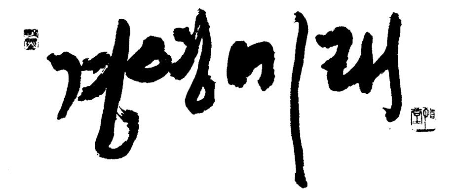

# 李明博自传 经营未来

李明博 著

● 人 人 ★ 版 社

{3}------------------------------------------------

总 策划:安荣洙

责任编辑:张振明

特约编辑: 金成烨 金珍镐 张静芳 金宗成 申宰明

题 字:金容新装帧设计:宁成春

### 图书在版编目(CIP)数据

经营未来: 李明博自传/李明博 著 马 俞 金宗成 译 - 北京: 人民出版社, 2008.2

ISBN 978-7-01-006871-8

I. 经… II. ①李… ②马… ③金… III. 李明博-自传IV. K833.126.7=6

中国版本图书馆 CIP 数据核字(2008)第 017315 号

### 经营未来:李明博自传 JINGYING WEILAI

李明博 著 马 俞 金宗成 译

出版发行: **人 メ 从 从** (100706 北京朝阳门内大街166号)

排 版: 1802 工作室排版

印 制: 北京瑞古冠中印刷厂

经 销:新华书店

印 次: 2008年2月第1版 2008年2月北京第1次印刷

开 本: 700mm × 1000mm 1/16

印 张: 16 字数: 120千字 印数: 10000

ISBN 978-7-01-006871-8 **定价**: 35.00 元

邮购地址:北京朝阳门内大街 166号 100706 人民东方图书销售中心

电话 (010)65250042 65289539

{4}------------------------------------------------

自小就有的梦想,一生都在我心中澎湃:

我喜欢冒险与挑战所带来的热情与振奋,我一直梦想社会安定、经济安乐以及透过文化而获得快乐的"幸福世界"。

我要成为"自己的主人"、"良心的主人"和"事业的主人"。

从一个清理垃圾卖苦力的工读学生,到敢于迎接挑战的学生 会主席,到军事政权的反抗者,到打工者,到职业经理人,到首尔 市长,到当选总统,是贫困教会了我善于学习、教会了我冷静地思 考人生和社会的意义,迫使我执意进取,直面挑战,勇于变革,更 让我懂得了把握未来、经营未来的重要。

人必有所守护,方能有所坚持。我贯彻一生要为国民幸福坚持 奋力拼搏,我愿意在任何危机、挑战面前,毅然迎上前去,我坚持 再苦、再难也要堂堂正正地做人。这是在经历了艰难的成长、求 学、事业开拓之后,珍藏于内心的一个坚定信念。

我感谢我的国民对我的信任和支持,也感谢我的读者们愿意 跟我分享我的快乐、信念和感受。你们是真正值得尊敬的。

{5}------------------------------------------------

很高兴此书由中国最权威的出版社 ——人民出版社出版,也 非常感谢参与此书编辑工作的所有中韩两国专家。愿此书能为中 韩两国的友谊做出贡献,也希望能给中国广大有抱负的年轻人一 个梦想。

再次对中韩两国国民和读者表示敬意!

李明博 2008年2月

{6}------------------------------------------------

# 目 录

| 第一章 | 乘着贫穷的翅膀 1                                    |
|-----|----------------------------------------------|
|     | 归乡之路 2                                       |
|     | 母亲的祈祷 1                                      |
|     | 妈妈,请让我上高中吧!9                                 |
|     | 为了上大学 12                                     |
|     | 乡巴佬竞选学生会主席5                                  |
|     | 避身21                                         |
|     | 蜕变23                                         |
| 第二章 |                                              |
| 第二章 | 在"现代"腾飞27                                    |
| 第二章 | 在"现代"腾飞                                      |
| 第二章 |                                              |
| 第二章 | 喝到月亮下山! 28                                   |
| 第二章 | 喝到月亮下山! 28 初生牛犊不怕虎 31                     |
| 第二章 | 喝到月亮下山! 28   初生牛犊不怕虎 31   曼谷"受审" 36          |
| 第二章 | 喝到月亮下山! 28   初生牛犊不怕虎 31   曼谷"受审" 36   推土机 39 |

{7}------------------------------------------------

| <del></del> |
|-------------|
|             |

| 第三章 | 暴风骤雨间55                |
|-----|------------------------|
|     | 密审                     |
|     | 一次无可奈何的惨败              |
| 第四章 | 海外攻坚战75                |
|     | <b>抢滩伊拉克</b> <i>76</i> |
|     | 撤离巴格达 81               |
|     | 马来西亚的启示86              |
|     | 菲律宾闹剧92                |
|     | 伏特加的滋味94               |
|     | 在勒拿河上                  |
|     | 走进克里姆林宫 102            |
| 第五章 | 从企业到政界109              |
|     | 轩然大波                   |
|     | 西归浦海边的决定               |
|     | 在"现代"的最后一天17           |
|     | 新的航程                   |

{8}------------------------------------------------

| 第六章 | 首尔 CEO 123 |
|-----|-----------------------|
|     | 新市厅计划・决断力 124         |
|     | 复原清溪川・促进力 127         |
|     | 公共交通改革・信任 141         |
|     | 汽车自律日制度・协商146         |
|     | 首尔广场・共享前景149          |
|     | 首尔林・共享时代精神154         |
|     | 重塑城市夜景・逆向思维157        |
|     | 创造首尔文化・摆脱固有观念 160     |
|     |                       |
| 第七章 | 挑战与革新165              |
|     | CC                    |
|     | 晚上去参观美术馆吧! 166        |
|     | 竞争力从哪里来? 173          |
|     | 节约 10%的预算 176         |
|     | 现在是专家时代 180           |
|     | 拥着反对者一同前进184          |
| 第八章 | 改变首尔的六大经营战略           |
|     | 一、效率——截住流出去的钱         |
|     | 转换思路能省钱               |

{9}------------------------------------------------

尾声

| 把税收当做自己的钱来用 <i>191</i>   |
|--------------------------|
| 二、品牌——营销"首尔株式会社" 193     |
| 用太极旗覆盖市政厅 193            |
| 改 "汉城" 为 "首尔" <i>197</i> |
| 三、可持续发展——开发与环境一举两得 201   |
| 从清溪川找到的城市竞争力201          |
| "开发和环境不冲突"2 <i>0</i> 3   |
| 四、行政韩流——出口秘诀207          |
| 出口到世界的首尔行政系统 207         |
| 值钱的行政、挣钱的行政212           |
| 五、平衡发展——南北一同前进214        |
| 促进新城市开发的理由214            |
| 现在是 "1 对 1"的开发时代217      |
| 六、协作——众人拾柴火焰高 219        |
| 市民和企业的参与219              |
| 吸引外资,实现双驘224             |
|                          |
| 尾声 给妈妈的信 240             |
|                          |
| 李明博小档案 243               |
|                          |
| 出版后记245                  |

{10}------------------------------------------------

母亲曾教育我:家贫志不贫,她是我最好的老师。

敢于挑战命运的人才有可能改变命运。不期待回报地帮助他人才是真正的高尚。

年轻人一定要勇于挑战,无论陷于何种绝境,

都要勇敢地挑战!

{11}------------------------------------------------

我在风中行走。

回望这六十多年,我从未走过舒适安逸的路。首先是因为生活 的时代环境,其次是个人性格所致。我不喜欢走安逸的捷径,我 喜欢冒险与挑战所带来的热情与振奋。另外,则是因为我一直无 法抛弃"幸福世界"的梦想。我相信,所谓幸福的世界,就是社会 安定、经济安乐以及透过文化而获得快乐。我之所以有这样的性 格与理想,或许都开端于早年如影随形的贫穷……

### 归乡之路

我是在日本出生的。1945年祖国解放后,父母带着大姐贵仙、 大哥相殷、二哥相得、二姐贵爱、妹妹贵粉和我坐上了回国的临 时客船。船上挤满了和我们一样心怀憧憬的韩国人。在那个动荡 的年代,好不容易保住性命、踏上归乡之路,心情是何等的喜悦 啊!谁知,船行至半途,在大麻岛触礁沉没。一家人虽然都被救

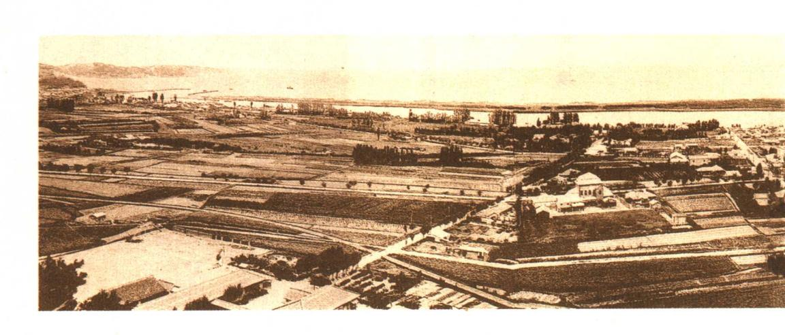

{12}------------------------------------------------

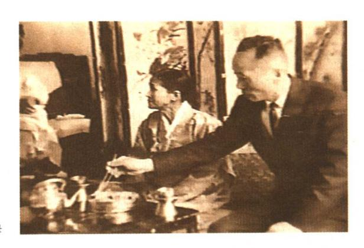

李明博父母

了上来,但父母在日本辛辛苦苦积攒的一点钱,连同仅有的几件 旧衣裳全都被水冲走了……就这样,我们两手空空回到祖国,等 待我们的是无边的贫苦。

回国那年我只有4岁,对故乡的最初记忆就是浦项市场街的贫 穷。贫穷像石花壳一样紧紧贴在我们家身上,到我二十多岁时还 无法摆脱。

我们的父亲出生在离浦项三十多里的庆尚北道迎日郡兴海面

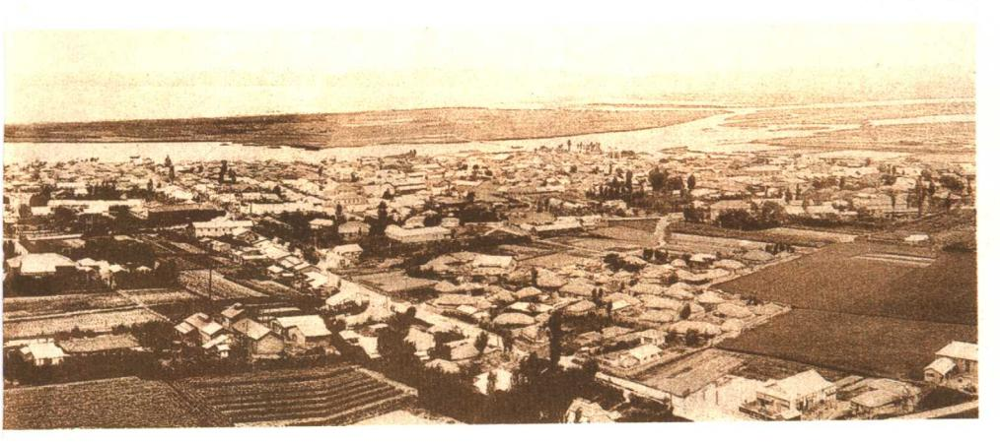

{13}------------------------------------------------

德城洞的一户农家, 是三兄弟中的老幺。家里的一小块地都分给 了两个哥哥, 因此父亲年轻时就离开了故乡, 到处流浪。在颠沛 流离的日子里,他学会了养猪和养牛的技术。

1935年,父亲和几位老乡一起去日本闯荡,在大阪附近的牧 场干活。每天天不亮就得起来挤牛奶、割牧草、喂家畜,靠着拼命 劳作和节俭,终于攒下了几个钱。在日本暂且安定之后,父亲临 时回国与母亲结婚。不久,他们便一起到了日本。

回国后,父亲在"6·25"事变之前找到了一份工作,在同志 商业高中财团理事长所有的牧场上干活。母亲则在浦项市场一个 偏僻的角落里卖水果。我从5岁起就是父母的小帮手了。

"6·25" 事变爆发时, 我还在上小学。那年, 母亲带着我们七 个孩子(弟弟相弼是父母回国后出生的)到兴海大伯家避难,父

20 世纪 40 年代浦项

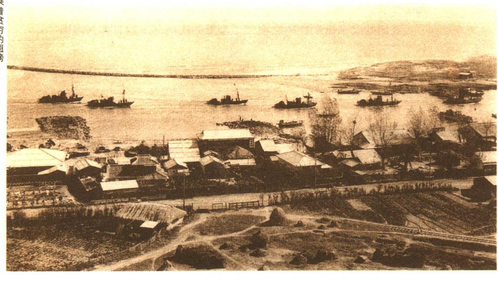

{14}------------------------------------------------

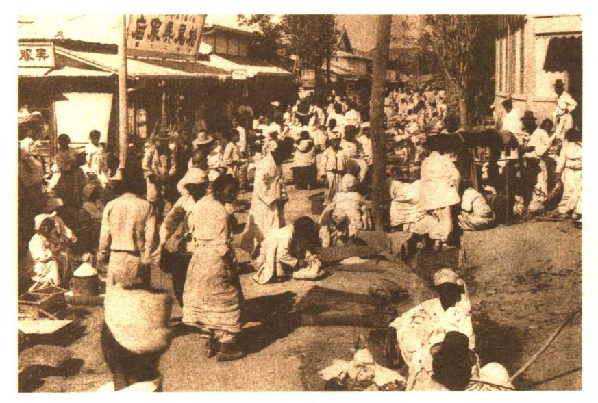

20世纪40年代浦项市场

亲则继续留在牧场上干活。我记得,那是一个炎热的上午,弟弟相弼哭闹个不停,姐姐贵爱就背着他在院子里玩耍。突然有飞机飞过的声音,紧接着屋顶上响起轰隆隆的爆炸声。不知道过了多久,可怕的声音终于停息了;可是,姐姐和弟弟呢?

家人惊恐地奔向院子,姐姐和弟弟倒在院子中央,额头、后背汩汩冒血,全身烧伤,惨不忍睹。

母亲几乎要昏厥过去。看两个孩子还有一口气,她疯了似的拼命往山上跑,采来草药敷在姐姐、弟弟身上。对于我们这样的穷人来说,买药是不可能的。但最终,姐姐和弟弟还是在痛苦中停止了呼吸。他们惨死的模样和母亲哀痛的神情,永远留在了我的记忆深处。从那以后,战争和南北分裂对我来说不再是抽象的概念。

父亲因战争失业后,我们一家人不得不搬到了山脚下的一座 寺庙。那座寺庙是以前日本人建的,大家都叫它"赤山寺庙"。15

{15}------------------------------------------------

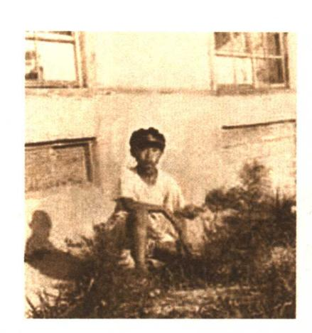

李明博孩童时期

学籍册上的李明博

个家庭挤在一间屋子里,连个生火的地方都没有。住在这里的当然都是穷困潦倒之人,从早到晚,打架的声音、喊饿的声音、临死的呻吟声不绝于耳,没有一天能睡好觉。每天我们全家人都得出去找吃的,但即使这样也很难填饱肚子。

那时候,我们家最主要的食物就是酒糟——粮食酿酒后剩下的 渣子。作为家里最小的儿子,我每天都要去酒厂买酒糟,而且一 定要买最便宜的那种,一天两顿都用酒糟充饥。因为酒精的原因, 我全身一直是红红的。日后到公司工作,我之所以能在酒席上"胜 人一筹",或许就是小时候吃酒糟练出来的吧。我把它看成贫穷留 给我的一种财富。

失去牧场工作的父亲后来在朋友的帮助下,开始做布料生意。这种买卖的"生财之道"全在量尺上。布料商告诉父亲:量布的时候要把尺子叠起来一点,最后再"大方地"让出一点送给顾客,如此这般才能赚钱。但是,父亲的秉性不容许他这么做。所有布料他都一寸不少地量给顾客,末了再免费赠送一点。父亲的这种即使在困境中也要凭良心做事的态度也在潜移默化地影响我。但是,

{16}------------------------------------------------

当时还在念小学的我,最切肤的感受还是贫穷的苦涩。午饭时间, 其他同学都在吃饭,而我只能拼命往肚子里灌水。水不能充饥的 感觉,没有经历过的人又如何体会得到?

当年父亲在日本牧场干活时,把大部分收入都寄给了故乡的 大伯,还把堂兄接到日本念书,回国后,我们家简直可以用"一 贫如洗"来形容,当然也没钱供我们上学。我经常因付不起学费 而被赶回家。我心里很清楚,回家也没有钱可以拿出来。于是每 次被赶出校门,我都会跑到后山打发时间,然后回到学校对老师 说:"再过几天,一定会把学费拿来的。"

到小学五六年级的时候,我已经算得上是个做买卖的"老手"了。卖火柴、卖寿司、卖年糕,样样都做过,有一次还被宪兵抓到狠狠打了一顿。课余时间为生计东奔西走,每天还要步行四个小时去上学,这样日复一日,我的身体终于累垮了。

初中三年级上半学期,我在病床上整整躺了四个月。因为没钱去医院,到现在也不知道究竟得的什么病,也许是营养不良吧。幸亏那时年轻,四个月后我又重新站了起来,依旧每天步行四个小时去上学。或许就是因为长身体的时候营养失调,我的个子在兄弟几个中间是最小的。父亲、大哥、二哥都有近一米八,唯独我只有一米七三。

### 母亲的祈祷

我的母亲是现大邱市半夜月蔡氏家的女儿,个子高高,瘦削的脸上长着一对黑亮的眼睛。母亲没上过几年学,但记忆力比谁都好。

我们一家人的生活是从每天清晨四点开始的。天还没亮, 母亲

{17}------------------------------------------------

就把我们兄弟姐妹五个全部叫起来,开始晨祷。母亲的祈祷很独特. 首先祈祷国泰民安,接着祈祷亲族安康,然后还要为村里各家的幸福祈祷,特别要为那些生病的、有烦心事的、家庭不和的邻居祈祷, 最后才轮到我们自己家的人。这时候,母亲会挨个儿说出我们的名字,而我总是排在最后一个,而且总是最短的一句话:

"祈求您让我们家老大凡事顺利,成为有出息的人……祈求您 让我们家老二考试取得好成绩,以后考上好的大学……我们的博, 希望他健康成长。"

这短短的一句祈祷直接反映了我在家里的位置。大哥从小心 灵手巧,很早就离家在外,做些小生意,二哥是我们家的"秀才", 在首尔埋头苦读。作为老幺的我只能留在浦项帮父母养家、给二 哥挣学费。

每天放学后,我就急急忙忙赶到市场,拖着疲惫的身体帮母亲 卖东西。最让我心烦的是,母亲经常命令我去帮邻居家干活,而 且一定不让我接受任何报酬。

"博,今天卖油家的大女儿出嫁,你赶紧去看看有什么可以帮 忙的。"

"又不是亲戚……"

"远亲不如近邻。还不快去!"

我只好不情不愿地朝邻居家碾过去。这时候,母亲又会在我后面喊:

"在人家那儿一口水也不许喝。人家给你吃的,你要是敢拿,看 我怎么收拾你!记住了吗?快点走!"

我一直到高中毕业都是很内向的孩子。要我一个人跑去帮忙,刚开始真的很难。我也不会打招呼,就一直在厨房周围转悠,帮忙打打水、递递东西什么的。看看忙得差不多了,就一个人悄悄地跑回家去。后来,我也渐渐地能说出"我来帮忙了"、"活干完了,我先回去了"之类的话。

{18}------------------------------------------------

说实话,比跟大人打招呼更难的是抵挡食物的诱惑。我很想在四周没人的时候偷偷吃上一口,可每次节骨眼儿上,母亲的喊叫声就会突然蹦出来……有时候,办婚宴的人家会包给我一些吃的,我心想,即使自己不吃,让哥哥妹妹们享受一顿也好啊。可一想起妈妈的叮嘱,终究没能伸出手。邻居家看我这样,会不满意地说:

"这孩子,吃我们家的东西会肚子痛么?"

如此经过几次之后,我渐渐明白了母亲的用意。不拿人家的东西,我便可以更加坦荡地去帮助别人。如果一个穷人天天企盼着有钱人的帮助,那他永远无法摆脱贫穷。母亲用她的言传身教,赐予了我和兄妹们克服贫穷的力量。

### 妈妈,请让我上高中吧!

在我即将从浦项中学毕业的时候,家里的处境更加困难了。大 哥已经参军,二哥从同志商业高中毕业后考上了一所免学费的陆 军军官学校,但因为身体原因退了学,只得重新准备考大学。我 知道家里根本没钱供我继续念高中,便把升学的念头抛在一边。但 是,我们的班主任却无论如何也不想放弃我。

毕业前,学校召开了升学讨论会。按照已往的情况,浦项中学的优秀毕业生都能进入庆北高中等名校。班主任认为,成绩一直名列全校第二的我肯定能考入好学校,因此让我的家长务必去一趟学校,商量我的升学问题。那时候,母亲刚开始卖红豆烤饼,从一大早忙到大半夜,根本没有时间来学校。在她看来,拼命赚钱为二哥筹学费是第一要紧的事。

但我还是抱着提一下的想法,向母亲传达了班主任的意思。母

{19}------------------------------------------------

亲默默地做着红豆烤饼,好一会儿,她看着远方对我说,

"咱们家这个情况,你是不可能上高中的。如果你二哥落榜了,你还可以去试一试。如果一定要上高中,那也只能上免学费的邮政高中。可你要是一走,谁帮我做这个生意啊?我一个人可忙不过来。"

虽然早知道结果,可听母亲这么一字一句说出来,泪水还是忍 不住在眼眶里打转。

班主任知道我家的情况后,又给我出了一个主意:

"你不上高中的话,真是太可惜了……对了,浦项同志商业高中有个夜校。你可以白天帮家里干活,晚上再去念书。你现在还小,可能不知道,以后要找工作的话,高中毕业证可比初中毕业证有用多了。"

我满怀期望地跟母亲说了班主任的建议,可母亲还是不同意。

"你得帮我做生意,帮哥哥挣学费。生意做得好,也一样可以 过上好日子。再说,上夜校也是要钱的,我们家可实在拿不出你 的学费啊。"

好心的班主任还在执著地跟母亲进行"攻防持久战"。两边传 话的我也累得够呛。

"全部课程都拿第一的学生可以免学费,我相信明博可以做到。"

终于, 班主任的最后一个提议被母亲接受了。

"这样的话,咱们做个约定好了。我同意你去上夜校,但前提 是不用家里出学费。只能靠你自己努力了。"

因为这个约定,我一直读到了高中毕业。三年夜校,我每门课 的成绩都是第一名。

上高中后,我开始随着季节变化做买卖:春天卖麦芽糖,夏天卖冰棍儿,冬天卖爆米花儿。

不管晴天下雨,我总穿着同一件校服,因为穿得出门的衣服就

{20}------------------------------------------------

这么一件。我做买卖的那条街上总有许多女校学生来来往往,我的破旧校服、脏兮兮的脸、低着头傻乎乎的样子都成了她们取笑的对象。我不停地对自己说要泰然处之,但强烈的自尊心,加上内向的性格、青春期的焦虑,我又如何能做到泰然处之?

思来想去, 只好拿顶草帽一遮了事。

到高二时,我决定尝试着做水果生意,一来赚钱比较多,二来也可以躲避那些女生的异样眼光。我白天去市场进水果,晚上放学后推到热闹的剧院门口去卖。刚开始颇有些紧张。我把水果擦得亮亮的,还准备了一盏炭化灯。有一天夜里下着雨,路上行人不多。我正巴巴地盯着剧院门口,盼望电影散场后能有人光顾我的水果摊,突然,有辆小汽车在倒车时撞倒了我的推车,车上的水果咕噜噜撒了一地,几个西瓜都摔烂了。我连忙冲出去捡我的水果,这时,一个声音冲我骂了起来:

"喂,臭小子,推车就好好推,干吗停在中间挡道? 你以为这路是你们家的吗?"

我一时慌了神,赶紧向他道歉,可等到那车开走以后,我突然觉得很愤怒。其实我做错什么了呢?这样被人欺负,感觉真窝囊。想到贫穷带来的屈辱,悲伤、委屈、愤怒一股脑儿涌上心头。

"这么活着有什么意思?就算高中毕业又能怎样?干脆离开这个鬼地方算了!"

这么恨恨地想着,掏出口袋里的钱数了数,足够去首尔的路费了。我偷偷擦干眼泪,走进了路边的小吃铺,想在出发前喝点酒。

- "大婶,给我一瓶烧酒,一碟小菜!"我大声喊道。
- "今天这孩子怎么了?"
- 一向看我很乖的大婶吃了一惊。
- "快点上酒啊,怎么这么多话!给你钱就是了。"

我开始发脾气,可大婶还是磨磨蹭蹭地没给我拿酒。就在等 待的几秒钟里,我突然想起一件事: 

{21}------------------------------------------------

"卖了这么长时间的水果, 还没有让妈妈尝过我的水果呢,"

每次我从市场进水果回来,母亲总是一边擦着水果,一边说: "这些水果真漂亮啊,一看就知道很好吃。"但是,把这些都视为 独立财产的我,抱着即使一分钱也要节约的心,总是假装没有听 见母亲的话。

"是啊,又不是非要今天走。水果虽然撞烂了,但还是可以让 妈妈好好吃个够。那就明天再走吧,晚一天也没关系。"

这么打定了主意, 我把水果重新装上车, 推回了家。

"爸,妈,今天吃点水果吧,剩了很多呢。"

母亲看见被撞歪的拖车和摔碎的西瓜,还有我夸张的喊声,大约知道了发生的事情。她一句话也没说,转身进了被窝。那天夜里我躺在睡铺上,满脑子想的都是离家出走。

第二天清晨,母亲照例开始祈祷,但那一天,她给我的祈祷格 外地长、似乎她也一夜没睡好。

"祈求上帝为我们家明博指引一条光明的路,让他健康成长, 让他做每一件事都顺顺利利……"

母亲的祈祷撞击着我的心。"原来,母亲是这样地关心着我啊!"感激的心情促使我将离家出走的计划又推迟了一个月。这样反复几次之后,我又恢复成了原先那个穿着校服、卖水果的我。

## 为了上大学……

我高中三年级的时候,母亲作出了一个重要决定: 搬去首尔照顾二哥。我和妹妹因为要读高中,只能暂时留在浦项。父母为了筹措在首尔的生活费,把房子和做买卖的用具都卖了,只给我和妹妹准备了一间很小的房间。我们俩一边读书,一边还要想办法

{22}------------------------------------------------

养活自己。父母每个月寄来的伙食费根本不够我们吃饱的,天天喝稀粥也很难维持一个月。妹妹实在饿得受不了,就央求我:"哥哥,咱们哪怕前十天吃个饱,后二十天饿肚子也行啊。"但我知道如果那样做,我们俩一定会饿死。我找来30个纸袋子,把一个月的粮食分成30份,一天就拿出一份,让妹妹去煮粥。直到现在,妹妹见到我还总是苦笑着说:"哥哥当时真残酷,我差点离家出走。"

1959年12月,我和妹妹终于踏上了开往首尔的火车。一路上,我心里有种说不出的孤独与迷惘。离开了艰难生活了14年的浦项,从今往后,陌生的首尔又将抛予我怎样的面貌?父母似乎还没有在首尔安定下来,贫穷也必然纠缠不休。但是,我心里总还期待着首尔能有和浦项不一样的东西在等待着我。

父母在梨泰院的棚户区租了一间小屋子,每天到市场上卖蔬菜,和在浦项时没什么两样。我那时没本钱做买卖,倒是难得地清闲起来。我曾经坐着电车,从始发站坐到终点站,再从终点站坐到始发站。不知不觉间,我会走到东崇洞、安岩洞、新村这些大学街。看到穿着校服的大学生们来来往往,我的心里忍不住一阵难过。唉,连饭都吃不饱,跑来这里干什么?

有一天,我突然产生了一个奇怪的念头:"中学时班主任曾经说过,高中毕业证比初中毕业证有用,那么,大学中途退学的话一定比高中毕业证还强些吧。要不我就考一次试试,如果考取了大学,不就算是大学中退了么?"

在这个堂吉诃德式想法的鼓动下,我竟然真的着手准备考大学了。我报考了高丽大学商学院。考试日期迫在眉睫,我一边利用有限的时间拼命复习,一边还要到市场上帮父母干活。他们不 拦着我参加考试,我已经很感激了。

离考试还有一个月时,我开始熬夜复习,用当时流行的安眠 药来调节睡眠。但在临考试的前三天,我终于还是病倒了。考试 那天,我勉强爬起来进了考场。不管考取与否,能够参加大学考

{23}------------------------------------------------

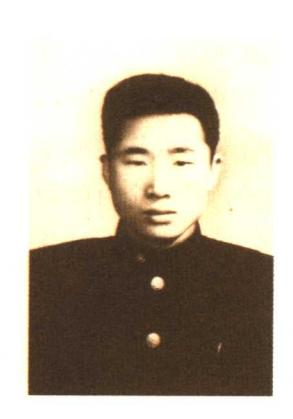

《高大新闻》刊载的新生入学名单,李明博在"经营学科"名单中

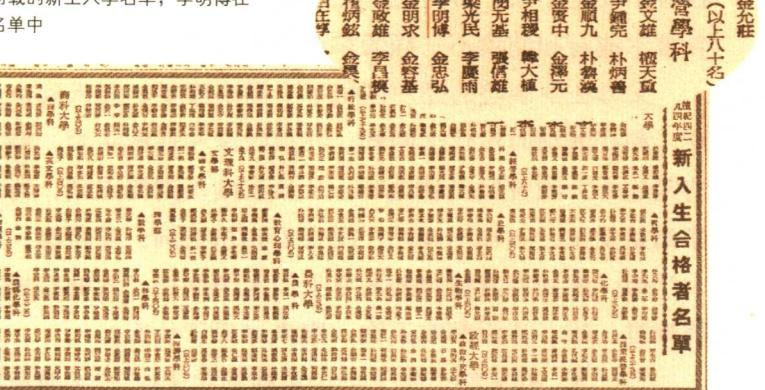

试,我就已经心满意足了。

但是,我竟然考取了。我的大学梦实现了。我成了大学中退 生了。

还没高兴多久,我就被迎面泼了一盆冷水。

"至少要上一个学期才能算大学中退啊,光是考试合格、没注 册是没有用的。"

这下糟了,我去哪里找入学的费用呢?这可比考试难多了。就 在我想放弃的时候,梨泰院市场的人们帮我安排了一个工作:凌 

{24}------------------------------------------------

晨清理垃圾。只要肯卖力地干活,交学费是没有问题的。

于是,每天天未亮我就开始忙活起来,把装得满满的垃圾搬 到推车上,经过三角地、解放村、普光洞的岔路口,再从美军营 地的右侧绕过去,把垃圾倒在指定的空地上。每天我要往返六次, 上坡时累得气喘吁吁, 下坡时则更吃力, 也更危险。

本来只打算挣够第一学期的学费、没想到靠着这份卖苦力的 工作, 我顺利读到了大学三年级。

### 乡巴佬竞选学生会主席

在我上大三的时候, 二哥从首尔大学毕业进了科隆 (kolon) 公司,我们家的生活境况渐渐有了好转,但当时的社会局面却动 荡不安。

为反抗军事政权的高压统治而掀起的民主化热潮把矛头对准 了屈辱的"韩日会谈", 反对"韩日会谈"的运动最终演变为了反 对专制统治的运动。在"4·19"●时还处于非组织状态的学生运 ● 1960年 动、此时已经有了一定的组织性、同学们的凝聚力也增强了。学 后,发生学 生们的批判精神正在高涨时,各所大学的学生会主席选举活动也 进行的反政 如火如荼地开展起来。

有一天,当我跟几个老乡说、我想参加商学院学生会主席的 竞选时,他们简直不敢相信自己的耳朵:

"什么?你小子不是喝醉了吧?说什么胡话呢?"

是啊,我这个一向寡言少语、连朋友也没有几个的乡巴佬,怎 么会想到要去竞选学生会主席呢?

上大学的这两年, 我每天都在为生存和学费而奔波, 但即便 如此,大学生活还是开阔了我的视野。我开始关注民族、民主、国

4月19日前 生联合市民 府斗争,其 结果是李承 晚总统下野, 当时的执政 党没落。

—译注

{25}------------------------------------------------

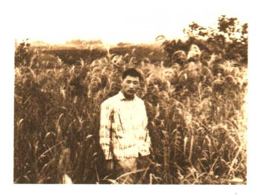

在芦丛里

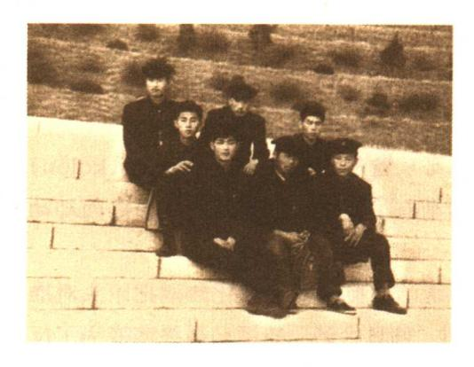

高丽大学期间

家繁荣这些问题,开始把注意力从个人生活的现实问题转向外部世界。对我生活的这个贫穷、落后的祖国,我能做些什么呢?

当时,我并不太赞成学生运动的开展方式。我发现,除了几名主要的组织者之外,大多数学生只是随波逐流地参加示威游行。虽然我是学生,但我很早就在社会上摸爬滚打,在为生存而苦苦挣扎中体味着人生,因此我比其他同学更能客观地正视学生运动。大学如果照这样发展下去,学校将不成其为学校,学生也将不成其为学生。而且有的时候,学生示威游行还会成为街边失业者、流浪者发泄的导火索。看着闹哄哄的学校,我心里真不是滋味。

{26}------------------------------------------------

高丽大学期间

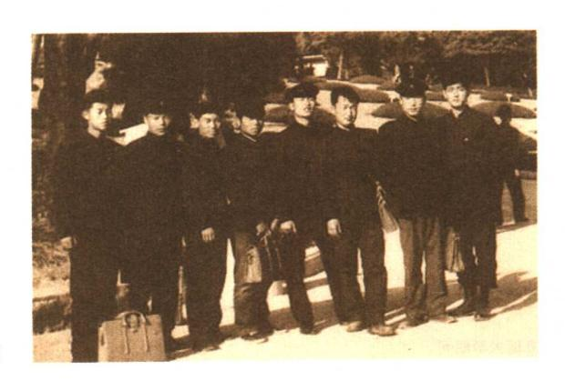

高丽大学期间

另外,我也想抓住这次机会改变自己怯懦的性格,我想把自己塑造成一个积极的人,早日走向更广阔的世界。

我并没有什么胜算,有时候甚至觉得自己必输无疑,但对我来说,落选和当选同样有意义,即使落选我也可以让很多人知道我的存在、了解我的想法。今日的李明博已不是过去的李明博,不再是那个低着头、要用草帽遮脸的李明博,不再是为了摔烂的西瓜而要离家出走的李明博……我把这次竞选看做我人生的一个重大转折点。

然而我虽有一腔热情,我的清贫背景却再一次使我四处碰壁。 虽然是校内竞选,但和社会竞选也没多大的不同。候选人的知名 

{27}------------------------------------------------

度、领导才能,以及更为重要的组织和资金,这四个条件,我似乎一个都不具备。

不管阻力有多大,我还是义无反顾地投入了竞选活动。那次共有两名候选人,我这个商高夜校出身的乡巴佬,人气自然低得可怜。尤其是同届的大三学生,对我的反应极其冷淡,倒是一二年级的学生在听了我的演说后开始支持我。

我的竞争对手可以租辆公共汽车带大家参观板门店,而我这 个连一杯米酒都请不起的穷学生,唯有真诚而已。

"我没有能力那么慷慨,但如果我当选的话,我首先将为学校和学生找到自己应有的位置而努力,让渴望学习的人获得一个好的学习环境。"

在投票的前两天,一开始对我不屑一顾的竞争对手派来了一位"说客",就是先前劝我不要"痴人发梦"的几位老乡中的一位。

"放弃吧,明博。他说可以把选举费用补偿给你。明博啊,你

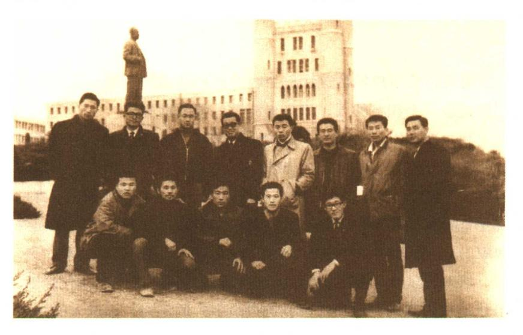

{28}------------------------------------------------

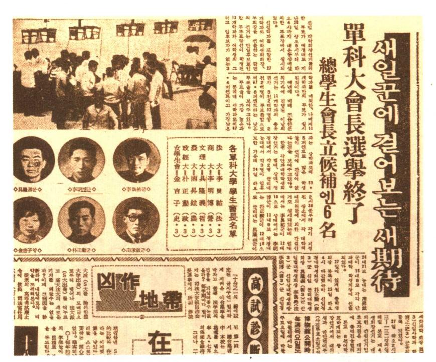

《高大新闻》刊载的大学学生会主席选举新闻,李明博在主席名单中

是不会当选的。"

"我没想过我能当选。"

"那你为什么还要坚持到底?你已经证明了你的存在,现在拿了钱退出是最明智的选择!"

我没有妥协。我既没有花什么钱,也没什么钱可花,自然也 不会要他的什么补偿金。

投票结束后,我心情轻松地等待着开票。我不仅完成了竞选, 还抵制住了"黑色诱惑",这已经是道德上的胜利了。即使落选, 也毫无遗憾。

然而出人意料的是,我竟然以40票的微弱优势当选了! 我成了一个敢于迎接挑战的学生会主席。

我的人生转折就这样开始了。

{29}------------------------------------------------

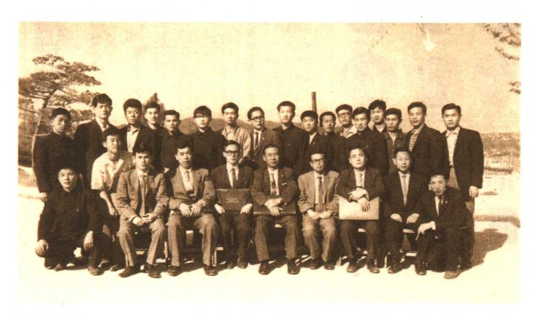

高丽大学期间

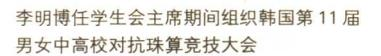

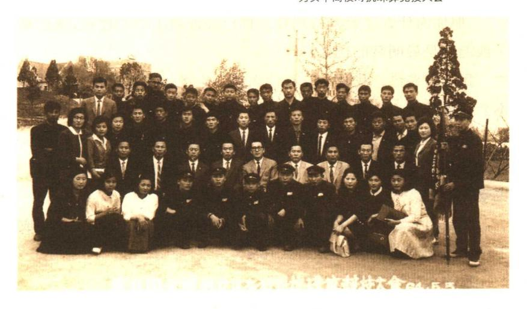

{30}------------------------------------------------

### 避身

1964年我大四的时候,学生运动达到了高潮。军事政权为了 筹集他们在革命公约中承诺的经济建设资金,开始运作从李承晚 总统当权时就着手进行的韩日邦交正常化。在反日情绪普遍蔓延 的情况下,军事政权秘密操作此事,更是引起了国民极大的怀疑 与反对。在野党和社会团体组成"反对对日屈辱外交泛国民斗争 委员会",在全国各地广泛开展活动;而与此同时,政府却全然不 顾各方反对,继续运作与日谈判。

3月24日,首尔大学组织市内5000名大学生参加示威游行, 受到军事政权严厉压制,发生了流血事件,其影响波及全国。此 后三个月,各种示威活动此起彼伏,活动性质也逐渐发生了变化, 由"反对对日屈辱外交",转变为"打倒军事政权"。

在这如火如荼的斗争声浪中,我们高丽大学却因总学生会主席态度消极而难以施展拳脚。各院系学生会主席深感苦恼,大家聚在一起研究对策,最后推举我和法学院学生会主席李炅祐代理行使总学生会主席职权。

我认为,我们的示威活动对谈判桌前的韩国代表来说,并不是一件坏事。虽然大家认为派毫无政治经验的军人参加谈判是不妥当的,但事已如此,政府不妨利用国内激烈反对的声音,在谈判中争取更大的成果。后来,我作为学生代表曾向政府高层提出这一想法,但毫无结果。

在这种情况下,我们计划于1964年6月3日正午进行大规模的反对韩日会谈示威活动。为了避开当局监察,整个计划的制订与布置都是秘密进行的。我作为代总学生会主席,是这一活动的

{31}------------------------------------------------

核心人物。按照计划,首尔市内 12000 名学生发起了轰轰烈烈的 示威活动。当晚 8 点,政府发布了全市非常戒严令,宣布首尔大 学的金重泰、玄胜一、金道铉与高丽大学的李明博、李炅祐、朴 正勋为此次活动带头人,并下达了逮捕令。

从此,我开始了暗淡的逃亡生活。

下达戒严令之前,警察开始在市内进行大规模搜捕。我偷偷地给二哥打了电话,他让我去釜山找他的一个朋友。一路上担惊受怕,坐一段火车,感觉不妙就赶紧跳下来,东躲西藏,好不容易到了釜山,找到了二哥的朋友。但是在那里也没有住多久,因为当局有令,藏匿通缉犯将受到严惩。我不想给别人添麻烦,身上又一文不名,步履沉重地走出去,却见大街上贴满了通缉令,我的照片居然和一群凶犯列在一起。我觉得冤枉极了,我到底做错了什么?

思考再三, 我给二哥打去了电话:

"我自己去找他们,但不是自首。"

"据说自首可以减刑,市警察局有一个我认识的老乡,你去找 他吧。"

"二哥,我不能自首,我犯了什么罪?我找上门去只是表示我 不怕他们。"

"好,你想得对,但你当心不要在路上被他们抓到。"

回首尔的路比去釜山的路更艰难。辗转曲折,我见到了那个 老乡,然后"出现"在市警察局。后来我才知道,那个老乡检举 了我,为此还领了一笔赏金。

到了警察局,我惊讶地发现,我们"6·3"示威游行的拟定地点以及参与者名单他们都了如指掌。后来才知道,学生会干部中有人向中央情报局告了密。10年后听说,那人成了中央情报局的要员。

{32}------------------------------------------------

### 蜕变

我在戒严司令部受到盘问。为了要我交代他们需要的情况, 他们用各种方法胁迫我,用得最多的是不让我睡觉。

"小子,我们可以把你塞进冷冻室,也可以把你扔进海里,如果你不想'意外死亡',最好乖乖交代!"

我始终咬紧牙关。我得遵守诺言。

审判时我们被转到了地方法庭。出庭时,在野党的政界人士 以及宗教界、法律界、文化界人士,还有学生都给予了我们坚定 的支持。我们仿佛成了英雄。

最终,和其他"主谋者"差不多,我被判处5年有期徒刑,关 押在西大门监狱。我所在的牢房里有杀人犯、强奸犯、诈骗犯等等, 平时这些人都以讲述自己的"传奇故事"打发时间。学生罪犯则把 监狱当做另外一片斗争天地开展绝食运动。进行反专制斗争的人也 想通过把我们捧成英雄来突破当时的斗争困境。但说实话,我始终 觉得我们所做的一切,与那些独立斗士、爱国志士相比,根本算不

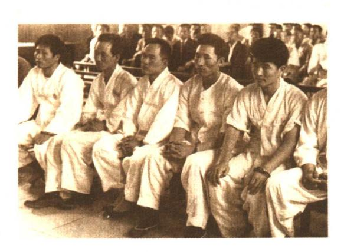

"6・3" 事件审判

{33}------------------------------------------------

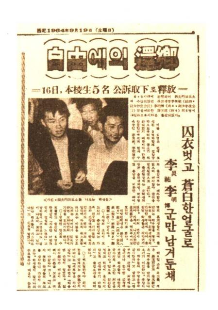

《高大新闻》报道的有关 "6·3" 事件新闻

了什么。这只是年轻一代应当为国家所尽的义务,不能将其夸大为 英雄主义。

我突然明白了自己在狱中应该做些什么:作为学生,我要把 这段时间落下的功课补回来。我一边拼命读书,一边开始冷静地 思考人生和社会的意义。

西大门的监狱生活从1964年6月末开始,于10月末结束。法院改判我3年有期徒刑,缓期5年执行。如今回头看,这段生活对我而言,不啻为一种幸运。我在监狱中学会了乐观。在那以前,我一直以为自己生活在社会最底层、经历过无可比拟的绝望。但是在狱中,我懂得了所谓悲观与乐观都是相对的。在监狱外的人看来,被囚禁之人都是极端悲惨的,但对死刑犯而言,只要活着就是莫大的幸福。艰苦的狱中生活还让我领悟到了人身上潜在的超强的适应能力。刚开始,每天早上分到的水连湿手都不够;一个月后,用那点水完全可以洗手、洗脸。

{34}------------------------------------------------

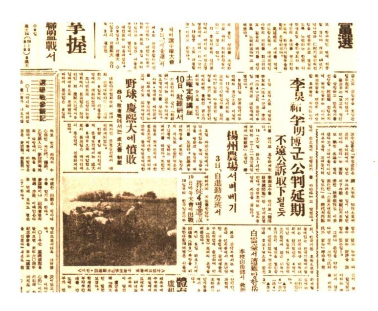

从当选学生会主席,到逃亡、坐牢,这一年的经历让我从幼 虫蜕变成了长着翅膀的成虫!

出狱后, 我发现自己一下子成了名人。

有一天,我突然收到从外婆家寄来的一箱苹果。箱子上的收件人地址让我永远难忘:

"首尔市龙山区,李明博收"

因为穷困,我们几乎和外婆家没什么联系。怎么突然出现这么一箱苹果呢?后来才知道,在看到我被释放的报道后,外婆她们想寄些苹果来慰问,可又不知道详细地址,只大约记得我们在首尔龙山的某个地方。这箱地址不详的苹果居然能顺利到达我家,可见我当时多么有名了。

但这时, 母亲的身体因过度操劳, 完全垮了。

从日本回来后的二十多年里,母亲没有睡过一天安稳觉,身 体自然每况愈下。我在监狱的时候,母亲来探望过我一次。我一

{35}------------------------------------------------

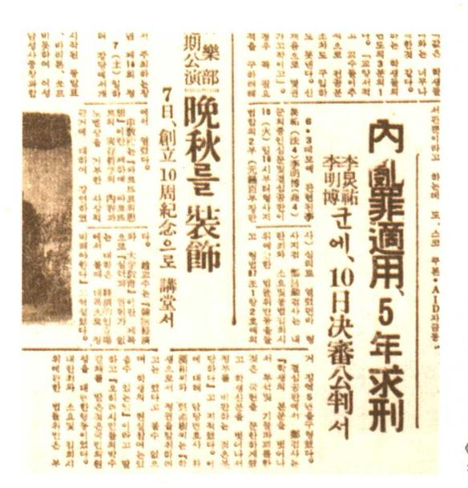

《高大新闻》报道的 有关"6·3"事件新闻

看到母亲就知道她病得不轻,可她却努力装出不要紧的样子。那天,母亲直视着我的眼睛,说:

"明博,我一直以为你是个不起眼的小东西,现在才发现,你才是真正了不起的家伙。你的想法是对的,以后就按照自己的信念去做吧,我会为你祈祷的。"

这是母亲第一次, 也是最后一次肯定我。

等到我出狱的时候,母亲已经卧床不起。那年的12月15日,母亲永远地离开了我们。

父亲在京畿道利川度过了他的余生。大哥为父亲准备了一个小农场,父亲一到农场就把母亲移葬过去,并亲自为母亲立了碑铭:

"你千辛万苦把孩子们拉扯大,却没能看到孩子们成功,留下 我一人享尽天伦,实在让我惭愧。"

父亲是在1981年我当现代建设社长的时候去世的。和母亲一样,都是在12月。

{36}------------------------------------------------

年轻意味着什么?意味着即使失败 ,也随时可以再挑战!

好的习惯创造好的机会,反之,坏的习惯造成困境与危机。 对于年轻人来说,工作就是最好的福利。

不要管别人,热情地去工作吧!

57 mb

{37}------------------------------------------------

### 喝到月亮下山!

大学毕业后,"内乱煽动罪"的前科就像一双无形的手,紧紧抓住我不放。我不但行动不自由,而且也找不到工作。

我一连去了好几家公司应聘,每到第二次笔试或面试,就再也没有下文了。有一天,偶然在一张报纸的角落里看到一则广告——"招聘出国工作人员"。我像触电般地被"出国"两个字吸引住了。在当时,只有极少数公费留学生和政府管理人员才有机会到国外去。在60年代令人窒息的政治气氛中,出国对于像我这样的年轻人来说无疑是一个富有吸引力的选择。

我仔细地阅读那则招聘广告,原来是一家名叫"现代建设"的 公司在为其泰国工地招聘现场工作人员。

1965年5月,我向当时还只是中小规模的现代建设递交了求职书。第一轮笔试感觉还不错。忐忑不安地等了一个多星期后,我收到了一封"人事部长邀请面谈"的电报。如果笔试合格,只要通知我面试的时间和地点不就行了吗?为什么要和人事部长面谈?我有一种不好的预感。

现代建设的人事部长拿起我的档案,面露难色地说:

"你的笔试成绩很好……不过有学生运动的前科啊……现在上 头还不知道,可我们得马上报告。你能想想什么办法吗?"

我能有什么办法呢,连个诉苦的人都没有。

思来想去,我决定来个正面对决。回到家我就写了封信,收信 人是当时的总统朴正熙。我在信上如实写下自己的"前科",阐述 了学生运动的纯洁性与爱国热情,然后强烈批评当局阻止个人走 向社会的做法。 

{38}------------------------------------------------

几天后,青瓦台负责民政 事务的李洛善先生联系了我:

"对挑战国家体制的人进行惩罚,这不是理所当然的吗?另外也是要给那些企图搞学生运动的人敲个警钟,所以这是没有办法的事情。"

过一会儿,他又试探性地问我:

"你有没有想过在国营企业工作,或者出国留学?我愿意帮你努把力。"

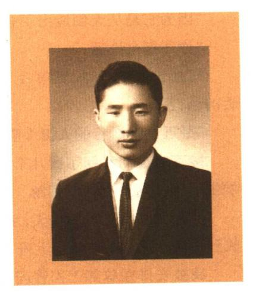

年轻时期的李明博

我断然回绝说,没有此类念头。离开前我扔给他一句话:"如果国家阻挡了一个人自力更生的道路,那么国家将永远亏欠于他。"

这句话,其实我说过就忘了。很多年之后,在我担任现代建设公司社长的时候,我又见到了那位时任国税厅厅长的李先生。他对我说:"当时你说的那句话对我触动很大,所以后来我又重新召开高层会议,决定以只干工作为条件,同意你进入现代公司。"

现在回想起来,那句话实在唐突,但我从心底里感激认真对 待那句话的李先生。

几经周折,我终于在1965年6月参加了面试。那次的面试官 共有6名,包括郑周永社长、李春林常务、权奇泰理事等。郑社长 穿着印有"现代建设"的工作服坐在中央。

我报了自己的名字,郑社长把目光从我的履历书移到我脸上。

- "你认为,建设是什么?"
- "我认为是创造!"
- "怎么说?"

{39}------------------------------------------------

"因为它是从无创造出了有。"

"你还挺会说话。"

郑社长微微一笑,但随后,他对身旁的人说了一句令我瞠目结 舌的话:

"最近油嘴滑舌的人挺多啊!"

接下来他们又问了我几个问题,可以看出那些面试官对我的学生运动"前科"有所了解,但却只字不提。

等待面试结果的那几天,我简直如坐针毡。一个星期后,终于 收到"请于7月1日开始上班"的录取通知书。

我被安排在总部工程管理部,在那里工作了3个月。进公司后不久,我就发现企业组织存在着严重的官僚化现象。最具代表性的就是过了下班时间,职员们还得看上司的脸色,继续忍耐着坐在椅子上。这在当时是极为普遍的事情,但我实在觉得忍无可忍。于是,我对职员们进行问卷调查,收集了一些对于官僚化组织的意见,职员们几乎是一边倒地要求改善这一状况。最后,我将调查结果向上级做了报告。作为一个"身份敏感"的新职员,我不怕引火上身,我更看重的是企业的利益。

在那次面试之后,我在新职员研修会上第二次见到了郑周永 社长。新职员研修会其实就是一个"通过仪式",公司新人可以借 由这个平台,和企业主面对面沟通交流。那次我们玩得很尽兴,郑 社长也和我们一起打球、摔跤、喝酒,一直坚持到最后一夜的篝 火晚会。

"来,咱们今天喝到月亮下山!"

郑社长高举酒杯提议,众人围坐一圈其乐融融。几轮喝下来, 一些人已经醉得不省人事。最后只剩下四个人:郑社长、我和后 来到关岛管理工程的李谋,以及一位土建工程师。

"男子汉的胸怀应该比大海更加宽广!"

郑社长的声音还是那么清朗。土建工程师终于倒下了。过了一

{40}------------------------------------------------

会儿,郑社长站起身来,说:"我先回去了,你们继续喝吧。"

只剩下我和李谋了,他没有再喝酒。为了遵守喝到月亮下山的 约定,我一个人继续举杯不放。

### 初生牛犊不怕虎

10 月初,我第一次担任了镇海第四肥料建设工程的工地出纳。 工长是一位资历颇高的技术员,和那个年代的大多数技术员一样, 他没有在大学接受过系统教育,但从日本侵略时期就开始积累了 丰富经验。作为不折不扣的"工地型"人物,他特别不喜欢"乳臭 未干的书呆子",当然我也被包括在内。

给职员预支款是我作为出纳的主要工作之一。职员们通常都在下午5点之后找我预支。他们忙了一天,下班后才想起到我这儿来,我自然是尽我所能给予方便。但这种做法却引起了工长的不满。

"喂,5点以后还给什么预支啊?你见过哪家银行在5点以后给钱的吗?"

真是不可理喻,银行是银行,工地是工地。难道让忙得焦头烂额的技术员们在工作时间放下手里的活,到我这里来排队吗?心里虽这么想,但我不能反对,因为工长的话符合原则。

几天后的一个下午,工长找我来预支,但当时已经过了5点。 "不行!"

"什么?"

工长瞪大了眼睛。这个毛头小子竟敢公然违抗工长的命令。

"没时间跟你开玩笑,快给我,有急用!"

"5点以后是禁止现金支出的。"

{41}------------------------------------------------

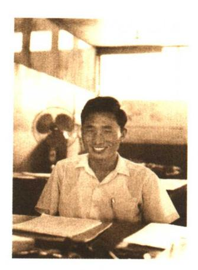

在泰国

"我知道,但我是工长!"

"正因为您是工长,如果您把自己定的规矩打破了,我想以后就不会有人再遵守了。所以,现在绝对不能预支!"

"你是不是疯了?太不像话了!小子,这是办公事用的,是非常紧要的事情,明白吗?"

"遵守公司纪律也是很紧要的事情!"

"是吗?呼……天啊!"

工长无可奈何地走了。在那之后,我时刻准备着接受工长的报复,但情况却出乎我的意料。后来每次我去银行办事,工长都会用他的车送我去,然后再去办他自己的事。他似乎反而更看重我了。

有一天,他突然对我说了这么一句话:

"李先生, 你将来肯定会成为公司的大人物。"

12月初,公司突然通知我,要派我去泰国工地。镇海工地对 我来说是一所大学校,当时国内的建筑企业对使用整套设备的工 程毫无经验,不仅是我,现场所有人员都在犯错、改正的反复施 行中摸索着前进的道路。这时候派我去海外,无疑是对我这段时

{42}------------------------------------------------

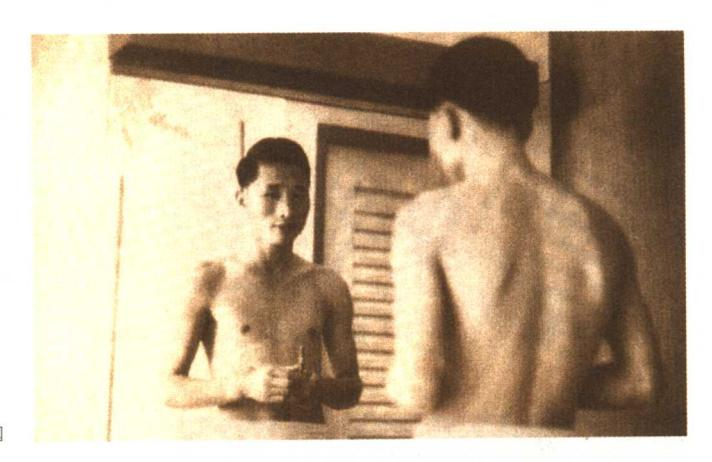

在泰国

间工作的肯定。

我将参与的芭迪雅-那拉迪瓦高速公路建设工程是韩国建筑 史上的第一项海外工程。这是连接位于泰国南部、马来西亚边境 的两个城市的第二条公路,全长98公里,于1965年9月30日开 始国际竞标。现代建设与西德、日本、法国、意大利、荷兰等16 个国家的29家公司展开竞争,最终以最低成交价拿下了这项工程。 当时的成交价为522万美元,比现代建设一年的销售额还要多。

这项工程意义重大。当时连大企业都不敢做的事,竟然由"现代"这个名不见经传的中小企业做起来了。正是因为有这样的开拓精神,"现代"才会发展到如今的规模。

泰国工地的指挥部比首尔的公司总部还要庞大。我是现场最基层的出纳人员,上面有经理科长,再上面有管理部长。整个工程于1966年1月7日正式动工,但进展得很不顺利。当时在韩国,连"高速公路"这个词都比较陌生,建设装备、技术人员都是捉襟见肘。美国人看到我们从国内运来的旧设备后直摇头:"你们要是能在5年内完成这个项目,我们把姓都改了。"

为了节省劳务费,我们用了很多泰国工人,但由于语言不通和

{43}------------------------------------------------

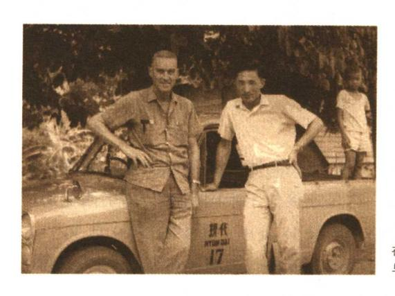

与监督长官在一起

管理不善,摩擦、冲突时有发生。第一年投入了工程预算的70%, 但工程进度只完成了30%。颜面尽失还是次要问题,最重要的是公 司面临存亡危机。

工地内部矛盾达到白热化的那天晚上, 我正在办公室里整理 账簿, 当时屋里还有公司雇用的两个泰国经理人员。

突然,外面一阵嘈杂,我身旁的泰国经理往窗外一看,急忙对 我说:

"李先生,快跑吧!"

原来是从韩国来的工人在闹事。他们挥舞着军用短刀,把现场 搞得一片狼藉。干部们闻风而逃, 现场只剩下我一个不是暴徒的 

{44}------------------------------------------------

韩国人,泰国人留下的居然更多。

那些暴徒好像把我的办公室当成了最终目标,一阵大吼大叫 地冲了过来。两位泰国经理只好躲开,办公室里只剩下我一个人。

"嘭"地一声,办公室的门被撞开了,一股浓烈的酒味扑面而来。我一看,大约有15个人,手持刀棍,喘着粗气。突然,其中一个人猛地把短刀扎在我办公桌上。

- "趁老子心情好, 乖乖地把保险柜钥匙交出来。"
- "不交!"
- "你想死啊?"

看那架势,好像要用刀刺我的脸,我后退几步,把身体紧靠在墙上。

"不肯交钥匙?看你能撑多久!"

短刀刺向我脖子左边,我下意识地把头往右边一转,眼前一片漆黑。接着,刀又刺向右边,我赶紧把头转向左边。

一脚伸进了鬼门关,我突然想,把钥匙给他们算了。其实保险柜里只有一点零钱,而且在这种情况下即使我交出钥匙也没有人会说什么。但最终,我还是没有把钥匙交给他们。这不是出于什么使命感,只是因为我不愿屈服的本能!

"不交钥匙也行,帮我们把保险柜打开就行!"

他们看短刀的威胁不起作用,就指着保险柜让我打开。我朝保 险柜挪了两三步,然后猛地把保险柜抱在胸口。

- "兄弟们,揍他!"
- 一阵拳打脚踢……

我感觉浑身冒火似地疼痛,但还是死死地抱住保险柜。

这时,耳畔传来警车的鸣叫声,暴徒们见势不妙,一哄而散。 和警察一起冲进来的职员们看到抱着保险柜几近昏迷的我,立刻 明白了事态,良久沉默不语。

这件事很快传到了首尔总部。

{45}------------------------------------------------

"李明博不惜生命保住了公司保险柜。"

.....

"泰国工地保险柜事件"成了我在"现代"扎根的契机。

### 曼谷"受审"

泰国高速公路工程出事后,郑周永社长就经常来泰国工地 巡查。

工程进行了一年半后,有一天,我把心存已久的话说了出来:

- "社长,这个工程有利润吗?"
- "这种事、你为什么要过问?"

"作为基层职员,我没办法全面估量工程状况,也不可能计算 出总体成本,所以我不敢肯定。但是,据我的片面观察和分析,这 个工程确实是亏损的,而且我相信这种亏损会与日俱增。社长您 知道这个情况吗?"

"这不可能。有些情况你可能不太了解。这个工程当然有利润, 我都接到报告了。"

郑社长很快就回国了,但我自信我的判断没有错。我开始收集 我能力范围内的一切资料,进行统计分析。从我的分析结果来看, 工程绝对是亏损的。我把分析报告递交给经理科长和管理部长。但 他们的反应很冷淡,还提醒我只需做好本职工作,不要多管闲事。

但我依然坚持已见,一有机会就跟他们谈亏损数额等问题。有一天,一向把我的话当耳旁风的部长突然找我单独谈话。他先问起了资料的出处。

"这不是明摆着的吗?工程总额是一定的,只要查明支出就可以了。我不知道从韩国进来的材料数量,就向曼谷的分公司打听

{46}------------------------------------------------

了一下。光这一块就有赤字,何况还有我不知道的其他费用,那赤字当然就更大了。"

部长听我一番分析后,看着我说:

"有赤字的事如果传出去,肯定会影响士气,所以请先保密吧!"

后来我才发现,部长把我的报告书以自己的名义递交给了郑 社长。郑社长比上次暴动还要迅速地飞到了工地现场,和他一起 赶来的还有总部的审计组。现场一下子天翻地覆。郑社长或许以 为有人贪污了工程款,于是管理部长、经理科长还有我三个人被 叫去曼谷接受审查。

审计组核算了10天,根本没有发现资金流出的痕迹。郑社长完全魂不守舍,因为他听说的赤字数额大约等于公司一年的销售额。

资料审查一结束,郑社长就亲自把部长、科长和我叫去问话。 第一个去的是部长,然后是科长,他们回来后都面露轻松。轮到 我了,我没来由地不安起来。

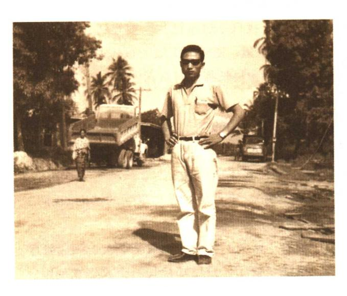

在泰国

{47}------------------------------------------------

推门进去,郑社长让我坐下,温和地对我说,

"我什么样的工程都经历过,但这次竟然出现这么大的赤字, 我不能理解,一定是有人贪污了工程款。我绝对相信李先生,你 告诉我,到底是谁干的?是部长和科长中的哪一个?还有没有 其他人?"

我看着郑社长,说:

"我是现场出纳,所有支出都要经过我的签章。在我了解的范围内,我敢说没有任何人拿过公司的钱,而且也不可能在我不知道的情况下拿走公司的钱。我认为,工程赤字不是某一个或某几个人的贪心或错误造成的,而是技术和经验不足导致支出过多,成本预算又过低。这是长期累积的结果。"

郑社长直直地盯着我。

"那么,是你一个人独吞了?"

"我没有那么大的能力。社长您还记得吗,几个月前我就跟您说过亏损的问题,当时您很肯定地说工程有利润。但事后我还是有点担忧,所以就做了一份报告书交给部长。"

"哦?那份报告是你做的?"

"是的,我只不过是把我能搜集到的资料做了一下统计分析。"

"这个混蛋,竟然把下级的报告说成是自己的!那么,你的想法是,部长和科长都没有贪污?"

"是的。"

"哦? 听他们的口气, 部长认为是你和科长干的, 科长认为是你和部长干的。"

"……"我无话可说。

那天晚上,审计组将做出最后的结论。我们三个人像罪犯等待 宣判一般辗转难眠。

早晨7点来了电话,让我一个人去酒店餐厅。

下楼到餐厅, 只见郑社长一个人坐在那里。

{48}------------------------------------------------

他让我坐下,问了一些关于故乡和父母的事情,然后让我点早餐。

- "我想回房间跟部长他们一块儿吃。"
- "不用管他们,他们自己会在房里吃的。"

我只好坐在郑社长对面吃了早餐。郑社长虽不擅长英语,但点 餐时却那么自然的样子让我印象深刻。等到快吃完的时候,郑社 长突然对我说:

- "李先生,你来负责这个工地吧。"
- "啊?您说什么?"
- "部长和科长今天就回国,我希望由你来负责他们的工作。"
- "那应该再派新的部长和科长来啊。"
- "没那个必要,有你一个人就够了。你自己回国挑几个人带过来吧。"

高速公路工程在巨额赤字的压力下进入了棘手的收尾阶段。 这时候,把工程交给一个刚进公司不久的基层职员,由此可见郑 周永社长的果断与魄力。

为了便于开展工作,我被提升为代理。这种破格提拔一直持续 到后来我被任命为部长、理事、社长。

### 推士机

现代建设在越南承接的新工程弥补了在泰国的亏损,从而打下了重振旗鼓的基石,在国内,也通过京釜高速公路的建设打了一场漂亮的胜仗。

京釜高速公路工程被誉为"檀君以来最伟大的历史"。这一战 略计划实际上是朴正熙总统"打通国家大动脉, 经济才能搞活"的 

{49}------------------------------------------------

信念,和郑周永社长"我们当然可以"的豪言壮语一拍即合的产物。

1968年3月,当我完成泰国高速公路工程回到国内后,郑社 长决定把我派往西冰库,担任现代建设重型机械事务所的管理 科长。

我一下子如坠冰窟。重机所很少有正规大学出身的职员加入,只有临时工和刚从工地回来、尚无去处的人才会被安排到那里。按说,我在国外工作了3年,虽然进行的是亏损工程的收尾工作,但毕竟还算圆满地完成了任务,回国后理应进入总部管理部或经理部,哪曾想到会被派到那么一个不得人心的地方。

我在人们同情、担心甚至嘲讽的目光中,默默地来到了西冰库工厂。在自称"老油条"的驾驶员和维修工人当中,有好多都拥有二十多年工作经验,是早在现代建设公司创立之前,就和郑周永社长一同打造汽车服务工厂的技术老手。他们都在人称"王常务"的重机所所长金永柱常务手下工作,因此人称"王党派"。

我这个新任管理科长的"第一把火"就是要改变这些"王党派"的旧观念和工作态度。在重机领域工作的人都习惯于使用日本式的配件术语,如果碰到大学刚毕业、熟记英语术语的年轻技术员,连沟通都成了问题。

我把新旧两派召集到一起。

"我们现在使用的不是美8军留下的古董,而是最新的进口设备,以后我们也会越来越多地向美国公司订购配件。如果把differential gear (差动齿轮)说成'代五(Dae Woo.gear 的日式外来韩语)',谁能听得懂呢?只记住配件名称还不够,每个配件上标注的固定编号也要一并记住,因为只凭名称是没法区分规格和生产厂家的。所以,今后申请配件的时候,务必先看好手册中的编号。如果像以前那样光说'要代五',我是不会批的。"

为了掌握配件的名称和编号,"王党派"开始经常请教那些年轻拉工,工厂的氛围有了很大改变。

{50}------------------------------------------------

当时,重机事务所的一个重要任务就是支持京釜高速公路建设,因此需要更严格的纪律和紧迫感。我把上班时间从7点提前到了6点。无论男女老少,所有人一律6点在运动场集合,做10分钟体操,再围着西冰库工厂跑20分钟,以良好的精神状态投入工作。休息时间禁止打牌、下棋,即便是星期六下午,我也不允许在工作场所存在松懈的工作态度。

老员工们虽然嘴上嘟囔着"没赶上好时候啊,遇到这么个年轻家伙,真是活受罪",但行动上还是遵守规定的,可女员工们不干了。

"6点上班对我们女员工来说太难了。男的只要洗漱一下就可以出门,可我们光是化妆就得要30分钟。请让我们比男的晚上班30分钟吧。"

我不能动摇。

"男员工晚上九十点钟才下班,而你们一般七八点就可以回家。你们可以利用晚上的富余时间,化好妆再睡觉嘛。早上起来刷一下牙就可以出门了。"

女员工们气坏了,但也无可奈何。按现在来说,这简直不成体统,但我们那一代正是靠着这样的努力才战胜了贫穷。

京釜高速公路工程是韩国建筑业的转折点。在那之后,使用机械设备进行建设施工受到认可,于是,重机所的作用也变得越来越重要。如果不能及时提供设备,工程进度就会受到影响。

郑社长每天都会打好几次电话来催促设备维修工作。他对设备的名称、性能、配件了如指掌,而我作为管理科长却完全摸不着头脑,也就免不了要被电话那头的郑社长一顿痛斥。

不仅仅在电话里,有时候郑社长会"从天而降",冲我们大发 脾气,"工地上因为没有设备而停工,你们重机所到底在干吗呢!"

有一天,我又被训斥了一顿。那天晚上,我把一台因无法及时 修理而未能送到工地的D8型推土机,以及一台构造相似的HD16 

{51}------------------------------------------------

型推土机全部拆开。大家都骂我疯了,因为那是需要紧急修理后马上送往工地的。我打开说明书,熟记每一个配件的名称和功能,然后再重新组装起来。

我为什么要拆推土机?因为我知道,掌握了设备,才能掌握人。从性格上说,我也绝对不能忍受让难题来束缚和压制我。

我不仅用这股"疯劲"征服了推土机,后来还用推土机推掉了一个"青瓦台的指示"。

当时,我们的西冰库工厂旁边有家生产建材的企业共荣社。因为粉尘问题,两家公司发生了纠纷。机械和粉尘是水火不容的。我们的重型设备随时都要和粉尘做斗争。经过交涉,他们答应安装防尘设备,但却迟迟不见行动。

一天,我又给他们的负责人打电话,要求他们遵守约定。但一直到那天晚上他们也没有采取相应措施,反而加班加点"制造"粉 少。我打电话提出强烈抗议。对方理直气壮地说:

"青瓦台让我们供应混凝土搅拌车,没办法,只能 24 小时 开工。"

"那是你们和青瓦台的事,你们必须遵守和我们的约定!"

"和你们的约定算什么?青瓦台的指示谁敢违抗?"

我大为光火,发出最后通牒:

"我们等到今晚12点。如果你们再不采取措施,明天早上你们 就别想干活了。"

到第二天早上,他们还是一点动静都没有。我跳上推土机,一路开过去,在他们卡车出入的道路上挖了一道深沟。对方急红了眼,让我们把道路恢复原样,我说不能服从。这时,青瓦台直接打来了电话,我依然没有让步。

"道路能不能恢复取决于他们。因为他们不遵守和我们的约定, 才发生了这种事,所以请青瓦台不要干预。我不知道他们的交货 情况有多么紧迫,但如果我们的设备不能按时维修,高速公路工

{52}------------------------------------------------

### 程将会受到严重影响。"

到了晚上,那家企业终于低头让步。

把道路恢复原样后,我接到了现代总部打来的谴责电话。

- "为什么没有请示总部、惹出那样的祸来?"
- "既然是在现场出现的问题,当然该由我负责处理。如果请示 总部、总部怎么跟青瓦台对抗啊?"

这回,总部也无话可说了。据说后来,青瓦台的重要人物给现代总部的高层打电话问:

- "你们那位管理科长到底是什么人?怎么做出那种事来?" 我们这边只好一阵敷衍:
- "是个只知道原则的年轻科长,还不懂人情世故,请多多谅解吧。"

### 明博,尽情地哭吧!

在我担任重机所管理科长时发生过这么一件事:

现代建设的重机所和共荣社所在的西冰库地区由于作业污染, 到处尘土飞扬。但其实,这一带的地理位置非常好,如果开发成 住宅区,必然会成为汉江河畔的一道美丽景观。

在当时,从事住宅开发业的都是一些中小企业。我们重机所附近已经建有公务员公寓和汉江高级公寓。汉阳公司为了在这片区域建造普通民用住宅,已经对外开放了样板房。

我也去看过那个样板房。让我惊讶的是,前来参观的夫人们非常感兴趣。我突然意识到,首尔未来的居住模式将在这里诞生。我有些着急了。另外,现有公寓的住户们因为粉尘和噪音,强烈要求我们两家工厂搬走。对于居民们的合理抗议,我们又怎能坐视不理?

{53}------------------------------------------------

与其被居民们赶走,不如反被动为主动,我们自己可以在这里 盖公寓啊。我把这个想法向郑社长提了出来。

"什么? 盖公寓?"

郑社长显然觉得我的想法太"小儿科"。

"社长,这一带正在向住宅区转变。因为污染问题,附近的民怨也很大,工厂迟早要搬迁……"

"那也不能盖公寓啊,人家要是听说我们盖公寓,还不笑掉大 牙了?"

"如果是公司形象问题的话,另行设立一家房地产公司不就可以了吗?"

就这样,韩国城市开发株式会社诞生了。后来,这家公司的销售额超过1兆5000亿韩元,成为集团的后起之秀。

现代公司发展迅速, 我个人也晋升得很快。

有一天,总务部给我送来了一辆"现代"制造的科蒂那轿车, 我问:

- "这是给谁的呀?"
- "您不知道吗?您已经被任命为理事了。"
- "任命谁为理事?"
- "是部长您,哦不,是您,理事。还能有谁啊?您真的不知道吗?"
  - "什么时候的事?"
  - "三天前。"

那一年,是我进入现代建设的第5年,我28岁。这样的提升纪录,除了企业主的儿子、亲戚以外,发生在纯粹的工薪族身上,或许再也找不到第二个了。郑社长如此快速提拔我的原因只有一个:凡事只要交给李明博,就没有办不成的。

20世纪70年代初,企业外部环境已发生巨变,内部改革也势 在必行。现代集团和其他一些从70年代走过来的韩国企业一样, 

{54}------------------------------------------------

逐渐让创业初期的元老们退居二线,把生机蓬勃的年轻人推到第一线。

1972年,我升任负责管理的常务理事,面对的重要课题就是整顿管理体制、强化企业自身力量、促进新产业的发展。作为常务理事,我的工作首先侧重于加强经营合理化。其一追求经营利润,其二整顿内部组织、提高工作效率。随后就是实施预算管理制度,进行人力资源整合,制定规则等整体改革与运营的合理化方案。

1975年,我被提升为副社长。此时,距离我刚进公司时,正好10年。我的"非正常"升职引起了不小的震动,各种猜疑声不断:

"那个叫李明博的人,是不是抓住了郑会长的什么把柄?" "不是吧,听说他的后台是朴总统。"

对于这些传言,郑会长只是轻描淡写地说:"李理事是我提升的吗?他是凭自己本事升上来的。"

升职带来的喜悦最初也有过一两次,按部就班重复几次后,便 也渐渐麻木了。但是,接到副社长任命的那一刻,我心里激动极 了。我买上一瓶酒,去了老朋友家。高中毕业后对未来充满绝望、 在首尔街头徘徊的时候,正是这位老乡给予了我莫大的安慰。

"我在报纸上看到,你当上副社长啦!"

"嗯,今天刚接到聘书。"

"恭喜你。应该敬你酒啊。"

我们喝了一夜的酒。温润的烧酒把以前冻结在我心里的冰块一层一层融化了。最后,终于哭了出来。这是我成年以后第一次在别人面前流泪。想起在浦项的童年时光和去世的母亲,眼泪竟像决堤的河水。

"哭吧,明博,尽情地哭吧……" 那天晚上,我真的哭了个够。

{55}------------------------------------------------

### 35 岁的社长

20世纪70年代,韩国建筑业将目光投向了新的海外市场——中东,这也是1973年石油危机的震源地。

那时,1加仑只卖1美元20美分的石油突然暴涨到28美元,我们国家滴油不产,自然受到了极大的冲击。拯救韩国这次经济危机的是以现代建设为代表的进军中东市场的建筑企业。在超过40摄氏度的沙漠里,昼夜工作的韩国技术人员和技工们是真正的产业爱国者。建筑企业的海外开拓精神为韩国发展做出的贡献是绝对不应该被忘记的。

但是,对中东市场的开拓从一开始就充满争议。大部分建筑企业都持否定态度,即使在参与开拓的企业内部,也存在着正反两种意见。

现代建设公司也是一样。积极摸索中东之路的是郑周永会长和我。"现代"在中东的"第一桶金"是伊朗某造船厂训练院工程(800万美金)。承接这项工程时还没有遭到太大的反对。但是到第二年,也就是1975年,在促进1亿5000万美元竞标Basrah-Arab造船厂工程时,公司内部的矛盾达到了针锋相对的地步。

负责海外业务的郑仁永社长持反对意见。他认为,以"现代"目前的能力还不足以承担如此大规模的海外工程。工程失败的危险要素确实存在。一些已经进军中东市场的企业由于经验和准备不足,造成巨大赤字的负面消息也时有耳闻。

在激烈的角逐中,现代建设最终竞标成功。从1975年10月 开工,到1977年10月提前完工,各方对这项工程的评价均为"很满意"。 

{56}------------------------------------------------

但是,郑周永和郑仁永两兄弟却因为对这项工程的取舍争端, 最终走向了决裂。郑仁永社长负责现代洋行,从集团中分离了出去,此举引起的余波久难平息,现代集团一时人心惶惶。

有一天,郑会长把我叫到他办公室。当时已经差不多到了下班时间,郑会长似乎下了什么重大决心似的,神情凝重。

"公司领导层必须有所调整了。你有什么想法?" 我静静地等待下文。

"把全甲源和金胄信提升为常务,让金胄信兼任现场所长,你 认为怎么样?"

这不是商量, 而是通告。

"那个,关于赵社长,你有什么要说的吗?"

我只能顾左右而言他,因为我还没有从当事人那里听到过正 式的表态。

- "李副社长……"
- "什么?"
- "没什么……你去忙吧。"

郑会长欲言又止的话在1977年正月召开定期理事会之前说了 出来。那天,他也是先把我叫到他办公室,目不转睛地看了我半 天,才说出一句话:

"郑社长和赵社长都出去了,谁来当社长啊?"

我知道他习惯于在说重要的话之前先说点别的事情。

"你当社长吧。"

我大吃一惊。

- "会长,我现在还不够资历担任社长。"
- "没人啦。权奇泰副社长是工程师,不懂管理,世永在做汽车, 顺永在做水泥……"
  - "我上边还有很多前辈……"
  - "做个方案看看吧,年轻人怎么那么没野心!"

{57}------------------------------------------------

郑会长似乎决心已定,而我却是真心退让。世上之事林林总 总,岂是单靠能力和信任就能摆平的?

郑会长又注视着我说:

"建筑是一项综合性事业。在建筑行业做得成功的人在任何行业都能成功。但是,我最近越来越清楚地意识到,人力资源管理是企业的生命。李副社长,你擅长管理人。为了我,不,为了现代建设,出任社长吧。"

那天郑会长的神情我至今难忘。

几天后在理事会上,我被选为负责国内事务的社长。意料之中的流言飞语很快冒了出来。工商界人士对我的破格升职表示了"担忧"。

"郑周永会长这是怎么回事?把韩国数一数二的现代建设交给一个30多岁的年轻人,这也太不知天高地厚了。你们瞧吧,用不了一年,有他苦头吃的。"

我自忖,虽然进入公司12年就被提升为社长,但我这12年和 其他人的12年是不同的。我从来没有公休日,每天工作18个小时 以上,相当于其他人的两倍。如此计算的话,我等于是工作24年 才升任社长,因而也就不能说是"过快"了。

那年年末,全国人事管理委员会邀请我在他们的研讨会上做 演讲,我欣然答应。研讨会上聚集了各家企业的负责人和部门领 导者,大家都对我这位年轻的社长充满好奇和疑惑。

"大家都知道,我是一个30多岁的年轻人,资历不足,需要学习的东西还很多。但是,郑周永会长决定起用我,绝不是即兴,或者偶然的。我认为,这是一个适应时代发展需求的判断。我国在经历了经济开放时代之后,势必要朝着经济高速增长时代、国际化时代发展。与之相适应,我们的经营体制也必须进一步完善。

"我认为,经营体制的改革完善,应该从起用职业经理人入手。 企业主一人决断的时代已经过去,高度专业性和组织力主导企业 

{58}------------------------------------------------

发展的时代正在来临。郑会长之所以委任我社长一职,我想,就 是基于这个原因。我有信心消除大家对我们的疑惑和担忧。"

台下掌声雷动。那是渴望改革的企业家的共鸣。

### 家庭与财产

在我还是现代公司的一名小职员时,贫穷依然伴随着我。能拥有一间小屋已经是奢侈的想法,更不用说结婚、成家了。随着职位不断上升,在我28岁成为"前途无量"的理事之后,有人开始为我做媒了,介绍的对象大多是有钱人家的女儿,或者政治世家的千金,也有演艺界的漂亮女明星。

但事实上,我内心里并没有人们想象的那种优越感,富贵名媛对我来说反而是一种负担。

有一天,在浦项念高中时的一位英语老师把他朋友的妹妹介绍给了我。她不是有钱人家的女儿,父母都是清廉的公职人员,这一层就已经让我对她产生了好感。1970年我们见面的时候,她刚从梨花女子大学毕业。据说她在学校时,还曾被选为校花。但在我眼里,她并不是那种特别漂亮、出挑的女孩,而是一个心地善良的姑娘。

由于工作繁忙,我几乎没有和她好好约会过。即使偶尔约了她,也总是"迟到早退"。有几次忙得脱不开身,只好打电话到约定的咖啡厅,让她换到饭店,然后还是不能按时去,只能让她自己吃饭。有时候让她等得太晚,只好让公司的司机替我把她送回家。

在举行订婚仪式的那天,我也是因为有紧急事务要处理,仪式一结束便扔下她,直奔公司。据说那天,妻子的很多朋友还在那里议论:

{59}------------------------------------------------

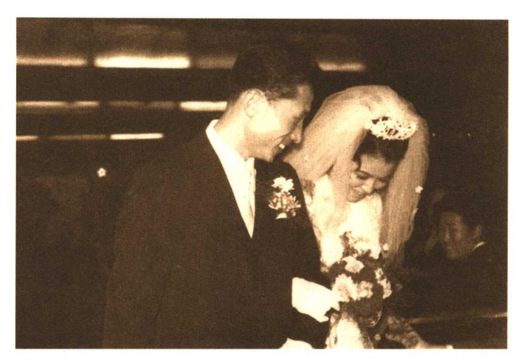

1970年12月19日结婚典礼

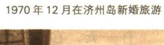

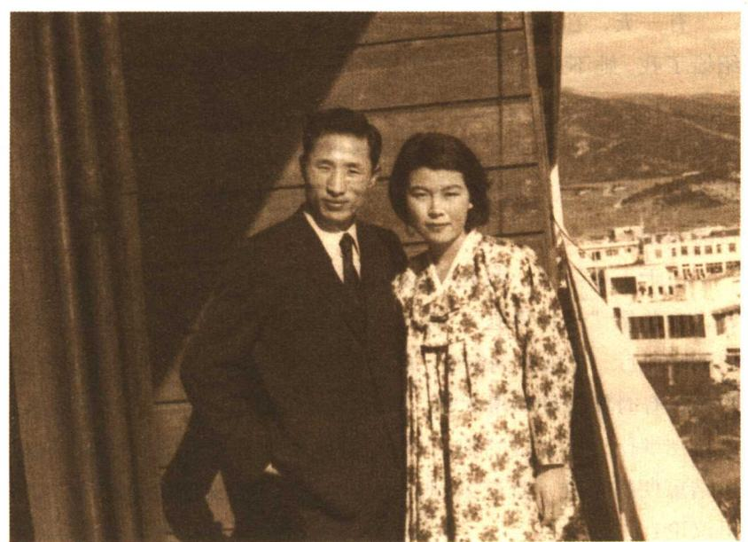

{60}------------------------------------------------

"怎么嫁了个这么丑的男人?"

曾经的校花嫁了我这么个"难看的复合体",也难怪他们会这么说。

结婚后,我们用朋友们送的结婚礼金,在麻浦租了一间十几坪的月租房。每隔半年,房东就要求提高租金,所以3年内我们搬了8次家。第二次搬家的时候还带着全部的行李,但从第三次搬家开始,就只带走些生活必需品,到第七次,只拿了碗筷就离开了。有时候我甚至忘记已经搬了家,下班后又回到原来的住处。

妻子从我还是穷小子的时候起,就和我一同为生活奋斗,是与 我患难与共的"糟糠之妻",但有那么一段时间,她竟然被误认为 是我的"情人"。

事情是这样的: 当时我们住在由公司提供的狎鸥亭洞"现代公寓"。我经常一大早就出门,夜里很晚才回到家,邻居们很少看到我,只见过我妻子。因为我当时已经担任现代建设的社长,人们猜测我至少有50多岁,我的夫人当然就该是40多岁的中年妇女。但事实上,我妻子当时才29岁。

当她带着小女儿去市场买东西时,有人就说:"瞧,那是现代公司的社长夫人。""不会吧?社长夫人怎么可能这么年轻!"一来二去,这些话就被传成了"现代公司的社长和年轻的情人生活在一起",真是让人哭笑不得。

我的家庭完全是妻子一个人在操持。三个女儿和一个儿子出生的时候,我一次都没有守在妻子身边。因为工作忙,和家人在一起的时间实在太少了。我一直觉得自己不是一个好爸爸,很少为孩子们做些什么,到国外出差也没有给他们买过什么礼物,顶多带回来飞机上赠送的洗漱用品什么的。孩子们小的时候,都以为那是爸爸特意从国外带回来的好东西,长大后才发现全然不是那么回事。

但即便如此,我的孩子们依然会说:"爸爸是最关心我们的人。"这不是孩子们的"假话",而是我为人之父的"秘诀"所起的

{61}------------------------------------------------

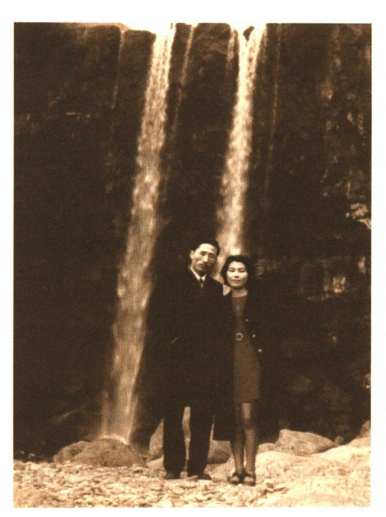

1970年12月在济州岛 新婚旅游

作用吧。我的秘诀就是通过妻子了解孩子们的作息安排。比如,孩子们考试、演出或野游的日期、内容都要向妻子问清楚,还要做些笔记。

"我是爸爸,我现在在新加坡。这里正下着雨呢,家里呢?" 就这样,先聊聊天气,然后再问考试之类的情况。

"今天考试还顺利吗?是不是考语文、数学、物理这三门?"

"啊?!爸爸你怎么知道的?"

我边笑边看笔记:

"明天要考英语和历史吧?"

这样,孩子们就会想,"爸爸多关心我啊!"

{62}------------------------------------------------

就像我记住孩子们的日常生活一样,我也完全向孩子们公开 我的生活。如果孩子们知道父母在什么地方、做些什么,这样的 家庭往往不需要过多地为孩子操心。父母的言传身教是对孩子最 好的帮助。

在我担任现代公司社长的时候,曾经参加过一个谈话节目。 当时社会上对公开公职者的财产十分关注。我在节目中强调说, 社会舆论支持的不应是"清贫论",而应是"清富论"。这番谈话 引起了不小的波澜。

财产的多少并不是问题的关键。如果积累的方式不正当,即 使很少的一点财产也是不正当的财产;反之,如果方式正当,凭 智慧与勤劳致富,财产很多也是合情合理。当然,通过不正当方 法致富的一些企业和个人是需要反对和查办的。

我们韩国有句俗话:像狗一样挣钱,像宰相一样花钱。我认为现在应该是"像宰相一样挣钱,也像宰相一样花钱"。干净合法地挣钱,正大光明地花钱,这才是健康的社会。

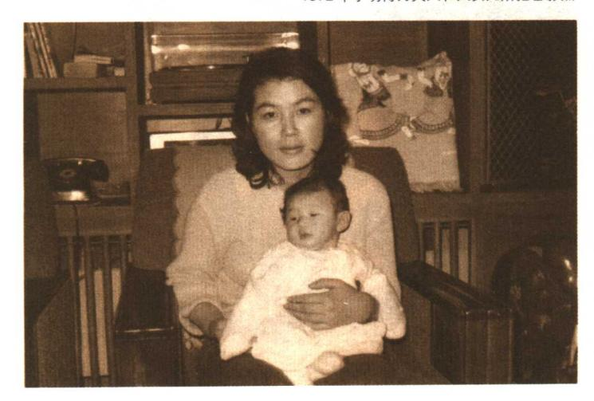

1972年李明博为夫人和大女儿所拍合影照

{63}------------------------------------------------

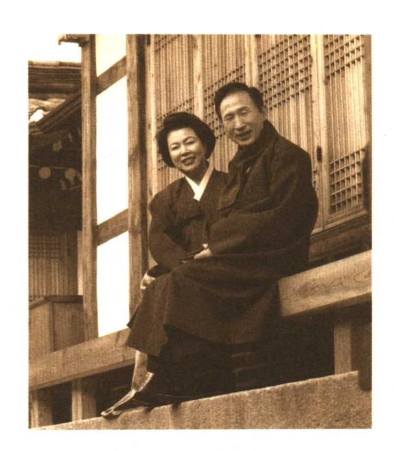

李明博与夫人在一起

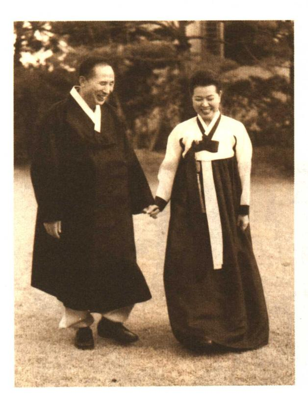

{64}------------------------------------------------

骤雨间

不管有多难,心中都要怀有希望。

遭遇困境时,最重要的是自己的意志。压力是在被动工作时产生的。

即使暂时遇到挫折,只要足够努力,就一定能渡过难关。

57 mb

{65}------------------------------------------------

### 密 审

在我成为现代建设社长的1977年之后,国家政治局势可谓暴风骤雨。两年后发生了"10·26"事件,1980年开始了新军部的黑暗统治,接着,又经过了第五共和国、第六共和国执政时期。在这些年里,我作为一个企业代表,经常被推至与权力抗争的悬崖。

- "10·26"事件后,所谓的"首尔之春"到来了,而事实上,这个春天毫无春意可言。
- 一天上午11点30分左右,两个陌生男子突然出现在我的办公 室里。
  - "请跟我们走一趟。"

不容分说就要把我带出去。

- "岂有此理! 你们是什么人? 要带我去哪里?"
- "去了就知道了。只是在办公室外面谈一谈。"

下到一楼,他们两个突然架住我的胳膊,把我拖进了一辆黑色 轿车。

我问他们要把我带去哪里,他们没有回答,我再三追问。

- "先去钟路警察局吧。"
- 一到钟路警察局,他们就开始对我不客气了。没有一句说明, 就把我关进一个单独房间,好像对待犯人一样。我简直莫名其妙, 又没有办法跟公司取得联系。

两三个小时后,他们给了我一碗牛肉汤饭。有一位警察偷偷地对我说:

"他们还要带你去别的地方审问,快跟你们公司联系吧,把所 有文件都收起来。" 

{66}------------------------------------------------

趁他当班的时候,我跑到门外给公司打个了电话。

"我也不知道是哪个机关,也不知道是因为什么事,只是要暂时在这里接受调查。"

我到那时还以为是暂时调查。我又没犯什么罪,他们能拿我怎样呢?

过了一会儿,我又被塞进那辆黑色轿车,朝着南山方向驶去。 到中途,又换了另一辆在路边等候的轿车。押我到那儿的人和新 接手的人还像办交接手续那样,在文件上签了字。我当时还想,这 些人做事怎么那么没效率。

我被带到了南山中央情报局的地下室,到那儿才知道了事情的原委:他们接到情报说,现代集团的郑周永会长向"三金"(金泳三、金大中、金钟泌)提供了政治资金。押我来就是想让我提供一些他们不知道的情况。我的直觉告诉我,他们想抓捕"三金"。这就是"首尔之春"的异象。

"我从来没有见过'三金',为什么用这种方式找我调查?"

"经过我们的调查,你好像确实没有向谁提供过政治资金,但有情报说你们的郑会长提供了政治资金。我们又不能找他老人家来调查,但是,李社长你肯定知道郑会长给谁、提供了多少钱。怎么样,跟我们说说吧。不会有人知道你来过这里的。"

"我从来没有听说过郑会长给'三金'提供政治资金的事,他也不会去做那种事。我想,应该是你们的情报有误。"我从容地说。

"你这家伙,不会不知道这是什么地方吧?如果不说出实情,你别想走出这个地下室!"

我还是坚决否认。反复再三,他们也有些犹豫了。

"既然这样,那我们就做些妥协吧。你说没有看到或听到郑会长提供政治资金,我们暂且相信你,但是,郑会长向那些人提供政治资金的可能性总是存在的吧,你承认这一点就可以。过去做过的事情,现在还是有可能这样做,这个道理小孩子都懂。要不

{67}------------------------------------------------

然,'三金'靠什么到处活动呢?你就承认这一点吧。如果连这个都不配合,那我们只能采取别的方法了。"

审查官向我暗示会用刑。难道他们还想逼供吗?这些人的逻辑实在了得,把一个可以发生在任何人身上的可能性套到一个大企业的会长身上,然后顺势抓捕三位政治人物。新军部的意图昭然若揭。

但我的答复只有一个。

"我不知道什么政治资金,我也不知道郑会长以前是怎么做的, 反正现在,我绝对没有听过向'三金'提供政治资金的事,现代集团的下属公司也没有做那样的事。"

"你这家伙,真是岂有此理。知道的你就说知道,不知道的说有可能不就行了吗?你把我们当什么了?是不是让你尝尝苦头你就知道该怎么说了?"

"如果确有其事,我不可能不知道。但据我所知,郑会长和下 属公司绝对没有做那种事。"

反复的诱供、威胁从下午3点左右,一直持续到深夜。审查官 暂时出去了一下,再进来时居然态度大变。之前的青面獠牙换成 了满面春风。

"李社长,您看,郑会长是个老人,即使有点什么事情也没什么大关系,但是您就不同了。您要是在这儿出点什么事,谁也不会知道。本来嘛,这个世界上就没有一尘不染的人。你呢,既然到了这儿,最好就跟我们好好合作。我们也不是要给郑会长无端治罪、打压企业。我们只是想知道那些人的资金来源而已。也不是要你告密,或者背叛谁。你只要承认有那种可能性就行了。干吗那么固执,自讨苦吃呢?"

看来,他们是想试试怀柔政策。

"我再重复一次。现代集团没有向'三金'提供政治资金,那种可能性也绝对没有。"

·"你这家伙……"

{68}------------------------------------------------

审查一直进行到第二天早晨。他们让我系好领带,把衣着整理 一下,又押着我上了一辆轿车。这一回,我被带到了一个带会客 室的大套间。一位看上去官职颇高的人在那里等着。

"昨晚辛苦了。不知道下边的人有没有失礼?" 声音冷若冰霜。我的预感告诉我,这是最后一关了。

"其他企业的人也到过这里。合作得很好。希望李社长也能一样。否则就很麻烦。现代集团的郑会长向政治人物提供活动资金 是公开的秘密。找你问话,不过是走个形式。现在请讲吧。"

"没有那样的事。从集团角度来说,提供政治资金是不可想象的事情。郑会长个人也不会给在野党提供资金。"

- "你怎么知道?"
- "在我这个职位上还能不知道吗?"
- "不知道的事,你就说不知道吧!难道还想否认我们的调查权?"
  - "我不知道你们有没有调查权,我只是实话实说而已。"
  - "你这人……"

这位高官也拿我没办法了。

"既然你这么坚持,那就到此为止吧。如果没别的话,就在这 儿按个手印吧。"

我仔细看了看,是如实记录的文书,便用拇指蘸了印泥按了 手印。

精疲力竭地回到公司,公司早已大乱,一整天都找不到社长行踪,岂有不乱之理。我没有向任何人谈起过那天发生的事情。对郑会长,也只是简单地提了一下:

"因为政治资金的问题,好像有点误会,所以找我到机关接受调查。我说了会长和下属公司没有向任何人提供政治资金就回来了。"

郑会长也没有再问。

{69}------------------------------------------------

在第五共和国初期,现代集团和新军部的关系十分紧张,但 是到中期,双方表现得亲密友好,到末期,关系又再度恶化。这 样的无常反复也在郑周永会长心中埋下了既对政治失望、亦对权 力憧憬的矛盾的种子。

### 血泪

新军部筹划的"调整重、化工业投资"政策使现代集团陷入了 危机。无所不为的"国保委时代"来临了。

一批从海外学成归来的经济学者,连同国内的一部分经济学家,纷纷参与到新军部经济政策的筹划活动中。他们把重、化学工业的重复投资视为韩国经济发展的障碍,主张积极改变这一经济模式。这一主张也暗合了那些试图改变国内经济格局的新军部领导人的想法。

现如今,很少有人会把多家汽车生产公司共存的局面视为重 复投资、国力浪费的现象。经济有其竞争规则,竞争应以公平为 基础。竞争公平规则受到保障的程度是衡量先进国家与落后国家 的标准之一。

但在当时,一部分经济学家和官僚却坚持认为,只有把所有汽车制造厂融为一体同时发电设备厂也融为一体,才有利于国家经济的发展。具体说来,就是要把现代汽车、大字汽车和亚细亚汽车合并为一家,再把电力设备领域的大字玉浦造船厂、现代重工业,以及昌原的现代洋行(现斗山重工业)合并为一体。

对于现代集团来说,汽车与电力设备好比手心、手背,哪一个都无法割舍。现代集团对汽车产业的期望与热情是很高的,何况 当时,现代汽车刚刚起步走向世界。电力设备领域也是一样。现 

{70}------------------------------------------------

代集团已经具备了制造原子能发电设备的能力。如果放弃这一领域,就等于放弃巨大的火力发电站与核发电站设备市场。

新军部的经济调整方案简直就像捕捉现代集团的一张阴沉的大 网。但是,这一政策已经公开,留给我们的唯一选择就是作出取舍。

经过智囊团的反复研究商议,郑会长最终决定选择汽车产业,因为这个新兴产业具有无限的发展空间,虽然电力设备产业也大有可为,但其生产本身就不具有稳定性,况且即使放弃了设备生产,今后我们至少还可以参与核电厂或火力发电厂的建设工程。现在想来,郑会长的判断也依然是明智的。

内部意见统一之后,我便单枪匹马冲向了"国保委"。会谈的对象是陆军军校第17、18期出身的两位军官。他们直接让我作出选择。我说:

"在作选择之前,我想先问一下,为什么要作这种选择?虽然现在看来,重、化工业似乎存在投资过剩,但在不远的将来一定会出现供不应求。如果把具有竞争力的企业都合并起来,必然会违反市场经济的第一原则——竞争,进而导致经济衰退。考虑到韩国经济的未来,我们认为这种投资调整本身就是有问题的。"

"这个政策是经过充分论证、研究过的,我看就没有必要在这 里讨论了。你们只需要从两个当中选择一个就行。"

第一天的谈判毫无实质进展,但我能感觉到一点:"国保委"已 经和现代集团的竞争对手达成了某种共识,我们成了被孤立的一 方。他们一定希望我们放弃汽车、选择电力设备。不,他们或许已 经内定了让现代集团选择电力设备,然后把我们往这个方向诱导。

我第三次去"国保委"的时候,会谈的军官终于摊牌了。

"你们现代集团一直侧重于重工业发展,在这个领域也有过不少投资。既然建筑是你们的主力行业,选择电力设备也就顺理成章了。"

"'现代'选择汽车产业。"我单刀直入。

{71}------------------------------------------------

他们一下子慌了。

接下来,他们开始强行要求我们选择电力设备。我毫不含糊地说:"现代集团从始至终不赞成合并,如果合并不可避免,那我们一定选择汽车产业。"

那些军官自然不甘心,又罗列了一大堆现代集团应该选择电力设备的理由,但我丝毫没有动摇,谈判进入了僵持阶段。这时候,他们竟然把矛头指向了我个人:

- "你现在住在什么地方?"
- "江南。"
- "是公寓吗?"
- "不是,独门独院,不小。"

"哼,你倒是住得宽敞。而我,就住在山顶一间连自来水都没有保障的40平米的公寓里。我们在为国家担忧的时候,你们却在一边享清福,还不肯跟政府合作,这像话吗?"

我再也坐不住了。

"两位花国家经费上军校的时候,我每天早上在梨泰院拉着平板车清理垃圾,靠勤工俭学完成了学业。你们父母送你们进高中的时候,我不但要自己赚学费,还要拼命干活养活自己。大学毕业进入公司后,还要在国外工地没日没夜地工作。1974年我们国家外汇储备几近耗尽、国家经济面临崩溃的时候,是靠我们这些海外建设者辛辛苦苦挣的美金才扛了过去。两位从军校毕业后经历过战争吗?而我,每天都要在和战争一样残酷的海外市场上打拼,每天工作18个小时,每天晚上只能睡三四个小时。"

这时, 一位军官拦住我的话。

"我们也参加过战争。越南战争。"

我忍住苦笑,又接着说:

"谁说只有军人才是爱国者?我们这些企业人难道就不是爱国 者吗?企业可以成为批评的对象,但无视企业作用的想法是绝对 

{72}------------------------------------------------

不可取的。你们住在山顶的公寓里,而我曾经在比那还要艰苦很多倍的地方生活过。作为一个大企业的社长,我住在一套大房子里有什么错吗?那套房子是公司为我方便接待外宾而盖的,如果这样也有错,难道一定要我降低自己的居住水平吗?难道这就是你们治国的目标吗?你们应该在最短的时间内,让你们这样的军人、公务员也达到和我一样的富裕水准,这才是可取的目标。怎么可以要求一个靠诚实劳动富裕起来的人降低生活水平呢?"

这一次的谈判在争论中结束了。我回到公司和郑会长商量,如 果这样争论下去,我们必然会被推到选择的边缘,毕竟主动权不 在我们手里。

一天晚上,一个在政府部门工作的朋友托人捎来口信,说是想约我见一面。这位朋友当时正在辅助政府运作"改革"事宜,一看到我便露出担忧的神情。

"李社长,现在是非常时期,很多问题不是固执己见就能解决的。依我看,你还是同意吧。时间对你们不利啊。明天就去表态吧,这关系到现代集团的命运。"

那天晚上,我一直在揣测他找我谈话的动机。是真心为我和 现代集团担心,还是站在新军部立场上诱导我呢?我竟一时难以 辨别。

第二天, 我向郑会长转达了那位朋友的话。

郑会长看上去很疲惫。"10·26"事件后,现代集团完全是靠他的坚韧意志与斗志才经受住了各种考验。肩扛千斤担的压力可想而知。

"再努努力吧,如果实在不行,就同意吧。或许这就是大势 所趋。"

郑会长把公司的印章递给我。

- "会长, 您这是做什么?"
- "你不要有思想负担。"

{73}------------------------------------------------

"如果要盖章的话,还是请会长您亲自去吧。即使您不去,还 有很多人能代表公司盖章啊。"

"这件事一直是你在处理, 你就善始善终吧。"

我没再说什么, 收起印章, 去了"国保委"。

和往常一样,还是两条难以相交的平行线。我继续坚持我的 "不可合并论"。

"如果把汽车企业捆成一个,竞争力就会降低,最终只能成为 国家的负担。印度就是一个前车之鉴:他们只有一家国营汽车企业,技术开发不行,经营管理也不行,造出来的汽车款式陈旧,性能也不好,价格却贵得离谱。因为产量少,买一辆汽车要等上好几个月。没有合理竞争的弊端,局外人是很难了解的。我们国家现在看似重复投资,但事实上是经济不景气、产业化未能进入正轨所引起的。假以时日,就会体现出各个企业对出口所做的贡献。所以,还是请再考虑一下是否合并的问题。"

"李社长, 你以为你是谁啊?这个政策是以海归学者所做的调查报告为依据制定的。你有什么资格在这里信口胡说?"

我暗暗对自己说, 务必再坚持一下。

"我不知道那些人是以什么为根据主张合并的。那种废除合理 竞争、培养垄断企业才有助于资本主义社会发展的理论,在任何 一本经济学教科书上都找不到。垄断企业一开始运转可能还不错, 但时间一长,就会出现无数的问题;而在健康的竞争环境中成长 起来的企业,他们的前途将不可估量。如果你们现在非要无理合 并,能不能解决眼前问题还是未知数,今后要想进入国际市场更 是毫无希望。到时候再后悔可就晚了。"

"我们没时间听你在这儿讲课!要么同意合并,要么,请便。" 此时已是深夜。我意识到,再争论下去,也不会有什么转机。 房间内的空气沉闷得让人透不过气来。

"既然我们别无选择,那就请按政府的决定盖章吧。"

{74}------------------------------------------------

我拿出郑会长的印章,放在桌上。我不能用我的手来盖这个章。

一位下属军官走上前,拿起了印章,就在落章前的一瞬间,那 位高级军官一脚踹开桌子,站了起来。

"不要盖!"

他识破了我的意图。如果由他们盖章,由此产生的后果也将由 他们承担。他气急败坏地看着我,又转头冲那位下属大发其火:

"你怎么搞的!"

那天半夜,我从"国保委"出来,回到了公司。整个公司大楼, 只有郑会长的办公室还亮着灯。

郑会长盯着我的脸, 呆呆地看了好一会儿。

- "盖了吗?"
- "没盖,章在这儿。"
- "啊?怎么回事?"
- "我明天再详细向您汇报吧。"

郑会长又看着我的脸。

- "唉,你的眼睛出血了。"
- "不会吧,我没觉得有什么异样啊。"
- "是出血了,去照照镜子吧。"

在会长室人口的镜子前一照,果然我的眼睛里有红色的液体。 沾在手帕上是乌紫色的。这就是所谓的"血泪"吧!以前还以为 只是文学性的修辞,没想到从自己的眼睛里流下了血泪。

我的正面对抗使"国保委"的汽车产业合并计划无法顺利进行,进而促成了将问题移交工商部处理的契机,合并问题也随之成为公开的争论。在工商部主持的会议上,郑周永会长更是强烈阐述了产业合并的弊端。最终,汽车产业没有走向合并之路。

假如那时真的草草合并,韩国现在的汽车产业水平或许就和 印度无异了。当时被合并的电力设备产业,结果后患无穷。

{75}------------------------------------------------

### 一次无可奈何的惨败

第五共和国初期,政府决定在西海岸平泽地区建设一个大规模的 LNG 储藏基地。先将气体 LNG 在超低温下液化,然后储藏在特制的超低温设施内。这样的设施对安全性能的要求极高。在国内,还没有一家企业能够独自担当这样的项目,因此政府决定让国内的建设公司与国外企业合作竞标。

现代建设与在这一领域处于世界最高水平的法国泰克尼盖斯公司签订了技术转让合同。最有实力和"现代"竞争的国内企业是汉阳公司,他们的合作竞标伙伴是日本的丸红公司。竞标结果,"现代"第一,"汉阳"第二,因为他们和丸红公司的技术审定没有过关。

得悉结果后,泰克尼盖斯总裁缇鲁先生特地赶到首尔进行庆祝。谁知,他回国后没几天,泰克尼盖斯公司就发来急电,请我们到法国商议要事。我一到法国,缇鲁先生就问我,有没有注意到韩国政府的态度变化。

- "此话怎讲?"
- "如果我们不能和'现代'合作……"
- "开什么玩笑?如果真是那样,你们就得按合同上的违约协议办,补偿所有的损失。"

缇鲁先生表情僵硬地说:

"如果这不是我们的意愿,而是韩国政府的意思,我们也需要赔偿吗?"

我这才感觉到事态的严重性。

一回国我就直奔国家电力公司。该公司毫不掩饰地说,"现代"

{76}------------------------------------------------

的意标书已被作无效处理,他们已经和汉阳公司签订了合同。

"明明是'现代'以最低报价中了标,而且评定说'汉阳'那边的技术方案有问题、怎么突然就和'汉阳'签合同了呢?"

"只要'汉阳'和法国泰克尼盖斯公司合作,技术方面不**就**没问题了吗?"

这样的回答简直不可思议! 我明确表示不会就此罢休。

不久, 青瓦台的首席经济官亲自找我谈话, 但我依然没有 退让。

"这不仅仅关乎我们现代公司,更关乎国外企业对韩国政府的看法。要不然,就取消上次的竞标结果,然后按照你们的意思,让'汉阳'和法国公司联合竞标,那样的话我就服从。"

对方的回答匪夷所思:

"现代建设还想不想在韩国生存下去了?再这么无理反抗,后 果你们自己承担!你就如实向你们的郑会长汇报吧。"

接到汇报后,郑会长也去见了那位首席经济官,但仍无结果。 泰克尼盖斯公司一方面向我们致歉,一方面也再三希望"现代"予以理解:站在国外企业的立场上,他们不能不顾及韩国政府的态度。

泰克尼盖斯公司确实没有什么过错,违约的责任在于韩国政府的干预,因此我们也不能要求法国方面赔偿损失。最终,还是我们无奈地让步了。

### 奏响凯歌

1987年12月,国家电力公司开始为灵光核电站三、四期工程建设实施招标。当时,国内拥有核电站建设经验的只有现代建设

{77}------------------------------------------------

和东亚建设两家公司。

核电站分为核反应堆和电力生产装置两个部分。在之前的古里核电站一、二期与月城核电站一、二期工程中,现代建设负责建造了第一部分核反应堆工程,第二部分由东亚建设公司负责建造。此后的灵光核电站一、二期工程则是由现代建设全权负责的。所以,现代建设是国内唯一一家具备建设完整的核电站经验与能力的企业。政府与现代建设就灵光核电站三、四期工程签订授意合同是最为理想的。

按照当时的情况,签订授意合同只是表示一种意向。《预算会计法》规定,大型工程不能和特定的公司签订承包合同,以防止给予特殊优惠待遇。事实上,政府不和现代建设签订核电站建设合同还有政治上的问题。由于此前政府无理介入现代集团的极东石油经营权问题,郑周永社长和第五共和国的权力层之间出现了裂痕。在这种情况下,政府自然不会让"现代"轻松过关。

就在这时,发生了一件让韩国当局进退两难的事情:美国三里 岛核电站发生核物质泄漏,引起全世界对核电站安全问题的关注。 没有经验的公司不能参与核电站工程建设成为一种国际共识。

韩国政府不愿把项目交给"现代",但又不能不顾及舆论的巨大压力。于是,国家电力公司决定重新招标,并提出了新的竞标资格要求。

第一次公告的标书审查结果是,只有"现代"符合要求。国家 电力公司发出第二次公告,结果还是"现代"胜出。根据法律,通 过两次审定的公司,第三次就可以与之签订承包合同。

看到工程授意合同基本确定,我便去了新加坡处理公司其他 事务。谁知几天后,我突然接到郑会长打来的国际长途电话。

- "李社长,核电站的授意合同无效了。"
- "怎么回事?"
- "是副总理在刚刚召开的记者招待会上公布的。你赶紧回来处

{78}------------------------------------------------

### 理一下……"

当时,在大部分政府主持的工程中,建设公司向政府提供政治 资金是一种惯例。但这次的核电站工程受到国内外普遍关注,资 金猫腻难有藏身之地,政府权力层因此感到不快。

在我离开的那几天,副总理、安全企划部长等政府高层竟然找出授意合同中的漏洞,随即召开记者招待会,宣布取消与"现代"的合同,并再次进行招标。

一回国, 我便直奔郑寅用副总理办公室。

"政府怎么能不和合同当事人打招呼,就单方面取消合同呢? 现代建设是经过一次、两次、三次竞标,堂堂正正地拿下了这个项目。政府单方面撕毁合同,是要负法律责任的。我们恳请政府取消这一决定,否则我们将不得不对政府提起诉讼。"

从副总理办公室出来后,我又去找国家电力公司的朴正基社长。

"如果您按照副总理的要求取消合同,那就等于承认之前和我们签订合同是错误的。您只有强烈主张和我们签订的合同是合法的,并且按原计划进行,才能证明您之前的做法是正确的。否则,单方面撕毁合同的所有责任都将由您来承担。"

朴社长处境尴尬。作为国家电力公司的社长,改变已经上报总统的决定几乎是不可能的。

下一步, 我又去找动力资源部的崔昌洛部长。

"法律规定,不能以政治方式取消合法的工程合同。这次单方 面撕毁与我们的合同,政府究竟是什么意思?"

崔部长似乎欲言又止。

后来,国家电力公司的朴社长向我转达了崔部长的意思:这个问题不归副总理管辖,更不是副总理应该出面处理的事情,虽然知道其中有不妥之处,但对于上面已经决定了的事情,他也不方便对外发表意见。

明白了崔部长的意思之后,我再一次走进了他的办公室。

{79}------------------------------------------------

"部长您只要肯定我的看法就行。等到合适的时机,请您再表明自己的态度吧。"

我没有必要让崔部长为难。虽然现代建设的反抗不容忽视,但 政府也不会轻易改变决定。

在听了我的陈述之后,国家电力公司的朴社长主张必须慎重 考虑核电站建设的安全问题,并决定按照合同与现代建设合作。这 自然引起了政府权力层的强烈不满,很快,他们便撤掉了朴社长 的职务。接任的韩凤洙社长对此问题毫无作为。无奈之下,现代 建设只得请律师做好诉讼准备,并通告了政府。诉讼对象是国家 电力公司社长和动力资源部部长。

终于, 崔部长来找我了:

"请你们承认政府权威。即使道理在你们一边,政府也不可能取消已经作出的决定。希望你们和东亚建设一起,再进行一次 意标。"

虽然这个提议依然违背原则,但我们决定接受。我提出了一个 条件:

"核电厂工程事关重大,招标不能以标书总额为准,必须以标书的明细数据内容为准。"

明细数据内容涉及很多具体的技术指标。没有核电站建设经验的企业是不可能提供这些数据的。政府接受了我的条件。

竞标结果,灵光核电站三、四期工程项目,依然花落"现代"! 这是一项工程两次被同一家公司赢得的珍贵纪录。事实上, 也是第一次在政府主持的重大项目中,企业没有向政府提供政治 资金。

在吸取了LNG储藏基地项目的失败教训之后,在两次起落、奋力抗争之后,我们终于奏响了嘹亮的凯歌。

{80}------------------------------------------------

1981年7月现代职员夏季修炼会

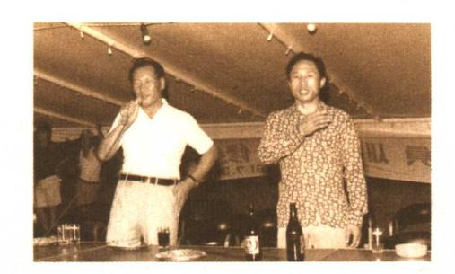

1988年李明博任现代建设会 长,和现代集团会长郑周永 在一起

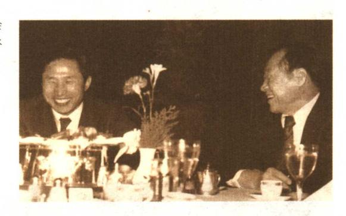

李明博与郑周永在公司运动会上

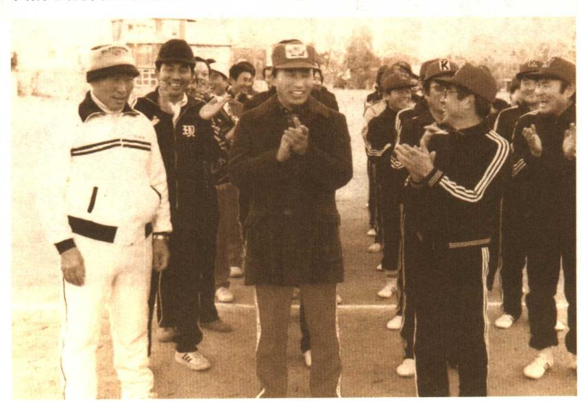

{81}------------------------------------------------

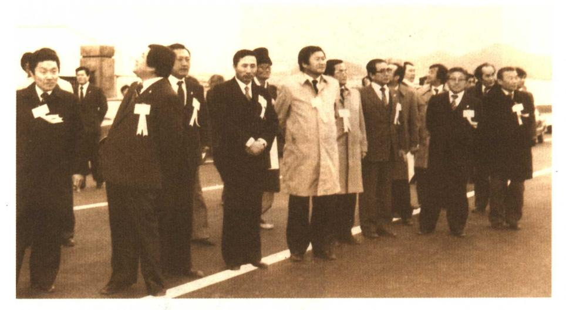

1972年李明博参加蔚山造船厂竣工式

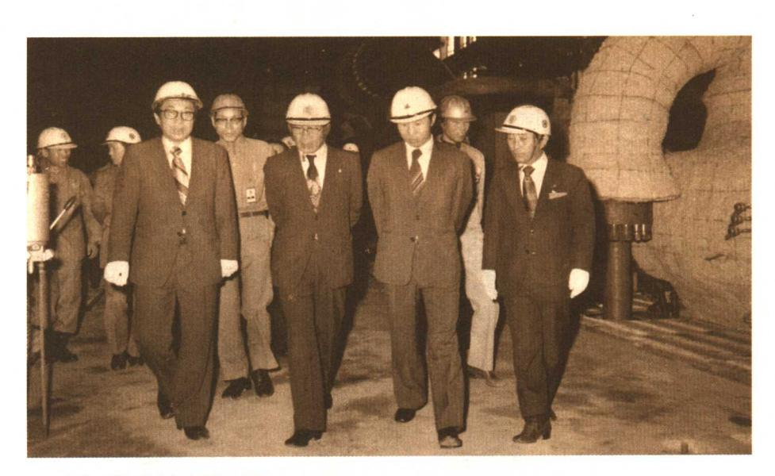

1978年李明博与郑顺永在丹阳水泥厂

{82}------------------------------------------------

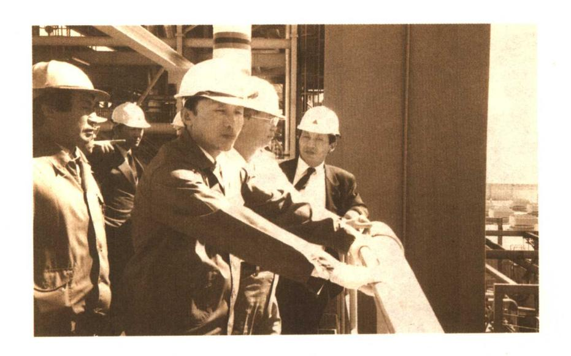

1990年在施工现场

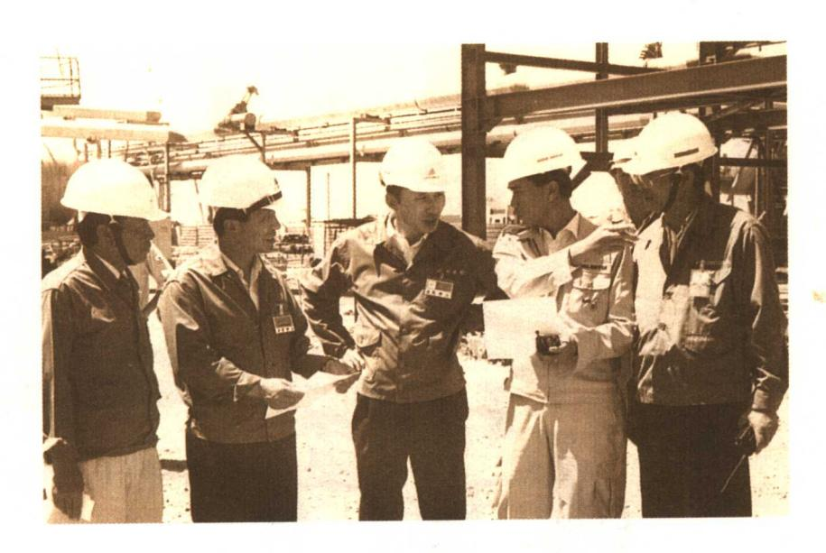

{83}------------------------------------------------

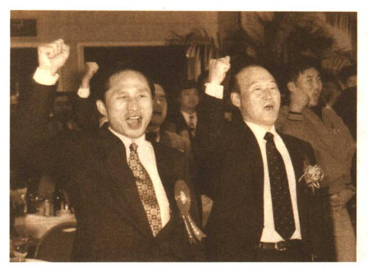

与现代会长郑世永在一起

### 在现代时期

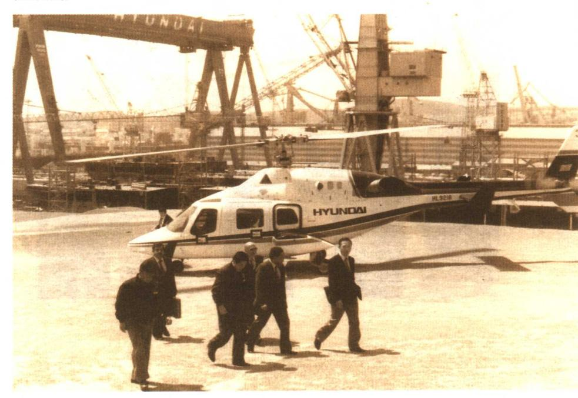

{84}------------------------------------------------

# 海外攻坚战

无论国家还是个人,没有挑战精神,就不会有长足的发展。

如果说我和别人有什么不一样的话,那就是别人放弃的时候

要想说服别人,需要真心和真话。我没有放弃,而是选择再次挑战。

忘记失败教训,就会再次失败。

57 mo

{85}------------------------------------------------

### 抢滩伊拉克

1978年,现代集团经过周密筹划,成功登陆伊拉克建筑市场。 当时,伊拉克的建筑业正处于萌芽阶段,市场前景具有极大吸引力。现代集团的全甲元副社长带领的伊拉克订单组参与了伊拉克第二大城市巴士拉的污水处理设施第一阶段工程的国际招标会,并以最低报价成为最后的赢家。在欧洲竞争者林立的局面下,韩国企业只有打价格牌才有可能脱颖而出。这是打入伊拉克市场不得不付出的代价。

虽然"现代"通过艰苦努力凿开了通往伊拉克市场的第一道门,但接下来的道路却是荆棘丛生。由于当时韩国和伊拉克还没有建立外交关系,技术人员和技工的出入境及人身安全保障问题成了工程建设的一大障碍。为了保住这好不容易挖到的"第一桶金",我们必须探索出一条适用于伊拉克这一特殊市场的商业新路。

作为承接公司的代表,我也必须绕道科威特才得以进入伊拉克。我们在巴格达停留了许多天,利用一切线索多方活动,希望能与伊拉克政府取得联系。

一天,一位当地人对我说:"你去试试看,能不能见到巴格达 市长瓦拉布。没准他愿意见你呢。"

面见瓦拉布谈何容易。几次面谈申请都石沉大海。我恳切地拜 托市政府的翻译员:"请转告市长,让我见他一面吧。请不要把我 看做韩国的企业代表,就说是一个从东方来的、喜欢年轻革命者 的人,急切渴望能见他一面。"

伊拉克在工程订单运作方面是个极为特殊的国家。公开或暗

{86}------------------------------------------------

地里的贿赂在这里是行不通的。要想见到清廉的国家高官,诉诸 "性情"或许还是一条有希望的途径。

终于,瓦拉布同意接见我们,但只有10分钟时间。市长办公室整洁而简朴,瓦拉布本人虽不是军人,却穿着标准军服、配着手枪。

"市长先生,听说您为了革命事业鞠躬尽瘁,实在令人敬仰。在 我看来,身为大丈夫,即使为国捐躯也是一大幸事,您说呢?"

"是啊。"

瓦拉布接过话来,"我一天就睡三四个小时。每天的工作堆积 如山,实在觉得时间不够。"

"我也是从来没睡过五个小时以上。在这一点上我和您还有些相似之处。"

"哦?你一个商人,每天也只睡三四个小时?"

瓦拉布表示出了兴趣。原定的10分钟飞快地过去了。

"我的祖国很穷,到现在还没有完全从困难中解脱出来。为了 富国强民、促进经济发展,我觉得睡觉实在是件奢侈的事情。我 虽然在企业工作,但是对资本主义国家来说,企业是国家命脉所 在。为企业奋战,其实也就是为国家奋战。我个人从小就在贫困 的环境中长大,在艰难的成长过程中,我意识到摆脱贫穷不仅是 我个人的生活目标,也是我们整个国家的使命。我们在走出落后 的道路上积攒了很多经验,也希望能用这些经验在为贵国发展出 一份力的基础上实现互惠互利。目前,我们已经争取到了贵国的 一项建筑工程,但是苦于种种限制,工程进展一再延误。和欧洲 企业相比,我们更崇尚正直与勤奋。希望我们能像朋友一样友好 相处,齐心协力从贫穷中站起来。像你们这样清廉的公职人员,我 在中东还是第一次见到。我非常希望能和你们这样的朋友合作。"

瓦拉布松开腰带上的配枪,让我坐在离他稍近的地方。接下来,我向他汇报了现代建设的工程业绩和中标细节,他听得非常

{87}------------------------------------------------

投人。过了一会儿,他把秘书叫进来,指示说还想再聊一会儿,不 要让别人进来。

最终,原定的10分钟一直延长到2个小时。我们对国家的认识、对事业的热情、对中东和亚洲的历史以及个人经历方面都有很多相似之处,甚至有一种相见恨晚的感觉。我问他,下个月我来巴格达时能否再见到他,他爽快地答应了。

回到国内,与瓦拉布会面的兴奋感尚未散去,现实的困难已扑面而来。赴伊工作人员的签证需要10天到1个月,而且还不能办理团体签证,必须逐个审批,程序极为繁琐。这使我们的工程项目陷入了危机。

我只好重返巴格达,申请与瓦拉布市长面谈。他答应在当天中午12点约见我。

在巴格达市内的一家高级俱乐部里,我和瓦拉布一边用餐,一边聊着他感兴趣的与韩国经济开发模式有关的话题。突然,他对我说:

"我们伊拉克和朝鲜走得很近,你在这里活动肯定会遇到很多 困难,你自己要多加小心。"

这句话恰好启开了我的正题。我顺势道出了苦衷:

"现在我们遇到了一个大难题,就是施工人员进不来。我作为 社长,从科威特入境伊拉克就得花4天时间,我们的一个普通工人 甚至要花1个月的时间,这必然会影响到工程的进度。我们急切地 希望能解决这个问题。"

- "那你说该怎么办呢?"
- "如果能团体签证就好了。普通工作人员团体人境也是国际通行的一种惯例。"
  - "好,你把相关文件提交上来。"

事情终于有了眉目!

第二天, 我便接到了瓦拉布的电话。

{88}------------------------------------------------

"我们外务部答应向你们公司的工人提供特殊方便。"

在瓦拉布的帮助下,我们的工作人员顺利获得了赴伊团体 签证。

一个月后,我第三次进入伊拉克,和瓦拉布约好了在一家高级餐厅见面。那天,他向我介绍了他的两位朋友。一位是伊拉克住宅建设部部长,另一位是商工部部长,都是伊拉克政界举足轻重的人物。

"这两位都是我兄长一样的朋友。你要想在这个国家工作,他 们的支持是很必要的。"

瓦拉布的善解人意令我心存感激。

两位部长对我颇有好感,很快我们就像老朋友一样聊了起来。 住宅建设部部长是我们工程的最高负责人,商工部部长也对现代 集团表示出兴趣,他尤其关心发电站方面的施工能力。后来,两

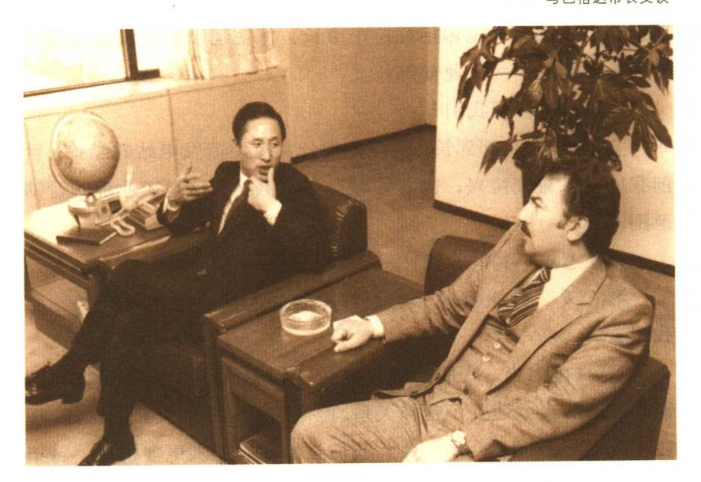

与巴格达市长交谈

{89}------------------------------------------------

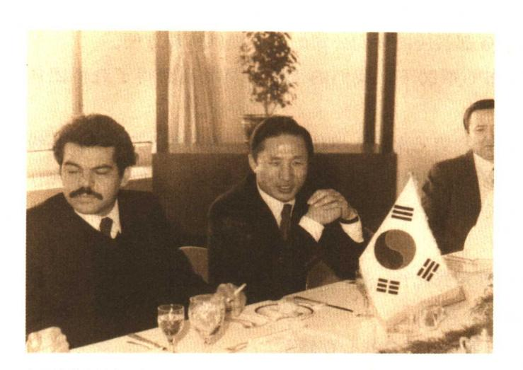

与巴格达市长在一起

位部长先走一步,剩下瓦拉布和我两人,我借机提到设立领事馆 的可能性,瓦拉布脸色微变,我连忙收住了话题。

又过了一个月,我第四次来到巴格达。商工部部长送来了宴会请柬。当晚的客人也包括瓦拉布市长、住宅建设部部长以及他们的另一位朋友——矿业部部长。

瓦拉布笑着帮我引荐:

"这位是矿业部部长。听说你们公司有建造发电站的经验,目前我们国家百废待兴,需要筹建很多发电站,这是矿业部的管辖范围。"

真是意想不到的收获!

第二天,我便收到了矿业部部长的邀请。他语重心长地对 我说:

"到目前为止,我们已经和日本、英国、德国、法国等发达国家的政府或企业建立了合作关系。但他们不是我们真正的伙伴。现在,我们想和你们合作。今后我们会给你们提供更多机会,希望

{90}------------------------------------------------

你们和其他国家的企业堂堂正正地竞争,并争取获得胜利,"

不久,现代建设获得了投资高达7.2亿美元的伊拉克"阿姆莎伊"火力发电站的建设工程。在此前的竞标过程中,我们和日本企业展开了激烈的竞争。说实话,对于如此大规模的火力发电站工程,现代建设当时的能力是稍有欠缺的。伊拉克方面也了解这一点,但指点说:"你们可以从日本那边购买器材,工程设计也可以寻求他们的帮助,这样你们就可以顺利完成工程建设。"

伊拉克之所以将国家大型项目交给我们建设,最重要的考虑 自然是国家利益和民族自尊心,但我和他们的友谊也有一份功劳。 住宅建设部也和我们签订了8.2亿美元的住宅园区工程合同。

### 撤离巴格达

在伊拉克的某一天, 瓦拉布市长颇为神秘地让我坐上车, 说要给我介绍一个人。汽车径直朝着总统府方向驶去。

"此人是主管我们国家经济政策的关键人物。其身份虽然是副 首相,实则是第二位实权人物。"

我有些紧张地问瓦拉布:

- "我什么也没准备啊,跟副首相说什么好呢?"
- "上次你不是跟我提过设领事馆的问题吗?见机行事吧。"

进到副首相办公室,没想到电视台的摄像机已经在那里候着了。于是,在当天晚上的新闻里,出现了我和副首相握手的场面。 礼节性的问候之后,副首相先开口了:

"你是我接见的第一位外国建筑企业家。听说你们很想在建筑 领域与我们合作,只要努力就会有成果的。" 

{91}------------------------------------------------

"我们一定会努力的。但为了工作,我想请求您一件事情。" "什么事?"

"为了能保质保量地按时完工,我们需要把很多工人陆续送到这里的工地。但是,因为我们韩国和贵国还没有建立外交关系,出人境非常麻烦。为了方便工程建设,能否制定相当于领事业务的某种措施?"

副首相的脸沉了下来。

"这个问题我们需要慎重考虑。"

虽然不是同意,但也不是拒绝。只要有一线可能,就应该努力 争取,这是企业和外交活动的基本战略。

事后,我又和瓦拉布商量这个问题。瓦拉布考虑了很长时间, 说了这么一句话:

"你给我们出了个大难题,如果问题解决了,'现代'以什么方式表示诚意呢?"

事情由此出现了转机。

我连忙说:

"我们生产汽车。我们愿意赠送50辆现代公司生产的汽车。"

我之所以提议赠送汽车,是因为我想到,如果大韩民国生产的 汽车能在巴格达市内奔跑,对两国经济合作也会起到一定的促进 作用。

但瓦拉布否定了我的提议。

- "汽车我们不缺。你们公司生产小货车吗?"
- "当然。"
- "那就送小货车吧。设立总领事馆的问题我来想办法。" 我紧紧握住瓦拉布的手。
- "谢谢你,兄弟!我一定尽我所能为伊拉克的建设事业出力!" 回国后,我立刻向青瓦台递交了报告。考虑到我国政府和美国 的关系,可能不允许我们赠送小货车,所以我在报告中特意强调

{92}------------------------------------------------

了建交的可能性:

"为了方便工程建设,伊拉克方面初步同意设立总领事馆。以 此为契机,或许有可能实现建交目的。"

心急如焚地等了一个星期,终于收到青瓦台的答复:可以赠送小货车!现代汽车公司立刻另设生产线,紧急制造特殊的小货车,并以最快的速度通过科威特直航船运抵伊拉克。赠送仪式盛大而热烈,感觉建交已指日可待。

回到首尔后,中央情报部的一位高层人员找到我,说:

"估计很快,我国就会和伊拉克建交。此前,我们情报部一直通过科威特大使馆进行建交努力,也取得了很大进展。这件事应该由两国政府通过公开途径进行,所以希望民间企业不要再介入了。"

几天后,外务部的高层人员也打来电话,说此事一直是外务部 在力促,请现代公司不要插手。

我无话可说。其实,我根本没有刻意地去做什么。所有的一切 只是在为现代建设开拓海外市场的努力中得到的意外收获而已。

不管怎样,韩国最终和伊拉克建立了领事关系。从那时起,韩国的其他企业像潮水一般涌向伊拉克,掀起了建筑业"中东之梦"的第二波高潮。

然而,正所谓世事难料。就在第二年初,发生了"伊斯兰革命",接着1980年9月,"两伊战争"爆发,并开始了消耗性的持久战。韩国企业不得不退出了艰难开拓的伊拉克建筑市场。

由于战争爆发,工程款被拖欠,现代集团遭受了损失。国内开始盛传"因为伊拉克工程,郑周永会长和李明博社长最终走向决裂"。

事实上,郑会长和我从来没有为某件事情而争吵或表现出敌 对状态。只不过,两人之间弥漫着凝重而冰冷的空气,久久难以 消散。

{93}------------------------------------------------

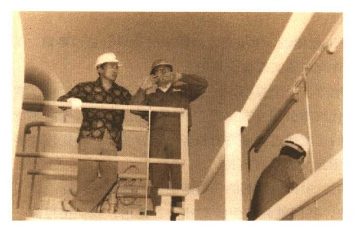

1970 年在 沙特阿拉伯

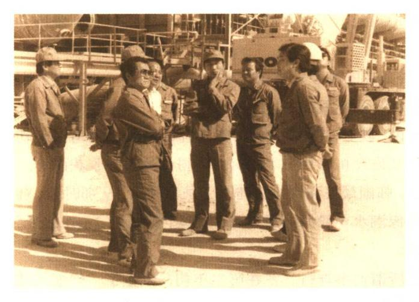

1982 年在 沙特阿拉伯

有一天,我认识的一位政府官员想约见郑会长,请我帮忙搭一下桥。因此,我和郑会长很久以来第一次,有了共进晚餐的机会。 饭到中途,那位政府官员突然冒出一句话:

"郑会长,李社长是我非常尊敬的一个人,请您多多关照他。" 我的这位朋友并不知道我和郑会长之间关系的微妙变化,他 这么说或许只是出于对我帮忙安排会面的感谢,或者是对德高望 

{94}------------------------------------------------

重的郑会长的礼遇之辞。但不管怎么说,在当时听来,确实有些 唐突。郑会长的反应很激烈:

"这个人即使倒下了、被掐住了脖子,也不会告饶的。关照的话何从谈起!"

我一时有些震惊,但也只能尴尬地笑笑。

和郑会长的冷战最终还是在伊拉克解开了。

1982年12月,郑会长和我一起去了硝烟弥漫的伊拉克。我们在科威特机场上了一架旧飞机。不仅要一一接受安全检查,还要亲自把个人行李搬到货物间。由于飞机太过陈旧,中途几次起落,好一阵颠簸折腾。

在巴格达,郑会长见到了我的几位老朋友,也冒着生命危险去 巡查了现代建设的工地。在炮火射程内奔走,郑会长毫无惧色,展 现出将军一般的风度。

一旦看到不满意的地方,他就大声训斥对方:"把辞职书给我

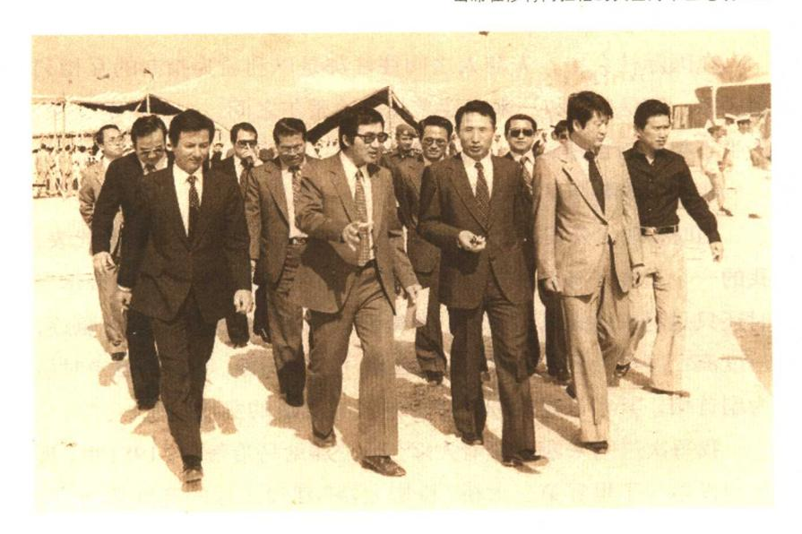

出席在沙特阿拉伯的美国海军基地竣工式

{95}------------------------------------------------

### 递上来!"

我们离开伊拉克的前一晚,各个工地负责人聚集在巴格达,在这危险重重的异国他乡,酣畅淋漓地喝了个通宵。

我对郑会长说:

"把那些辞职信都还给他们吧。"

"好吧,都退给他们吧。"

那天,我们一直喝到凌晨3点。

4点,汽车驶向科威特。从巴格达到巴士拉的路上要经过10个小时的边境线,那一段是战火最猛烈的地区。在轰隆隆的炮火声中,我们像勇士一般,飞驰在一望无际的沙漠中。

从伊拉克回来后,我和郑会长之间的关系恢复了正常。毕竟, 需要我们携手面对的工作太多了。

### 马来西亚的启示

在国际社会中,人与人之间往往都是以利益为指向的互相利用关系。但是,我和马来西亚首相马哈蒂尔之间,由于长期交往, 产生了类似与巴格达市长瓦拉布的那种兄弟情谊。

我和马哈蒂尔的初次见面是在70年代末。

当时,现代公司正在马来西亚建设一座水坝。作为企业代表,我的一个重要任务就是结交工程所在国的高级官员。马哈蒂尔当时还只是马来西亚的副首相。他曾因政见不同,遭到当权者驱逐,一度流亡国外。后因民怨沸腾,首相才准其归国。因此,他当时虽为副首相,其实只是虚职,手中并没有真正的实权。

我每次进马来西亚政府大厅,必去拜见马哈蒂尔。1981年,现 代建设参与了世界第三大桥"槟榔大桥"建设工程的竞标活动。马 

{96}------------------------------------------------

来西亚对这座大桥的期望很高。从计划到完成花费了 20 年之久, 工程费用超过 3 亿美元。早在 60 年代末,我在参与建设泰国高速 公路工程时,就听说马来西亚计划建一座总长 14.5 公里的大桥。 没想到十多年后,我们竟然与这座大桥如此接近。在伊拉克受创 之后,现代建设对"槟榔大桥"工程寄予了极大希望,把全部力量 都投入到了这次竞标之中。

参加竞标的共有17个国家的41家公司。最有实力和我们竞争的是日本的丸红公司和法国的伯纳德公司。第一轮竞标结果:法国伯纳德第一,韩国现代第二,日本丸红第三。

随后,三家公司展开了决斗。

法国伯纳德的竞标价格比较低,但与其相比,我们的优势在于 工期短。于是,我们抓住这一优势向马来西亚当局提出,如果大桥 竣工早,收取过桥费的日期就能提前,由此可以获得更多利润。

但是,面对资金实力雄厚的日本丸红,我们该如何应战呢?日本政府和驻马大使馆全力合作,多方积极活动。基于资金实力,他们提出向马来西亚提供长期的低息贷款,同时还公开了现代建设以往工程中的失败案例。势在必得的丸红公司早已打通政府要害部门,我们则是四处碰壁。我唯一能接触到的政府高官就是副首相马哈蒂尔。

"你知道我没有能力帮你,为什么还来找我?"

第二次见到他时,他这么问我。

我故意开起了玩笑:

"回到公司总部后,我得报告都见到了谁。因为日本公司从中作梗,我们见不到有决定权的首相,如果我说见到了副首相,总部至少会认为我们和实权者接触过。"

马哈蒂尔笑了。

"你任何时候都可以来找我,但你得给我讲讲韩国的事情。" 从那时起,我们经常见面,谈得十分投机。他对韩国现代史相 

{97}------------------------------------------------

当了解、尤其关注我们的新农村运动。

"我认为,韩国产业化成功的主要原因,在于有新农村运动这样的精神激励着。现在的马来西亚正需要这种勤劳与自助精神。"

马哈蒂尔的信念是,如果不改革依赖性和惰性,马来西亚就难以发展。他之所以关注韩国,也是出于这个原因。我和马哈蒂尔经常在一起讨论各种问题,有时,我也毫不客气地向他提出忠告。

但是,对于"槟榔大桥"工程,马哈蒂尔只能对我说:

"很抱歉帮不上忙。"

我在无奈中回到了首尔。

1981年春,我在韩国听说马来西亚国内发生民族纠纷,政治局势大变。我再次赶往马来西亚。

下了机场,我无意中买了一份报纸,惊讶地看到原首相突然辞世的消息。谁会接任首相呢?

我马上打电话给副首相秘书,申请与马哈蒂尔面谈。在这个非常时期,马哈蒂尔还能接见外国企业人士吗?意外地,马哈蒂尔答应见我,但没有约在办公室:

"我马上要去新加坡,所以没有时间在办公室见你。我去机场的路上要回家换一下衣服,你去我家等吧。"

我连忙赶往副首相府,和夫人聊了一会,马哈蒂尔就进来了。"报纸上的新闻是真的吗?您会出任首相吗?"

"等我从新加坡回来,谜底自然揭晓。"他的语气中充满自信。 我很想问一问"槟榔大桥"的竞标事宜,但始终没有找到机会。 那天下午,一切尘埃落定,马哈蒂尔被推举为新一任首相。

而我,还得继续为"槟榔大桥"工程四处奔走。

对马哈蒂尔领导下的新内阁来说,选择哪家企业承接"槟榔大桥"建设工程,其运作方式必然与过去的政权有很大区别。收受政治资金是根本不可能的。马哈蒂尔的想法是:对于政权、公务员、企业等整个社会存在腐败现象的马来西亚来说,要想改变社

{98}------------------------------------------------

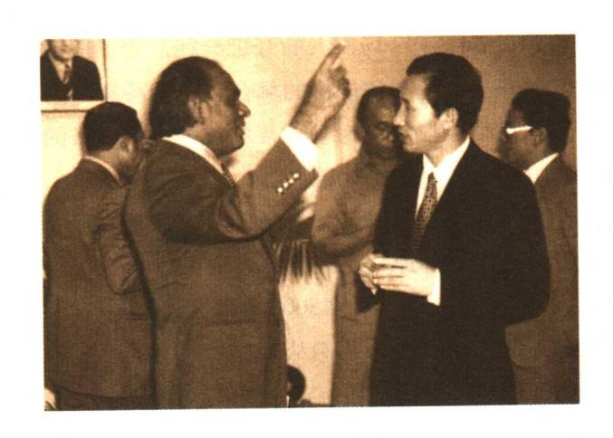

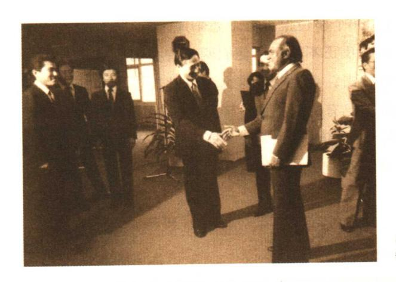

出席马来西亚槟榔大桥 签约活动

会面貌,必得从政府开始实施廉政建设。

现在我们要做的,就是强调现代建设的优势与诚意,努力说服 马哈蒂尔的改革内阁。对于法国伯纳德公司,我们依然采取了缩 短工期可以增加利润的对策;由于被牵涉进原政权官僚的调查案 件,日本丸红公司失去了参与竞标的资格。

最终,现代建设拿下了"槟榔大桥"建设工程。

{99}------------------------------------------------

1982年初,现代建设筹备了一场盛大的开工典礼。为了搭建一个和韩国总统出席的开工典礼同样规格的舞台,我们特意从国内请来了有关专家。舞台中央摆放了为马哈蒂尔首相夫妇准备的大椅子,上面搭了遮阳篷,地上铺了地毯。

开工典礼的前一天,首相府秘书长和一名警卫人员来到现场 巡查。秘书长看过讲台后吃了一惊,走到我身边说:

"首相的座位上有遮阳篷,但下面的5000人怎么办?"

这回轮到我大吃一惊了。在韩国,我们从来都是只考虑总统的 座位,怎么在马来西亚……

秘书长接着说:

"要么把其他5000个座位上也搭上遮阳篷,要么把首相夫妇座位上的遮阳篷去掉,反正不能只让他们两位待在阴凉里。"

我受到了很大冲击。竟然还有这么为百姓着想的官员!

秘书长提议撤掉已有的遮阳篷,毕竟,在24小时内怎么可能 布置出2000多坪、容纳5000人的遮阳篷呢?典礼筹备小组的讨论 结果也是:不可能。我一边吃午饭,一边苦想冥思。

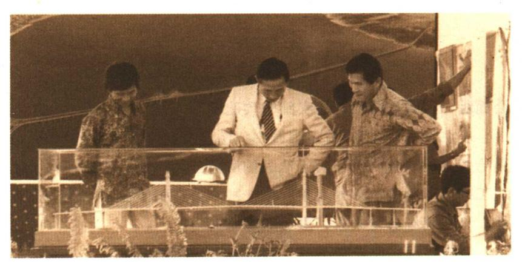

{100}------------------------------------------------

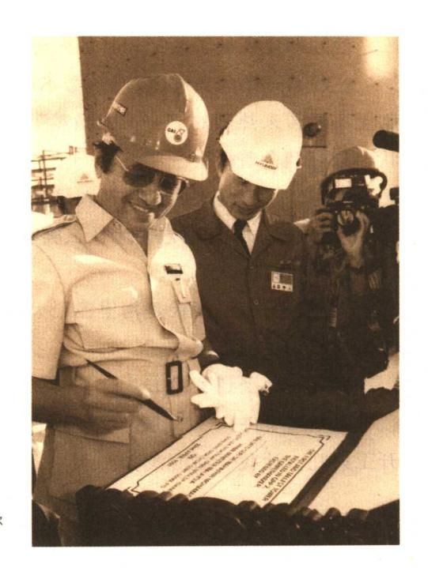

和马来西亚马哈蒂尔首相在一起

"100坪左右的没问题吗?"

马来西亚方面的人回答说,100坪没问题。

"那就找20家公司,每家负责100坪!"

第二天早上7点,"遮阳篷工程"顺利完工。9点,也就是活动开始前的一个小时,秘书长和警卫人员来到了现场。

"李社长,这是怎么回事啊?"

秘书长目瞪口呆。当然,他的惊讶也在我的意料之中。

查看了讲台后,秘书长又把我叫住了:

"这两把椅子怎么这么大?"

"哦,这是为首相夫妇准备的。"

秘书长歪着头看看我,说:

"首相的屁股比别人的大吗?"

{101}------------------------------------------------

他随即让人换了两把和其他人一样的椅子。

在随后开始的典礼上,马哈蒂尔用马来西亚语作了演讲,观众 席上不时传来热烈的笑声。我虽然听不懂,但也不好意思作麻木 状,只好迎合着微笑。

这时, 一位马来西亚管理人员捅了我一下。

"李社长,你知道他们为什么笑吗?"

我又尴尬地笑了笑。

"首相说,韩国现代是阿里巴巴大盗,大家要抓紧向他们学习, 才能早日把他们赶出去。"

我又一次受到了冲击。

遮阳篷事件、"大屁股"玩笑、"阿里巴巴"论……一场短短的 开工典礼,让我受益匪浅。

### 菲律宾闹剧

在马来西亚的胜利喜悦,到菲律宾化为了一腔愁闷。

投资1.5亿美元的菲律宾传输线工程竞标活动发生在马科斯总统夫妇开始流亡的前一年——1985年。和其他所有发展中国家的政权末期一样,当时菲律宾的政治腐败达到了极点。

马科斯和伊梅尔达虽为夫妻,却各有一方势力,其目的只是为了更多地收受贿赂。作为外国企业来说,很难判断站在哪边更有胜算。

在传输线工程竞标活动中,现代建设又一次遭遇了"宿敌"日本丸红公司。菲律宾建设市场进入"马科斯"时代后,基本上是由日本企业独霸市场。丸红公司在菲律宾获得过很多大项目,与菲律宾政要的关系十分密切。

{102}------------------------------------------------

第一次竞标结果是:韩国现代第一,日本丸红第二。最终的决战也在双方之间展开,简直就像"槟榔大桥"工程竞标的翻版。

但这一次, 胜利不属于我们。

我们通过马科斯总统的亲信多方活动,日本丸红则与伊梅尔 达的亲信通力合作,彼此之间都很清楚对方的情况。当时菲律宾 的公务员只要给钱,就能拿出重要文件。

为了指挥这次竞标活动,我和现代集团负责电力部门的副社 长一起跑了五六次菲律宾,结识了一些政府官员。每当这时,我 便亲眼目睹腐败的政权如何置千万国民于水深火热。腐败的政府 如何能带领落后的国家走出贫穷呢?

对于这次运输线建设工程的输赢结果,马科斯的一名亲信曾 经这样对我解释:

"只能说,马科斯这次输给了伊梅尔达。"

次年2月, 菲律宾进入了阿基诺夫人政权时代。那一年, 我们拿到了在菲律宾马尼拉建设亚洲开发银行总部的工程项目。在开工典礼后的欢迎会上, 我见到了阿基诺夫人和陆军参谋长拉莫斯先生。他们给我留下了很深的印象。

其他来宾早早地在座位上就座,但是以"新政权掌权者"闻名的拉莫斯却谦虚地坐在最后一排。阿基诺夫人也毫无司空见惯的"总统派头",其身边只有两名警卫同行。

阿基诺夫人在会上作了简短的演讲。之后,她走过来和我打招呼。在礼节性地问候之后,我问她:

"您为什么只带两名警卫?"

在机场目睹丈夫被暗杀之后,阿基诺夫人为什么还能如此豁 朗?

夫人笑着说:"我是为了菲律宾的民主化而竞选总统的。民主 化是菲律宾国民的一致意愿。现在不管谁当总统,民主化是必然 之路。在我们这样一个贫穷的国家,有必要花那么多钱保卫一个 

{103}------------------------------------------------

人的生命吗?"

我向她表示了敬意。

阿基诺夫人离开后, 拉莫斯走了过来。

"在你们韩国人均国民收入只有60美元的时候,我们菲律宾曾经帮助过你们,而现在,我们却成了接受帮助的一方。这都是政治错误所导致的。但现在,我们将重新起步,也许很快就会赶上韩国。"

和拉莫斯的一席谈话让我隐约感觉到,他总有一天会成为菲律宾总统。后来,他果然接任阿基诺夫人当选总统,带领菲律宾走上了经济发展的道路。

### 伏特加的滋味

1988年3月, 我晋升为现代建设的会长, 那一年我46岁。

早在80年代初,现代集团就开始致力于多元化经营。1982年5月,李春林和金永柱分别成为现代重工业和现代发动机的会长。此后,由职业经理人负责集团的一部分,另一部分交给郑会长的兄弟及其第二代负责经营。在我升任会长的前一年,现代汽车的郑世永会长当选为集团会长,郑周永会长作为名誉会长表面上退出了一线,但实际的领导人依然是他。

我在这个职业经理人和郑氏第二代相互交替的时期当上了会长,不得不认真思考自己的处境。我感觉到,该是我离开"现代"的时候了。我不想在"现代"坐享元老级待遇,也不会坐等下一个目标的出现。

我作为企业家在"现代"的最后一个作品,是开拓西伯利亚的冻土地带。

{104}------------------------------------------------

从地理位置上看,西伯利亚距离我们国家很近。我们可以与 隔着太平洋的美国成为友邦,却因为意识形态问题,与近在咫尺 的两个大国对峙近半个世纪,想来实在可惜。

于是,我把目光投向了"北方"。但在当时,韩国与苏联不仅没有建立外交关系,连正式的交流窗口都是封闭的。正在我们摸索接近莫斯科的道路时,日本岩井商社的负责人出现了。

岩井商社是我们在伊拉克建设"阿姆莎伊"发电站时的合作 伙伴,并且因为那次合作对我们产生了很大的信任。

我以一种随意的口气对他说:

"现在在中东也没有什么用武之地,我们需要开拓新的市场。 如果在苏联这样的国家有合适机会的话……"

"你对苏联感兴趣吗?"

"也没什么具体的想法,但是,我们虽然闯荡过零上40度的沙漠,但还没试过在零下40度的冻土地带工作呢。"

岩井商社的负责人很快作出了反应:

"我们在莫斯科有分公司。日本企业中和苏联接触最活跃的就 是我们了。"

我顺着他的话说:

"我想访问一次苏联,你看有什么好的办法吗?"

"这个恐怕不太容易。如果苏联方面提出邀请就好办了……我们公司和苏联打了很长时间交道,我尽量想想办法吧。"

当然,岩井商社的负责人之所以如此热情地提供帮助,也是因为对他们来说,能和现代建设携手开拓苏联市场将大有裨益。

不过,即使有岩井商社从中斡旋,通往莫斯科的大门依然没有轻易打开。一直到1988年秋天,才终于出现了曙光。从岩井商社那边传来消息:苏联工商会的一位负责人决定在赴日途中到韩国见见我。

那次会面进行得很顺利。苏联工商会负责人对"现代"很感

{105}------------------------------------------------

兴趣,对与韩国的合作也持积极态度。不久,他传来消息说:"邀你访苏一事已有眉目,请递交一份拟来苏名单。"

一直到此时,郑会长对我开拓北方市场的计划还一无所知。在 我向他提起此事后,他最初表现得颇为冷淡,但在一次详谈之后, 他的态度有了转变。

我从做生意的角度向郑会长阐述了开拓北方市场的意义所在:

"苏联是世界上资源最丰富的国家,而我们却是资源最贫乏的国家。到下个世纪,我们必然需要消耗更多的能源。我们可以通过陆路,把那里的资源运过来。至于朝鲜是否愿意提供方便的问题,我想也不必过于担心。朝鲜也急需资源。为了发展,他们不能不给我们开路。另外,站在会长您个人的立场上考虑,这也是大有可为的一件事。开拓北方市场必然会对国家产生深远影响,如果能以此为自己的一生事业画上一个圆满的句号,不是很好吗?"

郑会长终于动心了。

"是吗?那就去看看吧。我喜欢看雪。去那里观赏一下雪景也不错啊。"

国家安全企划部对我们的访苏活动颇为敏感。在接受了相关培训、作出"绝不脱离经济领域"的承诺后,政府才允许了我们的北上之行。

1989年1月10日上午8点,我们在莫斯科第一次见到了苏联政府工商会代表。谈判随即开始。首先由我们提出方案,我们希望苏联政府能够建立韩国企业与苏联进行经济合作的制度,作为第一个项目,"现代"希望能参与开发西伯利亚。

第一次见面就提出成立韩苏经济合作委员会,这确实有些不同寻常。苏联方面感到有些突然。他们强调说,现在对外宣布与韩国企业的经济合作为时尚早。谈判从一开始就陷入了僵局。

中间休息时,我向未出席这次会谈的郑会长汇报了情况。郑会长听了有些灰心:

{106}------------------------------------------------

"我们回去吧。如果谈不成,你就告诉他们我们要回去了。或者,你留下来负责继续协商,看看能不能找到突破口。国内很多企业都希望有个好结果呢。"

我知道, 郑会长在内心里还是想极力促成这次协商的。

但是在谈判桌上,当我表明"谈不成就回去"的态度时,苏 联方面的反应是"想回就回"。第一次协商就这样失败了。

虽然协商进行得并不顺利,但我还是和苏联工商会的首席副会长一边喝着伏特加,一边聊了很久。要想和苏联人打交道,最好能喝伏特加,这一点千真万确。如果哪个外国人很会喝伏特加,苏联人就会把他看做老朋友。那天晚上,我们借着淳厚的伏特加,感受到了彼此的内心。

到深夜, 我又提到了协商问题。

"如果您很难作决定的话,何不让我们郑会长和你们的工商会会长见个面呢?你说会长不在莫斯科,我想,未必如此吧?"

接着,我又强调了这些协商的意义:

"我们郑会长是韩国经济界的元老级人物,担任过10年韩国全国经济人联合会会长,现在还是名誉会长。我本人担任韩国工商会副会长也有13年了。所以,如果和我们达成合作意向,将对韩国企业与苏联的经济合作产生重大影响。即使两国没有建交,通过工商会这样的民间窗口也是有可能促成经济合作的。"

我还列举了韩国企业进军东南亚和中东市场的成功例子,强 调我们会对苏联经济开发提供很大帮助。

"我们是以纯粹的民间组织的身份来这里协商的,没有任何政治背景。请把我的话转告给你们的政府最高层,他们会明白我们的诚意的。"

"明白了。明天再协商一次吧。"

第二天上午,协商继续。到下午,苏**联**工商会方面传来了好消息:

{107}------------------------------------------------

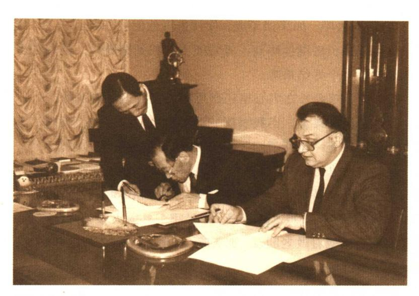

1989 年在俄罗斯

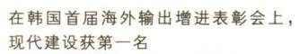

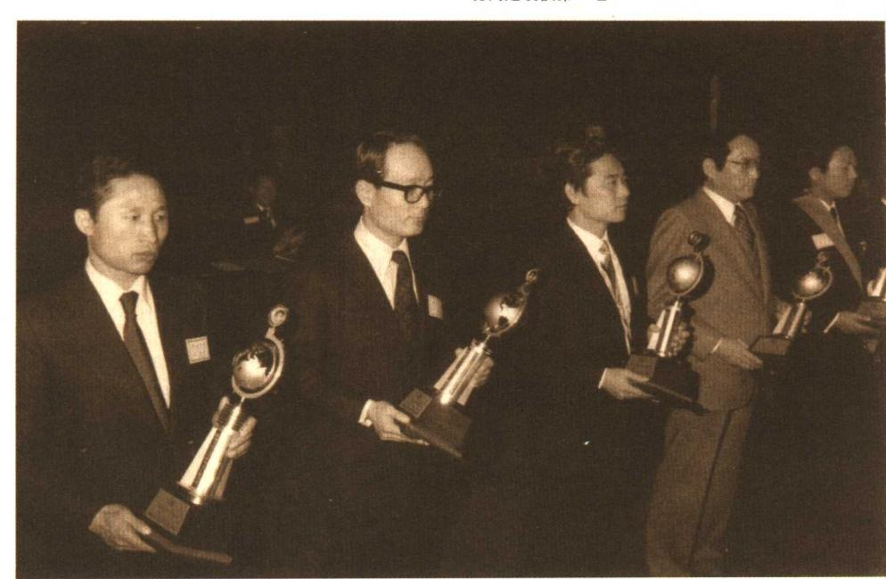

{108}------------------------------------------------

"我们愿意签署协议。举行签字仪式吧。"

1989年1月11日,韩国和苏联交往历史上的第一份正式文件 诞生了。

虽然没有就具体项目达成合作协议,但是,近50年的冰封终于被我们凿开了一个小口子,这已足以让我们欣慰。

从那以后,到1991年,我们对苏联进行了多次访问。在这短短两年间,"现代"在苏联的所有项目计划都是靠我们的两条腿跑出来的。从莫斯科到列宁格勒,从纳霍德卡到雅库特,哪里有投资潜力,哪里就有我们的足迹。

我们的成果也十分可观,先后促成了列宁格勒铝提炼厂、沿海州林山合资公司、石油化学制品合资公司、奥尔加港纸浆公司、耶尔金斯科煤矿开发及铁路建设、雅库特天然气开发等项目。

其中我最关心的就是雅库特共和国的天然气开发项目。

### 在勒拿河上

1990年初,我们访问莫斯科的时候,苏联共产党中央总部第一次招待了我们,并对两国关系和未来前景做了简要评述。当时,苏联共产党中央国际部的负责人说过这么一番话:

"韩国作为新兴国家中经济发展取得很大成功的榜样,很早以前就为我们所关注了。我们调查并掌握了以'现代'为首的'三星'、'大宇'等韩国企业的详细资料。对于和哪家企业进行什么样的合作、能给彼此带来什么样的效果都做出了评估。你们'现代'是以建设和重工业为中心的企业,所以我们认为在西伯利亚的开发,以及一些大型项目中,和'现代'合作是比较合适的。"

{109}------------------------------------------------

那天,雅库特共和国的扎提夫副总理也在场。他向我们介绍了 这个距离莫斯科有7小时飞行距离的自治共和国。

"苏联有这么一个传说:上帝手捧资源绕地球一圈,在世界各地均匀地撒下资源。但是到雅库特上方时,因为天气太冷,手里的资源全部掉落了下来。所以,雅库特有储量丰富的钻石矿、煤矿、金矿、铁矿和多种特殊矿物,以及天然气、石油等等。我们非常期待贵公司能参与我们的开发事业。"

真没想到, 雅库特是如此诱人的一座资源宝库。

"我们一定去拜访!"

当年6月,我们就访问了雅库特。从地图上看,雅库特就在中国的北面。从首尔坐飞机3个小时便能到达。其经度位置和首尔相同,因此和我们属于同一个时间带。虽然雅库特大部分是冰冻地带,但其面积有三百多万平方公里,人口却只有200万。

我们先是到雅库特首府雅库茨克拜见了总理和副总理,然后 直接出发进行实地考察。

第一站是离首府2小时飞行距离的别留斯科市郊的基西尔西罗 天然气田。这座尚未开发的天然气田储量居苏联第二,规模十分 了得。

第二站是达米罗诺依市郊的露天钻石矿。这个钻石矿的规模 仅次于南非钻石矿,附近还有钻石加工厂。

第三站是阿兰市的金矿,然后又参观了规模居世界第一的捏 伦格利露天煤矿。

我们马不停蹄地在这座资源宝库上奔驰,内心的激动可想 而知。

雅库特政府想推介给我们的是离捏伦格利市很近的耶尔金斯 科煤矿。这个煤矿具有很高的经济价值,但还没有被开发。雅库 特政府的计划是与我们合作开发这个煤矿,然后把煤炭出口到韩 国。在运输通路方面,他们的构想蓝图是:把耶尔金斯科铁路和 

{110}------------------------------------------------

西伯利亚铁路连接起来,煤炭经由西伯利亚铁路运到海参崴,从 海参崴运到图们江北边的波西耶特港,然后再从这个港口海运或 路运到韩国。

但事实上, 雅库特最吸引我们的还是天然气。

据说,这里的天然气储备总量为60亿吨,而人口却只有200万,因此资源只能出口。理想的出口地点是哪里呢?雅库特距离欧洲太远,出口欧洲没什么经济价值,但是出口韩国只需要3800公里。为了输入乌拉尔山脉东部的天然气,欧洲建造了6500公里长的管道,相比而言,从雅库特到韩国的3800公里就算不得什么了。

但是,要想将雅库特的天然气送到韩国,还有重重障碍需要跨越。首先,即使和雅库特政府达成了合作共识,还得得到苏联政府的认可。其次,即使最终达成了协议,如何在恶劣的气候条件下工作也是一个大问题。这里的冬天气温低至零下30到40摄氏度,一天24小时处于极夜,而到了夏天,气温又高达零上30到40摄氏度,24小时处于极昼。运输路线的建设也不是短期内就能完成的。

正因为这些恶劣的条件, 很多国家的政府和企业兴奋地来了, 又摇着头走了。但是, 也正因为别人做不到, 我们才有机会一显 身手。

结束考察之后,我们"降落"在了壮阔的勒拿河上。横穿雅库特的勒拿河是苏联三大河流之一,全长4000公里,滋润着西伯利亚冰冻的土地。我们在勒拿河上的进口豪华游轮上,开始了艰苦的谈判。

由于在金融问题上的意见分歧,谈判一度面临崩溃,双方展开了激烈的心理战。经过几轮谈判、反复磋商,最终还是达成了协议。在谈判过程中,虽然为了各自立场进行过激烈争吵、经历了极度苦闷,但在谈判结束后,在轻松的心境下又能互相理解,有

{111}------------------------------------------------

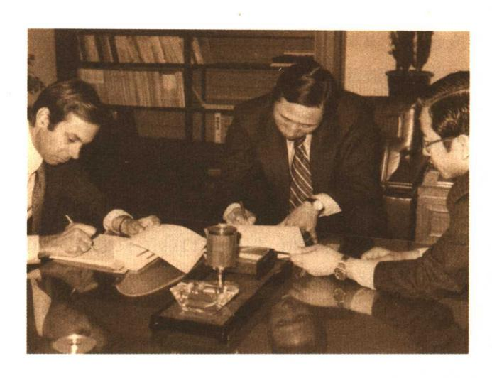

1990 年在俄罗斯

说有笑亲如兄弟。在国际间剑拔弩张的谈判过程中, 偶尔也会出 现这种富有人情味的场面。也许正因如此,人活着才有滋味,人 生才会不断产生希望。

在和雅库特政府就开发天然气、油田、煤矿等内容达成共识之 后,我们马上飞到莫斯科,和苏联政府达成了协议,并在莫斯科 河上举行了签字仪式。

可惜的是,后来因为种种原因,这些项目一直停留在初级阶 段。但我相信,今后一定会再有人站出来,以长远的眼光和非凡 的胆识,担负起这一重任。

### 走讲克里姆林宫

1991年, 我第七次访问苏联。一到莫斯科就接到消息说, 戈尔 巴乔夫的经济顾问佩特罗科夫紧急召见我,而且要我一个人前往。

{112}------------------------------------------------

我急忙赶到克里姆林宫的佩特罗科夫办公室。他一见我,就问: "你们想不想见戈尔巴乔夫总统?"

"当然想!拜见总统是我们的一大心愿。关于我们在苏联的计划,我们也想听听总统的想法。"

他既然试探我们的意思,之前戈尔巴乔夫总统一定就此事与 他交流过。

"你们先拟一份拜见总统的名单,但是一定要保密。"

离开克里姆林宫后,我把这件事报告给郑会长。郑会长兴奋 地说:

"我们先准备一下见到总统后要说的话。把KBS驻莫斯科记者团也叫上吧。你去交涉一下,看能不能带上记者。"

第二天早上, 佩特罗科夫又让我单独去见他。

"明天下午5点到克里姆林宫与总统会面。最终名单是郑周永、 李明博、以及韩方翻译一名。请事先告诉我翻译的名字。"

事情到这里还像是一个突如其来的惊喜,但接下来就开始了 诸多不顺。

在这次突发事件之前,为了协商有关出口俄罗斯问题,我们曾 经申请拜见俄罗斯共和国总理。现在,俄罗斯方面答应会面,并 将时间定在我们与总统约见时间的前一天下午2点。

因为时间比较充裕,我和郑会长,还有"现代"莫斯科分公司的负责人一起去拜见了俄罗斯共和国总理。会谈进行得很顺利,我们就"现代"向俄罗斯共和国提供消费品、俄方用原材料偿还达成了共识,并签署了协议书。两国的电视台拍下了这一镜头。

问题就出在那份协议书上。

协议书内容中包括的原材料有石油、天然气、黄金等主要的地下资源,而这些是属于苏联政府直接管辖的。对此我们一无所知。

第二天早上,佩特罗科夫紧急召见我。我突然有种不祥的 预感。 

{113}------------------------------------------------

"你们犯了一个严重的错误。你们违反了我们国家的规定。会见总统一事取消!而且今后,我们也不会再支持你们的活动了。" 真是晴天霹雳!我赶紧解释:

"我们根本不知道有这样的规定。要说错误的话,也应该是明知如此、还和我们签订协议的俄罗斯共和国犯了错。不见总统可以,但今后不支持我们活动的说法我们不能接受。"

"我们已经决定了。你请回吧。"

在得知会见总统的活动被取消时,郑会长非常失望,回宾馆后就把房门锁住了。

当时,苏联联邦总统戈尔巴乔夫和俄罗斯共和国总统叶利钦 之间的裂痕已经到了无可挽回的地步。我们无法预知事态的发展, 也找不到切实的解决方法,结果身不由己地卷入戈叶斗争,成了

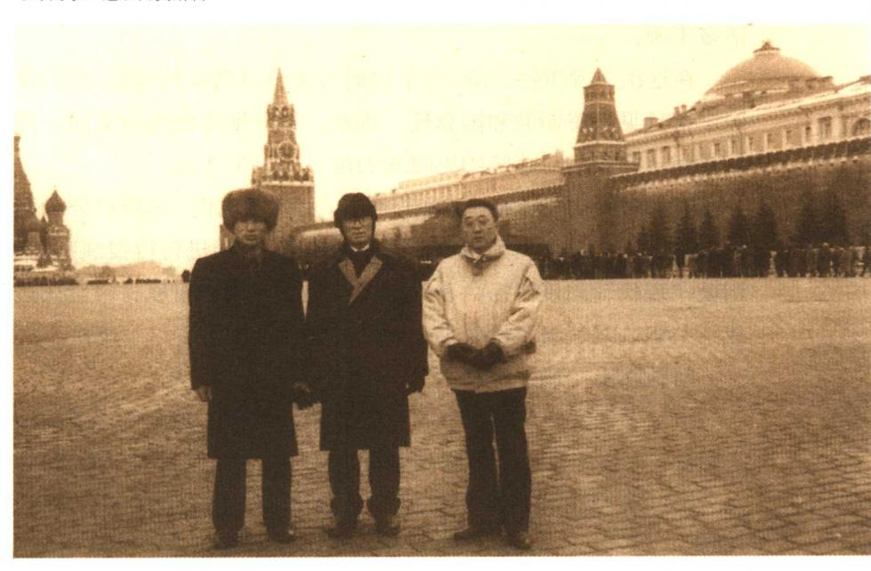

{114}------------------------------------------------

牺牲品。

难道我们艰难开拓出来的北方之路就这样被封锁了吗? 还有没有说服佩特罗科夫的办法?

我几次请求面见佩特罗科夫,都被冷冷地打了回来。

最后一次, 我让人传话进去:

"我们就要回去了,最后想说上几句话。"

下午5点,佩特罗科夫的办公室门终于打开了。

我抓住最后的机会开始申诉:

"从结果看,我们确实违反了联邦政府的政策,但'现代'绝对不是故意为之。您作为实际执行'新思维改革'的负责人,为苏联、也为我们指明了方向。这段时间您为撮合我们的投资意向和苏联的经济发展相结合做了很多事情,现在,您却因为我们不懂苏联的国内规定,就把前一段时间的努力全部否定了。这对我们双方而言,都是不公平的。"

看到佩特罗科夫在认真倾听, 我又接着说:

"我非常真诚地向您呼吁,不能拜见戈尔巴乔夫总统是我们的一大损失,但是对苏联来说,这也将是一大损失。我们为什么要让双方都承受这种损失呢?"

佩特罗科夫没有说话。

他想了一会儿,起身走出办公室,让我们在那里等着。

似乎过了很长时间,佩特罗科夫回来了。他递给我一份文件,说:

"我明白你的意思。我们有一个提议:你们以这个内容和塔斯 社开个记者招待会。"

他所指的"这个内容"是指:"现代"因不了解苏联政府的规 定而签订了错误的协议,所以要撤销此协议。

佩特罗科夫说,等这一内容对外报道之后,他们再重新决定相 关事务。我们被推进了一个政治斗争的旋涡,但我们无法知道今 

{115}------------------------------------------------

后谁将得势,我们不能草率地倾向哪一边。

我决定召开记者招待会。记者由佩特罗科夫指派。我们重新约定第二天下午5点拜见戈尔巴乔夫总统,作为前提条件,记者招待会的有关文本必须在那之前登上报纸。

第二天一早,塔斯社的记者来了。我介绍了这次事件的前因后果,但我修改了佩特罗科夫交给我的文本中的几个地方。我必须同时考虑联邦政府和俄罗斯共和国两方面,因此加了几句如"我们不是撤销这个协议"、"只是双方签订的合同效力很难得到保证才出面澄清"之类的表述。

上午就见报了。佩特罗科夫打来电话说要见我,我又不得不解 释修改文本的原因。

"您让我撤销协议,可是我想,合法签订的协议才称得上撤销。

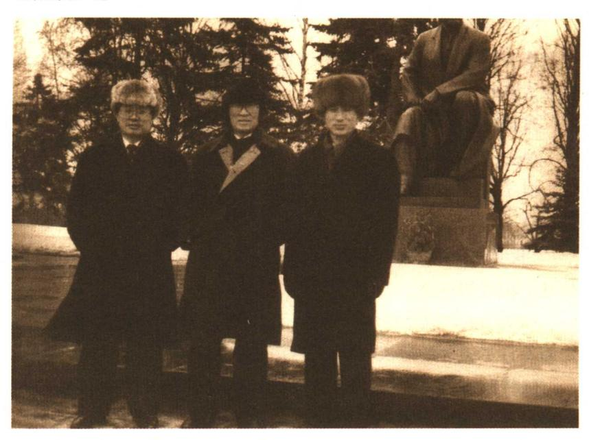

{116}------------------------------------------------

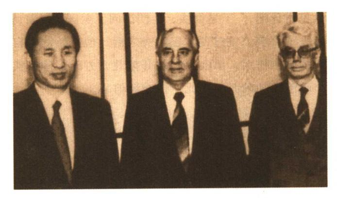

与戈尔巴乔夫一起

我们之前的协议本身就违反了规定,是无效的,比起'撤销'这个词,'没有效力'的说法更加强硬。"

佩特罗科夫点点头出去了……回来时一脸笑容。

"好吧,按照计划5点会见总统。"

我征得佩特罗科夫同意后,给郑会长打了个电话,趁着气氛融 洽又提了一个要求:让KBS驻莫斯科记者随行。佩特罗科夫显得 很为难,但最后还是勉强同意了。

那天下午,我们终于见到了戈尔巴乔夫总统。

那次会面给我留下印象最深的,是戈尔巴乔夫的坦率。

"200年前,俄罗斯一位著名学者说过:'俄罗斯的发展在于远东地区。'而苏联要发展远东地区就需要和临近国家进行合作。我们希望韩国在这方面能够发挥重要作用。"

"韩国和朝鲜在分裂之前是拥有相同文化和语言的同一民族。 什么时候如果韩国和苏联建立了外交关系,在经济领域实现合作, 也可以分给朝鲜一些胜利果实。对此,苏联具有道义上的责任。"

这些话让我们产生了共鸣。与戈尔巴乔夫总统的会面十分成功,尤其是郑会长,似乎找到了很大的信心。他说:"我们趁热去

{117}------------------------------------------------

见见布什吧。"于是很快,他便访问了美国,接着访问了中国,最后去了平壤。见过戈尔巴乔夫之后,他开始认为自己能够起到很大的政治作用。事实上,在开拓北方方面,他确实走在了韩国各个政治家的前面。为此,他充满信心。

{118}------------------------------------------------

空有梦想、没有行动,那是白日梦;没有梦想、只知工作,那

女丽な人の事情が又何尝不是噩梦!

给普通人以希望,并帮助他们实现梦想,这就是我理想的生活。做有意义的事情就能感觉到幸福。

我想做杰出企业家出身的杰出政治家。

57 000

{119}------------------------------------------------

### 轩然大波

1991年夏天,关于郑周永会长参政的消息已经传得满城风雨。 他执意要动员自己的人脉,组织一个名为"国民精神运动本部"的 非政治团体。

有一天,他对我说,想把我的名字列人发起人名单。我欣然同意了,还推荐金寿焕枢机主教、韩景职牧师等人加入,当时我根本没有多想郑会长的真正用意是什么。

没想到第二天,郑会长突然对我说:

"要报效国家就得直接干,光搞个'国民精神运动本部'恐怕 不行。"

最终,"国民精神运动本部"流产了。

我不能理解"直接干"这句话是什么意思,就连"国民精神运动本部"和秘书室的人也都不明白这句话的真正含义。当然,外部也有很多人对此事表示关注。很明显,郑会长的活动与企业无关,而与政治相关。但那究竟是支持某个政界人士,还是政党的初级阶段,抑或是要直接挑战政权,在当时谁也摸不着头脑。

一直到12月,我们才知道郑会长在组织一个政党,也听说 政府和国家安全企划部对此密切关注。就在这时,郑会长把我 叫去说:

"我已经通告政府了。"

新政党已经成立,事态已经无法挽回。我该何去何从? 郑会长让我当场作决定。

当时,如同郑会长进人政界的传言一样,我将就任第14届国会议员的说法也传开了。郑会长也曾表示过对我的支持。虽然我

{120}------------------------------------------------

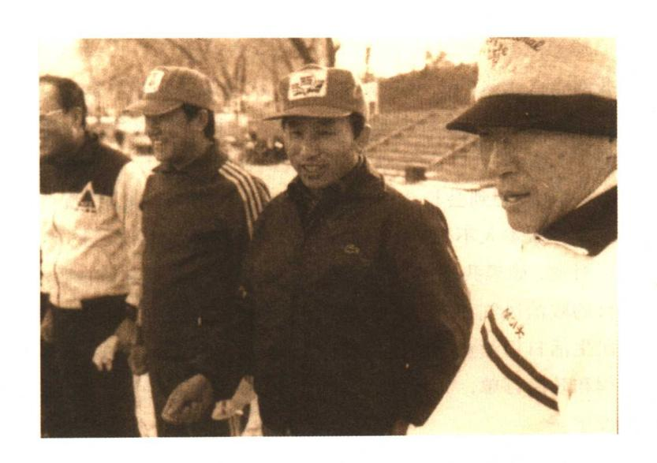

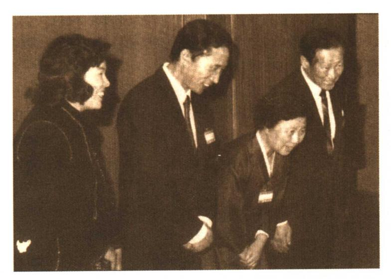

与郑周永在一起

{121}------------------------------------------------

已猜到他的态度变化一定与他的政治活动有关,但当这些问题和 我对个人未来的设想发生冲突时,抉择变得如此困难。

"李会长,你是要做无党派人士,还是和我合作,快作决定吧!"

"我没想到会长会以这种方式参政。这样一来,情况会变得很复杂。我本人不想参政,我也没有必要参政。会长创立新党作为反对党,如果我也参加,下面的社长、部长也都出马的话,我们社会的政治风气和现代集团的形象会变成怎样?我们集团内生产国民生活日用消费品的企业很少,母公司现代建设主要依靠海外工程和政府订单,如果贸然介入政治,一旦出了问题,后果将不堪设想。"

郑会长既已表明参政立场,我这个下属紧随其后似乎是顺理. 成章的事情。听到我的反对意见,郑会长非常不快。

"你瞎操什么心?就算倒闭,也是我的公司倒闭,我说可以就可以,你有什么可担心的?"

"会长,这个公司在法律上是您的公司,但是和其他每一个'现代'成员一样,在精神上我也把自己看做公司的主人。从我第一天进公司,我就没把'现代'当做别人的公司,而是当做我自己的公司,寄予一生的希望才走到今天。我就是站在这个立场上跟会长说刚才的话的。"

说这番话的时候,我心底感到一阵空虚。我隐隐感觉到,企业 主和职业经理人之间其实隔着一道难以逾越的墙。

郑会长与卢泰愚政权的经济政策主管的关系十分恶劣,因此 对卢泰愚总统也有诸多不满。我想,他是不是出于逆反心理才有 参政的想法?

卢氏政权末期,当局要求现代集团交付1600亿韩元追缴税金。 这不仅给企业经营增加了负担,也使郑会长感到脸上无光。他认 为,与其交这不明不白的1600亿税金,还不如用这些钱去搞政治, 

{122}------------------------------------------------

也许那样会更有效果。我原以为他只是想援助某些政界人士或政党,没想到他突然说要"直接干",这让我一时难以接受。

我决定劝阻他。

"在候选人中,会长您不是一直说金泳三不错么?如果金泳三 当选,就会形成一个完全不同的文职政府。再说金泳三为人正派, 不会像那些军事政权一样对企业横加干涉。所以,会长您如果支 持金泳三,不就可以满足自己的心愿吗?"

以前,郑会长一提到金泳三就会说"他是个好人",以表示对他的好感。但那天,郑会长对我的"金泳三后援论"没什么反应。 我继续劝说他:

"如果您是因为反感卢泰愚政权而参政,还不如积极支持金泳三。如果金泳三当选,会长您作为工商界元老就可以提出自己的建议。现在我们国家已经没有几位元老了。到时候,您作为对国家经济最具影响力的企业的代表,以自己的权威提出建议,影响力会很大,为国家效力的机会也会更多。"

郑会长断然否定了我的建议。

"这些没用的话就别说了。我要直接参政。"

几天后我又和他见了一次面,并继续试图说服他:

"会长,您是企业家,如果您执意要创建新党,现代集团以后会遇到麻烦。'现代'占韩国经济的比重不小,对国家经济的影响也很大。会长的行为日后会受到怎样的评价与'现代'对国家经济带来的影响密切相关。如果您一定要建立新党,那就支持那些有潜力的非党人士吧。如果他们被选上,您就可以把他们的力量汇聚起来,在总统选举结束后再建党也不迟啊。"

其实我心里也明白,按郑会长的性格,他是不会等到国会议员选举结束的。

郑会长坚定地说:

"那是消极的做法,我要用积极的方法应对。"

{123}------------------------------------------------

第二天, 我第三次劝阻:

"会长,您既然要建立新党,我建议您招募一些从未参加过政治的年轻人,那样的话我会积极协助您的。即使暂时不会有满意的结果,日后也一定会得到国民的支持,这是值得尝试的。再说,如果用企业的钱培养政治新人,日后不仅可以压倒现有的政治势力,还可以自然形成与现有政党的区别。即使新的政党不能马上确立自己的政治哲学、路线和方向,我相信因其新鲜感,也足以获得国民的支持。"

郑会长简单地抛出一句:

"不行! 得先看看其他党的候选人,在没有得到提名的人中间 挑几个有希望的推出去,肯定有人能选上。"

当时我们的对话就是这样,我长篇大论一番,郑会长只是扔下一句反对的话。我能感觉到他的不满——"你要从政,还得跟着我,哪来那么多废话?"

仿佛一列隆隆开动的火车, 我已无力让它掉转方向。

### 西归浦海边的决定

多次劝阻未果,作决定的日子却一天天临近了。

当时"现代"正在1600亿税金的巨大压力下苦苦挣扎,我每天忙着四处奔走。在这个时候,郑会长对我下达了"最后通牒":12月底必须作出决定。他的意思是无论如何要我跟着他一起离开"现代"。

我必须认真思考这个问题了。

其实,在郑会长决定参政之前,我已经有了开创新事业的想法。从几年前开始,"现代"就为领导层准备好了"第二梯队",大

{124}------------------------------------------------

部分经营者都找到了自己的位置。我也意识到,是到了自己离开 "现代"的时候了。

在开拓北方市场的这几年,我越来越感觉到政治的重要性,也曾想过自己可以在这方面有所作为。谁知,我的新想法和郑会长的参政事件撞在了一起,这使我左右为难。

最让我苦恼的是,企业主和职业经理人之间存在着一种根深蒂固的、带有封建意识的观念——凡事都得盲目跟从企业主。对此我一直不能苟同。我认为,真正的职业经理人应当比企业主更具主人意识,而且首先应当成为"自己的主人"、"良心的主人",以此才能成为"事业的主人"。如果企业主在企业内提出"三峡河坝工程让我们来做做看",或者"用民间资本开发韩日海峡隧道",作为一个职业经理人,我是不会提出异议的。不管指令有多么不切实际,只要企业主不动摇,我就会全力以赴,这是企业经营者应有的姿态,我也一直是这么做的,现代公司这些年的成果就是最好的证明。

在第13届国会议员选举时,也曾有过参加国会议员竞选的说法,我自己也同意过这件事,但那时恰逢"现代"卷入复杂的劳务纠纷。一天早上,郑会长对我说:

"李会长,这是我对你的最后一次请求。请留在蔚山,解决一下公司和职员间的纠纷问题。"就在那次,我被任命为劳务纠纷的源头——现代发动机工业公司的会长。公司处于危机,我只好把个人计划暂搁一边,全力投入工作。

但是,政治和企业是两码事,这不单纯是可能与否的问题,还需要有共同的价值观。政治需要哲学,需要有历史眼光,需要有对国家发展的总体目标和明确方向。如果没有政治哲学与目标,单纯出于道义去参政,无论对我、对郑会长,乃至整个社会都没有益处。

如果郑周永不是作为韩国最大的财阀,而是作为一个普通人 作出参政宣言,我的反应会怎样呢?年轻时代的郑周永富有促进 

{125}------------------------------------------------

力、判断力和开拓精神,为人谦虚、简朴,我对他十分崇敬。但是,1979年三星集团的《中央日报》与现代集团之间的"极端对立"令我至今难忘。被财阀控制的媒体对其他企业的影响是不可估量的。如今,"现代"如果插手政治而获得权力,对企业的负面影响可想而知。这就是我不能和郑会长合作的一个重要原因。

1991年年末,我带着烦恼,和家人一起到济州岛度假。

这是我成家以来,第一次和妻儿一起外出旅行。妻子和四个孩子都很有兴致,而我却怎么也融入不了这温馨的氛围。

明天,新的一年就要开始了,而我却在人生最大的一个十字路口怅然徘徊。再过一天我就 50 岁了,正是"知天命"的年纪。我望着西归浦的大海陷人了沉思。

我在"现代"工作了27年。20多岁当理事,30多岁当社长,40多岁当会长,人们称我为"工薪族的神话"。在旁观者看来,此类"神话"不过谈资一种,而对于身处其中的我来说,突破层层危机、重重挑战是何等残酷的现实。在"拦路虎"出现的时候,我总是毅然迎上前去,而不是退缩,或许这就是人们把我称作"工薪族的神话"的原因。

冬天, 南边的大海总是那么宽广, 水平线一眼望不到边。大海的无限宽广似乎预示着无限的未来……

第二天,1992年1月1日的清晨,我又独自漫步在海边。

23年的艰难成长,27年的奋力拼搏,50年仿佛一晃而过。在"现代",我没有任何遗憾。我拼命工作,工作几乎成了我生活的全部。从赤道密林到热带沙漠,再到万里冰封的西伯利亚,我几乎走遍了世界。"现代"从一个无名中小企业成长为大型企业,直至跨国企业,我一直位居其核心,我们国家从人均GDP100美元增长到8000美元,我也贡献了自己的一份力量。当公司与国家以史无前例的速度发展时,我能在其中发挥核心作用,这已经让我感激不尽……

{126}------------------------------------------------

不知什么时候,妻子从后面追了上来,她了解我的苦恼。

我突然想起1977年接到社长任命时的情景。当时,35岁的我正为自己是否应该接受这一任命、是否有能力做好社长而苦恼。那时,我和妻子第一次回到了故乡。望着迎日湾碧蓝的大海,我振作起了精神,"不能逃避命运、不能成为无所作为的社长!"

15年后的今天,我如实难堪地对妻子说了"我50岁新年的问候"。我告诉她,我需要好好想想自己和"现代"的关系,在离开西归浦之前必须作出抉择。妻子轻声对我说:"你就按自己的想法去做吧。我们相信你的决定是对的,我们会跟随你。"

我离开了西归浦晨雾中的大海。

我相信,没有我,"现代"依然会走得很好。

### 在"现代"的最后一天

1992年 1月3日,也就是从西归浦回来的第二天,我去现代集团桂洞总部上班。我在"现代"的最后一天恰巧是公司开始新一年业务的第一天。公司举行了新年仪式,会议室里坐满了集团的高层人员。

和往常一样,会议桌的正中间坐着郑世永会长,左边是我和李铉泰,右边是李春林和郑梦九,其他几位社长依次而坐。大家互道新年祝贺,气氛轻松而热烈。

就在这时,郑周永会长一身运动装扮走进了会议室,这让大家有些惊讶。郑会长有穿着运动服和运动鞋从家走到公司,再换上 西装开始一天工作的习惯,但在今天这么一个特殊的日子,他竟 然穿着运动服和运动鞋出现在大家面前,真是前所未有的事情。

郑会长一脸严肃地坐下,一句问候语都没有,开口就说:"从

{127}------------------------------------------------

今天起,我和李明博会长、李来炘副社长正式辞去公司职务,开始从政。"说完就走了。会议室里一片寂静,大概有5分钟的时间,谁都不敢开口。最后还是郑世永会长打破沉默,匆匆结束了新年仪式。

随后,全体高层人员坐上了开往麻北里研修院的汽车。每年新年仪式后去麻北里研修院参加讨论会是公司的一项惯例,但今年,我没有上车。我径直去了郑会长的办公室。郑会长一人坐在那里。

"会长,我帮不上您的忙了,非常惭愧,告辞了。"

就像郑会长用一句话通告辞职一样,我也用一句话表明了自己的态度。这一句话已经足够。这就是我对郑会长"最后通牒"的答复。

我转身要离开的时候,郑会长起身对我说:

"过两天再见个面吧。"

"我会考虑。"

会考虑的说法其实就是拒绝。以往和郑会长商谈公司事务时, 我从来没有说过"会考虑"之类模棱两可的话。关上会长办公室 门的一刹那,我感觉到自己与"现代"连接了27年的纽带"嘣"地 一声,断了。

我回到自己的办公室。专务以上的高层都去研修院开会了,偌大的公司大楼里似乎只剩下我一个人,一时间有种说不出的寂寞。 我在办公室里度过了我在"现代"的最后一天。恐怕没有第二个人会像我这样和企业主决裂。多数经营者都会按照企业主的指令行事,但我不愿意这样。对于不与郑会长创立统一国民党合作的决定,我没有丝毫后悔或留恋。我相信时间会证明我的决定是合理的、正确的。

关注我去留的记者们围了上来。

"听说您为了从政而要离开现代公司,这是真的吗?"

"郑会长要创立新政党,您会参加吗?"

{128}------------------------------------------------

记者们都以为我离开"现代"就是为了参政。

"是否加入新政党不是我现在要决定的事情。目前我需要考虑的是,参政是否正确。"

30年前,和我一起参加学生运动的同学都进入了政界,唯独 我选择了企业。那时,我认为应该先发展国家经济,待经济有了 新气象再参政也不迟。对于人均GDP只有80美元的穷国来说,为 失业者提供就业机会是比政治更重要的迫切任务。谁也不能否认, 在过去的30年间,把我们国家推动到目前水平的是经济,而不是 政治。

为了开拓北方,我往来于西伯利亚和中国内地。在西伯利亚的 严寒与黑夜里,我切实感觉到北方经济不但与韩国企业有关,也 与整个大韩民族的未来紧密相关。

如今,韩国的未来取决于政治。政治发展长期以来被人们所忽视,在全球化迅猛发展的局势中,30年不变的政治显然是无法适应现实需求的。虽然我个人的力量微不足道,但我自信还是能够发挥一些作用。就像往细细的血管里注射药液能治愈全身一样,我决心要做韩国政治的注射器,把我从企业经营中积累的经验注入到政治中去。现在是时候了!

1992年1月3日,我离开了现代集团。

我在现代建设总公司近500名员工面前宣读了离职书。

"各位,今天我就要离开我为之工作了27年的公司。离开的原因有很多,在这里我不想详述。想到'现代'人才济济,我的离开不会对'现代'造成多大影响,我觉得很放心。在职的每一个人都是公司的主人。我和大家,还有今后将进入公司的年轻人,都是这个公司的主人。无论是精神上的主人,还是法律上的主人,都是公司的主人,所以在职期间,或者离开公司以后,都不应该做出有损公司利益的事情,我也不会例外。"

我强调了公司利益的首要性,委婉地表明了不应以个人政治

{129}------------------------------------------------

目的牺牲公司利益的观点。这就是我这个比企业主更爱企业的经营者、不靠血缘关系成为公司领导者的"符合劳动标准法的劳动者"能为"现代"做的最后一件事。

很多人以为我离开"现代"时得了很多好处。有一种说法是我 离开时曾要求获得"仁川制铁公司"的所有权。还有传言说,我要 去大宇集团。

事实上,1992年我离开"现代"的时候,和我27年前进入"现代"的时候没什么两样。当年我考试合格进入了公司,27年后我拿着合法的退职金离开了公司。我也是一个普通的劳动者。我为自己没有接受任何补偿而感到自豪。不期待任何补偿是我从小在母亲身上学到的生活态度。再穷、再困难也要堂堂正正地做人,这是母亲对我的言传身教。

企业主有他自己的用人原则。当我听到"郑会长与李明博情同父子"之类的话,我只能一笑置之。不了解企业运作的人才会有这样的想法。没有人会因为某人是同乡或校友而提拔他。"现代"从一个中小企业发展为大财团,正是科学用人的结果。在这方面,郑周永会长确实是一位"用兵高手"。

我之所以能在"现代"工作27年,理由很简单——我能做别 人做不了的事情。再难的事只要交给李明博就行。我用自己的行 动让大家知道,我是公司需要的人。

我从来没说过我是为郑会长才拼命工作的。登山者爱说"因为山在那里",工作之于我也是一样。因为有可以为之奋斗的事业,我才会留在那里。离开"现代"的原因也因此变得很简单。我一直很客观地看待企业主与经营者的关系,因此我对"现代"、对郑会长没有任何怨恨或失望。

我离开"现代"几天后,郑周永召开了记者招待会,宣布创建新党。与此同时,他公布了"第六共和国政治资金提供明细",正式开始了"郑周永式的政治"。"郑周永综合症"随即席卷全国。

{130}------------------------------------------------

### 新的航程

"离开'现代'后为什么去了执政党?"

以前经常有人这样问我。这个问题恐怕三言两语难以说清。

1992年1月在西归浦作出离开"现代"的决定时,我原本打算花一两年时间去国外学习。从70年代后期开始,每次出国我都强烈感受到,在一些国家,政治的概念不再是单纯的统治,而是在向"国家经营"转变。在这一点上,新加坡和马来西亚尤为突出。实行地方自治的发达国家,如美国、日本也是如此。早在20年前,一些国家就已经将地方分权的经营意识付诸实践了。

统治与经营确实存在着很大差异。在统治的概念下,掌握权力者以国家主人自居,公仆之说不过是一句口号。在统治政治之下,统治者总是高踞国民之上。但是,导入经营概念的政治则有所不同,"经营者"会有意识地为国家或自治地区谋利益,并将利益回馈于国民。

因此我打算出国学习这种先进的政治理念,但突然有一天,执 政党的某位人士找到我,邀请我竞选民自党地区议员。当时我是 这样答复他的:

"我现在还不想介入政治。竞选地区议员的话难免会和郑会长的政党唱对台戏,这会让双方都很尴尬,不是明智之举。"

可是没过多久,一天早上六点多钟,当时的党代表部门给我打 来电话,约我见面。

"李会长,如果您觉得竞选地区议员有所难堪的话,您就来我们全国区吧。李会长是经营家,要做个保持本色的议员,来我们全国区是最合适不过的。我们党在全国区还没有一个专职经营人

{131}------------------------------------------------

从企业到政界

十,我们需要李会长。"

1992年2月初,我开始考虑究竟是离开一两年,还是继续运 用我的企业经验投身政治。不管做什么,我的本色不会变。我想, 在政府中也可以发挥自己的作用。要奉献于社会,必须创造事业, 而要做好事业, 应该参与政府, 而不是那些党派。

在我们的社会中, 最先接触并适应国际化的人是企业家。他 们虽然信奉政治就是统治,但也坚信自己能在其中发挥一定作用。 在20世纪90年代初,韩国企业已经有能力和世界一流企业并肩 竞争,但在政治上却依然像是井底之蛙,只为权力而争斗。这种 空洞的使命感, 必须用我的经验和能力予以补充, 这就是我选择 **这条路的理由。** 

1992年3月、我当选为当时的执政党——民自党全国区国会 议员,向着新的目的地出发了。

{132}------------------------------------------------

与其在「我能做」、「我不能做」之间犹豫不定、浪费时间,

不如想想「我现在能做什么」!

是可取的改革方式。 前期有扎实严谨的准备,然后迅速、果断、周全地执行,这才

经营不是管理钱,而是管理人的行为。 信任是21世纪最珍贵的资本。

57 000

{133}------------------------------------------------

### 新市厅计划·决断力

2002年6月13日、我当选为第32届首尔市市长。

竞选之路充满坎坷,在初期诸多不利的逆境中,我们的竞选团队也曾弥漫悲观的气氛,但最终我们取得了胜利。我成为了一个拥有1000万"股东"和4.5万名"职员"的庞大"企业"的CEO。

有人曾问我,作为一个功成名就的"神话人物",为什么还要冒失败的风险,竞选市长?的确,如果说为钱,我挣的钱已经足够多了;从一个低层工薪族奋斗为一家大企业的会长,我也已经得到了名誉。但是,我还有一个梦想,一个创建世界一流城市的梦想。

"在市政中引入企业经营意识,让首尔成为能和世界一流城市 齐头并进的城市。"

——这就是我给自己定的目标。

就任市长后,我经常被问到一个问题:

"市长和企业 CEO,哪一个更难做?"

我总是半开玩笑地回答说:

"企业CEO想的是怎样挣钱,而市长想的是怎样花钱,所以市长更容易一些。"

其实,从作用上来说,我认为企业CEO和城市CEO没有太大差别,只不过前者立足于企业利益,而后者考虑的是公众利益。从能力上说,城市CEO也和企业CEO一样,需要良好的判断力。新的项目有没有实施的必要?能够胜任新部门的人选是谁?技术开发是和A企业合作,还是和B企业合作?在工作中,你需要经常

{134}------------------------------------------------

作出这样的决断,而有时,作决断比人们想象的要困难得多,尤 其当你的决定遭到智囊团甚至公众的反对时。你应该妥协放弃,还 是坚决促进?如果坚决促进,又该如何克服重重阻力?

我在担任首尔市长期间,也遇到过许多类似的事情,一个典型的例子就是建造新市政大厅计划。

在当时,市民们确实感受到公务员的服务意识有所增强,但对于公务员的好感并没有太大提升。如果我上任不久便宣布建造新的市政大厅,很可能会受到舆论的批评——

"有那么多事情要做,他们却先想着给自己盖房子!"

事实上,考虑到旧市厅的空间饱和问题,前几任市长也制定过 建造新市厅的计划,但每次都因舆论压力而不了了之。另一个重 要原因是,市政大厅所在的太平路1街位于首尔的中心地带,这 本身就具有重要的象征意义。以前曾经提出过整体搬迁市厅大楼 的计划,备选的新址有瑞草洞、汝矣岛、圣水洞、龙山等等。但 是,搬离太平路意味着放弃核心位置的象征意义,而勉强维持下 去又难以承受空间压力,影响工作效率。这样的困境已经持续了 几十年。

在我刚上任的时候,也对修建新市厅计划持否定意见。但是随着各项工作的展开,我的想法改变了。由于旧市厅无法容纳所有的政府部门,许多部门分散在其他地方。公务员们为了参加工作会议,在路上就要花费许多时间。在具体工作中,因为来回传接而降低效率的现象也比想象的要严重许多。因此,建造新市厅不仅是为公务员,也是为全体市民的利益着想。

"不需要推翻重来,就在原有资料的基础上,比较一下优缺 点吧。"

我让有关负责人讨论一下可行性。

接下来的工作就是可行性评估、收集专家意见,并且召开听证会。最终结论是:就在现在的位置上建造新市厅。既然已经决定,

{135}------------------------------------------------

我便指示说, 务必在我的任期内完工。

举行开工仪式的日期很快确定了。有一天,几位**幕**僚突然对 我说:

"恶意批评市长的人正挖空心思找您的麻烦呢。如果现在举行 开工仪式,他们肯定会批评说:市长是建设公司出身,一上来就 大兴土木。所以,市长您只需要决定建造新市厅就可以了,开工 仪式不如先推迟吧?"

"现在市民对官员的态度还是比较敌对的,举行开工仪式会加深他们的不满情绪。他们会认为,建造新市厅不过就是为了使官员们自己待得更舒服。这对市长会有负面影响。所以,开工仪式还是在任期结束后再举行吧。"

我知道,他们是真心为我着想,但我不能同意他们的想法,也 不想改变决定。

"建造新市厅是早晚一定要做的事情,出发点就是为提高公务员的工作效率,从长远来看,就是为了更好地为市民提供行政服务。这也是历任市长想做、但因为种种原因不得不推迟的工作。我不想听到别人说,李明博市长只顾自己的人气,而不做实际的事情。"

建造新市厅计划既是对我决断力的考验,也需要我用解决困难的智慧加以促进。决断越是困难,就越不应该把注意力集中在周边舆论或政治性要素上,而是应该集中在问题本身,如此,决断可能会变得异常简单。在建造新市厅问题上,我真正应该考虑的只是项目本身的必要性和可行性。

{136}------------------------------------------------

### 复原清溪川,促进力

在富于挑战的事业中,促进力是一个领导者应当具备的重要能力。促进力不等同于领袖气质。事实上,有许多受尊敬的企业家或政治人士,虽然不具备领袖气质,却能很好地领导组织。大多数时候,与领袖气质相比,反而是灵活的思考方式更能促进事业的发展。所谓促进力,就是在事情遇到困难、障碍时,比在事情顺利进行时更加被重视的能力。

在我担任首尔市长期间,复原清溪川计划可以说是遇到障碍 最多的项目之一。

清溪川古名"开川",由发源于北岳山、仁旺山、南山的多条 溪流汇合而成,自西向东流经首尔中心,注入汉江,全长10.92公 里,流域面积50.96平方公里。1394年,朝鲜王朝定都首尔,清溪 川成为划分首尔南北两部分不同城市形态的中轴线。

作为一条城市河流,清溪川自然而然地起到了城市下水道的作用;清溪川沿岸也成为人们举办正月十五灯节等传统民间活动的中心,形成了各种民间文化市场。然而,清溪川的水患也深深困扰着依河而居的市民们。在雨季洪水泛滥时,房淹、桥塌、人溺事件时有发生。

真正意义上的清溪川治理工程开始于朝鲜王朝第三代国王太宗。经过清理、拓宽、筑坝等工程,河川形态基本形成。如果说太宗时期的开川工程是对主流的治理,那么到第四代国王世宗时则主要是对支流和细川进行治理,其目的就是防止洪水在市中心泛滥。也就是在世宗时期,清溪川的性质被正式定位为"生活河川"。它在几百年间发挥着清洗城市居民生活垃圾的功能,保证了整个

{137}------------------------------------------------

城市的清洁。世宗之后,最热衷于开川治理的是朝鲜王朝第二十一代国王英祖,他于1760年和1773年两次进行大规模治理,拓宽河道,砌石护坡,裁弯取直。

在朝鲜王朝末期,许多卖掉了田地的农民涌入首尔,成为城市贫民。他们中的许多人就在清溪川边搭起了简易棚户。随着居住人口,尤其是贫穷人口的增加,清溪川沿岸的环境变得越来越差。在日本殖民统治时期,清溪川的居住生态发生了很大变化。朝鲜王朝时期中上阶层居住的川北地区逐渐成为社会底层人士的聚居区,原先相对落后的川南地区则变成了干净有序的日本人聚居区,由此形成的南富北穷局面一直持续到现在。

1945年光复、1950年战乱之后,又有大量难民和农村贫民涌向清溪川沿岸艰难度日。胡乱支起的破木棚歪歪斜斜绵延数十里,这一"亚洲最贫穷国家"的形象经常以图片的形式在世界各地流传。散发着臭气的生活污水和附近工厂为美国军服染色的废水未

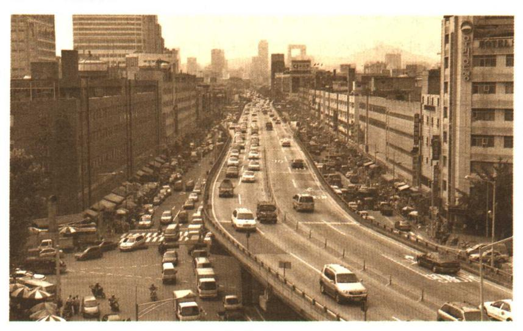

{138}------------------------------------------------

经任何环保措施,直接流入了清溪川。这一切,都将清溪川这个 名字变成了肮脏、贫穷、绝望的代名词。

在这样的背景下,韩国政府从20世纪50年代开始制定了填埋清溪川的计划。填埋工程正式开始于1958年,当时的总统朴正熙表现出了积极的促进意识。清溪川周边的木棚被拆除,代之以现代的商业建筑。污水横流的河水脱胎换骨,变成了整洁的柏油马路。总长5.8公里、宽16米的清溪高架桥于1967年8月15日开工,1971年8月15日正式竣工,成为横贯首尔东西的交通主干道,日均交通流量达到16万以上。由于交通便利,位于市中心的清溪川一带很快成为以电子、机械工具、印刷和服装业为主的城市工业及服务业中心。

然而,高架桥的修建也带来了许多问题,比如桥上的噪音、汽车尾气、扬起的灰尘对周边地区产生的严重污染。另外,高架桥巨大的体量也破坏了首尔传统的街道结构,切断了城市中心区内部的联系。随着时间的推移,清溪川周边逐渐变成了声名狼藉的嘈杂地区。到20世纪末,人们开始重新审视这个承载着首尔几百年历史的中心区域。但是,即便有重新开发的愿望,一想到天文数字的补偿费和令人头痛的交通混乱,就没有人敢碰这个"烫手的山芋"了。

"拆除清溪川高架桥和覆盖道路,两边建成双车道,同时恢复 清溪川水流不断的自然河流原貌。"

这就是我用了三年时间进行具体探索的清溪川复原构想!

最初,当我接过这个"烫手的山芋"、主张复原清溪川的时候, 人们称之为"梦想计划"。对于它的可能性,几乎无人认同,认为 不可能的理由竟有数百种之多。尽管如此,我始终没有放弃。我 的信念非常单纯,我相信这是"非做不可的事",当然还有"做了 再说"的热情和意志。

复原清溪川工程最大的阻力来自路边摊贩。首尔市路边摊贩

{139}------------------------------------------------

最多的地方就是清溪川,大约有一千多家商贩在这里做生意,哪 怕有一个人自焚或发生事故,对我来说都是难以想象的噩梦。

商人们是以租赁别人的店面,或使用自己的店面但需缴税的方式做生意,而路边摊贩却是非法占用市内道路做生意,而且还不缴税,这是非常明显的非法行为。但尽管如此,依法强制取缔的做法也不可行。虽然他们从事的是非法活动,但也攸关他们的生存权问题。

"引导他们自动撤离。"

只有自动撤离才是最理想的方法。如果采取强制手段,就不会产生实际效果,因为即使路边摊贩在政府公权力的整顿之下暂时消失,整顿过后还是会重新出现。撤离过程中的冲突也是一个大问题。如果路边摊贩们采取自杀等极端抗争手段,无论当初的出发点有多好,我们都会受到极大的打击。

思考几天之后,我去了清溪川。我想,如果亲自去看看或许能 找到对策。

不知不觉间,汽车已经从清溪川1街驶过9街,又朝着东大门运动场方向驶去。

"啊!这里是东大门运动场啊!"

看到东大门运动场电子广告板的瞬间,我猛然拍了拍大腿。

东大门运动场由于设施陈旧,几年内将其改建为公园的计划已经制定好了。在改建公园之前,不是可以让路边摊贩临时使用吗?这虽然是迫不得已的办法,但一时也没有其他更好的方案了。

公务员们都有些半信半疑。他们觉得,虽然拉电力、埋水管不是什么难事,但东大门运动场迟早要改建为公园,到时候那些摊贩能顺利撤出吗?

"跟他们约好不就行了吗?"

利用东大门运动场的位置解决路边摊贩的问题, 究竟是迫不

{140}------------------------------------------------

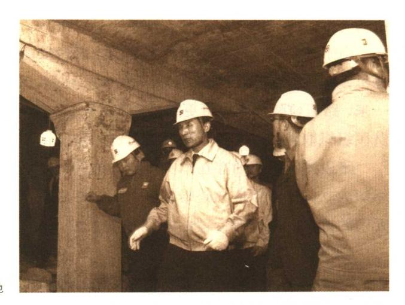

高架桥拆除前 李明博视察工地

得已之策,还是绝妙之策,取决于路边摊贩们自己的想法。如果他们遵守约定,这个问题或许就能顺利解决。

2003年7月1日,复原清溪川工程顺利举行了开工典礼,但是 工程进展并不顺利。路边摊贩的示威活动进入白热化,每天都有 警员在市中心执勤。示威渐渐演变成了情绪化的极端行为,有人 用铁丝把自己捆绑后吊上高架桥,也有人躺在工程装备前面阻挠 施工。

"虽然清溪川的路边摊贩加起来也不过一千多人,但是从全国 各地赶来的四五千个路边摊贩却轮番上阵,举行示威。"

"你说什么?"

"贫民团体正联合起来,召集全国各地的路边摊贩参加示威活动,就连清溪川也已经有一半以上的路边摊贩参与了。"

建设企划局局长试图说服我,因为他已经和半数以上的路边摊贩约定好主动拆迁,现在最好的办法就是实施强制拆除。

据统计,一千名路边摊贩中有五百多人同意实施拆除,剩下的 人当中还有一部分在静观政府的动向,对于是否拆除抱着犹豫不 

{141}------------------------------------------------

决的态度、剩下的一小部分人则坚决反对拆除。

由于开工典礼的顺利进行,路边摊贩内部面临着巨大的管制危机,大部分摊贩感觉到我们拆除的意志强烈,所以决定合作。这一来,路边摊贩代表显得更加恐慌了。他们与其他路边摊贩组织、贫民组织取得联系,示威活动反而进一步激化了。

路边摊贩组织的存在本身就是非法的,而且就算允许这样的组织成立,宗旨也应该是带领摊贩们好好做生意。如果只是进行 无谓的抗争,这样的合理性就值得怀疑了。

"不能再劝说了吗?"

"百分之百不可能了!我认为再对他们进行说服教育非常困难, 看来现在是实施强制拆除的最佳时机,不能再让市中心工程因为 示威活动而处于瘫痪状态了。"

建设企划局局长一再强调,必须严厉整顿路边摊贩。

"D-day"马上确定了下来,但前三次都被迫延迟。核废弃场、 劳动争议等问题闹得全国沸沸扬扬,几乎没有一天不是忙于维持 治安。因为核废弃场问题,全国三分之一的警员都出动了。于是 我们这边就没有警员支持了。

我决心已定,直接出面说服警员主管机关。

"市长,其他地方的情况我不太了解,可是在清溪川,不能动用警员整顿路边摊贩。"

"为什么不可以?"

"据说六个人有自焚倾向,压力太大了。"

真是进退不得啊!

"我相信路边摊贩工作小组的能力,如果继续劝说,就不会引发极端的对立事件。"

事实上,由于路边摊贩工作小组和路边摊贩代表长期以来的 较量,彼此之间都已经了如指掌。从个人角度来说,他们之间的 交情都还不错。当路边摊贩代表说要在奖忠坛公园摆宴时,我们 

{142}------------------------------------------------

的路边摊贩工作小组也决定提着酒前去赴宴。

路边摊贩代表很清楚我们的"D-day"是什么时候,我们的 工作小组也对路边摊贩代表会采取什么样的行动了然于胸。虽然 有发生激烈冲突的可能性,但是我们有信心将伤害减到最低。

2003年11月29日晚上十点多,我向清溪川出发。一周前,我们最后确定把"D-day"定在30日。这段时间以来,路边摊贩工作小组连夜动员市政府的所有力量,准备编成整顿小组,到29日白天已经基本完成准备工作。那些同意拆除、准备把摊位临时迁到东大门运动场内的路边摊贩,我们在他们的摊位上张贴了黄色标签,以便在"D-day"直接管理。

此时已是深夜,我乘坐的汽车缓缓行驶在空旷的街道上。前几 天从三一公寓里搬出来的废旧家具和垃圾堆在道路两旁。到处都 在焚烧废弃轮胎,黑烟在夜色中弥漫开来。我看见了汽油和煤气 罐,还有人拎着铁管从我的车旁走过……

第二天凌晨五点,我再次赶往现场。路边摊贩们喝了一夜的酒,试图缓解紧张的情绪。现在,他们已经累了或喝醉了,一个个东倒西歪。

从前天晚上开始,建设企划局局长就在清溪6街和7街之间的 大厦楼顶设立了指挥部。警员负责人和局长讨论之后,准备亲临 一线指挥拆除。

当时,我就坐在离他们很近的地方,但是谁也不知道我在哪里。这里虽然不是局长所在的大厦楼顶,但也能清楚地看到现场 发生的一切。

上午七点左右,原本打算正式实施管制,但又刻意延迟了。因为这些路边摊贩整夜喝酒壮胆,正处于极端兴奋的状态,如果现在刺激他们,恐怕会出事。

"我们谈谈吧!"

路边摊贩们已经在等待中失去了耐心,要求和我们谈判。我们

{143}------------------------------------------------

的谈判代表只身朝路边摊贩代表那边走去。双方都希望对方做出 让步,于是谈判陷入了僵局。我们表示,如果他们主动拆除,就当 做什么事也没有发生,还让他们按计划搬进东大门运动场,可是 他们不能接受这个条件。我方的谈判代表往回走的时候,双方阵 营都笼罩在紧张的气氛之中。

十点三十分,局长一声令下,50个拆迁队同时进入现场。路 边摊贩们惊惶失措,左冲右窜。为了震慑警员,他们把四处堆放 的废旧家具和废弃轮胎都点着了。可是,突然间风向一转,有毒 气体开始朝着示威队伍的方向吹去。结果,所有的路边摊贩都吓 得四处逃散。相反的,由铲车、警员和公务员组成的拆迁队迅速 掌控了局面,开始实施拆除。公务员们在旁边用相机拍照,铲车 把摊位铲起来装进拖车。下一步工作紧随其后,贴有黄色标签的 摊位被送往东大门运动场,没有贴黄色标签的摊位被送到兰芝岛 公园保管。

由于路边摊贩点燃了废弃轮胎和废旧家具,市中心整天都被 黑烟笼罩。因为烟雾和气味的影响,拆迁工作一直到晚上七点才 结束。

"万幸的是双方都没有大损失。路边摊贩们也无心继续下去, 早早散去了。"

七点左右,我接到局长的报告,说没有出现事故,这才放下心来。虽然有人和警员展开搏斗,几名警员受伤,但都是轻伤。我一直担心有人自杀或自焚,幸好并没有发生。

天色暗了下来,行动终于结束。不只是那些路边摊贩,我们的 公务员们也整整熬了两天两夜。我和工作人员一起去吃晚饭,虽 然饿了一整天,却一点都吃不下。

到了夜里,风刮得更凶了。想到那些犹如残兵败将般踉跄回家的路边摊贩,我的心情怎么也无法平静。他们赖以为生的货摊被送到了保管所,前途渺茫,这个夜晚对他们来说一定格外凄冷。那

{144}------------------------------------------------

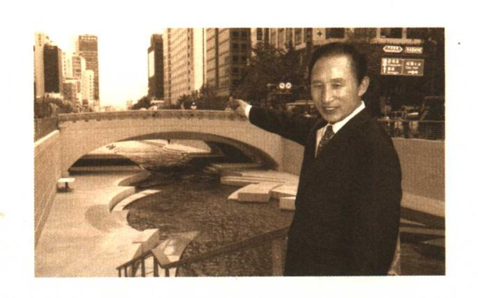

些主动拆迁的商贩,回家休息几天,到东大门运动场取回托管的摊位,又可以重新开始做生意了。设在东大门运动场的风物市场,可以说就是为首尔市的路边摊贩而设立的。

"如果摊位被送到兰芝岛的路边摊贩也想去东大门运动场,那就让他们去吧。不过要缴纳罚款,如果把他们和那些主动拆迁的商贩同等对待,未免有失公平。主动拆迁的商贩往市场里搬的时候,先不要让兰芝岛的商贩进去。等前一批选好位置之后,再让后一批进去,这样会好一些。"

"他们会主动进去吗?"

负责的官员对这样的想法半信半疑。不过我想,用不了多久, 他们会妥协的。

东大门运动场刚刚开张一周,就已经颇有名气了。电视台对于市场的发展前景做了介绍,人们纷纷赶来购物。市场里的商家们既不用担心受管制,销售量又与日俱增,心里当然非常高兴。随即,那些顽强抵抗的摊贩也要求搬进市场,我同意让他们晚两个月再搬进去。

即使在生意不好的严冬季节,东大门运动场的风物市场也是人头攒动,熙熙攘攘。

{145}------------------------------------------------

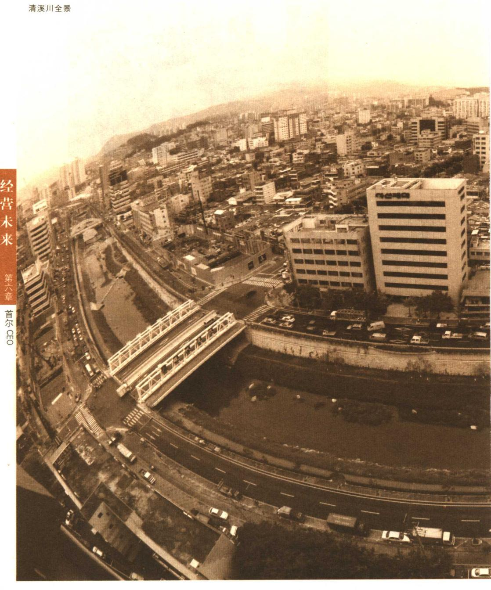

{146}------------------------------------------------

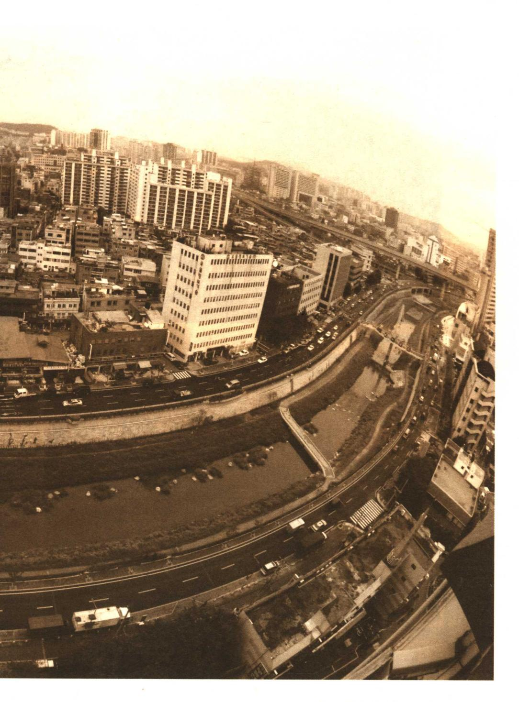

复原清溪川・促进力 137 ●

{147}------------------------------------------------

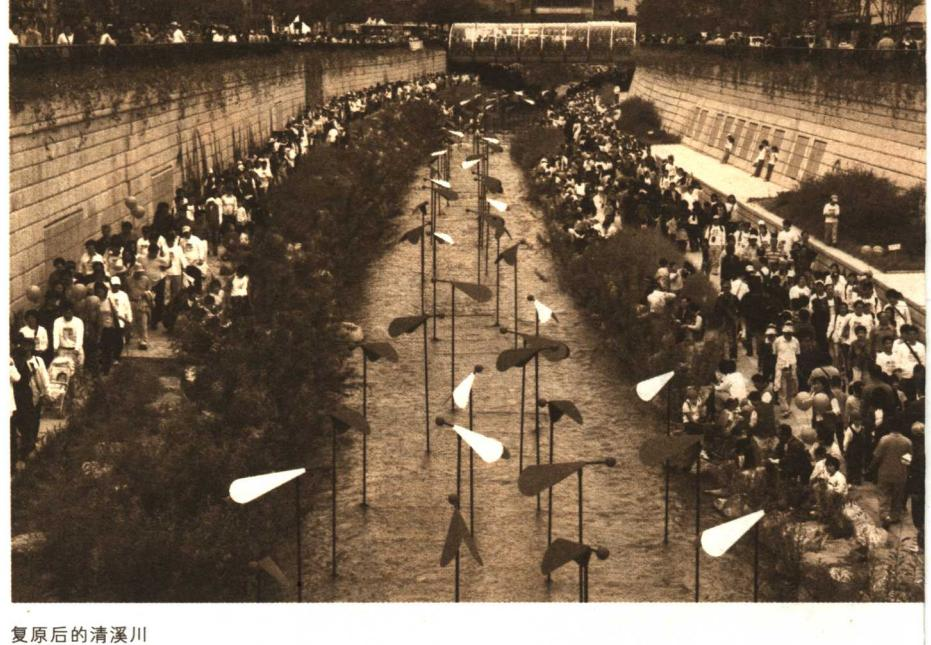

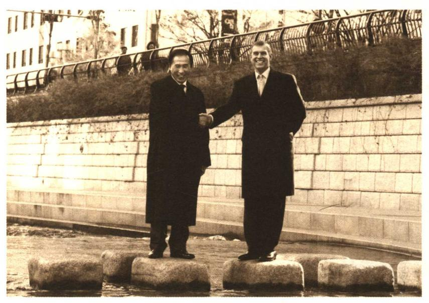

{148}------------------------------------------------

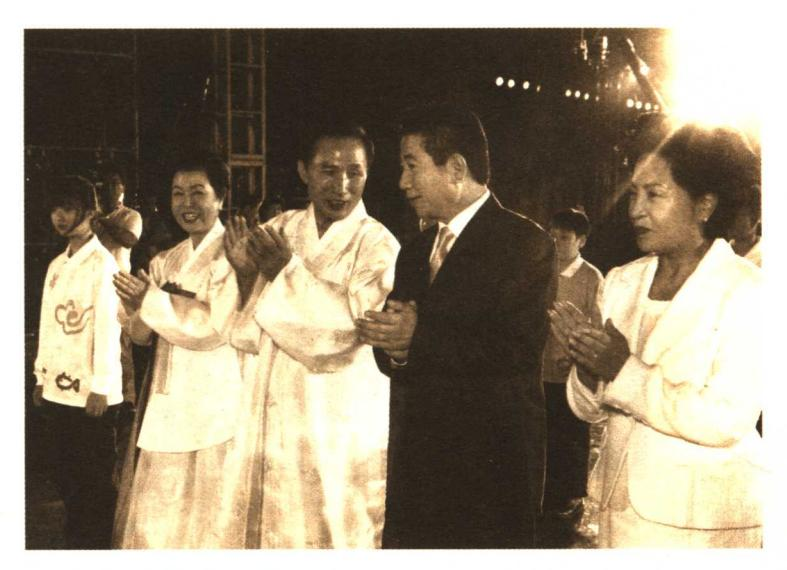

与卢武铉等一起同迎清溪川新貌

清溪川夜景

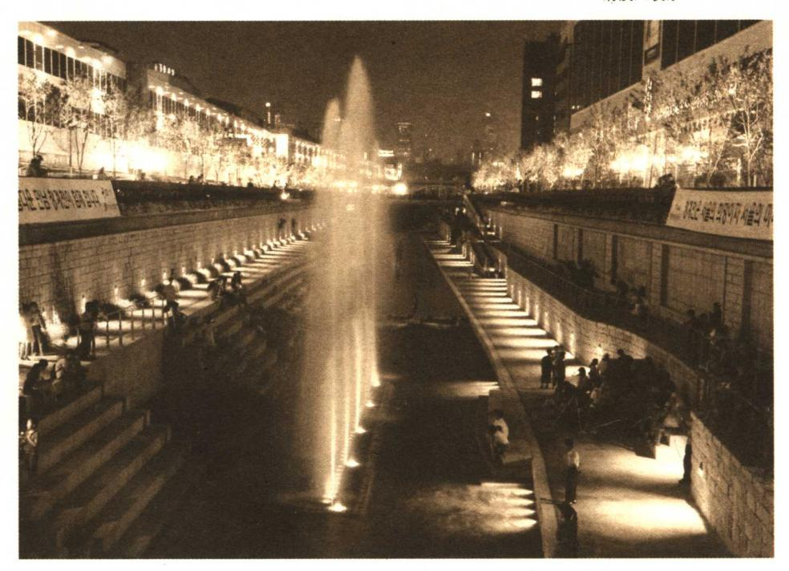

复原清溪川・促进力 139 ●

{149}------------------------------------------------

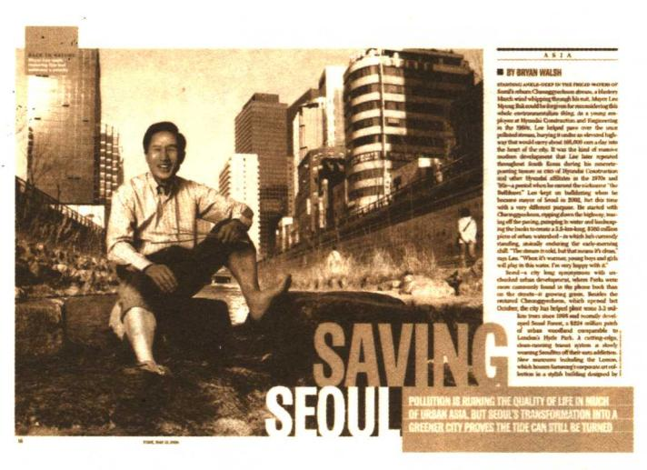

李明博获美国TIME杂志 评选的国际环境英雄奖

各国的参观团在复原后的清溪川

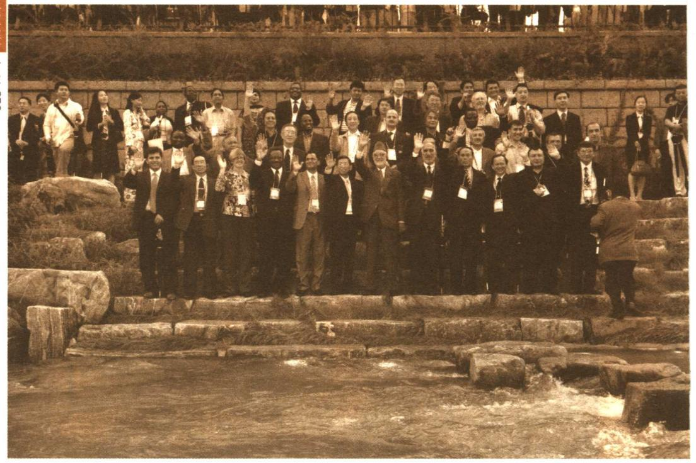

{150}------------------------------------------------

### 公共交通改革·信任

在车水马龙的首尔,交通堵塞一直是城市的一大顽疾。 我曾经多次提到过这样一个小故事:

一个朋友的女儿,因为上夜间补习班,放学后已经很晚。她一个人站在街上,一辆辆公共汽车从她身边呼啸而过,没有一位司机愿意停下车搭载她,因为他们要赶着去交班,根据规定,迟到一两分钟就得罚款。

上任市长后,我决定大力整治交通,让市民们拥有一个便捷、 人性化的交通环境。当然我也知道,触碰这一顽疾必然意味着有 一场"硬仗"要打。

在完成了前期评估策划工作后,首尔市公共交通改革在一片质疑声中全面启动了。交通管理局的职员们每天都处于"战斗状态",市政厅的全体职员也时刻准备着应对非常事态。秘书室的电话响个不停,政府网站论坛上更是一片责难声,媒体也是连篇累牍地盲目批评公交改革,甚至还有人组织了"李明博市长下台"的签名运动。

有关负责人在忙碌了一天之后,每天晚上10点还要参加对策制定会议,第二天一大早就要去现场检查系统运行情况。经过一段时间的奋战,改革初期的一些错误逐步得到了纠正。

但是,市民们对于公交路线的更改依然不能完全适应,舆论压力如硬石般压在肩上,市政厅的职员们也渐渐有了危机感。在这种情况下,有人提出:

"交通局局长似乎应该为这件事负责。"

"这是你一个人的想法,还是大多数干部的想法?"

{151}------------------------------------------------

"大多数干部都和我的想法差不多。"

有人认为,即使为了平息民众的怨气,也应该让交通局局长 下台。

我想起了有一次和交通局局长交谈的情景。那时他刚上任不 久,和我谈起对城市交通政策的想法,也向我提出了几个要求。

他说,希望交通政策从白纸状态重新开始,我完全同意他的意见,更换交通局核心职员也是出于这个原因。之后他又说,为了更好地开展工作,需要组建一支专业研究小组。这一点也和我的想法不谋而合。市政开发研究院所属的研究支援团和公共交通改革促进小组共同组成了交通改革智囊团。

商议完具体事务后,他没有立刻起身离开,似乎有什么话要对我说。我静静地等着他开口。

过了一会儿,他语气沉重地对我说:

"市长,我会竭尽所能投入工作。即使有一些失误的地方,但 我没有贪钱,请不要撤我的职。"

他真诚的表情让我印象深刻。在担任交通局局长之前,他曾经 是报社享有局长级待遇的专业交通记者。他只是想把自己的知识 运用于行政工作,只是出于这种单纯的意愿而走上了交通局局长 的职位。

我认真地对他说:

"相比在工作中出错的人,我更不喜欢什么都不做的人。对一个竭尽全力工作的人,如果因为有一些过失,就要他承担全部责任,那以后谁还会愿意站出来做事呢?"

后来,他正如他承诺地那样努力工作,在交通改革中倾注了大量心血,但他的问题在于个性太强,在讨论会议中几次与人发生争吵。我也为此提醒过他。不过,这些都没有影响他工作的热情与积极性。

有一次我在纽约访问,凌晨还在熟睡中,从首尔来了紧急电

{152}------------------------------------------------

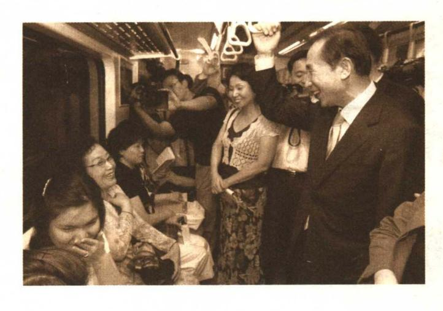

在地铁与市民 对话

话。原来是这位交通局局长,有紧要的事情与我商议。我打起精神,认真听取了他的意见。我对他这种首先考虑工作、以效率为第一的态度非常满意。

之前还发生过这样一件事:一天中午,我正在去吃饭的路上,突然对面有个人匆匆忙忙跑过来。我一看,正是这位交通局局长。他一边说着"事情紧急",一边递给我一份审批文件。

{153}------------------------------------------------

"你这是做什么呀?怎么能让市长在人来人往的路上审批文件呢?"

我身边的人露出一副"岂有此理"的表情,但我欣然接过文件签了字。他就是这样一个人。即使改革初期出现很多问题,也不

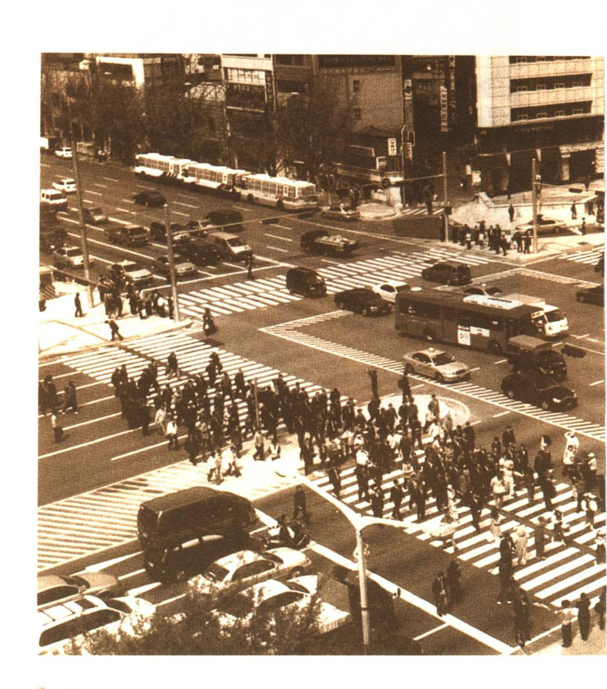

{154}------------------------------------------------

能让他成为替罪羊。

"这不是撤下他就能解决的问题。"

我拒绝了主张要他下台的意见。

"交通局长是个人才。改革交通体制本来就是一个复杂的大工

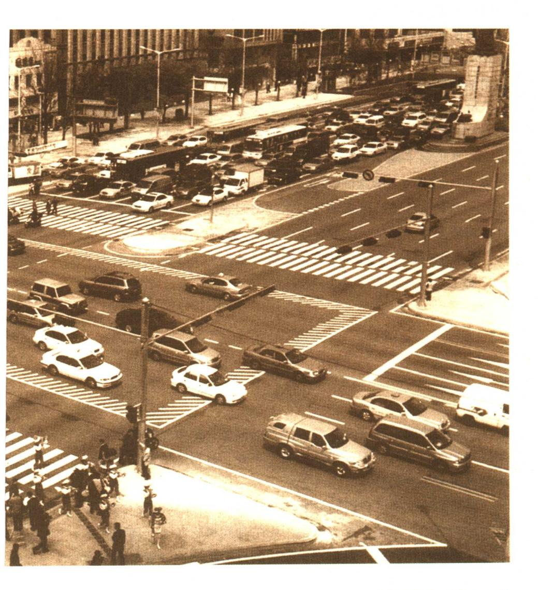

{155}------------------------------------------------

程,只要我们努力纠正初期的一些问题,我相信改革一定会取得成效。虽然现在还有很多困难,我们再坚持看看吧。"

在交通改革开始实施的一个多月里,市政厅的公务员们几乎 无一例外地从早晨工作到第二天凌晨。一个月后,公共交通乘客 量有了明显上升,市民们逐渐感受到改革带来的优惠与便捷,支 持的声音也多了起来。

改革初期经历的一些事情为如何运用人才提供了范例。有句话说:人事,即万事。对一名领导来说,要想顺利完成工作,量才适用非常关键。

过去,一旦实施公共交通改革,就会发生交通局局长因徇私舞弊被拘捕的事件。这往往是一些对改革持否定意见的人和交通局内部一些人联手操纵所致。于是,原本计划的改革也就无法再进行下去。正因为了解这种情况,交通局局长才更换了原交通局内部的一些核心人员,既表明了改革的坚定意愿,也能防止类似事件的再度发生,新加入的职员也会更加勤勉地工作。

世界上没有十全十美的人,如果只是因为出错就让负责人下台,对工作的开展毫无益处。

### 汽车自律日制度·协商

一说到协商,或许大多数人想到的都是气氛紧张的谈判桌和 剑拔弩张的拉锯战。但如果从广义上来看,日常生活中几乎所有 事情都具有协商的性质。

协商是为了实现自己的需求,有时需要运用权利说服对方,找 到妥协的方案。从这个意义上说,中午和同事吃什么、周末和家 人做什么都是协商的一种形态。我们的日常生活本身就是在协商 

{156}------------------------------------------------

中进行的。

工作中也需要不断进行协商。如果协商不当,稳操胜券的事情也有可能失败,如果协商成功,毫无胜算的项目也有可能柳暗花明。

首尔的汽车自律日制度也是通过协商得出的结果。如果没有 赋予动机和解决方案,就不可能达成最终的共识。

汽车自律日制度最初是在和NGO活动家们开会讨论的过程中确立的。许多NGO活动家指责首尔市对环境污染、能源浪费等问题缺乏关注。

"二氧化碳引起全球温室效应已经成为一个重大问题,而汽车 尾气占所有二氧化碳排出量的30%。在当今这个高油价时代、环保 时代、首尔政府应当对市民活动做出积极的引导。"

对此,我作为首尔市长表示了认同。但是,如何引导市民改变业已习惯的活动方式呢?根据以往经验,有时采取强制措施比较容易获得实际效果,但这么做可能会给市民造成不便,而如果依靠自律,所需的时间会很长。在一些发达国家,政府对私家车进入市中心的限制非常严格,而且多数大城市采取的都是强制措施。例如在伦敦,市中心出入费为每天1万韩元左右,米兰则是实行单双号制度。

"以前我们实行的制度存在很多问题。每位车主需要根据自己 的车牌号,对照今天是星期几,确定能否开车上路,这种方法太 过死板。"

"而且,有一部分人群,比如业务员,他们不得不开车。如果 采用罚款措施,他们的抵触情绪会很大。"

"强制实行罚款或通行税的方法,短期内可能会有效果,但从 长远来看,可能反而会失去实际效果。"

"那就构想一下自律方案吧。找一个能提高市民参与度的 对策。"

经过商议, 最终决定引入汽车自律日制度。

{157}------------------------------------------------

所谓"汽车自律日制度",就是市民可以自行选择在一周内的哪一天不开车,并把这个日子贴在汽车上,靠自觉实行。在理论上,这个制度非常理想,然而一旦付诸实践,问题就出来了。在领取标签的过程中,市民们就不享有充分的自主权,自律制度变成了他律制度。

我又召集相关人员进行商议。

"引导市民参与是最重要的。有没有什么方法能提高市民的积 极性?"

"我们可以对自觉参与的人实行奖励, 既可以提高他们的积极 性, 又可以保持自律性。"

我欣然接受了这一建议。

接下来,有关专家、负责人对奖励制度进行了研究,最终提出了降低一部分汽车税和保险费的方案。但是,这一方案引起了税收部门的反对。他们认为调整汽车税会引发一系列问题。我认真地向他们解释:

"降低一部分汽车税确实会在一定程度上导致政府税收的减少,但要知道,车辆通行率即使降低10%,也会在很大程度上减少大气污染。而且,车辆通行量降低之后,交通管理费用和环境治理费用也会相应减少,从长远来看不会有损失。"

降低保险费也符合经济原理,因为开车的时间越少,保险事故率就越低,因此保险公司的赔付金额也会相应减少。在成功说服了税收部门之后,汽车自律日奖励制度进入了倒计时。但就在这时,发生了意料之外的问题。反对的声音来自中央政府。

"首尔怎么可以降低税费呢?如果首尔以外的居民没有得到汽车税减免优惠,他们不是会感到不满吗?"

中央政府强烈反对首尔降低汽车税和保险费。

协商并不容易,重要的是要抓住问题的核心。全国各个城市的 交通环境是不同的,怎么能用统一的标准来衡量呢?我们一条一 

{158}------------------------------------------------

条地反驳中央政府的主张。

"如果生活在首尔的居民和生活在山区的居民交一样的钱,接受一样的服务,这还叫什么地方自治呢? 很多地方的空气污染程度比首尔轻得多,环境治理费和交通管理费更是不能和首尔相提并论。从这个意义上说,他们已经比首尔市民享有更大的优惠了。每个地区都有权利开发符合自身情况的服务。怎么能用同样的标准衡量本身就具有自然差异的地区呢?"

通过协商,中央政府最终同意了首尔市降低汽车税和保险费。

汽车自律日制度是依然还在进行中的一个课题。这不只是单纯为减少车辆通行量而进行的一次活动,其最终目标是改变汽车生活模式,打造新的交通文化。虽然在一定时期内会给市民带来一些不便,但从长远来看,它是符合大多数人利益的,这也是鼓励市民自觉参与的最重要理由。这不是一个可以在短期内评判成败的计划,每个市民也拥有是否参与的自主性,公务员的义务则是予以鼓励。

在企业经营中,差别化服务产生竞争力。汽车自律日制度要想取得成功,需要的就是赋予动机和提供差别化服务。通过多方协商,汽车自律日制度才最终有了实行的可能。

### 首尔广场・共享前景

建造首尔广场是前任市长在任时就已经计划的项目,但是因 为遭到以警察为首的反对人士的阻拦,没有顺利进行下去。

反对人士的主张很简单:

"市政厅前面本来就是交通老大难,这样一来岂不是乱上 添乱?" 

{159}------------------------------------------------

因为交通问题就否定建设广场的计划,这种说法我不能接受。 我脑海中时常浮现出2002年6月为世界杯加油的情景。广场是市 民活动的空间,在市政厅前面修建广场具有象征性意义,它意味 着市民才是这个城市真正的主人。

"什么是企业意识?不就是'顾客第一'吗?只要市民们需要这个开放空间,我们就有理由朝着这个方向走下去。"

我决定向一系列交通专家进行咨询,对交通情况做一个模拟测试,并加以论证。模拟结果比预想的要好,修建广场后的交通

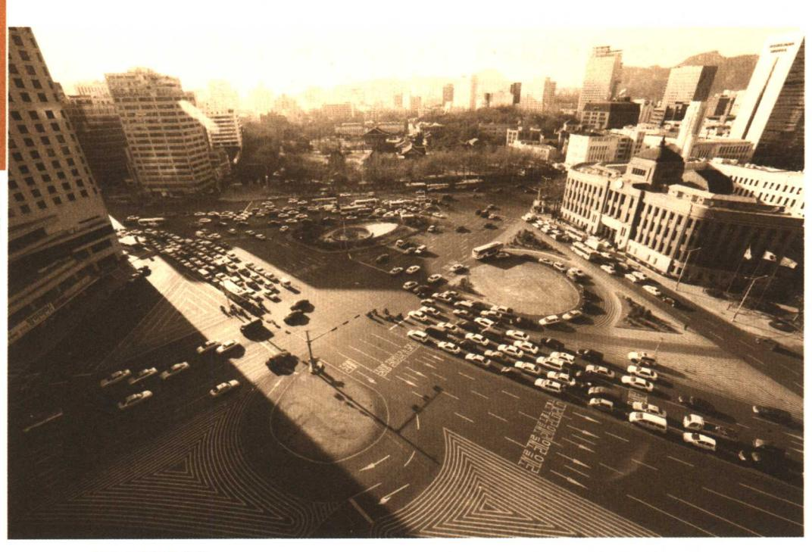

首尔广场建造之前

{160}------------------------------------------------

情况不会恶化到反对人士描述的那种程度。

接下来的工作是说服那些持怀疑态度的公务员。

"市民们希望有这么一个广场。如果仅仅因为可能存在的交通问题就放弃这个计划,等于就是无视'顾客'的要求。另外,在市政厅前面修建广场也是展示首尔从一个功能型城市转变为人性化城市的好机会。"

最终,首尔广场破土动工了。在79天的工期内没有发生交通 大乱的局面,相反,市民们表现出的态度是:建广场是一件好事,

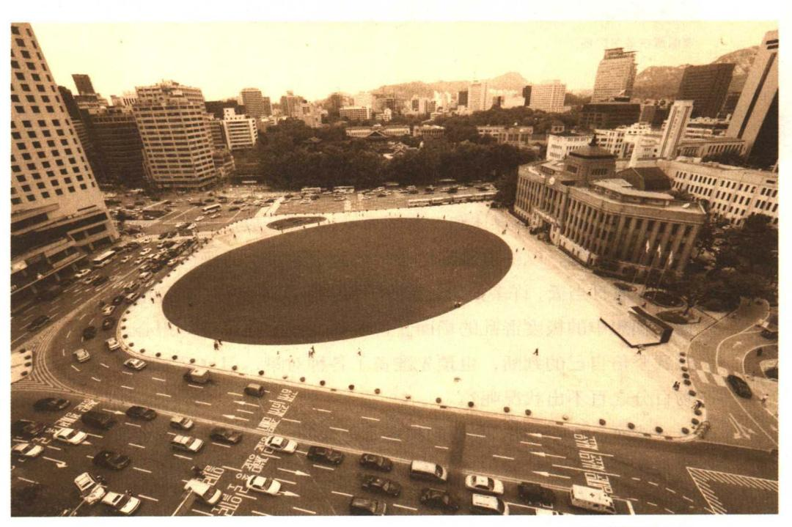

首尔广场建成以后

{161}------------------------------------------------

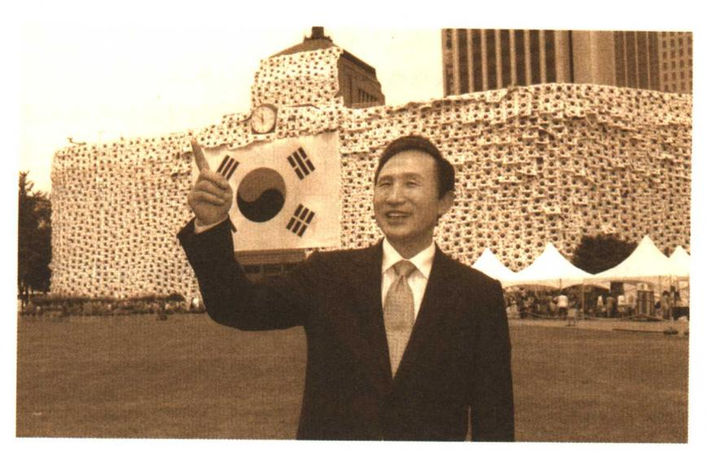

李明博在首尔广场

即使有些不便也可以承受。

广场开放日那天的情景更是令人感动。

在那之前,许多媒体和专家都表示,广场开放后必然会引起严重的交通问题,以往道路突然遭封闭会引起民众的怨愤。

开放日当天,许多摄影记者摆开架势、严阵以待,准备记录下他们预想中的极度混乱的场面。说实话,我心里也有些担心,虽然我坚信自己的判断,也预先准备了各种对策,但谁又能保证现场百分之百不出状况呢?

然而,事实证明,我们的决定是正确的。那天,摄影记者们确 实很忙,但他们忙着记录的不是汽车鸣笛、人群混乱的场面,而 是闻讯赶来的市民们热闹欢庆的场面。

期间还发生了有趣的"突发事件"。

在之前关于如何举行广场开放日仪式的会议上,我们经过多方讨论,最终达成了俭朴举行的一致意见,决定只在广场开放后

{162}------------------------------------------------

举行少儿作文大赛。结果,热情赶来的市民们既让我们深感欣慰,也让我们有些"措手不及"。

从上午10点广场正式开放的那一刻起,人们就从四面八方聚到这里,让人联想到2002年众人满怀激情为世界杯加油的情景。 几十年交通拥堵的地方,突然变成了一座美丽的广场,这让市民们由衷地感到高兴。他们似乎期待着广场上会有精彩的节目。

"开放仪式怎么这么简单啊?"

"没什么看头啊!"

"听说首尔广场要开放才赶来的,怎么没什么节目啊?"

从年迈的夫妇,到活泼的孩子,人们在青草地和市政厅的后园里一边散步一边闲谈。不知是否因为原本遥不可及的市政大厅突然近在眼前,由此产生了亲切感,有的市民踱步进了市政大厅。

首尔广场

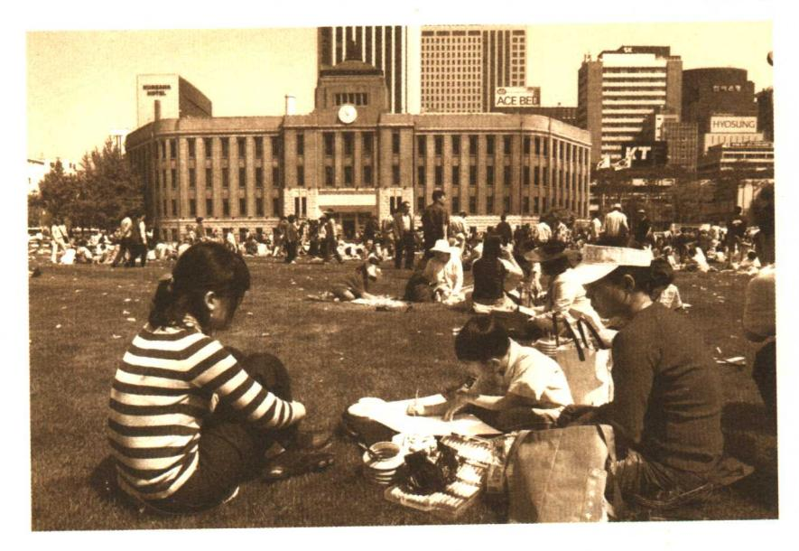

{163}------------------------------------------------

公务员们匆匆忙忙把热情的市民引到宣传馆,1年用的宣传手册、印刷品很快就分发完了,预先准备的5000瓶矿泉水也不够解渴,宣传馆内一整天都在放映宣传片。市民们的反应确实超乎预想。

这次"突发事件"让公务员们树立了变革的信心。虽然这一天工作得很辛苦,但是和市民们畅快沟通是一件多么令人振奋的事情。大家也切实感受到,以前和市民的隔阂有多大。

在之后的一次会议上,一位公务员有感而发:

"只要我们努力做得更好,公务员整体状况的改变就会得到市民的肯定。"

在树立了信心之后,公务员们会更加积极地投入工作,我所提出的前景也在不知不觉地渗入到大家心中,成为所有成员共享的前景。

领导提出的前景需要所有成员共同努力才能达成,如果成员 不能共享这一前景,一切只能停留在表面口号式的宣传上。当然, 这个前景应该是具有实现可能性的具体目标。

### 首尔林・共享时代精神

什么样的前景能够燃起人们的热情、吸引更多人为之奋斗? 我认为很重要的一点是,这个前景必须符合时代要求。

在圣水洞建设"首尔林"就是反映时代要求的一个范例。开发圣水洞原先只是一个大规模开发计划的子项目。之前讨论的开发计划是以建造新市厅为主,辅以文化观光区、唐人街等项目。

我就任市长后,对这一问题重新进行了思考。

"作为大规模商业区来开发,这符合未来发展趋势吗?"

{164}------------------------------------------------

这样的疑问一直在我脑海中盘旋。首尔要成为世界一流城市, 关键的一点是构建文化基础设施,使其深入市民生活的各个角落。 一味地开发商业区并不是明智之举。

于是,我们取消了原先的开发计划,新的构思是建造一座生态 公园——"首尔林"。当然,持反对意见的人也不少。

"如果按原计划进行,圣水洞一带就能作为商业用地,最少能确保5兆韩元的销售。您真的要更改计划吗?"

虽然我坚信自己的决定没有错,但听到这样的提问,我还是有些动摇了。5兆韩元不是一笔小数目。我决定再次回到原点,重新思考。

"圣水洞开发究竟应该往哪个方向走呢?"

没有两全其美的选择。

"是选择经济价值,还是环境价值?"

人的一生总是要不断面对这样的艰难抉择。

最终,我还是决定在圣水洞一带建造有益于城市环境的生态 公园。

"首尔要成为世界一流城市,不能只停留在功能和效率方面的成就,更要开创具有首尔特色的文化环境。为此,我们不能急功近利地进行商业开发,而是应该构建亲环境的、符合生态的、文化性的基础设施。"

我向公务员们强调了建造生态公园的理由。根据统计,2004年首尔的人均公共绿地面积只有1.5坪,这个数字远远低于东京、伦敦、新加坡、巴黎、纽约等世界一流城市。

站在地区居民的立场上,虽然短期内在经济上或许有所损失,但从长远来看,这绝对是一个提高市民生活质量的机遇。圣水洞 所在的首尔东北部属于生活质量较低的地区,生态公园建成后地 区面貌将有很大改善,其受惠者就是当地居民。

"建设首尔林计划"确定之后,便进入了具体实施阶段。

"用什么方法可以把首尔林和其他公园区别开来呢?"

{165}------------------------------------------------

这是实施工作一开始就面临的问题。我和相关专家、负责人一起,对"首尔林"的形象定位进行了反复商议。

"树木郁郁葱葱,富有生机。荷花池内流水潺潺,四周环绕着 开阔的草地。市民们可以和家人、朋友尽情嬉戏玩耍。"

这样的构想在众多提案中脱颖而出。其特别之处在于以建造自然生态林为主,不需要添置其他设施。在当时,韩国人所理解的休息场所大多就是以设施为主,在热闹的地方乘坐游乐设备,狼吞虎咽地吃些东西,然后再忙着排队、等待下一次游玩机会。现在,我们必须转变市民们对公园的单一认识。"首尔林"不是吃喝玩乐的游乐场,而是让身体得以舒缓、让心灵归于平和的自然生态公园。

从策划阶段开始,我们就公开向市民征集公园名称和设计图, 这样做也是为了吸引市民广泛参与,形成一股庆典般的热潮。

但是,在具体实施过程中,需要解决的问题堆积如山。首先是 圣水洞地区的旧货商铺和混凝土工厂的补偿问题,还有商业开发 计划取消后,周边居民的反对声。

建设过程中也遇到了一些困难。规划中的土地被横纵向道路分成了四个部分,其中一个部分之前一直处于荒废状态。为了尽可能缩短工期,早日把"首尔林"交给市民,时间压力也很大。当务之急是组织一支精干的管理队伍。我任命了"首尔林"项目促进工作负责人,迅速组建了一支特别促进小组。这支队伍就是后来负责首尔市绿地政策的城市绿化局的前身。我随时确认促进小组的工作进程,也要求他们随时汇报工程进展。渐渐地,一切工作都开始有条不紊地走上了正轨。

对于补偿问题,负责人直接与旧货商铺、混凝土厂商进行一对一说服,最终圆满解决了问题。但是,在协商解决居民补偿问题时,却遇到了棘手的对抗。

"这个公园不是为市政府和市长建造的,而是为改善全体首尔

{166}------------------------------------------------

市民的生活环境而开发的,不是吗?"

每到那时,我们都用明确的主张说服反对者。

"各位居民,请大家好好想一想。这一带以后将成为首尔东 北部唯一的公园地区。到时候此地的房价自然会上涨,谁也挡 不住。"

有关负责人在听证会上对反对者说了这么一番话。事实也的 确如此,如果周边环境有所改善,房价上升是自然而然的事情。

由于整个公园被分为四个部分,让市民穿越车行道有可能引发事故,因此我们决定造一座人行天桥,一切设计以便民为第一准则。另外,我们利用空间分隔的条件,选择了两家公司同时进行施工,工期也因此得以缩短。

随着"首尔林"的诞生,从光华门,经过清溪川、中浪川,直到圣水洞的绿色网络铺展了开来。

"首尔林"的成功可以归结为许多因素,但我认为,其中最大的成功因素在于反映了时代发展的方向。如果忽视了时代要求,既不能取得长期效果,也不能说服组织成员和当地市民。让"顾客"和"搭档"共享时代精神,这是事业取得长足发展的重要条件。

### 重塑城市夜景・逆向思维

我曾经主张,越是在经济不景气时期,越是应该让城市的夜景 亮起来。当时只有少数人赞同我的这一主张,大多数人都是摇头 反对。

"油价居高不下,市民直接感受到的物价比统计数据还要高,媒体都在号召大家省油、省电,你却主张在晚上张灯结彩,这是不是有点太无理了?"

{167}------------------------------------------------

面对这样的诘责, 我是这样回答的:

"我们的社会是由各种职业、生活背景、生活方式的人组合起来的。比如说,酒吧的主人或者澡堂的主人不可能因为要节约能源,就不开酒吧或澡堂。我的意思是,我们不应该让所有人无条件地一律节约,而是应该摸索一些更具实效性、更多依靠自律的方法。"

因为经济不景气,所以要节约能源,这是人们长期以来形成的 固定思维模式。以前也有过因为油价上涨,全国一律关掉路灯的 做法。政府也曾要求夜间从业者自行控制照明,因此经营活动集 中在夜间的行业难免遭受创伤。当然不可否认,这种方法有时也 能取得一定效果,但许多时候,硬直的思考方式只能使情况更加 糟糕。如果能够换以灵活变通的思考方式,在逆向思维中寻找突 破口,就往往能取得良好的效果。

站在个人的角度看,节省一滴水、一度电、一升油都对家庭生活有所帮助,但是,站在城市经营者或国家经营者的角度看,这种策略未必是最有效的。政府越是制造紧张气氛,市民就越是抓紧口袋不放。如果市场上没有资金流通,经济停滞自然就会长期化。

如今,韩国已经成为一个旅游大国,每年的游客人数约有600 万。如果为了省电,关掉街上的夜间照明,会给外国游客一种多 么冷清的感觉?与此同时,也会给考虑来韩投资的外国厂商和企 业家留下不好的印象。

所以我认为,越是在经济不景气的情况下,就越应该在能够提升经济活力的领域加强投资。装饰夜景就是出于这方面考虑。华丽的夜景能让市民重新振作精神,让城市恢复生机,我们应该把充满活力的城市面貌展现在外国游客和投资者面前。

事实上,许多与首尔并肩竞争的大城市也多以绚烂的夜景而闻名。艺术之城巴黎从圣诞节前一个月就开始设计城市整体照明装饰,年底的巴黎夜景确实美不胜收。纽约、东京、香港、新加

{168}------------------------------------------------

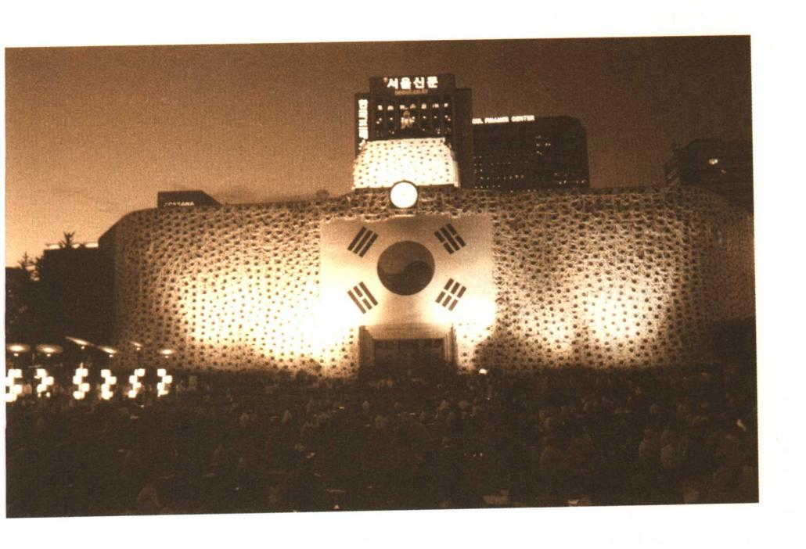

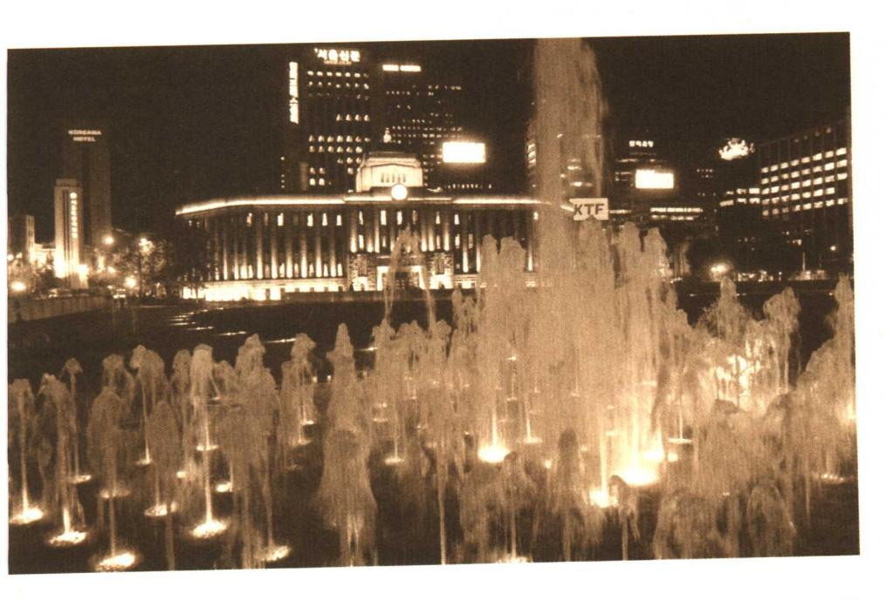

重塑城市夜景・逆向思维 159 ●

{169}------------------------------------------------

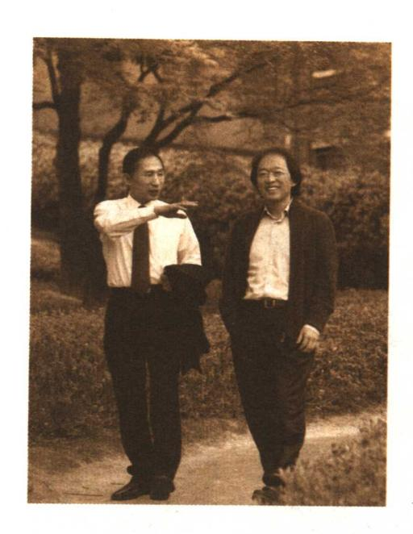

与指挥家郑明勋在一起

坡、上海都在城市夜景上做足了功夫,因为只有这样才能提升城 市形象,吸引更多游客和投资者。

这几年,我们对首尔城市夜景进行了重新布置。例如在 2004 年,我们重新设计了6座大桥的照明景观,以前只在世宗路上才有的夜间照明延长到了崇礼门;复原后的清溪川一带的夜间照明也装饰得很有特色。尤其是首尔广场和清溪广场的灯光庆典,连在整个冬季都吸引着市民和游客的目光。不可否认,这些举措对提升首尔的城市形象起到了相当大的作用。

### 创造首尔文化•摆脱固有观念

"创造首尔文化"是民选三期的市政目标之一。"创造首尔文化" 具有重要意义,因为最终"让人们享受幸福生活"的,正是文化。 

{170}------------------------------------------------

在现实生活中,"文化"是一个广泛运用的概念,几乎在所有 领域都有所谓文化的概念,例如经营文化、政治文化、生活文化、 组织文化、酒桌文化等等。"创造首尔文化"也可以以广泛和长期 目标的意义来解释。也就是说,"创造首尔文化"不是一朝一夕就 能完成的短期工程或事业,它是需要我们投入大量时间与精力,一 小步、一小步扎扎实实走下去的宏大目标。

首尔交响乐团以独立法人形式成立,由世界著名指挥家郑明 勋执棒。这也是立足长远、构建首尔城市文化基础设施的一大 举措。

交响乐团是衡量一个城市文化水平的重要尺度,纽约、柏林等城市的世界级交响乐团都为提高其城市文化水平作出了杰出贡献。相比之下,首尔的交响乐团一直处于较低水平,市民的关注度也不高。我强烈感觉到,首尔作为一个有影响力的城市,需要一个具有世界级水平的交响乐团!

"希望能在我有生之年,帮助韩国的管弦乐发展到世界一流 水平。"

郑明勋曾经这样对我说,这也让我产生了深深的共鸣。

"把首尔的交响乐团提升到世界级水平,需要时间,也需要政府长期、不懈的支持。但是我相信,到新音乐会大厅落成的 2009 年,首尔交响乐团的水平会得到一定程度的提高。"

在首尔交响乐团成立纪念音乐会上,郑明勋发表了如上就职感言。

打造世界一流交响乐团需要具备三个要素:第一是优秀的指挥家,第二是团员的整体演奏水平很高,第三是要有持续不懈的支援。郑明勋的上任具备了第一个要素,通过考试选拔团员、改善待遇,这是具备第二个要素的基础,剩下的第三个要素则是政府应当承担的责任。对于这一点,我自信地对郑明勋说:

"大家都在议论,一旦换了市长,对交响乐团的支援就会中断。

{171}------------------------------------------------

我向你保证,即使我卸任了,我也会尽最大努力支持你们。"

通过紧握的双手,我们感受到了彼此的信任。

我承诺要为交响乐团专门建造一座音乐大厅,因为这是将交响乐事业推向世界一流水平的基石。但我并不认为,这是一个一蹴而就的目标。推动交响乐事业,需要全体市民持续的关注与热情。如何缩短交响乐与普通市民之间的距离,这是我们面对的一个重要课题。

在降低古典音乐的门槛方面,新的交响乐团起到了积极作用。 满足市民的文化生活需求,提高普通大众的交响乐欣赏水平,这 都是需要我们用具体行动去促进的。首尔广场音乐会和"音乐会 送上门"活动就是颇具代表性的例子,它们记录下了首尔交响乐 团的转变与进步。

2005年, 我们计划在8月15日纪念光复60周年的这一天, 在

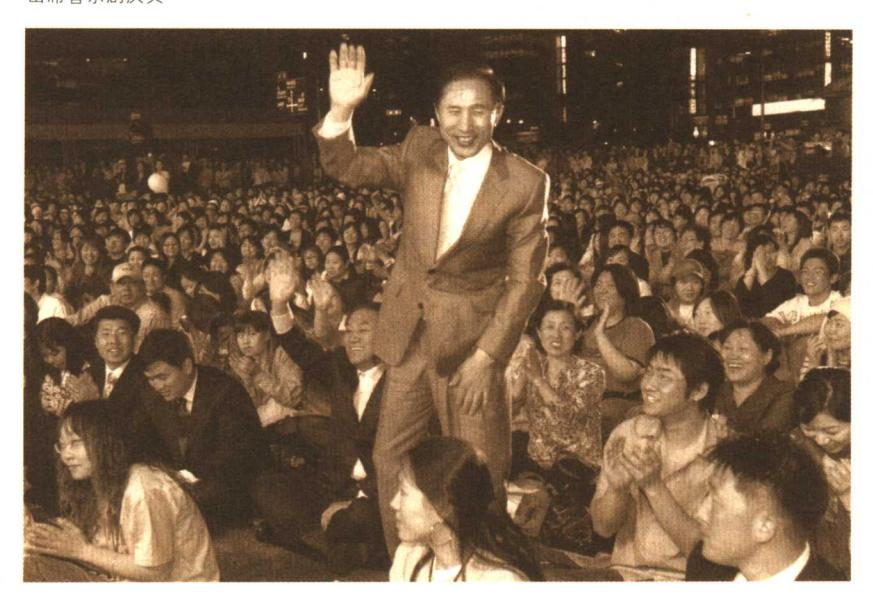

{172}------------------------------------------------

首尔广场举行一场交响音乐会。我的主张引起了一片反对声。

"举行露天古典音乐会?普通市民真的能接受高雅音乐吗?"

"我想这正是一个很好的机会,可以改变古典音乐只属于少数 人的状况。"

"这么做可能会被误以为借机制造轰动效应,而且还有交通和 噪音的问题,不一定能达到好的效果。"

"只要有一位市民通过这次活动接触到古典音乐,不就实现价值了吗?"

在做决定之前,我想听一听郑明勋的意见。

"太好了,我们可以利用这个机会,把遥远而陌生的古典音乐 拉近到普通市民的身边。"

有了郑明勋的支持, 我更有信心了。

事实上,市民们的反应大大超出我们的预期。在用 3600 面太 极旗覆盖的首尔广场舞台上,纪念光复 60 周年的演出活动是那么 令人感动。从牵着孙子的小手、参加过独立军的老爷爷,到年轻 的恋人、新婚的夫妇,还有把欣赏演出看做学习机会的学生们,首 尔广场的舞台成了男女老少欢庆的海洋。

听着交响乐团出色的演奏,看着沉醉于音乐的市民们,我的心中充满了感动。

"文化的力量如此强大,它可以在一瞬间,把人们的心凝聚在一起。"

最后一曲《韩国幻想曲》结束的时候,我充满感激地紧紧拥抱 了指挥郑明勋。

"音乐会送上门"活动也以走近市民的方式,展现了首尔交响 乐团不同以往的风貌。在中浪区、恩平区、九老区等地区,居民们 很少有机会欣赏到古典音乐会。为此,交响乐团特意到这些地方 进行免费的演出。

演出活动反响热烈, 台下座无虚席, 有人甚至站着看完了

{173}------------------------------------------------

演出。因为有广大市民的支持,"音乐会送上门"活动今后还将继续进行下去。

"首尔市民对高雅音乐的欣赏水平和需求程度并不像一些人想象的那么低,以前他们只是没有机会接触,因而也没有机会享受。"

首尔广场音乐会和"音乐会送上门"活动的成功也给了我新的启示。

我一直强调CEO市长论和企业意识,这不只是因为我在现代建设担任过15年的CEO,更因为我意识到,政府需要CEO型领导人。

2005年成功举办的釜山 APEC 首脑会议讨论了"如何预防 禽流感"的议题,这正是体现了国家把国民健康与幸福作为最 高价值来追求的意义。从本质上说,这和为满足顾客需求而努力的 CEO 姿态是一致的。

当然,不只是国家领导人,地方官员、大学校长、事务所所长都应具有 CEO 意识。再进一步说,生活在这个时代的所有人都应成为以 CEO 意识武装的 CEO 型人才,这是不可抗拒的时代趋势。

那么, CEO型人才究竟是指什么样的人呢?

是在困境中愈挫愈勇、发挥促进力、寻找突破口的人,是 运用灵活变通的开放性思维、克服困难的人,还有,不追求抽 象性目标、而是设立具有实现性目标的人。

- "古典音乐会怎么能在露天环境下举行呢?"
- "普通人会愿意去听古典音乐会吗?"

如果我们被这种固有观念所束缚,首尔广场音乐会的感动就不可能出现,将古典音乐视为遥不可及之物的人就迈不过那道门槛。

{174}------------------------------------------------

如果是非做不可的事,即使只有百分之一的希望,也要付诸百分之

拒绝挑战的人和挑战失败的人,看似殊途同归,其实后者得到了经

九十九的努力。

验与智慧。凭着这些经验与智慧,他总有一天会成功。

换一种思考方式,或许就能开辟出一条希望之路。就像换眼镜一样,有时候我们的观念、想法也需要改变。

57 000

{175}------------------------------------------------

### 晚上去参观美术馆吧!

首尔市内有美术馆、历史博物馆、大公园等文化设施,但在以前,此类文化设施大多很晚开门、很早关门。

比方说,在首尔生活的公司职员甲先生想带乙小姐去参观美术馆,可是当他们下班后急匆匆赶到美术馆时,美术馆已经关门了。于是,甲先生只能经常在美术馆前面的汉堡店和乙小姐见面。由于闭馆时间太早,"上班族"平时根本没有机会欣赏美术馆内展出的作品。

"即使有一位市民感到不便,我们也应该努力去改正。何况现 在有那么多人感到不便,为什么有关部门不作改变呢?"

虽然道理简单明了,可要改掉一个存在很久的"习惯"也不是那么容易的。

在我就任市长不久后的一个周日,恰好有机会参观首尔大公园。大公园里非常热闹,大多是举家外出、手拉手游玩的市民。但是,有一个现象让我觉得很吃惊:在休假日,公园里的工作人员反而比平时要少,因为工作人员也要和其他市民一样在家休息。

"休假日的客流量比平时要大,照理说应该安排更多工作人员 才对,怎么会反而有减无增呢?这样的体制必然是低效的。"

我不能理解为什么像大公园这样的文化服务机构实行的是和一般企业同样的上下班制度。恐怕再怎么解释,也很难逃出行政方便主义的想法。

"如果一个人平时工作很忙、不能早下班,休假日又需要加班, 那他就没办法去美术馆、博物馆或动物园了吗?"

趁这次机会,我决心一次性解决这些问题。

{176}------------------------------------------------

事实上,那些服务机构的公务员并没有真正意识到问题的存在。当然,我也可以直接下达命令:延长文化设施的开放时间,改变上下班制度。但如果使用强制性方法,效果会怎样呢?经过考虑,我决定宁可多花一些时间,采用引导的方式,促进自觉改变意识。

- 一次会议结束后,我问一位负责人:
- "我特别想看看这次美术馆展出的作品,可白天太忙没时间, 工作结束后再去吧,又过了开馆时间,你说怎么办呢?"
  - "您放心,我们会根据您的时间调整开放时间。"

对于我的提问,这位负责人毫不犹豫地做出了回答。虽然这样的回答在我的意料之中,但我还是很失望。

"因为是市长就有优待,这样行吗?"

我以开玩笑的口吻,稍稍涉及了问题的核心。但那天,我只是点到为止,没有为难这位负责人。

下次开会的时候, 我又把他叫住了。

"有一位我认识的美术学者,他说很想看看这次展览。但他也和我一样,没法在美术馆开馆的时间过去,你说怎么办呢?"

这一次,这位负责人似乎感觉到了什么。但他并没有说出"要变更开馆时间"之类的话,我也没再说什么,就让他回去了。

就这样过了一个多月,我最后一次"试探"他:

"这几天你们美术馆是不是在展出国内很少能看到的作品?有 很多人都想去看一看,但闭馆时间太早,他们都找不到机会去看。"

这位负责人终于恍然大悟。我决定再耐心地等一等,看看他们 会拿出什么样的解决方案。三个月后,我收到了一份审批文件。

"拟延长市立美术馆和历史博物馆在市民工作日的开馆时间, 大公园等设施调整工作人员作息制度,以便在休假日为市民提供 更好的服务。"

虽然花了三个月,但这绝对不是浪费时间。最终的结果是有关

{177}------------------------------------------------

负责人经过深思熟虑和多次讨论得出的,而且经过商议,他们也 意识到了延长开放时间的必要性。

我本人是一个急性子,总是希望把手头的工作尽快完成,但如果任由性格行事,单方面下达指示、责令有关部门尽快实施,这样的做法会取得好的效果吗?如果我的强制性指令并没有获得有关负责人的认可,反而引起他们的不满,那么我的"强行干涉"即使短期内有效,在我任期结束、下一任市长赴任之前,谁又能保证不会恢复到原态呢?

真正的变化应当是自发性的,因而也是需要花时间来磨合的, 尤其是要打破长久以来形成的惯例,更不能草率、强制地要求变 更。在企业经营中,领导者或CEO引导员工自觉性改变也具有重 要意义。

国际畅销书作家吉姆·科林斯指出:"有目标的企业 CEO不是 告诉时间的人,而是制造钟表的人。"如果说,领导者凭一己之力 改变企业是"告诉时间"的行为,那么引导组织成员自发改变则 是"制造钟表"的行为。当然,主导变化的方法论也不是那么容易 掌握的。

"是用强制性方法呢,还是靠成员自觉?"

这样的问题应当根据实际情况而定。强制性方法能够导致即刻、明显的变化,但遇到的阻力也会很大,反之,依靠成员自觉的方法遇到的阻力较小,但也面临多支付时间和费用的风险。如果企业或组织处于危机状态或成员惰性很强,那么使用强制性方法就不可避免,但如果情况不是那么紧迫,则使用自觉性方法为佳,因为让组织成员自己感觉到变化的必要性是非常重要的。如果靠强制性方法主导变化,一旦领导者离开组织,所有的变化可能都会恢复原态。

作为民选三期的首尔市长,我所肩负的使命,用一句话概括就 是起到革新家的作用。首尔的公务员组织最需要的就是"革新"。 

{178}------------------------------------------------

为了把首尔打造为世界一流城市,变化与革新已是当务之急,但 与此同时也面临诸多阻力。革新意味着否定从前、转换方向,因 此必然招致一部分人的反对。在这样的情况下,我认为应当以依 靠自觉性方法为主,辅以必要的强制性措施。

让组织成员理解革新的必要性是非常关键的,因此构建与组织成员的信赖至关重要。当然,信赖不是一两天就能形成的,需要领导者与组织成员坦诚相待,在一次次接触过程中逐渐积累。

我上任市长后,有时会和高层人员一起参加文化活动。我很享受和他们欣赏音乐会或舞台剧后一起喝啤酒、聊天的时光。因为不是在冰冷的会议室,大家就会自然而然地说出一些心里话。

如果时间允许的话,我也会和工作在第一线的公务员们一起参加文化活动。公务员们的反应往往比预想的还要好。

还记得有一回, 我上任后第一次和下属的女职员们一起欣赏

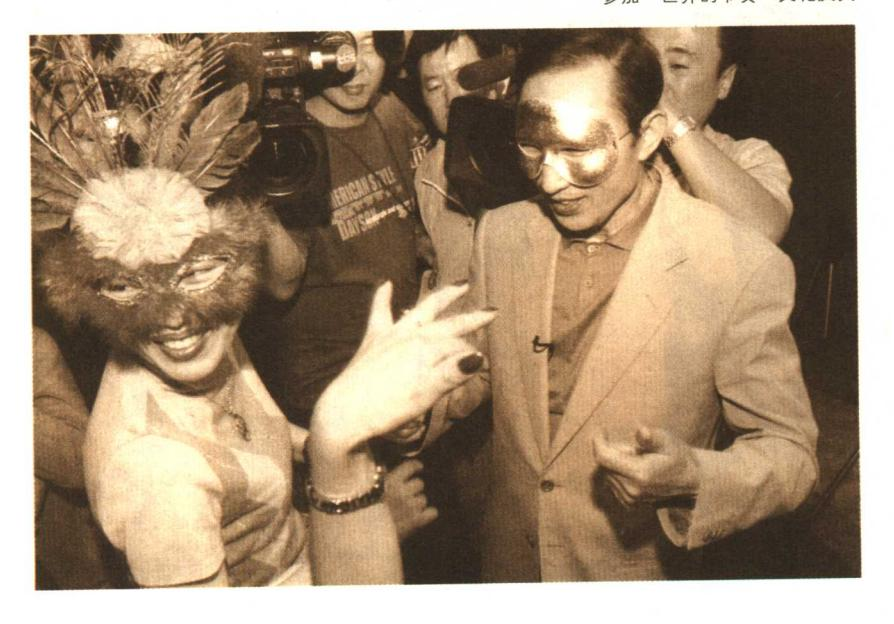

参加"世界的节奏"文化庆典

{179}------------------------------------------------

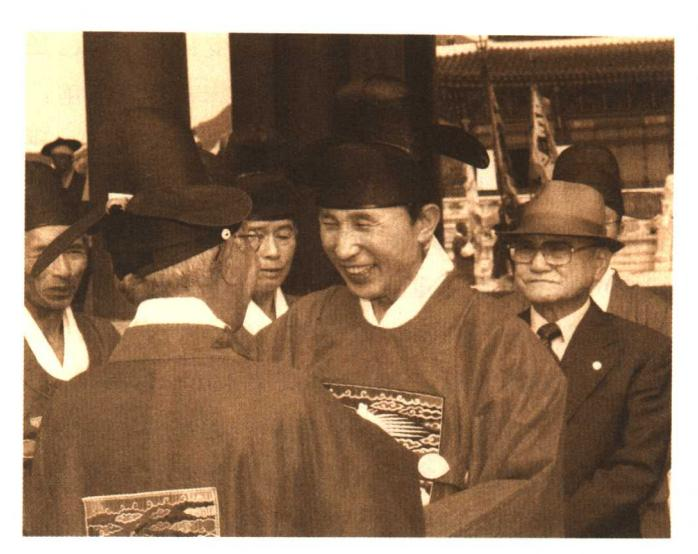

科举再现文化活动

"你好首尔"服装秀活动

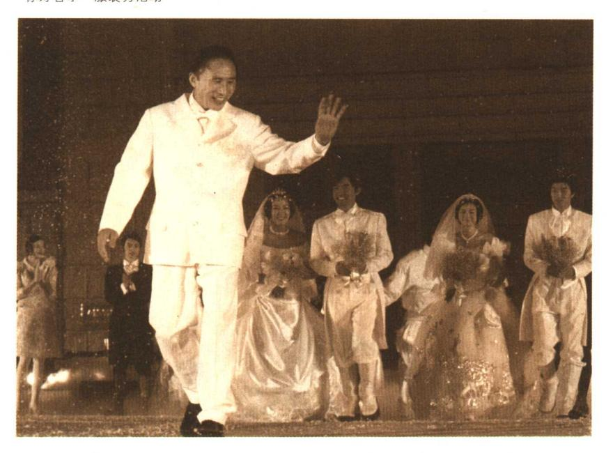

{180}------------------------------------------------

音乐会。在演出结束后的会餐中,身边的一位女职员突然挽起胳 膊, 开始用自己的相机拍照了。

"市长、茄子!"

大家笑成一团,原先有些不自然的气氛一下子变得融洽了。 "市长,来个交杯酒吧。"

另一位女职员举起胳膊提议干杯。

后来几次聚会也是如此。和基层职员们一起喝啤酒时,气氛总 是乐融融的。一些高层职员不敢提的问题,下层职员也会大方地 提出来。有时, 陪坐的区厅长们甚至因为下属的冒昧而脸色大变。 这种时候我心里其实特别高兴, 因为我感觉到, 挡在我们之间的 那堵墙已经消失了。由于工作繁忙,我不能经常和他们在一起畅 谈,但那些坦率、真诚的对话,的确让我受益匪浅。

和RAIN在一起

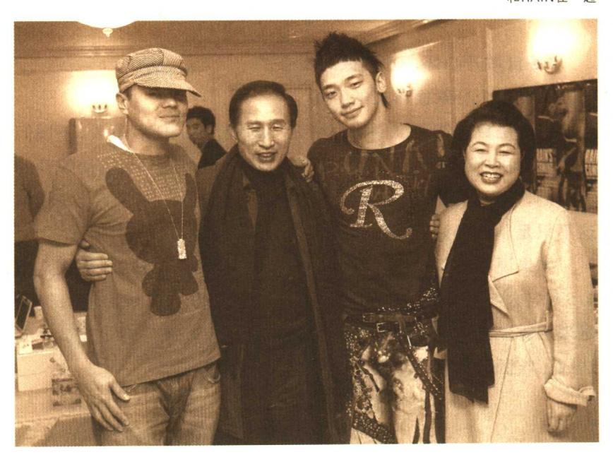

{181}------------------------------------------------

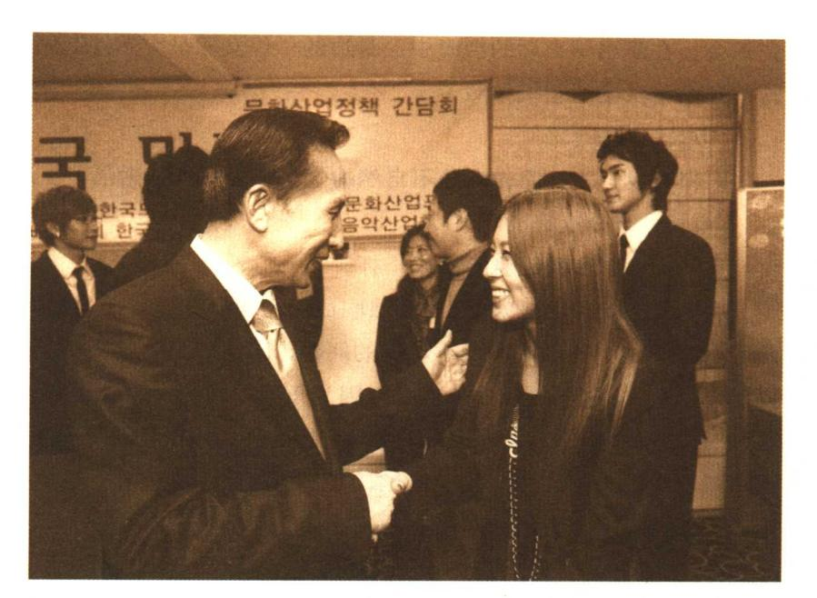

和宝儿在一起

"各自敞开心怀,才能彼此交心。"

这是一个朴素而珍贵的经验。

也许是真诚沟通推倒了那堵无形的墙,我上任后不久,下属们 对我的态度不知不觉改变了。以前在楼道里相遇时会悄悄躲开的 职员们,不知从什么时候起,开始亲热地和我打招呼了。我相信 这不只是单纯的好感,更是发自内心的信任。

如果说在首尔市政厅刮起的变革之风取得了成功,那么全市 4.5万名公务员和我之间形成的信任就是推动变革的原动力。无论 是采用强制性方法,还是依靠成员自觉,只要领导者与成员之间 达成了牢固的信任,风险负担就能大大减轻。

{182}------------------------------------------------

### 竞争力从哪里来?

上任首尔市长后,我努力在市政经营中导入企业意识,把我在企业经营中积累的知识和经验运用到市政工作中。那么,企业意识的核心是什么呢?我想把它定义为挑战精神——不安于现状、积极接受变化的精神,不轻易在困难面前低头、勇于挑战的精神。做到这一点不容易,但也绝非不可能。

我在生活、工作中遇到过许许多多的困难,但不管困难有多大,我都没有轻易放弃,总是拼尽全力去挑战、去奋斗。也许这种精神是在小时候的困境中自然养成的。从那时起,我的价值观的核心就是遇到挫折绝不放弃。

当今世界正处于一个巨变的旋涡之中。在超越国界的全球化 市场中,在日新月异的数字时代,企业和个人被迫投入在日益激 烈的竞争中。从这个意义上说,挑战精神是获得生存的必备条件。

真正的挑战者应该领先于时代变化。以前,对时代变化最敏感的是企业。如今,公共机构为了适应时代发展也在努力尝试变化与突破,提高服务意识便是这种努力的一方面。

我曾经多次提到"国家经营"和"CEO型领导者"的说法。很多人觉得这种理念很陌生,冷嘲热讽者也不在少数。

"因为是企业 CEO 出身,就想把首尔当成一个企业来经营吗?"

事实上,这种理念并不是我首创的。国际上各个领域都在呼唤 "CEO型领导者"的出现。随着冷战时代的结束,许多国家的领导 者开始思考:"如何才能让国民生活得更好?"转变政治统治观念、 为国民提供更积极服务的时代已经到来。 

{183}------------------------------------------------

一个具有创造性的人会经常问自己:"我还能做些什么?"进取性心态很重要,但在努力过程中不能忽视对成果的评估。以成果为中心的思考方式可以让人更加冷静、更加贴近现实地考虑问题。比如说,有一个和你关系很好的组织成员,作为优秀的领导者,你应该把私人感情放在一边,优先考虑这个组织成员的成果价值。这种方式看上去有些冷酷,但对整个组织来说是有益的。为了争取最大成果,朝着自己和组织的潜力最大化的方向思考,只有这样的CEO,才是真正具有挑战精神的领导者。

那么,一个具有挑战精神的人就一定能成为杰出的领导者吗?

答案自然是否定的。

杰出的领导者不仅需要自己具备挑战精神,还应当把这种挑战精神传染给组织成员。当每一位成员都变成积极的挑战者时,这个组织才会拥有强大的竞争力。

竞争是使组织充满活力的一剂良方。没有竞争的组织会陷于 惰性,越来越退步。在担任首尔市长期间,我十分注重部门间的 合理竞争,希望各个部门、各个成员之间通过竞争深化企业意识。

有时候,某一个项目并不能特别清晰地划归某一个部门主管。 遇到这种情况,我不会随便指派给某一个部门,而是等着哪个部门主动申请负责这个项目。这样慢慢地,从一开始的犹豫,到后来的积极争取,部门之间自然形成了竞争的风气。设立国际会议事务局(Convention & Visitors Bureau)就是引人部门间竞争的一个例子。

国际会议事务局是以吸引具有影响力的国际会议为目标的组织,除了提供会议场所信息之外,还要为主办单位和与会人员提供必要的服务,促进会议活动顺利进行。

国际会议事业是一项新兴的服务产业,有利于提升城市形象,吸引更多游客和投资者。召开国际会议本身就能创造高附加值,国

{184}------------------------------------------------

际会议参与者平均每人的消费额相当于普通游客的几倍。因此,世界各地的大城市都在想方设法吸引国际会议在本城市召开。

"首尔政府应当积极支持国际会议事业的发展。"

"为了推动国际会议事业、市政府应当支援民间企业。"

在我上任以前就有许多这样的意见,但市政府的态度一直比较消极,因为他们认为,民间企业在这方面已经做得很不错了。事实上,放眼世界,无论是民间企业主导,还是政府部门主导,绝大多数一流城市都设立了国际会议事务局,积极筹办国际会议。在韩国国内,釜山、大邱、济州岛等地方自治政府也在积极筹备国际会议事务局,各个国家、城市间的竞争日益激烈。在这样的情况下,首尔如果一味放手交给民间去运作是很难在竞争中取胜的。

我上任伊始,就新设立了新闻局下属的营销负责官。在我的理 念中,管理城市和管理企业一样,都需要有积极的营销意识和科 学的营销手段。

"我们首尔市是不是也应该设立一个国际会议事务局?"

有一天,国际会议相关团体通过营销负责官提出了这样一个方案。当时我自己也正在构想如何培养国际会议产业,因此欣然答应了。但是在后来的讨论会议上,没有一个部门站出来要求负责这一项目。严格地说,国际会议产业是属于产业局或文化观光局的职责范围,不知道是否因为之前一贯的消极态度,没有一个部门主动站出来。

"从城市营销角度看,这是一个很好的机会,我们部门想试试看。"

毛遂自荐的正是那位营销负责官。我赞许地对他说:

"发展国际会议产业是打造国际一流城市的基础, 你们努力试一试吧。"

营销负责官随即开始了筹备工作,但进展得并不顺利。为了召开与清溪川相关的国际会议,他们需要产业局和文化观光局的协

{185}------------------------------------------------

助。国际会议设施归产业局管辖,而食宿设施又归文化观光局管辖。掌握国际会议支援基金的也是产业局和文化观光局。另外,国际会议策划企业、旅游业界、酒店等相关部门的意见也很混乱,筹备工作遇到了层层阻力。

"由市政府和企业各出资 50%,给参与的企业提成。配比资金 (match-fund) 方案也许会受到业界的欢迎。"

提出配比资金方案之后,这个项目重新有了朝气。在时机成熟时,我们给各个酒店代表发了邀请信,以便开展实质性的协商。出乎我们意料的是,协商会议当天来了两倍于我们邀请人数的企业代表。从那以后,国际会议筹备工作渐渐走上了正轨。虽然后来也有过几次曲折,但首尔国际会议事务局最终在2005年成立了。

设立国际会议事务局的计划顺利完成后,其他部门的想法也 开始转变了。再有其他项目时,各个部门都开始表现出积极的姿态。试想,如果当初我安排一个态度消极的部门接手国际会议事 务局项目,结果会怎样呢?

国际会议事务局成立后,首尔市承接国际会议的能力从世界 第15位上升到了第10位。

### 节约10%的预算

合同审查科是为达到节约预算的目的而设立的,一方面邀请 土木、建设等领域的成本分析专家参与,另一方面内部职员也接 受了6个月的专业培训。

一开始,合同审查科几乎和所有部门都发生过大大小小的冲突,因为大家都还没有习惯改正以前的做法。但是慢慢地,各个部门开始出现竞相节约预算的现象。

{186}------------------------------------------------

说起来,创建合同审查科还是我在竞选首尔市长时提出的 构想。

"当选市长后要为首尔节约10%的预算!"

这句话不是空口承诺,节约10%的预算是有充分可能性的。以前,几乎所有项目的前期预算和实际花费都是一致的,预算100亿元就花了100亿,预算80亿元就花了80亿。每次预算的金额怎么会到工程结束时正好用完呢?对于这个疑问,或许可以从市民们的讽刺中得到暗示:

"预算的钱如果剩下了,肯定是不行的嘛。所以本来好好的,还 得再挖一挖。"

这不是哪个人特意传给我的话,而是以前街头巷尾的流行语。 每年年末,洞、厅等机关为了处理剩下的预算就经常修路、修设 备,像例行公事一样年复一年反复折腾,因为如果不花掉剩下的 预算,这一部分就会从下一年的预算中扣除。

我上任以后就决心要改变这种不合理的惯例,实行高强度的 预算节约政策,以此为目的设立了合同审查科。

以前,工程合同都是在各部门内部处理的,因此信息的共享、协调或联系都很不充分。虽然有基本构架,但要做出一个通用范本并不容易。合同审查科破格改变了以前的合同惯例,标准单价和高级信息等实现了共享。

当然也有副作用。一开始,合同审查科频繁地与签订合同的部门发生冲突,虽然该部门已经做了很紧的预算,但合同审查科还是要求进一步紧缩预算。

- "你们和我们都不是专家,凭什么就让我们削减预算?"
- "按这个金额吗?那你们自己做做看吧。"

合同审查科的职员和其他部门的职员之间一度关系紧张,甚至有职员把合同审查科叫作"死神",摆出一副拒之千里的姿态。 但就是在这样的困境中,合同审查科渐渐站稳了脚跟。 

{187}------------------------------------------------

另一方面,首尔市管辖的施工企业也与合同审查科产生了许多矛盾。以前,如果使用新的施工方法或新的工程技术,单价一定会提高,但合同审查科成立以后,这个惯例就行不通了。他们会在施工前期进行严密的分析讨论,研究新技术是否必要、是否可行,因此难免引起施工企业的抵触。

举个例子来说:在苑南、弥阿高架路拆除工程中,就发生了切割施工企业不予合作的情况。他们拒绝提交相关资料,要么就是敷衍了事。

- "我们明确说过请你们提交资料,怎么没带来呢?"
- "以前从来没有对资料进行过讨论,现在为什么突然要这么做?"
  - "从现在开始,任何工程都要从讨论资料开始。"
  - "我们不能提供资料,这是我们的商业机密!"

企业拒绝提交资料,但这种不合作态度的最终受害者是企业本身。经过广泛收集意见和反复讨论,对于钻研切割工程,首尔市制定了一个合理的预算标准,并且根据这个标准成功完成了施工项目。在两条高架路拆除工程中,节约预算达到了3亿韩元。

经过艰苦工作和不懈努力,合同审查科在3年间为首尔市节约了4472亿韩元。

我第一次和一个部门的全体职员聚餐就是在合同审查科。在 我看来,这支节约预算突击队尤其需要我们的鼓励与肯定。

事实上,合同审查科成立之后,各个部门就逐渐表现出了节约 预算的积极态度。部门之间的竞争也使得节约的氛围越来越浓。施 工企业在经过一段时间的磨合之后,也逐渐抛弃了利用不当方法 获得不当利益的做法,开始更努力地通过项目经费的科学管理、新 技术的开发等方式节约成本。

建设安全本部、上水道事业本部等市政下属机关也自行设立了成本分析部门,开始关注节约预算的问题。这种竞争性的节约

{188}------------------------------------------------

意识不仅在首尔蔚然成风,还扩大到了全国范围。蔚山广域市和 忠南牙山市也相继设立了合同审查科。在建设的第一线,施工现场的器材使用、向民间租赁闲置设备或综合购买材料、在道路标 识或手册上招集广告等,即使没有人督促,各个环节也会十分注 意成本控制。

首尔市在2005年一年就成功节省了8000亿韩元的预算。节省的费用一方面用于增加市民福利,另一方面用于偿还地铁施工债务。不过我认为,最难得的还是由上至下的节约意识的形成,以及由此扩散到各个成员、部门间的竞争意识。

美国管理学者道格拉斯·麦格雷戈在20世纪60年代就提出了当时还很新鲜的"X理论与Y理论"。X理论是指"大多数人是懒惰的、逃避劳动的,只有在经济动机的推动下才会去劳动,没有接到指示和命令就不会实行"的假设。根据X理论,除了金钱上的刺激以外,赋予动机的方法只有指示和命令。

相反, Y 理论是指"人希望发挥自己的能力, 通过劳动实现自 我价值, 不是他人强迫, 而是为自己设立的目标而劳动"的假设。

道格拉斯·麦格雷戈的"X理论与Y理论"的核心问题就在于:如何让成员投入工作?

X 理论排斥人的自发性、自我实现等动机,表现出许多局限性。以 X 理论为基础的组织渐渐被时代发展所淘汰了。在一定的时期或状态下,指示和命令是有效的,但依靠这种方法绝对不能发展为一流的企业或组织。近年来,大部分企业或组织都倾向于 Y 理论,注重成员的主观能动性。"新风经营"、"FUN经营"、"恢复员工士气"等项目也是以道格拉斯·麦格雷戈的 Y 理论为依据展开的。

如果说有活力的组织是以Y理论为基础的,那么赋予动机就 更显其重要性。我希望首尔有竞争之风,但强制竞争就能解决问 题吗?强制实行往往达不到预期效果,赋予成员动机、引导竞争 氛围才是长期有效的良方。

{189}------------------------------------------------

### 现在是专家时代

我一直相信"人才可以改变世界"这句话。这是我经历了艰难的成长、求学、事业开拓之后,始终珍藏在内心的一个信念。

我在12年里从低层职员上升到CEO的位置,靠的是企业主的信任,为了报答这份信任,我更加努力地工作。在这12年里,我个人的境遇改变了,我生活的国家也发展了。

依靠这些经验,我相信通过努力,个人、社会、国家都是可以 改变的,而引导这种变化的正是人才。个人的竞争力最终将汇聚 为集体的竞争力。

那么,在如今这个全球化时代,在竞争日益激烈的国际环境中,我们需要的究竟是什么样的人才呢?

我认为,能被这个时代所承认的人才,就是具有时代使命感、 开放性思维和挑战精神的专家。

在当今世界,一切都在飞速变化,信息通讯的变化速度更是超出想象。对信息的利用能力与程度拉开了人们之间的距离。个人之间、国家之间的信息两极化很快就会导致收入的两极化。

与劳动量相比,劳动的效率更显重要。有效用的劳动正在持续 替代无效用的劳动,今后这种替代还会更加迅速、深入,其导致 的结果就是个人和企业必须发掘效率更高的劳动领域。

一个优秀的人才应当正确认识这种时代的趋势,并且应当具 有献身于社会的使命意识。有使命意识的人会自发培养个人欠缺 的能力,更好地为社会服务。

与具有多方面才能的人相比,拥有一技之长的专家或许更能 适应这个急速变化的时代。固然,在某些领域需要具有多方面才 

{190}------------------------------------------------

能的人,但随着时代发展,如果不能成为专家,将很难获得生存。即使是专家,也不能只满足于单纯的差异性。正如首尔要和世界一流城市竞争一样,每个专家也都要和世界一流的专家展开竞争。

在市政工作中,如何运用专家是一个重要课题。尤其在官僚组织中,提高工作的专业性、效用性,专家的参与尤显重要。公务员和相关领域专家的协作程度往往决定着工作的成败。

在首尔"新城市"(NEW TOWN) 开发事业中,相关专家的参与就起到了非常重要的作用。

新城市项目的目标是开发相对落后的首尔江北地区,缩小江 南与江北的差距。首尔是一座历史悠久的城市,从朝鲜王朝太祖 李成桂定都以来,经历了六百多年的沧桑。城市功能性老化、缺 乏整体规划性是城市建设面临的一大难题。当然,这不是首尔独 有的现象,世界上任何一座古老的城市都存在这样的问题,对旧 城加以开发改造也经常引起大的争论。首尔要做的是再开发、再 建筑、改善城市整体居住环境。

但是,以前的再开发、再建筑工程往往只注重当时的开发利益,缺乏对周边基础设施的整体考虑。虽然房子改良了、户数增加了,但是道路、管道、学校、公园等生活基础设施并没有跟上。 人口虽然增加了,但如果周边设施没有改善,居民的生活质量反而会下降。

正因为这样的恶性循环,才出现了"江北地区开发了,房价却下降了"这样的奇怪现象。相反,江南地区因为新城的便利条件,公园、学校等周边配套设施的完善,房价一直持续上升。

江北和江南的差距越来越大,这成了一个亟待解决的社会问题。新城市开发项目正是基于这样的现状而提出的。具体的构想是以大型生活圈为单位,把再开发的地区捆绑为一体,由首尔公共部门支援道路、学校、公园等基础设施的建设。

如果说,政府官员和城市学者创造了"新城市"这样一个概念,

{191}------------------------------------------------

那么,具体的勾画、实践工作还得靠相关的专家来掌握。因此,我们在新城市开发项目中导入了MA(Master Architect)制度。

MA小组由建筑、城市设计等领域拥有丰富经验和知识的专家组成。在新城市开发项目中, MA小组不是按照以前的平面开发计划, 而是立足于立体开发, 制定全方位的开发计划。

由于他们的参与,新城市开发项目最终确立了符合地区特性、注 重环境持久性、以人性化为中心的开发理念。新城开发型、居住中心 型、城市中心型等不同地区的不同定位也是由 MA 小组运作的。

除了城市开发项目之外,金融专家、通商专家等也在其他领域的工作中起到了积极作用。

但是,在强调外部专家的专业支持的同时,我们更加应该注重 公务员组织自身的专家精神的培养。

"只有提高韩国公务员的整体竞争力,韩国才能改变。如果 首尔市的公务员有了好的转变,整个韩国的公务员也会随之发生 变化。"

这是我出任首尔市长后接受媒体采访时说的话。改变公务员 面貌是我和市民的约定。

变化应该从最基本的一点一滴开始。与巨大的爱国心相比,加强自己领域内的专家精神更具实际意义。如果具备了专家精神,就会自然衍生出为市民服务的精神。首尔市的人才首先应该是满足这种要求的人。

我上任后很快着手从各个部门里选拔组长、科长、局长,派到 国外去学习。

"李明博市长到底想干什么呀?"

或许大部分公务员都会有这样的疑问。新市长不召开研讨会,而是急急忙忙花那么多钱把公务员派到国外去,这是走的哪一招啊?

其实我的意图很简单, 我就是想让他们亲眼看看世界先进城

{192}------------------------------------------------

市的行政管理。

"公务员组织应该更具竞争力,所以要把企业意识体制化,要 强化对市民的行政服务意识……"

与其听这样的唠叨,还不如让他们直接去体验,"百闻不如一见"。

出于这样的目的,建筑科长被派往城市建设最好的地方去学习,福利局长被派往福利体系最完善的地方去学习,环境科长、策划科长、文化局长也是一样。派往国外的公务员回来以后,又对所有公务员进行了三天培训。地点在龙仁的三星集团研修院,从副市长到9级公务员无一例外全部参加。

培训的方式也和过去完全不同,不是单纯地让讲师在讲台上讲三天课,而是在民间机关制定系统性的日程,亲自体验、自我反省。培训前和培训后的变化也在专家的关注范围内。我们不要求有多么巨大的变化,相信只要有一点细微的改变,就能引起整个行动的变化。

成员的变化应该是至上而下的, 部门领导者应该是变化的 主体。

上任伊始我就传达过这样的信息:

"以前是官职越高,越不了解现场情况和工作进展。现在的首尔不需要这样的领导者。我希望主事、组长、科长不要再把下属起草的东西变换几个字后就向我报告。"

之所以如此强调,也是因为以前就出现过这样的情况。作为一个领导者,即使不能详细了解某个方案,也应该大体掌握工作的基本脉络。但以前的情况是如果不找直接负责人,连基本的统计数据都无法了解。

为了革除这种充满惰性的官僚主义,我要求在定期举行的室 长、局长研讨会上,各个负责人要汇报各自部门的工作现状,其 他人员可以提问,甚至提出反对意见,然后进行辩论。项目的策 

{193}------------------------------------------------

划重点、促进过程中的障碍、克服障碍的方案等都是讨论的对象。 尤其在室长、局长以上级别官员参加的会议上,各个负责人一定 要详细了解自己部门的工作。如果拿着职员们写好的材料去参加 研讨,只会让自己出丑,在这方面是没有情面可讲的。

另外,通过这样的交流、辩论,各个部门之间也实现了一定程 度的资源共享。文化局长也可能对城市计划局的工作提意见,交 通局长也可以为文化局出谋划策。

我不认为靠几个专家就能改变整个组织。要想让组织强盛起来,就应该让所有成员都成为各自领域的专家。我上任后促进的培训活动就是为了培养这样的专家,从而提升整个组织的竞争力。

### 拥着反对者一同前进

要使自己促进的变革取得成功,必须获得强烈拥护自己主张的支持力量。

"发现拥护者,与他们沟通,得到他们的支持,这是促进变革的核心成功因素。"

这是《强力沟通术》(Powerful Conversation)一书的作者菲尔·哈尔金斯的主张。他通过对大量企业案例的分析,指出在大部分企业中,热烈响应的集团是促进变革的主要力量。

正如菲尔·哈尔金斯所指出的,变革不可能只靠领导者一个人的力量来完成。失败的改革大多是因为核心人才没有发挥各自的能力。核心人才应当渗透到组织的各个部分,主导和引导变化。在这个过程中,变化就会自然渗透到组织文化中。

有一点要注意的是,对核心人才以外的中层集团也应该多加 关注,毕竟中层集团占据着组织的大多数,应当不断地赋予其动 

{194}------------------------------------------------

机,使他们成为变革的核心力量。以足球运动为比喻,如果中场力量薄弱,前场的攻击力再强也不能取得胜利。在制定比赛策略时只考虑前锋的教练不可能成为一流的教练。

另一方面,在组织内部也经常会有持反对意见的集团。作为领导者,应当如何处理对自己的工作目标和工作方式持反对意见的人呢?

一般有三种回答:第一是说服,第二是包容,第三是剔除。

在说服不了、又无法包容的情况下,为了整个组织的顺利运转,最后只能采取剔除的方式。但在现实中,这种方法实行起来 很难,也不是大家希望看到的局面。

我的主张是: 拥着反对者一同前进。

包容反对者是变化经营和人才经营的一种方法。

在我担任首尔市长期间,发生过这样一件事:

有几个区厅长对一位负责一线工作的局长表露过不满。

"什么事情一到那边就杳无音信了,工作没法展开。"

"只要那个人还待在那个位置上,我们区里什么项目也上 不了。"

不满的原因在干这位局长对开发项目的限制太过严格。

站在各个区厅的立场上,一定程度的开发是必要的,只有这样才能提高就业率、增加税收,地区经济才能复苏。但是,那位局长更加偏重限制需求的政策,所以对开发可行性的标准定得非常严格,很多项目计划在他那里都得不到批准。

事实上在发展政策上,民选三期和民选二期是有差异的。民 选二期政府或许是把焦点放在抑制需求上,而民选三期则侧重均 衡发展。

"市长,利用这次机会换个新人吧。"

不仅仅是区厅长和市议员,由于民怨较大,连幕僚们也异口 同声地这样主张。但是,我并没有撤换那位局长。主张限制开发 

{195}------------------------------------------------

是他个人的政治哲学,他不是为一己私利才这么做的,只是延续 政策的一贯性。他是说服的对象而不是剔除的对象。

在工作中,遇到反对意见是难免的。一位优秀的领导者应当有能力包容反对者、说服反对者,拥着反对者一同前进。只有这样才能形成健康的人事习惯,使组织更加牢固。如果一听到反对意见就予以剔除,最终只会使自己陷于困境。

领导者制定的目标最终是通过人才得以实现的。人才开发是领导者必须面对的重要课题之一。领导者应当系统地、持续地培养人才,并且为人才搭建发挥能力的平台。只有这样,当领导者离开组织的时候,组织才会因为人才的支撑而屹立不倒。

{196}------------------------------------------------

国家政策的最大目标是创造就业。

在市场经济体制下,政府应当想办法帮助在竞争中处于不利懂得关心困境中人的社会,才是正义的社会。

地位的弱者。

让有工作能力的人获得工作的机会,这才是幸福的社会。

57 mo

{197}------------------------------------------------

### 一、效率——截住流出去的钱

### 转换思路能省钱

"下一任市长光是偿还李明博留下的债务也忙不过来啊。光一个清溪川就花了3600亿韩元,还有首尔广场、交通改造、首尔林,这些工程都花了多少钱啊?"

这番话出自一位出租车司机之口,是秘书室的职员传达给我的。那名职员有些不快地说:"民选三期市政府一边努力做项目,一边还偿还了地铁施工的一半债务,每年能节省数千亿元的预算。这些事实市民们根本就不知道。"

我只是笑笑,没说什么,因为那样的话我也不是第一次听 说了。

"这么干下去,首尔迟早会破产!"

"债务怎么可能减少?我看只会增加更多!"

不仅在市民中间有这样的传言,一开始连公务员内部也有许 多质疑声。但不到一年,公务员内部的质疑声就消失了,因为大 家都切身感受到了节约预算的成果。

我一上任就强调节约预算,支持者寥寥无几。连亲近的幕僚也忠告我说:

"市长,咱们怎么可能一边高喊节约,一边大力促进复原清溪川、改造大众交通、扩大文化福利项目呢?"

他们建议要么减少项目,要么降低预算节约额,二者选其一。 但我不能同意他们的想法。

"我们一直在仔细研究以前的预算使用情况,看到最多的就是

{198}------------------------------------------------

浪费性的预算。光是节省这一部分就是一个不小的数目。和以前 浪费的数目相比,我们要推进的新项目其实花不了多少钱。"

我这样回答他们。

以前,政府在预算制作程序上太过疏忽。本来应该进行仔细调查后再制定的预算,大多就是按照上一年度的习惯照本宜科。即使情况有所变化,也还是沿袭惯例,所以经常多出一些用不到的预算。如果我们能把这些不必要的浪费杜绝掉,节约预算就不是一件难事。

事实上,我们也确实取得了成功。

"李明博有什么秘诀,可以节约那么多预算?"

这是很多人都想知道的。

第一个原则是: 在项目实施过程中发挥创意。最需要警惕的就 是按照惯例、贪图方便的工作方式。

"怎么才能花更少的钱、获得更高的效率?"

首尔的公务员们养成了这样一种思考方式。

在复原清溪川工程的实施过程中,我们遇到了既要拆除三一高架桥,又要确保道路通畅的问题。一旦拆除高架路,行车道必然会减少。代行方案是把一部分行车道改成 P 字型。为了补充减少的行车道,就要在原先的人行道上加以扩充。而且为了确保道路占地,还需要拆除路边建筑。可以想见,以这种方式扩充道路的话、光是拆迁费就是一笔很大的支出。

"必须拆除路边的建筑吗?有没有其他更好的方法?"

有关负责人也为这笔巨大的补偿费而大伤脑筋。**一番苦**思冥想之后,创意就出来了。

"不需要拆除所有的建筑,我们只要把一部分建筑改成'一'型就可以了,利用凹进去的一部分作为人行道。"

就这样一个简单的创意,节省了数百亿韩元的建筑拆迁费。如 果按以前的惯例行事,浪费是难以避免的。由此可见,只要改变 

{199}------------------------------------------------

一下思路, 发挥一点创意, 就有可能节约预算。

第二个原则是: 彻底考虑项目实施的妥当性。在变更设计或技术时, 我们经常会讨论: "一定要用那种方法吗?"

地铁9号线区间设计招标时就发生过这样一件事。当时设计招标工作已经接近尾声,但是我发现,各个区间的金额差异很大。

- "为什么相同的区间,金额相差这么多?"
- "因为招标的方式不多。一个是承包,另一个是联合。"
- "为什么招标的方式不同?就算是招标的方式不同,就应该有 这么大的差异吗?"

"这个……"

负责人以难堪的表情搪塞过去了。后来经过打听才知道,有的 区间之所以金额高,是因为地铁内外部装修用的都是高级材料。我 问相关负责人:

"使用这么高级的材料,理由是什么?"

对方无言以对。最终,中标企业重新制定了那个区间的装修设计方案,比最初预算节约了20%以上。

在建设地铁站残疾人专用电梯项目中,也发生过类似的情况。 在我担任市长初期,曾经发生过残疾人从地铁电梯上跌落致 死的事件。我亲自去现场察看了残疾人用电梯,发现果然存在着 安全隐患和不方便之处。

"要确实改善残疾人公共设施。首先在各个地铁站设置方便残疾人和老弱者使用的电梯。"

我做出指示后,相关部门便着手制定改进方案和项目预算。但是结果,预算金额大大超出我的想象。

"怎么会需要这么多呢?"

我召集人员对设计方案进行讨论,仔细核算各部分金额,答案 很快出现了。地铁区间的电梯是为老弱病残者准备的,需要使用 的人数并不多,一天平均使用的次数也不多。但是,设计方案却 

{200}------------------------------------------------

是按照多数人都乘坐的高层建筑用电梯的标准计算的。

"供老弱病残者使用的地铁电梯有必要和一次能容纳几十人的 高级公寓或办公大楼的电梯一样吗?不需要那么华丽,也不要求 速度特别快。"

对设计方案进行合理修改之后,又省下了一笔可观的预算。地 铁残疾人用电梯的设置是一项面向未来的投资。如果单纯比较投 人金额,也许给首尔市的残疾人每人购买一辆汽车更加经济,但 是考虑到社会高龄化趋势,站在市民福利立场上,我们认为还是 应该把资金投入这样的基础设施。

无论什么项目,只要从开始阶段就彻底考虑各个环节是否处 理妥当,如何更有效地使用预算,就有可能做到最大化的节约。

### 把税收当做自己的钱来用

"能这么快晋升的原因是什么?" 这是我在现代建设公司任职时,经常被问到的一个问题。 每次我的回答都是一样的:

"因为我把公司的钱当做自己的钱,把自己当做公司的主人。" 把公司的钱当做自己的钱一样珍惜,实质上就是全身心地投 人工作。在出任首尔市长后,我反复向公务员们强调的也是类似 的话:

"我们应该把税收当做自己的钱一样使用。企业的目标是赚钱, 花钱投资的最终目标也是赚钱,但是,公务员的职责是用好每一 分税金。从这个层面上说,公务员只需要做企业一半的事情,所 以应该做得更好。"

一个企业如果经营不好,受到损失的只是企业成员而已,但 是,如果首尔的公务员不能有效地使用税收,那么遭受损失的将 是1000万首尔市民。从这个意义上说,公务员比企业经营者担负 

{201}------------------------------------------------

的责任要大得多。这也是我之所以提出公务员应当把税收当做自 己的钱来用的首要原因。

但现实情况又是如何呢?

浪费税收的事例不胜枚举。

京釜高速铁路最初的工程预算是5兆韩元,但事实上花了多少钱?这么大的数额,也许能救活许多陷入资金困难的中小企业,也许能更换全部中小学校的教育设施。执行政策的公务员如果具有主人翁意识,把税收当做自己的钱一样使用,那么很多不必要的花费是可以被阻拦下来的。

首尔在2005年一年时间里就节约了大约8000亿韩元的预算。 听到这个数字,肯定有人会摇头:

"到底做了什么就节省了8000亿?难道说以前的预算都是像气球一样吹起来的吗?"

但这的确是我们通过合理的方式、减少不必要浪费所获得的 成果。反推上去便可想见,以前的预算浪费有多么严重。

首尔市政府把税收预算分为分配预算阶段、合同制定阶段和项目执行阶段,实施一环扣一环的节约方案。在分配预算阶段通过制定具体的事业计划、进行事业量的调查达到节约目的,在合同制定阶段通过讨论技术妥当性、成本计算和决定合同方法等方式达到节约目的,在项目执行阶段则是通过改进设计方案和工作方式、引入新的施工方法等,为节省每一分钱而努力。

这8000亿就是用这样的方式和态度挤出来的。

2006年,首尔的地铁首次实现了盈利。在我就任初接近5兆 韩元的地铁运营负债减少了2.1兆韩元,这都是全体公务员努力的 结果。如果不注重节约预算,首尔的地铁费用将不得不再一次增加。之所以能减少地铁工程债务,就是因为实行了一定程度的责任 经营制。地铁运营负责人不得不通过附属项目,在增加收益方面下 工夫。这也是民选三期首尔市政府提倡企业经营意识结出的硕果。 

{202}------------------------------------------------

在我经营首尔的四年里,节约预算的努力是提高行政效率的 最好体现,对此我感到骄傲。把取自市民的税收当做自己的钱来 用,这就是最有效率的方式。

### 二、品牌——营销"首尔株式会社"

### 用太极旗覆盖市政厅

"每年10月3日开天节,我都把具有特殊意义的太极旗挂在欧洲唯一的李儁烈士纪念馆(Yi Jun Peace Museum)的正面……我只是一个普通的爱国者,但我每天早上都会在李儁烈士纪念馆升起太极旗。从1995年开馆以来,在过去的10年里,除了周日以外,我每天都把这面国旗升起在异国的古屋上,心里默默地、大声地喊着:'大韩民国万岁!'"

在荷兰海牙李<mark>偶烈士</mark> 纪念馆签访问册

{203}------------------------------------------------

这是2005年10月,荷兰海牙"李儁烈士纪念馆"管理人李先 生写给我的一封信。

2005年8月15日,首尔市为了纪念光复60周年,用3600面 太极旗覆盖了市政厅本馆。当时使用的第一号太极旗就捐赠给了 "李儁烈士纪念馆"。因此,李先生给我寄来了这封感谢信。

为纪念光复60周年,在市政厅举行太极旗装置活动就是以营 销城市品牌为思路策划的。在全球化背景下,强化一个国家或一 个城市的品牌概念非常重要。

"什么样的活动能激起市民们的民族自豪感呢?" 这是我们在活动策划阶段考虑的中心问题。光复60周年意义

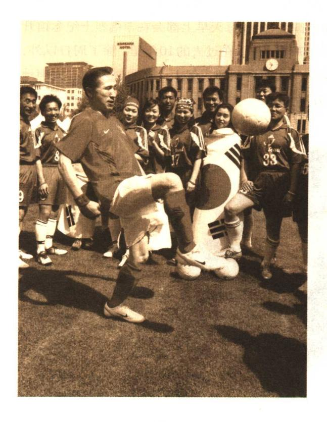

为世界杯加油

{204}------------------------------------------------

非凡。大韩民国经过建国、近代化、产业化、民主化,一直到现在接近发达国家的门槛,首都首尔在整个历程中一直起着领头作用。 作为全国近代化和产业化的中心、1988年奥运会和2002年韩日世界杯的举办地,首尔在提升大韩民国的形象上一直站在最前沿,首尔市民也因此充满自豪感。但是最近几年,因为首都搬迁计划,这种自豪感和象征性渐渐减弱了。

在策划光复60周年庆典活动时,我们的目标就是想让首尔市 民重新找到自豪感,提升首尔的城市品牌形象。

"是不是可以通过太极旗的形象,让市民们联想到2002年世界 杯时大家聚集在市政厅前面的广场上呐喊助威的情景?"

从这个创意出发,最终诞生了用太极旗覆盖市政厅本馆的 方案。

"市政厅大楼以及前面的广场对首尔市民来说具有浓厚的象征性。再说,市政厅大楼不是在日本侵略时期盖的吗?如果我们用太极旗覆盖整个本馆,然后在广场上演奏《韩国幻想曲》,一定会令市民们印象深刻,油然生出一种自豪感。"

方案确定了,接下来便是执行问题。怎么用太极旗覆盖市政厅本馆呢? 一开始的想法是用一面巨大的太极旗,但执行起来有困难,因为市政厅大楼的形态和太极旗的比例不相符。还有人提议,在市政厅前面支一个大支架,然后把太极旗挂在支架上。这个方案也不理想。

"是不是想得太难了?为什么一定要用一面太极旗呢?我们可以在市政厅大楼上拉一些晾衣绳那样的绳子,在上边挂很多太极旗,让无数太极旗随风飘扬起来,这不是很好吗?"

我在讨论会上提出自己的想法。以我的意见为基础,年轻的活动家们开始了具体布置。考虑到市政厅大楼的形态,最终决定使用一面大太极旗和 3600 面小太极旗。

首尔市纪念光复60周年活动引起了市民们的强烈反响。8月

{205}------------------------------------------------

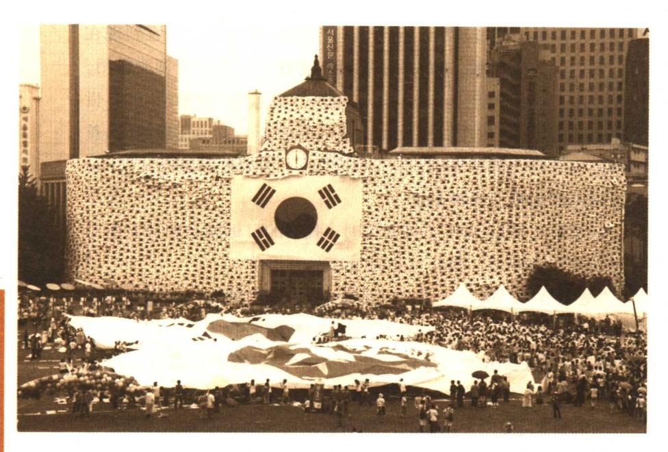

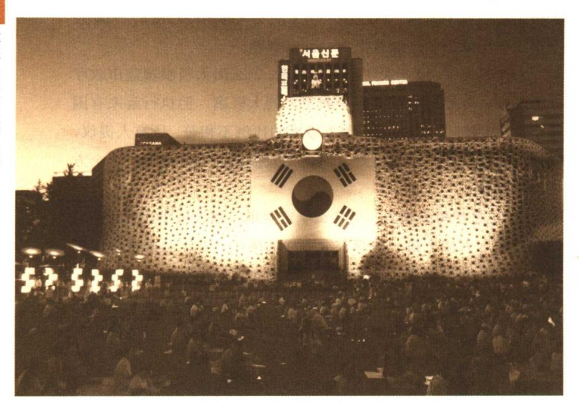

{206}------------------------------------------------

15日那一天,早早赶来的2万多市民把首尔广场围得水泄不通。在首尔广场上,世界著名指挥家郑明勋率领首尔交响乐团圆满完成了第一次演出。这次活动不仅在国内反应良好,日本NHK电视台等媒体也大张旗鼓地报道了首尔的太极旗和爱国歌活动。

活动结束后,我们把这3600面小太极旗分发给了市民。原本是想免费送给市民的,但由于担心引起政治上的误解,最后决定采用邮寄的方式送给提出申请的市民,每件只收取1000韩元的邮寄费。从市民们的踊跃申请中,我们体会到了这次活动带给他们的深深感动。

### 改"汉城"为"首尔"

人们常说现在是一个"品牌时代",因为品牌价值是决定市场成败的关键要素。美国营销协会对"品牌"的定义是:意在识别一个或一群卖主的商品或服务,并将其与竞争对手的商品或服务区分开来的名称、术语、标识、象征、设计及其总和。

城市品牌的概念也是一样。象征一个城市的名称、环境、符号、文物、庆典、市民的亲切度等等所有这些因素合起来,就形成了这个城市的品牌形象。例如,巴黎的品牌就是城市风景、艺术氛围、文化传统与巴黎市民生活协调的整体形象。巴黎为了强化这样的品牌形象,运用了文化商品、城市象征等各种品牌战略。纽约、伦敦、罗马、新加坡等城市也在城市品牌营销方面下足了工夫。

"现在我们应该把首尔的城市形象、城市品牌、城市历史培养 成我们的文化资本。"

这是我在2003年说过的一句话。这不是突发之想,而是从很早以前就有的想法。在担任首尔市长之前,我在企业做过很长时间的CEO,有过多次访问世界一流城市的机会。在接触、了解这些城市的行政、交通、福利、文化的同时,我也感触到了各个城市

{207}------------------------------------------------

在提升品牌形象方面的努力,由此我便想到,首尔也应当制定符 合我们这个城市特性的品牌战略。

起一个好的名字是品牌战略的一环,因为名字可以体现形象和价值。民选三期市政府设立的"城市绿化局"、"健康城市促进班"、"城市设计科"等部门,一看名字就知道工作内容和性质,还能给人一种亲切感。

"清溪广场"是在市民广泛参与的基础上最终确定的名字。我们在3700多位市民建议的名字中选择了最上口、最容易记住的"清溪广场"。征名活动拉近了市民与工程之间的距离,给人以一种更亲切、更贴近的感觉。

品牌名称战略中,最引人注目的就是变更城市的中国语标记。 2005年1月,我们宣布把我们这座城市的中文名称从"汉城" 改为"首尔",取"首屈一指的城市"之意。

其实,变更首尔的中文标记,这已经不是第一次了。公告处在 10多年前就开始试行,但考虑到各方面因素,一直保留着"汉城" 这个名字。

从现实生活考虑,"汉城"这个名字也大有更改的必要。有时候,中国人在首尔就会因为名字的关系遇到诸多不便,比如汉城(国立 Seoul)大学和汉城(私立汉城)大学就很容易混淆。站在提升城市品牌形象的立场上看,更改"汉城"这个名字也很有必要。但是,和10多年前一样,方案提出后就听到了担忧的声音。

"中央政府想做但没有做成,首尔以前经过多次讨论,最终也不得不作罢。现在又要提出这么做,能行吗?"

中文名称变更工作在一开始的几个月间只是从这个科推到那个科,从行政科,到国际合作科,到文化科,最后到了文物科。文物科为此设立了由中国语教授、中国事务领域记者、当地中国人组成的咨询委员会。

"汉城这个名字是怎么来的?是过去给中国进贡的附属国首

{208}------------------------------------------------

都的名字。从一定意义上来说,带有轻蔑的意思。现在我们的城市正在为跻身世界一流城市之林而努力,更改名字是一个时代性课题。"

我再次向咨询委员会强调更名的重要性。我没有催促尽快实行,而是希望充分收集意见。咨询委员会召开了研讨会,广泛收集市民们的意见,公开征集新的城市名称就用了一年多时间。征集活动是通过网络进行的,也有意征求了中国人的意见。在征集到的名称中,经过咨询委员会审核,最终选择了"首尔"。

2005年1月19日,我正式宣布把"汉城"的中文名称改为"首尔",但立即遭到中央政府的反对。

"'首尔'这个词以前根本就没有,也违反了韩语的习惯。"

"街道上的指示牌怎么办?把那些牌子都换掉得花多少时间?"

"这么做会不会刺激到中国?改名字可不是那么简单的事情!"

文化观光部、外交通商部最初都站在反对立场。首尔市已经发表了更名公告,因为中央政府的反对,一度面临加重混乱的危机。

市政厅的文物科长决定直接去面见政策室的负责人。

"如果说早晚要变更,现在是最好的时机。"

政策室的负责人表示了支持,但外交通**商部还是以需要更换** 标记的预算和时间为理由提出反对。

"据我们掌握的情况来看,需要更换的标记并不是很多,从机场到市中心的机场路上只有10多个有中文标识的标牌,先更换这一部分,然后变更一部分交通地图就可以了。"

文物科长直接反驳了外交通商部的理论,在国务总理室与有 关负责人进行协商后,最终获得了认可。

从确定新名称到获得中央政府同意,一共花费了大约两个月时间。2005年3月初我去国外访问的时候,机场路上的中文标识还是"汉城",等我回来的时候,已经变成了"首尔"。一开始持反对意见的外交通商部也终于改变了想法,向中国递交了正式外

{209}------------------------------------------------

交书函。

给予我们最多帮助的反而是民间领域的中国人。和中央政府 一部分部门的担心不同,他们很快接受了这种变化,因为新的名 称给予了他们更多方便。接下来就要看中国政府的立场了。

"中国人是讲究实用性的。如果用'汉城'这个标记,不方便的反而是中国那边。改成'首尔'之后,韩国人和中国人的交流会更加方便,所以中国政府也一定会接受的。"

"如果中国政府不接受,该怎么办?"

有关负责人表示了担心。

10月24日,中国政府对外宣布,中国将启用韩国首都汉城市的中文新译名"首尔"。而在两个多月前,中国国家主席胡锦涛在发给卢武铉总统的8月15日光复60周年贺函上就已经使用了"首尔"这个名称。

"首尔"不仅仅是一个单纯的名字,它将成为一个影响广泛的固有品牌。在顺利完成更名工作之后,文物科连续两个月拿到了成果奖金,他们完全有这个资格,因为他们完成了一项艰难而重要的任务。

城市品牌营销是一项全方位的工程,需要做的工作还有很多。每年五月举办的"首尔文化节"(Hi Seoul Festival)也是一项颇受关注的活动,我们的计划是把"首尔文化节"发展为像巴西的"桑巴庆典"、日本的"札幌文化节"、德国的"十月节"一样具有世界影响力的城市庆典。

首尔的品牌化工作仍在进行中,这和提高城市福利水平、发展 文化传统、改善城市环境等工作有着不可分割的联系。要想让包 装更加夺目,最重要的是要有厚实的内容。

21 世纪的城市品牌价值,不仅在于功能和效率,还在于环境和文化。复原清溪川、构建首尔林、改善大众交通等一系列项目都是提升城市品牌价值的有效手段。

{210}------------------------------------------------

品牌价值高的城市,就是"人们乐于前往的城市、乐于生活的城市"。为了这样一个目标,首尔一直在前进。

### 三、可持续发展——开发与环境一举两得

### 从清溪川找到的城市竞争力

"有批评说,市长只看重眼前的开发和项目成果。您对此怎么看?"

在2006年的一次座谈会上,某学报社的总编辑提出了这样一个问题。

"说我只关心开发的人,我想他应该没有真正理解开发的概念。 复原清溪川绝对不是一个单纯的开发项目,我们应该从复原环境的视角全面地看待它。"

我不能接受"只关心开发"的批评。如果对清溪川置之不理, 若干年后会出现什么样的状况呢?

22万商人冒着被有毒气体侵害的危险,在清溪川附近谋生。清溪川的地下空间,几十年来阳光无法照射进去,变成了污水和恶臭充溢的巨大下水口。存在于市中心的这个脏乱地区给访问首尔的外国人留下了不好的印象。这一切都和"建设世界一流城市"的目标显得如此不协调。

经过彻底整治,如今的清溪川又是怎样一番面貌呢?

曾经只有老鼠和野猫的清溪川,现在有鱼儿在游动了。水路开通后,鲤鱼最先来访,然后是巴鸭、红隼、斑嘴鸭……只在一级水质的水域边生活的珍贵客人——翠鸟也来了。复原不到一年,清溪川下游区就重新成为了候鸟的栖息地。

{211}------------------------------------------------

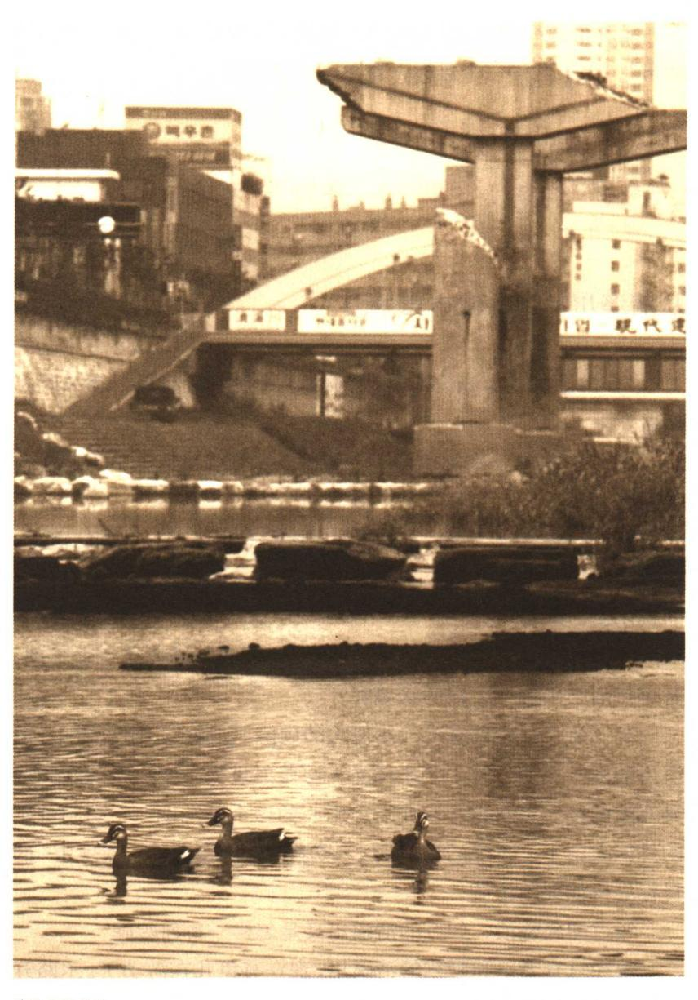

清溪川绿头鸭

{212}------------------------------------------------

生活在清溪川周边的市民们的生活也在不知不觉中改变了。孩子们可以卷起裤腿,到清溪川里抓泥鳅了,妇女们可以提着篮子,到清溪川边采野菜了。到了夏天,人们还可以把脚泡在凉凉的河水里,三三五五聊聊家常。碧绿的河水流向钢筋水泥的丛林,召唤越来越多的人来到这里,暂时摆脱疲惫的生活,寻找心灵的闲暇。

灰色的城市中心诞生了人与自然和谐共存的环境。清溪川变成了都市人真正需要、由衷喜爱的休闲空间。

在外国人眼里,清溪川也成了名副其实的首尔名胜。事实上,在复原清溪川工程尚未完全竣工时,威尼斯建筑双年展就授予了我们"最佳执行奖"。各国专家对复原清溪川工程表示了极大关注,对这条流经5.8公里的城市河川毫不吝惜赞美之辞。

意大利的电视台、广播电台,英国BBC 电视台等欧洲媒体都对我们的复原清溪川工程进行了大篇幅的报道。其实,他们最关心的就是首尔人在复原清溪川的过程中是如何兼顾开发与环境、使两者相辅相成的。

城市开发不是破坏环境,而是可以**拯救环境。复原清溪**川工程展示了开发与环境并存的可能性。

### "开发和环境不冲突"

我就任市长后,一直被许多人称为"新开发论者"。这个称呼和"推土机"的外号一样,都是我不太能接受的评价。

有人批评说,我把整个首尔变成了一个施工工地,而且为了 在任期内展示成果,无理地强行施工,由此引起了诸多副作用。

说实话,如果真是那样,我就不会把清溪川打造成现在的样子。也许把那一带全部填埋,建成大型的娱乐设施和商业设施,所谓的"成果展示"会更加辉煌吧。

{213}------------------------------------------------

我知道在批评者中, 有人认为应该像保护自然环境一样, 无 条件地保护城市环境, 杜绝一切人工开发。但是, 我理解的"城 市开发"和他们不太一样。所谓改善城市环境,应该首先考虑生 活在城市里的人。因此,城市开发和圈起一片土地而建立国家公 园是不一样的。

城市开发的目标应该是让市民的经济生活、文化生活、福利生 活更加丰富、更加人性化。环境和开发一举两得是完全有可能的。

构建首尔林项目也是一个很能说明问题的例子。如果我一味 注重开发项目的经济价值,首尔林就不会是现在这样有树木林阴。

李明博获美国 TIME 杂志评选的国际环境英雄奖

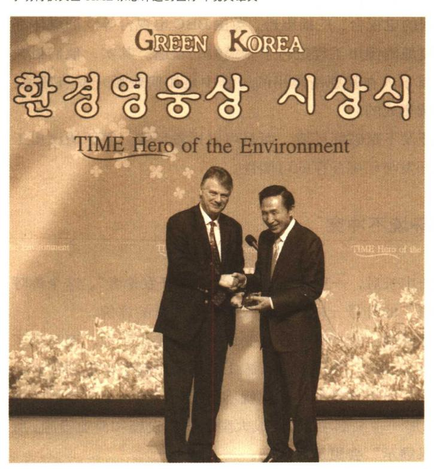

{214}------------------------------------------------

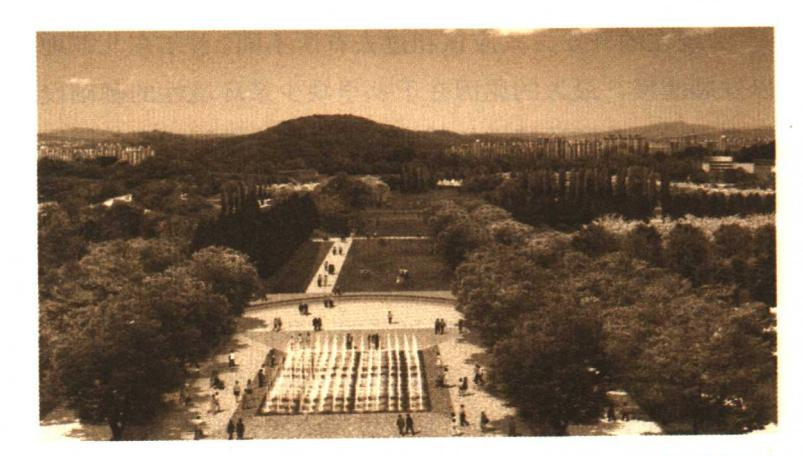

首尔林效果图

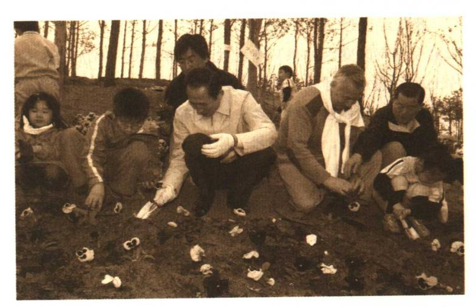

参加首尔林绿化活动

野兔奔跑的生态公园。

事实上,圣水洞一带很长时间以来一直被许多开发商所看好。广津区、圣水洞、东大门相连的一带是首尔市内相对落后的地区。以前的"中国城"、"商业区"、"棒球场"等大规模开发计划都是基于其开发前景、看好其经济价值而制定的。但是,我的视角有所不同。

{215}------------------------------------------------

"现在的开发方式应该和过去有所不同。首尔东北部地区之所以发展缓慢,最大的原因在于那里缺少亲环境性的基础设施。如果多建设一些亲环境性的基础设施,周边地区的居住环境就会有很大改善,自然开发也就变得可行了。"

为什么要在圣水洞构建首尔林?江南区有奥林匹克公园,江 西北区有世界杯公园,江西南区有老鹰公园,但是东北区有什么 呢?那里的环境基础设施特别薄弱。我们的想法就是先建设东北 区的环境基础设施,然后再自然开发周边地区。

事实上,首尔市的环境基础设施依然有所不足。为了更好地改善市民生活,政府应该增加更多亲环境性的空间。只有这样才能更快跻身世界一流城市之林。

我曾经说过,要把龙山美军基地一带改造成市民公园。这种想法至今没有改变。如果只考虑龙山美军基地一带的经济价值,这片土地可谓寸土寸金。但与其经济价值相比,我更看重它的历史象征性。如果在这个地方建一座所有人共享的市民公园,将是多么有意义的事情。那应该是一座可与美国纽约中央公园相媲美的城市中心绿地公园。

这样的环境基础设施一定会提高首尔的知名度,加大对外国 投资者的吸引力。因此,这样的开发项目不仅有助于拯救环境,也 会在拯救经济方面起到很大的作用。

以前,人们习惯于把环境和开发看做两个对立的概念:为了保护环境就要阻止开发,开发的结果只可能是破坏环境。但现在,这种对立意识渐渐被抛弃了。开发和环境可以是相辅相成的概念。

1992年6月在巴西里约热内卢举行的联合国环境与发展大会通过了《21世纪议程》,提出"可持续发展"的理念。所谓可持续发展的核心就是:"既满足当代人的需要,又不对后代人满足其需要的能力构成危害。"

不可否认的是,在20世纪90年代之前,韩国的开发政策是有

{216}------------------------------------------------

一定盲目性的,但在当时,我们也不可能过多考虑环境、文化等 因素,这也许可以说是时代的局限性。

我也经历了那样的时代,而且不可否认的是,我也曾经是那种 盲目开发工程的领头者。在当时,我们都不认为这有什么错,即 使为了生活也应该多做开发,那是大多数国民达成的共识。

但是现在,我们身处的社会已经发生巨大的变化。以前的开发理念、开发方式就像以前的流行时装一样,已经不再符合这个时代的要求。现在是注重环境和文化的时代,城市开发应该寻找与之相符的新目标。如果一味、绝对地否定开发,就不会有"可持续发展"的概念。"可持续发展"是以开发为前提的。为了更好地保护、管理环境,也需要我们做一些翻新、修改工作。

不是生硬的非此即彼, 而是两者兼顾、一举两得。只有相辅相 成才是符合新时代要求的范例。

### 四. 行政韩流——出口秘诀

### 出口到世界的首尔行政系统

"像首尔的汉江一样,我们也想开发河内的红河,请李明博市长多多帮助。如果首尔能协助我们策划开发计划的话,项目进行时我们会让韩国企业参与。"

越南河内市市长在访问首尔时曾经这样拜托我。河内市长是一个充满热情、有进取想法的市长,特别关注城市现代化建设。 他曾经多次访问首尔,每次都对首尔的电子政府系统表示出极大 关注。

随同河内市长一起访问首尔的河内公务员们也对首尔的电子

{217}------------------------------------------------

政府系统表现出极大兴趣,并且向首尔的公务员们咨询了许多相关问题。在那之后,首尔的电子政府系统便十分自然地走上了输往越南河内的出口之路。我访问河内也是为了商议"电子政府谅解备忘录合同"事宜。

红河开发项目原先并不在我们的计划之中,但河内市长表现 出了很大的诚意。因为他们不具备大规模建设的经验,红河开发 的负担自然不轻。

通过一系列的协商,首尔不仅参与了河内市电子政府建设工程,还参与了红河的开发工程。在确定了红河开发长期计划之后,我们的企业就可以正式向河内进发了。

蒙古的乌兰巴托是首尔的姐妹城市。乌兰巴托政府也在积极借鉴首尔的电子政府系统。这件事还要追溯到2006年5月。"首尔文化节"期间设立了"乌兰巴托日",蒙古的艺术团体在首尔进行了演出,我还向乌兰巴托市长授予了"名誉市民"称号。在随后的媒体采访中,有一位记者问乌兰巴托市长:

"乌兰巴托和首尔进行合作的话,会从哪方面开始呢?" 他毫不犹豫地回答道:

"我们想学习首尔的电子政府系统,关于这一点我想和李明博 市长另行讨论……"

就这样,首尔和乌兰巴托开始了促进电子政府系统合作项目。 在离开韩国前,乌兰巴托市长和我进行了详谈。

"我们乌兰巴托市的资金并不充裕,所以,具体从哪个领域开始,我想听听您的建议。最重要的是,希望您能来看看我们城市的环境。所以,我们会尽快激请您的。"

乌兰巴托市长非常热情,但正如他所说的,他们的政府资金并不充裕,构建电子政府的通信基础设施也很落后。但他之所以提出要建立电子政府系统,是有其特殊理由的。这个特殊理由不是其他,正是为了铲除腐败。据说在乌兰巴托,办公厅的腐败现象

{218}------------------------------------------------

很严重,连发放土地证也要索取小费。正是为了消除这种不正之 风,乌兰巴托市长决心构建一套电子政府系统。

但是,乌兰巴托是一座草原城市,稍微走出市中心,就会看到 许多城市贫民居住的帐篷。在这样的地方构建一个类似首尔的通 信环境是不可能的。但是,首尔还是决定向姐妹城市乌兰巴托伸 出援助之手。这么做不是出于眼前利益,而是着眼于未来投资。

2006年9月,在乌兰巴托的"首尔日"活动中,电子政府体验馆正式开放,市民们可以在馆内体验到公文查询、发行等模拟办公环节。据说乌兰巴托的市民们表现出浓厚的兴趣,体验馆一连几天都是满员接待。活动结束后,我们向乌兰巴托市捐赠了计算机等全套装备。

现在,河内市长已经升任越南财务副部长,乌兰巴托市长也已 升任蒙古国务总理。我相信,首尔展现出的友好态度在今后将带 来更多合作机会。

首尔的电子政府系统最先出口的城市是莫斯科。在首尔曾经举办的"莫斯科日"活动中,当时的莫斯科市长和莫斯科文化艺术团一起访问了首尔。

"我们正在制定'e-莫斯科'电子政府促进计划。听说首尔的 电子政府系统运行得很成功,我们想向你们取取经。"

听到莫斯科市长的这番话,我友好地表示,首尔愿意为莫斯科 提供帮助。

2004年6月,我和国内几位企业家一起访问了莫斯科,准备 趁热打铁,促进电子政府系统的出口计划。莫斯科市内一片热烈 气氛,相关人员更是围着我们,从早到晚像开听证会一般,仔细 询问有关首尔电子政府系统的各种问题。

"如果首尔把全套的电子政府系统出口给我们,我们将不通过另外的招标,直接让韩国企业参与莫斯科市的电子政府系统建设。"

{219}------------------------------------------------

有一天, 莫斯科市长把他的打算直接向我说明, 我很快在头脑 里算了一笔账:

"那样的话,对我们的企业来说,就是打开了通往莫斯科市场 的一条通路, 而且首尔市在项目费中还有咨询费和知识产权费的 股份,可以用这部分费用设立IT领域的奖学基金。"

如果合作达成,首尔和莫斯科将取得双赢的成果。我向莫斯科 市长表示了赞成的意思:

"如果直接让韩国企业参与,对莫斯科来说,就可以避免实施 误差,对韩国的企业来说,也是一个大好机会。"

那年的11月,莫斯科市举行了"首尔日"活动。在活动期间, 我们和莫斯科市就电子政府系统合作建设签署了"谅解备忘录合 同",一方面首尔市积极协助莫斯科市的电子政府系统建设,另一 方面向莫斯科出口电子政府系统模式、韩国企业参与具体建设。

"e- 莫斯科"是一个计划耗时5年、投资620亿卢布(约为韩 币2兆)的大项目。现在参与这个项目的韩国企业有三星SDS、LG、 KT、三星物产等大企业。但我们能感觉到,经过初期的磨合之后, 中小型企业也将在那里找到自己的市场。

在全球化背景下,经济活动没有国界,全世界统合成了一个大 市场,竞争也日益激烈。在这样的情况下,政府机构应当为个人、 企业提高竞争力提供有力的支持。但是,韩国的政府机构在这方 面做得并不好, 有时候甚至会成为企业提高竞争力的阻碍。

有一次我就听到了一位企业人士的抱怨:

在一次由世界经济论坛主持的有关韩国吸引投资的会议上, 因为韩方人员的问题,差一点引起了乱子。这次会议邀请了各国 政界, 经济界的重要人士, 其规格和重要性可想而知。但是, 各国 外宾只到了10多人。一听"乱子"的内容更是让人生气:

"政府代表应该坐在上席。"

"这是什么话?会议的内容不是吸引投资吗?"

{220}------------------------------------------------

"但那是以政府名义举行的,难道让政府代表坐在后边的座位上吗?"

"到底是来这儿做什么的?"

所以,乱子的内容就是"政界代表和经济界代表应该坐在什么位置"的问题。据说,"致辞应该由一个人还是两个人"的问题也引起了一片争论。在这过程里没有积极地推进引资活动。

事实上,这样的事情并不少见。到国外吸引投资的企业人士由于不能进行重要的引资活动,更多的是由政府高层官员出面协助。一些先进国家的情况和我们大为不同。他们在开会之前就会制定出详细的计划,协商时就集中在必须达到的目标上。像之前我提到过的"莫斯科之行",相关人员的提问几乎达到了"听证会"的水平。他们的目标意识非常强,政府和公共机关对企业和国民起到了很大的支持作用。

现在,韩国的政府和官员们也应该有这样的意识了。既然首尔 市的电子政府系统可以出口到越南、俄罗斯、蒙古,可见政府也 能成为营销的对象。

在我上任首尔市长初期,市政府一共有30多个电算室,各局、各科都有两三个网页,整个市政府系统光网页就有92个,这样的状态只会加重市民的混乱。

"给你两周时间,看看完善整个系统的第一步怎么走。"

我向大学教授出身的信息化企划团长下达了指示。两周后,信息化企划团长向我报告说:

"最紧急的是统一各个系统,把它们连接起来。但如果要把全部都统一起来的话,需要很多时间。可以先统一一部分,操作起来方便一些。"

"要么不做,要么就一次性做好!"

我之所以这么强硬地要求一步到位,是因为接到报告说,统一 系统时各部门之间的冲突也不小。与其拖拖拉拉、顾此失彼,不 

{221}------------------------------------------------

如一鼓作气、打一场硬付。

我指示另行成立信息系统整合促进会,由各个室长、局长、经 营策划室长组成,协助信息化企划团长开展工作。

从2003年春天开始的信息系统整合工作,到6月末就完成了, 电子政府系统的基础就是从那时候建立起来的。信息系统的整合 有两大优点。

首先是大大减少了运营成本。以前的30多个电算室重复工作 很多,系统整合之后可以避免不必要的浪费。另外,工作效率的 提高也是立竿见影。比如、在系统分散的时候、下达一个人事变 动通知就需要各个系统分别输入数据, 经过整合之后, 只要输入 一次就可以传达到各个部分。

当然, 获益最多的还是市民。像以前那样, 要想拿到一个证明 书, 光找网页就得花不少时间, 看看每个科的网页上似乎都有涉 及. 究竟到哪里办理反而搞不清楚了。系统整合之后,只需点击 一次市民服务就可以了。

上下水管、电力、通信、天然气、暖气等地下铺设管道的情况 也可以在线掌握了。以前,施工人员需要直接挖开地面才能知道 什么地方埋了什么管道, 但现在, 我们把各个公司的管道铺设地 图做成了数据库,实现了信息在线共享。

首尔市的电子政府系统在联合国和美国行政学会支持的100大 城市电子政府系统评比中,2003年、2004年接连两次名列第一。 这也在一定程度上帮助了首尔的电子政府系统扬名于世界。

### 值钱的行政, 挣钱的行政

首尔的交通系统也多受称赞,在其他国家刮起了"行政韩流"。 回想起最初改革公共交通时经历的困难, 真可谓百感交集, 成就 感也油然而生。

{222}------------------------------------------------

2004年7月,大刀阔斧的公共交通改革引发了猛烈的舆论炮火。改革初期的一些失误引起了一定程度的交通混乱。整座城市仿佛变成了战场,公务员们日夜战斗,但批评声丝毫没有减弱。

"还原公交系统!"

"李明博市长下台!"

在这样的口号此起彼伏时,支持的声音却在意想不到的地方出现了。国外许多城市对首尔的公共交通改革表示一致关注。

首先是越南建设交通部长官一行访问了首尔,在参观巴士管理系统(BMS)时,他们惊叹的表情令我印象深刻。回国前,他们向首尔提出了包括停车政策在内的交通政策全部的技术性支援请求。

这样的肯定也使我们增强了对首尔交通改革政策正确性的 信心。

将举办 2008 年奥运会的北京也派来了大规模访问团。香港交通局也冲着巴士管理系统等信息访问了首尔。英国下院交通委员会的六名议员也到首尔来学习交通政策,他们是为申请 2012 年伦敦奥运会、制定解决伦敦交通问题的方案,远道赶来寻求帮助的。

土耳其的伊斯坦布尔虽然邻近众多欧洲大城市,但他们也对 首尔的交通政策十分关注。伊斯坦布尔市长和我畅谈了30分钟, 听我谈到首尔的交通系统情况后,他很快决定到首尔进行为期3天 的正式访问。

除此之外,日本、印度尼西亚、菲律宾等国家也都有意借鉴首尔的交通系统。国外的媒体报道很热烈,以德国记者为首,印度、中国、菲律宾、印度尼西亚等国的记者团先后来到首尔,对逐步走上正轨的首尔公共交通改革进行了深入报道。

2004年10月,国际公共交通联盟(UIPT)主办的学术研讨会在澳大利亚举行,首尔的公共交通改革成果是这次研讨会的重点课题。以美国和中国为首的世界各国大学研究团体也积极向我

{223}------------------------------------------------

们索要相关研究资料。

这时候, 国内民众也开始重新审视这场经历波折的交通改 革了。

"了解之后才知道是很了不起的。"

据说市民之间也在流传这样的话。

当时参与公共交通改革的一名市政研究员现在一周内平均要 接待两次外国客人的访问,其中大部分是有意借鉴首尔先进的交 诵系统的国外交通专家。据说,他们对首尔的交通政策以及与IT 技术相结合的独特系统赞叹不已。

"由于公共交通改革,我都成了世界性的交通政策专家了。" 这位研究员兴奋地跟我开起了玩笑。

如今,首尔的交通系统已经成为世界一流"商品"。在交通系 统行政秘诀向外出口之后,紧接着便是韩国企业的装备和施工人 才向外出口了。

行政系统的出口改变了以前的官僚组织的形象。以前的偏见 是: 公务员只知道花国民的税金。以首尔行政系统出口为契机, 这 种偏见慢慢消失了。

有学者指出,未来世界最具增值潜力的是知识、信息和文 化相关产业。从这个意义上来说,行政服务是一种具有无穷潜 力的商品。

### 五、平衡发展——南北一同前进

### 促进新城市开发的理由

"我认为开发新城市是典型的善心公约。开发的难度先不说, 恐怕对房地产价格波动也会产生不好的影响。"

{224}------------------------------------------------

这是反对新城市开发的一位专家的意见。类似这样的意见都 是因为对新城市开发的信息不足、认识不准确而形成的。

"担心开发难的问题,一句话: 杞人忧天。新城市开发不是让原来生活在那里的人离开,而是让他们在更便利、更优美的环境中生活。"

事实就是这样。新城市开发不是为了赶走那里的居民,而是要让他们生活得更好,对租赁的住户也能实行保障。

我之所以如此关注新城市开发,和我年轻时辗转于贫民区的经历有关。高中毕业后来到首尔,我就住在孔德洞、孝昌洞一带的贫民街上。那时候,父母在首尔租的房子特别窄小,怎么也容不下我和妹妹两个人睡觉。于是,我一个人随身只带着一个勺子就走出家门,在孔德洞、孝昌洞一带找了间屋子住下。房租是按天数计算的,当然也不可能是单人间,很多人随随便便挤在一间屋子里,能有个地方睡觉就不错了。人虽然多,厕所却只有一个,上厕所就和中彩票一样难,于是难免有人随地大小便,屋子里里外外从早到晚都是臭烘烘的。越是没钱的人,住的楼层就越高,因为楼上离厕所远,屋子也窄小,价格自然比楼下的还要便宜一些。那时候,我经常就住在顶层。虽然如此,能有一个地方安身我已经觉得很幸运了。

一直到1964年,我二哥签下合同,搬进东大门的国民租赁住宅,我们全家的居住环境才算有了改善。那套房子和我住的出租屋相比简直犹如宫殿,但事实上,那也还是在贫民区。

2002年竞选市长的时候,我又一次回到了那个地方。让我大吃一惊的是,那一带生活区和1964年的时候几乎没什么变化。虽然道路重新铺过了,有的地方也盖起了新房子,但总体而言还是老样子。

"怎么会这样呢?怪不得江北的居民对生活环境多有抱怨……" 新城市开发的想法就是在那时候产生的。

{225}------------------------------------------------

就任市长后,我从原先住的论岘洞搬到了市长公馆。论岘洞的 家是我在现代建设公司任职时, 郑周永会长为了便干我接见外国 企业代表而专门建造的。既然说要开发江北, 我当然应该以身作 则搬到江北。只有彻底融入这个环境,才能真正了解这里的情况。

在搬到市长公馆后不久,一位报社的记者曾经这样问我:

"市长,您了解江北人的挫折感吗?"

当时我刚刚发表了首尔市要开发恩平区、城北区吉音洞、城东 区往十里等三个新城的计划。

事实上,江北地区迟迟不开发是有其原因的。江北贫民区的国 有土地。市属土地占了很大一部分。对于条件不太好的居民来说, 自行开发的难度可想而知。据说,住在江北的人要想再开发的话 平均需要13年、最快也要7年。很多居民在等待了几年之后,不 得不怅然地选择离开生活多年的地方。

如果市政府不直接出面进行开发,或许再过几十年,江北地区 也不会有太大的起色。事实上,以前陆陆续续由民间房地产开发 企业进行的再开发项目都是在一些落后的地区建造新的公寓。结 果,原先那里的居民没有条件搬进新公寓,只能辗转到其他的贫 民区, 形成恶性循环。而且, 由于这些开发项目的规模都比较小, 民间企业很难构建道路、学校、公园等生活基础设施。

我们可以以一个拥有独立住宅的江北市民为例、说明一下当 时的情况:

住在江北的甲先生, 因为自家的房子又旧又窄, 决定拆掉老 房, 盖一座新房。既然要盖新房, 干脆再往上加一层。新房盖好后 又住进两户人家。所以,原先的一户变成了三户。甲先生虽然很 高兴,但奇怪的是,房价没有往上涨。住的人变多了,可是路还 是那条路,停车的空间变得更加拥挤了,有的路段几乎变成了停 车场。

像这样的恶性循环只能导致江北的生活环境越来越糟糕。

{226}------------------------------------------------

新城市开发的目标就是要把这样的恶性循环画上一个圆满的句号。具体的构想是确定一个大的区域,作为平衡发展的促进地区,首尔市先投资修路、栽植绿地,然后建造学校、公园等文化基础设施。新城市的开发需要政府和民间企业携手并进。基础设施由公共部门负责建设,公寓和商业设施则由民间企业进行开发。

"政府促进的板桥、华城、金浦、坡州等四个新城市建设能使 大约14万户居民受益,而新城市开发项目能使86万户居民受益。"

这是根据市政研究院的研究资料统计出来的数字。

江北的新城市开发项目虽然是由首尔市政府主导的,但地区居民也积极参与了整个策划过程。而且,我们还根据每个区域的特性制定了相应的开发计划。可以说,地区居民是新城市开发最大的受惠者。

### 现在是"1对1"的开发时代

再好的政策也满足不了所有人的需求,所以,大部分政策出台 之后,都会有赞成和反对的意见。公共政策应当朝着满足大多数 人需求的方向发展,对于无法满足的少数人,则要尽力说服他们。

这时候,最好的办法就是针对个人或集团的特性,制定"Case by Case"的解决方案。情况越是复杂,"Case by Case"的方案就越能起到良好的作用。

新城市开发政策公布之后,也是立刻就听到了欢迎和批评两种声音。这个计划是我在民选三期市长竞选时提出的12个公约中的一个。出任市长后,我立即设立了"地区均衡发展促进团",后来改名为"新城市项目总部"。

新城市开发项目于2002年10月选定了恩平、往十里、吉音为示范地区,第二年11月又选定了峤南、汉南、典农、弥阿、新亭等12个地区为2期新城市开发地区。除了这15个地区以外,后来

{227}------------------------------------------------

又接受了增加的10个地区的申请,预计到2012年全面建成。

在新城市开发计划公布之后,给予我们最大支持的还是地区居民。根据首尔市自行实施的民意调查,70%以上的市民表示支持,85%的市民赞成把新城市开发扩大到全市范围。

但是,获得市民支持的过程并不轻松。在往十里新城开发初期,由于居民强烈反对,9个月内开了40多次专家会议、20多次居民座谈会和5次公开说明会。像这样的市民参与决策的先例,也是新城市开发项目中值得关注的地方。

由于各个地区的环境、民意各有不同,整个工程分为"新城开发型"、"城市中心 (Down Town)型"、"居住中心型"三种不同的形式进行开发。在具体实施过程中,也最大程度地考虑到地区居民的要求。

在以"新城开发型"为定位的恩平新城,最初设定地区居民的 土地补偿价格时,就尽量消除了对他们的不利因素。而且,针对 原来的居民重新入住制定了多种优惠政策。比如,适当降低住宅 销售价格;对于入住金不足的住户,还调整了长期低息的贷款方 案,尽量减轻居民的负担。另外,在居民入住之后,也对他们的生 活进行一定的扶助。比如,为原先从事花卉业的居民提供一定的 机会,让他们可以继续从事以前的生意。在税收方面,也实行一 定的减免政策。

在以"居住中心型"为定位的吉音新城,为了维持以前的公共服务,建造了上层住宅、底层商铺的复合型路边商店。在构建公 共设施的过程中,也照顾到了各个社区的平衡。

以"城市中心型"为定位的往十里新城是从朝鲜时代起就一砖一瓦发展起来的老城区,居住人口密度很大,有很多都是几世同堂的大家庭。因此,在开发过程中尤其关注社区的亲环境性,加大基础设施方面的建设,努力使居民生活和商业一起发展。

{228}------------------------------------------------

### 六、协作----众人拾柴火焰高

### 市民和企业的参与

"巍峨的北汉山,壮阔的汉江,清澈的清溪川,希望我们的首 尔越来越美丽。"

"从未有过的幸福……"

"某某和某某,在清溪川畔,相亲相爱地生活。"

这些都是印刻在清溪川"希望之墙"上的文字。

"希望之墙"用富有亲切感的文字和有趣的图画展现了首尔两万多市民的美好愿望。更令人感动的是,我们还在"希望之墙"上读到了在韩国居住的外国人以及海外同胞们的心声。

愿意参与"希望之墙"活动的市民只需交2万韩元,就可以把自己的希望图画或文字印刻在1300摄氏度条件下烤出来的瓷片上,成为整体壁画的一部分。"希望之墙"位于黄鹤桥和五间水桥两旁,长50米,高2米,对整个清溪川来说不过是很短的一小段,但现在,"希望之墙"已经成为清溪川观光的必看景点。

"希望之墙"之所以采用这样的运作方式,不单纯是为了节约 预算,更是为了吸引市民们直接参与复原清溪川的历史性项目。让 我们感到欣慰的是,市民们也把这看做一次珍贵的机会,热情地 做出了回应。

"老百姓这么积极、自发地参与政府部门的项目,还真是不常见呐。"

市政厅的一位官员在回顾这次活动时这样说到。

在复原清溪川过程中,市民们的参与还不止于此。很多市民通

{229}------------------------------------------------

过购买 5000 韩元一块的文化砖,为复原工程作出了自己的贡献。市民们的参与也使复原清溪川的意义变得更加深远。

除了市民个人的捐助以外,民间企业的赞助也络绎不绝。随着清溪川高架桥的消失,一部分建筑扩大了视野,这在以前是难以想象的。到过清溪川的游客们都会对企业鲜明的标志留有印象,这样的户外广告价值空间极大。企业十分清楚这一点,欣然通过各种赞助活动参与了复原清溪川工程。

清溪川上的22座桥梁中,三一桥是友利银行全额赞助修建的,GS建设公司赞助了五间水桥周围的"希望之墙"修建费用,新韩银行也资助了一座桥的拱形维修工程,朝兴银行承担了一幅壁画的制作费用……

企业参与复原清溪川工程具有超越经济性效果的意义。一方

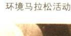

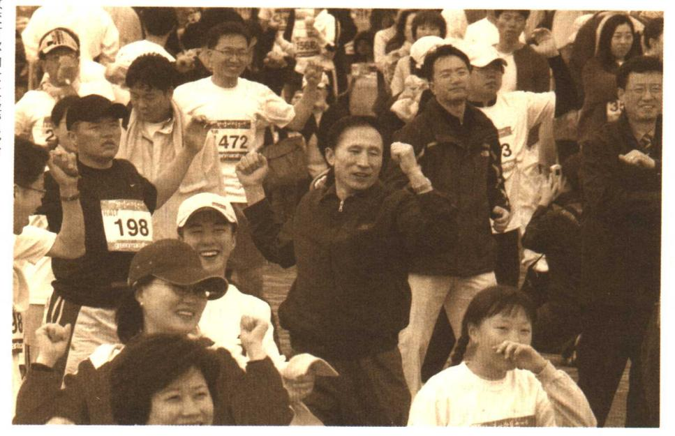

{230}------------------------------------------------

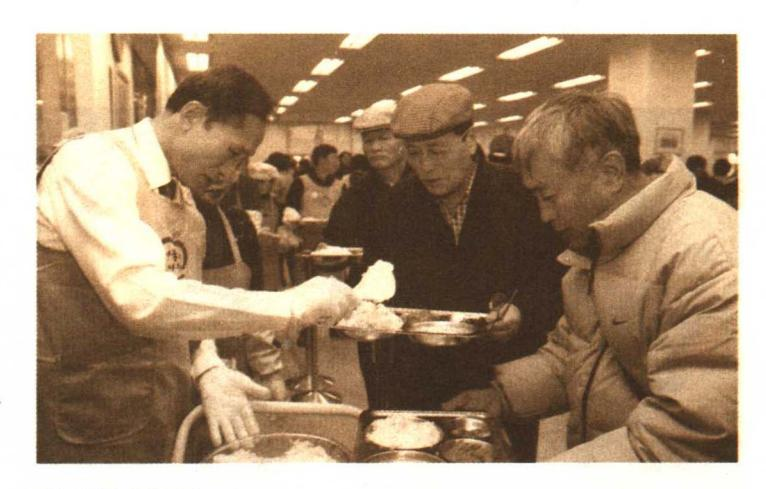

首尔分享爱自愿活动

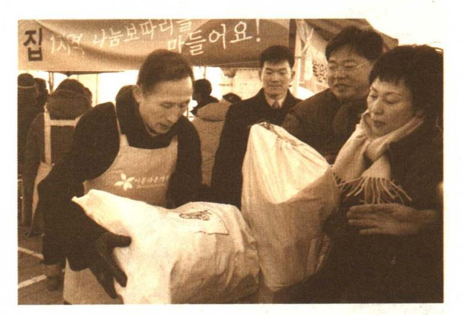

美丽店铺活动

面是参与历史复原的珍贵机会,另一方面也看到了和政府公共部门进行协作的可能性与效果。

首尔广场的建设工程也积极利用了企业赞助。

首尔广场酒店 (PLAZA HOTEL) 是修建首尔广场的最大受惠者之一。作为首尔的象征,首尔广场每天都会吸引成千上万的

{231}------------------------------------------------

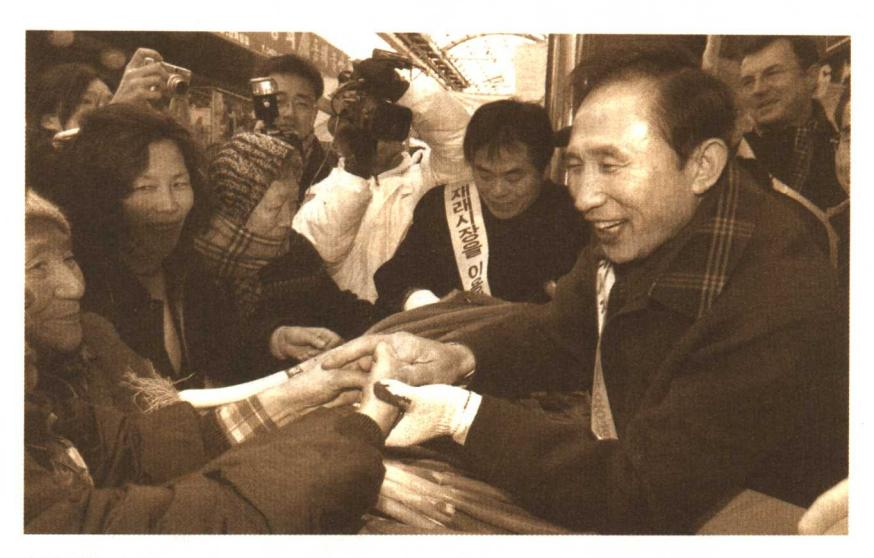

在利川传统市场

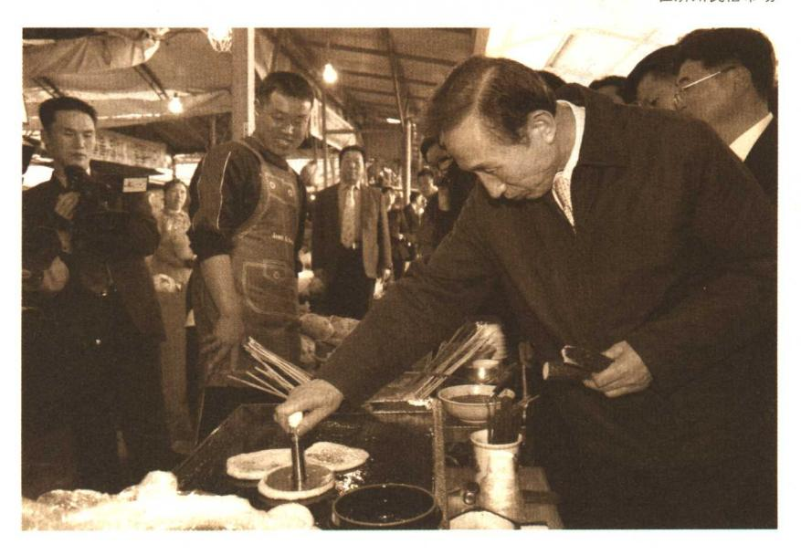

{232}------------------------------------------------

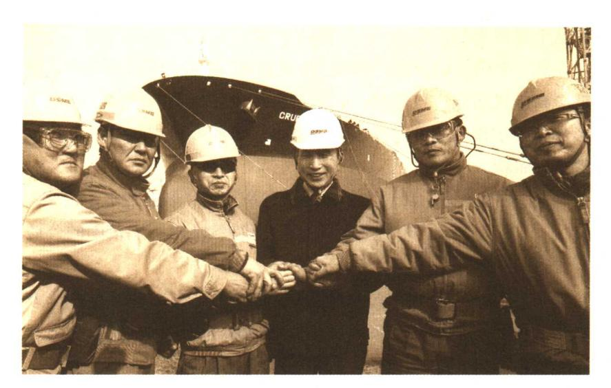

访问大字巨济造船所

市民和游客。从首尔广场的绿地向南望,就能看到首尔广场酒店的华丽身姿,其广告效果可想而知。据说,首尔广场酒店中能俯视广场景观的房间价格也上涨了。受益颇多的首尔广场酒店随即表示出捐款的意愿。广场喷泉工程就是在他们的资助下完成的。以修建广场为契机,市政厅墙面上的大型圆形钟也是在瑞士驻韩大使的主持下,由首尔商工会议所和瑞士Swatch集团韩国分公司共同捐赠的。

我还指示在户外广告集中的地方放上城市品牌广告。

"在市政中引入企业意识不是指光顾着挣钱,而是要充分宣传城市形象,使政府和市民的沟通更加顺畅,更加贴近市民,获得情感上的共鸣。"

这是我在某次会议上强调的话。渐渐地,公务员们对于城市形象宣传、公益广告发布表现出了更积极的姿态。

城市品牌广告最合适的载体是公共汽车。公交车身广告就是移动的首尔市宣传大使。我们从改善公共交通初期就开始积极利

{233}------------------------------------------------

用这个宣传平台。

第一个引人的公益广告是"热爱首尔"活动。这次活动的宗旨 是提高市民的城市自豪感,在城市生活中注入新的活力。红色心 形代表首尔市民热烈的爱,绿色叶形代表同心协力建设绿色首尔 的美好希望。

继"热爱首尔"活动之后,还陆续举行了"热爱首尔,热爱公交"、"热爱首尔,热爱地铁"等活动,持续地进行大范围的公益广告宣传。

首尔市一共拥有大约8000辆公共汽车。在宣传城市形象方面,这8000个移动的宣传大使比任何电视节目、报纸广告都更具影响力。

### 吸引外资,实现双赢

常言道:三个臭皮匠,赛过诸葛亮。这个道理也适用于公共部门和民间部门的相互协作。

公共部门和民间部门积极合作,往往能达到公共部门或民间 部门单枪匹马所不能企及的效果。为此,民间部门也应该表现出 不亚于公共部门的积极性。

在全球化时代,无论对一个国家,还是对一个城市而言,吸引外资的重要性都不言而喻。从这个层面上来说,首尔市吸引美国国际集团(AIG)投资,在汝矣岛设立首尔国际金融中心(SIFC)具有极为重要的意义。

2006年6月5日举行开工典礼的首尔国际金融中心计划是一个占地超过3万坪的大型开发项目,由54层OFFICE塔等三座顶级写字楼和一座国际酒店组成。如果能吸引国际性的金融企业、金融服务机构、跨国企业亚洲区总部进驻中心,将对首尔市确立东北亚金融中心的地位产生关键性的作用。

{234}------------------------------------------------

长期以来我一直大声疾呼吸引外资,但公共部门直接出面吸引外资的例子还是屈指可数。这次首尔市从 AIG 集团吸引了相当于 14亿美元的直接投资,真可谓少见的壮举。AIG 集团是全球著名的国际性保险及金融服务机构,是全球第一大保险集团、第二大金融集团。此次成功合作的推动力正是来自于首尔市公务员的积极企业意识。

把首尔打造为国际金融中心——这并不是我一个人的抱负, 以前的首尔市政府也为此做出了很多努力。但是,实际看到的成 果却很少。

"怎么才能尽快把首尔打造成金融中心呢?"

光喊口号是没有用的。为了能看到成果,有关负责人多方筹谋,但进展并不顺利。事实上,这样的目标也不可能一蹴而就,需要长期坚持不懈地努力促进。

正当我们陷于无处施展的苦恼中时,我听到了销售位于汝矣 岛的首尔市占地的消息。这一块占地曾经用作中小企业的展会场 所,在中小企业撤走之后,便成了闲置土地。为了不浪费资源,市 政府暂定将其出售给外部。

"汝矣岛是韩国的金融中心,我们能不能把外资吸引到这 里来?"

我向有关负责人说出了我的想法。负责的局长是一位富有事业心的领导。在听了我的建议之后,他马上表现出积极的态度,说要试一试。由法律、财务、咨询等领域的专家组成的策划小组很快着手展开了工作。

在吸引资本方面,市政厅的公务员们完全是门外汉。但我们并 没有完全委托外面的咨询机构,具体工作仍是在市政厅的主导下 进行的。这为公务员们提供了一个积累相关经验的绝好机会。

"市长,我想去一趟日本。"

不久后, 局长说要直接去见 AIG 集团的首席副社长, 探一探

{235}------------------------------------------------

他们的意向。不巧的是,当时日本国内正在与SARS奋战。局长在这种情况下去了日本,在他的努力下,事情终于有了一线希望。

AIG集团派出一支小组赴首尔考察。正准备进行协商的时候,恰好 AIG 集团的会长访问首尔,我们便有了见面详谈的机会。

"汝矣岛在韩国金融界的位置是排在第一位的。如果 AIG 集团在汝矣岛投资成立金融中心,对首尔和 AIG 集团都会有可观的前景。"

"我们的考察组正在商讨之中,相信马上就会有好消息的。" 听到 AIG 集团会长的这句话,我似乎看到了成功的曙光。

AIG 集团决定组建企业集团,负责首尔国际金融中心的建设和运营。从完全出售还是出租占地的问题开始,双方需要协商的问题可谓千丝万缕。不知道是不是因为这个原因,我感觉协商组有些着急。我找来负责的局长,叮嘱他再怎么着急也不能放弃实际利益。

"从其他国家吸引外资的情况来看,以免费提供的居多,其实完全没有那种必要。请好好判断一下我们的有利之处再进行协商。"

协商组的专家们进行了充分准备,以干练的姿态,与 AIG 集团展开了历时一年多的协商。拉锯式的谈判历经曲折、却没有走向决裂,是因为双方之间存在着最基本的信任。

经过一年多的艰苦协商,首尔市和AIG集团最终达成了共识。 首尔市向AIG集团出租占地100年,具有每年80亿元以上的出租 收益和选择权,AIG集团在10年内不得抽走自身的回收资本。

吸引 AIG 集团投资对首尔市来说具有几方面的特殊意义。首先,作为地方自治团体,吸引了相当于 14 亿美元的投资,这绝对是一次了不起的成就,其次,我们不是通过出售,而是通过出租收益等方式,在协商过程中积极争取了自身的实际利益,另外,对首尔的公务员来说,这次协商的成功让他们积累了丰富的经验,也

{236}------------------------------------------------

增强了依靠自身力量吸引外资的信心。

在全球化时代,公共部门和民间部门之间的界限逐渐消失了。 如果公共部门和民间部门通力合作,就能节约国民税收,提高工 作效率。民选三期市政府积极推动与企业合作、吸引企业投资,也 正是出于这样的目的。

同样地,吸引外国企业投资也能达成首尔市政府与企业的双 赢。正如在吸引 AIG 集团投资的事例中看到的那样,如果公务员 具有经营意识和促进能力,不仅能与本土企业携手共进,还能创 造出与世界性企业合作的良好效果。

{237}------------------------------------------------

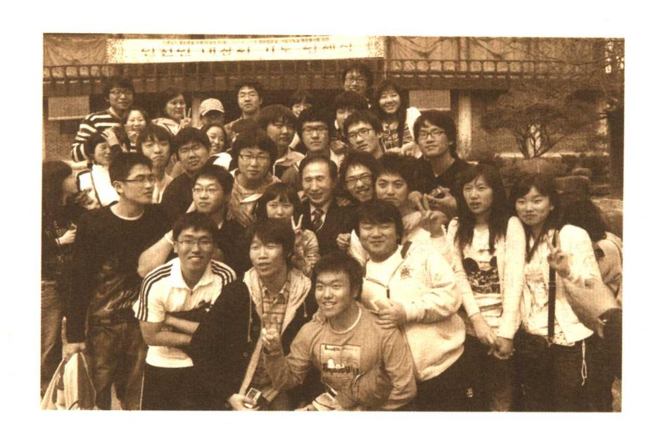

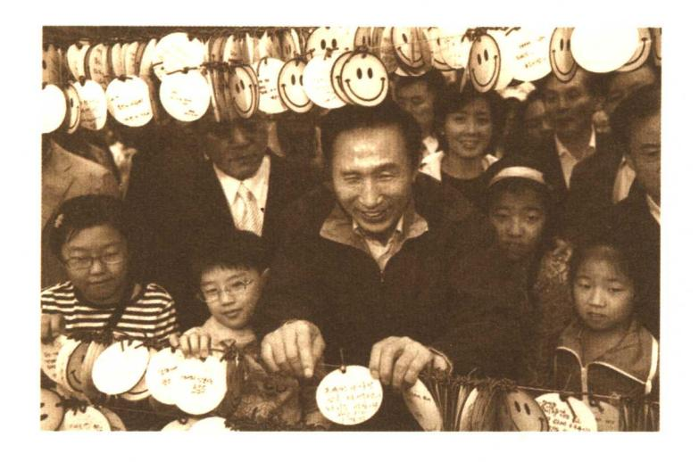

{238}------------------------------------------------

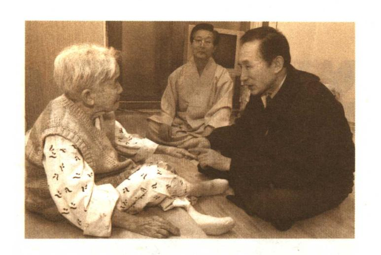

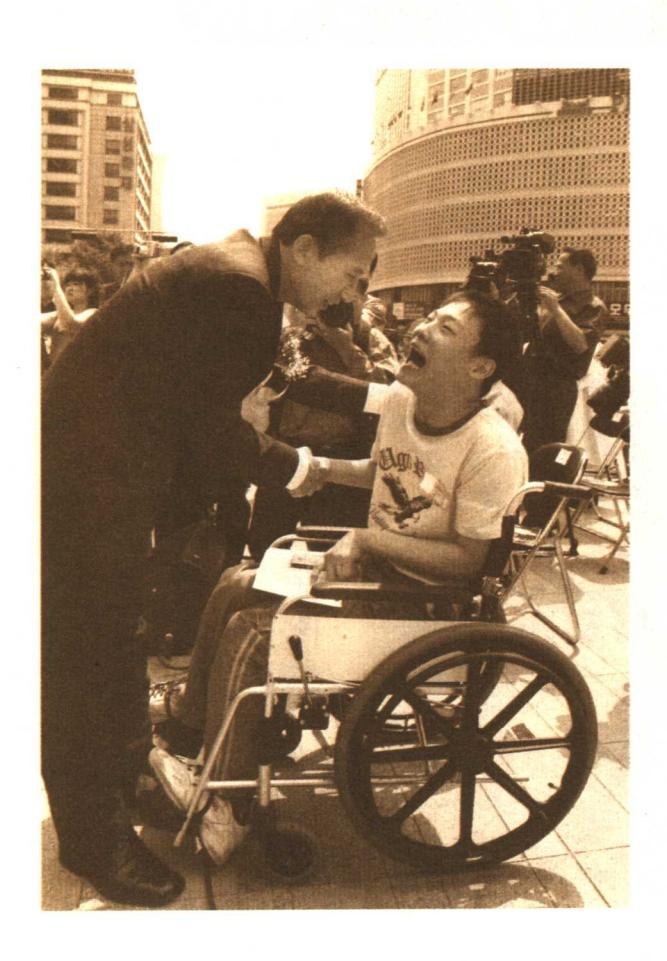

{239}------------------------------------------------

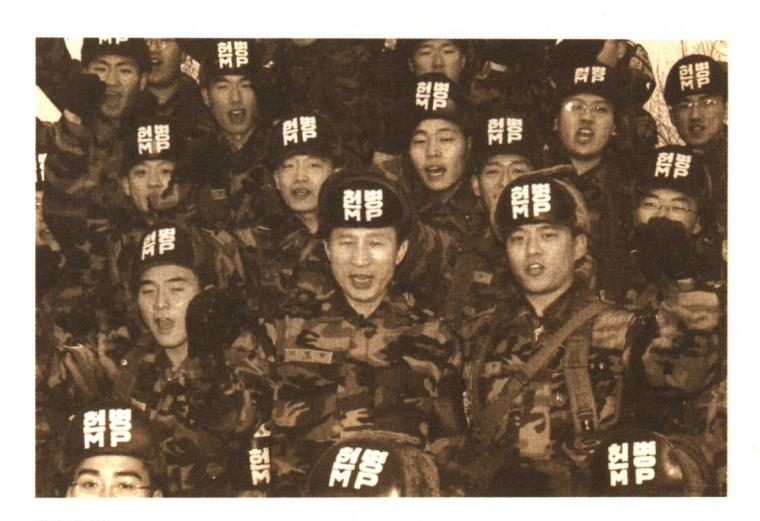

访问军营

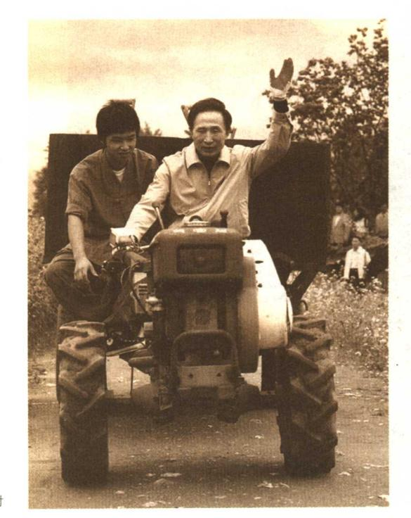

访问农村

{240}------------------------------------------------

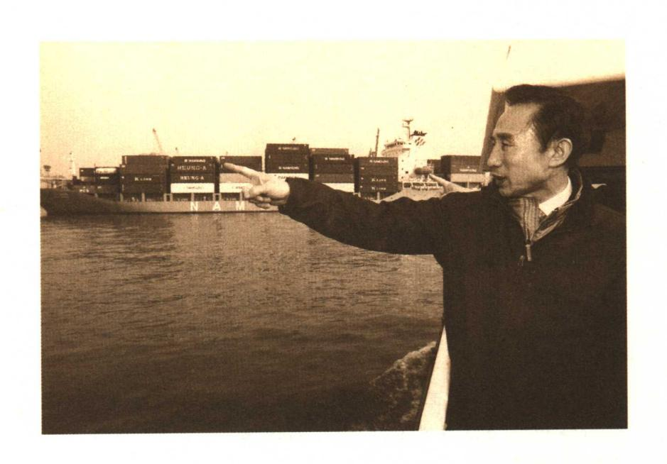

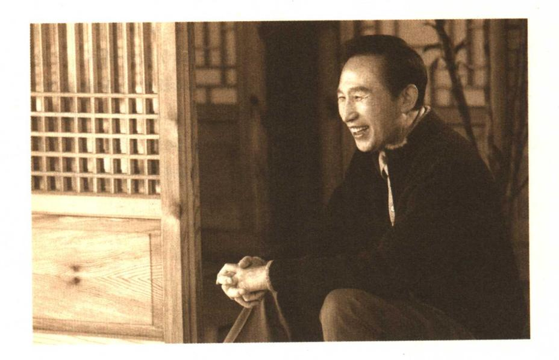

{241}------------------------------------------------

卸任首尔市长后,政绩卓著的李明博决定参加韩国总统 选举。他用一年多时间,考察了欧洲的运河政策和科学城市、 美国的大城市行政、迪拜的城市革命,努力寻找着大韩民国 成长的动力。

在2007年5月正式开始的大国家党党内预备竞选中, 李明博和朴谨惠成为最具实力的候选人。8月20日,李 明博最终赢得党内预选,正式成为大国家党第17届总统 候选人。

李明博领导才能的源泉,是在战胜极度贫困的过程中形成的白手起家的斗志,是领导一个员工不足百名的中小企业成长为拥有超过16万员工的大型跨国企业的挑战精神,是在首尔公务员组织中注入经营意识、提高行政效率的革新精神。

与此相契合,韩国国民对李明博最大的期待是"振兴经济"。在总统竞选中,李明博提出了旨在加强市场竞争、实现经济增长的"747发展计划",即:韩国将实现7%的年均

{242}------------------------------------------------

经济增长率,10年后人均收入达到4万美元,韩国将发展为世界第7大经济体。其具体设想为:开凿连接首尔和釜山的"韩半岛大运河",帮助建立以釜山、大邱、光州、大田为中心的广域经济圈,实现地区均衡发展;削减福利服务行业的工作岗位,转而向各界人士提供创业基金;减少大企业的营业税和经营限制,推动国营银行私有化;稳定中产阶级数量,建立"温暖的市场经济";允许大学实行自主招生,要求政府负担贫困家庭的教育费用;在全国范围内建立国际科学与商业城市,通过提升设计与创新能力,增加制造业的竞争力等。

2007年12月19日,第17届韩国总统选举结果最终揭晓: 总投票数23732854票,李明博获得了其中的11492389票。 李明博以48.7%的高支持率,当选为韩国新一届总统。

曾经创造了"工薪族神话"、"清溪川神话"的李明博,实现了其精彩人生中最耀眼的一次飞跃。

{243}------------------------------------------------

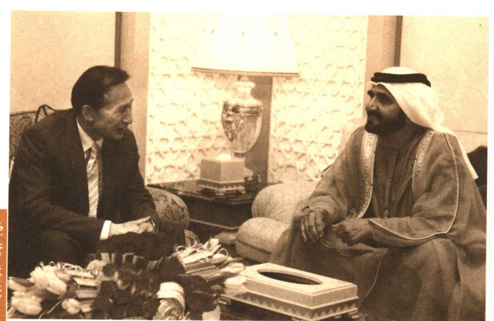

与谢赫・穆罕默德在一起

访问纽约

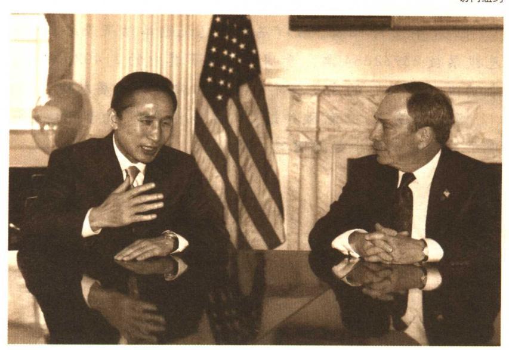

{244}------------------------------------------------

会见安倍晋三

会见卡拉姆

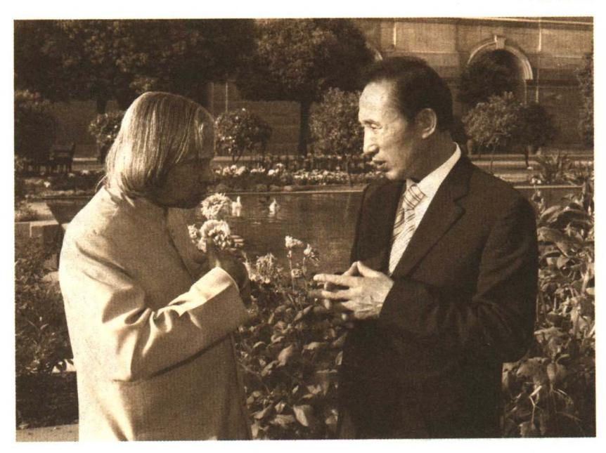

{245}------------------------------------------------

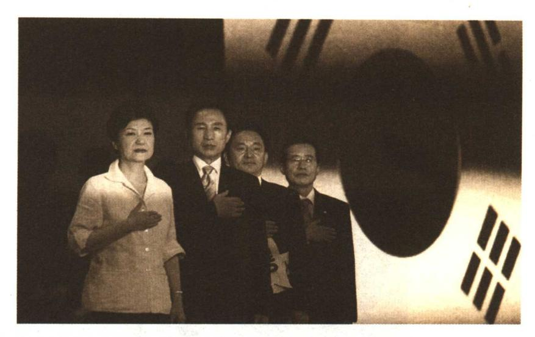

大国家党党内竞选人在一起

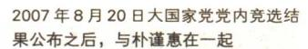

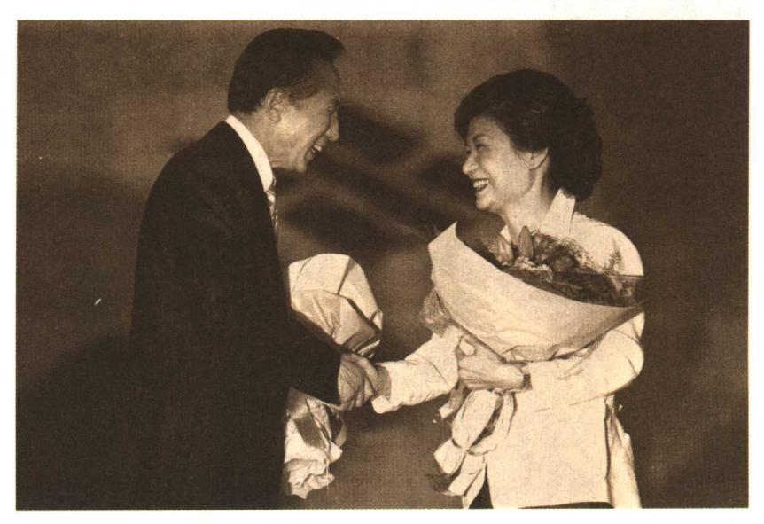

{246}------------------------------------------------

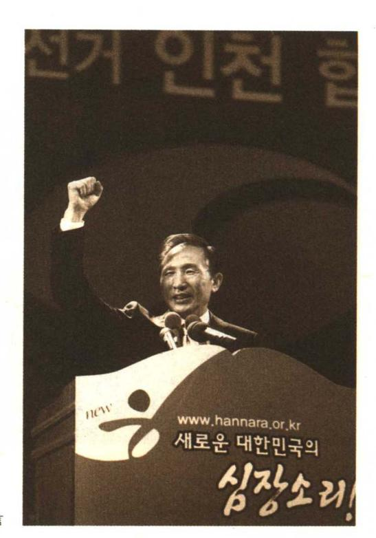

参加第 17 届总统选举宣言

总统选举游说

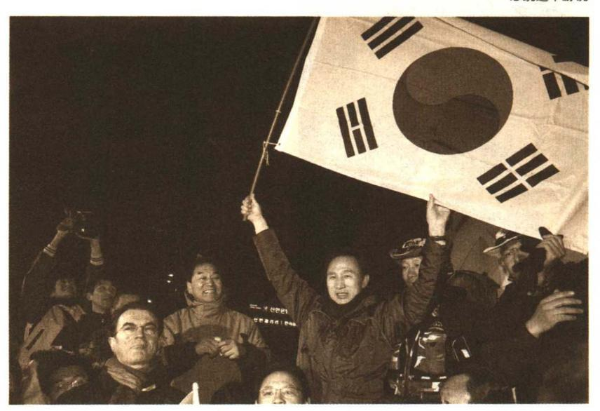

{247}------------------------------------------------

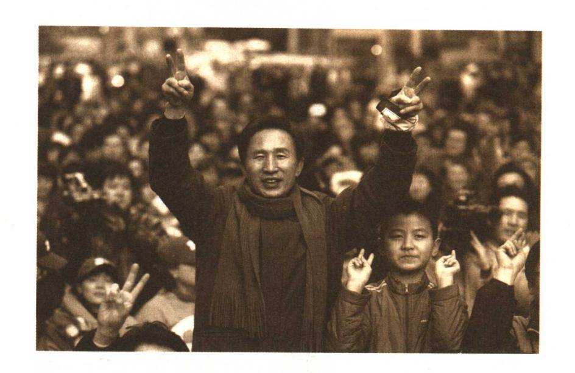

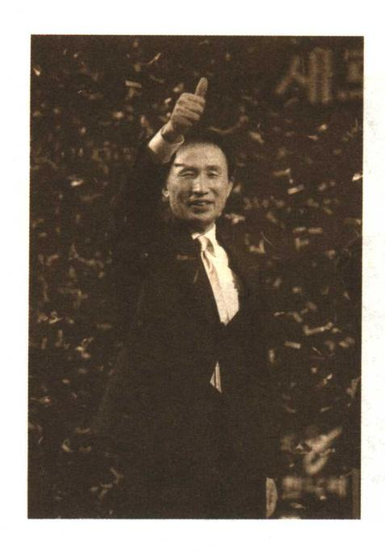

{248}------------------------------------------------

韩国中央选举管理委员会颁发给 李明博的总统当选证

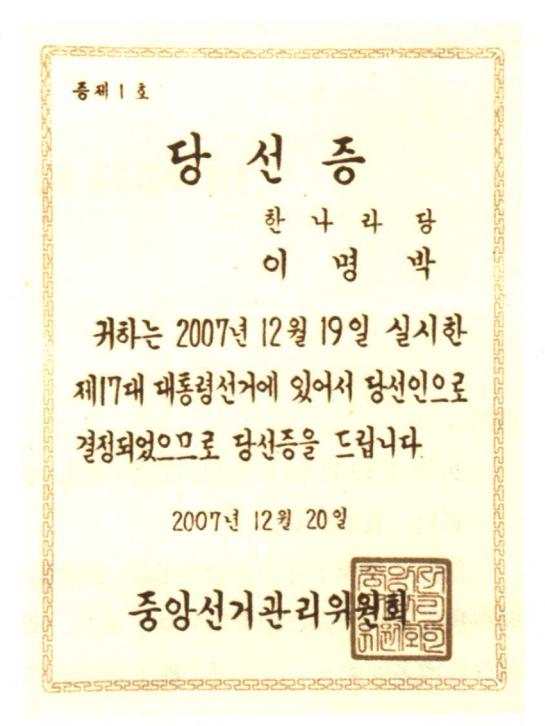

李明博当选总统后参拜国立 墓地时的留言:为国民奉献, 给国民希望

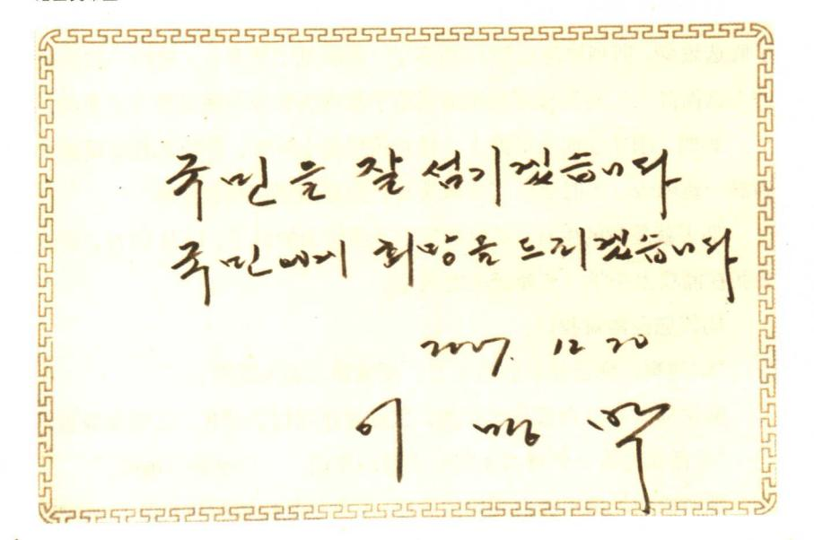

{249}------------------------------------------------

### 给妈妈的信

妈妈:

2007年12月20日凌晨的这个时间, 我呼唤您。

妈妈,我的妈妈。

您的儿子成了这个国家的总统。就像我小时候您经常教导我的那样, 现在我成了一个真正能帮助邻居、老人、弱者、需要工作的年轻人、皱 纹日益增多的家长、白天工作晚上学习的产业主力军以及这个国家所有 国民的人。

昨天晚上确定当选的10点左右,我在汝矣岛大国家党竞选总部发表了胜选致辞,回到家时已经12点多了。其间见了很多人,他们一致为我的当选而高兴,而我却深深感悟到给予我的历史使命将是更大更重的。

妈妈,刚才在回家的路上,我突然想起小时候,您微笑着给我盛了 满满一碗米饭,当时虽然您是微笑着,但眼睛里却含着泪水……

那天就是我的生日,是妈妈您给予我生命的日子,12月19日。应该 是我在浦项上小学二三年级的时候吧。

妈妈您经常对我说:

"明博啊,你已经长这么大了,该懂得为别人做事了。"

哪家邻居有红白喜事之类的,您总是让我过去帮忙,还叮嘱我说:

"干活卖力点,但绝对不能吃人家的东西,一口水也不能喝。"

那时候我虽然不明白妈妈的意思,但我还是按您的话去做了。其实,

{250}------------------------------------------------

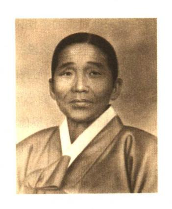

在别人家碰钉子的次数也不少,但我怕妈妈您难过,没告诉您。有的人家以为我不是去帮忙,而是去混饭吃的,所以看我的目光都是冷冰冰的。我觉得委屈,心里也抱怨过,但是后来,我懂得了妈妈的心意。虽然我们很穷,但我们还是可以堂堂正正地去帮助别人,甚至帮助富人。在时时刻刻担心温饱的处境中,妈妈把我培养成了一个心灵富足的人。所以后来在社会上,无论遇到多么位高权重的人,我都可以毫不畏缩、堂堂正正地说出自己的信念。

在小时候那么贫穷的状况下还能对邻居有所帮助,这一点让我养成了很好的习惯,即不是从他人那儿得到些什么,而是相反的给予别人的习惯。把别人的困难当成自己的那种助人为乐的态度也是因为有了当时的体验。正是从那时候起,我养成了设身处地为他人着想的习惯。

妈妈,如果不是您的教导,我怎么能在一生中遇到那么多帮助我的人呢?您的那句"和从别人那儿得到相比,给予别人才是更幸福、更有价值的"的话,比起这世界上任何学校的教育更有价值。

妈妈,您还记得那一年,我因为"6·3"示威活动被关进西大门监狱,您来探视我的情景吗?

见面后您就问我:"你学习吗?祷告吗?读《圣经》吗?" 妈妈,我永远记得您当时含着眼泪的样子,我知道这三个问题是您 

{251}------------------------------------------------

内心最深处对我的牵挂,是我平生难以忘记的冲击性话语。

然后,您只对我说:"我相信你。按照自己的信念去做吧,我会为你 祈祷的。"没有问一句我的身体、我在狱中的情况,您就转身走了。

妈妈,我永不能忘记您的祈祷:

"我们的博,希望他健康成长。"

从我出世,到您离世,二十多年如一日,每天凌晨为我祈祷。正是 这祈祷,成就了今天的我。到现在,您的那些祷告还在我的耳边萦绕着。 每当想起妈妈的那祷告,我就精力充沛。

您对我的教导几十年来一直鞭策着我。我在12月7日发表了捐出全部财产回报社会的声明,也是因为有您的教导。有人嘲笑说这是为总统选举拉票而玩弄的权术,但您知道我不是这这种人。我会遵守这个约定的,因为这也是跟您的约定啊。

请妈妈监督我。

我要遵照您的话,做一个为国家献身、没有任何私心的总统。

我将要做的事情很多:

我要用战胜不堪回首的贫穷的经验,建设一个让那些努力工作的人能成功的国家,

要在这个国家消除贫穷, 让所有人都过上幸福的生活,

要把国民放在首位服务于他们,让我们的国家充满生机;

要使我们国民朝着再次繁荣的目标奋勇前进。

妈妈, 我会一直在前面, 竭尽全力飞奔的。

只要我还有些力气, 我会不停息地奔跑的。

妈妈,我爱你!

2007年12月20日凌晨 明博

{252}------------------------------------------------

### 李明博小档案

身高: 173cm

体重: 70kg

血型: B型

宗教信仰: 基督教

家庭: 夫人金润玉及一子三女

爱好: 打网球、看电影

尊敬的人: 安昌浩 (韩国抗日爱国志士)、甘地

儿时的梦想: 教师、消防员

视力: 左 1.0, 右 1.0

身体秘密: 胳膊比一般人长一个手掌的长度

酒量: 啤酒一瓶

吸烟量: 不吸烟

喜欢的食物:豆腐汤、泡菜汤、拌饭、意大利面

一个月的零用钱。 钱包里经常有现金 10 万元左右(为了在自由

市场买炒年糕等零食)

评价下属的标准: 创造力、积极性(正直、诚实是根本)

读书: 平时读书量较大,总统选举期间读书较少,最 近恢复原有读书量 

{253}------------------------------------------------

人际关系中最重要的是: 信任

对婚姻的看法: 合二为一

我认为的幸福: 和睦的家庭, 温暖的社会

最感谢的人: 妈妈、送我上夜校的老师

最后悔的事: 妈妈生前没给她买过一件新衣服

最不能忘记的朋友: 贫穷时给过我力量的几个人

最羡慕的人: 一边打喜欢的网球、一边挣钱的莎拉波娃

做得最有信心的食物: 煮方便面是内行水平

一天中最幸福的时候: 深夜看有线电视上的电影时

最不想失去的三个方面: 家庭、健康、朋友

自己最帅的时候: 和二三十岁的年轻人打网球时

最难堪的经历: 高中时在女校前卖爆米花

{254}------------------------------------------------

### 出版后记

### 人民出版社社长 黄书元

《经营未来:李明博自传》历经几个月的精雕细琢,终于和中国广大读者见面了。作为该书的出版人,我们的内心充满着欢欣。中国有一句老话叫"有志者,事竟成"。如果你细细品读此书,就不难发现这样的警句格言不仅属于中国,也属于韩国,属于世界。

读罢此书,我们不禁深深感佩于李明博先生在书中所传达的一种信念和精神:一种怀揣志向和梦想、遇到挫折绝不放弃的精神,一种在困境中总是拼尽全力去挑战、去奋斗的精神。在此,我们也不禁想提起另一位有着类似精神气质的韩国友人——拓荒建苑的"愚公"成范永先生。

2007年,在中韩建交十五周年之际,我们应韩国"思索之苑"的创建 人成范永先生邀请,参加该苑正式开放十五周年庆典。成范永先生从青年 时期起为了实现建造一个盆景艺术苑的理想,放弃在首尔的舒适生活,单 身一人来到当时还是乱石荒岗的济州岛,开荒建苑,克服常人难以想象的 艰难困苦,终于在十五年前建成了世界一流的盆景艺术苑。中国两任国家 主席江泽民、胡锦涛同志以及世界许多名人都曾先后参观过该苑。可以说, 成范永先生是一个追求理想、为了理想而奋斗并最终实现理想的典范。也 许是由于"英雄相惜",在访韩期间,成范永先生特意向我们提起和介绍了 在韩国已经家喻户晓的传奇人物李明博先生的有关事迹。我们也由此产生 了把李明博先生的奋斗精神和独特经历全面介绍给中国读者的愿望。

在李明博先生当选为韩国第17届总统前夕,我们见到了《经营未来:李明博自传》的中文译稿。书稿内容读来是如此真切和动人心弦,不仅有在韩国民众中流传的传奇故事,更有传主在经历这些故事时的心路历程和理性思考。我们希望中国广大读者特别是青年朋友们能够在本书中得到启迪,更希望中国有千万个自强不息的人物成长起来。我们热忱地祝福韩国在李明博先生的领导下更加强盛!祝福中韩两国合作伙伴关系得到进一步发展!